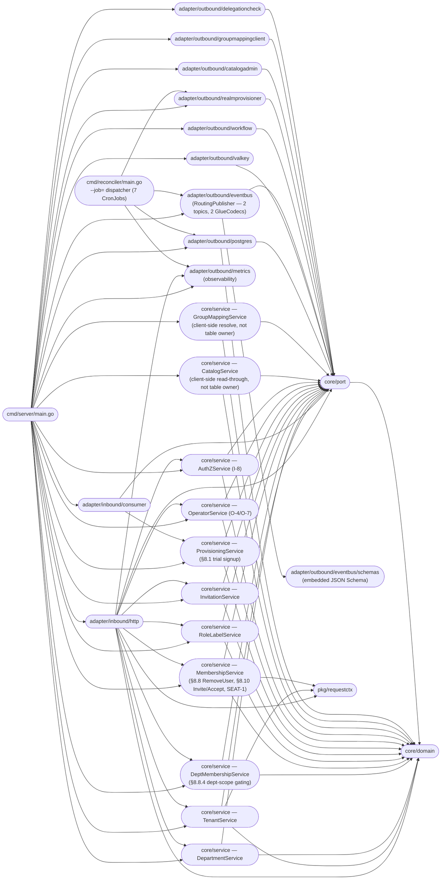
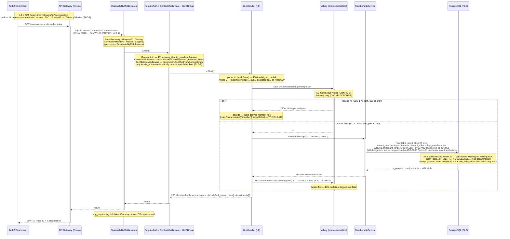
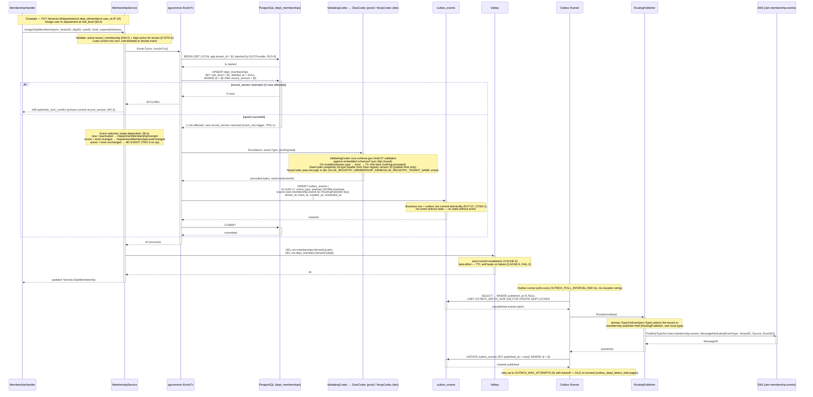
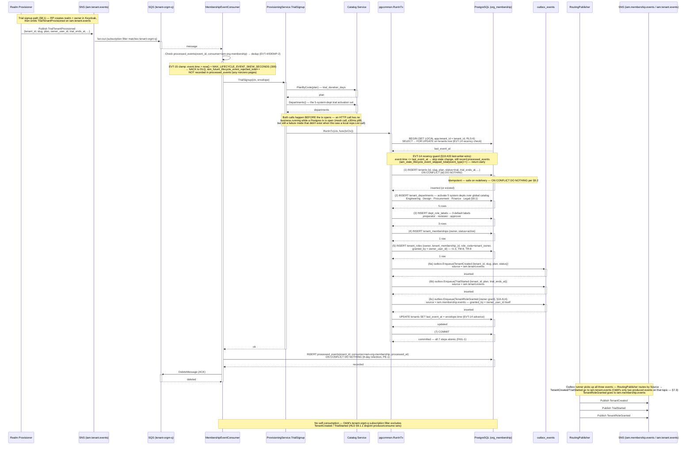
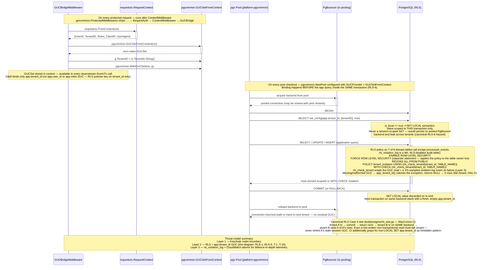
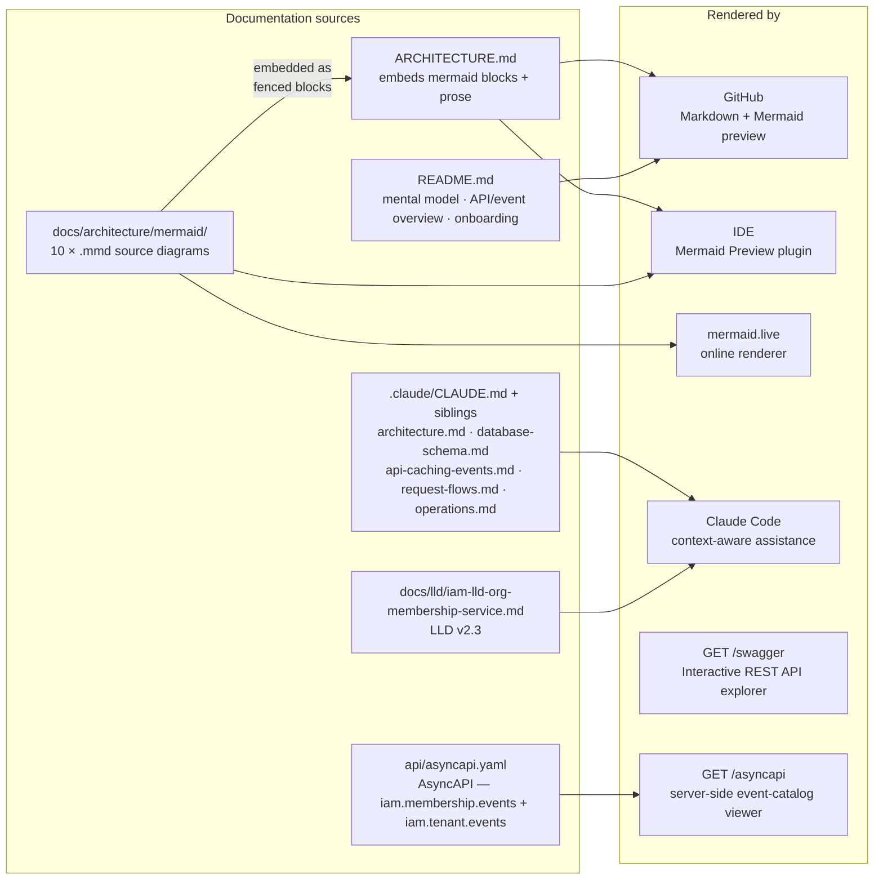

# Architecture

This document describes the internal structure, dependency rules, and runtime data flows of `iam-org-membership`.

`iam-org-membership` is a **private Go service** (`github.com/BCBP-SOLUTIONS-FZC-LLC/iam-org-membership`, Go 1.26.6) deployed as a containerised microservice (HPA 2–8 replicas), refining **IAM HLD v1.41 §5.6** (LLD v2.3, `docs/lld/iam-lld-org-membership-service.md`; where LLD and HLD disagree, HLD is authoritative). It owns the **organizational layer** of the IAM platform — tenants, department activation, tenant/department memberships, tenant-level role grants, and the invite→accept staging flow — and is the source of truth AuthZ Enrichment reads on **I-8** (`GET /api/v1/internal/users/:id/memberships`), the hottest path in the system, hit on every authenticated request (SLO 15 ms p99 hit / 30 ms p99 miss). It ships as **two binaries from one image**: `cmd/server` (the full HTTP surface — public/internal/operator — plus two inbound SQS consumers and the transactional outbox runner) and `cmd/reconciler` (a single binary dispatched by `--job=<name>`, covering 7 CronJobs).

This repo is mid-way through a **service decomposition** (ADR-0007 + ADR-0008): departments/plans catalog ownership moved to Catalog / Admin Config Service, SAML group→dept/role mapping moved to Group Mapping / JIT Config Service, tender ACL overlays moved to Tender ACL Service, and delegation grants + OOO coordination moved to Delegation Service. This repo — "Core" — is what's left after all four extractions; the removal has already landed on this branch (pre-production, no staged expand/contract needed).

**Does not own:** credentials, MFA enforcement, JWT issuance (Keycloak); display identity, signature, OOO presentation flag (User Profile); global department catalog / plan entitlement catalog (Catalog / Admin Config Service); group→dept/role JIT mapping tables (Group Mapping / JIT Config Service); tender ACL overlay `tender_acl_entries` (Tender ACL Service); delegation record/lifecycle/policy/events `delegations` (Delegation Service); realm/Keycloak Admin API mutations (Realm Provisioner — this service **never** calls Keycloak); workflow template authoring or `assignee_overrides` state (Workflow Service); audit records (Audit Log); pricing/currency (Billing).

---

## Layer model

The service is organised in concentric Clean Architecture layers. Inner layers have **zero knowledge** of outer layers; dependencies always point inward.

> Source: [`docs/architecture/mermaid/layer-model.mmd`](docs/architecture/mermaid/layer-model.mmd)

```mermaid
graph TD
    subgraph cmd["Composition Roots  —  cmd/"]
        main["server/main.go\nwire all dependencies\npgcommon.NewPool with GUCProvider = GUCSetFromContext (RLS-6)\nrouter registration + gincommon.DefaultMiddlewares\n4 in-process metric exporters (ticker goroutines):\n  iam_tenant_ownerless · iam_realm_sync_pending\n  iam_seat_overage_active · iam_pending_invitations_stale\nRoutingPublisher (2 SNS topics, each with its own GlueCodec) + outbox runner\ngraceful shutdown: SIGTERM → gincommon.Shutdown, terminationGracePeriodSeconds=75"]
        swagger_info["server/swagger_info.go\nSwaggo API metadata annotations"]
        reconciler["reconciler/main.go\nsingle binary, --job=<name> dispatch\nselects one of 7 CronJobs (§13.1):\n  invitation-expiry · invitation-kc-cleanup\n  realm-config-sync · seat-overage-reconcile\n  trial-cleanup · outbox-prune · processed-events-prune"]
    end

    subgraph adapters_in["Inbound Adapters  —  internal/adapter/inbound/"]
        http_h["http/\nTenantHandler · DepartmentHandler · DeptMembershipHandler\nMembershipHandler (DELETE pre-check; P-26 removal-resolution;\n  P-6/P-30/P-31 invite lifecycle; P-27 seat-usage)\nRoleLabelHandler · InvitationHandler · OperatorHandler · InternalHandler\nrouter.go · dto.go · docs.go / asyncapi.go (serves embedded api/asyncapi.yaml)"]
        consumer["consumer/\nMembershipEventConsumer\ntenant-orgm-q ← iam.tenant.events (RP lifecycle)\nbilling-orgm-q ← billing.events (Billing lifecycle)\nEVT-14 recency guard · EVT-15 future-time clamp\nEVT-16 TenantStateChanged relay (§16 A61)\nport.IdempotencyStore — MarkProcessedInTx joins the same tx as EVT-14"]
    end

    subgraph adapters_out["Outbound Adapters  —  internal/adapter/outbound/"]
        postgres["postgres/\nTenantRepository · TenantDepartmentRepository\nMembershipRepository · TenantRoleRepository\nDeptMembershipRepository · DeptRoleLabelRepository\nInvitationRepository · IdempotencyRepository · AuthZRepository · ReconcilerStore\nTxRunner · OTelTracer\nOptimistic locking (record_version) on 7 of 8 domain tables (TRG-1)\nmigrations/ — single consolidated 000000_initial_schema"]
        valkey["valkey/\nCacheAdapter (go-redis/v9) — advisory only (CACHE-2/CACHE-9)\n50ms read/write timeout hardcoded, no env var\nWorking caches: om:memberships · om:tenant · om:plans/departments (+:stale)\nom:grm/gdm/gtrm (+:stale)\nDeclared, not populated: om:members · om:roles · om:locale · om:dept_members · om:seat_usage"]
        eventbus["eventbus/\nRoutingPublisher (own local type, not platform-events)\n  routes by domain.TopicForEvent(env.Type) →\n    iam.membership.events (12 events)\n    iam.tenant.events (2 events: TenantCreated, TrialStarted)\nOutbox runner · ValidatingCodec (enqueue-time) · GlueCodec ×2 (publish-time, v1.4.0 events.WithCodec)\nschemas/*.json embedded via //go:embed"]
        workflow["workflow/\nport.WorkflowClient impl (HTTP, §8.8 — talks to Workflow Service,\n  unrelated to the delegation-domain extraction)\nGetDelegateImpact · ReassignDelegate · CancelByDelegate\nWORKFLOW_TIMEOUT_MS=3000"]
        rp["realmprovisioner/\nport.RealmProvisionerClient impl (HTTP)\nCreateInvitedUser (§8.10) · DeleteUser (idempotent, PI-9)\nPatchRealmConfig (T-15) · RevokeUserSessions (AUTH-8 fail-open) · ResetMFA (RP-9 fail-closed)\nREALM_PROVISIONER_TIMEOUT_MS=3000"]
        catalogadmin["catalogadmin/\nport.CatalogAdminClient impl (HTTP)\nGET /internal/plans · GET /internal/departments\nADR-0007 Wave 1, NOT fail-open — catalog_unavailable on cold-cache+failure\nCATALOG_ADMIN_TIMEOUT_MS=3000"]
        groupmappingclient["groupmappingclient/\nport.GroupMappingClient impl (HTTP)\nPOST /internal/tenants/:id/group-resolution (I-10 JIT)\nADR-0007 Wave 2, fails OPEN (empty resolution)\nGROUP_MAPPING_TIMEOUT_MS=300"]
        delegationcheck["delegationcheck/\nport.DelegationCheckClient impl (HTTP)\nGET /internal/delegations/dept-delegate (§8.8.4 precision lookup)\nADR-0008, fails OPEN to tenant-wide impact scoping\nDELEGATION_TIMEOUT_MS=300"]
        metrics["metrics/\nbusiness.go — 16 counters, 2 histograms, 4 gauges (all iam_-prefixed):\niam_delegate_removal_blocked_total{scope} · iam_seat_limit_reached_total{plan}\niam_stale_lifecycle_event_skipped_total (EVT-14) · iam_future_lifecycle_event_rejected_total (EVT-15)\niam_tenant_ownerless (gauge) · iam_realm_sync_pending (gauge) · iam_seat_overage_active (gauge)\niam_pending_invitations_stale (gauge) · iam_lifecycle_consumer_lag_seconds (histogram)\niam_xsvc_call_latency_seconds{service,endpoint} · iam_xsvc_call_errors_total{service,endpoint,outcome}"]
    end

    subgraph eventschema_grp["Embedded Schemas  —  eventbus/schemas/"]
        eventschema["schemas/*.json\nJSON Schema Draft-07, one file per event type\nDerived via schema-gov extract from api/asyncapi.yaml\n//go:embed → ValidatingCodec fail-closed on invalid payload"]
    end

    subgraph core["Core  —  internal/core/"]
        service["service/\nTenantService · DepartmentService · RoleLabelService\nMembershipService (§8.8 RemoveUser + delegate-impact pre-check;\n  §8.10 Invite / AcceptInvitation; SEAT-1; TM-8/TM-12/TM-13)\nDeptMembershipService (§8.8.4 dept-scope gating)\nProvisioningService (§8.1 trial signup) · OperatorService (O-4/O-7)\nAuthZService (I-8, depends on port.AuthZRepository, not *pgcommon.Pool)\nSubscriptionLapseService (I-16, RP-C3 — MUST be sysPool-bound)\nCatalogService — CLIENT-SIDE read-through, NOT a table owner\nGroupMappingService — CLIENT-SIDE resolve, NOT a table owner"]
        port["port/\nTenantRepository · TenantDepartmentRepository · MembershipRepository\nTenantRoleRepository · DeptMembershipRepository · DeptRoleLabelRepository\nInvitationRepository · AuthZRepository · ReconcilerStore\nCache · EventPublisher · TxRunner · IdempotencyStore · Logger\nWorkflowClient · RealmProvisionerClient · CatalogAdminClient\nDepartmentCatalogReader · PlanCatalogReader · GroupMappingClient · DelegationCheckClient\n(no UserProfileClient — removed as dead code, §16 OQ-5)"]
        domain["domain/\nTenant · Department · Plan · TenantMembership · DeptMembership\nTenantRoleCode · DeptRole · GroupDeptMapping/GroupDeptRoleMapping/GroupTenantRoleMapping\n  (read-through cache result types, not local tables)\nPendingInvitation · DomainEvent payload types\nDomainError catalogue (sentinels grouped by §17 status family)\n(no Delegation, no TenderACLEntry — tables moved to sibling services)"]
    end

    subgraph pkg["Shared Packages  —  pkg/"]
        requestctx["requestctx/\nRequestContext{UserID, TenantID, Roles, ClientIP, UserAgent}\nWithContext · FromContext · HasRole · IsOperator · IsSystemPrincipal"]
    end

    subgraph tests["Tests  —  test/"]
        unit["unit/\nmembership_removeuser_test.go / membership_removal_test.go (§8.8 delegate-impact)\ninvitation_service_test.go / invitation_scenarios_test.go (§8.10)\nauthz_service_test.go (I-8, fully Docker-free — fakes port.AuthZRepository)\nvalidator · domain · port mocks (testify/mock)"]
        postgres_t["postgres/\nrls_test.go — Case 5 (RLS-6, pooled backend, no GUC leak)\nsubscription_lapse_test.go (I-16, cross-tenant BYPASSRLS read)\nconsumer_evt_test.go — EVT-14/15/16 · services_test.go — TM-12/T-15\nconcurrency_extra_test.go — SEAT-1/TM-13 races"]
        integration["integration/\ncross-layer testcontainers (PG + Valkey + LocalStack SNS/SQS)\nrelay_test.go — EVT-16 wire path · dlq_idemp_test.go — DLQ + dedup"]
        e2e["e2e/\nharness_test.go — full router wired through the real NewRouter, no route-table drift possible"]
    end

    main        --> http_h
    main        --> consumer
    main        --> postgres
    main        --> valkey
    main        --> eventbus
    main        --> workflow
    main        --> rp
    main        --> catalogadmin
    main        --> groupmappingclient
    main        --> delegationcheck
    main        --> metrics
    reconciler  --> postgres
    reconciler  --> eventbus
    reconciler  --> rp
    reconciler  --> metrics
    http_h      --> service
    http_h      --> port
    http_h      --> requestctx
    http_h      --> metrics
    consumer    --> service
    consumer    --> port
    service     --> port
    service     --> domain
    service     --> requestctx
    postgres    --> port
    postgres    --> domain
    valkey      --> port
    eventbus    --> port
    eventbus    --> eventschema
    workflow    --> port
    rp          --> port
    catalogadmin --> port
    groupmappingclient --> port
    delegationcheck --> port
    port        --> domain
    unit        -.->|"imports"| service
    unit        -.->|"imports"| domain
    postgres_t  -.->|"imports"| postgres
    integration -.->|"imports"| http_h
```



**Rule:** `domain` ← `port` ← `service` ← `adapter` ← `cmd`. `core/service` may also import `pkg/requestctx` and `internal/adapter/outbound/metrics` (`.go-arch-lint.yml`'s documented cross-cutting `observability` component — `membership_service.go`, `catalog_service.go`, `provisioning_service.go`, `group_mapping_service.go` all import it directly to record business-outcome counters at the point of the outcome, matching the sibling-service convention). Nothing else in `core/` imports `adapter/`. Enforced in CI by `go-arch-lint` (`.go-arch-lint.yml`, `deepScan: false` — import-level checks only, since a composition root wiring an adapter into a service constructor in `main.go` is how Clean Architecture is supposed to work, not a violation) plus a CI grep in `.github/scripts/arch-lint.sh` for **RLS-6** (`SET app\.tenant_id` must only ever appear as `SET LOCAL`).

**A violation that's been fixed twice now — watch for it recurring.** `internal/adapter/outbound/eventbus/publisher.go` used to import `internal/adapter/outbound/postgres` directly (for `pgadapter.TxFromContext`, so `Enqueue` could find the active `pgx.Tx` and insert into `outbox_events` on the same transaction as the business write) — a cross-adapter dependency `adapters_outbound`'s `mayDependOn` list (`port`/`domain`/`eventschema`/`observability`/`httptransport`) forbids. Fixed by moving `WithTx`/`TxFromContext` (and the underlying context key) into `internal/core/port/tx_runner.go` — `postgres.WithTx`/`postgres.TxFromContext` remain as thin re-export wrappers so existing test call sites keep compiling, and `eventbus/publisher.go` now calls `port.TxFromContext(ctx)` directly, same as `service` already does with `port.TxRunner` rather than `postgres.TxRunner`. This exact fix has had to be reapplied once already: it originally landed only in an uncommitted working tree, and got silently overwritten when unrelated external commits landed mid-session and reintroduced the direct `postgres` import. `go-arch-lint check --project-path .` currently reports **zero violations** — but given the history, re-verify this specific import hasn't drifted back before trusting this paragraph. `.go-arch-lint.yml` also now declares two components that used to be missing (previously surfacing as "file not attached to component" notices): `httptransport` (`internal/adapter/outbound/httpx`) and `reconciler_jobs` (`cmd/reconciler/jobs`, one file per CronJob) — plus `tools` is excluded from linting entirely.

---

## Package dependency graph

Arrows represent Go `import` relationships (module-internal only) — this graph mirrors `.go-arch-lint.yml` component-by-component.

> Source: [`docs/architecture/mermaid/package-dependencies.mmd`](docs/architecture/mermaid/package-dependencies.mmd)



`core/domain` is the dependency sink (`anyVendorDeps: true`, no internal imports). `core/port` may depend on `domain` only. `requestctx`, `eventschema` (`internal/adapter/outbound/eventbus/schemas`), and `apispec` (`api/`, embedding `api/asyncapi.yaml` via `api/embed.go`) are standalone leaves with `anyVendorDeps: true`. `test/`, `scripts/`, and `deploy/` are excluded from the linter's scope entirely (`exclude: [test, scripts, deploy]`), so `test/e2e/harness_test.go`'s dependency on `internal/adapter/inbound/http` is not part of the checked runtime graph. `docs_swagger` (`docs/swagger`, the `make swag`-generated output blank-imported in `cmd/server/main.go`) is declared purely so arch-lint doesn't flag that import.

---

## Request flow

Every HTTP request passes through the full middleware stack before reaching a handler. The public API sits behind gateway-injected identity headers (`x-user-id`/`x-tenant-id`/`x-tenant-roles`, no JWT parsing in this service); `/api/v1/internal/*` additionally requires the `iam-system` role and is reachable only over the mesh.

> Source: [`docs/architecture/mermaid/request-flow.mmd`](docs/architecture/mermaid/request-flow.mmd)



**Middleware execution model.** The router (`internal/adapter/inbound/http/router.go`, `NewRouter`) is the single source of truth for every path, method, and middleware — shared by `cmd/server/main.go` and `test/e2e/harness_test.go`, so the two can never drift the way a hand-copied route table historically did:

```
1 MB body cap (inline func)
  gincommon.TimeoutMiddleware(30s)
    gincommon.ObservabilityMiddlewares (PanicRecovery · RequestID · Tracing · CorrelationHeaders · Metrics · Logging)
      NormalizeAuthErrors()                      — G-13: adds a `code` field to gincommon's bare 401 body
        [/api/v1 group] gincommon.ProtectedMiddlewares (RequireAuth · ContextMiddleware)
          GUCBridgeMiddleware                    — binds pgcommon.WithGUCSet(ctx), RLS-6
            RequireJSONContentType               — 415 on a non-JSON POST/PUT/PATCH body
              [/tenants group] RequireActiveTenant · RequireActiveMembership   — TRIAL-4/§16 A53, public routes only
              [/operator group] RequireOperatorRole                            — AUTH-6
              [/internal group] RequireSystemRole                              — AUTH-5/IAPI-2
                Handler ← executes here
```

`/healthz` and `/readyz` (`registerInfraRoutes`) and the docs surface (`registerDocsRoutes`, gated by `DocsConfig.active()`) are registered **before** this chain, so a load-balancer probe with no headers still gets `200`. `/healthz` is pure liveness — it never inspects a dependency; `/readyz` checks the app Postgres pool, the `sysPool` (BYPASSRLS, a separate physical connection so a credential rotation on that role alone is caught), Valkey, and the outbox runner (`select` on its `Ready()` channel), returning `503` on any failure. `RequireActiveTenant`/`RequireActiveMembership` bypass `iam-system` and `platform_operator` principals — those internal/operator control paths must be able to reach a `trial_expired`/`suspended` tenant to restore it.

---

## Write flow and transactional outbox

Every mutating operation commits its business-table write and its outbox event(s) inside **one** `pgcommon.RunInTx` — no event without state, no committed state without an event (EVT-10, CONS-1). Unlike Realm Provisioner's Keycloak-effect-first discipline, this service's writes are pure Postgres transactions from the caller's perspective; the one place an external effect sits outside the transaction is invite/removal's Realm Provisioner call, always issued **after** the local commit so a partial failure never leaves a local row with no corresponding Keycloak side-effect intention already recorded.

> Source: [`docs/architecture/mermaid/write-flow.mmd`](docs/architecture/mermaid/write-flow.mmd)



`Publisher.Enqueue` (`internal/adapter/outbound/eventbus/publisher.go`) marshals the payload, runs it through the `ValidatingCodec` for **schema validation only** (the returned bytes are discarded — the outbox always stores plain JSON), builds an `events.Envelope` carrying `tenant_id`/`trace_id`/`ip_address`/`user_agent`/`actor`/`subject`, and inserts it via `outbox.Enqueue(ctx, tx, env)` against the `pgx.Tx` it retrieves from `port.TxFromContext(ctx)` — the same transaction `TxRunner.RunInTx` opened for the business write. `TxRunner.RunInTx` (`internal/adapter/outbound/postgres/db.go`) additionally retries the whole callback on deadlock/serialization failure via `pgcommon.RunInTxWithRetryOpts` (3 attempts, 10 ms → 500 ms exponential backoff with 25% jitter) and maps any surviving connection-level error to `domain.ErrDBUnavailable` (503) through `wrapConnErr`, so a handler's error branch never has to special-case a transport failure.

---

## Provisioning flow

Tenants enter the system through **I-1**, called by Realm Provisioner (or the Signup BFF) after it has created the realm/owner in Keycloak; a subsequently-consumed `TrialTenantProvisioned` event, if one arrives, is an idempotent no-op reconcile rather than the creation trigger itself.

> Source: [`docs/architecture/mermaid/provisioning-flow.mmd`](docs/architecture/mermaid/provisioning-flow.mmd)



`TrialReactivated` (a `billing-orgm-q` event, not shown above) follows the same shape but resolves `plan.trial_duration_days` via a pre-tx `port.PlanCatalogReader.PlanByCode` call — this mirrors `TrialSignup`'s own pattern and was a deliberate fix: an earlier version of this handler read a local `plans` table subquery that no longer exists post-ADR-0007, which failed on every occurrence until integration tests (added specifically to close that gap) caught it. `AddMember` (I-3, both the SAML JIT-add path and the invitation-acceptance path) and `AssignFromGroups` (I-10) share the same RunInTx-then-outbox discipline; I-10's group→role resolution itself is a `GroupMappingService` client call made **before** the transaction opens, exactly like the two Catalog calls above.

---

## Delegation touchpoints

Core owns **no** `delegations` table and runs no OOO-coordination flow — that entire domain moved to the standalone Delegation Service (ADR-0008). What remains are two narrow, read-only lookups on the user-removal and department-membership paths, both of which degrade rather than hard-fail if their upstream is unreachable.

> Source: [`docs/architecture/mermaid/ooo-delegate-flow.mmd`](docs/architecture/mermaid/ooo-delegate-flow.mmd)

```mermaid
sequenceDiagram
    participant Admin
    participant H as MembershipHandler / DeptMembershipHandler
    participant SVC as MembershipService / DeptMembershipService
    participant DCC as DelegationCheckClient
    participant Delegation as Delegation Service
    participant WFC as WorkflowClient
    participant Workflow as Workflow Service
    participant TX as pgcommon.RunInTx
    participant DB as PostgreSQL

    Note over Admin,DB: Core owns NO delegation table any more (ADR-0008) — the `delegations` row,<br/>its lifecycle, and the OOO/User-Profile coordination flow that used to live here<br/>moved entirely to the standalone Delegation Service. This diagram shows Core's<br/>only two remaining delegation-adjacent touchpoints, both read-only lookups.

    rect rgb(240, 240, 250)
    Note over Admin,DB: §8.8 — full removal (P-8/I-5): tenant-wide delegate-impact gate
    Admin ->>+ H: DELETE /tenants/:id/members/:user_id
    H ->>+ SVC: RemoveUser(ctx, tenantID, userID)
    SVC ->>+ WFC: GetDelegateImpact(tenantID, userID, delegationID=nil)
    WFC ->>+ Workflow: GET /internal/workflows/delegate-impact?tenant_id=&delegate_user_id=
    Workflow -->>- WFC: {active_workflows, workflow_ids[]}
    WFC -->>- SVC: DelegateImpact
    alt active_workflows > 0
        SVC -->>- H: 409 workflow_resolution_required<br/>{active_workflows, workflow_ids, allowed_actions:[replace_delegate, stop_workflows]}
        H -->>- Admin: 409 (no DB write, no event — WFI-3)
    else active_workflows == 0
        SVC ->>+ TX: RunInTx — §15.2.2 cascade
        TX ->>+ DB: soft-delete tenant_memberships/tenant_roles/dept_memberships<br/>+ outbox.Enqueue(MembershipRevoked{tenant_id, user_id, actor_id})
        DB -->>- TX: committed
        TX -->>- SVC: ok
        Note over TX,DB: MembershipRevoked is consumed asynchronously by BOTH the Delegation<br/>Service (ends the user's delegation rows) and Tender ACL Service —<br/>Core never touches either table.
        SVC -->>- H: 204
        H -->>- Admin: 204 removed
    end
    end

    rect rgb(250, 245, 235)
    Note over Admin,DB: §8.8.4 — department demotion/removal (P-10 decrease / P-11): dept-scope precision lookup
    Admin ->>+ H: PUT/DELETE .../departments/:dept_id/members/:user_id
    H ->>+ SVC: AssignDeptMembership / RemoveDeptMembership(ctx, tenantID, deptID, userID)
    SVC ->>+ DCC: DeptDelegate(ctx, tenantID, userID, deptID)
    DCC ->>+ Delegation: GET /internal/delegations/dept-delegate?tenant_id=&user_id=&dept_id=
    alt Delegation Service reachable
        Delegation -->>- DCC: active scope=department delegation.id, or null
        DCC -->>- SVC: *uuid.UUID (delegationID) or nil
    else Delegation Service 5xx/timeout
        Delegation -->>- DCC: error
        DCC -->>- SVC: error
        Note over SVC: Fails OPEN (WFI-11) — degrade to tenant-wide impact scoping,<br/>i.e. call GetDelegateImpact with delegationID=nil instead of failing the request.<br/>Over-blocks/over-acts at worst — never under-blocks, never a hard failure.
    end
    SVC ->>+ WFC: GetDelegateImpact(tenantID, userID, delegationID)
    WFC ->>+ Workflow: GET /internal/workflows/delegate-impact (scoped by delegation_id if present)
    Workflow -->>- WFC: {active_workflows, workflow_ids[]}
    WFC -->>- SVC: DelegateImpact
    Note over SVC: Same 409 workflow_resolution_required / proceed branching as §8.8 above,<br/>just precision-scoped to the one delegation instead of tenant-wide when available.
    end
```

---

## Cache strategy

Valkey is **advisory-only** (CACHE-2/CACHE-9) end to end — a miss, timeout, or outage always falls through to Postgres or the owning upstream service; it never becomes the source of truth for a request. `valkey.New` hardcodes tight timeouts (100 ms dial, 50 ms read/write) rather than reading an env var, on the theory that a slow cache must degrade to a fast miss, not stall the request.

> Source: [`docs/architecture/mermaid/cache-strategy.mmd`](docs/architecture/mermaid/cache-strategy.mmd)

```mermaid
flowchart TD
    subgraph keys["Working Caches — Get+Set (Valkey — ElastiCache via go-redis/v9)"]
        k1["om:memberships:{tenant}:{user}\n→ Full I-8 response (4-table join: status/plan/locale/roles/departments)\nNo active_delegations — dropped under ADR-0008\nTTL: 300 s ± 30 s jitter (CACHE-4, I8-5)"]
        k2["om:tenant:{tenant}\n→ Tenant row (plan, locale, feature_flags, mfa_freshness)\nTTL: 600 s"]
        k3["om:plans (+ om:plans:stale)\n→ Read-through from Catalog Service (catalogadmin client)\nPrimary TTL 600 s; :stale is a SEPARATE 24h-TTL key,\nrefreshed alongside primary, served only when both\nthe primary miss AND the live Catalog call fail"]
        k4["om:departments (+ om:departments:stale)\n→ Read-through from Catalog Service, same 600s/24h two-tier pattern as om:plans"]
        k5["om:grm / om:gdm / om:gtrm {tenant}\n(+ :stale variants)\n→ Read-through from Group Mapping Service (I-10 JIT resolution)\nSame 600s primary / 24h stale-if-error two-tier pattern"]
    end

    subgraph declared["Declared but NOT populated — invalidated on write, never Get/Set (§6.1)"]
        d1["om:members:{tenant}:{limit} — P-4 list handler always reads Postgres directly"]
        d2["om:roles:{tenant} — no read path checks this key"]
        d3["om:locale:{tenant} — I-9 reads through om:tenant instead; this key is vestigial"]
        d4["om:dept_members:{tenant}:{dept} — zero call sites anywhere, not even DEL"]
        d5["om:seat_usage:{tenant} — P-27/I-11 compute usage straight from Postgres every call"]
    end

    subgraph read["Read Path (I-8 hot path shown; all other reads mirror)"]
        R1([GET /internal/users/:id/memberships]) --> R2{Cache hit?}
        R2 -- yes --> R3[Decode JSON → inject derived 'member' role\nReturn immediately\nSLO 15 ms p99]
        R2 -- no or 50 ms timeout --> R4[Four-table joined SELECT\ntenant_memberships + tenants + tenant_roles + dept_memberships\nRLS enforces tenant isolation on app.tenant_id]
        R4           --> R5[Back-fill cache with TTL jitter ±30 s\nprevents thundering herd on deploy restart]
        R5           --> R6[Return entity\nSLO 30 ms p99]
    end

    subgraph write["Write / Invalidation Path (post-commit only, CACHE-6)"]
        W1([P-6 invite / P-8 remove / P-10 dept assign / P-28 role reconcile]) --> W2["RunInTx {\n  UPDATE business row\n  INSERT outbox_events\n}"]
        W2 --> W3{Committed?}
        W3 -- no → rollback --> W4[No cache operation\ntransaction error returned]
        W3 -- yes --> W5["DEL affected keys (CACHE-7):\nDEL om:memberships:{t}:{user}   (working cache — real effect)\nDEL om:members:{t}:50 / om:dept_members:{t}:{dept} / om:seat_usage:{t}\n  (declared-only keys — this DEL currently evicts nothing that was ever set)\nbest-effort — failure logged, TTL heals"]
        W5 --> W6[Return updated entity\nNext read repopulates the working caches only]
    end

    subgraph tenantwipe["Tenant Offboarding Cache Wipe (CACHE-8, §15.5)"]
        O1([TenantOffboarded consumed on tenant-orgm-q]) --> O2["Read set: tenant_memberships → user list before soft-delete"]
        O2 --> O3["Post-commit DEL om:memberships:{tenant}:{u}  ∀ users\nDEL om:tenant:{tenant}"]
        O3 --> O4["Emit TenantMembershipsPurged{tenant_id, actor_id} on iam.membership.events\n(consumed by Delegation/Tender-ACL/Group-Mapping for THEIR OWN tenant-scoped cascade-deletes\nin their separate databases — Core's own cascade is already done by this point)"]
    end

    subgraph ttl["TTL Self-Healing (CACHE-9, FAIL-2)"]
        T1[Cache unavailable / DEL fails / 50 ms timeout] --> T2["Advisory — Postgres (or, for read-through keys, the owning service) is source of truth"]
        T2 --> T3["Stale entry expires at TTL boundary\nNext read fetches from source and re-populates"]
        T3 --> T4["/readyz reports degraded, stays ready while Postgres healthy"]
    end

    note1["CACHE-1 — All tenant-scoped keys are tenant-prefixed (mirrors RLS boundary); om:plans/om:departments are deliberately tenant-agnostic global catalogs\nCACHE-2 — Cache advisory only; miss/timeout falls through to Postgres or the owning service\nCACHE-4 — Jitter ±30 s prevents thundering herd on many-key expiry\nNo Valkey timeout env var — 50ms read/write / 100ms dial hardcoded in valkey.New's client options"]
```



Note the honest gap this diagram documents: five key builders exist on `valkey.Cache` (`MembersPageKey`, `RolesKey`, `LocaleKey`, `DeptMembersKey`, `SeatUsageKey`) with no corresponding read path — some handlers `DEL` them post-commit (so a future read path would invalidate correctly if wired), but nothing ever `Get`s or `Set`s them today. This is not a correctness bug (Postgres is always consulted directly instead), just an unfinished caching layer for those five endpoints.

---

## Data model overview

Database `org_membership` on shared RDS PostgreSQL (Multi-AZ, PgBouncer transaction pooling). **8 tables**: 7 tenant-scoped with `ENABLE ROW LEVEL SECURITY` + `FORCE ROW LEVEL SECURITY` (two separate `ALTER TABLE` statements per table — `FORCE` is what makes the policy apply even to the table owner) + `REVOKE ALL FROM PUBLIC` + a `tenant_isolation` policy on `app.tenant_id` (`tenants`, `tenant_departments`, `tenant_memberships`, `tenant_roles`, `dept_memberships`, `dept_role_labels`, `pending_invitations`), plus `processed_events` (RLS-exempt, global, 8-day retention — PE-1, strictly longer than the 7-day SQS message lifetime). `rls_violation_log` is a 9th, 1%-sampled audit table written by `log_rls_violation()`, with RLS deliberately disabled on it so its own insert can't recurse into a policy check. Since this service has never been deployed, the schema is one consolidated migration (`000000_initial_schema`) rather than an incremental history with dead expand/contract steps to carry forward.

7 of the 8 tables carry `record_version` (all but `processed_events`), bumped by the shared `touch_row()` `BEFORE UPDATE` trigger, guarded by `WHEN (OLD.* IS DISTINCT FROM NEW.*)` so a no-op write never spuriously advances the version or triggers a redundant event (TRG-1/TRG-3). Partial unique indexes (`WHERE deleted_at IS NULL` on `tenant_memberships`/`tenant_roles`/`dept_memberships`, `WHERE status = 'pending'` on `pending_invitations`) let a user rejoin a tenant or department previously left. `tenants.realm_id` carries a partial unique index scoped to `WHERE realm_type = 'dedicated'` — a shared-realm tenant's `realm_id` is deliberately not unique.

**Three Postgres roles** (`rls_check_tenant`/`app_tenant_id` are the enforcement functions the policies call):

| Role | Grants | Used by |
|---|---|---|
| `org_membership_app` | Normal DML, RLS-scoped, **never** `BYPASSRLS` (RLS-4 — the migration's final `DO $$` block actively strips `BYPASSRLS` if ever found set, and warns if it lacks privilege to fix it itself) | The running server pod's app pool |
| `org_membership_migrator` | `BYPASSRLS`, DDL | Migrations, `sysPool` (reconciler jobs, business-metric exporters, I-16's cross-tenant read) |
| `admin_readonly` | `NOLOGIN BYPASSRLS`, `SELECT` only | Cross-tenant compliance/support reads — never used by application code |

Some cross-database foreign keys were lost in the decomposition and replaced by synchronous app-level checks: `tenants.plan` and `tenant_departments.department_id`/`dept_memberships.department_id` are validated against the `om:plans`/`om:departments` read-through cache rather than a local FK, and Tender ACL / Delegation now call this service's I-15 existence check instead of a composite membership FK that would have had to span two databases.

Full table catalogue, enums, and every RLS/tenant/seat/migration/trigger invariant is in [`.claude/database-schema.md`](.claude/database-schema.md).

---

## Event and outbox flow

Two outbound SNS topics via `RoutingPublisher` — this service's own local type, routing each envelope by `domain.TopicForEvent(env.Type)` (event **type**, not `Envelope.Source`) to one of two pre-built publisher fields. This is this service's structural departure from a single-topic publisher, and the reason a local wrapper exists rather than reaching for `platform-events`' `NewSNSPublisher` directly.

> Source: [`docs/architecture/mermaid/event-outbox-flow.mmd`](docs/architecture/mermaid/event-outbox-flow.mmd)

```mermaid
sequenceDiagram
    participant SVC as core/service
    participant TX as pgcommon.RunInTx
    participant DB as PostgreSQL (business table)
    participant OB as outbox_events
    participant Codec as ValidatingCodec wrapping GlueCodec (prod) · NoopCodec (dev)
    participant Runner as Outbox Runner (goroutine, poll 500 ms)
    participant Router as RoutingPublisher (own local type)
    participant SNS_M as SNS iam.membership.events
    participant SNS_T as SNS iam.tenant.events
    participant SQS as SQS subscribers (§7.3.2 fan-out)
    participant Consumer as Downstream Consumer

    Note over SVC,OB: Phase 1 — Atomic write + event enqueue (same transaction, EVT-10 / CONS-1)

    SVC ->>+ TX: RunInTx(ctx, func(txCtx))
    TX ->>+ DB: UPDATE / INSERT business row (with record_version optimistic lock, TRG-1)
    DB -->>- TX: row affected

    TX ->>+ SVC: pub.EnqueueCtx(txCtx, domainEvent)
    SVC ->> Codec: Encode(ctx, event.Type, jsonPayload)
    Note over Codec: ValidatingCodec runs schema-gov Draft-07 validation<br/>against embedded schemas/*.json — fail-closed:<br/>invalid payload or unregistered type → error → whole TX rolls back<br/>(no orphan business write, no orphan outbox row).
    alt schema validation fails
        Codec -->> SVC: error
        SVC -->>- TX: error
        TX ->> DB: ROLLBACK (business row change discarded)
    else validation passes
        Note over Codec: GlueCodec prepends 18-byte header {0x03, 0x00, schema_version_UUID}<br/>Version IDs prefetched from two Glue registries at startup:<br/>  GLUE_REGISTRY_MEMBERSHIP_NAME (iam-membership-events)<br/>  GLUE_REGISTRY_TENANT_NAME     (iam-tenant-events)<br/>NoopCodec pass-through in dev (registry env vars unset).
        Codec -->> SVC: (encoded bytes, schemaVersionID)
        SVC ->>+ OB: INSERT outbox_events (<br/>  id UUID v7, event_type,<br/>  payload JSONB envelope, tenant_id, trace_id,<br/>  created_at NOW(), scheduled_at NOW(),<br/>  attempts=0, published_at=NULL<br/>)<br/>No source/topic column — platform-events' outbox_events schema has none;<br/>event_type alone is what RoutingPublisher routes on at publish time.
        OB -->>- SVC: inserted

        TX ->>+ DB: COMMIT
        DB -->>- TX: committed — business row + outbox row durable together
        TX -->>- SVC: nil
    end

    Note over Runner,Consumer: Phase 2 — Outbox polling + routed SNS publish (at-least-once, FAIL-3)

    loop every OUTBOX_POLL_INTERVAL (500 ms, Go duration string)
        Runner ->>+ OB: SELECT * FROM outbox_events<br/>WHERE published_at IS NULL<br/>ORDER BY created_at<br/>LIMIT OUTBOX_BATCH_SIZE (50) FOR UPDATE SKIP LOCKED
        OB -->>- Runner: unpublished batch

        loop for each envelope
            Runner ->>+ Router: Route(envelope)
            Note over Router: Routing key = domain.TopicForEvent(env.Type) — event **type**, not Envelope.Source.<br/>EventTenantCreated/EventTrialStarted → tenant publisher field; every other type defaults to membership.

            alt domain.TopicForEvent(env.Type) == TopicMembership
                Router ->>+ SNS_M: Publish(TopicArn=SNS_TOPIC_ARN_MEMBERSHIP,<br/>MessageAttributes{EventType, TenantID, Source, EventID, Subject})
                Note over SNS_M: 12 event types produced (§7.3):<br/>DepartmentMembershipGranted/Revoked/LevelChanged<br/>TenantRoleGranted · TenantRoleRevoked (§16 A14)<br/>MembershipRevoked (shared cascade signal — Delegation + Tender ACL)<br/>TenderAssigneeOverridden (I-13 validate-and-emit)<br/>MFAReset (P-34, sole audit signal for the reset)<br/>TenantSeatOverageStarted/Resolved (SEAT-5)<br/>TenantStateChanged (§16 A61, EVT-16 relay)<br/>TenantMembershipsPurged (tenant-offboard cascade — Delegation/Tender ACL/Group Mapping)<br/>(DelegationStarted/DelegationEnded moved to the Delegation Service's own topic, ADR-0008)
                SNS_M -->>- Router: MessageID
            else domain.TopicForEvent(env.Type) == TopicTenant
                Router ->>+ SNS_T: Publish(TopicArn=SNS_TOPIC_ARN_TENANT, ...)
                Note over SNS_T: O&M produces ONLY:<br/>  TenantCreated · TrialStarted (§7.3)<br/>All other iam.tenant.events messages are Realm-Provisioner-produced<br/>(consumed by O&M via tenant-orgm-q — produce/consume disjoint, HLD §9.1.1)
                SNS_T -->>- Router: MessageID
            end
            Router -->>- Runner: published

            Runner ->>+ OB: UPDATE outbox_events SET published_at = now() WHERE id = $1
            OB -->>- Runner: marked published

            alt publish fails (network / SNS unavailable)
                Runner ->> OB: increment attempts, retry up to OUTBOX_MAX_ATTEMPTS (5)
                Note over Runner: Exponential backoff with jitter.<br/>Beyond 5 attempts → dead letter (outbox_dead_letters_total pages).<br/>Selective replay via platform-events v1.4.0 ReprocessDeadLettersWith.
            end
        end
    end

    SNS_M ->>+ SQS: fan-out (§7.3.2) — subscribers filtered by EventType<br/>membership-audit-q · membership-authz-q · membership-realm-q<br/>membership-notification-q · membership-workflow-q · membership-billing-q
    SNS_T ->>+ SQS: fan-out — tenant-audit-q · tenant-notification-q<br/>(O&M's own tenant-orgm-q listens to RP-produced events on the same topic, not O&M's own)
    SQS -->>- Consumer: SQS message

    Consumer ->>+ DB: INSERT processed_events(event_id, consumer, processed_at)<br/>ON CONFLICT DO NOTHING (EVT-4 canonical dedup)
    Note over Consumer: 8-day retention (PE-1) — strictly > 7-day SQS lifetime<br/>Beyond-window duplicates backstopped by EVT-14 recency guard / PI-10 / IDEMP-3
    DB -->>- Consumer: idempotency checked

    Consumer ->>+ SQS: DeleteMessage (ACK)
    SQS -->>- Consumer: deleted
    Note over Consumer,SQS: DLQ maxReceiveCount = 5 → outbox_dead_letters_total{event_type} pages (EVT-5)
```

`GlueCodec` is scoped one-per-topic (`internal/adapter/outbound/eventbus/glue_codec.go`) — `cmd/server/main.go` splits the embedded `schemas/*.json` file set into the membership/tenant lists via `domain.TopicForEvent`, so the two Glue registries (`GLUE_REGISTRY_MEMBERSHIP_NAME`/`GLUE_REGISTRY_TENANT_NAME`) can never end up requesting a schema name from the wrong registry. Unlike some sibling services, this repo's event `Type` strings (e.g. `DepartmentMembershipGranted`) already are the exact PascalCase Glue schema name — no dot-notation translation step exists. `GlueCodec.StartRefresher` re-fetches every cached schema version ID on a 5-minute ticker so a new Glue schema version takes effect without a pod restart; a refresh failure keeps the stale cached ID rather than failing the next publish.

---

## Observability stack

Two observability concerns run per request: Prometheus metrics (synchronous, in-process) and OpenTelemetry spans (async, OTLP export, gated on `OTEL_EXPORTER_OTLP_ENDPOINT`). `gincommon.ObservabilityMiddlewares` and `metrics.Register()` are wired once in `cmd/server/main.go`, before any collector registration, so business/events/pgcommon metrics land on the same `gincommon.MetricsRegisterer()` and one `/metrics` scrape (on the dedicated `METRICS_PORT`, never sharing a listener with the API surface) serves HTTP + business + outbox + pg collectors together.

> Source: [`docs/architecture/mermaid/observability-stack.mmd`](docs/architecture/mermaid/observability-stack.mmd)

```mermaid
graph LR
    subgraph request["Per-request (gincommon.ObservabilityMiddlewares — every HTTP call)"]
        panic["PanicRecovery\n· defer recover()\n· log panic + stack\n· record OTel error on span\n· emit http_panic_total\n· return 500 JSON"]
        reqid["RequestID\n· read x-request-id or generate UUID\n· echo X-Request-ID header"]
        trace["Tracing (OTel)\n· extract W3C traceparent\n· start HTTP server span\n· propagated to Workflow/RP/Catalog/GroupMapping/Delegation\n  via each client's own propagateTraceparent"]
        metricsmw["Metrics\n· increment http_active_requests\n· defer: duration, sizes, status class"]
        logging["Logging (Zap)\n· defer: structured http_request log\n· sanitize header values"]
        guc["GUCBridgeMiddleware\n· pgcommon.GUCSetFromContext binds\n  SET LOCAL app.tenant_id per tx (RLS-6)\n· never session-scoped SET (would leak\n  across pooled PgBouncer backends)"]
    end

    subgraph prom["Prometheus metrics  →  /metrics (verified against internal/adapter/outbound/metrics/business.go)"]
        p1["http_requests_total{method, route, status_class}\nhttp_request_duration_seconds{method, route, status_class}\nhttp_active_requests{route}\nhttp_panic_total\nbuild_info{service='iam-org-membership', version}"]
        p_rls["iam_rls_violations_total{violation_type}\n(Layer 3, scraped from rls_violation_log)"]
        p_wf["Delegate-impact (§8.8):\niam_delegate_removal_blocked_total{scope}\niam_delegate_reassignment_total{action=replace_delegate|stop_workflows}\niam_delegate_suspend_impact_total{checked} (§8.8.5 advisory)"]
        p_seat["Seat / invite:\niam_seat_limit_reached_total{plan}  (SEAT-1, product signal not incident)\niam_seat_overage_started_total{cause}\niam_invite_throttled_total{reason=cooldown|rate_limit}"]
        p_lifecycle["Consumer / lifecycle:\niam_lifecycle_consumer_lag_seconds{event_type}  (histogram, SLO-3 primary drift signal)\niam_stale_lifecycle_event_skipped_total{event_type}  (EVT-14)\niam_future_lifecycle_event_rejected_total{event_type}  (EVT-15, ANY nonzero pages)\niam_processed_events_duplicates_total{consumer}\niam_unknown_event_acknowledged_total{topic,event_type}"]
        p_xsvc["Cross-service clients (Catalog/GroupMapping/Delegation):\niam_xsvc_call_latency_seconds{service,endpoint}\niam_xsvc_call_errors_total{service,endpoint,outcome}\niam_membership_exists_check_total{caller,result}  (I-15)"]
        p_gauges["In-process exporter gauges (ticker, every 5 min):\niam_tenant_ownerless  (TM-12 — nonzero pages platform_operator)\niam_realm_sync_pending  (T-15 backlog)\niam_seat_overage_active  (SEAT-5)\niam_pending_invitations_stale"]
        p_auth["Session / realm:\niam_session_revoke_failed_total{reason}  (AUTH-8 fail-open, sustained pages)\niam_realm_sync_failed_total{stage}  (T-15 reconciler)\niam_tenant_ownerless_escalated_total{reason}"]
        p_outbox["outbox_dead_letters_total{event_type}  (pages)\nplatform-events pool + retry counters"]
    end

    subgraph otel["OpenTelemetry Traces"]
        ot1["OTel HTTP span\n· scope = iam-org-membership\n· attributes: http.method, http.route,\n  http.status_code, user_id, tenant_id\n· child spans: Workflow call, RP call, Catalog call,\n  GroupMapping call, Delegation call, DB tx"]
        ot2["OTLP/gRPC export\nOTEL_EXPORTER_OTLP_ENDPOINT\n→ OTel Collector → Tempo\n(unset in dev — spans stay in-process only)"]
    end

    subgraph logs["Structured Logs  (Zap → Loki)"]
        l1["http_request log\n· Info (2xx) / Warn (4xx,429) / Error (5xx)\n· fields: method, route, status, duration_ms,\n  request_id, trace_id, user_id, tenant_id"]
        l2["slow query log\n· > 200 ms (Config.SlowQueryThreshold)\n· WARN, tenant_id redacted in prod"]
        l3["tenant_ownerless_escalation log (ERROR)\n· durable, page-worthy record from I-5 cascade\n· TM-12 identity-layer escalation"]
        l4["delegate_suspend_impact log (INFO)\n· §8.8.5 advisory fired\n  active_workflows > 0 on suspend"]
        l5["outbox log · published / failed / DLQ"]
    end

    subgraph db_obs["Database observability  (platform-pgcommon v1.3.0)"]
        db1["pgx pool metrics\n· acquire_count · acquire_duration\n· acquired_conns · idle_conns\n· max_conns (PG_MAX_CONNS=20)"]
        db2["pgcommon.NewOTelQueryTracer\n· spans per query, linked to HTTP span\n· redacts tenant_id per SetLogTenantID(false)"]
    end

    subgraph bg["In-process exporter goroutines (cmd/server/main.go, ticker 5 min)"]
        exp1["iam_tenant_ownerless exporter\n· COUNT tenants WHERE ownerless_since IS NOT NULL"]
        exp2["iam_realm_sync_pending exporter\n· COUNT tenants WHERE realm_sync_pending = true"]
        exp3["iam_seat_overage_active exporter\n· COUNT tenants WHERE overage_since IS NOT NULL"]
        exp4["iam_pending_invitations_stale exporter\n· COUNT pending_invitations WHERE status='pending' AND expires_at < now()"]
    end

    subgraph cron["cmd/reconciler/main.go — 7 CronJobs (§13.1, deploy/helm/values.yaml)"]
        c1["invitation-expiry (*/5)  ·  invitation-kc-cleanup (*/10)\nrealm-config-sync (*/10)  ·  seat-overage-reconcile (0 */6 * * *)\ntrial-cleanup (0 2 *)  ·  outbox-prune (0 3 *)  ·  processed-events-prune (0 4 *)\n(delegation-expiry/review/cleanup moved to Delegation Service;\n acl-cleanup moved to Tender ACL Service — none run here)"]
    end

    metrics --> p1
    panic   --> p1
    exp1 --> p_gauges
    exp2 --> p_gauges
    exp3 --> p_gauges
    exp4 --> p_gauges
    c1 --> p_lifecycle
    c1 --> p_auth
    trace --> ot1
    ot1 --> ot2
    logging --> l1
    guc --> db2
    db2 --> ot1

    subgraph alerts["Alert routing (§11.2)"]
        a1["Page:\n· outbox_dead_letters_total rate > 0\n· iam_tenant_ownerless > 0 (platform_operator)\n· iam_future_lifecycle_event_rejected_total rate > 0 (clock skew)\n· iam_lifecycle_consumer_lag_seconds > 30 for ~2 min (SLO-3)\n· iam_realm_sync_pending > 0 sustained > 10 min (T-15)\n· sustained iam_session_revoke_failed_total (AUTH-8)"]
        a2["Warn:\n· sustained iam_xsvc_call_errors_total{service=catalog|group_mapping|delegation}\n· sustained iam_delegate_removal_blocked_total w/o matching\n  reassignment/cancel (admins hitting block, not resolving)\n· sustained iam_invite_throttled_total for one tenant"]
        a3["Informational (not on-call):\n· iam_seat_limit_reached_total spike → CSM/Billing (buy more seats)\n· overage_since older than SEAT_OVERAGE_GRACE_DAYS (30 d) → Billing"]
    end
    p2 --> a1
```



---

## Row-Level Security (RLS) and GUC injection

Every SQL query on the request path runs with `app.tenant_id` bound **transaction-locally**. PostgreSQL RLS policies use this GUC to enforce tenant isolation at the database layer — a missing or wrong GUC fails closed (empty result / `WITH CHECK` rejection, never an error that could be swallowed).

> Source: [`docs/architecture/mermaid/rls-guc-flow.mmd`](docs/architecture/mermaid/rls-guc-flow.mmd)



`GUCProvider = pgcommon.GUCSetFromContext` is set once, at pool construction in `cmd/server/main.go` — the single security-critical wiring line. `GUCBridgeMiddleware` (`internal/adapter/inbound/http/middleware.go`) parses the gateway-injected identity into typed `uuid.UUID`s, stores a `requestctx.RequestContext` for handlers, and separately writes a `pgcommon.GUCSet{TenantID, UserID, TenantRoles}` into the context — the DB layer only actually binds `app.tenant_id`; `user_id`/`tenant_roles` ride along in the `GUCSet` struct but no RLS policy reads them today. The `sysPool` (BYPASSRLS) deliberately carries **no** `GUCProvider` at all, so its cross-tenant queries are never confused with an app-pool query that happened to have an empty GUC (which would silently see 0 rows rather than leaking — FAIL-5, the difference matters for correctness, not just security).

---

## Concurrency and optimistic locking

7 of 8 domain tables carry `record_version` (all but `processed_events`). Writers pass back the version they last read; a mismatch returns 0 rows affected, which the repository maps to `409 optimistic_lock_conflict` — the response body's `record_version` field lets the caller re-read and retry:

```go
tag, err := tx.Exec(ctx,
    "UPDATE dept_memberships SET role_level=$1 WHERE id=$2 AND record_version=$3",
    newLevel, deptMembershipID, expectedVersion,
)
if tag.RowsAffected() == 0 {
    return domain.NewError(domain.ErrOptimisticLockConflict, "...")
}
```

`touch_row()`'s `BEFORE UPDATE` trigger, guarded by `WHEN (OLD.* IS DISTINCT FROM NEW.*)`, bumps `record_version`/`updated_at` only on a real change (TRG-1/TRG-3) — a retried idempotent write never spuriously advances the version or causes the event-selection logic in the write-flow diagram above to emit a redundant `DepartmentMembershipLevelChanged`.

**TM-8/TM-13 — last-owner protection under concurrency.** Any owner-affecting mutation (role reconcile removing `tenant_owner`, user removal of the last owner) takes `SELECT ... FOR UPDATE` on the `tenants` row first, so two concurrent "remove the last owner" requests can't both pass the "at least one owner remains" check before either commits — the second sees the first's effect and correctly returns `422 last_owner_removal`.

**SEAT-1 — transactional seat-cap enforcement.** `Invite`/`AddMember` (I-3) count `active + pending` against `licensed_seats` under the same `SELECT ... FOR UPDATE` on `tenants`, inside the same transaction as the insert — a pre-flight-only check would leave a race window where two concurrent invites both pass the check and both commit, overshooting the cap.

**Idempotency (IDEMP-1..4, EVT-14/15/16).**
- **EVT-14** — a `SELECT ... FOR UPDATE` on the `tenants` row compares the incoming event's `time` against `tenants.last_event_at`; a stale (out-of-order-redelivered) event is skipped but still recorded in `processed_events` (last-writer-wins, §16 A33).
- **EVT-15** — an event whose `time` is more than `MAX_LIFECYCLE_EVENT_SKEW_SECONDS` (300 s) in the future is routed to the DLQ, not recorded in `processed_events` at all — a poison-pill / clock-skew guard, not a normal dedup path.
- **EVT-16** — when a consumed event changes `tenants.status`/`plan`, the consumer re-emits `TenantStateChanged` on `iam.membership.events` in the **same transaction**, so Workflow can subscribe to one topic instead of directly watching `iam.tenant.events`/`billing.events`.
- **`processed_events`** composite PK `(event_id, consumer)`, `ON CONFLICT DO NOTHING` — the canonical bus-event dedup, 8-day retention (PE-1) deliberately longer than SQS's 7-day maximum message lifetime; beyond-window duplicates are backstopped by EVT-14 and by the invite-flow's own `kc_cleanup_pending` durable compensation (PI-10).

---

## Failure domains

**Consistency invariants (CONS-1..4):**
- **CONS-1** — Business write + outbox event(s) commit together in one `RunInTx`; no event without state, no committed state without an event.
- **CONS-2** — `wrapConnErr` classifies every connection-level failure into `domain.ErrDBUnavailable` (503) before it reaches a handler, so a transport blip is never mistaken for a business-rule rejection.
- **CONS-3** — Cross-service reads (Catalog, Group Mapping, Delegation) never hold a Postgres transaction open across the HTTP call — every one of those calls happens **before** `RunInTx` opens (see the Provisioning flow's Catalog calls above), so a slow upstream never becomes a long-held row lock.
- **CONS-4** — `MembershipRevoked`/`TenantMembershipsPurged` are the two shared cascade signals this service emits for sibling services to run their own async cleanup in their own databases — Core never reaches into another service's tables, and never blocks its own commit on a sibling service's cascade completing.

**Failure invariants (FAIL-1..5):**
- **FAIL-1** — A dependency failure never leaves partial local state. Every multi-step write (trial signup's 7 steps, removal's cascade) is one `RunInTx`; a failure at any step rolls back everything, business row and outbox row alike.
- **FAIL-2** — Cache failures degrade latency only. A Valkey outage costs one extra Postgres round-trip per request; `/readyz` still fails on it (unlike most advisory caches) specifically so a degraded pod is pulled from rotation before every cache miss amplifies DB load platform-wide.
- **FAIL-3** — Outbox delivery is at-least-once (SNS→SQS); `processed_events` makes consumption exactly-once at each consumer.
- **FAIL-4** — All 7 CronJobs are safe to re-run; each re-selects only still-eligible rows (`WHERE status = 'pending'`-style predicates), so a restart mid-batch never double-applies.
- **FAIL-5** — Missing tenant context fails closed. The app pool with no bound GUC returns 0 rows under RLS rather than leaking; only the deliberately-separate `sysPool` (no `GUCProvider` at all) can see across tenants.

**Dependency degradation matrix** — reads have no synchronous cross-service dependency (I-8, list endpoints, I-15 are Postgres + Valkey only):

| Operation | Sync dependency | Posture | On failure |
|---|---|---|---|
| Invite (P-6) | Realm Provisioner | fail-closed | `503 realm_provisioner_unavailable`, no invite written |
| MFA reset (P-34) | Realm Provisioner (RP-9) | fail-closed | `503`, no `MFAReset` emitted — no reconciler exists for this |
| User removal / dept demotion·removal (P-8/I-5/P-10/P-11) | Workflow | fail-closed | `503 workflow_service_unavailable`, no change |
| — dept-scope precision leg | Delegation | degrade | Falls back to tenant-wide impact scoping (correct, less precise) |
| Suspension advisory (P-7) | Workflow | fail-open | Suspend commits; advisory omitted |
| `local_accounts_enabled` change (P-2) | Realm Provisioner | fail-open + durable reconcile | Commits; `realm_sync_pending`, `realm-config-sync` CronJob converges |
| P-6/P-24/P-10 catalog validation | Catalog Service | **fail-closed** | `503 catalog_unavailable` — the one dependency here that is deliberately not fail-open |
| I-10 SAML JIT group resolution | Group Mapping Service | fail-open | Empty resolution — never fails a login |
| RP's subscription-lapse sweep (I-16) | — (this service is the callee) | — | An RP outage just means RP's own sweep sees a stale/empty list this cycle |

---

## Key invariants

| Invariant | Where enforced |
|---|---|
| Sole writer for tenants/memberships/tenant-roles/dept-memberships/invitations | This service's 7 tenant-scoped tables; no sibling service holds a write path into any of them |
| `member` is never persisted (TR-7) | `AuthZService.readFromDB` prepends `domain.RoleMember` to the DB-sourced role list at read time; `chk_tr_no_member` CHECK backstops the write path |
| No cross-tenant data access | `ENABLE ROW LEVEL SECURITY` + `FORCE ROW LEVEL SECURITY` on all 7 tenant-scoped tables + `GUCBridgeMiddleware` + transaction-local GUC (RLS-1..RLS-6) |
| Event atomicity | Business row + outbox row committed in the same `pgcommon.RunInTx` (EVT-10 / CONS-1) |
| Last-owner protection is race-free (TM-8/TM-13) | `SELECT ... FOR UPDATE` on `tenants` before any owner-affecting mutation |
| Seat cap is enforced transactionally, not just pre-flight (SEAT-1) | Same `FOR UPDATE` row lock backs the seat count and the insert |
| Optimistic lock version is monotonic and DB-owned (TRG-1) | `touch_row()` trigger increments `record_version`; the client never sets it directly |
| Bus-event consumption is exactly-once at this consumer (IDEMP-2) | `processed_events` PK `(event_id, consumer)` |
| Stale/out-of-order lifecycle events never regress state (EVT-14) | `SELECT ... FOR UPDATE` + `last_event_at` comparison before any status/plan change |
| Clock-skewed future events never poison state (EVT-15) | `time > now() + MAX_LIFECYCLE_EVENT_SKEW_SECONDS` → DLQ, never recorded |
| `app_tenant_id()`/`rls_check_tenant()` fail closed | `NULL` on any error (missing/malformed GUC) rather than open |
| `org_membership_app` never holds `BYPASSRLS` (RLS-4) | Migration's final `DO $$` block strips it if ever found set |
| Cascade signals never reach into another service's database | `MembershipRevoked`/`TenantMembershipsPurged` are events, not direct writes — Delegation/Tender-ACL/Group-Mapping run their own cascades |
| Cache is never the source of truth (CACHE-2/CACHE-9) | Every read path falls through to Postgres or the owning upstream on a miss/timeout/outage |
| Secret material never touches this service | No Keycloak admin credential, no IdP secret — Keycloak Admin API calls are entirely Realm Provisioner's responsibility |
| Delegate-impact gate never silently skips a blocked removal (WFI-3) | `active_workflows > 0` returns `409` with no DB write and no event — resolved only via explicit P-26 |

---

## Deployment

### Container image — two binaries

| Binary | Path in image | Purpose |
|---|---|---|
| `iam-org-membership` | `/iam-org-membership` | HTTP server (`cmd/server`) — the image's `ENTRYPOINT`. Serves all three route prefixes, runs the outbox runner + 2 SQS consumers + 4 metric-exporter goroutines |
| `reconciler` | `/reconciler` | One-shot reconciler (`cmd/reconciler`), dispatched via `--job=<name>` by the 7 K8s CronJobs |

Two-stage `Dockerfile`: `golang:1.26.5-alpine` builder (pinned to a SHA digest), runtime is `gcr.io/distroless/static-debian12:nonroot` (no shell, non-root UID 65532) — only the two compiled binaries are copied in, which is why `api/asyncapi.yaml` is compiled in via `//go:embed` rather than read from disk at runtime.

### Helm chart

`deploy/helm/` renders one `Deployment` plus the 7 `CronJob`s (schedules: `invitation-expiry` `*/5 * * * *`, `invitation-kc-cleanup`/`realm-config-sync` both `*/10 * * * *`, `seat-overage-reconcile` `0 */6 * * *`, `trial-cleanup` `0 2 * * *`, `outbox-prune` `0 3 * * *`, `processed-events-prune` `0 4 * * *`) from the same image reference. HPA: `minReplicas: 2` / `maxReplicas: 8`, CPU 70% / memory 75%. PDB `minAvailable: 1`. `terminationGracePeriodSeconds: 75` (30 s HTTP drain + 30 s outbox drain + 15 s buffer) — matches `main.go`'s own shutdown ordering: HTTP `Shutdown` → metrics-server `Shutdown` → outbox `Stop` → SQS consumers `Stop` → background context cancel → `pool.DrainAndClose`/`sysPool.DrainAndClose` → tracing/logger flush. NetworkPolicy is scoped to `envoy-gateway-system` ingress plus a `monitoring`-namespace `prometheus` scrape on the metrics port.

### Migration safety

Since this service has never been deployed, the schema is one consolidated `000000_initial_schema` migration rather than an incremental history with dead expand/contract steps to carry forward. `MIGRATION_DATABASE_URL` (a direct, non-PgBouncer DSN) is required whenever `PG_BOUNCER_MODE=true`, because the migration runner's `pg_advisory_lock` is session-scoped and breaks under transaction pooling.

---

## Testing strategy

- **Unit** (`test/unit/`, no Docker) — `membership_removeuser_test.go`/`membership_removal_test.go` (§8.8 delegate-impact branches); `invitation_service_test.go`/`invitation_scenarios_test.go` (§8.10 invite→accept); `authz_service_test.go` (I-8's TR-7/PLAN-6 composition, fully Docker-free since `AuthZService` depends on `port.AuthZRepository` rather than `*pgcommon.Pool` directly — this was a deliberate Clean Architecture fix during this service's decomposition pass, moving the four-table join into `postgres.AuthZRepository` and leaving only cross-port business logic in the service); `internal/adapter/inbound/http/*_test.go` (functional `fake*` mocks of every port — request binding, path/param parsing, every `domain.DomainError` code's HTTP-status mapping); `internal/adapter/outbound/postgres/db_test.go` (pure-logic branches — `withPool`, `wrapConnErr`, SQLSTATE classification — that don't need a live database).

- **Postgres / RLS** (`test/postgres/`, testcontainers-go, real PG, full migration suite): `rls_test.go`'s **Case 5** (critical, RLS-6) — no cross-tenant leak across a pooled backend, `MaxConns=1`, tenant A tx → return connection → tenant B tx on the same backend → assert B sees 0 of A's rows; `subscription_lapse_test.go` (I-16's BYPASSRLS cross-tenant read, and its self-idempotence once a lapsed tenant is suspended); `consumer_evt_test.go` (EVT-14/15/16); `concurrency_extra_test.go` (SEAT-1/TM-13 races); `reconciler_convergence_test.go`/`reconcilers_test.go` (each of the 7 CronJobs' idempotent re-run behavior). CI additionally greps for the forbidden non-`LOCAL` `SET app.tenant_id`.

- **Integration** (`test/integration/`, testcontainers, capped at `TEST_INTEGRATION_PARALLEL`) — real Postgres + Valkey + LocalStack SNS/SQS: `relay_test.go` (EVT-16's wire path — a consumed event's `TenantStateChanged` relay actually reaching the second topic); `dlq_idemp_test.go` (DLQ + `processed_events` dedup under redelivery); `wire_test.go` (the full `RoutingPublisher`/two-Glue-registry publish path).

- **E2E** (`test/e2e/`, `-tags=e2e`) — `harness_test.go` wires the real `httpadapter.NewRouter` (the same function `cmd/server/main.go` calls), so the e2e suite and production share one route table by construction rather than a hand-copied duplicate that could drift.

- **Smoke** (`make test-smoke`, CI only, `.github/scripts/smoke-tests.sh`) — a Docker-image gate, not a functional test: image size ≤ 200 MB plus a startup-gate check on the CI-built image.

Coverage is measured over `./internal/...` via `make cover-func`/`make cover`. `.github/scripts/coverage-gate.sh` defaults `COVERAGE_THRESHOLD` to **95%**, and `validate-test.yml` does not override it (unlike sibling `iam-realm-provisioner`, which pins its own gate to 80%) — current merged coverage sits around 79%, so this gate would fail a real CI run today. This is a genuine, pre-existing gap, not something this document is asserting is fine; either the threshold needs an explicit pin matching the sibling convention, or coverage on the thinner packages (`cmd/*`, `eventbus`) needs to close the last ~16 points.

---

## Consumer conformance checklist

Before a downstream service subscribes to `iam.membership.events` or `iam.tenant.events`, verify the following. Every sibling IAM service in this platform is a Go module, so this guidance is Go-only rather than a fabricated multi-language table.

**Decoding**
- [ ] Strip the 18-byte Glue header (`[0x03][0x00][16-byte schema version UUID]`) before deserialising the envelope JSON, when the relevant `GLUE_REGISTRY_*_NAME` is set (`GlueCodec`); with `NoopCodec` (dev, unset) the message is plain JSON with no header.
- [ ] Handle an unrecognised `event_type` gracefully (log + skip, not error) — new event types can be added to either topic without warning every existing consumer.
- [ ] Ignore unknown JSON fields in the payload — a Go `encoding/json` decoder does this by default; do not wrap it in a `DisallowUnknownFields()` decoder for this contract.

**Envelope shape** (`api/asyncapi.yaml § components/schemas`)
- [ ] `id` (UUID v7), `type`, `source`, `specversion`, `time`, `data`, `tenant_id` are the required fields — treat `envelope.tenant_id` as authoritative, never a `tenant_id` inside `data`.
- [ ] `dataschema`, `subject`, `actor`, `ip_address`, and `user_agent` are present-when-applicable, not universally required — the latter two are only populated for user-initiated events (§7.4), and are `"system"`/`"iam-org-membership/<job-name>-cron"` sentinels for CronJob-originated events.

**Idempotency**
- [ ] Record the envelope `id` against your own consumer name **before** committing any side-effect, mirroring this service's own `processed_events` composite PK `(event_id, consumer)` pattern.
- [ ] Use an `ON CONFLICT DO NOTHING`-style insert — do not error on duplicate delivery, since SNS→SQS is at-least-once.

**Ordering**
- [ ] Do not assume SNS preserves delivery order — handle via upsert-style projections, not insert-only. `MembershipRevoked` and a later re-grant for the same user can theoretically be redelivered out of order.

**Infrastructure**
- [ ] Configure a DLQ on the SQS subscription queue with `maxReceiveCount ≤ 5` — matches this service's own two inbound queues (`tenant-orgm-q`, `billing-orgm-q`).
- [ ] Enforce `aws:SourceArn` in the SQS queue resource policy against the correct topic ARN.

**Observability**
- [ ] Emit a metric or alert on DLQ delivery — this service pages on `outbox_dead_letters_total` rate > 0; a consuming service should hold itself to the same bar.
- [ ] Log the envelope `id` and `type` on every processed message for end-to-end traceability.

---

## Schema lifecycle

`platform-schemagov` (`schema-gov`, a Python 3.12 CLI shipped as `ghcr.io/bcbp-solutions-fzc-llc/platform-schemagov:0.4`, invoked via `docker run` in CI only — zero Go-code presence) governs `api/asyncapi.yaml` plus `internal/adapter/outbound/eventbus/schemas/*.json` — the **one** schema-governance workspace in this repo; there is no separate design-time-vs-runtime split the way a lifecycle-managed service might have. `.github/workflows/schema-registry.yml` runs `extract → validate → enforce-lifecycle → diff` on a PR touching either path, and adds `register/changelog/metrics` on `main`. `schema-gov extract --check` in `validate-test.yml` catches drift between the hand-authored AsyncAPI spec and the embedded JSON Schema files on every PR, independent of the registry-touching workflow. `make schema-verify` is the local pre-deploy equivalent.

Two Glue registries back the two SNS topics (`iam-membership-events`, `iam-tenant-events`) — the latter is **shared** with Realm Provisioner, which also registers `TenantCreated`/`TrialStarted` there (disjoint schema names from this service's own; no collision risk). `schema-prune.yml`'s orphan-detection pass must exclude those RP-produced names from its `--execute` deletion candidates, the mirror image of the same shared-registry caveat documented in Realm Provisioner's own architecture doc.

---

## Threat model

STRIDE analysis of `iam-org-membership`. Every row is grounded in a real mechanism in this repo, not a generic template entry.

| STRIDE | Threat | Component | Mitigation |
|--------|--------|-----------|------------|
| **Spoofing** | A forged caller reaches `/api/v1/internal/*` and mutates tenant/membership state platform-wide, or spoofs the `iam-system` principal to bypass tenant scoping | HTTP inbound (`RequireSystemRole`) | Mesh mTLS + NetworkPolicy is the primary boundary (no public route to `/internal/*`); `RequireSystemRole` is defense-in-depth; every internal call still binds `app.tenant_id` via `GUCBridgeMiddleware` — a forged `iam-system` header alone cannot escape RLS unless the tenant header is also forged |
| **Spoofing** | A gateway-injected identity header is forged to impersonate another user or tenant | `GUCBridgeMiddleware` / `parseBridgedIdentity` | The gateway strips client-supplied identity headers before mesh entry (Envoy is the trust boundary); this service parses and validates the header shape (`uuid.Parse`) but does not itself re-authenticate — a compromised gateway is out of this service's blast-radius control, consistent with the mesh-mTLS model shared across the platform |
| **Tampering** | Direct PostgreSQL write bypasses RLS and tenant isolation | PostgreSQL | `ENABLE ROW LEVEL SECURITY` + `FORCE ROW LEVEL SECURITY` + `REVOKE ALL FROM PUBLIC` on all 7 tenant-scoped tables; only `org_membership_migrator`/`admin_readonly` (`BYPASSRLS`) can bypass, and `org_membership_app` is actively stripped of `BYPASSRLS` if ever found set (RLS-4) |
| **Tampering** | A record is updated concurrently by two requests, silently discarding one's change | `record_version` optimistic locking | `UPDATE ... WHERE record_version=$N` returns 0 rows on a stale write → `409 optimistic_lock_conflict`, never a silent last-write-wins |
| **Repudiation** | A mutation with no auditable actor | All write paths | `actor`/`tenant_id` on every outbox envelope and event; the outbox is an immutable per-tenant event log; `MFAReset`'s emission is the sole audit signal Audit Log has for a P-34 reset |
| **Information Disclosure** | Cross-tenant row read via a missing or malformed GUC | PostgreSQL | `rls_check_tenant`/`app_tenant_id` fail closed (`NULL` on any error) rather than open; RLS Case 5 in `test/postgres/rls_test.go` covers the pooled-backend leakage case specifically (RLS-6) |
| **Information Disclosure** | `pending_invitations`' PII exception (email + full name) leaks beyond acceptance | `pending_invitations` / GDPR erasure | This is the **one** deliberate non-`user_id`-keyed PII path in the schema (erasure-by-email); every other table is `user_id`-scoped and covered by the standard soft-delete + `ON DELETE CASCADE` on tenant offboarding |
| **Information Disclosure** | I-15's membership-existence check leaks more than existence to a caller that shouldn't see it | `internal_handler.go` / `CheckMemberExists` | The endpoint returns only `{active, tenant_membership_id}` — never role, department, or PII — by construction, even though the caller (Tender ACL, Delegation) is itself a trusted internal service |
| **Denial of Service** | A caller floods P-6 invites for one tenant | `InvitationService`'s PI-11/PI-12 throttles | Per-email cooldown (`INVITE_REINVITE_COOLDOWN_MINUTES`) + per-tenant hourly ceiling (`INVITE_MAX_PER_TENANT_PER_HOUR`), both checked pre-flight before any Realm Provisioner call — `429`, never a Realm Provisioner call burst |
| **Denial of Service** | A slow/hung query holds a pool connection for the full HTTP deadline | `PG_STATEMENT_TIMEOUT` / `Config.SlowQueryThreshold` | Server-side `statement_timeout` releases the connection regardless of client behavior; `SlowQueryThreshold` (200 ms) surfaces the pattern at WARN before it becomes an incident |
| **Denial of Service** | The in-process outbox runner starves the SQS consumer goroutines or vice versa under load | Outbox runner + SQS consumers (both in-process, share CPU with the server) | `OUTBOX_BATCH_SIZE` (50, `FOR UPDATE SKIP LOCKED`) bounds per-cycle work; `outbox_events` is durable regardless of runner availability — a starved runner delays publish, it never loses an event |
| **Elevation of Privilege** | A background worker (SQS consumer, CronJob, metric exporter) touches a tenant-scoped table without a bound GUC | Background workers | Every SQS-consumer write runs inside a `RunInTx` that itself binds the GUC for that event's tenant; every reconciler/exporter cross-tenant query explicitly uses the separate `sysPool` (`BYPASSRLS`, no `GUCProvider`) — there is no third path that reaches a tenant-scoped table with neither |
| **Elevation of Privilege** | A downstream consumer treats `MembershipRevoked`/`TenantMembershipsPurged` as an authorization grant rather than a point-in-time fact | Downstream consumers of `iam.membership.events` | Consumer conformance checklist (above): events are at-least-once and may arrive out of order — a decision-critical access change must re-read authoritative state (e.g. I-15, I-8), not trust the payload alone |

**Out of scope (platform controls):** JWT issuance, MFA credential validation at login time, Keycloak session management — owned by Keycloak itself at runtime and by Realm Provisioner administratively. Global department/plan catalogues — owned by Catalog / Admin Config Service. AWS account-level IAM, VPC, and SNS topic policies — owned by platform infrastructure.

---

## Developer tools

Unlike Realm Provisioner (no REST contract to browse), this service exposes an interactive Swagger UI in addition to the AsyncAPI event catalog, since its public/internal/operator REST surface (36 endpoints) is large enough to benefit from one.

| Handler | Route | Gating | Purpose |
|---|---|---|---|
| `ginSwagger.WrapHandler` (custom BCBP theme override) | `GET /swagger/*any` | `DocsConfig.active()` | Interactive Swagger UI, Try-it-out enabled, generated from handler annotations via `make swag` |
| `AsyncAPIHandler` | `GET /asyncapi` | `DocsConfig.active()` | Server-side HTML renderer for the embedded `api/asyncapi.yaml` |
| `AsyncAPIYAMLHandler` | `GET /asyncapi.yaml` | `DocsConfig.active()` | Serves the raw embedded spec bytes |

`DocsConfig.active()` is `Environment != "production" || Enabled` — the docs surface is always mounted outside production, and in production is opt-in via `DOCS_ENABLED`. When mounted in production **and** `DOCS_AUTH_TOKEN` is set, all three routes are wrapped in a bearer-token check; outside production, or with no token configured, there is no auth gate. All three get `X-Frame-Options: DENY`, `X-Content-Type-Options: nosniff`, and a `Content-Security-Policy` header regardless of environment.

`docs/swagger/swagger.yaml`/`swagger.json`/`docs.go` are generated by `make swag` from handler `@Summary`/`@Router` annotations, not hand-authored — `make swag-check` (mirrored in CI) fails a PR that edited a handler without regenerating them. `api/asyncapi.yaml` is compiled into the binary via `//go:embed asyncapi.yaml`, not read from disk at runtime, for the same distroless-final-stage reason Realm Provisioner embeds its own copy.

---

## Session-specific decisions

A small number of judgment calls were made during this service's decomposition pass where the frozen LLD was silent on an internals-only detail. Each is documented at its point of impact in the code as well as here:

1. **I-16's pull-vs-push design (RP-C3, §16 OQ-9).** Realm Provisioner's subscription-lapse sweep needed a way to learn which tenants are past their cancellation grace period. Because subscription cancellation is **reversible** (`TenantReactivated` can bring a `cancelled` tenant back to `active` at any point before the grace window elapses) — unlike trial expiry, a one-directional transition RP already resolved with a push/no-endpoint design (RP-4) — a pull model was the right choice here: RP polls `GET /internal/subscription-lapses` (I-16, BYPASSRLS `sysPool`-bound, `SUBSCRIPTION_GRACE_DAYS` owned by this service so the two services never keep two copies of the same threshold) rather than this service trying to push a stream of state transitions whose direction can flip.
2. **`AuthZService`'s `port.AuthZRepository` extraction.** `AuthZService` (I-8's business logic — TR-7 role injection, PLAN-6 feature-flag merge, department-code enrichment) originally held `*pgcommon.Pool` directly and ran the four-table join inline via `pgcommon.RunInTx` — a Clean Architecture violation (`core/service` depending on a vendor DB type instead of a port) that also meant I-8 could not be unit-tested without a real Postgres container. The join itself moved verbatim into `internal/adapter/outbound/postgres/authz_repository.go` behind a new `port.AuthZRepository`; the service now composes over the returned row. This incidentally closed a second gap: the old direct `RunInTx` call never got `wrapConnErr`'s connection-error classification, so a transport failure on the hottest path in the system could have surfaced as an unclassified 500 instead of a 503.
3. **pgcommon v1.3.0 SQLSTATE helper adoption.** `platform-pgcommon` v1.3.0 added `IsConnectionException`/`IsInsufficientResources`/`IsPgError` specifically to close a gap where every consumer had to `errors.As(err, &pgErr)` and inspect `.Code` by hand. This service adopted the new helpers for SQLSTATE classes 08/53 in both `wrapConnErr` (`postgres/db.go`) and `HandleError` (`http/middleware.go`), while deliberately keeping a small hand-rolled fallback for classes 57/58 (operator intervention / system error) — pgcommon has no dedicated helper for those two yet, and dropping that coverage to simplify the code would have silently regressed a real 503 case to a generic 500.
4. **`TrialReactivated`'s `PlanCatalogReader` dependency.** An earlier version of this handler read a local `plans` table subquery for `trial_duration_days` — a query that stopped being valid the moment ADR-0007 moved the plans catalog out of this database, and which failed on every occurrence until integration tests (added specifically because this had zero coverage before) caught it. The fix mirrors `ProvisioningService.TrialSignup`'s own pattern: resolve the plan via a pre-tx `CatalogService.PlanByCode` call, not a query against a table that no longer exists here.
5. **Two RP↔O&M integration bugs, found by cross-checking each side's actual code against the other's (not just docs) and fixed in both repos.** (a) O&M's `RealmProvisionerClient.CreateInvitedUser` never set an `Idempotency-Key` header, but RP's RP-5 route (`POST /tenants/:id/users`) hard-requires one (`RequireIdempotencyKey`, 400 `missing_idempotency_key`) — every real invite would have failed the moment `REALM_PROVISIONER_BASE_URL` was set, masked entirely by this client's own `baseURL==""` dev fallback. Fixed by deriving a stable per-`(tenant_id, email)` key (`internal/adapter/outbound/realmprovisioner/http_client.go`) so a network-level retry of the same invite reuses RP's stored result instead of risking a second Keycloak user create. (b) I-16 (this section's item 1) was **unreachable by its only real caller**: RP's `ListLapsedSubscriptions` sent no `x-tenant-id` header at all (correct in isolation — the call is genuinely cross-tenant), but gincommon's shared `RequireAuth` middleware requires that header, unconditionally, on every `/api/v1` route in every IAM service, with no per-route opt-out — so the poll 401'd every time. Neither side's existing tests caught it: O&M's handler test constructs a `gin.Context` directly (bypassing the middleware chain), and the e2e harness explicitly skips I-16 for lacking a `sysPool`. The fix lives entirely on RP's side — `orgmembership.Client` now sends a sentinel `uuid.Nil` `x-tenant-id`, satisfying the platform-wide header contract without claiming any real tenant scope (O&M's handler never reads it, since it queries the BYPASSRLS `sysPool` unconditionally). A new router-level test (`internal/adapter/inbound/http/router_i16_crosstenant_test.go`) drives the real `NewRouter` with RP's exact header shape to keep this class of bug — correct-looking unit tests that never exercise the real middleware chain — from recurring silently.
6. **`TenantRealmReady` consumer read the wrong payload field names.** A field-by-field diff against RP's frozen `TenantRealmReadyPayload` (§25) turned up a third, more severe bug in the same alignment pass: the handler expected `json:"realm_id"`/`json:"realm_type"`, but RP's actual struct only ever sends `json:"realm"` and has no `realm_type` field at all (`TenantRealmReady` is emitted only by RP-2/RP-3, both dedicated-realm paths — RP-INV-2 guarantees the shared trial realm never gets this event). Because `execLifecyclePatch`'s `LifecycleSetRealm` `UPDATE` has no `COALESCE` guard, every real occurrence of this event silently blanked `tenants.realm_id`/`realm_type` to empty strings, only correctly setting `keycloak_shard` — this had been running unnoticed because the existing unit test used the same invented `realm_id`/`realm_type` field names the handler (wrongly) expected, so it "passed" while asserting nothing about RP's actual wire format. Fixed by reading `realm` (RP's real field) into `RealmID` and hardcoding `RealmType` to `dedicated` rather than reading a field RP never sends; the test was rewritten to send RP's real payload shape (`realm`, `keycloak_shard`, plus the `tenant_id`/`oidc_clients` fields RP also sends and this handler correctly ignores).

---

## Documentation assets

Architecture diagrams live as standalone Mermaid source files under `docs/architecture/mermaid/` and are embedded into this document as fenced code blocks; each section above carries a `> Source:` link back to its `.mmd` file. Keep both in sync by hand when either changes — this document embeds those files verbatim rather than maintaining an independent copy, so a diagram only needs to be correct in one place.

> Source: [`docs/architecture/README.md`](docs/architecture/README.md)



| Document | Description |
|----------|-------------|
| [`.claude/architecture.md`](.claude/architecture.md) | Clean Architecture directory tree, shared library integration, dep rules |
| [`.claude/database-schema.md`](.claude/database-schema.md) | 8 tables, enums, RLS/tenant/seat/migration/trigger invariants |
| [`.claude/api-caching-events.md`](.claude/api-caching-events.md) | Full endpoint catalogue (P-*/I-*/O-*), cache TTLs, event catalogue |
| [`.claude/request-flows.md`](.claude/request-flows.md) | Provisioning, delegate-impact resolution, invite→accept, concurrency, GDPR |
| [`.claude/operations.md`](.claude/operations.md) | Security, observability, configuration, CI/CD, dependency degradation matrix |
| [`docs/architecture/README.md`](docs/architecture/README.md) | Standalone Mermaid diagram set index (the 10 `.mmd` files embedded above) |
| [`docs/lld/iam-lld-org-membership-service.md`](docs/lld/iam-lld-org-membership-service.md) | Full LLD (v2.3) — §16 open-question register, §17 error taxonomy, §19 migration strategy |

Render a diagram locally: open any `.mmd` file in a Mermaid-aware IDE (VS Code + Mermaid Preview, IntelliJ + Mermaid plugin) or paste into [mermaid.live](https://mermaid.live).
