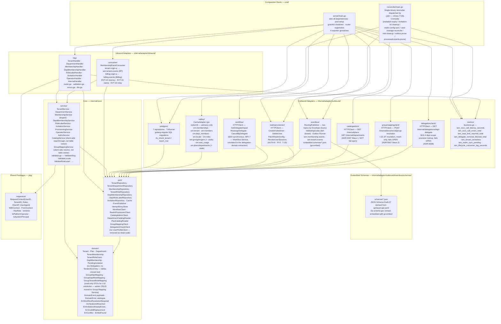

# Architecture

This document describes the internal structure, dependency rules, and runtime data flows of `iam-org-membership`.

`iam-org-membership` is a **private Go service** (`github.com/BCBP-SOLUTIONS-FZC-LLC/iam-org-membership`, Go 1.26.5+) deployed as a containerised microservice (HPA 2–8 replicas). It refines **IAM HLD v1.41 §5.6**; LLD v2.0 (`docs/lld/iam-lld-org-membership-service.md`). Where LLD and HLD disagree, HLD is authoritative.

The service owns the **organizational layer** of the IAM subsystem: tenants, tenant and department memberships (which departments a tenant has activated, and who's assigned to them), tenant-level and department-level role grants, and pending invitations. It is the single source of truth consumed on every authenticated request by **AuthZ Enrichment** via `GET /api/v1/internal/users/:id/memberships` (I-8, LLD §5.4) — the hottest path in the IAM subsystem.

This repo is what's left after a four-part service decomposition (ADR-0007, ADR-0008). Four concerns that used to live here as local tables/services have been extracted to new sibling services, and this branch implements the end state (outright removal, not a staged expand/contract rollout — the platform is pre-production):

- **Catalog / Admin Config Service** (`iam-catalog-admin`) — the global plan entitlement and department catalogues (ADR-0007 Wave 1).
- **Group Mapping / JIT Config Service** (`iam-group-mapping`) — Keycloak group→department/role mapping tables (ADR-0007 Wave 2).
- **Tender ACL Service** (`iam-tender-acl`) — `tender_acl_entries` additive tender grants (ADR-0007 Wave 3).
- **Delegation Service** (`iam-delegation`) — the `delegations` table and the OOO coordination flow with User Profile (ADR-0008).

Core's only remaining delegation touchpoint is synchronous: the §8.8 delegate-impact gate on user removal (`port.WorkflowClient`, talks to the *Workflow* Service, unrelated to the decomposition) plus a department-scope precision lookup on the admin dept-membership Assign/Remove path via `port.DelegationCheckClient` (`GET {DELEGATION_BASE_URL}/internal/delegations/dept-delegate`), which degrades to tenant-wide impact scoping — never a hard failure — if the Delegation Service is unavailable. Core has **zero** outbound calls to User Profile now; the whole `userprofile` outbound adapter was dead code once OOO coordination moved to the Delegation Service, and has been deleted.

The global **plan entitlement catalogue** and **department catalogue** (the reference data — plan tiers, department codes/names) moved to the **Catalog / Admin Config Service** per migration-runbook Phase 4 (ADR-0007). This service reads that catalog through `port.PlanCatalogReader`/`port.DepartmentCatalogReader` (`service.CatalogService`, a two-tier cached HTTP client wrapping `port.CatalogAdminClient`) — it no longer owns `plans`/`departments` as local tables, and `OperatorService`/`OperatorHandler` no longer implement O-1/O-2/O-3 (departments) or O-5/O-6 (plans).

---

## Layer model

The service is organised in concentric Clean Architecture layers. Inner layers have **zero knowledge** of outer layers; dependencies always point inward.



**Rule:** `domain` ← `port` ← `service` ← `adapter` ← `cmd`. `core/service` may also import `pkg/requestctx` (allowed by `.go-arch-lint.yml`). Nothing in `core/` imports `adapter/`. Tests import service and domain packages but are not part of the production dependency chain. Enforced in CI by `go-arch-lint`.

---

## Composition root — `cmd/server/main.go`

`main.go` is the only file where framework wiring is allowed. Its responsibilities, in order:

1. Load and validate config (`validateRequiredEnv` — fails fast on missing `DATABASE_URL`, `SNS_TOPIC_MEMBERSHIP_ARN`, `SNS_TOPIC_TENANT_ARN`, `WORKFLOW_SERVICE_BASE_URL`, `REALM_PROVISIONER_BASE_URL`, etc.).
2. Initialise OpenTelemetry via `gincommon.InitTracingFromEnv()`.
3. Build **two** `*pgcommon.Pool` instances:
   - `pool` — the RLS-enforced app pool, GUC-injected via `pgcommon.GUCSetFromContext`. Used for every tenant-scoped request path.
   - `sysPool` — a BYPASSRLS pool built from `SYSTEM_DATABASE_URL`. Used ONLY by reconciler jobs that need cross-tenant reads (`seat-overage-reconcile`, the metric exporters) and by the cross-tenant metric exporters. In production this must target the `org_membership_migrator` role. In dev it falls back to `DATABASE_URL` with a startup warning; cross-tenant queries then return 0 rows under RLS.
4. Run migrations via `pgcommon.migrate.Runner` connected to `MIGRATION_DATABASE_URL` (direct Postgres, bypasses PgBouncer — DDL is incompatible with transaction pooling; MIG-3 / CONFIG-2).
5. Construct outbound adapters (`postgres.*Repository`, `valkey.CacheAdapter`, `workflow.HTTPClient`, `realmprovisioner.HTTPClient`, `catalogadmin.HTTPClient`, `groupmappingclient.HTTPClient`, `delegationcheck.HTTPClient`), the `RoutingPublisher` with both topic ARNs, and the outbox runner.
6. Construct services with those adapters (`MembershipService` receives `WorkflowClient` + `RealmProvisionerClient`; `DeptMembershipService` additionally receives `DelegationCheckClient` for the §8.8.4 dept-scope precision lookup).
7. Register Gin routes on three prefix groups (`/api/v1/*`, `/api/v1/internal/*`, `/api/v1/operator/*`) with the middleware chain described below.
8. Start the outbox runner (`OUTBOX_STARTUP_JITTER` seconds of random delay to spread thundering-herd on HPA scale-up) and 4 in-process metric-exporter goroutines:
   - `iam_tenant_ownerless` — `count(*) WHERE ownerless_since IS NOT NULL` every 60 s
   - `iam_realm_sync_pending` — `count(*) WHERE realm_sync_pending` every 60 s
   - `iam_seat_overage_active` — `count(*) WHERE overage_since IS NOT NULL` every 60 s
   - `iam_pending_invitations_stale` — `count(*) WHERE status='pending' AND expires_at > now()` per tenant every 60 s
9. Start the SQS consumer for `tenant-orgm-q` and `billing-orgm-q` with `processed_events` idempotency.
10. Serve HTTP on `APP_PORT` with `gincommon.Shutdown` handling `SIGTERM`; `terminationGracePeriodSeconds = 75` drains the outbox and in-flight consumer messages.

Reconciler jobs run out of `cmd/reconciler/main.go` — a single binary dispatched by `--job=<name>` covering all 7 K8s CronJobs (see § Deployment).

---

## Shared platform libraries

Three private modules from the BCBP-SOLUTIONS-FZC-LLC org are pinned in `go.mod`:

| Library | Version | Purpose |
|---------|---------|---------|
| `platform-gincommon` | v1.2.0 | HTTP middleware chain, Zap logging, OTel tracing, Prometheus metrics, `ErrorResponse`, `RequestContext`, `PropagateHeaders`, `InitTracingFromEnv`, `Shutdown` |
| `platform-pgcommon` | v1.2.1 | pgx/v5 pool, RLS GUC injection (`GUCSetFromContext`), `RunInTx`, `RunInSavepoint`, migrations, `SlowQueryTracer`, `NewOTelQueryTracer`, error mapping (`IsUniqueViolation`, `IsForeignKeyViolation`, `IsDeadlock`), public `domain.Logger` (the version where `Config.Logger`/`migrate.Runner.Logger` stopped being an internal unexported type) |
| `platform-events` | v1.4.0 | Transactional outbox, `NewSNSPublisher`, SQS consumer, CloudEvents envelope, `Envelope.Source` routing key, `ReprocessDeadLettersWith` DLQ API, `WithIPAddress`/`WithUserAgent` envelope fields |

**Not a Go module:** `platform-schemagov` is a Python 3.12 CLI (`schema-gov`) shipped as `ghcr.io/bcbp-solutions-fzc-llc/platform-schemagov:0.4`. Invoked via `docker run -v $PWD:/workspace` in CI only — zero Go-code presence.

**Not a dependency:** `iam-keycloakclient` — this service **never calls the Keycloak Admin API**; that is Realm Provisioner's exclusive responsibility (HLD §4.2, §5.2).

### Middleware stack (`platform-gincommon`)

Identical to `iam-user-profile`, plus the GUC-bridge middleware:

```
PanicRecovery.defer ─────────────────────────── (7) catches panic from all below
  RequestID                                       (1) set/echo X-Request-ID
    Tracing.defer ──────────────────────────────  (6) finalise OTel span
      CorrelationHeaders                          (2) x-correlation-id
        Metrics.defer ──────────────────────────  (5) observe duration, sizes, status class
          Logging.defer ──────────────────────── (4) http_request log after response
            RequireAuth                            (3a) 401 if headers absent/invalid
              ContextMiddleware                    (3b) build RequestContext
                GUCBridgeMiddleware                (3c) inject pgcommon.GUCSet into ctx
                  Handler ← executes here
```

`ServiceName = "iam-org-membership"`. No gRPC server — Gin HTTP only.

### `platform-pgcommon` — the RLS-critical wiring

The pool is built with:

```go
pool, err := pgcommon.NewPool(ctx, pgcommon.Config{
    DSN:                 os.Getenv("DATABASE_URL"),
    PGBouncerMode:       os.Getenv("PG_BOUNCER_MODE") == "true",
    GUCProvider:         pgcommon.GUCSetFromContext, // ← the security-critical line
    SlowQueryThreshold:  200 * time.Millisecond,
})
```

`GUCProvider = GUCSetFromContext` binds `app.tenant_id` **transaction-locally** via `set_config(..., is_local => true)` on **every** checkout, reads included. Under PgBouncer transaction pooling any session-scoped `SET` would persist on a pooled backend and leak the last tenant's GUC to the next request (RLS-6). This is verified by RLS test **Case 5** (`test/postgres/rls_test.go`) and CI additionally greps for non-`LOCAL` `SET app.tenant_id` as a forbidden pattern.

Every write **and every read** goes through `RunInTx` — no bare non-transactional query path exists. Production runs with `SetLogTenantID(false)` and `SetAllowFullStatements(false)` so slow-query logs never leak tenant IDs or full SQL.

### `platform-events` — the two-topic RoutingPublisher

Unlike `iam-user-profile` (single-topic producer), O&M uses **`events.NewRoutingPublisher`** (HLD §9.2) with two topic ARNs and a routing-key function that inspects `Envelope.Source` to select the topic — unrelated to the four-service decomposition and unchanged by it:

```go
routing := events.NewRoutingPublisher(events.RoutingConfig{
    TopicARNs: map[string]string{
        "iam.membership.events": os.Getenv("SNS_TOPIC_MEMBERSHIP_ARN"),
        "iam.tenant.events":     os.Getenv("SNS_TOPIC_TENANT_ARN"),
    },
    RouteBy: func(env events.Envelope) string { return env.Source },
})
```

The wrapper is at `internal/adapter/outbound/eventbus/routing_publisher.go` because `platform-events` exports only single-topic `NewSNSPublisher`.

**Wire-format codec (`events.WithCodec`, v1.4.0).** Each of the two `RoutingPublisher` topic publishers is constructed with its own `GlueCodec` (`internal/adapter/outbound/eventbus/glue_codec.go`) implementing `events.Codec` — a fully adopted use of v1.4.0's codec hook, not a deferred one. Unlike `iam-user-profile`'s single-registry setup, this service maintains **two** AWS Glue Schema Registries (SCHEMA-7, one per SNS topic — `iam-membership-events`, `iam-tenant-events`), so two independent `GlueCodec` instances are built, each prepending the 18-byte Glue wire-format header (`[0x03][0x00][16-byte schema version UUID]`) at SNS-publish time. An unset `GLUE_REGISTRY_*_NAME` falls back to `events.NoopCodec{}` on that topic (plain JSON, no header) — this is the default in local dev. The codec never touches the `outbox_events` row itself; encoding happens only at the SNS-publish boundary, so it composes safely with `PG_BOUNCER_MODE=true`.

**Substantive consumer of two topics at MVP:**
- **`tenant-orgm-q`** ← `iam.tenant.events` (RP-produced): `TrialTenantProvisioned`, `TenantRealmReady`, `TenantConverted`, `DirectPaidSignup`, `TrialExpired`, `TrialReactivated`, `TenantSuspended`, `TenantOffboarded`. O&M **never self-consumes** its own `TenantCreated`/`TrialStarted` (HLD §9.1.1 "No self-consumption").
- **`billing-orgm-q`** ← `billing.events` (Billing-produced): `TenantPlanChanged`, `TenantPaymentPastDue`, `TenantSubscriptionCancelled`, `TenantReactivated`, `TenantSeatsChanged`.

Queue naming pattern: `<topic-short>-<consumer-short>-q` (HLD §9.1). Consumer short-name `orgm`. Both DLQs `tenant-orgm-q-dlq` / `billing-orgm-q-dlq`, `maxReceiveCount = 5`. Idempotency via the `processed_events` composite PK `(event_id, consumer)`.

---

## Domain layer — `internal/core/domain/`

The domain layer imports nothing external. Entities carry no persistence or transport concerns.

### Entities and value objects

| Type | Notes |
|---|---|
| `Tenant` | Root aggregate. Fields: `plan`, `status`, `trial_ends_at`, `realm_id`, `realm_type` (§16 A22), `keycloak_shard` (RP-owned projection T-12), `mfa_freshness_seconds ∈ [60,900]` (T-10), `local_accounts_enabled`, `licensed_seats > 0` (T-8, SEAT-1..5), `ownerless_since` (T-13), `overage_since` (SEAT-5), `realm_sync_pending` (T-15), `feature_flags jsonb` (override delta only — T-9). Immutable `slug` (T-1). |
| `Plan` | Read-only projection of the Catalog Service's global entitlement catalogue (§16 A19) — this service has no local `plans` table. Per-tier entitlements — `workflow_template_limit`, `tender_limit`, `sso_enabled`, `custom_branding` (`none`/`logo`), `feature_set jsonb`, `trial_duration_days`. `NULL` on the two limit columns means unlimited. |
| `Department` | Read-only projection of the Catalog Service's global department catalogue — this service has no local `departments` table. `is_system`/`is_active`/code-immutability semantics (D-2, D-9, OP-3) are enforced there, not here. Seeds: Engineering, Design, Procurement, Finance, Legal (§8.1). |
| `TenantMembership` | Lifecycle only, no role data (§16 A14). `status ∈ (active, suspended, left)`. |
| `TenantRoleGrant` | Elevated tenant roles only (`tenant_owner`, `tenant_admin`, `tender_admin`). Multi-role (TR-1, one row per grant). `chk_tr_no_member` bars `role_code='member'` — the `member` role is **derived at read time**, never persisted (TR-7, §16 A29). |
| `DeptMembership` | User↔department↔`role_level` (`preparator`/`reviewer`/`approver`). Composite FK to `tenant_memberships` (§16 A15/A28). |
| `GroupMapping` | Three flavours: `GroupDeptRoleMapping`, `GroupTenantRoleMapping` (§16 A25 — closes gap where `Tender-Admins` group couldn't resolve to `tenant_admin`), `GroupDeptMapping`. All three keyed by `keycloak_group_name`. **Read-only response DTOs for I-10 JIT resolution** — the mapping tables themselves, and their admin CRUD routes (former P-14..17/29), moved to the Group Mapping / JIT Config Service (ADR-0007 Wave 2); `service.GroupMappingService` resolves via `port.GroupMappingClient` and shapes the response into these types, it does not read them from a local table. |
| `PendingInvitation` | Two-step invite→accept staging (§16 A11). **The one PII exception** — holds `email` (citext) + `full_name` until acceptance. `expires_at` (7 days = Keycloak invite action-token lifespan, coupled via `INVITATION_EXPIRY_DAYS`). `kc_cleanup_pending` saga-compensation marker (PI-9). |

`Delegation` and `TenderACLEntry` no longer exist in this domain package — the `delegations` table moved to the Delegation Service (ADR-0008) and `tender_acl_entries` moved to the Tender ACL Service (ADR-0007 Wave 3). Core's only remaining touchpoints are the synchronous `WorkflowClient` delegate-impact gate (§8.8, talks to Workflow Service) and the `DelegationCheckClient` dept-scope lookup (§8.8.4, talks to Delegation Service) — see § Cross-service dependencies below.

### DomainError catalogue

Domain errors map 1:1 to HTTP status codes at the handler layer via `unwrapDomainError`. The catalogue in `internal/core/domain/errors.go`:

| Error | Status | Trigger |
|---|---|---|
| `ErrTenantNotFound` / `ErrMemberNotFound` / `ErrDepartmentNotFound` / `ErrInvitationNotFound` / `ErrPlanNotFound` | 404 | Each resource type has its own not-found sentinel — there is no generic `ErrNotFound` |
| `ErrConflict` | 409 | Generic — a transaction context is unexpectedly unavailable at a write site that requires one; not tied to a specific resource |
| `ErrWorkflowResolutionRequired` | 409 | §8.8 — delegate on active workflows; body carries `active_workflows`, `workflow_ids[]`, `allowed_actions: [replace_delegate, stop_workflows]` (WFI-3) |
| `ErrSeatLimitReached` | 409 | SEAT-1 — invite at or above `licensed_seats`; body carries `licensed_seats`, `active_users`, `pending_invitations` |
| `ErrInvitationAlreadyExists` | 409 | PI-1 — duplicate live pending invite for same `(tenant_id, email)` |
| `ErrInvalidReplacement` | 422 | §8.8.3 WFI-5 — `replace_delegate` replacement is not an active same-tenant member |
| `ErrLastOwnerRemoval` | 422 | TM-8 — actor-path P-8/P-28 would leave tenant ownerless |
| `ErrOptimisticLockConflict` | 409 | CONC-3/4 — `record_version` mismatch; response echoes current `record_version` and `updated_at` |
| `ErrInsufficientRole` / `ErrCannotRemoveOwner` | 403 | Caller role insufficient for the action / attempt to remove the only `tenant_owner` — there is no generic `ErrForbidden` |
| `ErrTenantOffboarded` | 409 | PAID-1 — attempt to move a tenant off the terminal `offboarded` state |
| `ErrValidation` | 400 | Field-level validator failures (see `validator.go`) — the generic catch-all; specific 422 domain-rule violations (e.g. `ErrDepartmentRetired`, `ErrInvalidPlan`) have their own sentinels |

This is a **representative subset** — the full catalogue is 49 sentinel errors; see [`docs/lld/iam-lld-org-membership-service.md` §17](docs/lld/iam-lld-org-membership-service.md) for the exhaustive table.

---

## Port layer — `internal/core/port/`

Interfaces required by the core. Every outbound dependency crosses this boundary.

### Repository interfaces

`TenantRepository`, `TenantDepartmentRepository`, `MembershipRepository`, `TenantRoleRepository`, `DeptMembershipRepository`, `DeptRoleLabelRepository`, `InvitationRepository`. All 7 `record_version`-carrying tables (all except `processed_events`) expose an optimistic-lock update method that returns `ErrOptimisticLockConflict` on `RowsAffected() == 0` (CONC-3). There is no `DelegationRepository` or `ACLRepository` — `delegations` and `tender_acl_entries` moved to separate databases owned by the Delegation Service and Tender ACL Service respectively.

### `Cache` — advisory only

`Get(key) → (bytes, hit, err)`, `Set(key, value, ttl)`, `Del(keys...)`. Cache is a performance dependency (CACHE-2/9) — miss/timeout/outage falls through to Postgres and `/readyz` reports degraded but stays ready.

### `EventPublisher` — transactional outbox contract

`Enqueue(ctx, tx, Envelope)` inserts into `outbox_events` inside the caller's transaction. Every state change and its event share one `RunInTx` (EVT-10, CONS-1). The runner in `internal/adapter/outbound/eventbus/publisher.go` polls the table every `OUTBOX_POLL_INTERVAL` (default 500 ms), leases claimed rows for `OUTBOX_CLAIM_LEASE_DURATION`, and publishes to SNS via `RoutingPublisher`. Successful publish marks `published_at = now()`; failure retries up to `OUTBOX_MAX_ATTEMPTS` before moving to `outbox_dead_letters`.

There is no `UserProfileClient` port. Core's whole `userprofile` outbound adapter — built for the §8.6 OOO-coordination `SetAvailability` call — became dead code once the `delegations` table and its coordination flow moved to the standalone Delegation Service (ADR-0008), and both the port and the adapter have been deleted. Core has zero outbound calls to User Profile.

### `CatalogAdminClient`

```go
type CatalogAdminClient interface {
    Departments(ctx context.Context) ([]CatalogDepartment, error)
    Plans(ctx context.Context) ([]CatalogPlan, error)
}
```

Outbound HTTP client for the Catalog / Admin Config Service (ADR-0007 Wave 1) — read-only, mesh-only bulk endpoints. Wrapped by `service.CatalogService`, which exposes the narrower `DepartmentCatalogReader`/`PlanCatalogReader` interfaces to callers (`DepartmentService`, `DeptMembershipService`) via a primary/stale-if-error two-tier cache. **Not fail-open**: an unconfigured base URL or a failed call with no cache returns an error rather than fabricating catalog data — `catalog_unavailable` (503) surfaces to the caller.

### `GroupMappingClient`

```go
type GroupMappingClient interface {
    ResolveGroups(ctx context.Context, tenantID uuid.UUID, groups []string) (*GroupResolution, error)
}
```

Outbound HTTP client for the Group Mapping / JIT Config Service (ADR-0007 Wave 2) — a single consolidated `POST /internal/tenants/:id/group-resolution` call (GM-I1) replaces the three local SELECTs I-10 used to issue against the now-extracted `group_dept_role_mappings`/`group_tenant_role_mappings`/`group_dept_mappings` tables. Wrapped by `service.GroupMappingService`. Unlike `CatalogAdminClient`, this **fails OPEN** on a cold-cache-plus-failure (empty resolution, HTTP 200) — a SAML/OIDC login must never fail because this call failed (ADR-0007 Action Item 4). `group_mapping_unavailable` is declared in the error taxonomy but not currently returned by any code path for this reason.

### `DelegationCheckClient` (§8.8.4)

```go
type DelegationCheckClient interface {
    DeptDelegate(ctx context.Context, tenantID, userID, deptID uuid.UUID) (*uuid.UUID, error)
}
```

Replaces the local `DelegationRepository.FindActiveDeptDelegateForUser` lookup `DeptMembershipService` used before `delegations` moved to the Delegation Service (ADR-0008). Calls `GET /internal/delegations/dept-delegate?tenant_id=&user_id=&dept_id=` for the WFI-11 department-scope precision check on the admin dept-membership Assign/Remove path. `err` is non-nil only when the check itself couldn't be performed (network/timeout/5xx); callers degrade to a `nil` delegation ID (tenant-wide impact scoping, still correct, less precise) rather than failing the Assign/Remove operation.

### `WorkflowClient` (§8.8)

Talks to the **Workflow Service**, not the Delegation Service — this port is unrelated to the four-service decomposition and unchanged by it. Every user removal, department demotion, and department removal blocks on it synchronously (WFI-7). No inbound subscription from Workflow — all synchronous request/response.

```go
type WorkflowClient interface {
    GetDelegateImpact(ctx context.Context, tenantID, delegateUserID uuid.UUID, delegationID *uuid.UUID) (DelegateImpact, error)
    ReassignDelegate(ctx context.Context, tenantID, oldDelegateID, newDelegateID uuid.UUID, delegationID *uuid.UUID) (ReassignResult, error)
    CancelByDelegate(ctx context.Context, tenantID, delegateUserID uuid.UUID, delegationID *uuid.UUID) (CancelResult, error)
}
```

`delegation_id`: nil = tenant-wide (§8.8 full removal); non-nil = scoped to that specific delegation (§8.8.4 dept-level). Wire shapes (§16 A12): GET query params for `delegate-impact`, POST JSON for reassign/cancel. 5xx/timeout → `503 workflow_service_unavailable`, no DB write (WFI-8).

### `RealmProvisionerClient`

```go
type RealmProvisionerClient interface {
    CreateInvitedUser(ctx, tenantID, req) (keycloakUserID uuid.UUID, err error)  // §8.10, A11
    DeleteUser(ctx, tenantID, keycloakUserID uuid.UUID) error                    // PI-9 idempotent
    PatchRealmConfig(ctx, tenantID, patch) error                                 // T-15
    RevokeUserSessions(ctx, tenantID, keycloakUserID uuid.UUID) error            // AUTH-8 best-effort/fail-open
}
```

Failure semantics vary by call site — invite creation is **fail-closed** (`503 realm_provisioner_unavailable`, no invitation, retryable); `PatchRealmConfig` failure is **fail-open + durable reconcile** (commits with `realm_sync_pending`, T-15 CronJob converges); `RevokeUserSessions` failure is **fail-open** (AUTH-8 privilege reduction commits regardless, TTL backstop covers ≤ access-token lifetime + 300 s `om:memberships` cache); `DeleteUser` compensation is **async + durable reconcile** via `kc_cleanup_pending`.

---

## Service layer — `internal/core/service/`

### `MembershipService` — the most complex service

Owns `AddMember`, `RemoveUser`, `Suspend`, `Reactivate`, `ChangeRoles`, `Invite`, `AcceptInvitation`, `AssignToDepartment`, `RemoveFromDepartment`, `ResolveRemoval`.

Key flows:

- **`RemoveUser` (P-8, I-5)** — synchronously calls `WorkflowClient.GetDelegateImpact(tenant, user, nil)` before the removal cascade. On `active_workflows > 0` returns `ErrWorkflowResolutionRequired` (409); admin resolves via `POST /tenants/:id/users/:user_id/removal-resolution` (P-26, `replace_delegate` or `stop_workflows`). On `active_workflows == 0` proceeds with the §15.2.2 cascade: `tenant_memberships.status = 'left' AND deleted_at = now()`, cascade soft-delete `tenant_roles` (TR-9 — one `TenantRoleRevoked` per elevated grant) and `dept_memberships` (one `DepartmentMembershipRevoked` per affected department), then emits **one** `MembershipRevoked{tenant_id, user_id, actor_id}` event. Since ADR-0008, Core no longer ends `delegations` rows or soft-deletes `tender_acl_entries` itself — it owns neither table any more. The Delegation Service and Tender ACL Service each run their own async cascade off that shared `MembershipRevoked` signal (a lingering delegation/ACL row for a departed user is inert; the stranding hazard — a delegate on active workflows — was already resolved *before* removal by this same `WorkflowClient` gate). TM-12 escalation: if this removes the last active `tenant_owner`, set `tenants.ownerless_since = now()` and log `tenant_ownerless_escalation` at ERROR.
- **`Invite` (P-6, §8.10)** — Pre-flight (409 on `member_already_exists`/`invitation_already_exists`, 429 on `reinvite_too_soon`/`invite_rate_limited`) → `RealmProvisioner.CreateInvitedUser` (503 fail-closed on 5xx) → `RunInTx` with `SELECT tenants.licensed_seats FOR UPDATE` + SEAT-1 count → `INSERT pending_invitations` (or over-cap compensation row with `kc_cleanup_pending=true`) + `InvitationCreated` audit → `202 {invitation_id, status, expires_at}`.
- **`AcceptInvitation` (I-3 branch)** — matches pending row `FOR UPDATE` on `idx_pi_keycloak_user`, flips `status = accepted`, inserts `tenant_memberships` + `initial_tenant_roles` (elevated only) + `initial_dept_mappings`, emits `TenantRoleGranted` per elevated role + `DepartmentMembershipGranted` per dept mapping (PI-7 — no separate invitation-lifecycle event).
- **`ChangeRoles` (P-28)** — full-replacement multi-role reconcile. TM-8 last-owner protection: revoking the last active `tenant_owner` returns `422 last_owner_removal`. TM-13 concurrency serialization via `SELECT tenants ... FOR UPDATE`.
- **Suspension advisory (§8.8.5 P-7)** — `GetDelegateImpact` called **best-effort**; suspend commits regardless of Workflow response (fail-open — never blocks a security-relevant action). Response includes `delegate_impact.active_workflows` (or `checked: false` on 5xx).
- **Department-level extension (§8.8.4, in `DeptMembershipService`)** — the admin dept-membership Assign/Remove path calls `DelegationCheckClient.DeptDelegate(tenant, user, dept)` for a department-scoped precision lookup, replacing the local `delegations` table query Core lost when the table moved to the Delegation Service (ADR-0008). On a Delegation Service outage this degrades to tenant-wide delegate-impact scoping via `WorkflowClient` (still correct, less precise) — it never blocks the Assign/Remove operation.

### Other services

- `TenantService` — CRUD, `PATCH /tenants/:id` (P-2) drives `PatchRealmConfig` (T-15 Option A: local-first commit-then-call; reconciler converges on failure with disables prioritised as security-tightening).
- `DepartmentService` — per-tenant activation (`tenant_departments`) validated against the `om:departments` read-through cache; the global catalogue itself is Catalog Service's.
- `RoleLabelService` — `dept_role_labels` per-tenant labels; only `display_name` mutable (P-13).
- `CatalogService` — client-side read-through wrapper over `CatalogAdminClient` (`om:plans`/`om:departments` cache + stale-if-error fallback); not a table owner.
- `GroupMappingService` — client-side resolve wrapper over `GroupMappingClient` for I-10 JIT resolution (`om:grm`/`om:gdm`/`om:gtrm` cache + 24h `:stale` fallback); not a table owner. SAML JIT (§8.5) is additive-only (GTRM-4) — a group no longer including a previously-granted role does **not** remove the grant.
- `InvitationService` — lifecycle helpers around `pending_invitations`.

There is no `DelegationService` or `ACLService` in this package — the `delegations` table and its OOO-coordination flow (§8.6/§8.7, User Profile `SetAvailability`) moved to the Delegation Service (ADR-0008); `tender_acl_entries` and its grant/list/revoke flow moved to the Tender ACL Service (ADR-0007 Wave 3).

---

## Adapter layer — `internal/adapter/`

### Inbound HTTP — `adapter/inbound/http/`

Handlers registered on three route groups with distinct auth models (LLD §5.1):

| Prefix | Callers | Auth | Ingress |
|---|---|---|---|
| `/api/v1/*` | Authenticated tenant users | Gateway-injected `x-user-id`, `x-tenant-id`, `x-tenant-roles` from validated JWT | Public Envoy |
| `/api/v1/internal/*` | In-mesh services (RP, Event Consumer, LLM, Signup BFF, Workflow, Billing, AuthZ) | Mesh mTLS + NetworkPolicy; **no JWT**; `x-tenant-id` = target tenant | Internal Envoy only |
| `/api/v1/operator/*` | Human operators / operator tooling | Gateway validates JWT, asserts `platform_operator` claim | **Separate operator ingress** (§16 C1 / AUTH-7 defense-in-depth) |

Handler responsibilities: parse and validate path/body (validation errors collected all-at-once → 422 `errors: [...]` array), enforce AUTH-1..AUTH-8 rules on `RequestContext.Roles`, call the service layer, translate `DomainError` → HTTP via `unwrapDomainError`, echo `record_version` + `updated_at` on mutating responses (API-3).

Full endpoint catalogue (34 total: 18 active public P-*, 12 active internal I-*, 2 active operator O-*; retired route numbers — former group-mapping, delegation, and tender-ACL admin CRUD — are unregistered, not 410 Gone, and their IDs are never reused): see [`.claude/api-caching-events.md § 5.3`](.claude/api-caching-events.md) and `docs/swagger/swagger.yaml` (generated via `make swag`).

### Inbound consumer — `adapter/inbound/consumer/membership_event_consumer.go`

Handles two SQS queues (`tenant-orgm-q`, `billing-orgm-q`) with `processed_events` dedup keyed on `(event_id, consumer)`, accessed through `port.IdempotencyStore` (`internal/adapter/outbound/postgres/idempotency_repository.go`). Named and shaped to match `iam-user-profile`'s own `IdempotencyStore` (`IsProcessed`/`MarkProcessed`-style API), with one deliberate difference: `MarkProcessedInTx` takes the caller's already-open `pgx.Tx` rather than opening its own, so the dedup write commits atomically with the EVT-14 row lock and projection update below in the *same* transaction. `iam-user-profile`'s equivalent store is decoupled by design (check, then mark only after its handler's side effect fully succeeds) — sufficient there because that handler has no analogous row-locked recency comparison to stay atomic with.

Three guardrails, applied in order on every consumed message:

- **EVT-14 recency guard (§16 A33).** Handler compares `event.time` vs `tenants.last_event_at` **under the tenant row lock**. If `event.time <= last_event_at`, skip the state change but still record `processed_events` (event stale/reordered — `iam_stale_lifecycle_event_skipped_total++`). Otherwise apply the projection and set `last_event_at = event.time` in the same UPDATE. Makes the projection commutative under reordering. `last_event_at` is **never advanced by API writes** — only consumed events. Tie (`==`) treated as stale.
- **EVT-15 future-time clamp (§16 A40, poison-pill guard).** If `event.time > now() + MAX_LIFECYCLE_EVENT_SKEW_SECONDS` (default 300 s), event is rejected to DLQ — not applied, `last_event_at` not advanced, **not** recorded in `processed_events`. `iam_future_lifecycle_event_rejected_total++` — any nonzero pages.
- **EVT-16 tenant-state relay (§16 A61).** Whenever a consumed handler **actually changes `tenants.status` or `tenants.plan`** (post-EVT-14 check), enqueue a `TenantStateChanged` event on `iam.membership.events` **in the same `RunInTx`** as the projection UPDATE. Carries `{status, previous_status, plan, previous_plan, changed_at, cause}`. Lets Workflow Service pause/resume/route without a direct `iam.tenant.events`/`billing.events` subscription. Never fires on stale-skip or no-op.

### Outbound Postgres — `adapter/outbound/postgres/`

7 repositories implementing the `port.*Repository` interfaces plus a `TxRunner` for cross-repository transactions. All 7 `record_version`-carrying tables use the optimistic-lock pattern:

```go
tag, err := tx.Exec(ctx,
    "UPDATE tenant_memberships SET status=$1 WHERE id=$2 AND tenant_id=$3 AND record_version=$4",
    newStatus, id, tenantID, expectedVersion,
)
if tag.RowsAffected() == 0 {
    return domain.ErrOptimisticLockConflict  // → 409 optimistic_lock_conflict
}
```

The `touch_row()` BEFORE-UPDATE trigger bumps `record_version` and `updated_at` on any real change (`WHEN OLD.* IS DISTINCT FROM NEW.*`) — no-op UPDATE leaves both untouched (TRG-3), preventing spurious event publishing on idempotent writes.

Migrations live at `internal/adapter/outbound/postgres/migrations/` and are run at startup by `pgcommon.migrate.Runner`. The schema is a single consolidated migration, `000000_initial_schema` — this service has never been deployed, so the incremental history that built up the four-service extraction (`departments`/`plans` → Catalog; the three group-mapping tables → Group Mapping; `tender_acl_entries` → Tender ACL; `delegations` plus the tenant-level `delegation_max_duration_days`/`delegation_review_window_days` columns → Delegation) was squashed rather than preserved as dead migration history. See [`.claude/database-schema.md`](.claude/database-schema.md) for the 8-table catalogue, RLS invariants (RLS-1..RLS-6), tenant invariants (T-1..T-15), seat invariants (SEAT-1..SEAT-5), migration invariants (MIG-1..MIG-9), and trigger behavior.

### Outbound Valkey — `adapter/outbound/valkey/`

Advisory-only cache (CACHE-2/9). All keys tenant-prefixed (CACHE-1). 50 ms operation timeout = miss. See [`.claude/api-caching-events.md § 6`](.claude/api-caching-events.md) for the key catalogue and invalidation matrix.

### Outbound eventbus — `adapter/outbound/eventbus/`

Contains `routing_publisher.go`, `outbox_runner.go`, `validating_codec.go`, `glue_codec.go`, and the embedded `schemas/*.json` directory. The `ValidatingCodec` is **fail-closed**: `Encode` returns an error for any event type not registered at startup — the inner codec is never called, the event is never enqueued. Prevents silent publishing of schema-less events. `GlueCodec` (§ `platform-events` above) is a separate, later stage in the pipeline — `ValidatingCodec` runs at outbox-enqueue time against the local JSON Schema files; `GlueCodec` runs at SNS-publish time and prepends the AWS Glue wire-format header. Both codecs can be active on the same event without conflicting.

Envelope carries `{id (UUID v7), source, tenant_id, trace_id, specversion, time, subject, actor, dataschema, data}`. `tenant_id` is on the envelope, **not** in `data`. `dataschema` is the Glue schema version UUID (absent under the dev `NoopCodec` path).

### Outbound HTTP clients — `adapter/outbound/{workflow,realmprovisioner,catalogadmin,groupmappingclient,delegationcheck}/`

Five clients with an identical construction pattern (no `userprofile/` package — deleted as dead code, see § Port layer above):

```go
client := &http.Client{Timeout: cfg.TimeoutMs * time.Millisecond}
req, _ := http.NewRequestWithContext(ctx, method, baseURL+path, body)
gincommon.PropagateHeaders(c, req)  // traceparent + x-request-id + x-user-id + x-tenant-id + x-tenant-roles
// ... send, decode, map non-2xx to typed domain errors
```

Each client has its own `*_BASE_URL` and `*_TIMEOUT_MS` env vars. `WORKFLOW_TIMEOUT_MS`/`REALM_PROVISIONER_TIMEOUT_MS`/`CATALOG_ADMIN_TIMEOUT_MS` default 3000 ms; `GROUP_MAPPING_TIMEOUT_MS`/`DELEGATION_TIMEOUT_MS` default 300 ms, matching their fail-open posture (a slow login-path or admin-path dependency should time out fast and degrade, not stall the request). See § Cross-service dependencies and degradation matrix below for failure semantics.

---

## Concurrency, consistency, and failure handling

### Optimistic locking (CONC-1..4)

All 7 `record_version`-carrying tables use the pattern above. CONC-4 requires 409 responses to include the current `record_version` and `updated_at` so the caller can re-read and retry without a separate GET.

### Consistency invariants (CONS-1..4)

- **CONS-1** — Business write + integration event(s) committed together via transactional outbox (EVT-10). No event without state; no state without event.
- **CONS-2** — Availability-first delegation, now enforced entirely inside the Delegation Service (ADR-0008): `delegations` is updated only after User Profile returns `200`. Core has no part in this invariant any more — it neither owns `delegations` nor calls User Profile.
- **CONS-3** — JIT membership per-request atomic. All resolved `(dept, role)` in one `RunInTx`; no partial assignment.
- **CONS-4** — Advisory display vs transactional hard limit. Seat cap (SEAT-1) enforced transactionally with `SELECT ... FOR UPDATE`, never from the `om:seat_usage` cache.

### Idempotency (IDEMP-1..4)

- **IDEMP-1** — Every replayable operation converges to the same final state.
- **IDEMP-2** — `processed_events` PK `(event_id, consumer)` is the canonical bus-event dedup (EVT-4).
- **IDEMP-3** — UPSERTs (`INSERT ... ON CONFLICT DO UPDATE`) on natural identity keys + partial unique indexes collapse replays onto the same row.
- **IDEMP-4** — 8-day dedup window is deliberate (PE-1 strictly > 7-day SQS lifetime). Beyond-window duplicates (SQS max 14 d + DLQ dwell) are backstopped by **value-level** guards: EVT-14 recency guard, PI-10 acceptance idempotency, IDEMP-3 UPSERT convergence.

### Failure invariants (FAIL-1..5)

- **FAIL-1** — Dependency failures never leave partial business state (single `RunInTx` all-or-nothing).
- **FAIL-2** — Cache failures degrade latency only.
- **FAIL-3** — Outbox at-least-once; consumer dedup = exactly-once at consumer.
- **FAIL-4** — Scheduled jobs safe to restart/re-run.
- **FAIL-5** — Missing tenant context fails closed (RLS-2 — `current_setting('app.tenant_id', true)` NULL → policy returns no rows).

---

## Data model overview

Database `org_membership` on shared RDS PostgreSQL (Multi-AZ, PgBouncer transaction pooling). **8 tables** (down from 15 before the four-service decomposition) with RLS on all 7 tenant-scoped tables (`FORCE ROW LEVEL SECURITY` + `REVOKE ALL FROM PUBLIC` + `tenant_isolation` policy on `app.tenant_id`); `processed_events` is the 8th table, exempt from RLS. `record_version`-based optimistic locking on **7 tables** (all except `processed_events`), and partial unique indexes (`WHERE deleted_at IS NULL` / `WHERE status='pending'`) so a user can rejoin a tenant/department previously left.

Special case: the `tenants` table's policy matches `id = current_setting('app.tenant_id')::uuid` — a tenant can only read/write its own row.

Cross-tenant admin access requires the `BYPASSRLS` role **`org_membership_migrator`** (never the app role `org_membership_app` — CI-verified via MIG-3 / MIG-5).

Full table catalogue and every RLS/tenant/seat/migration/trigger invariant is in [`.claude/database-schema.md`](.claude/database-schema.md).

---

## Event architecture overview

Two outbound SNS topics (via `RoutingPublisher`):

- **`iam.membership.events`** (11 event types): `DepartmentMembershipGranted`, `DepartmentMembershipRevoked`, `DepartmentMembershipLevelChanged`, `TenantRoleGranted`, `TenantRoleRevoked` (§16 A14), `MembershipRevoked`, `TenderAssigneeOverridden`, `TenantSeatOverageStarted`, `TenantSeatOverageResolved`, `TenantStateChanged` (§16 A61 relay), `TenantMembershipsPurged`.
- **`iam.tenant.events`** (2 event types produced by O&M): `TenantCreated`, `TrialStarted`. O&M is a co-producer with Realm Provisioner on this topic — RP produces the lifecycle events O&M consumes.

`DelegationStarted`, `DelegationEnded`, and `DelegationReviewRequested` are no longer produced here — they moved to the Delegation Service's own `iam.delegation.events` topic (ADR-0008), and their JSON schemas are deleted from `internal/adapter/outbound/eventbus/schemas/`.

Two events carry the user/tenant removal cascade for the extracted services (§15.2.2, LLD §15.2.2):

- **`MembershipRevoked{tenant_id, user_id, actor_id}`** — emitted once per user removal (`MembershipService.RemoveUser`, P-8/I-5). A single shared event consumed by **three** services: the Delegation Service's cascade queue (ends the user's delegation rows), the Tender ACL Service's equivalent queue (soft-deletes the user's ACL overlays) — replacing what used to be two separate emissions — and AuthZ Enrichment's `membership-authz-q` (evicts the `om:memberships` cache entry for a user whose entire tenant membership, not just one department/role, was removed; LLD §7.3.2).
- **`TenantMembershipsPurged{tenant_id, actor_id}`** — emitted when a consumed lifecycle event genuinely transitions a tenant into `offboarded`. Consumed by Delegation, Tender ACL, and Group Mapping services to run their own async tenant-scoped cascade-deletes (their tables live in separate databases, out of reach of Core's own cascade). This is Core's own outbound signal, distinct from — and not to be confused with — Realm Provisioner's `TenantOffboarded`, which Core only *consumes*.

Two inbound SQS queues (unchanged by the decomposition):

- **`tenant-orgm-q`** ← `iam.tenant.events` (RP-produced lifecycle events)
- **`billing-orgm-q`** ← `billing.events` (Billing-produced plan/seat/status events)

All governed by `platform-schemagov` (`api/asyncapi.yaml` is the design-time source of truth; `internal/adapter/outbound/eventbus/schemas/*.json` derived via `schema-gov extract`; Glue Schema Registry runtime enforcement).

Full event payload catalogue, SNS→SQS fan-out topology, and consumer contract are in [`.claude/api-caching-events.md § 7`](.claude/api-caching-events.md).

---

## Cross-service dependencies and degradation matrix

For write operations, O&M availability = O&M × dependency (except fail-open paths). **Reads (I-8 hot path, list endpoints) have NO synchronous cross-service dependency** — Postgres+Valkey only — so authN/authZ stays available even when every write dependency is down.

| Operation | Sync dependency | Posture | On failure |
|---|---|---|---|
| Invite (P-6) | RP `CreateInvitedUser` | **fail-closed** | `503 realm_provisioner_unavailable`, no invitation, retryable |
| User removal / dept demotion·removal (P-8/I-5/P-10/P-11) | Workflow `GetDelegateImpact` | **fail-closed** | `503 workflow_service_unavailable`, no change (WFI-8) |
| Removal resolution (P-26) | Workflow reassign/cancel + re-check | **fail-closed** | `503`, no DB write |
| Suspension (P-7) | Workflow `GetDelegateImpact` (advisory) | **fail-open** | suspend commits, advisory omitted |
| Dept-membership Assign/Remove (§8.8.4) | Delegation `DeptDelegate` | **fail-open** | degrades to tenant-wide impact scoping via Workflow (less precise, never blocks) |
| `local_accounts_enabled` change (P-2) | RP `PatchRealmConfig` | **fail-open + durable reconcile** | commits, `realm_sync_pending=true`, 202, T-15 reconciler converges |
| Invite compensation / revoke / expiry KC-cleanup | RP `DeleteUser` | **async + durable reconcile** | `kc_cleanup_pending=true`, PI-9 reconciler converges |
| Session revoke (AUTH-8 on suspend/removal/deprivilege) | RP `RevokeUserSessions` | **fail-open (TTL backstop)** | O&M state committed, TTL ≤ access-token lifetime + 300 s `om:memberships` cache |
| Plan/department-defaults on cache miss | Catalog `GET /internal/plans`\|`/departments` | **fail-closed** | `503 catalog_unavailable` only when both the cache and stale-if-error fallback are empty |
| SAML/OIDC group resolution (I-10) | Group Mapping `POST .../group-resolution` | **fail-open** | empty resolution, HTTP 200 — login must never fail on this call |

Two fail-closed calls (invite, removal/resolution) stop completing during the respective dependency's outage; none corrupts state. Fail-open + durable reconcile chosen for security-critical and high-value paths where the alternative is service unavailability. **No new synchronous dependency touches the I-8 hot path** — every cross-service call added by the decomposition sits on an admin, login, or removal path, all with far larger latency budgets than I-8's 15/30 ms SLO. Core no longer calls User Profile at all (the `SetAvailability` delegation-coordination call moved to the Delegation Service).

---

## Observability

### SLOs (SLO-1..3)

| Endpoint | p99 |
|---|---|
| I-8 (`GET /internal/users/:id/memberships`) cache hit | 15 ms |
| I-8 cache miss | 30 ms |
| `POST /tenants/:id/members` (P-6, incl. SEAT-1 `FOR UPDATE`) | 100 ms |
| `DELETE /tenants/:id/members/:user_id` (incl. `GetDelegateImpact`) | 200 ms |
| `POST .../removal-resolution` (reassign/cancel + re-validation, 2 round trips) | 350 ms |
| P-7 suspend (incl. advisory `GetDelegateImpact`, fail-open) | 150 ms |
| **Outbound event publish half** (outbox commit → SNS publish) — O&M-owned | 1 s |
| **Inbound lifecycle projection freshness** (producer publish → `tenants` reflects) | 30 s |

Delegation-specific SLOs (`POST /delegations`, `DelegationStarted` end-to-end) moved to the Delegation Service (ADR-0008) along with the table and coordination flow they measured.

**SLO-3** is the primary drift signal for inbound projections — measured via `iam_lifecycle_consumer_lag_seconds`. It matters because EVT-14 skips stale events **silently** (no DLQ) — a queue backlog is the only external hint that a producer's clock or replay is misbehaving.

### Metrics

All `iam_`-prefixed. Cardinality-bounded — `tenant_id` labels capped at tenant count (~1500–2000 target); other labels are small enum fan-outs. Full metric catalogue and alert routing in [`.claude/operations.md § 11.2`](.claude/operations.md).

Key alerting metrics:

- `outbox_dead_letters_total rate > 0` → page
- `iam_tenant_ownerless > 0` → page `platform_operator` (O-7 required to resolve)
- `iam_future_lifecycle_event_rejected_total rate > 0` → page (producer clock skew / bad replay)
- Sustained `iam_session_revoke_failed_total` → page (AUTH-8 fast-kill degraded, only TTL-bounded)
- `iam_lifecycle_consumer_lag_seconds > 30` for ~2 min → page (SLO-3 breach)
- `iam_realm_sync_pending > 0` sustained beyond ~10 min → page (T-15)
- Sustained `iam_xsvc_call_errors_total{service="delegation"}` or `{service="catalog"}` → warn (dept-scope precision / catalog reads degraded); `iam_xsvc_call_errors_total{service="catalog",outcome="5xx"}` with no cache backstop → page (`catalog_unavailable` surfacing to callers)

**Metric naming (§16 A50/J4):** `iam_` subsystem prefix kept; emitting service disambiguated by Prometheus `job` label. Names unique across IAM. Dashboards/alerts on shared names aggregate `by (job)`.

**Cardinality guardrails (§16 A48):** no unbounded / user-supplied label (`user_id`, `email`) may be added.

### OTel tracing

`platform-gincommon.InitTracingFromEnv()` + `platform-pgcommon.NewOTelQueryTracer`. W3C `traceparent` propagated via `gincommon.PropagateHeaders` on every outbound call (Workflow, Realm Provisioner, Catalog, Group Mapping, Delegation Service). The `delegation.create` span moved with the delegation-coordination flow itself, to the Delegation Service.

### Structured logs (Zap)

Slow queries > 200 ms at WARN (`tenant_id` redacted). RLS violations at ERROR (1% sampled). Delegate-impact events (§8.8/§8.8.4) at INFO. `tenant_ownerless_escalation` at ERROR (durable, page-worthy record from I-5 cascade); `tenant_owner_reassigned` at INFO (O-7 clear side).

---

## Deployment

### Container image — two binaries

The `Dockerfile` builds and copies **two** entrypoints into the distroless final image:

| Binary | Path in image | Purpose |
|---|---|---|
| `iam-org-membership` | `/iam-org-membership` | HTTP server (`cmd/server`) — long-running, serves `/api/v1/*`, runs the outbox + 4 exporter goroutines + SQS consumer |
| `reconciler` | `/reconciler` | Single-binary reconciler dispatched by `--job=<name>` (`cmd/reconciler`) — one-shot, invoked by 7 K8s CronJobs |

Two-stage Dockerfile: a Go builder stage compiles both binaries, the runtime stage is `gcr.io/distroless/static-debian12:nonroot` (no shell, no package manager, runs as non-root).

### Helm chart

`deploy/helm/` renders a single `Deployment` for the server plus 7 `CronJob` resources, all sharing the same image with a `command: ["/reconciler", "--job=<name>"]` override:

| CronJob | Schedule | Purpose |
|---|---|---|
| `invitation-expiry` | `*/5 * * * *` | Past-`expires_at` pending → `expired` + `kc_cleanup_pending=true` (PI-5) |
| `invitation-kc-cleanup` | `*/10 * * * *` | Saga-compensation (PI-9): sweep `kc_cleanup_pending`, call `RP.DeleteUser`, clear flag |
| `realm-config-sync` | `*/10 * * * *` | T-15 reconciler: sweep `realm_sync_pending`, call idempotent `PatchRealmConfig`; disables prioritised |
| `seat-overage-reconcile` | `0 */6 * * *` | Seat-overage marker backstop (SEAT-5); drives past-grace alert |
| `trial-cleanup` | `0 2 * * *` | Phase-2 DB executor: soft-delete + PII-scrub for `trial_expired` past 15-d grace |
| `outbox-prune` | `0 3 * * *` | `outbox.Runner.PrunePublished(24h, 10000)` |
| `processed-events-prune` | `0 4 * * *` | Delete `processed_events > 8 days` |

`delegation-expiry`, `delegation-review`, and `delegation-cleanup` moved to the Delegation Service (ADR-0008); `acl-cleanup` moved to the Tender ACL Service (ADR-0007 Wave 3) — none of the four run here any more.

`terminationGracePeriodSeconds = 75`. HPA: 2–8 replicas on CPU (70%) + memory (75%), plus an optional RPS-per-replica metric gated behind a prometheus-adapter rule — no cache-hit-ratio metric feeds it (no such metric is emitted; see § Observability). PDB `minAvailable: 1`. Resources: CPU 100m/500m, Memory 128Mi/384Mi.

The four metric exporters (`iam_tenant_ownerless`, `iam_realm_sync_pending`, `iam_seat_overage_active`, `iam_pending_invitations_stale`) run as ticker goroutines **inside the server process**, not as CronJobs — matching the sibling `iam-user-profile2` pattern.

### Migration safety

Rolling deploy, ≥ 2 replicas. `migrate.Runner` `lock_timeout=30s`. Additive changes zero-downtime. `UNIQUE` via `CREATE UNIQUE INDEX CONCURRENTLY` + `ADD CONSTRAINT ... USING INDEX` in separate releases (MIG-8). FK/CHECK via `ADD CONSTRAINT ... NOT VALID` + `VALIDATE CONSTRAINT` in separate releases (MIG-9b). See CONTRIBUTING § "Adding a new repository migration" for the full checklist.

---

## Testing strategy

- **Unit** (`test/unit/`, `testify/mock` for `port.WorkflowClient`/`RealmProvisionerClient`/`CatalogAdminClient`/`GroupMappingClient`/`DelegationCheckClient`): group-mapping resolution, catalog read-through cache + stale-if-error, seat-cap arithmetic (SEAT-1), idempotency keys, §8.8 delegate-impact resolution (blocked/proceed/replacement-validate/re-check), §8.8.5 fail-open advisory, §8.8.4 department extension via `DelegationCheckClient` (degrade-to-tenant-wide on outage, never blocks), §16 A11 invitation flow (stages-not-adds, lost-race compensation, duplicate detection, acceptance materialization, revoke frees + reconciles, throttling before RP call PI-11/PI-12). No `UserProfileClient` fake — the port was removed.

- **Postgres / RLS** (`test/postgres/`, testcontainers-go, real PG + Valkey, full migration suite):
  - RLS fail-closed (missing GUC / cross-tenant write / malformed GUC — all 0 rows or policy violation).
  - **Case 5 (§14.5, RLS-6):** no cross-tenant leak across a pooled backend. Pool pinned to `MaxConns=1`; tenant A tx → return connection → tenant B tx on same backend → assert B sees 0 of A's rows. Step 3 is decisive.
  - Operator-route defense-in-depth (AUTH-7): client-supplied `x-tenant-roles: platform_operator` → `403 insufficient_role` before any DB access.
  - `touch_row` fires only on real changes (TRG-3 no-op guard).
  - Composite membership FKs (§16 A15/A28/A31) reject anchor mismatches. The two composite FKs that used to anchor `delegations` and `tender_acl_entries` to `tenant_memberships` (DEL-9/TAE-8) are gone — those tables live in separate databases now; the Delegation and Tender ACL services call Core's I-15 `GET .../members/:user_id/exists` at grant time instead.

- **Integration** (`test/integration/`, LocalStack for SNS/SQS + testcontainers):
  - EVT-14 recency + EVT-15 future-time clamp + EVT-16 relay (state-change emits, no-op/stale doesn't).
  - I-13 ineligible assignee is `422 assignee_ineligible` (not 409, §16 A62).
  - Last-owner deletion at identity layer escalates (TM-12/T-13, `ownerless_since` set); actor path P-8 refuses `422 last_owner_removal`.
  - AUTH-8 session revocation on suspend/removal/deprivilege; fail-open on RP 5xx.
  - T-15 realm-config propagation + durable reconcile.
  - TR-9 removal soft-deletes ALL tenant_roles rows; one `TenantRoleRevoked` per grant; suspend leaves `tenant_roles` frozen.
  - TM-13 concurrent owner-drops serialize (exactly one succeeds, other `422`).
  - Seat-cap arithmetic — 3rd invite at `licensed_seats=2` → `409 seat_limit_reached`; concurrent P-6 with 1 remaining seat → exactly one succeeds (row-lock serializes); P-27 and I-11 return identical bodies.

- **Contract tests** — Verify `port.WorkflowClient`/`RealmProvisionerClient`/`CatalogAdminClient`/`GroupMappingClient`/`DelegationCheckClient` HTTP shapes exactly; cover 5xx/timeout → `*_unavailable` mapping (or fail-open empty result, for Group Mapping/Delegation).

- **Retired-routes tests** (`test/e2e/retired_routes_test.go`) — assert the former group-mapping admin CRUD, delegation list/create/cancel/extend/reassign, and tender-ACL grant/list/revoke routes are fully unregistered (404, not `410 Gone`) now that they live in the sibling services.

- **E2E** (`make test-e2e`, `test/e2e/*.go`, `-tags=e2e`): `TestGetTenantHappyPath`, `TestInviteThenList`, `TestSeatUsageShape`, `TestInternalGetMemberships`, `TestInternalProvisionTenant`, `TestReconcileRoles` — tenant provisioning → member add → dept assign → seat-usage against the app's own test harness. No delegation step — that flow now runs against the standalone Delegation Service.

- **Smoke** (`make test-smoke`, CI only, `.github/scripts/smoke-tests.sh`) is not a functional test — it checks the CI-built Docker image's size (≤200 MB) and that the container exits non-zero on missing required env vars (`validateRequiredEnv`).

Coverage is measured over `./internal/...` and `./pkg/...` only. See [CONTRIBUTING.md](CONTRIBUTING.md) for the coverage gate.

---

## Key invariants (summary)

| Invariant | Where enforced |
|---|---|
| No cross-tenant data access | PostgreSQL RLS `FORCE` policy on every tenant-scoped table + `GUCBridgeMiddleware` + transaction-local GUC binding (RLS-1..6) |
| Event atomicity (no dual-write) | Business row + outbox row committed in the same `pgcommon.RunInTx` (EVT-10 / CONS-1) |
| Cache never serves stale data across tenants | Tenant UUID prefix on every cache key (CACHE-1) |
| User removal cannot strand active workflows | `WorkflowClient.GetDelegateImpact` synchronous pre-check; `409 workflow_resolution_required` if `active_workflows > 0` (§8.8, WFI-1/WFI-3) |
| Dept-membership Assign/Remove degrades, never blocks, on Delegation Service outage | `DelegationCheckClient.DeptDelegate` fails open to tenant-wide impact scoping (§8.8.4, WFI-11) |
| User-removal cascade to extracted services is signal-based, not owned | One `MembershipRevoked{tenant_id, user_id, actor_id}` per removal, consumed by Delegation Service and Tender ACL Service for their own async cascades (§15.2.2) — Core neither ends `delegations` rows nor soft-deletes `tender_acl_entries` itself — and by AuthZ Enrichment for `om:memberships` cache eviction (`membership-authz-q`, LLD §7.3.2) |
| SEAT-1 hard cap enforced transactionally | `SELECT tenants.licensed_seats FOR UPDATE` + count in one `RunInTx` (never from cache; CONS-4) |
| Last-owner protection (actor path) | TM-8 CHECK + service-layer guard on P-8/P-28; TM-13 concurrency serialization via row lock |
| Last-owner escalation (identity path) | I-5 sets `tenants.ownerless_since = now()` when Keycloak deletes the last owner; O-7 is the only clear path (TM-12/T-13) |
| Optimistic lock version is monotonic and DB-owned | `touch_row()` trigger increments `record_version`; application never sets it directly (TRG-1) |
| `payload.tenant_id` never present in events | Envelope carries `tenant_id`; payload structs intentionally omit it |
| Additive-only JIT | SAML group re-assertion never revokes prior grants (GTRM-4, DM-1) |
| `platform_operator` cannot reach operator routes from public network | Operator-only ingress + NetworkPolicy + handler re-check (AUTH-7 / §16 C1 defense-in-depth) |
| AUTH-8 session revocation is fail-open with TTL backstop | O&M state commits first; RP `RevokeUserSessions` best-effort; `iam_session_revoke_failed_total` paged on sustained rate |
| EVT-14 recency guard is silent — lag is the drift signal | Alert on `iam_lifecycle_consumer_lag_seconds`, not on DLQ (SLO-3 primary drift signal) |
| ValidatingCodec is fail-closed | Unknown event type → error at Encode → outbox never inserts (matches `iam-user-profile` convention) |
| `member` role never persisted | `chk_tr_no_member` on `tenant_roles`; injected by I-8 at projection layer (TR-7 / §16 A29) |
| GDPR erasure for pending invitations is email-keyed | `pending_invitations` is the only table where GDPR erasure is keyed on `email` (citext), not `user_id` — invitee has no Keycloak/UP identity yet (§15.8) |

---

## See also

Detailed reference docs live in `.claude/` — consumed by Claude Code when working in this repo:

| Document | Description |
|----------|-------------|
| [`.claude/architecture.md`](.claude/architecture.md) | Clean Architecture directory tree, shared library integration, dep rules |
| [`.claude/database-schema.md`](.claude/database-schema.md) | 8 tables, enums, RLS/tenant/seat/migration/trigger invariants |
| [`.claude/api-caching-events.md`](.claude/api-caching-events.md) | Endpoint catalogue (P-*/I-*/O-*), cache keys, event catalogue, EVT-14/15/16 |
| [`.claude/request-flows.md`](.claude/request-flows.md) | Provisioning, delegation, delegate-impact resolution (§8.8), invite→accept (§8.10), concurrency, GDPR |
| [`.claude/operations.md`](.claude/operations.md) | Security, observability, configuration, deployment, CI/CD, dependency degradation matrix |

Full LLD (v2.0) at [`docs/lld/iam-lld-org-membership-service.md`](docs/lld/iam-lld-org-membership-service.md) — §16 open-question register, §17 error taxonomy, §19 migration strategy.
