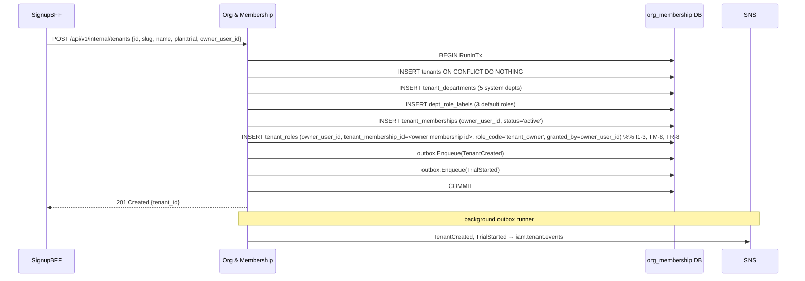
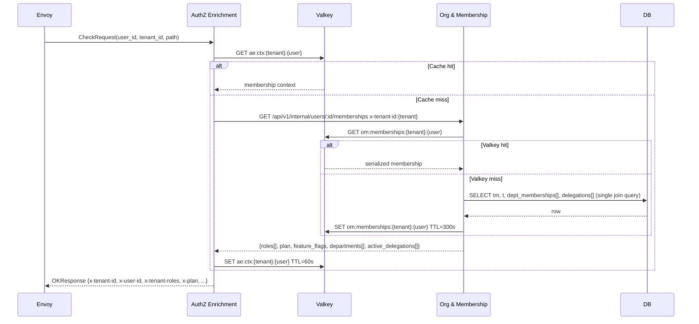
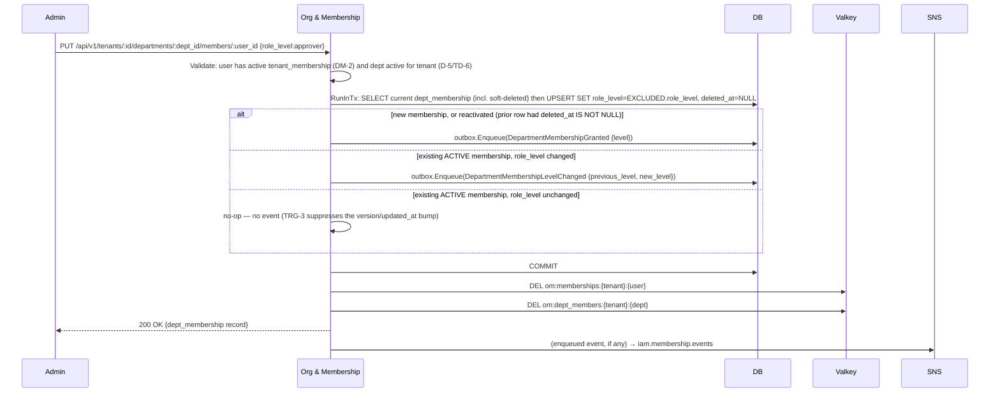
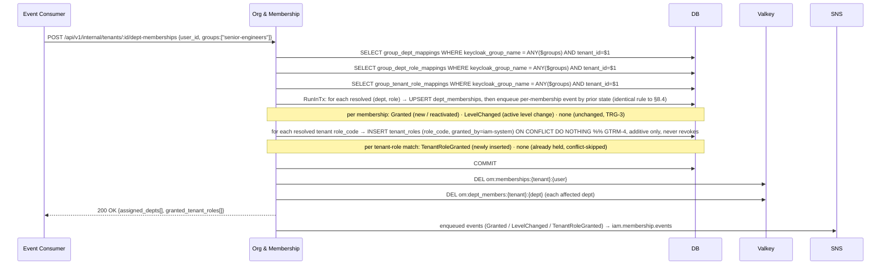
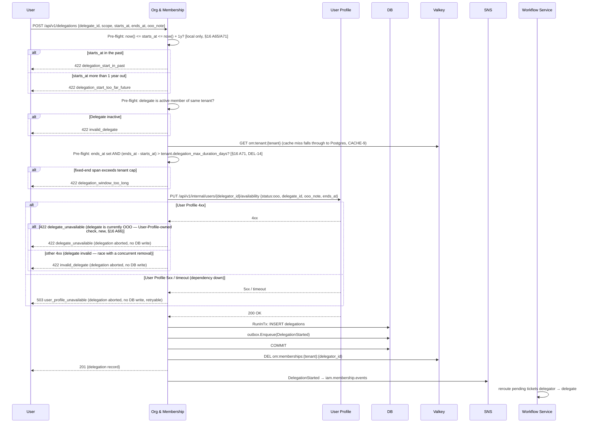
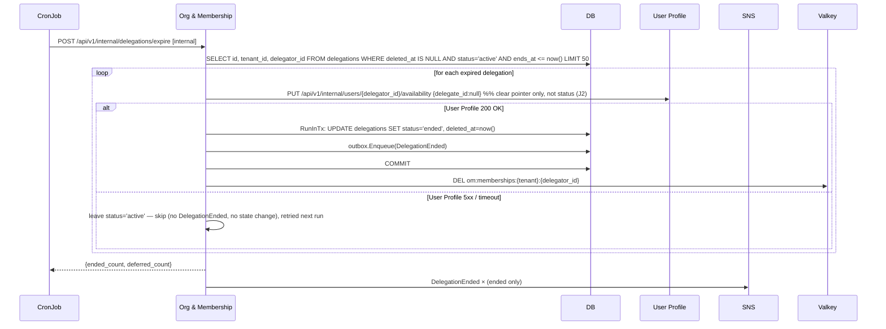
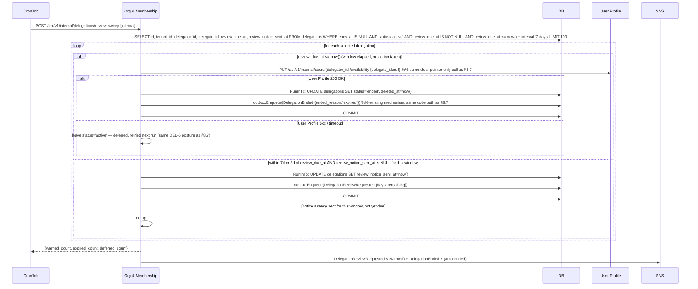
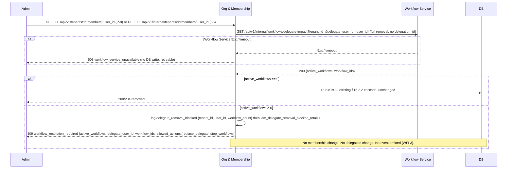
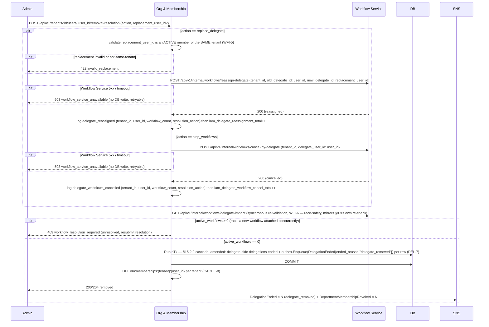

# Org & Membership Service — Low-Level Design

## Tender Management SaaS Platform — IAM Subsystem

| Field | Value |
|---|---|
| Document Type | Low-Level Design (LLD) |
| Service | Org & Membership Service (`iam-org-membership`) |
| Parent design | IAM High-Level Design v1.41 (Approved for LLD) |
| Subsystem | Identity & Access Management |
| Version | 1.73 (Draft) |
| Date | 2026-07-07 |
| Status | Draft for review |
| Audience | Platform engineering, security, SRE |
| Owner database | RDS PostgreSQL `org_membership` |

### Revision history

| Version | Date | Notes |
|---|---|---|
| 1.73 | 2026-08-11 | **Housekeeping — parent-design citation updated to HLD v1.41 (no schema/API/behavior change).** The header's `Parent design` field had drifted to a stale `v1.39` even though this LLD's own text already narrated HLD amendments past that point — `§16 A32(i)` (rev 1.33) recorded the HLD being amended to **v1.40** to add `TenantRoleRevoked`, and `§16 B4` (rev 1.56) already documents the gateway's `x-departments` header as department-**UUID**-keyed, the exact wire-format detail **HLD v1.41** just finalized (closing the AuthZ Enrichment LLD's `AE-11`). Verified against the uploaded HLD v1.41: its two substantive changes — the `x-departments` UUID-format finalization and a new `x-feature-flags` worked example — are both AuthZ Enrichment-side documentation clarifications with no corresponding schema, endpoint, or event change required on Org & Membership's side; B4's existing UUID-based description already matches what v1.41 finalized, so nothing here needed to change beyond the citation itself. Header `Parent design` line updated `v1.39` → `v1.41`; no register entry needed (pure metadata sync, not a design decision) — same posture as the `is_lead`-adjacent register hygiene at rev 1.45. |
| 1.72 | 2026-08-11 | **Added `GET /api/v1/internal/tenants/:id/mfa-freshness` (new I-14, new §16 A72) — closes a read-path gap the AuthZ Enrichment LLD flagged (its §16 AE-16).** AuthZ Enrichment's Approver step-up gate needs the tenant's `mfa_freshness_seconds` from its **authoritative source** — the `om:tenant` cache, evicted synchronously on every `PATCH /tenants/:id` (T-10/§16 A52) — not the informational copy riding **I-8**'s 300s per-user snapshot (which `P-2` does not evict, so a tightened window could stay masked for up to 300s there — unacceptable for a security-relevant gate). Neither **I-8** nor the public, member-scoped `GET /api/v1/tenants/:id` (P-1) is a fit. New **I-14** closes it: modeled directly on the existing **I-9** (`GET /api/v1/internal/tenants/:id/locale`) precedent — the same lightweight, cached, tenant-scoped internal GET shape already consumed service-to-service (by LLM Service for I-9; by AuthZ Enrichment here) — it reads the same `om:tenant` cache `mfa_freshness_seconds` already lives in (cache-miss falls through to Postgres, CACHE-9) and returns `{mfa_freshness_seconds}`. No new cache key, no new invalidation logic — `P-2`'s existing eviction already keeps it fresh. Cascaded: §5.3 internal-endpoint catalogue (new I-14 row), §6.1 cache-key table (`om:tenant:{tenant}` row now also names I-14 as a reader), §5.5 I-8 passthrough note (cross-referenced to the new authoritative read path), §16 A72. This closes the AuthZ Enrichment side's `§16 AE-16` from Org & Membership's side — recommend AE-16 move Proposed → Closed once their team confirms against this revision. |
| 1.71 | 2026-08-11 | **Closed the far-future/unbounded-span loophole in DEL-13's review-window design and fixed an `extend_days` governance gap — new `tenants.delegation_max_duration_days`/`delegation_review_window_days`, new invariant DEL-14, new §16 A71.** DEL-13 (rev 1.69) forces periodic review only on *open-ended* delegations (`ends_at IS NULL`); a delegation with a **fixed but absurdly distant** `ends_at` (e.g. year 2099) was technically bounded and so never entered `idx_delegations_review_due` at all — a loophole around the whole review mechanism. Closed it by adding, following the **exact** `mfa_freshness_seconds` pattern (§16 A20) on `tenants`: **`delegation_max_duration_days`** (`int NOT NULL DEFAULT 90 CHECK (BETWEEN 1 AND 180)`) caps every **fixed-end** delegation's total span (`ends_at - starts_at`); **`delegation_review_window_days`** (same shape/range/default) replaces the global `DELEGATION_REVIEW_WINDOW_DAYS` env var (§12, now superseded) as the **tenant-configurable** default for the open-ended review cycle. Both ride the existing `om:tenant:{tenant}` cache key and its existing P-2 invalidation — no new cache logic. **P-19** gains a second pre-flight bound: `starts_at` must now fall strictly between `now()` and `now() + 1 year` (new `422 delegation_start_too_far_future`, alongside the existing rev-1.64 `delegation_start_in_past`), and a fixed-`ends_at` request whose span exceeds the tenant's `delegation_max_duration_days` is refused with new `422 delegation_window_too_long`; both propagate to **P-33** `reassign`, which reuses P-19's full pre-flight verbatim. **P-32** `extend` previously accepted a caller-supplied `extend_days` with **no upper bound** — `extend_days: 99999` could push `review_due_at` out by centuries in one call, sidestepping DEL-13 entirely; now rejected with new `422 extend_days_out_of_range` when outside `[1, 180]` (the tenant's own configured range), matching how this LLD elsewhere handles caller-supplied numeric overrides (reject-with-error, not silent clamp — e.g. `400 invalid_limit`/PAGE-4, §16 A4). New invariant **DEL-14** (span/review-window both bounded to the tenant's `[1, 180]`-day range; `starts_at` additionally capped at 1 year out — a flat, system-wide sanity rule, not a third tenant knob). **Existing delegations that already exceed either cap are grandfathered — not retroactively altered**; new gauge `iam_delegations_exceeding_tenant_cap_total` (§11.2) gives operators visibility if a tenant later lowers its cap below what already exists. Cascaded: §3 ERD (`tenants`/`delegations`), §4.2 `tenants`/`delegations` DDL + notes + invariants, §5.3 P-1/P-2/P-19/P-32/P-33 catalogue rows, §5.4 P-19/P-32/P-33 specs, §8.6 sequence diagram, §8.7.1 narrative, §10.4 authorization table, §11.2 metric, §12 config (env var superseded), §13.1 CronJob narrative, §17 error taxonomy, §16 A71 (extends A70/DEL-13). |
| 1.70 | 2026-08-10 | **Widened the `DelegationReviewRequested` notice audience to all four stakeholders (amends §16 A70).** Rev 1.69 left the recipient list implicit (§7.3.2's queue row only said "user/admin emails"); on review, that read as "notify whoever can act" — the delegator (self) and `tenant_admin`/`tenant_owner`, matching P-32/P-33's authorization — which silently excluded the **delegate**. Since a driving motivation for this whole feature was protecting the delegate from carrying an unreviewed workload indefinitely, excluding them from their own review notice was an oversight, not a deliberate choice. **The notice now goes to all four:** the delegator, the delegate, and every `tenant_admin`/`tenant_owner` for the tenant. The delegate and the tenant owner are **notify-only** — they cannot call **P-32** `extend` or **P-33** `reassign` (that authorization is unchanged: delegator or `tenant_admin`/`tenant_owner`, per §10.4) — so a delegate who sees the notice and wants action taken still has to raise it with the delegator or an admin, not act unilaterally. No payload change: `DelegationReviewRequestedPayload` already carries `delegator_id`, `delegate_id`, and `tenant_id` (§7.3); resolving `tenant_admin`/`tenant_owner` recipients from `tenant_id` is Notification-service-side lookup logic, already how it resolves audiences for other tenant-scoped nudges (e.g. `TenantSeatOverageStarted`, §16 A59). Cascaded: §7.3.2 queue-row wording, §7.4 event-table note, §8.7.1 narrative, §16 A70 (amended in place, not superseded). |
| 1.69 | 2026-08-10 | **Added a 90-day delegation review window for open-ended delegations — new `DelegationReviewRequested` event, new `delegation-review` CronJob, `POST .../extend` and reassign support, invariant DEL-13 (new §16 A70).** DEL-8 deliberately allows `ends_at IS NULL` (an open-ended delegation, e.g. extended leave with no known return date) — left unmanaged this could run for years unreviewed, unfairly loading one delegate indefinitely. DEL-8 is **unchanged** — open-ended delegations remain fully valid — this only forces periodic human review of them. Added: config **`DELEGATION_REVIEW_WINDOW_DAYS`** (default `90`, §12); new nullable `delegations` columns **`review_due_at`** (set at creation to `starts_at + DELEGATION_REVIEW_WINDOW_DAYS`, only when `ends_at IS NULL`), **`review_notice_sent_at`** (tracks whether the current cycle's warning already went out; reset to `NULL` whenever `review_due_at` is pushed forward), and **`review_window_days`** (optional per-delegation override of the global default); new partial index **`idx_delegations_review_due`** (mirrors `idx_delegations_ends_at`, §4.2). New **`delegation-review`** CronJob (§8.7.1/§13.1, sibling to `delegation-expiry`): warns at 7 d and 3 d before `review_due_at` (emits **`DelegationReviewRequested`**, new event routed onto the **existing** `membership-notification-q` filter policy — no new topic/queue, §7.3.2; EVT-11's declared count corrected **eight → nine**), and auto-ends the delegation via the **existing** `DelegationEnded` mechanism at `review_due_at` if left untouched. Two new public endpoints — **P-32** `POST /api/v1/delegations/:id/extend` (pushes `review_due_at` forward by another window, resets `review_notice_sent_at`) and **P-33** `POST /api/v1/delegations/:id/reassign` (reuses the existing end + create flows verbatim, no new core logic) — both authorized for the delegator or `tenant_admin`/`tenant_owner`, matching P-20's existing cancel authorization (§10.4). New invariant **DEL-13**; new metrics **`iam_delegation_review_pending_total`** / **`iam_delegation_review_expired_total`** (§11.2, alert on a sustained non-zero expired rate). **Requires zero changes to User Profile** — every User-Profile-facing effect of this feature routes through the **existing** `PUT /internal/users/:id/availability` call already made on every delegation start/end (§8.6/§8.7); no new port, no new outbound call. Cascaded: §4.2 `delegations` DDL + notes + §3 ERD, §5.3 catalogue (P-32/P-33), §5.4 (two new specs), §7.3/§7.4 event table + AsyncAPI/JSON-Schema skeleton, §7.3.2 queue filter, §8.7.1 (new), §11.2, §12, §13.1, §16 A70. |
| 1.68 | 2026-08-10 | **Populated `ip_address`/`user_agent` on every event this service publishes (new §16 A69).** Neither field appeared anywhere in this service's `EventEnvelope` or event narrative, despite both existing in `platform-events` since v1.3.0 as `WithIPAddress`/`WithUserAgent` (audit-trail-only envelope fields, never forwarded as SNS message attributes) — a real, if quiet, observability gap. Implemented for **every** row of the §7.3/§7.4 published-events table: request-triggered events source both fields from the inbound HTTP request (`r.RemoteAddr`/`X-Forwarded-For`, the existing middleware convention, and the `User-Agent` header); the CronJob-originated events that have no HTTP request at all (`delegation-expiry`'s `DelegationEnded`, and the new `delegation-review` cron's `DelegationReviewRequested` + its own auto-end `DelegationEnded`, §16 A70) use a documented sentinel instead of leaving the fields null — **`ip_address: "system"`**, **`user_agent: "iam-org-membership/<job-name>-cron"`** (e.g. `iam-org-membership/delegation-expiry-cron`, `iam-org-membership/delegation-review-cron`) — so a future reader doesn't mistake a system-originated event for a data bug. Cascaded: §7.4 `EventEnvelope` schema (two new envelope fields), §7.3 published-events table note + new sentinel-convention paragraph. No wire-breaking change — purely additive envelope fields; `schema-gov` Pass 5 (open schema, no `additionalProperties: false`) already tolerates the addition, and no consumer contract narrows. |
| 1.67 | 2026-08-10 | **Recorded — but did NOT adopt — the new `platform-events` v1.4.0 `events.Codec` runtime-encoding hook; deferred as an open, explicitly-tracked decision (new §16 A68).** v1.4.0 adds `events.Codec` / `events.WithCodec` (publisher) / `events.WithConsumerCodec` (consumer) as an optional hook to actually encode/decode against a schema registry at publish/consume time — the library ships no concrete implementation of its own. Today's Glue integration (§7.3.1) is **CI-time-catalog-only**: `schema-gov register` uploads JSON Schema for governance/drift-detection, and every SNS message still goes out as plain JSON regardless. Decision: **defer adoption** — staying catalog-only is a valid, working design with no concrete driver to change it yet — but flag that adopting the Codec later is **not a solo O&M rollout**: every consumer of `iam.membership.events`/`iam.tenant.events` (Workflow Service, Audit Log, AuthZ Enrichment, Notification, Billing) would need `WithConsumerCodec` in the **same** rollout, since a consumer without it would receive raw encoded bytes instead of JSON. Recorded as an open, recommend-and-confirm item (same posture as `TenantRoleRevoked`'s cross-service flag, §16 A32(i)). Cascaded: §7.3.1 (new deferral paragraph after the schema-governance intro). No code, schema, or wire-format change — this is a documented non-decision, revisited only if a concrete driver emerges. |
| 1.66 | 2026-08-10 | **Bumped `platform-events` v1.3.0 → v1.4.0 — closes a latent PGBouncer/JSON outbox-write bug this service was exposed to (new §16 A67).** v1.3.1 (included in this range) fixed a bug where `OutboxRecord.Payload` (`[]byte`) was bound through pgx's `bytea` codec under `PGBouncerMode: true`, producing `invalid input syntax for type json` on **every** outbox write — this service runs `PGBouncerMode` **on** in production (§4, "fronted by PgBouncer in transaction-pooling mode"), so it sat exposed to that failure mode on v1.3.0 even though it was never observed in practice. `OutboxRecord.Payload` is now `json.RawMessage` internally; `outbox.Enqueue`'s public signature is unchanged, so **no code changes are required beyond the version bump**. Cascaded: §3.1 `go.mod`, §3.3.3 (new rationale paragraph), §9.3 failure-scenarios table (the stale `platform-events v1.3.0` reference corrected to v1.4.0). No schema, endpoint, or behavior change. |
| 1.65 | 2026-08-10 | **Recognize and pass through User Profile's new `422 delegate_unavailable` on the delegation-create availability call (new §16 A66).** User Profile's own LLD is adding an OOO-availability rejection to `PUT /internal/users/:id/availability` — it now returns `422 delegate_unavailable` when the proposed delegate is currently OOO themselves. O&M implements **no** OOO-eligibility logic of its own here; it only needs to recognize the new code on the **existing** call already made in the §8.6 coordination flow (step 2) and treat it exactly like the existing `invalid_delegate` 4xx branch: abort, write nothing to `delegations`, no outbox entry, propagate the error to the caller as the delegation-create failure. No new outbound call, no `port.UserProfileClient` method change — purely a new response-code branch recognized on a call already being made. Cascaded: §8.6 sequence diagram (new `422 delegate_unavailable` branch alongside `invalid_delegate`), §17 taxonomy (new `delegate_unavailable` row). No schema change. |
| 1.64 | 2026-08-10 | **Reject a past `starts_at` on delegation create — new pre-flight validation, fails fast with zero network cost (new §16 A65).** `POST /api/v1/delegations` (P-19) accepted a `starts_at` at any point in the past with no validation: the DB column (`starts_at timestamptz NOT NULL DEFAULT now()`, §4.2) carries no `CHECK` against `now()`, and neither the §2.3/§8.6 pre-flight step nor `chk_ends_after_starts` (DEL-8) constrains `starts_at` relative to the clock — DEL-8 only constrains `ends_at` relative to `starts_at`. Added a **service-layer** check — reject with **`422 delegation_start_in_past`** (new, §17) when `starts_at < now()`, allowing a few seconds of clock-skew tolerance — run in the existing §8.6 pre-flight step, **before** the User Profile availability call, so a malformed request is refused purely locally with no network round-trip. Cascaded: §8.6 sequence diagram (new pre-flight branch), §5.4 P-19 spec note, §17 taxonomy. No schema or DB constraint change — `starts_at` stays a plain default-`now()` column; the guard is service-layer only, deliberately not a DB `CHECK` since clock-skew tolerance isn't portably expressible in one (mirrors DEL-8's own service-layer-then-DB-backstop split, but this check has no DB backstop by design). |
| 1.63 | 2026-07-18 | **Renamed the ambiguous group-mapping endpoint path pre-deployment (new §16 A64).** P-14/P-15's `/api/v1/tenants/:id/group-mappings/roles` actually maps *department*-roles (`group_dept_role_mappings`); it had been kept as-is at rev 1.05 only "to avoid a breaking API change," leaving it inconsistent with the explicit P-29 `/group-mappings/tenant-roles`. Since the service is still in initial development with no deployed clients, renamed both to **`/group-mappings/department-roles`** so the path matches the table and forms a consistent trio with P-29 (`tenant-roles`) and P-17 (`departments`). Cascaded: §5.3 P-14/P-15 rows, §5.4 P-15 spec + note, §6.1 `om:grm` cache trigger; A25's "path unchanged" clause annotated as superseded. Path string only — no table, invariant, shape, or behavior change. |
| 1.62 | 2026-07-17 | **Tightened PE-1 wording to match what the two-layer dedup design actually guarantees (new §16 A63).** PE-1 said `processed_events` retention must exceed the "maximum broker redelivery window" (`8 d > 7 d`), but the true maximum — a DLQ message dwelling up to 14 days then being redriven — exceeds the 8-day dedup window, so the strict-inequality claim didn't hold against the DLQ tail. Reworded PE-1 to scope its bound to the **main-queue message lifetime** (the layer it governs, `8 d > 7 d`) and to state explicitly that DLQ-redrive-beyond-window duplicates are handled by **value-level idempotency** (IDEMP-4/§16 A43: EVT-14 stale-skip, PI-10 acceptance, IDEMP-3 UPSERT), not by dedup retention. Layer 1 (dedup table, in-window) vs Layer 2 (value-level, out-of-window) now cleanly separated. Kept the lockstep operational rule. Documentation only — no schema, retention value (`8 d`), or behavior change. |
| 1.61 | 2026-07-17 | **Answered two Workflow Definition Service integration questions (new §16 A61 + A62).** **A61 (event routing):** the Workflow engine needs tenant-lifecycle state (suspend→pause, offboard→terminate, paid-reactivate→resume, plan-change→queue-routing) but the HLD topology grants it no `iam.tenant.events`/`billing.events` consumer (those events are RP/Billing-produced; O&M only projects them). Rather than grant Workflow two new subscriptions, O&M now **relays its settled projection** as a new **`TenantStateChanged`** event on `iam.membership.events` (which Workflow already consumes), emitted in the same `RunInTx` as the projection `UPDATE` iff `status`/`plan` actually changed — never on an EVT-14 stale-skip (new invariant **EVT-16**). Cascaded: §7.1 relay note, §7.3 event row + topic description, §7.3.2 Workflow-queue filter, EVT-16, §14 test. **A62 (status code):** changed I-13's `assignee_ineligible` from **`409`→`422`** (§5.3/§5.4/§17 + the paired `tender-assignee-override-workflow.md`) — a well-formed request whose named assignee fails the node's `(department, level)` business rule belongs to O&M's 422-for-precondition family (`invalid_owner_candidate`/`department_deactivated`/`last_owner_removal`), not the 409 state-conflict family; Workflow aligns to 422. Also confirmed the dept-lead question is a non-blocking future concern already covered by §16 B4 (no lead routing; admin-stub/manual-revert stay `tenant_admin`/ACL). Both `TenantStateChanged` + Workflow's filter and the code change are flagged for HLD §9.4 sign-off (recommend-and-confirm, per A32(i)/A46). No schema change. |
| 1.60 | 2026-07-16 | **Added §7.3.2 SNS→SQS fan-out consumer-queue schema (new §16 A60), aligned to the User Profile LLD.** Outbound events previously listed consumers only in prose with no queue names or filter policies. Added per-topic tables mapping each consumer → its SQS queue (`<topic-short>-<consumer-short>-q` + `-dlq`, `maxReceiveCount=5`, matching the inbound `tenant-orgm-q`/`billing-orgm-q` and UP's `tenant-user-profile-q`) → its `EventType` filter policy → why it subscribes, for both `iam.membership.events` and `iam.tenant.events`. Makes concrete `membership-billing-q` (filtered to `TenantSeatOverage*` only, §16 A59) alongside the audit/authz/realm/notification/workflow queues; HLD §9.1 stays the authoritative registry. Documentation only — no schema/endpoint/payload change. |
| 1.59 | 2026-07-16 | **Added a seat-overage grace + Billing-driven-enforcement model for seat downgrades (product direction; new §16 A59).** Paid plans carry no plan-tier seat quota — a tenant buys any number of seats (`licensed_seats` = purchased count, already the model: seats were never on `plans`; pricing is Billing-owned, §16 A32(b)/A30). The gap was the **downgrade** case (e.g. 20→10 while 15 in use): prior SEAT-3 blocked new invites but left the tenant over-cap indefinitely with no grace clock or enforcement hand-off. Added, mirroring the `cancelled_at`/§15.5 and `ownerless_since`/A39 durable-marker patterns: **`tenants.overage_since timestamptz`** (§4.2 + §3 ERD + `idx_tenants_seat_overage`), **SEAT-5**, a **reworded SEAT-3** (temporary over-cap; existing users keep access through grace; new additions blocked immediately; post-grace → Billing enforcement). Enforcement is **Billing-driven** (chosen over O&M auto-suspend, preserving the "no passive suspension" stance, DEL-5/DM-1): O&M exposes the state (`seat-usage` gains `overage_since`/`grace_ends_at`) and emits **`TenantSeatOverageStarted`/`Resolved`** on `iam.membership.events` (Billing consumes via filter policy; Notification for banners), but never removes/suspends a user itself. New config **`SEAT_OVERAGE_GRACE_DAYS`** (30), metrics **`iam_seat_overage_tenants`**/**`iam_seat_overage_started_total`**, **`seat-overage-reconcile`** backstop cron, §14 tests, additive zero-downtime migration (nullable `timestamptz`, no backfill). Cross-service `TenantSeatOverage*` events + Billing consumer flagged for HLD §9.4/§9.1 amendment (recommend-and-confirm, per A32(i)/A46); degrades safely (Billing can pull via I-11 meanwhile). |
| 1.57 | 2026-07-15 | **Built out the `realm_sync_pending` Option-A machinery that was specified in prose but never modeled (self-review after the §3 ERD-vs-§4.2 alignment pass; new §16 A58).** §4.2/§20.7 committed `local_accounts_enabled` propagation to **Option A** — on inline Realm-Provisioner failure, mark the committed row `realm_sync_pending`, return `202`, and let a background reconciler converge via the idempotent `PATCH …/realm-config`, with an SLO alert. **But none of that existed:** no `realm_sync_pending` column, no reconciler CronJob, no index, no metric/alert, no invariant, no test — the same latent-design-bug class as A57 (`trial_reactivation_count`)/A24/A32(g), where behavior references an undefined schema/ops object. Added, mirroring the A34 `kc_cleanup_pending` pattern exactly: **`tenants.realm_sync_pending boolean NOT NULL DEFAULT false`** (§4.2 + §3 ERD) + partial index **`idx_tenants_realm_sync_pending`**; the **`realm-config-sync`** reconciler CronJob (§13.1, `*/2`, prioritises un-applied *disables* since a lagging disable is security-relevant); metrics **`iam_realm_sync_pending`**/**`iam_realm_sync_failed_total`** + page alerts (§11.2); invariant **T-15**; a §14 integration test (`200` inline-success / `202`+pending inline-failure / reconciler-converges / disable-prioritised / idempotent-PATCH). Also fixed the §18.3 wrong cross-ref (`PatchRealmConfig` reconciler cited PI-6, the invitation-revoke invariant → now T-15) and tightened the §20.7 matrix + `Tenant-setting propagation` integration row to state the `202`/reconcile path. Additive zero-downtime migration (constant `DEFAULT false`). No behavior change beyond making the already-committed Option-A design real and enforceable. |
| 1.56 | 2026-07-10 | **Applied the Workflow Service integration-sync confirmations (`workflow-service-integration-sync.md`) — resolved A12, confirmed the §8.8.1 request shape, and reverted B4.** **A12/WFI-11 (RESOLVED):** the Workflow Service accepted the department-scoping gap and chose an optional **`delegation_id`** parameter (not the `department_id` this LLD had proposed) on `GetDelegateImpact`/`ReassignDelegate`/`CancelByDelegate` — more precise (it disambiguates overlapping delegations and covers `scope='tender'`, which `department_id` can't) and free for O&M, since §8.8.4's pre-filter already resolves the exact `delegations.id`. Added `delegationID *uuid.UUID` to the §8.8.1 interface + the three endpoints; §8.8.4 now passes the pre-filter row's id; omitting it preserves today's tenant-wide behavior (§8.8 full-removal). **§8.8.1 request shape (confirmed):** `delegate-impact` moves from a non-standard `GET`-with-JSON-body to **`GET …?tenant_id=&delegate_user_id=&delegation_id=`** (query params), response unchanged. **B4 (REVERTED — `is_lead` NOT modeled):** the Workflow Service confirmed it has **no department-lead routing** and that `is_lead` can be dropped, so the rev-1.51 option-A addition was undone — removed `dept_memberships.is_lead`, `uq_dm_one_lead_per_dept`, DM-6, the P-10 body field, the `is_lead` event-payload fields, `409 lead_already_assigned` (§17), the §19.3 migration, and the §14 test; §4.2 note + B4 register rewritten to "not modeled" (joins `effective_*`/A32(e) as an HLD-DDL column omitted for want of a consumer). `department-membership-role-change-workflow.md` stripped of `is_lead` to match. |
| 1.55 | 2026-07-10 | **Added the missing `tenants.trial_reactivation_count` column and reconciled the reactivation ownership (trial-reactivation-workflow cross-check, TR1+TR2; new §16 A57).** §15.4 enforced the one-time trial reactivation cap (TRIAL-5) by incrementing `trial_reactivation_count` with a `CHECK (<= 1)` backstop — but the column was never in the §4.2 `CREATE TABLE`, §3 ERD, or invariants (referenced exactly once, in §15.4 prose), so the cap couldn't actually run — the same latent-column bug as A24/A32(g). Added `trial_reactivation_count int NOT NULL DEFAULT 0 CHECK (BETWEEN 0 AND 1)` (§4.2 + §3 ERD + new invariant **T-14** + §19.3 migration, constant-default zero-downtime). **TR2:** reconciled §15.4 — reactivation is Realm-Provisioner-driven (RP validates the single-use signed token, re-enables the user, emits `TrialReactivated`); O&M **consumes** it (§7.1) and in one tx checks/increments the counter and sets `status='trial'` + fresh `trial_ends_at` (idempotent via `processed_events`) — the one-time guarantee is single-use token **+** counter/`CHECK`, not a single cross-service transaction. **TR3:** the workflow's `plan.trial_duration` is the O&M `plan.trial_duration_days` (A32(g)). Paired with `trial-reactivation-workflow.md`. |
| 1.54 | 2026-07-10 | **Reconciled the trial expiry/cleanup cron ownership and fixed a PII-scrub-timing bug (trial-expiry-cleanup-workflow cross-check, TE1; new §16 A56).** Three parts of this LLD described the trial sweep inconsistently: §7.1 (O&M *consumes* `TrialExpired` produced by Realm Provisioner), §13.1 (O&M's own `trial-cleanup` cron), and §15.3 (ambiguous "the daily lifecycle cron"). Settled on the model consistent with §7.1 and the paid lifecycle (OFF2, RP produces / O&M consumes): **Realm Provisioner owns the realm-side sweep** (detect expiry, disable/delete Keycloak users, emit `TrialExpired`); **O&M owns the DB-side** — consumes `TrialExpired` for the Phase-1 `trial_expired` flip, and its **`trial-cleanup` cron** does the Phase-2 soft-delete/PII-scrub after grace. **Bug fixed:** §7.1's `TrialExpired` handler said "**PII scrub now**" — which would scrub a tenant's PII at `trial_expired`, i.e. *during* the 15-day reactivation grace, destroying a still-recoverable tenant's data; corrected so scrub happens only in Phase 2 after grace. Also documented that **User Profile** scrubs per-user PII via the existing per-user `USER_DELETE`→Event-Consumer→`DELETE /internal/users/:id` path (UP §8.7) — no tenant-wide UP scrub needed here (contrast A54/OFF1), because trial hard-delete removes Keycloak users individually. §15.3 rewritten; §7.1/§13.1 clarified. No schema/behavior change beyond the scrub-timing correction. Paired with `trial-expiry-cleanup-workflow.md`. |
| 1.53 | 2026-07-10 | **Added internal endpoint I-13 (assignee-override validate-and-emit) — closes the missing trigger for `TenderAssigneeOverridden` (tender-assignee-override-workflow cross-check, TAO2; new §16 A55).** A32(d) had settled that `assignee_overrides` is Workflow-owned and O&M only *validates + emits* — but the emitted event had **no API to trigger it** (§5.3/§5.4 defined no override route), and the workflow doc depicted a nonexistent O&M `override-assignee` endpoint while also wrongly having O&M *persist* the override row (TAO1). Added **I-13** `POST /api/v1/internal/tenants/:id/tenders/:tender_id/assignee-override` (Workflow-caller): authorize `tender_admin` (`403`), validate the new assignee is an active member holding the Workflow-supplied `(department_id, required_level)` (`409 assignee_ineligible`, new §17 code), then emit `TenderAssigneeOverridden` (`{tender_id, tenant_id, user_id, actor_id}`) — **persisting nothing** (the record stays Workflow-owned, §2.2/A32(d)). New invariant **OVR-1** (call-then-persist ordering; the event is a notification, not authoritative node state). Cascaded: §5.3 I-13 row, §5.4 I-13 spec, §7.3 event trigger note, §17 taxonomy, §16 A55. No schema change. The paired `tender-assignee-override-workflow.md` doc was corrected to make the Workflow Service the persister and O&M validate-and-emit only (TAO1). |
| 1.52 | 2026-07-10 | **Clarified `TenantOffboarded` producer/consumer and the cross-service PII-scrub contract (tenant-offboarding-workflow cross-check, OFF1 + OFF2) — §15.5, new §16 A54.** **OFF1:** the offboarding wipe reached only O&M-owned rows and the Keycloak realm; **User Profile's per-user PII** (name/phone/job_title/credentials/signature/availability) lives in the UP database, which O&M's `ON DELETE CASCADE` cannot reach — so it survived offboarding. Documented that `TenantOffboarded` fans out to **O&M** (its tenant-scoped rows), **User Profile** (its own PII — new UP consumer + tenant-wide scrub, UP LLD §8.7a/C14, rev 0.26), and **Audit** — each service erasing what it owns on the same terminal event. **OFF2:** reconciled the saga wording — `TenantOffboarded` is **produced once by the Realm Provisioner** (only after export+delete is verified) and O&M **consumes** it; O&M's soft-delete/PII-scrub is a consume-side, `processed_events`-idempotent reaction, **not** an outbox emission committed alongside the event (the prior "soft-delete + `TenantOffboarded` commit atomically via the outbox" wording wrongly implied O&M emits it). No schema/behavior change on O&M's side; documentation + cross-service contract. Paired with User-Profile LLD rev 0.26. |
| 1.51 | 2026-07-10 | **Resolved §16 B4 + closed workflow gap X1 (department-membership-role-change workflow cross-check): added `dept_memberships.is_lead` (option A).** B4 had been open pending Workflow-Service confirmation that lead-based routing exists; the `department-membership-role-change-workflow.md` cross-check supplied it — the workflow persists `is_lead` on the membership row (Stage 4) and treats setting/unsetting it as a first-class membership edit (gap X1). Adopted the recommended **option A**: added **`is_lead boolean NOT NULL DEFAULT false`** plus the partial unique index **`uq_dm_one_lead_per_dept (tenant_id, department_id) WHERE is_lead AND deleted_at IS NULL`** (single lead per department). New invariant **DM-6**: `is_lead` is a **Workflow routing hint, not an authz input** — orthogonal to `role_level`, **not** in the I-8 projection (never on the hot path), capability-neutral (a lead toggle emits `DepartmentMembershipLevelChanged` with `previous_level == new_level` and never triggers the §8.8.4 delegate gate, WFI-12), JIT/acceptance rows default `false`. Cascaded: §4.2 DDL + note + DM-6, §3 ERD, P-10 (`is_lead` body + `409 lead_already_assigned`), §8.4 event-selection, §7.3 `DepartmentMembershipGranted`/`LevelChanged` payloads (additive per SCHEMA-4/SCHEMA-10), §17 taxonomy, §19.3 migration (constant-default additive column + `CONCURRENTLY` index), §14 test. Surfaced by checking `department-membership-role-change-workflow.md` against this LLD. |
| 1.50 | 2026-07-10 | **Resolved §16 A53 (authenticated-request-authorization workflow cross-check, W-A): I-8 now projects the tenant subscription posture.** AuthZ Enrichment folds a `cancelled → read-only` flag into `x-feature-flags`, but I-8 returned only the membership `status` + `plan`/`feature_flags`, so a cold cache-miss rebuild couldn't reconstruct `read_only` and would allow writes on a cancelled tenant until a `TenantSubscriptionCancelled` event re-arrived. Added **`subscription_status`** (the tenant's commercial state) and derived **`read_only`** (`= subscription_status='cancelled'`) to the I-8 response so the rebuild is self-sufficient/event-independent (the per-user cache still uses AuthZ's `iam.tenant.events` subscription for prompt invalidation; the I-8 field is the cold-rebuild floor). No schema change — projects the joined `tenants.status`. §5.4 I-8 response + derivation note. |
| 1.49 | 2026-07-10 | **Resolved §16 A51 + A52 (approver-approval-signature workflow cross-check, W2 + W4).** **A51/W2:** added internal endpoint **I-12** `GET /api/v1/internal/tenants/:id/tenders/:tender_id/acl/:user_id` (`{has_access, access_level}`, active per TAE-3, short-TTL cached, P-22/P-23 evict) — the missing service-to-service consumption path for the tender-`approve` ACL the approval workflow needs (P-21 was admin-listing only); the approval-gate *policy* (all tenders vs restricted-only) is flagged for Tender-Service confirmation. **A52/W4:** reconciled the `mfa_freshness_seconds` contradiction (T-10 "read fresh" vs §5.4 "300 s per-user cache") — the approver step-up now sources it from the **P-2-evicted `om:tenant` cache**, so a tightening is effective on the next request, not masked up to 300 s by the per-user snapshot (which stays informational). Cascaded: §5.3 I-12 row, §5.4 I-12 spec, T-10 reword, §5.4 I-8 note. No schema change. Both surfaced by checking `approver-approval-signature-workflow.md` against this LLD. |
| 1.48 | 2026-07-09 | **Notation — endpoint paths written in full `/api/v1/...`.** The §5.3 catalogue and all inline route references (specs, §8 flows, §16 register, revision history) previously used the bare `/api/...` form while §5.1 stated all routes are under `/api/v1`; every path is now spelled out `/api/v1/...` so each row is unambiguous and copy-paste-exact. No route, behavior, or version change — purely a notation normalization to match the stated §5.1 convention. |
| 1.47 | 2026-07-09 | **Resolved §16 A50 (User-Profile architecture-review J4): documented the subsystem metric-naming convention for the shared `iam_` prefix.** Both O&M and User Profile emit `iam_*` metrics; rather than move to per-service prefixes (which fragment subsystem dashboards), keep `iam_` and disambiguate the emitter by the Prometheus `job` label (`job=iam-org-membership`), with two conventions: custom metric names are unique across IAM services (name = concept, `job` = service), and multi-emitter queries aggregate `by (job)`. Documented in §11.2, identically to the User-Profile LLD (§16 C8). Documentation only; no metric renames. |
| 1.46 | 2026-07-09 | **Resolved §16 A49 (User-Profile architecture-review J2): delegation-end no longer asserts the delegator is `available`.** The §8.7 expiry job called User Profile `{status:available, delegate_id:null}` on delegation end — conflating "delegation ended" with "delegator returned," so an early end (delegate removed §8.8, or admin cancel) flipped a still-away user to `available`/assignable. O&M now calls endpoint #18 with **`{delegate_id:null}` only** (clear the pointer, never touch `status`/`ooo_until`); the delegator's return is owned solely by User Profile's `ooo_until` sweep (UP LLD §8.9 Path B) or the user's explicit return, since UP holds the authoritative OOO window. DEL-6 ordering (UP-first, 200-gated, then commit `DelegationEnded`) unchanged. Paired with User-Profile LLD rev 0.19 (§16 C6, endpoint #18 delegate-clear semantics). Cascaded: §8.7 diagram + note, DEL-6. No schema change. |
| 1.45 | 2026-07-09 | **Register hygiene — §16 A32 status cell corrected (no design change).** A32's status had been appended to across revs 1.26–1.33 and still **led with "Open —"** and lacked the `~~strikethrough~~` Type marker every other resolved item carries, even though its own text already concluded "A32 fully resolved" — so it rendered as Open despite all sub-items (a)–(i) being fixed/resolved/accepted. Rewrote the status cell to a clean `RESOLVED` summary and struck through the Type label, matching the register convention. The only residual from A32 is **B4** (`is_lead`), which was always tracked as its own open row. Cosmetic/consistency only. |
| 1.44 | 2026-07-09 | **Resolved §16 A47 + A48 (architecture-review fourth pass, I1 + I2) — verification/documentation hardening, no schema or behavior change.** **A47/I1:** the RLS tenant-GUC's transaction-local scoping under PgBouncer transaction pooling was the one isolation-critical property not pinned as an explicit invariant, and the read-path binding was unstated ("`RunInTx` for all writes" omitted reads). Added **RLS-6** — the `app.tenant_id` GUC is bound transaction-locally (`set_config(…, is_local => true)`) on every checkout, reads included, never session-scoped, so it cannot survive on a pooled backend; §3 clarified `GUCSetFromContext` binds reads too; §14.5 **Case 5** added (pooled-connection cross-tenant-no-leak test + unset-GUC-fails-closed assertion); CI greps for a forbidden non-`LOCAL` `SET`. The runtime was already correct (the §14.5 tests already used `SET LOCAL`); this converts "safe by library behavior" into "safe by asserted+tested property," matching PE-1's precedent. **A48/I2:** documented a deliberate per-tenant metric-cardinality posture in §11.2 — `tenant_id` is bounded by tenant count, no unbounded labels exist, per-tenant granularity is kept for on-call attribution; guardrails added (prohibit unbounded new labels; revisit threshold past ~10k tenants to drop `tenant_id` from high-churn counters). Both close the fourth architecture-review pass — **all findings across four passes (F1–F6, G1–G5, H1–H3, I1–I2) now resolved.** |
| 1.43 | 2026-07-09 | **Resolved §16 A46 (architecture-review third pass, H3): privilege reduction now actively revokes Keycloak sessions, with a documented TTL backstop.** P-7 suspend / P-8 removal / P-28 de-privilege were pure O&M state changes, so a compromised or de-privileged user's existing token/cached authz survived to expiry — worst case exactly when suspend is used as a security freeze. Added invariant **AUTH-8**: after the change commits, O&M makes a best-effort, fail-open `RealmProvisionerClient.RevokeUserSessions` call (new §18.3 port method → Keycloak logout + `notBefore`) to cut live access promptly; on RP failure the change still stands, `iam_session_revoke_failed_total` pages, and the guaranteed cutoff falls back to the now-documented bound (≤ access-token lifetime + 300 s cache TTL). Not a hard dependency (a freeze must not be blockable behind RP, per WFI-13); the I-5 hard-delete path already kills sessions. The RP session endpoint is flagged for the Realm-Provisioner team (recommend-and-confirm); until it ships the TTL backstop is the sole cutoff, so it degrades safely. Durable-reconcile deferred (TTL floor already bounds exposure). Cascaded: §18.3 port + RP table, AUTH-8, §8.8.5 suspend behavior, §11.2 metric+alert, §14.2 test. Closes H3 — **all third-pass findings (H1–H3) now resolved**. |
| 1.42 | 2026-07-09 | **Resolved §16 A45 (architecture-review third pass, H2): the user-removal cascade now soft-deletes `tenant_roles`.** §15.2.2 soft-deleted `dept_memberships`/`tender_acl_entries`/`delegations` but not the user's elevated `tenant_roles` grants — they were left `deleted_at IS NULL` and inert only via TM-9's active-membership filter, an asymmetry that also contradicted TM-12's own wording ("after the owner's `tenant_roles`/membership rows are soft-deleted"). Added cascade **step 1b** (`UPDATE tenant_roles SET deleted_at=now() WHERE user_id=$u AND deleted_at IS NULL`) in the same `RunInTx`, symmetric with the sibling tables (new invariant **TR-9**), emitting `TenantRoleRevoked` per revoked elevated grant (TR-4/DEL-7 audit parity, existing event type — no schema change). Suspension still retains grants (M-1, frozen); only `left`/removed triggers the soft-delete. Makes TM-12 literally accurate and the last-owner recount robust by construction. Cascaded: §15.2.2 diagram+prose+step-6 comment, TR-9, §14.2 test. Closes H2; H3 (per-user suspend/revoke has no active session kill) remains the last open third-pass follow-up. |
| 1.41 | 2026-07-09 | **Resolved §16 A44 (architecture-review third pass, H1): closed a cross-row TOCTOU race on the last-owner invariant.** TM-8 ("≥1 active `tenant_owner`") was a service-layer check-then-act over **separate `tenant_roles` rows**, with no tenant-level lock — so two concurrent owner-drops on different rows (two P-28s, or P-8 ∥ P-28) could each pass the check and both commit, zeroing owners, and the resulting ownerless tenant didn't even trigger the G1/TM-12 escalation (I-5-only), making it silent. Added **TM-13**: owner-affecting mutations (P-8 / P-7-of-an-owner / P-28 dropping `tenant_owner`) take `SELECT … FOR UPDATE` on the `tenants` row (the lock SEAT-1 already uses) and do the last-owner count-and-act inside it, so the second op blocks, re-reads, and is refused `422 last_owner_removal`. Added a TM-12 defense-in-depth recount on the actor paths so a future locking regression escalates rather than silently orphaning. Cascaded: TM-8 reword, TM-13, TM-12 note, P-28 behavior (step 0/4) + response codes + P28-3, §15.2.2 actor-vs-identity prose, §14.2 concurrency test with a lock-removed regression guard. Pure locking discipline; no schema change. Closes the one High finding of the third architecture-review pass (H2/H3 remain open follow-ups). |
| 1.40 | 2026-07-09 | **Resolved §16 A42 + A43 (architecture-review second pass, G4 + G5) — observability/documentation hardening, no schema or behavior change.** **A42/G4:** added a consume-side freshness SLO for the two inbound lifecycle queues — new **SLO-3** (producer publish → `tenants` projection within **30 s p99**), backed by the `iam_lifecycle_consumer_lag_seconds` gauge (SQS `ApproximateAgeOfOldestMessage`, §11.2) with a page alert. This is now the **primary drift signal** because EVT-14 (rev 1.34) silently skips stale events — a lagging/wedged consumer no longer shows up as reprocessing errors, only as rising lag. **A43/G5:** added **IDEMP-4** making the `processed_events` 8-day dedup window explicit and documenting that it is **not** a correctness dependency — beyond-window duplicates (SQS/DLQ max ~14 days) are backstopped by EVT-14 (lifecycle stale-skip), PI-10 (acceptance), and IDEMP-3 (membership UPSERT); §15.7 retention row annotated to match. Both close the two Low findings of the post-1.36 architecture-review second pass — **G1–G5 now all resolved**. |
| 1.39 | 2026-07-09 | **Resolved §16 A41 (architecture-review second pass, G3): throttled the invitation flow against Keycloak-shell churn and email-bombing.** SEAT-1 caps concurrent active+pending seats but not the *rate* of invites — and because revoke/expiry frees a seat instantly, an admin could loop invite→revoke→re-invite (Realm-Provisioner account thrash) or repeatedly invite one address (unmetered onboarding email). Added two pre-flight guards to P-6, evaluated **before** the RP call so a refused invite creates no Keycloak user and sends no email: **PI-11** per-email re-invite cooldown (`429 reinvite_too_soon`, `INVITE_REINVITE_COOLDOWN_MINUTES` default 60) and **PI-12** per-tenant hourly invite ceiling (`429 invite_rate_limited`, `INVITE_MAX_PER_TENANT_PER_HOUR` default 200 — a churn ceiling, not the seat bound). Both derive from `pending_invitations.created_at` (no new state), are advisory/best-effort (SEAT-1 remains the hard transactional gate), and emit `iam_invite_throttled_total{reason}`. Corrected the now-stale "O&M emits no 429" claims in §5.5 and §17 — O&M now emits 429 for invite throttling; quota/rate 429 stays the gateway's/Usage & Metering's. Cascaded: §5.4 P-6 step 1a + codes, §4.2 PI-11/PI-12, §12 config, §11.2 metric/alert, §5.5 + §17 taxonomy, §14.1 test. Closes G3; G4 (consumer-lag SLO) and G5 (`processed_events` retention note) remain open follow-ups. |
| 1.38 | 2026-07-09 | **Resolved §16 A40 (architecture-review second pass, G2): hardened the EVT-14 recency guard against a wall-clock poison-pill and documented its DLQ-redrive semantics.** EVT-14 advances `tenants.last_event_at` to the producer's CloudEvents `time`, so one mis-stamped far-future event (NTP failure / clock drift / bad replay) would freeze a tenant's projection — every later, correctly-stamped event would read as stale. Added a **future-time sanity clamp** (new **EVT-15**): before the recency comparison, an event with `time > now() + MAX_LIFECYCLE_EVENT_SKEW_SECONDS` (new config, default 300 s) is treated as corrupt — not applied, `last_event_at` not advanced, not recorded in `processed_events` — and **rejected to the DLQ** with `iam_future_lifecycle_event_rejected_total`++ (pages). Failing loud to the DLQ bounds a bad clock to one replayable message rather than a wedged tenant. Also documented (§20.1) that a DLQ redrive of an old lifecycle event is **intentionally** skipped by EVT-14 when a newer event advanced the watermark, so a post-redrive spike in `iam_stale_lifecycle_event_skipped_total` is expected. The monotonic-version alternative (removes the wall-clock dependence but needs a producer-contract change) is noted and deferred. Cascaded: §7.1, §7.5 (EVT-14 reword + EVT-15), §11.2 metric/alert, §12 config, §20.1, §14.2 test. Closes G2; G3–G5 remain open follow-ups. |
| 1.37 | 2026-07-09 | **Resolved §16 A39 (architecture-review second pass, G1): last-owner protection now has a path for identity-layer deletion of the sole owner.** TM-8's `422 last_owner_removal` only covers actor-initiated paths (P-8/P-7/P-28); the `I-5` Keycloak-`USER_DELETE` path can't refuse (the identity is already gone), so a sole-owner deletion previously forked into an unhandled *ghost owner* (refuse) or *orphaned tenant* (proceed). Fixed with **complete-and-escalate**: added `tenants.ownerless_since timestamptz` (T-13) + `idx_tenants_ownerless`; the §15.2.2 I-5 cascade gains step 6 (new **TM-12**) — on removing the last active owner it completes the soft-delete and, in the same `RunInTx`, sets `ownerless_since`, bumps `iam_tenant_ownerless_total`, and logs `tenant_ownerless_escalation` (ERROR); the new `iam_tenant_ownerless` gauge pages `platform_operator`. New operator-only endpoint **O-7** `POST /api/v1/operator/tenants/:id/reassign-owner` (AUTH-6) grants `tenant_owner` to an existing active member and is the sole clearer of the marker — reusing the existing `TenantRoleGranted` event so **no HLD change** is needed. TM-8 reworded to scope its refusal to the actor paths; new error codes `422 invalid_owner_candidate` / `409 tenant_offboarded`. Additive nullable migration, no backfill. Cascaded through: §3 ERD, §4.2 DDL/note/index/T-13, TM-8/TM-12, §15.2.2 cascade+prose, §5.3 catalogue + §5.4 O-7 spec, §10.4 auth table, §11.2 metrics+alert, §11.4 logs, §17 taxonomy, §14.2 tests. Closes the one High finding of the post-1.36 architecture-review second pass (G2–G5 remain open follow-ups). |
| 1.36 | 2026-07-07 | **Architecture-review follow-ups F3–F6 (§16 A35–A38) — documentation/observability hardening, no schema change.** **A35/F3:** added a **§20.7 synchronous cross-service dependency & degradation matrix** collating every write-path dependency (Realm Provisioner, User Profile, Workflow) with its fail-open/closed/durable-reconcile posture and failure behavior, plus the note that reads (I-8) have no synchronous dependency. **A36/F4:** added a **§19.5 migration-ordering plan** for incremental upgrades — the hard inter-dependencies (uq_tm_id_tenant_user before composite FKs; plans-seed before tenants.plan FK; member-delete before chk_tr_no_member) and the three cross-service-coordinated cutovers — that were invisible reading §19.3 per-block. **A37/F5:** added **PI-10** making I-3 acceptance idempotency explicit (webhook redelivery is a safe no-op via the pending→accepted flip + `uq_tm_active_user`; recommended `event_id` dedup). **A38/F6:** PLAN-3 now states the ≤300 s plan-edit propagation window, and §15.8 — which wrongly claimed "no PII beyond UUIDs" — now documents `pending_invitations` (`email`/`full_name`) as the one PII exception and requires person-level GDPR erasure to scrub it **by email**. All four resolve the Medium/Low findings from the rev-1.33 architecture review (F1/F2 were the High ones, resolved in 1.34/1.35). |
| 1.35 | 2026-07-07 | **Resolved §16 A34 (architecture-review F2):** made the invite saga's Keycloak-user compensation durably reconciled instead of best-effort.** The invite creates a Keycloak user at the Realm Provisioner before the O&M tx (CONS-2); the undo (revoke/expiry/seat-lost-race) was a best-effort inline `DeleteUser`, so a pod crash or RP outage mid-compensation orphaned the KC user — and the lost-race rolled the row back, losing the reference entirely. Added `pending_invitations.kc_cleanup_pending boolean` + `idx_pi_kc_cleanup` and a new `invitation-kc-cleanup` reconciler (§13.1): every compensation path records the marker on a **committed** row (the lost-race now commits a `revoked` row with `keycloak_user_id` + `kc_cleanup_pending=true` rather than rolling back), and the reconciler sweeps the marker, calls the idempotent RP `DeleteUser`, and clears it — guaranteeing convergence even under partial failure (new **PI-9**; the durable analogue of `local_accounts_enabled`/`realm_sync_pending`). Also closed a latent orphan: **expiry** now schedules KC-user deletion too. New metrics `iam_invite_kc_cleanup_pending`/`iam_invite_kc_cleanup_failed_total`; `invitation-cleanup` won't prune a row still awaiting cleanup. Migration: additive `boolean NOT NULL DEFAULT false`, zero-downtime. Cascaded through §4.2 DDL/index/ERD, PI-5/PI-6/PI-9, §5.4 P-6 lost-race branch + prose, §8.10 flow, §13.1 crons, §11.2 metrics, §18.3, §19.3, §14.1/§14.2 tests. |
| 1.34 | 2026-07-07 | **Resolved §16 A33 (architecture-review F1): added a last-writer-wins recency guard to the `tenants` projection.** SNS→SQS is at-least-once **and unordered**, and `processed_events` (exact-duplicate dedup) + EVT-6 (illegal-transition block) left a **legal-but-stale** apply unguarded — a reordered `TenantSubscriptionCancelled`-after-`TenantReactivated` could regress an active tenant, and a stale `TenantSeatsChanged`/`TenantPlanChanged` could revert `licensed_seats`/`plan` (SEAT-2/4 accept every projection). Added `tenants.last_event_at timestamptz` and a **consume-side guard** (new **EVT-14**): each `tenant-orgm-q`/`billing-orgm-q` handler, under the tenant row lock, skips any event whose CloudEvents `time` (already in the §7.4 envelope) is `<= last_event_at` (still recording `processed_events`, incrementing new metric `iam_stale_lifecycle_event_skipped_total`) and otherwise applies + advances `last_event_at` — making the projection **order-independent** (newest producer timestamp wins). No producer change; `last_event_at` moves only on consumed events, never API writes. Additive nullable migration, no backfill (`NULL` applies the first event). Cascaded: §4.2 DDL + §3 ERD, §7.1 recency-guard note, §7.5 EVT-14, §11.2 metric, §19.3 migration, §14.2 test. Complements EVT-6 (illegal) / EVT-4 (duplicate) with the missing *stale* dimension. |
| 1.33 | 2026-07-07 | **Resolved §16 A32(i): kept `TenantRoleRevoked` in the LLD and amended the HLD §9.4 to include it — the HLD catalog was incomplete, not the LLD wrong.** This LLD has emitted `TenantRoleRevoked` since rev 0.98 (A14) for revoke-audit symmetry with `TenantRoleGranted`, but it was absent from the HLD's §9.4 event catalog. Rather than drop real, already-implemented functionality (a grant-without-revoke asymmetry forces consumers to infer privilege withdrawal from snapshot refreshes — weak for Audit Log, notifications, and regulated-system grant/revoke evidence), the **HLD was amended** (rev 1.40) to add `TenantRoleRevoked` to §9.4 and the §9.1 event-type→topic table (O&M → Audit, AuthZ, Notification; payload `user_id`/`tenant_id`/`role_code`/`actor_id`). The LLD is unchanged (TR-4). The two catalogs now agree. **This resolves the last actionable part of A32** — (a) fixed, (b)–(g) and (i) all resolved; only (h) (minor `trial_started_at` / collapsed generic `status`) remains, accepted as an intentional dedup. |
| 1.32 | 2026-07-07 | **Resolved §16 A32(g): added `plans.display_name` and `plans.trial_duration_days`.** `trial_duration_days` (`int NOT NULL ≥ 0`) is the substantive one — provisioning (§8.1/I-1) and reactivation (§15.4) now set `trial_ends_at = now() + plan.trial_duration_days` rather than a hardcoded 30 days (rev 0.2), making trial length **per-tier config** (A19 config-driven-entitlements goal) and closing a latent bug where §15.4 already referenced a non-existent `plan.trial_duration`. `display_name` (`text NOT NULL`) is the canonical human-readable tier label for admin/billing UIs — presentation only. Seeded to 30 / `Starter`/`Pro`/`Enterprise` (behavior-preserving). Cascaded: §4.2 DDL + seed + note, §3 ERD, the §15.3/§15.4/§15.5 trial-length references, §19.3 migration (trivial 3-row backfill → `SET NOT NULL`); A32(g) resolved. Remaining A32 item: (i) `TenantRoleRevoked` HLD §9.4 catalog reconciliation. |
| 1.31 | 2026-07-07 | **Resolved §16 A32(f): added `delegations.reason`; kept `ends_at` nullable as a documented divergence.** **`reason text`** (nullable, 500-char cap, new **DEL-10**) — HLD §7.3 parity, an audit/reporting field (OOO/vacation/coverage/…) that closes the "who/whom/scope/when but not *why*" gap; never a routing/authz input, so no cache/RLS/eventing impact — just a column on the P-19 create body and P-18 read. Purely additive nullable migration, no backfill. **`ends_at` stays nullable** (open-ended delegations, DEL-8) — a **deliberate divergence** from the HLD's `NOT NULL`, now explicitly documented in DEL-8: `NULL ends_at` = no scheduled expiry, active until explicit cancel (executive-assistant coverage, acting-manager, extended leave); the expiry job already ignores such rows via its `ends_at IS NOT NULL`-predicated index, so no extra logic. Cascaded: §4.2 DDL + DEL-10 + DEL-8 divergence note, §3 ERD, §19.3 migration; A32(f) resolved. |
| 1.30 | 2026-07-07 | **Resolved §16 A32(e): split the `department_memberships` HLD-column gap three ways.** **Added `dept_memberships.granted_by uuid NOT NULL`** (new **DM-5**) — audit parity with `tenant_roles`/`tender_acl_entries.granted_by` and the HLD's §7.3 `department_memberships.granted_by`; carries the assigning admin's `sub` (P-10) or `iam-system` for JIT rows (§8.5/I-10) and acceptance-applied `initial_dept_mappings` (§8.10). Migration is the add-nullable → system-principal backfill → `SET NOT NULL` shape (§19.3, same as A27). **`is_lead` deferred to new open item B4** — a full HLD scan found the column defined in §7.3 but referenced in **no** routing/behavioral text, so there's no demonstrated dependency; omitted pending Workflow Service confirmation of whether lead-based routing exists. **`effective_from`/`effective_until` deliberately NOT added** — also HLD-DDL-only with no behavioral use; adding them would introduce time-based authorization (far beyond a schema tweak) with no HLD requirement. Cascaded: §4.2 DDL + DM-5, §3 ERD, §19.3 migration, §14 test; A32(e) resolved, B4 registered. |
| 1.29 | 2026-07-07 | **Resolved §16 A32(d): confirmed `assignee_overrides` is Workflow-owned (not modeled in O&M).** The HLD's §7.3 sketch places an `assignee_overrides` table in O&M's schema, but the override record is **workflow-execution state** — the Workflow Service owns and persists it. O&M's role is to **validate the new assignee's identity/permissions** and **emit `TenderAssigneeOverridden`** (§7.3); it does not store the workflow-instance/node assignment record. Documented as out-of-scope (§2.2) and noted on the §7.3 event; A32(d) resolved. Same federated-ownership boundary as A26 (metering) and A32(b) (currency). No schema change. |
| 1.28 | 2026-07-07 | **Resolved §16 A32(b): documented `default_currency` as Billing-owned (deliberate omission, not added).** The HLD's §7.3 `tenants` sketch places `default_currency` beside `default_locale`, but this LLD leaves it out — currency is a pricing/billing attribute and the HLD's own §10.7 boundary assigns pricing to Billing ("Plan PRICE and discount terms live in the Billing domain, never [in IAM]"). O&M neither sets nor reads a currency, so storing it would duplicate Billing-owned state (same federated posture as A26/A30 quotas). `default_locale` stays because O&M genuinely owns and serves it (T-3). Documented in the §4.2 `tenants` notes and extended T-3; A32(b) resolved. No schema change. |
| 1.27 | 2026-07-07 | **Resolved §16 A32(c): aligned the tender-ACL value domain to the HLD's `view/edit/approve`.** The `tender_acl_level` ENUM was `read/write/admin`, mismatching the HLD's `tender_access_grants.permission IN ('view','edit','approve')` — a cross-service contract the Tender Service consumes. Relabelled the ENUM to `view/edit/approve` (§4.1, remap `read→view`/`write→edit`/`admin→approve`), repointed the column `DEFAULT` to `view`, and updated the `invalid_access_level` taxonomy (§17), the §4.2 note, and the ERD. Migration is a metadata-only `ALTER TYPE … RENAME VALUE` ×3 (no row rewrite, §19.3), but it's a shared wire contract so the cutover is coordinated with the Tender Service. Column name stays `access_level` (internal; HLD's field is `permission`) — only the value domain was the mismatch, now identical. A17 (the earlier `text`→ENUM conversion) is left as accurate history; A32(c) marked resolved, (b)/(d)–(g) still open. |
| 1.26 | 2026-07-07 | **HLD-conformance audit — column-by-column diff of §4.2 against HLD §7.3 (new §16 A32).** Fixed one real bug: §7.1 `TenantConverted` and the §8.2 diagram wrote `tenants.converted_at`, a column this LLD does not have (it consolidated the HLD's `converted_at` into `subscription_started_at`) — both corrected. Catalogued the remaining deviations as **A32** (each needs an add / accept-and-document / cross-service-confirm decision), notably: `tenants.default_currency` dropped (HLD keeps it beside `default_locale`); **tender-ACL values `read/write/admin` vs the HLD's `view/edit/approve`** (a cross-service semantic mismatch with the Tender Service); `assignee_overrides` table unmodeled (HLD §7.3 places it in O&M); `department_memberships` missing `granted_by`/`is_lead`/`effective_*`; `delegations` missing `reason` and made `ends_at` nullable (HLD mandates it); `plans` missing `display_name`/`trial_duration_days`. Confirmed the large intentional deviations are already documented (A1 departments, A26/A30 quotas, A29 member, A11 invitations, A17 ENUMs, A14/A31 tenant_roles, A22 realm naming) — those are not gaps. No schema change beyond the `converted_at` fix; A32 tracks the open decisions. |
| 1.25 | 2026-07-07 | **Second audit pass (config/ports) — closed three documentation gaps the count-audit didn't cover; no behavior change.** (1) **§12 had no Realm Provisioner config** at all, though O&M makes synchronous calls to it both for `local_accounts_enabled` realm-config (§16 A7, long-standing) and for `port.RealmProvisionerClient`'s invited-user create/delete (§16 A11) — while the two peer clients (`USER_PROFILE_*`, `WORKFLOW_SERVICE_*`) each have `BASE_URL`+`TIMEOUT_MS`. Added `REALM_PROVISIONER_BASE_URL` (required) and `REALM_PROVISIONER_TIMEOUT_MS` (3000). (2) **`port.RealmProvisionerClient` was referenced (§18.3, tests, A11) but never had an interface definition**, unlike `UserProfileClient` (§18.1) and `WorkflowClient` (§8.8.1); added the Go interface (`CreateInvitedUser`/`DeleteUser`/`PatchRealmConfig`) + adapter/timeout/error-mapping note. (3) Added `INVITATION_EXPIRY_DAYS` (7) with an explicit note that it **must equal Keycloak's invite action-token lifespan** (HLD §8.2.2) so the O&M seat hold and the actual invite link expire in lockstep — a coupling that was implicit in the hardcoded `now()+7d`. Audit otherwise confirmed the three outbound clients are now all defined+configured symmetrically, and no other referenced port/config is undocumented. |
| 1.24 | 2026-07-07 | **Full-document consistency audit after the 1.08–1.23 work — fixed two stale count claims (no schema/behavior change).** (1) **CONC-1** listed "twelve" `record_version` tables but the schema has **fourteen**: it was missing `plans` (added rev 1.11 with `record_version` + O-6 optimistic locking, never added to the enumeration) and `departments` (a long-standing omission — the global catalog carries `record_version` and is optimistic-locked via O-2, and was enforced correctly all along, just absent from this list). Both added; count → fourteen. (2) **EVT-11** said "the seven `iam.membership.events`" but there are **eight** — `TenantRoleRevoked` was added alongside `TenantRoleGranted` in rev 0.98 (§16 A14) and the count was never bumped (the §7.4 AsyncAPI skeleton already said "all 8"); corrected to eight with the full list inlined. Audit also confirmed **clean**: no duplicate invariant-ID or endpoint-ID definitions; every §4.2 table has a matching §3 ERD entity and vice versa (15/15); no live references to removed constructs (`plan_quotas`/`quota_type`/`PQ-*`/`I-6`/`I-7`/`empty_role_set` appear only in revision history, the §16 register, and the §19.3 decommission steps); TRG-1/RLS-1 counts already de-numberised in earlier revs; code-fence pairing balanced. |
| 1.23 | 2026-07-07 | **Resolved §16 B2 on O&M's side: decomposed the `DelegationStarted` 5 s end-to-end SLO into an owned split, and decoupled it from O&M correctness (new SLO-2).** O&M can't confirm another service's consumer latency, so instead of leaving the whole 5 s "pending Workflow LLD," the budget now has explicit ownership: O&M commits to the **publish half** (outbox commit → SNS publish, ≤ 1 s p99, O&M-measured), and the **delivery+consume half** (SNS→SQS + Workflow reroute, ≤ 4 s p99) is owned/confirmed by the Workflow Service LLD. Made explicit that O&M's **correctness does not depend on the 5 s** — `DelegationStarted` is at-least-once from the outbox (EVT-10), so a Workflow-side breach delays reroute timeliness but never loses the event or corrupts O&M state. Split the §11.1 event SLO row into the O&M publish-half row and the joint end-to-end row; added SLO-2; B2 marked RESOLVED on O&M's side with the consume-half confirmation referred to Workflow (same posture as A12). Documentation/SLO-ownership clarification; no code or schema change. |
| 1.22 | 2026-07-07 | **Resolved §16 A23: added `tenants.keycloak_shard` — the realm-placement column the HLD (§7.3/§14.5) carries from MVP.** A22 added the `realm_type` half of the HLD's two-column realm model but never this sibling. Added `keycloak_shard text NOT NULL DEFAULT 'shard-0' CHECK (keycloak_shard <> '')` (new **T-12**), a Realm-Provisioner-owned placement projection O&M **stores but never assigns** — set on dedicated-realm provisioning via `I-2`/`TenantRealmReady` alongside `realm_id`/`realm_type`. Deliberately adds **no** shard-selection or shard-routing logic to O&M: that is Realm-Provisioner/Phase-3 territory (HLD §14.5, ~1,500–2,000 paid tenants); the column just reserves the slot so introducing `shard-1` later is deployment+config, not a schema migration — the HLD's stated reason for having it from day one. Single-step additive migration, constant default, **no backfill** (`'shard-0'` is right for every tenant at today's single-shard scale, unlike `realm_type`'s backfill). Cascaded through §3 ERD, §4.2 schema/notes/T-12, §5.4 I-2, §7.1 `TenantRealmReady` (now sets all three realm columns together), §19.3 migration. Low-cost now / avoids a future migration; the only remaining §16 opens are external-dependency items (A12/A21, B2). |
| 1.21 | 2026-07-07 | **Resolved §16 C1: `platform_operator` authority hardened to defense-in-depth so it no longer rests solely on the gateway's role injection.** The gap: §10.2 network-isolated `/api/v1/internal/*` but not `/api/v1/operator/*`, so operator access depended entirely on the gateway injecting `platform_operator` correctly (the thing C1 asked to confirm). Fixed by making the gateway one of **three** layers (new **AUTH-7**): (1) operator routes now get the same NetworkPolicy isolation as internal routes — not routed by the public tenant Envoy (§10.2 extended), so unreachable from the tenant network regardless of headers; (2) handler re-check before any DB access (AUTH-6, pre-existing); (3) a now-written-down gateway header-hygiene contract (strip client-supplied identity headers; set roles only from validated JWT claims; source `platform_operator` only from the operator IdP/realm, never a tenant-realm JWT). Layers (1)+(2) are O&M-owned and specified here; layer (3)'s confirmation is referred to the gateway/platform-security team against the written contract — but since (1)+(2) stand alone, a lapse in (3) alone grants no operator access from the tenant network. C1 marked RESOLVED (no longer blocked on an external sign-off). Documentation/security-posture hardening; the only concrete deployment requirement added is that operator routes be served on the operator ingress, not the public Envoy — consistent with the existing `/api/v1/internal/*` treatment. |
| 1.20 | 2026-07-07 | **Resolved §16 C3: P-7 suspension gets an advisory, non-blocking delegate-impact check (new §8.8.5).** The open question was whether suspension should gate on delegate-impact like full removal (§8.8). Decision: **no** — suspension is reversible (M-1 freezes and later restores the delegation, unlike removal which ends it) and often an urgent security action, so blocking it would be semantically wrong and operationally hazardous. Instead P-7 runs `GetDelegateImpact` **best-effort/fail-open** and, if the user is a delegate on active workflows, returns a **non-fatal `delegate_impact` advisory** in the `200` — never a `409`, no resolution required; a Workflow outage omits the warning and the suspend still commits (contrast removal's hard dependency, WFI-8). New invariant **WFI-13**, `iam_delegate_suspend_impact_total` metric (§11.2), `delegate_suspend_impact` log (§11.4), a P-7 SLO row (§11.1, best-effort call off the critical path), and a §14 test. The §8.8.4 "not yet covered" flag is replaced by a pointer to §8.8.5; C3 marked RESOLVED. No new error code (advisory rides the `200`). |
| 1.19 | 2026-07-07 | **Documentation only — closed §16 A30** (no schema change). Marked O&M's decision **final**: the federated entitlement model is kept, `plans` stays entitlements-O&M-enforces-only (PLAN-2), and the reviewer's proposed metered/edge limits (`llm_token_quota_monthly`/`api_request_budget_monthly` → Usage & Metering, `api_rate_limit_rps` → gateway, `audit_query_window_days` → Audit Log) are **not** added — doing so would reopen A26/HLD §10.6. The residual platform-wide "centralized registry vs federated ownership" question is explicitly **not an O&M decision**: referred to a platform-level ADR and removed from O&M's open-items list, with this LLD's standing recommendation being to keep federated (config lives with the enforcing service). A30 was the only remaining schema/architecture item touched this review; the register now carries no open item that O&M itself owns and can act on beyond the pre-existing cross-team items (A12/A21/A23, B2, C1). |
| 1.18 | 2026-07-07 | **Resolved §16 A16 in full: composite membership FKs on the last two tables — `tender_acl_entries` and `delegations` — completing the A15/A28/A31 family.** `tender_acl_entries` gained `tenant_membership_id uuid NOT NULL` + `fk_tae_tenant_membership FOREIGN KEY (tenant_membership_id, tenant_id, user_id) REFERENCES tenant_memberships(id, tenant_id, user_id)` (new **TAE-8**; TAE-5 reworded). `delegations` — which has **two** user references — gained **two** composite FKs, `fk_del_delegator_membership` and `fk_del_delegate_membership` (new **DEL-9**; DEL-1 reworded), each pinned to the row's single `tenant_id`; a useful consequence is that DEL-1's **"same tenant for both delegator and delegate"** is now DB-enforced, not just service-layer. Both target the existing non-partial `uq_tm_id_tenant_user`; in both tables the retained `user_id`/`delegator_id`/`delegate_id`/`tenant_id` stay for RLS + hot-path indexes, and only `active`-status remains service-layer (TM-9). Cascaded: §4.2 DDLs + `idx_tae_membership`/`idx_delegations_delegator_mem`/`idx_delegations_delegate_mem`, §3 ERD (attributes + two new `TENANT_MEMBERSHIPS ||--o{ …` relationship lines), §19.3 migration (two-step backfill each; `delegations` doubled), §16 A16 (now RESOLVED). No behavior change for correct data; closes the last service-layer-only membership dependencies against direct writes/bad migrations. Every table in the family now anchors to `tenant_memberships` the same way. |
| 1.17 | 2026-07-07 | **Pinned the effective-feature merge semantics in PLAN-6 (§16 A19) — flat per-key override of scalar values, not recursive deep-merge — with a worked example.** A review asked for a formal "effective = plan baseline deep-merged with tenant override" invariant to stop services implementing the merge differently. Adopted the stricter, unambiguous form instead: flag values are **scalars** (`boolean`/`string`/`number`), the merge replaces each overridden top-level key wholesale and carries un-overridden baseline keys through, and **nested-object values are rejected** (`400 invalid_feature_value`, new; O-4/O-6). Rationale: with scalar values there is nothing to recurse into, so every consumer computes byte-identical results — whereas true recursive deep-merge would itself need array/null/nested-conflict rules pinned, the exact divergence risk the request was trying to remove. Extended PLAN-6 with clause (d) + a worked example (`{sso_enabled:true, custom_branding:false} ⊕ {custom_branding:true} = {sso_enabled:true, custom_branding:true}`), added the O-4 value-shape validation and the §17 `invalid_feature_value` row. Documentation/validation hardening; the merge behavior itself is unchanged from what I-8 already did. |
| 1.16 | 2026-07-07 | **Resolved §16 A31: gave `tenant_roles` the same composite FK to `tenant_memberships` that `dept_memberships` got in A28 — closing a consistency gap and a stale claim.** The ERD drew `TENANT_MEMBERSHIPS ||--o{ TENANT_ROLES`, but `tenant_roles` had only `tenant_id`/`user_id` and no membership anchor, so "a role grant can't exist without a membership" (TR-3) was service-layer-only — and TR-3 justified that by citing `dept_memberships`' enforcement, which A28 had already upgraded to a DB FK, leaving TR-3 stale. Added `tenant_membership_id uuid NOT NULL` + composite `fk_tnr_tenant_membership FOREIGN KEY (tenant_membership_id, tenant_id, user_id) REFERENCES tenant_memberships(id, tenant_id, user_id)` (targeting the existing non-partial `uq_tm_id_tenant_user`), so a grant can neither reference a missing membership nor carry a `(tenant_id, user_id)` disagreeing with it. New invariant **TR-8**; TR-3 reworded (existence + match now DB-enforced; `status`=`active` stays service-layer, TM-9). `tenant_id`/`user_id` kept (RLS + I-8 join). Cascaded: §4.2 DDL + `idx_tenant_roles_membership`, §3 ERD (attribute + relationship label), §8.1 provisioning + §8.10 acceptance inserts, P-28 grant behavior, §19.3 migration (two-step backfill + `NOT VALID`→`VALIDATE`, MIG-9b), §16 A31 + A16 progress note. No behavior change for correct data (the service already set all three consistently); closes the gap against direct writes/bad migrations. Completes the `tenant_roles` part of the A16 family; `tender_acl_entries`/`delegations` remain. |
| 1.15 | 2026-07-07 | **Representation only — split the `pending_invitations` accepted-at biconditional into two named CHECKs (no behavior change).** Per review preference, replaced the single `chk_pi_accepted_at CHECK ((status='accepted') = (accepted_at IS NOT NULL))` with two explicit one-directional constraints — `chk_pi_accepted_at_only_if_accepted CHECK (accepted_at IS NULL OR status='accepted')` and `chk_pi_accepted_requires_at CHECK (status <> 'accepted' OR accepted_at IS NOT NULL)` — whose conjunction is exactly the original biconditional (`P=Q ≡ (P→Q)∧(Q→P)`). Enforcement is identical; two named implications are easier to grep/attribute than one equivalence. Updated the §4.2 DDL + note, PI-2, and the §8.10 acceptance pseudo-code comment. Migration: the split is `DROP CONSTRAINT chk_pi_accepted_at; ADD CONSTRAINT chk_pi_accepted_at_only_if_accepted …; ADD CONSTRAINT chk_pi_accepted_requires_at …` (both plain `ADD`s — no data can violate them, since the biconditional they replace already held). The rev-1.08 history row is left naming the original single constraint (accurate for that revision). |
| 1.14 | 2026-07-07 | **Documentation only — added invariant PLAN-6 formalizing feature resolution** (no schema/behavior change). The baseline-vs-override relationship was already stated across T-9 (`tenants.feature_flags` is an override delta, never written back), PLAN-3 (effective = `planDefaults ∪ feature_flags`), and several notes, but not as one canonical rule. PLAN-6 states it authoritatively: `plans` (named columns + `feature_set` jsonb) is the per-tier **baseline**; `tenants.feature_flags` is the per-tenant **override delta** that wins on any key it defines; `effective = planDefaults(plan) ⊕ tenants.feature_flags` is computed read-only at exactly one merge point (I-8, §6.2), precedence always override > baseline, neither side written back. Formalizes existing behaviour per review request; documents, does not change. |
| 1.13 | 2026-07-07 | **Hardened §16 A29 (implicit `member`): DB-enforced that `member` is never a stored `role_code`, closing a contradiction in `group_tenant_role_mappings`.** A review noted that although `member` is derived-only (TR-7) and P-28 rejects it, `group_tenant_role_mappings.role_code` (typed `tenant_role`) still admitted `member` — so an operator could configure a pointless `Employees → member` mapping that JIT resolution (GTRM-4) would try to persist as a `tenant_roles` row, contradicting the model. Added `CHECK (role_code <> 'member')` on **both** `tenant_roles` (`chk_tr_no_member`) and `group_tenant_role_mappings` (`chk_gtrm_no_member`) — upgrading TR-7 to DB-guaranteed and adding **GTRM-6** + **P29-5** (P-29 rejects `member` with `400 invalid_role`). Also added the previously-missing generic `invalid_role` row to the §17 error taxonomy (used by P-28/P-29 since rev 0.98 but never listed), and annotated the `tenant_roles`/`group_tenant_role_mappings` `role_code` ERD attributes as "elevated only." Migration: `NOT VALID`→`VALIDATE` for both CHECKs (§19.3), the `tenant_roles` one gated on rev 1.10's `member`-row deletion; no ENUM change (`member` stays in `tenant_role` for I-8's derived output). No behavior change for correct configs — `member` was already never a valid stored grant; this bars it at the DB layer instead of trusting the service. |
| 1.12 | 2026-07-07 | **Documentation only — registered §16 A30** (no schema/behavior change). A review asked whether O&M's `plans` catalog should also carry `llm_token_quota_monthly`/`api_request_budget_monthly`/`api_rate_limit_rps`/`audit_query_window_days`. Recorded the decision **not** to: each is enforced by another service (Usage & Metering for token/API budgets, the API gateway/Envoy for rate limits, the Audit Log Service for audit lookback), and the platform's **federated** entitlement model puts each limit's config with its enforcer — adding them to O&M would duplicate config it can't enforce and reopen §16 A26 (HLD §10.6). Flagged the platform-level "centralized entitlement registry vs federated ownership" question as needing a cross-service ADR, out of this LLD's scope. `plans` (A19, PLAN-2) stays entitlements-O&M-enforces only. |
| 1.11 | 2026-07-07 | **Resolved §16 A19: modeled the `plans` entitlement catalog (entitlements only), replacing the hardcoded `planDefaults` constant map with an operator-editable table — config-driven parity with HLD §6.6/§7.3.** Added `plans` (`code tenant_plan` PK, `workflow_template_limit`, `tender_limit`, `sso_enabled`, `custom_branding` = new `branding_level` ENUM `none|logo`, `feature_set` jsonb, `record_version`; §4.2), seeded the three tiers, and made `tenants.plan` a real FK (`fk_tenants_plan`, PLAN-1). New invariants **PLAN-1..5**; global operator catalog (no RLS). `planDefaults(plan)` now reads this table (cached `om:plans`, 600 s) rather than a service-layer map; the effective set is still `planDefaults(plan) ∪ tenants.feature_flags` (A18/T-9). New operator endpoints **O-5** (read) / **O-6** (PATCH-only — no create/delete, tiers are ENUM-fixed; OP-7). **Held the §16 A26 boundary:** the reviewer's proposed `llm_quota`/`api_quota` columns were **excluded** — metered usage and its enforced limits belong to Usage & Metering (HLD §10.6), so `plans` carries entitlement ceilings only, never quota counters. Migration (§19.3): create + behavior-preserving seed (the constant map's exact values) → deploy read-from-table code → add the `tenants.plan` FK `NOT VALID`→`VALIDATE`; no ENUM value change, no contract phase. Cascaded through §3 ERD, §4.1/§4.2/§4.3, §5.3 operator routes + OP-7, §5.4 I-8 derivation note, §6.1 cache, §10.4 auth, §2.1 scope, §16 A19. |
| 1.10 | 2026-07-07 | **Resolved §16 A29: made the `member` tenant-role implicit instead of a persisted baseline row.** Previously every membership carried a redundant `member` `tenant_roles` grant — "is a member" encoded twice (membership row + role row), against TM-3's own membership-vs-roles separation and able to drift. Now `tenant_roles` stores **only elevated** grants (`tenant_owner`/`tenant_admin`/`tender_admin`); an active `tenant_memberships` row *is* the `member` grant, and I-8 injects the derived `member` into the effective role set at read time (§6.2), so the `x-tenant-roles` contract is unchanged. New invariant **TR-7**; `member` kept in the `tenant_role` ENUM as a derived-only value (§4.1 note). **P-28** now accepts an empty `roles: []` (revoke-to-plain-member — the old `422 empty_role_set` is **retired**) and rejects `member` as input (`400 invalid_role`, TR-7). Cascaded through: §2.1 scope, §4 ERD prose, §4.1 ENUM note, §4.2 `tenant_roles`/`tenant_memberships` notes + TR-7, I-8 pseudo-code + normalization note (§6.2), P-28 spec + P28-1/P28-2, §8.10 invite/accept flow + PI-4 + the `pending_invitations` note, §9.2 idempotency example, §14.1/§14.2 tests (added a `member`-is-derived test), and the §15.2.3 re-registration worked example. Also resolves a latent inconsistency (the §8.1 owner was only ever seeded `tenant_owner`, never `member`, contradicting the old "baseline `member` for every membership" claim). Migration (§19.3): derive-on-read code first (union-dedupe tolerates leftover rows during rollout), then a batched hard `DELETE FROM tenant_roles WHERE role_code='member'`; no ENUM change, no contract phase. HLD-consistent — the HLD lists `member` in the role domain but never requires a stored row per member. |
| 1.09 | 2026-07-07 | **Resolved §16 A28: widened `dept_memberships`'s membership FK from surrogate-`id`-only to a composite FK, making `(tenant_id, user_id)` consistency with the parent membership DB-guaranteed rather than service-guaranteed.** A15 (rev 0.99) proved the membership *exists*; it did not prove this row's redundant `tenant_id`/`user_id` *matched* that membership, and the rev-0.99 note wrongly implied only a trigger could enforce that. Corrected: added a **non-partial** unique index `uq_tm_id_tenant_user (id, tenant_id, user_id)` on `tenant_memberships` as an FK target, and widened `fk_dm_tenant_membership` to `FOREIGN KEY (tenant_membership_id, tenant_id, user_id) REFERENCES tenant_memberships(id, tenant_id, user_id)` — so a `dept_memberships` row can neither reference a non-existent membership nor carry a `user_id`/`tenant_id` disagreeing with the one it anchors to (all three columns `NOT NULL`, `MATCH SIMPLE`). `tenant_id`/`user_id` are **kept** (RLS reads `tenant_id` on-row, never via a join; `idx_dm_tenant_user`/hot-path reads need both) — deliberately not dropped in favour of `tenant_membership_id` alone. The parent's `status` (`active`/`suspended`/`left`) remains service-layer (DM-2 — a FK can't express it). DM-4 reworded, §4.2 `tenant_membership_id` note corrected (removed the imprecise "needs a trigger" claim), ERD comment updated; migration is a concurrent target-index build + `NOT VALID`→`VALIDATE` FK swap with a pre-validate divergent-row audit (§19.3, MIG-8/MIG-9b). Makes §16 A16's recommended fix for `tender_acl_entries`/`delegations` concrete (widen, don't just add a surrogate FK), though those remain out of scope. No behavior change for correctly-written rows — the service already set all three from one lookup; this closes the gap against direct DB writes, bad migrations, and manual interventions. |
| 1.08 | 2026-07-07 | **Resolved §16 A11 (option (a)): modeled `pending_invitations` and the two-step invite→accept flow, completing the HLD §8.2.2 "active **+ pending**" seat-cap formula.** The HLD defines both the table (§7.3) and the flow (§8.2.2), so this closes an approved-HLD gap, not a scope call (same posture as A10). Added the **`pending_invitations` table** (§4.2) matching the HLD DDL — new `invitation_status` ENUM (§4.1); partial-unique `uq_pi_pending (tenant_id, email) WHERE status='pending'` (allows re-invite after a terminal state, unlike the HLD's plain `UNIQUE`, mirroring `uq_tm_active_user`); `initial_tenant_roles tenant_role[]` (native-ENUM array, A17 consistency, vs the HLD's `text[]`); `chk_pi_accepted_at`; RLS; `trg_touch_pending_invitations`; new invariants **PI-1..8**. **Reworked P-6** from a direct `tenant_memberships` insert into an **invite** step (stages a `pending` row, calls the Realm Provisioner to create + email the Keycloak user, returns `202 Accepted`; §5.4, §8.10) — external-call-then-transact with a `FOR UPDATE` seat re-check and a compensating Keycloak-user delete on a lost race (CONS-2). **Wired acceptance onto the existing Event Consumer path I-3** (`REGISTER` webhook → flip invitation to `accepted`, insert the membership + baseline `member` + queued `initial_tenant_roles`/`initial_dept_mappings`, emit the existing `TenantRoleGranted`/`DepartmentMembershipGranted`, PI-4) — purely additive, plain-add behavior preserved when no pending row matches. New **P-30** (list invitations) / **P-31** (revoke — frees the seat, deletes the un-accepted Keycloak user, PI-6). **SEAT-1 amended** to count `active + pending(status='pending' AND expires_at > now())` — the full HLD formula, closing the hardcoded-`0` "pending" term A10/rev 0.86 flagged (PI-3); `seat-usage` (P-27/I-11) now returns a real `pending_invitations` count and an `over_cap` on the full sum. **No new SNS event** (PI-7, EVT-11): invitation lifecycle is audit-logged (`InvitationCreated`/`Revoked`/`Expired`, same mechanism as `TenantSettingChanged`); onboarding notification (HLD §8.2.2 step 8) rides the acceptance-time membership/role events Notification already consumes. New `port.RealmProvisionerClient` (§18.3), `invitation-expiry` CronJob (§13.1, passive — never load-bearing for the cap, PI-5), 5 metrics (§11.2), 3 error codes (§17). Cascaded through: §3 ERD (entity + relationship + overview prose), §4.1/§4.3/§4.5, §5.3 catalog, §6.1 cache invalidation, §8.10 sequence diagram, §10.4 authorization table, CONC-1 (eleven → twelve `record_version` tables), TRG-1/RLS-1 (de-numberised their stale counts while touching those lists), §14.1/§14.2/§14.3 tests, §19 migration (additive table + API-behavior rollout note for the `201→202` change). Updated the A10 register note and the §4.2 `licensed_seats` note, which both flagged this as a known follow-up, to point at this resolution. | 
| 1.07 | 2026-07-07 | **Resolved new §16 A27: added `tender_acl_entries.granted_by`/`reason`/`expires_at` — the HLD's own equivalent DDL (`tender_access_grants`, §7.3) already has all three, and this LLD had silently dropped them.** For a table whose whole purpose is auditable, restricted-tender access overlays, having only `user_id`/`access_level` with no record of who granted access, why, or for how long was a real gap, not a style preference. Added `granted_by uuid NOT NULL` (mirroring the existing `tenant_roles.granted_by` audit convention; new **TAE-6**), `reason text` (nullable, optional, 500-char cap), `expires_at timestamptz` (nullable, optional). Expiry is enforced **passively**: TAE-3 extended to `deleted_at IS NULL AND (expires_at IS NULL OR expires_at > now())`; deliberately **no** new scheduled expiry job (new **TAE-7**) — unlike `delegation-expiry`/DEL-6, ACL expiry has no external side effect (Workflow Service rerouting) to coordinate, so a passive read-time check is sufficient and an active sweep would be unjustified complexity. Updated P-21/P-22 catalog rows, §10.3 input validation (`422 invalid_expires_at`), §17 error taxonomy. Migration: `granted_by` via additive-nullable → backfill (system-principal placeholder) → `SET NOT NULL`; `reason`/`expires_at` purely additive nullable, no backfill. |
| 1.06 | 2026-07-07 | **Resolved new §16 A26: removed `plan_quotas` and endpoints I-6/I-7 entirely — this was Usage & Metering Service ownership, not Org & Membership's, and the parent HLD says so explicitly ("IAM does not count tokens or requests itself," HLD §10.6).** This was flagged as "the biggest architectural concern" against this LLD: `plan_quotas` (`used`/`limit_value`/`period_starts_at`/`period_ends_at`) modeled dynamic per-tenant usage metering, which the HLD assigns to a separate platform peer service (Usage & Metering, its own HLD, not part of the seven-service IAM stack) that the LLM Service and API Gateway call directly — never through Org & Membership. Removed: the `plan_quotas` table and `quota_type` ENUM (§3 ERD, §4.2 schema/RLS/triggers); endpoints **I-6** (`POST .../quotas/:type/increment`) and **I-7** (`GET .../quotas`), retired (not renumbered — avoids a large low-value cascade through I-8..I-11's many cross-references) along with **PQ-1..6**, **I6-1..2**, **IAPI-4**, **IDEMP-2/4** (reworded to drop the quota reference), and **CONC-5**; the `quota-reset`/`quota-utilization-metrics` CronJobs (§13); the `iam_quota_exceeded_total`/`iam_quota_utilization` metrics and their alert rule (§11.2); the `om:quotas:{tenant}` cache key (§6.1) and CACHE-5 (repurposed to describe the seat-usage cache instead, §16 A10); the provisioning seed step and the §8.1/§8.2 sequence-diagram writes to `plan_quotas`; and reworded **OPS-3**/**OPS-4**/**CONS-4** to note the underlying concern is now Usage & Metering's, not this service's. **Org & Membership's only remaining plan/entitlement state is `tenants.plan` (static tier) and `tenants.feature_flags` (§16 A18, per-tenant override delta)** — never metered usage. §16 A3/D1 (which described `plan_quotas`'s pre-removal design) are left unchanged as accurate history, superseded by this entry. Migration: unlike every prior change this revision, this is a **removal** of a live, populated table and live endpoints, coordinated across an external service boundary (§19.3, new decommission pattern: contract callers first, stop-writing release with `410 Gone`, drop routes, then drop the table/type in a later release). |
| 1.05 | 2026-07-07 | **Resolved new §16 A25: `group_role_mappings` renamed to `group_dept_role_mappings`, plus a new `group_tenant_role_mappings` table — the same naming disease A13 already fixed once, recurring in a sibling table.** `role_code` was typed `dept_role NOT NULL`, so a Keycloak group like `Tender-Admins` could never resolve to the tenant-level role `tenant_admin` despite the table's generic name. Full split (not a rename-only fix): renamed the existing table (constraints/index/trigger/invariants `GRM-1..4`→`GDRM-1..4`) and added `group_tenant_role_mappings` (`role_code tenant_role`, new **GTRM-1..5**) as a structurally parallel sibling — deliberately not a single polymorphic table with a `role_type` discriminator, so each keeps a real DB-enforced ENUM domain. Wired tenant-role JIT resolution into the existing §8.5 SAML flow (I-10): **additive-only** — grants matched, not-yet-held `tenant_roles` rows (`TenantRoleGranted`, TR-4), **never revokes** (matches the established GDRM-4/GDM-3/DM-1/SEAT-3/DEL-5 passive-trigger philosophy); revocation stays an explicit **P-28** action. New endpoint **P-29** `PUT /api/v1/tenants/:id/group-mappings/tenant-roles`, mirroring P-15 exactly; P-15's own URL path is unchanged despite its table's rename, avoiding a breaking API change. New migration pattern: a full table rename needs an expand/contract compatibility-view shim plus explicit constraint/index/trigger renames (Postgres doesn't rename those automatically on `ALTER TABLE ... RENAME`) — also retroactively the correct mechanics for A13's rename, which never had them specified. Cascaded through: §3 ERD (two entities, two relationship lines), §4.2 schema/notes/invariants/RLS/triggers, §5.3/§5.4 P-15/P-29 catalog rows and specs, §7.3 `TenantRoleGranted` event description, §8.5 sequence diagram (renamed, retitled, extended), CONC-1 (ten → eleven `record_version` tables), and the glossary/ERD overview prose. |
| 1.04 | 2026-07-07 | **Resolved new §16 A24: added `tenants.cancelled_at` — a real internal-consistency bug, not just a missing nice-to-have.** §15.5's paid-lapse narrative (`cancelled → suspended → offboarded`) already described `cancelled_at` in detail — it "drives the whole grace → suspend → offboard clock", offboarding happens "90 days from `cancelled_at`", and `TenantSubscriptionCancelled`/`TenantReactivated` were said to set/clear it — but the column never existed in the `CREATE TABLE`, the ERD, or any invariant; the design as written couldn't actually run. Added `cancelled_at timestamptz` (nullable) plus a **two-directional** `chk_cancelled_at_required` (unlike the one-directional `trial_ends_at`/`subscription_started_at` checks, since §15.5's own handlers set/clear it in lockstep with `status`); new invariant **T-11**. Also fixed a second, independent instance of the same gap: the §7.1 `billing-orgm-q` event-handler table's `TenantSubscriptionCancelled`/`TenantReactivated` rows said only "Set `status=...`", contradicting §15.5's prose about the same two events — both now mention `cancelled_at` explicitly. Extended the §15.5 lifecycle-phase table with a `cancelled_at` column and two new intermediate rows (`cancelled`, `suspended`) it previously collapsed straight to `offboarded`. Migration: additive nullable column, one-time unbatched backfill (`updated_at` as a placeholder for pre-existing rows — true historical cancellation dates aren't recoverable), constraint added `NOT VALID` then `VALIDATE CONSTRAINT` — **MIG-9b generalized** from FK-only to explicitly cover `CHECK` constraints too, since Postgres supports the identical mechanism for both. |
| 1.03 | 2026-07-07 | **Resolved new §16 A22: added explicit `tenants.realm_type` — shared-vs-dedicated was previously derived by string-matching `realm_id = 'trial'` everywhere, a real fragility.** `uq_tenants_realm_id_non_trial`'s predicate, T-2, and T-6 all branched on the literal value of `realm_id`. The HLD's own `tenants` DDL (§7.3) keeps this as two separate columns (`keycloak_realm`, `keycloak_realm_strategy`) precisely to avoid that coupling. Added `realm_type realm_type NOT NULL DEFAULT 'shared'` (`'shared'`/`'dedicated'`, matching `keycloak_realm_strategy`'s semantics, renamed to fit this LLD's existing `realm_id` naming style); `realm_id` is now purely a display/connection-string value. Renamed `uq_tenants_realm_id_non_trial` → `uq_tenants_realm_id_dedicated`, repredicated to `WHERE realm_type = 'dedicated'`; T-2/T-6 reworded; `I-2`/`TenantRealmReady` now set `realm_id` and `realm_type='dedicated'` together in the same `UPDATE`. Migration: additive column (constant default) plus a one-time unbatched backfill (`tenants` is one row per organization — small enough that batching isn't warranted, unlike the per-membership migrations elsewhere in §19.3). Deliberately no `CHECK` re-coupling the two columns. Cascaded through: §3 ERD, §4.2 ENUM/schema/notes/invariants, §5.4 I-2/I-1 catalog rows, §7.1 event-handler table, §15.5 lifecycle-phase table, §18 integration summary. **Flagged, not fixed here:** the HLD's sibling `tenants.keycloak_shard` column (realm-placement key for Phase-3 sharding, HLD §14.5) remains entirely unmodeled in this LLD; new open item **A23**. |
| 1.02 | 2026-07-07 | **Resolved new §16 A20: added `tenants.mfa_freshness_seconds` — this LLD had no MFA modeling at all, a real gap.** The §2 glossary's "MFA → Keycloak" line was previously (mis)read as putting MFA entirely outside this service, but the HLD's own `tenants` DDL (§7.3) and §5.1/§6.5 make the per-tenant Approver re-auth freshness window an Org & Membership-owned setting (Keycloak only enforces that MFA occurred, not the tenant's configured staleness bound). Added `mfa_freshness_seconds int NOT NULL DEFAULT 300 CHECK (BETWEEN 60 AND 900)` matching the HLD exactly (new **T-10**); added to P-2's mutable fields (`tenant_owner`-only, audit-logged, no bus event) and to I-8's response (read fresh per-request by AuthZ Enrichment for the `max_age` re-auth parameter — no synchronous Realm-Provisioner push, no reconciliation window, unlike `local_accounts_enabled`). New error code `400 invalid_mfa_freshness_seconds`. Single-step additive migration (constant `DEFAULT`). **Flagged, not fixed here:** the HLD's Enterprise-only "mandate MFA for all users" capability (§6.6) is modeled as a `feature_flags` allow-listed key (`require_mfa_all_users`, reusing A18's mechanism) — storing it is in scope, but **enforcing** it (bulk `requires-mfa` realm-role fan-out to existing members) has no design; new open item **A21** needs Realm Provisioner input and a product decision. Cascaded through: §3 ERD, §4.2 schema/notes/invariants, §5.3 O-4 spec's allow-list note, §5.4 I-8 payload/derivation note, §10.4 authorization table, §17 error taxonomy. |
| 1.01 | 2026-07-07 | **Resolved new §16 A18: added `tenants.feature_flags` — a real, previously-missing gap.** The HLD's own `tenants` DDL (§7.3) has `feature_flags jsonb NOT NULL DEFAULT '{}'` so Enterprise customers can get a custom entitlement (SSO, extra token quota, custom branding) without a plan upgrade (HLD §6.6); this LLD had no such column, and I-8 derived `feature_flags` purely from `plan` via a hardcoded map — no per-tenant exception was possible without a code deploy. Added the column storing **only the override delta** (new **T-9**); the effective set is `planDefaults(plan) ∪ feature_flags`, computed at read time and never written back, so overrides survive plan changes. New operator-only endpoint **O-4** `PATCH /api/v1/operator/tenants/:id/feature-flags` (full-replacement, mirrors P-15/P-17/P-28; new **OP-6**) is the sole write path; new error code `400 unknown_feature_flag`. Single-step additive migration (constant `DEFAULT`, same shape as `licensed_seats`/A10). Cascaded through: §3 ERD, §4.2 schema/notes/invariants, §5.3 operator routes/invariants, §5.4 new O-4 spec, I-8's derivation note and cache-staleness note, the `TenantConverted`/`TenantPlanChanged` event-handler rows and §8.2 sequence diagram (both reworded — there was never anything to "recompute," since the effective set is always derived, not stored), §10.4 authorization table, §17 error taxonomy. **Flagged, not fixed here:** this LLD still has no `plans` reference table matching the HLD's §7.3 operator-editable entitlement catalog — plan-tier defaults remain a hardcoded service-layer map, not config. New open item **A19**. |
| 1.00 | 2026-07-07 | **Resolved new §16 A17: `tender_acl_entries.access_level` converted from `text` + `chk_access_level` `CHECK` to a native `tender_acl_level` ENUM (`read`, `write`, `admin`).** Unlike A13–A15, this is **not a correctness fix** — the pre-existing `CHECK` already fully prevented an invalid or typo'd value (`'admni'`, `'wrtie'`) at the DB layer; a `CHECK` and an `ENUM` are equally strict. The change is purely **internal consistency**: every other fixed-choice column in this schema (`dept_role`, `tenant_role`, `subscription_status`, `tenant_plan`, `membership_status`) is already a native ENUM, and `access_level` was the last holdout. The HLD's own equivalent DDL sketch (§7.3) also uses `text`+`CHECK`, so there was no HLD mandate either way. Cascaded through: §4.2 ENUM definitions (`CREATE TYPE tender_acl_level`) and the `tender_acl_entries` `CREATE TABLE` (`chk_access_level` dropped), §3 ERD attribute line, §10.3 input-validation bullet, §16 A17. Because the column is already `NOT NULL` and potentially populated, a direct `ALTER COLUMN TYPE` would force a full-table `ACCESS EXCLUSIVE` rewrite; migrated instead via an additive dual-write (`access_level_new` column, batched backfill, dual-write, then rename/drop in a later release) to stay zero-downtime (§19.3) — no new invariant needed, since this doesn't change enforcement, only representation. |
| 0.99 | 2026-07-07 | **Resolved new §16 A15: `dept_memberships` gained a real DB-enforced FK to `tenant_memberships`, closing a previously service-layer-only invariant (DM-1).** A direct composite FK on `(tenant_id, user_id)` is impossible — `tenant_memberships`'s only uniqueness on that pair is the *partial* index `uq_tm_active_user` (`WHERE deleted_at IS NULL`, required for GDPR-rejoin, TM-11), and PostgreSQL FKs cannot target a partial index. Added `tenant_membership_id uuid NOT NULL REFERENCES tenant_memberships(id)` instead — a surrogate-key FK to the real PK — alongside the existing `tenant_id`/`user_id` columns (kept for RLS and existing indexes). This exactly mirrors the existing `fk_dm_tenant_dept` precedent on the same table. New invariant **DM-4**; DM-1/DM-2 reworded to state precisely what's now DB-enforced (existence) versus what remains service-layer (cascade-on-end, active/suspended/left distinction — an FK can't express either). New **MIG-9b** (generic pattern: `NOT VALID` FK + `VALIDATE CONSTRAINT` for adding a FK to an already-populated table without a full-table lock) plus a two-step backfill migration in §19.3. Added new **§16 A16** (Open, not implemented): the identical gap exists at `tender_acl_entries` (TAE-5, which already says so verbatim) and `delegations` (DEL-1) — flagged as a follow-up rather than silently left unaddressed or scope-crept into this change. |
| 0.98 | 2026-07-07 | **Resolved new §16 A14: `tenant_memberships.top_role` redesigned into a proper `tenant_roles` junction table to support multiple simultaneous tenant-level roles per user, per HLD §5.6/§6.1/§6.3 and the HLD's own §7.3 `tenant_roles` DDL.** Reuses the `tenant_roles` name freed by the rev 0.97 `dept_role_labels` rename, so the LLD's `tenant_roles` now means exactly what the HLD means by it. `tenant_memberships` is now existence/lifecycle-only (`status`); `top_role` is dropped via a two-step MIG-1 split (§19.3: add `tenant_roles` + backfill + dual-write this release, drop the column next release). New table: `tenant_roles(id, tenant_id, user_id, role_code, granted_by, record_version, created_at, updated_at, deleted_at)`, partial-unique on `(tenant_id, user_id, role_code) WHERE deleted_at IS NULL` — multiple `role_code` rows per user are the point, not a bug. New invariants TR-1..6 (multi-role support, per-role uniqueness, dependency on active membership, per-role event emission, last-owner cross-reference, optimistic locking); TM-3/TM-8/TM-9/TM-10 and the M-1 note reworded to remove `top_role`. New endpoint **P-28** `PUT /api/v1/tenants/:id/members/:user_id/roles` — full-replacement role-set reconcile, mirroring the existing P-15/P-17 pattern rather than inventing separate grant/revoke endpoints; rejects `roles: []` (`422 empty_role_set`) and a would-be-last-owner revocation (`422 last_owner_removal`, TM-8). **P-7 narrowed** to suspend/reactivate only (its former "change top-level role" responsibility moves to P-28). New event `TenantRoleRevoked` alongside `TenantRoleGranted`; both now carry a single `role_code` per grant/revoke rather than a whole-`top_role` snapshot (TR-4) — added to the package layout, Glue schema registry table, and AsyncAPI skeleton. Cascaded through: §3 ERD (new `TENANT_ROLES` entity + two relationship lines), I-8's hot-path query and response (`top_role` → `roles[]`, third `LEFT JOIN`), P-4's list response and query, the §8.3 AuthZ sequence diagram, CONC-1's optimistic-locking table list (nine → ten), the §8.8.4 delegate-impact trigger-scope table (P-28 added as a non-triggering row), the §10.4 authorization table, the §2 glossary, the §8.1 provisioning flow/sequence diagram/I1-4, and the RLS/re-registration §14/§15 test examples. |
| 0.97 | 2026-07-07 | **Resolved new §16 A13: renamed the misleadingly-named `tenant_roles` table to `dept_role_labels`.** The table stores tenant-customizable display labels for the three **department**-level roles (`dept_role` ENUM: `preparator`/`reviewer`/`approver`), but was named `tenant_roles` — colliding in name with the actual **tenant**-level roles (`tenant_owner`/`tenant_admin`/`tender_admin`/`member`, the `tenant_role` ENUM, stored on `tenant_memberships.top_role`). This is also why the §3 ERD shows no relationship line between the old `TENANT_ROLES` entity and `GROUP_ROLE_MAPPINGS`: they only share the `dept_role` enum domain, not a foreign key — correctly independent, just confusingly named. Renamed to `dept_role_labels` (matching the existing `dept_role`/`dept_memberships` convention) rather than removing it, since the display-label feature itself (P-13) is deliberate, working design built up over revs 0.20–0.41 — the defect was the name, not the functionality. Cascaded the rename through: §3 ERD entity + relationship label + overview prose, §4.2 `CREATE TABLE`/constraints/index (`uq_dept_role_labels`, `fk_drl_tenant`, `idx_dept_role_labels_tenant`)/notes/invariants (`TR-1..3` → `DRL-1..3`), the RLS `ALTER TABLE` list, the `touch_row` trigger (`trg_touch_dept_role_labels`), the `group_role_mappings` cross-references (GRM-2/GRM-3), the §2 glossary entry, the provisioning prose/I1-4/§8.1 sequence diagram, CONC-1's nine-table list, and P-13's spec row. Left historical revision-history rows (0.20–0.49) and the resolved §16 A9 entry unchanged — they correctly describe the table by the name it had at the time. |
| 0.96 | 2026-07-07 | **Fixed a real rendering bug in 8 of the 9 sequence diagrams** (§8.1–8.3, §8.4–8.8, §8.8.2, §8.8.3): message-text descriptions used bare `;` to separate two clauses on one line (e.g. `outbox.Enqueue(TenantCreated); outbox.Enqueue(TrialStarted)`), but Mermaid's `sequenceDiagram` grammar treats an unquoted `;` as a statement terminator, not punctuation — so every one of these 14 occurrences broke parsing in any spec-compliant Mermaid renderer (confirmed via a local headless-render test harness, not just inspection). Fixed by either splitting into two separate arrow statements where the semicolon joined two distinct actions on the same lifeline (e.g. the two `outbox.Enqueue` calls, the `INSERT`+`outbox.Enqueue` pairs in §8.6/§8.7, the two `DEL` cache-eviction calls in §8.4/§8.5), or replacing the semicolon with a plain-English connector (`and`/`then`/`,`) where it joined two clauses of one logical message/description. No diagram structure, participant, or arrow direction changed — this is a syntax-only fix so the diagrams render as originally intended. The §4.1 ERD (`erDiagram`) was checked and does not have this problem (its semicolons are inside quoted attribute-comment strings, which Mermaid's parser does not split on). |
| 0.95 | 2026-07-07 | **Fifth gap-audit pass.** Mechanically cross-checked every `port.WorkflowClient` method signature (`GetDelegateImpact`/`ReassignDelegate`/`CancelByDelegate`) and its `Err*` sentinel types (`ErrWorkflowResolutionRequired`, `ErrInvalidReplacement`, `ErrSeatLimitReached`) across every place they're mentioned — interface declaration, HTTP adapter, Mermaid diagrams, unit/integration/contract test bullets, §16 A12 — no drift found; this specific check (flagged as a follow-up two passes ago) came back clean. Did find one real, previously-unstated fact worth documenting: SEAT-1's active-member `COUNT` query is fully covered by the **pre-existing** `idx_tm_status (tenant_id, status) WHERE deleted_at IS NULL` — an index added for an unrelated purpose long before A10 that happens to have exactly the right column order for this query too. Added new **§21.5** stating this explicitly (previously a reader would have had to work this out themselves rather than see it confirmed) and cross-referenced it from the §5.4 P-6 spec's SQL comment. No further gaps found in this pass beyond that one documentation addition — this is the first pass where the primary finding was "confirm and document something already correct" rather than fixing something wrong. |
| 0.94 | 2026-07-07 | **Fourth gap-audit pass: mechanical field-name cross-check across the A10/§8.8 work** (the specific follow-up flagged at the end of rev 0.93 — never mechanically verified before). Found a real inconsistency introduced during A10: the seat-usage response (P-27/I-11) names the active-member count `active_users`, but the P-6 `409 seat_limit_reached` body, the §17 error-taxonomy row, the §5.4 P-6 spec prose, the SEAT-3 invariant, and two §14.2 test assertions all called the same value `active_count` — a client would have to know two different field names for one number depending on which endpoint told it. Standardized everything on **`active_users`** (matches the seat-usage response and the HLD's own "active-user count" phrasing) across all six locations. Also corrected an overclaim in §11.4: the three §8.8 structured-log events are **not** identically shaped — `delegate_removal_blocked` carries `trigger` but never `resolution_action` (no action has been chosen yet at block time), while `delegate_reassigned`/`delegate_workflows_cancelled` carry `resolution_action` but not `trigger`; the prose previously implied all three shared one fixed field set. Cross-checked `DelegationEnded.ended_reason` and the `WorkflowClient` DTOs/JSON-wire examples/Mermaid diagrams against each other field-by-field — no further drift found there. |
| 0.93 | 2026-07-07 | **Third gap-audit pass.** Found and merged a **genuinely pre-existing** defect in §17 (predates this session's work, not something introduced by it): two separate `422 invalid_delegate` rows in the error-taxonomy table with overlapping descriptions — merged into one. Extended §14.4's E2E/smoke path, which still only exercised the original tenant-provisioning/delegation flow and had **never** been extended to cover any of §8.8/§8.8.4/A10 despite those landing across revs 0.83–0.90 — added a seat-cap-then-remove-with-real-Workflow-Service extended path. Added two new §20 operational subsections that were simply missing: **20.5** (Workflow Service is now a hard synchronous dependency for removal/demotion — no cached fallback, no defer-and-retry like DEL-6 has; flagged that `503 workflow_service_unavailable` isn't yet its own Prometheus counter) and **20.6** (`seat_limit_reached` is expected product behavior routed to CSM/Billing, not on-call — except when it follows a `TenantSeatsChanged` that should have already raised the cap, which *is* an incident). Minor, not fixed: the revision-history table has a pre-existing chronological hiccup (rows `0.1`/`0.2` sit out of strict descending order, between `0.80` and `0.79`) — noted rather than reordered, since touching historical rows for a cosmetic-only issue carries more risk than value. |
| 0.92 | 2026-07-07 | **Second gap-audit pass, deeper this time.** Found a genuine drift bug the first pass (rev 0.91) missed: the §4 `erDiagram`'s `TENANTS { }` attribute block was never updated when `licensed_seats` was added to the actual `CREATE TABLE tenants` SQL back in A10 (rev 0.86) — the ERD and the real schema had silently diverged. Added `licensed_seats` to the ERD block, and extended the §4 entity-relationship overview prose to mention it (previously only `plan_quotas` was called out as the capacity-tracking mechanism; `licensed_seats` — a single column, not a table, enforced transactionally rather than advisorily — was absent from that summary). Manually verified `alt`/`else`/`end` nesting balance on the two new §8.8/§8.8.3 Mermaid sequence diagrams (both sound) and confirmed the Glue schema-registry table and event-consumer fan-out lists need no changes for the `ended_reason` enum widening (in-place version, not a new event — consistent with the SCHEMA-4 reasoning already in §7.3.1/§8.8.4's asyncapi note). No further schema/ERD drift found elsewhere (`DELEGATIONS`/`TENDER_ACL_ENTRIES`/`PLAN_QUOTAS` ERD blocks all still match their `CREATE TABLE` definitions exactly). |
| 0.91 | 2026-07-07 | **Full-document gap audit** (requested review, not tied to a single §16 item). Found and fixed two **real leftover inconsistencies** from the cursor-pagination work (rev 0.82): (1) `om:members:{tenant}:{limit}` invalidation was never made deterministic once `limit` entered the cache key — a caller-chosen `limit` (1–100) meant invalidation would need to enumerate or `SCAN` every distinct value ever cached, which nothing in §6 does; fixed by restricting caching to **`limit=50` (the default) only** (**CACHE-10** amended), making the deterministic single-key `DEL` pattern used everywhere else in §6 valid here too. (2) §6.3 and §21.2 both still referenced the pre-rev-0.82 key name (`om:members:{tenant}`, no `:{limit}`), and §21.2 additionally cited the **wrong invariant ID** (`CACHE-8`, the unrelated user-deletion-cascade eviction rule) instead of `CACHE-10` — both corrected. Added **missing test-plan coverage** for two features that shipped without it: §16 A10 (seat-cap) and §8.8.4 (department-level extension) unit/integration tests (§14.1/14.2). Added the new P-10/P-11/P-26/P-27/I-11 admin actions to the §10.4 authorization summary table, which had not been updated since those endpoints were introduced. Added two new SLO rows (§11.1) for `DELETE .../members/:user_id` and `POST .../removal-resolution`, both of which now include synchronous `WorkflowClient` calls the pre-existing SLO table didn't account for. **Formally registered three previously inline-only-flagged gaps** as new §16 open items so they're tracked rather than buried in prose: **A11** (`pending_invitations` was never modeled in this LLD despite the HLD defining it and A10's seat-cap formula depending on it), **A12** (`WorkflowClient`'s missing department dimension, WFI-11 — recommend an optional `department_id` param to Workflow Service), **C3** (whether P-7 suspension should also trigger the delegate-impact check, deliberately left undecided in rev 0.90 rather than assumed). Confirmed via full-document grep sweep: no invariant-ID or endpoint-number collisions remain, and only **B2** and **C1** remain genuinely open from the pre-existing register (unrelated to this session's work). |
| 0.90 | 2026-07-07 | **Extended §8.8 to department-level demotion and removal, new §8.8.4.** Confirmed with product: "role changing or moving out from department" means the **department-level** role/level change (P-10) and department removal (P-11), not the tenant-level P-7 (flagged separately, not bundled in). Mirrors the HLD §8.9 demotion-vs-deletion pattern exactly, applied to delegations: a P-10 **level decrease** or a P-11 **removal** now runs an O&M-side pre-filter against `delegations` (active, `scope='department'`, `scope_id = <this dept>`, user as delegate) — **zero added Workflow Service calls** when no such row exists (**WFI-9**); a `scope='all'` delegation is deliberately excluded from this trigger since a single-department change can't invalidate tenant-wide standing (**WFI-10**); promotions never trigger, matching DEL-5/§15.2.2 (**WFI-12**). When a matching delegation exists, reuses the exact same `GetDelegateImpact`/`409 workflow_resolution_required`/P-26 resolution flow as §8.8. **Flagged, not silently glossed over (WFI-11):** the given `WorkflowClient` contract has no department dimension, so the check/resolution triggered by a department-level change still acts **tenant-wide** — it can only over-block or over-act (never under-block), which is safe but imprecise; recommended an optional `department_id` parameter to the Workflow Service team, same pattern as the earlier `GET`-with-body flag (§8.8.1). Added `trigger` label (`full_removal`\|`dept_demotion`\|`dept_removal`) to `iam_delegate_removal_blocked_total` and the `delegate_removal_blocked` log event so the two trigger classes are distinguishable in observability. Updated P-10/P-11/P-26 catalogue rows and the `workflow_resolution_required` error-taxonomy/status-table rows accordingly. |
| 0.89 | 2026-07-07 | **Reviewed suggested `idx_delegations_expiry` index (§8.7).** Not a "defer until volume grows" item — the observation surfaced a real, zero-cost inconsistency worth fixing now: `idx_delegations_ends_at` (§4.2) was the only one of the four `delegations` indexes **missing** `deleted_at IS NULL` in its predicate (its three siblings all have it). Fixed by adding the predicate directly to the existing index rather than creating a new, near-duplicate `idx_delegations_expiry` alongside it — same leading column (`ends_at`), same purpose, so a second index would just double the maintenance cost for no query-plan benefit. Updated the §8.7 query text/diagram and the §13.2 CronJob description to match (`WHERE deleted_at IS NULL AND status='active' AND ends_at <= now()`). Also **corrected a stale §21.4 claim** that attributed expiry-check performance to `idx_delegations_delegator` — it never served that query; `idx_delegations_ends_at` always has. New **MIG-9a** documents the drop-and-recreate-concurrently pattern this index change requires (partial-index predicates can't be altered in place). In today's write paths this is defense-in-depth, not a live bug fix: the only path that sets `deleted_at` on this table also sets `status='ended'` in the same `UPDATE` (§15.2.2), so the bad combination the new predicate guards against shouldn't currently occur — but the index now enforces that invariant explicitly instead of relying on "no code path produces it today." |
| 0.88 | 2026-07-07 | **Reviewed four suggested Operational invariants (OPS-1..4), new §9.5.** Following the same dedup-and-consolidate approach as §7.5's EVT-1..9 (rev 0.59): **OPS-1** (outbox DLQ pages) is an exact duplicate of EVT-5 + the existing `outbox_dead_letters_total` alert + §20.1 — no new ID. **OPS-2** (delegation expiry safe to retry) duplicates DEL-6 + FAIL-4 — no new ID. **OPS-3** (quota correctness via atomic increment + idempotency key, not optimistic locking) duplicates CONC-5 + PQ-6 — no new ID. **OPS-4** (gateway batching must not change total recorded usage) is genuinely new — assigned as the only real **OPS-4** invariant, with a caveat added rather than a blanket confirmation: batching is lossless for whatever delta the gateway actually sends, but a gateway-process crash before it flushes its batch counter would under-count, and that failure mode lives in the gateway's buffer (HLD §10.6), outside this service's transaction boundary and visibility — flagged as a gateway-team decision, not something O&M can close unilaterally. |
| 0.87 | 2026-07-07 | **Consistency fix to §16 A8** (does not reopen it — stays RESOLVED). A8 described the HLD §8.9 task-assignment reconciliation's pre-apply WF Service re-check on `DELETE /tenants/:t/users/:u` as *the* precondition on that call; since §8.8 (rev 0.83) there are now **two independent** synchronous pre-apply WF Service checks gating the same endpoint — the original assignment-reconciliation re-check, and the separate delegate-impact check (`409 workflow_resolution_required`). Neither subsumes the other; both must pass. Added a note to A8 rather than leaving it silently stale after §8.8 changed the endpoint it describes. |
| 0.86 | 2026-07-07 | **Implemented §16 A10 — seat-cap hard limit** (option (a): the HLD already specifies this in full — §6.6/§8.2.2/§5.6 — so this closes a schema gap flagged since rev 0.74, not a scope trade-off). Added `tenants.licensed_seats int NOT NULL DEFAULT 10` (§4.2, new **T-8**), a single-step zero-downtime migration since the constant `DEFAULT` avoids a table rewrite (§19.2 exception documented). `POST /api/v1/tenants/:id/members` (P-6) now locks the tenant row and enforces the HLD's exact "at or above" cap comparison inside `RunInTx`, returning **`409 seat_limit_reached`** (new **SEAT-1..4** invariants; CONS-4/§9.4 updated to reference the real column instead of the previously-flagged gap). New **`GET /tenants/:id/seat-usage`** (**P-27**, tenant-facing) and its internal mirror (**I-11**, for Billing's pre-check per HLD §8.10.5) share one handler and one `om:seat_usage:{tenant}` cache entry (30 s TTL, display-only — enforcement always re-reads Postgres under lock). `licensed_seats` is treated strictly as a **Billing projection**: a new inbound event **`TenantSeatsChanged`** on the existing `billing-orgm-q` queue (§18.6, new) updates it unconditionally, even on a decrease that pushes a tenant over-cap — O&M degrades gracefully (blocks new invites only, never deactivates existing users, SEAT-3) rather than rejecting the projection. Added `iam_seat_limit_reached_total` counter (§11.2). **Flagged, not fixed here:** the HLD's cap formula is "active + pending invitations," but this LLD has never modeled a `pending_invitations` table — P-6/SEAT-1 check active count only, and `seat-usage.pending_invitations` is hardcoded `0` pending that separate, larger feature. |
| 0.85 | 2026-07-06 | **Resolved §16 D2.** New-system-department fan-out migration strategy (§19.3) was already accepted; closed the remaining gap by documenting the **filename policy** rather than hardcoding a sequential number: `NNN_add_department_fanout.sql`, following the existing `NNN_description.sql` convention, with `NNN` assigned as the next available number in `migrations/` at implementation time — deliberately not fixed here, since this LLD has no visibility into the current state of that directory and a hardcoded guess risks colliding with other in-flight migrations. |
| 0.84 | 2026-07-06 | **Resolved §16 D1.** `iam_quota_utilization` gauge cadence stays **hourly** (`quota-utilization-metrics` cron, `0 * * * *`, §13.1) — no code change. Rationale: the gauge is an advisory O&M-side projection (PQ-4), not the billing system of record; the underlying `used`/`limit_value` data is already near-real-time via I-6's atomic increment and the 30 s cache TTL (CACHE-5), so export cadence only affects dashboard freshness, never enforcement. 5-min would be cheap to add later but isn't justified without a concrete near-real-time use case from Billing. |
| 0.83 | 2026-07-06 | **Implemented §16 C2 — workflow-impact resolution before delegate removal** (new §8.8; resolves the "should active delegations auto-cancel on delegate removal" question with neither the old passive fallback nor a silent auto-cancel, but an explicit **block-then-resolve** precondition). Introduces the service's **first outbound Workflow Service port**, `port.WorkflowClient` (`GetDelegateImpact`/`ReassignDelegate`/`CancelByDelegate`, §8.8.1, `adapter/outbound/workflow/`), called synchronously **before** any `RunInTx` (WFI-7, mirrors the existing User Profile call-then-transact discipline, CONS-2). `DELETE /api/v1/tenants/:id/members/:user_id` (P-8) and `DELETE /api/v1/internal/tenants/:id/members/:user_id` (I-5) — both routed through the same `MembershipService.RemoveUser` (WFI-1) — now refuse with `409 workflow_resolution_required` when the user is delegate on active workflows, with **no membership/delegation change and no event** on that path (WFI-3). New endpoint **P-26** `POST /api/v1/tenants/:id/users/:user_id/removal-resolution` (`tenant_admin`/`owner`) lets the admin `replace_delegate` (validated active + same-tenant, WFI-5) or `stop_workflows`, followed by a **synchronous race-safety re-validation** before the final cascade applies (WFI-6, mirrors §8.9's own re-check pattern) — a `409` here means resubmit. **DEL-7** (new): the §15.2.2 cascade's delegate-side delegation-ending now **always** emits `DelegationEnded{ended_reason:"delegate_removed"}` (new enum value, additive per SCHEMA-4/§8.8's `DelegationEndedPayload` — first expansion of that schema in this doc), closing a pre-existing gap where this step emitted **no event at all**; the delegator-side ending is explicitly left unchanged (documented asymmetry, DEL-7) as out of this feature's scope. **DEL-5 amended** to note it is partially superseded (the old passive Workflow Service re-check is now defense-in-depth, not primary). No database migration (§4.2 delegations note, §19.3) — schema-registry update only. New: 3 Prometheus counters (§11.2), 3 INFO log events (§11.4), `WORKFLOW_SERVICE_BASE_URL`/`WORKFLOW_SERVICE_TIMEOUT_MS` config (§12), `workflow_resolution_required`/`invalid_replacement`/`workflow_service_unavailable` error codes (§5.5, §17), `port.WorkflowClient` integration section (§18.5), and unit/integration/contract test plan additions (§14). Flagged for the Workflow Service team: the given `delegate-impact` contract puts a JSON body on `GET`, which is non-standard (§8.8.1) — implemented as specified, recommend confirming or moving to query params. |
| 0.82 | 2026-07-06 | **Resolved §16 A4 — cursor pagination brought into MVP** (supersedes the rev-0.x "offset at MVP, cursor Phase 2" decision). `GET /api/v1/tenants/:id/members` (P-4) now takes `?cursor=&limit=` and returns `{members[], next_cursor}` using **keyset pagination** ordered by `(created_at, id)` — `id` added as a tiebreaker since `created_at` alone isn't unique (new §5.4 P-4 spec; new invariants PAGE-1..PAGE-5). Added composite index `idx_tm_tenant_created (tenant_id, created_at, id) WHERE deleted_at IS NULL` (§4.2) so the keyset seek is index-covered rather than sorted at query time — this is what actually delivers the performance benefit over offset pagination, not just the API shape change. `LIMIT 51` fetch-ahead pattern (§21.2) carries over unchanged: still used to compute `next_cursor` presence. `om:members:{tenant}:{limit}` cache entry (§6.1) is redefined as the cached **first page** (`cursor` absent), keyed additionally on `limit`; any other `cursor` value bypasses cache (**CACHE-10**, new — CACHE-8/9 were already taken by the deletion-cascade and Valkey-degradation invariants). No total-count/page-number semantics are exposed — a stated, deliberate trade-off of keyset pagination (PAGE-5). |
| 0.81 | 2026-07-06 | **Resolved §16 A3.** `plan_quotas` keeps commutative increment, no `record_version` — increments are commutative so there's no lost-update race to guard against (CONC-5), and duplicate-delivery protection already lives in `processed_events` (PQ-6). A dedicated usage ledger is deferred until/unless Billing needs auditable historical usage or invoice reconciliation; `record_version` was rejected as unsuited to that need regardless (it tracks that a row changed, not its history). **Also resolved §16 A2.** Tender Service confirmed `tender_id` is a `uuid` — matches the existing `tender_acl_entries.tender_id uuid NOT NULL` (§4.2); no schema change. **Also resolved §16 A1.** Product confirmed departments stay **operator-managed for MVP** — no tenant-managed/tenant-custom department creation. This is not a deferred Phase 2 decision; it is the permanent design. The model is already fully built to this spec: global operator-owned catalog (`departments`, OP-1..OP-5 — only `platform_operator` creates/modifies entries, §5.3/§8) with per-tenant **activation** of existing catalog entries (`tenant_departments`, TD-1..TD-10, endpoints P-24/P-25). No schema or API change; this closes the open design question against the implementation already in place. |
| 0.80 | 2026-07-02 | Rewrote §15 (GDPR/Data Lifecycle/Compliance) around the companion workflow docs (IAM HLD/ folder): added a scenario→workflow reference index and per-scenario references; kept user-deletion/demotion (+ ref user-deletion-role-demotion-workflow.md, §8.9 reconciliation); added Trial expiry & cleanup (trial-expiry-cleanup-workflow.md), Trial reactivation (trial-reactivation-workflow.md), and Tenant offboarding (tenant-offboarding-workflow.md); removed the duplicated onboarding Path A/B/C ASCII block in favour of a pointer to §8 + the onboarding workflow docs; added the 7yr/3yr/90d compliance retention schedule and a PII/data-ownership boundary subsection. Content sourced from the workflow folder; no schema change. |
| 0.1 | June 2026 | Initial draft. |
| 0.2 | 2026-07-02 | Aligned to HLD v1.38. Corrected trial duration from 14 days to **30 days for all plans** and the trial grace period to **15 days** (HLD §8.2.1, §8.10.3); removed the non-existent `growth` plan value from the `POST /api/v1/internal/tenants` example, leaving `starter` \| `pro` \| `enterprise` (HLD §6.6, §7.3); corrected the plan-change safety-net topic reference from `iam.billing.events` to `billing.events` (HLD §9.1, renamed in HLD v1.27). Logged the LLD's `realm.events` consumer topic and its internal event-name vocabulary (`MemberJoined`/`TenantDeleted`/etc.) as open questions against the HLD §9.1/§9.4 catalog (§16 A5, A6). |
| 0.79 | 2026-07-02 | Added rollout-mechanics migration invariants (§4.4) as **MIG-6..9** (the suggested "MIG-1..4" collided with the existing MIG-1..5): MIG-6 (backward-compatible with the deployed app during rollout — the expand discipline behind MIG-1's split), MIG-7 (no blocking rewrites / long exclusive locks in production), MIG-8 (`UNIQUE` via `CREATE UNIQUE INDEX CONCURRENTLY` then `ADD CONSTRAINT … USING INDEX` in a later release — applies to the partial unique indexes), MIG-9 (rolling deploys serviceable with mixed old/new replicas — corollary of MIG-6). Documents zero-downtime discipline; no change. |
| 0.78 | 2026-07-02 | §13.1 operational completeness for the delegation-expiry deferral path: annotated the `delegation-expiry` CronJob as deferring (not failing) on a User Profile availability-reset failure (DEL-6), and added an operational note tying the **`iam_delegation_expiry_deferred_total`** alert to a User Profile dependency problem (vs. a too-tight `B1` 3 s timeout) rather than a CronJob fault. Documentation only. |
| 0.77 | 2026-07-02 | Added a **Configuration invariants** block (§12): CONFIG-1 (all infra endpoints env-supplied; nothing environment-specific compiled in), CONFIG-2 (migrations use `MIGRATION_DATABASE_URL`, bypass PgBouncer), CONFIG-3 (`VALKEY_TIMEOUT_MS` → timeout = cache miss, CACHE-9), CONFIG-4 (`OUTBOX_*` fully runtime-tunable; `OUTBOX_MAX_ATTEMPTS` = EVT-5 DLQ threshold), CONFIG-5 (Glue registry names map 1:1 to SNS topics, §7.3/SCHEMA-7). Documents the existing §12 env vars; no change. |
| 0.76 | 2026-07-02 | Added three §11.2 metrics: `iam_delegation_expiry_deferred_total` (§8.7/DEL-6 deferred-expiry path, with a sustained-rate warn alert), `iam_membership_lookup_latency_seconds` (histogram labelled `result=hit\|miss` — the direct measurement source for the §11.1 I-8 SLOs, SLO-1), and `iam_processed_events_duplicates_total` (dedup skips, IDEMP-2 — observes retry/replay, with an investigate-on-spike alert). Prefixed `iam_` for consistency with the existing metric names. |
| 0.75 | 2026-07-02 | Added **SLO-1** (§11.1): latency SLOs are measured at the API boundary and include all synchronous work (cache/DB + any blocking downstream call, e.g. the User Profile round-trip in `POST /api/v1/delegations`); event SLOs are measured **end-to-end** from outbox commit to the downstream business effect (publisher poll + SNS→SQS + consumer processing), not just publish latency. Documents the intent behind the §11.1 numbers; no change to the targets. |
| 0.74 | 2026-07-02 | Formalized **Consistency invariants** (§9.4) from the existing prose bullets: CONS-1 (write+event atomic via outbox — EVT-10), CONS-2 (availability-first delegation, create + expiry — §8.6/§8.7/DEL-6), CONS-3 (JIT membership per-request atomic — §8.5/FAIL-1), CONS-4 (advisory quota vs transactional hard-capacity limits). Flagged the seat-count hard-limit gap: §9.4/CONS-4 reference a seat cap enforced via `SELECT … FOR UPDATE`, but the §4.2 `tenants` schema has no `licensed_seats` column (it's a Billing projection per HLD §6.6) — see new §16 open item. |
| 0.73 | 2026-07-02 | Added **Idempotency invariants** (§9.2: IDEMP-1 convergent replays, IDEMP-2 `processed_events` canonical dedup for events + accounting, IDEMP-3 UPSERT membership no-duplicates, IDEMP-4 quota at-most-once per `idempotency_key`) and **Failure invariants** (§9.3: FAIL-1 no partial state on dependency failure, FAIL-2 cache degrades latency only, FAIL-3 at-least-once publish + exactly-once at consumer, FAIL-4 scheduled jobs safe to re-run, FAIL-5 missing tenant context fails closed via RLS). Cross-referenced to CACHE-*/EVT-*/RLS-2/DEL-6/I1-4; documents existing behaviour. |
| 0.72 | 2026-07-02 | Added the **Concurrency invariants** block (§9.1): CONC-1 (all `record_version` tables use optimistic locking), CONC-2 (update succeeds only on version match; trigger bumps it — TRG-1), CONC-3 (`RowsAffected()==0` → `409 optimistic_lock_conflict`), CONC-4 (409 returns current `record_version` for retry — API-3), CONC-5 (`plan_quotas` exempt — atomic/commutative increment, idempotency via `processed_events`). Also **reconciled a naming inconsistency**: §9.1 had said `409 concurrent_modification` / `expected_version`, now normalized to the doc-wide `409 optimistic_lock_conflict` / `record_version` (API-3, TM-10, §5.5), **and the §17 error-taxonomy row `concurrent_modification` → `optimistic_lock_conflict`** so the code appears under one name everywhere. |
| 0.71 | 2026-07-02 | §8.7 delegation-expiry job now handles User Profile failure explicitly: it marks a delegation `ended` **only after** the availability reset returns `200`; on `5xx`/timeout it leaves the delegation `active` and retries next run (no `DelegationEnded`, no state change) — preventing the "ended-but-still-OOO" split-brain. Added the `alt/else` to the §8.7 diagram, a supporting note, the `ended_count`/`deferred_count` result, and a new invariant **DEL-6** (expiry is availability-first, idempotent, self-retrying). |
| 0.70 | 2026-07-02 | §8.6 delegation failure branch now distinguishes dependency outage from validation: a User Profile **4xx** → `422 invalid_delegate` (delegate became invalid, race), a **5xx / timeout** → **`503 user_profile_unavailable`** (retryable outage) — previously all `4xx/5xx` collapsed to `422`. Reclassified `user_profile_unavailable` from 422 → **503** in the §17 error taxonomy and added it to the §5.5 `503` row. Aligns with the §5.5 policy (503 = dependency down, 422 = domain-rule violation). |
| 0.69 | 2026-07-02 | Applied the §8.4 event-selection rule to §8.5 (SAML→JIT dept assignment): each resolved `(dept, role)` UPSERT now emits `DepartmentMembershipGranted` (new/reactivated), `DepartmentMembershipLevelChanged` (active level change), or no event (unchanged, TRG-3) — instead of always `Granted × N`; so an unchanged re-login emits nothing and a promotion emits a level-change. Also added the dept-member-list cache invalidation (`DEL om:dept_members:{tenant}:{dept}` per affected dept, CACHE-3/7) and declared the `Valkey` participant the diagram used but hadn't listed. |
| 0.68 | 2026-07-02 | Corrected §8.4 (add-to-department) event emission: the upsert previously always emitted `DepartmentMembershipGranted`. Now the emitted event depends on prior state — **`DepartmentMembershipGranted`** for a new membership or reactivation (revived soft-deleted row, DM-3), **`DepartmentMembershipLevelChanged`** (`previous_level`/`new_level`) when an already-active membership's `role_level` changes (matching the distinct HLD §9.4 event), and **no event** when the level is unchanged (idempotent no-op, TRG-3). Diagram uses an `alt/else`; added an "Event selection" note. |
| 0.67 | 2026-07-02 | Terminology consistency: the finalized schema uses the **`status` column** (type `subscription_status`), so the §8 sequences correctly write `status='…'` — no change there. Tidied the one outlier: EVT-7 prose said `subscription_status='offboarded'` (type name in a value expression) → now "sets the `status` column (type `subscription_status`) to `'offboarded'`", matching the column name used everywhere else. |
| 0.66 | 2026-07-02 | Fixed the §8 tenant-provisioning **sequence diagram** to seed the owner membership: added `INSERT tenant_memberships (owner_user_id, top_role='tenant_owner', status='active')` between the `plan_quotas` insert and the outbox enqueue (inside the same `RunInTx`), and added `owner_user_id` to the request payload. Aligns the diagram with I1-3 (owner membership is the sole source of ownership), I1-4 (atomic seed), and TM-8 (≥1 active owner). No behaviour change — the seed was already in the I-1 §5.4 prose; the diagram just hadn't shown it. |
| 0.65 | 2026-07-02 | Fixed two §7.4 AsyncAPI-skeleton defects: (1) added the missing **`components.messages`** section — the channel `$ref`s pointed at `#/components/messages/*` which didn't exist; each message now resolves and its `payload` `$ref`s a `…Payload` schema. (2) Corrected the envelope/payload contradiction — `EventEnvelope` required `data` but `DelegationStartedPayload` merged its fields at the **top level** via `allOf`. Restructured to the **CloudEvents `data`-nesting** used by the User Profile LLD (envelope fields top-level, event body under a typed `data`), added `data` to the envelope `properties`, and added a note on envelope shape + SCHEMA-6 coverage. |
| 0.64 | 2026-07-02 | Added **SCHEMA-15** (§7.3.1): schema-governance health is continuously measured — post-`register`, `schema-gov metrics` publishes version counts, publish-activity staleness, and lifecycle health to CloudWatch (`BCBP/SchemaRegistry`) and Prometheus. Maps to the existing §7.3.1 Operational-metrics step; no change. |
| 0.63 | 2026-07-02 | Added the lifecycle/evolution schema-governance invariants (§7.3.1): **SCHEMA-10** (additive → new in-place Glue version), **SCHEMA-11** (breaking → versioned contract + producer-then-consumer coexistence), **SCHEMA-12** (deprecated entries must declare `deprecated-by`/`retire-after`, Pass 4), **SCHEMA-13** (overdue `retire-after` fails `enforce-lifecycle` until removed; quarterly re-lint), **SCHEMA-14** (Glue deletion only via `schema-gov prune`, archived to `docs/schema-archive/` before removal by default). Maps to the existing §7.3.1 evolution/prune rules; no change. |
| 0.62 | 2026-07-02 | Extended the §7.3.1 schema-governance invariants: **SCHEMA-7** (registry topology mirrors SNS topics — one registry per topic, one schema per event type), **SCHEMA-8** (registration idempotent — identical content → `UNCHANGED`, no new Glue version), **SCHEMA-9** (`SCHEMA_FREEZE` blocks `register`; override requires `--force`). Documents existing §7.3.1 tooling behaviour; no change. |
| 0.61 | 2026-07-02 | Fixed the §7.3.1 CI **Diff schemas** step, which compared each file against itself (`--current "$f" --proposed "$f"`) — a no-op that could never detect a breaking change. Now materializes the **base-branch** version (`git show origin/$base:$f`) and diffs it as `--current` against the PR version (`--proposed`); newly-added schemas (no base version) are skipped. Restores the breaking-change gate (SCHEMA-4/§15.2 evolution rules). |
| 0.60 | 2026-07-02 | Added the two new event-publishing invariants **EVT-10** (outbox-atomic publishing — §9.2) and **EVT-11** (only AsyncAPI-declared event types published) to §7.5, noting **EVT-12 → SCHEMA-1/2** and **EVT-13 ≡ EVT-3**. Added a **Schema-governance invariants** block to §7.3.1: **SCHEMA-1** (AsyncAPI canonical), **SCHEMA-2** (JSON Schemas derived via `schema-gov extract`, CI drift-checked), **SCHEMA-3** (Glue only via `schema-gov register`), **SCHEMA-4** (breaking enum change fails CI Pass 3 unless `[skip-semantic-check]`), **SCHEMA-5** (forward-compatible; no `additionalProperties:false`, Pass 5), **SCHEMA-6** (every AsyncAPI message has a JSON Schema, Pass 7). Documents existing §7.3.1 tooling; no change. |
| 0.59 | 2026-07-02 | Added an **Event invariants** block (new §7.5), consolidating the suggested EVT-1…EVT-9 (exact duplicates merged: EVT-3≡EVT-9 self-consumption; EVT-2≡EVT-6 idempotency; EVT-1⊂EVT-8 inbound scope). Final set: **EVT-1** (inbound scope — `iam.tenant.events`/`billing.events` only), **EVT-2** (user lifecycle via synchronous APIs, not events — HLD §9.1/§8.9), **EVT-3** (no self-consumption — §9.1.1), **EVT-4** (idempotent via `processed_events`), **EVT-5** (DLQ after `maxReceiveCount=5`), **EVT-6** (projection integrity — events never bypass subscription_status/PAID-1/T-4/T-5), **EVT-7** (`TenantOffboarded` terminal → data-wipe §15.2). Documents existing behaviour; no change. |
| 0.58 | 2026-07-02 | Added **CACHE-9** (cache-resilience): Valkey is a performance dependency, not a correctness one — miss/timeout(50 ms)/outage falls through to Postgres (degraded latency, not an outage or wrong answer, CACHE-2), and the pod stays ready with `/readyz` reporting cache-degraded while Postgres is healthy (§6.4). Numbered CACHE-9 (the suggested "CACHE-6" was already taken by the post-commit-invalidation invariant); consolidates the §6.4 failure mode into a stated invariant. No behaviour change. |
| 0.57 | 2026-07-02 | Extended the §6.5 Cache invariants with invalidation guarantees: **CACHE-6** (invalidation is post-commit — evict only after the txn commits, avoiding a repopulate-with-stale race), **CACHE-7** (membership mutations evict both `om:memberships:{tenant}:{user}` and `om:members:{tenant}`), **CACHE-8** (user-deletion cascade evicts the membership projection for every tenant the user was active in, tenant set read before soft-delete — §8.9). Documents existing §6.3 behaviour; no change. |
| 0.56 | 2026-07-02 | Added the **(I-8) invariants** block (§6.2): **I8-1** (authoritative membership projection for AuthZ Enrichment — IAPI-5), **I8-2** (miss always resolved from Postgres; cache never affects correctness — CACHE-2), **I8-3** (only active memberships return; else `404` → downstream deny — TM-9), **I8-4** (`departments`/`active_delegations` normalized to `[]`), **I8-5** (cached 300 s ± 30 s, invalidated on membership writes / §8.9 cascade — CACHE-4). Documents existing behaviour; no change. |
| 0.55 | 2026-07-02 | Corrected the §6.2 I-8 membership-lookup query: added the required **`GROUP BY`** (the `array_agg(...)` alongside scalar columns is invalid SQL without it) and made the **`NULL` → empty-array** normalization explicit at the query level via `array_agg(...) FILTER (WHERE …id IS NOT NULL)` + `COALESCE(…, '{}')`, so `departments`/`active_delegations` are always `[]`, never `null`. Added a note that the snippet is illustrative but these two details are load-bearing. |
| 0.54 | 2026-07-02 | Added a **Cache invariants** block (new §6.5): **CACHE-1** (all keys tenant-scoped — RLS-1), **CACHE-2** (cache advisory; Postgres is source of truth; fall-through on miss/timeout/outage), **CACHE-3** (mutations invalidate synchronously post-commit; TTL self-heals a missed invalidation), **CACHE-4** (membership key uses 300 s ± 30 s jitter to prevent I-8 stampede), **CACHE-5** (quota key shortest TTL 30 s; still advisory per PQ-4/I6-1). Documents the existing §6 caching design; no change. |
| 0.53 | 2026-07-02 | Expanded §5.5 into a full service-wide **status-code table** (200/201/204, 400/401/403/404/409/422, 429-not-emitted, 503) with the representative service-specific triggers for each (cross-referenced to I1-2, TD-7, API-1/3, AUTH-2/6, DEL-1, TAE-5, I6-1). Folds in the prior 409/422 rows and the no-429 note; documentation only. |
| 0.52 | 2026-07-02 | Added the **(P-15) invariants** block (§5.4) for the group→role `PUT` (P-17 group→dept follows the identical model): **P15-1** (full-replacement reconcile — result exactly matches the body), **P15-2** (present rows upserted on `(tenant_id, keycloak_group_name)` — GRM-1), **P15-3** (absent rows physically deleted; no `deleted_at`), **P15-4** (future-JIT-only; existing `dept_memberships` unchanged — GRM-4), **P15-5** (no bus event; tenant-local config, audit-logged locally). Documents existing behaviour; no change. |
| 0.51 | 2026-07-02 | Added the **(I-6) invariants** block (§5.4): **I6-1** (increments are accounting operations — committed even when `used` exceeds `limit_value`; the endpoint records consumption and returns `200`+`over_quota`, never rejects/rolls back — PQ-4) and **I6-2** (idempotent via `processed_events`; same-`idempotency_key` replays don't modify `used` — PQ-6/IAPI-4). Formalizes the v0.50 semantics; no behaviour change. |
| 0.50 | 2026-07-02 | Fixed the I-6 (quota increment) API-semantics bug: the spec returned `429 quota_exceeded` **while committing** the increment — a self-contradiction (429 = rejected, but the write succeeded). Redesigned so **I-6 always returns `200`** and records consumption, surfacing an **`over_quota`** flag when `used > limit_value`; it **never returns `429`**. Enforcement is pre-consumption (I-7) or the gateway budget/rate cap (HLD §10.6), which is the sole origin of any `429`. Updated the §4.2 note, **PQ-4**, the `iam_quota_exceeded_total` metric definition (now counts over-limit increments, not 429s), and the §17 error taxonomy (429 `quota_exceeded` reframed as gateway-issued, not an O&M endpoint code), and the §5.5 status-codes table (removed the `429 Quota exceeded` row — O&M returns no 429). |
| 0.49 | 2026-07-02 | Formalized the **(I-1) provisioning invariants** block (§5.4), folding in the inline I1-1: **I1-1** (idempotent on tenant `id`), **I1-2** (global `slug` uniqueness → `409 slug_already_taken`; separate conflict domain from the id PK; slug immutable per T-1), **I1-3** (first `tenant_owner` membership is the sole source of ownership — TM-8), **I1-4** (atomic seed of tenant_departments/tenant_roles/plan_quotas/owner-membership in the same `RunInTx` — TD-3), **I1-5** (`TenantCreated` always; `TrialStarted` additionally on the trial path; both outbox-atomic with the create). Documents existing behaviour; no change. |
| 0.48 | 2026-07-02 | Fixed the I-1 (tenant provisioning) idempotency wording (§5.4): the prior "`ON CONFLICT (id) DO NOTHING` + `ON CONFLICT (slug) DO NOTHING`" is not valid SQL (Postgres allows one `ON CONFLICT` per statement). Rewrote to a single `ON CONFLICT (id) DO NOTHING RETURNING …` with the `slug` collision handled via a `uq_tenants_slug` unique-violation → `409 slug_already_taken`, and added **Invariant I1-1**: same-`id` replay is idempotent; a slug owned by a different tenant returns `409`. Behaviour unchanged — implementation wording corrected. |
| 0.47 | 2026-07-02 | Clarified in the P-19 (delegation create) spec that **`ooo_note` is forwarded to User Profile availability and is not a `delegations` column** — it rides the `PUT …/availability` call and lives on the User Profile availability record; the `delegations` row stores only routing facts, which is why `ooo_note` is absent from the `201` body. Removes implementer ambiguity; no schema change. |
| 0.46 | 2026-07-02 | Fixed two O-2 (department update) spec contradictions: (1) replaced `422 clear_system_flag_first` with **`422 system_department_cannot_be_retired`** — the old code told callers to clear `is_system` first, but `is_system` is immutable via the API (no path could satisfy it); clearing it requires an operator migration (D-9/D-11), now stated explicitly. (2) Removed `department_retired` from O-2's own error responses and clarified that O-2 **succeeds** on retire; `department_retired` is raised only by **downstream** assignment endpoints (P-10/P-24/group-mapping writes), not by the PATCH itself. Error-shape block and response-code table updated. |
| 0.45 | 2026-07-02 | Added an **Operator invariants** block (§5.3): **OP-1** (only `platform_operator` may create/modify catalog departments — AUTH-6/D-3), **OP-2** (retirement via `is_active=false`, not deletion — D-5), **OP-3** (never physically deleted; `DELETE` → 405 + DB trigger backstop — O-3), **OP-4** (`code`/`is_system` immutable; system depts need `is_system` cleared before retirement — D-2/D-7), **OP-5** (retirement is future-only — existing `tenant_departments`/`dept_memberships` untouched, mirrors TD-2/GDM-3/DEL-5). Consolidates operator-facing guarantees from the D-* set; no behaviour change. |
| 0.44 | 2026-07-02 | Added an **Internal API invariants** block (§5.3): **IAPI-1** (internal routes reachable only via mTLS in-mesh callers; no external ingress, no JWT), **IAPI-2** (system principal only on internal routes = AUTH-5/RLS-5), **IAPI-3** (provisioning runs under target-tenant context and is still subject to RLS `WITH CHECK` — trusted for auth, never exempt from isolation, RLS-5), **IAPI-4** (I-6 quota increments idempotent via `processed_events`, safe to re-deliver — PQ-6/PE-1), **IAPI-5** (I-8 is the authoritative membership-context source for AuthZ Enrichment header construction). Consolidates internal-route guarantees; no behaviour change. |
| 0.43 | 2026-07-02 | Naming consistency: the tender-ACL routes P-21/P-22/P-23 (§5.3) now show `tender_admin / tenant_admin / tenant_owner` instead of the abbreviated `tender_admin/admin`, matching AUTH-3. No behaviour change. |
| 0.42 | 2026-07-02 | Added the missing **tenant-department activation endpoints** to the §5.3 catalogue and a §5.4 spec: **P-24** `POST /api/v1/tenants/:id/departments` (first-time activation; `409 department_already_activated` on dup, `422 department_retired` if the catalog entry is globally inactive — TD-1/TD-7/D-5) and **P-25** `PATCH /api/v1/tenants/:id/departments/:dept_id` (deactivate/reactivate; the endpoint TD-1/TD-6 and the D-5 note already referenced). Both `tenant_admin`/`owner` (AUTH-2), tenant-scoped, optimistic-locked. Closes the gap where the invariants referenced `PATCH …/departments/:dept_id` but the catalogue exposed only `GET`. |
| 0.41 | 2026-07-02 | Fixed two stale references left over from the A9 `tenant_roles.keycloak_group_name` removal: **P-13** (§5.3) no longer says "Update display name **or Keycloak group name**" — `display_name` is the only mutable field (TR-1); and the §2 "Tenant roles" glossary entry no longer describes roles as "anchored to Keycloak group names" — group→role mapping lives in `group_role_mappings` (§16 A9, TR-3). Documentation cleanup; no schema change. |
| 0.40 | 2026-07-02 | Added an **Authorization invariants** block (§5.2): **AUTH-1** (tenant reads require an active membership in the target tenant), **AUTH-2** (admin mutations require tenant_admin/owner), **AUTH-3** (tender ACL mgmt requires tender_admin/tenant_admin/owner), **AUTH-4** (delegation create self-service; cancelling another's requires tenant_admin/owner), **AUTH-5** (system principal only on `/api/v1/internal/*`), **AUTH-6** (`/api/v1/operator/*` requires `platform_operator`, enforced at the handler before any DB interaction). Formalizes the §5.2 prose; consistent with M-1/TM-9, DEL-1, RLS-5. No behaviour change. |
| 0.39 | 2026-07-02 | Added an **API invariants** block (§5.1): **API-1** (never trust `tenant_id`/`user_id`/role from the request body — identity comes exclusively from gateway-injected `x-*` headers + context; no JWT parsing), **API-2** (a path/body tenant identifier is never the authority; header-derived `x-tenant-id` binds `app.tenant_id`, and a disagreeing value can't widen access — RLS-2/RLS-3), **API-3** (mutations are optimistic-lock guarded via round-tripped `record_version`; `409` on mismatch; fields DB-managed per TRG-1/2). Documents existing §5.1 behaviour; no API change. |
| 0.38 | 2026-07-02 | Added a **Trigger invariants** block (§4.5): **TRG-1** (every `record_version` table has a `touch_row()` BEFORE UPDATE trigger; app code never sets `record_version` — the optimistic-lock UPDATE reads it in `WHERE` only), **TRG-2** (`updated_at`/`record_version` are DB-managed, not client-controlled; `plan_quotas.updated_at` is the statement-managed exception), **TRG-3** (no-op UPDATE doesn't bump `updated_at`/`record_version` due to `WHEN (OLD.* IS DISTINCT FROM NEW.*)`). Documents existing §4.5 behaviour; no schema change. |
| 0.37 | 2026-07-02 | Added a **Migration invariants** block (§4.4): **MIG-1** (forward-only; destructive changes in a later release via split migration), **MIG-2** (business migrations before `outbox.ApplySchema`), **MIG-3** (only `org_membership_migrator` holds `BYPASSRLS`), **MIG-4** (CI verifies all tenant-scoped tables keep `rowsecurity=true AND forcerls=true`), **MIG-5** (CI verifies `org_membership_app` lacks `BYPASSRLS`). MIG-3/4/5 are the CI-gate counterparts of RLS-1/RLS-4. Documents existing §4.4 mechanisms; no process change. |
| 0.36 | 2026-07-02 | Added a **Row-Level Security invariants** block (§4.3): **RLS-1** (every tenant-scoped table = ENABLE+FORCE RLS + default-deny + `tenant_isolation` policy; `departments`/`processed_events` exempt), **RLS-2** (missing/malformed `app.tenant_id` → 0 rows, no writes; fail-closed), **RLS-3** (cross-tenant INSERT/UPDATE rejected by `WITH CHECK`), **RLS-4** (cross-tenant admin access only via the `BYPASSRLS` `org_membership_migrator` role; `org_membership_app` has none, CI-verified), **RLS-5** (internal provisioning runs under the reserved system principal + target tenant context, `/api/v1/internal/*` only). Documents existing §4.3 mechanisms; no schema change. |
| 0.35 | 2026-07-02 | Updated the §3 **ERD** to match the current schema: added the missing `departments.is_active` attribute (with the `chk_system_department_active` note), added the `PROCESSED_EVENTS` entity (global dedup ledger; not tenant-scoped, no FK; 8-day retention per PE-1), and added the `DEPARTMENTS → GROUP_DEPT_MAPPINGS` FK relationship (global-catalog reference, GDM-2). The `subscription_status` 7-value enum and the removal of `tenant_roles.keycloak_group_name` were already reflected inline. |
| 0.34 | 2026-07-02 | Refined **PE-1** to reconcile with HLD §9.3, which sets dedup pruning *equal* to the 7-day SQS lifetime cap. That equal-7/7 case is the boundary PE-1 closes, so the LLD keeps dedup retention at **8 days** (strictly > the 7-day SQS lifetime) and flags that HLD §9.3 should be updated to match (SQS lifetime 7 d, dedup 8 d). HLD-reconciliation note; no schema change. |
| 0.33 | 2026-07-02 | Documented the **`processed_events` retention safety invariant (PE-1)** (§4.2): dedup retention must strictly exceed the maximum broker redelivery window. IAM's SQS queues retain messages 7 days (HLD §9.3); `processed_events` retention is 8 days (8 > 7), so a duplicate can never be redelivered after its dedup record is pruned. Noted the two settings are coupled — if SQS retention is raised (up to 14 days), the dedup retention must rise in lockstep. Documentation only; no schema change. |
| 0.32 | 2026-07-02 | Made quota-increment idempotency explicit (§4.2): the plan_quotas note previously said increments were "idempotent with the event ID" without stating where that ID is tracked. Clarified that dedup is enforced by the **`processed_events`** table (composite PK `(event_id, consumer)`) inside the same `RunInTx` (`INSERT … ON CONFLICT DO NOTHING`; skip `used += delta` on zero rows) — `plan_quotas` holds no idempotency state itself. Added **PQ-6** stating this cross-table guarantee. Documentation only; no schema change. |
| 0.31 | 2026-07-02 | Added a **`plan_quotas` invariants** block (§4.2): **PQ-1** (one record per `(tenant, quota_type)` via PK), **PQ-2** (`used >= 0`, `limit_value > 0`; non-negative not globally monotonic), **PQ-3** (`period_ends_at > period_starts_at` via `chk_period_order`), **PQ-4** (advisory enforcement — downstream must check before consuming; authoritative metering owned by Usage & Metering/gateway per HLD §10.6), **PQ-5** (reset affects only the current period; historical audit/usage records unaffected). Documents behaviour; no schema change. |
| 0.30 | 2026-07-02 | Added a **`tender_acl_entries` invariants** block (§4.2): **TAE-1** (at most one active ACL entry per tender/user via `uq_tae_active_entry`; role change = `UPDATE`), **TAE-2** (revoked entry doesn't block re-grant — mirrors DM-3/TM-11), **TAE-3** (only `deleted_at IS NULL` entries authorize), **TAE-4** (change/removal is future-only + audit preserved), **TAE-5** (grantee must hold an active tenant membership in the same tenant — mirrors DM-2/DEL-1; blocks granting to suspended/left/non-members). Documents behaviour + service-layer rules; no schema change. |
| 0.29 | 2026-07-02 | Added a `tender_acl_entries` **Notes** block (§4.2, previously none) documenting the deliberate **no-FK-on-`tender_id`** decision: tenders are owned by the Tender Service (no local tender table), so `tender_id` is an unenforced cross-service reference validated at the API boundary — same pattern as `user_id`/`sub` (TM-2). Noted `tenant_id` is FK-enforced + RLS-scoped, `access_level` CHECK, active-grant uniqueness, and that a composite `FK (tenant_id, tender_id)` is a future option if a local tender reference table is ever introduced. Documentation only; no schema change. |
| 0.28 | 2026-07-02 | Added a **`delegations` invariants** block (§4.2): **DEL-1** (delegator and delegate must both hold active tenant memberships in the same tenant at creation; `chk_no_self_delegate`), **DEL-2** (scope↔scope_id binding via `chk_scope_id`), **DEL-3** (lifecycle: `active→ended`/`active→cancelled`, both terminal — no reactivation, create a new row), **DEL-4** (only active, non-deleted delegations route; routing owned by Workflow Service), **DEL-5** (delegation changes affect routing prospectively; on end/cancel Workflow restores original assignees for pending work; completed work is not retroactively reassigned; later delegate-removal handled per §16 C2). Documents behaviour + service-layer rules; no schema change. |
| 0.27 | 2026-07-02 | Strengthened `delegations.chk_scope_id` (§4.2) to bind `scope_id` to `scope` **bidirectionally**: `(scope = 'all' AND scope_id IS NULL) OR (scope IN ('department','tender') AND scope_id IS NOT NULL)`. The prior `scope = 'all' OR scope_id IS NOT NULL` accepted a meaningless `scope='all'` row carrying a stray `scope_id`. Now `all` → `scope_id` must be NULL; `department`/`tender` → `scope_id` required. Updated the constraint note. |
| 0.26 | 2026-07-02 | Added a **`group_dept_mappings` invariants** block (§4.2): **GDM-1** (a group→department mapping is unique per tenant; a group may map to many departments), **GDM-2** — the key clarification — **a mapping does not activate a department**; `department_id` FKs the global catalog, so a mapping may reference a not-yet-activated department, but it is inert because `dept_memberships` creation is gated by the `tenant_departments` FK + D-5/TD-6 `is_active` checks (activation stays controlled exclusively by `tenant_departments`), and **GDM-3** (mapping removal/change affects future JIT only; existing memberships unchanged — parallel to GRM-4). Documents existing behaviour; no schema change. |
| 0.25 | 2026-07-02 | Added a **`group_role_mappings` invariants** block (§4.2): **GRM-1** (a group → at most one role per tenant, via `uq_group_role_mapping`), **GRM-2** (many groups → same role allowed), **GRM-3** (sole authoritative group→role source; `tenant_roles` carries none — §16 A9), **GRM-4** (removing/changing a mapping affects future JIT only; existing `dept_memberships` are not retroactively modified). Documents existing behaviour; no schema change. |
| 0.24 | 2026-07-02 | Added `CHECK (keycloak_group_name <> '')` to `group_role_mappings` and `group_dept_mappings` (§4.2), matching the non-empty-string convention already used for `slug`/`code`/`name` — `NOT NULL` alone permitted an empty string. |
| 0.23 | 2026-07-02 | Doc cleanup: TR-1 still listed `keycloak_group_name` as a mutable `tenant_roles` column after its A9 removal — corrected to "only `display_name` is mutable." |
| 0.22 | 2026-07-02 | **Resolved §16 A9 (group→role single source of truth).** Made `group_role_mappings` authoritative and **removed the duplicate `tenant_roles.keycloak_group_name` column** and its `uq_tr_group_name` index; `tenant_roles` is now presentation + role-identity only (`role_code`, `display_name`). Updated the ERD, §4.2 notes, TR-3, and the `group_role_mappings` note; §16 A9 → RESOLVED. Low-risk — the JIT resolver already read `group_role_mappings`/`group_dept_mappings` (§8), never `tenant_roles`; the column drop follows the split-migration pattern (§4.4). This also unlocks the many-groups-per-role case a single per-role column couldn't represent. |
| 0.21 | 2026-07-02 | Added a **`tenant_roles` invariants** block (§4.2) for consistency with the other tables' invariant sets: **TR-1** (exactly three rows per tenant, one per `dept_role`; seeded, enforced by `uq_tenant_roles`), **TR-2** (`display_name` is presentation-only; `role_code` is the sole authorization identity), **TR-3** (`keycloak_group_name` unique within a tenant via `uq_tr_group_name`; deterministic group→role). No schema change (documents existing constraints); the `group_role_mappings` overlap remains tracked in §16 A9. |
| 0.20 | 2026-07-02 | Added `uq_tr_group_name` — a partial unique index on `tenant_roles (tenant_id, keycloak_group_name) WHERE keycloak_group_name IS NOT NULL` (§4.2) — making the group→role association **deterministic** (a Keycloak group maps to at most one role per tenant; `Finance-Team` can't attach to both `reviewer` and `approver`). While adding it, surfaced a latent **two-sources-of-truth** issue: `group_role_mappings` also maps group→role for JIT — logged as new §16 **A9** (OPEN — pick the authoritative source; recommend `group_role_mappings`, demote/drop `tenant_roles.keycloak_group_name`). |
| 0.19 | 2026-07-02 | Added a **`dept_memberships` invariants** block (§4.2) — the table previously had none. **DM-1**: a dept membership exists only for a user with a non-deleted tenant membership; ending a tenant membership (`left`/GDPR) cascades a soft-delete to the user's dept memberships in the same operation, so no orphans persist (suspension deliberately retains them, frozen). **DM-2**: only an `active` tenant membership may receive *new* dept memberships (`422 member_not_active` otherwise). **DM-3**: promotes the existing `uq_dm_active_membership` one-active-role-per-department + rejoin rule to a stated invariant. All service-layer enforced; consistent with M-1, TM-9, §8.9. |
| 0.18 | 2026-07-02 | **Consolidated consistency sweep** across the three documents. (1) `tender_acl_entries` (§4.2) had the same soft-delete + table-level-UNIQUE rejoin bug as `dept_memberships` — replaced `uq_tender_acl_entry UNIQUE (tenant_id, tender_id, user_id)` with a partial `uq_tae_active_entry … WHERE deleted_at IS NULL`, so a revoked (soft-deleted) grant no longer blocks re-granting the same user. (2) Normalized the tenant-lifecycle write references from `subscription_status = …` to the actual column name **`status`** (typed `subscription_status`) across the §7.1 event tables, the §8 conversion flow, and the §18 appendix — matching the column declaration, all constraints/indexes, and the offboarded/PAID-1 edits. (3) `group_role_mappings` reconcile (§5.4 P-15) said rows are "soft-deleted," but the table has **no `deleted_at`** — corrected to hard-`DELETE` (configuration, not audit-retained). Sweep also confirmed: versions aligned (HLD v1.39, both LLDs cite v1.39), `subscription_status` value set identical across HLD §7.3 and this LLD, `delegations`/`plan_quotas` correct (no spurious UNIQUE), and the User Profile LLD clean (soft-deleted `users` rows scrub unique columns to NULL; `user_emails` already uses partial unique indexes). |
| 0.17 | 2026-07-02 | **Fixed a GDPR-rejoin conflict on `dept_memberships` (§4.2).** Replaced the table-level `CONSTRAINT uq_dept_membership UNIQUE (tenant_id, user_id, department_id)` with a **partial** unique index `uq_dm_active_membership … WHERE deleted_at IS NULL`. The full constraint counted soft-deleted (GDPR) rows, so a user who had been in a department, was deleted, and later returned would fail re-`INSERT` on the retained dead row. The partial index scopes uniqueness to active rows, matching `tenant_memberships` (`uq_tm_active_user`, TM-11) and making rejoin behaviour consistent across the membership model. Updated the §4.2 note accordingly. (`idx_dm_user_role` already filters `WHERE deleted_at IS NULL` — no change.) |
| 0.16 | 2026-07-02 | Added a one-line **"Lifecycle independence" summary** above the `tenant_departments` invariants (§4.2): the membership lifecycle is independent of the department-activation lifecycle — deactivation affects future assignments and visibility only, never revoking existing memberships. Reader-orientation lead-in to the now-detailed TD-2/TD-6; no behaviour change. |
| 0.15 | 2026-07-02 | Made the department-deactivation rule explicit and prominent (§4.2 **TD-2**): deactivating a tenant department does not require or cause removal of existing memberships — they remain valid and auditable and are not auto-revoked; only *new* assignments are blocked (`422 department_deactivated`, TD-6). Restated that this is a service-layer convention with no hard FK-style prohibition (keeping cleanup/migration unencumbered; the retirement pre-flight check is advisory, not transactional). Previously split across TD-2/TD-6 and only implied; no behaviour change. |
| 0.14 | 2026-07-02 | Added **Invariant M-1 (membership-status semantics)** to §4.2 (`tenant_memberships`), removing ambiguity around `suspended`: `suspended` contributes nothing to authorization but is **fully reactivable** and **fully auditable**, and is distinct from `left` (departed) and from `deleted_at` (terminal). Records the contractor-freeze / HR-suspension / temporary-hold use cases and the retired-department interaction (TD-2). Complements TM-9 (only `active` participates in authz); service-layer convention, no schema change. |
| 0.13 | 2026-07-02 | Documented the **write ordering** for synchronous setting propagation (§4.2 `local_accounts_enabled` note): **Option A (local-first)** — commit the setting to the O&M DB first, then the synchronous Realm-Provisioner call; on failure mark the row `realm_sync_pending`, return `202`, and let an idempotent reconciler converge Keycloak (prioritising security-tightening `→ false` changes to minimise the exposure window). Chosen over Option B (call-then-commit) for operability; the HLD §5.2 contract is satisfied by either ordering. Implementation-detail only, no schema/contract change. |
| 0.12 | 2026-07-02 | **Closed A7 — tenant-setting propagation resolved (synchronous).** Per the HLD decision (now in HLD §5.2 and §17), a realm-affecting setting change (`local_accounts_enabled`, IdP/federation config) propagates to the Realm Provisioner via a **synchronous** O&M → Realm Provisioner internal API call (`PATCH /internal/tenants/:id/realm-config`), acknowledged only after the realm mutation succeeds — no eventual-consistency window, no bus event, `TenantSettingChanged` audit entry written. Reconciled the previously-contradictory register state: §16 **A7** → RESOLVED, integration item **B3** → RESOLVED (synchronous), the §4.2 `local_accounts_enabled` note and the §18 integration-summary row updated to match. No remaining open architecture items. |
| 0.11 | 2026-07-02 | Tightened `chk_trial_ends_at_required` (§4.2) to cover **both** trial states: `status NOT IN ('trial','trial_expired') OR trial_ends_at IS NOT NULL` (was `status <> 'trial' OR …`, which permitted a `trial_expired` row with a NULL expiry). `trial_expired` is derived from the expiry timestamp and reactivation/grace/cleanup all read `trial_ends_at`, so the stronger invariant matches operational reality. Updated the constraint prose, validity table, invariant T-4, and the constraint-verification table. Low-priority correctness/consistency improvement; minimal risk. |
| 0.10 | 2026-07-02 | Reclassified §16 **A7** (config-change propagation) from RESOLVED back to **OPEN — HLD decision**, resolving an inconsistency with the §4.2 prose (which already flagged it an unresolved HLD gap). What's settled is recorded (no config-change bus event; `TenantSettingChanged` is audit-only; schema fine; `TenantUpdated` removal correct); what's open is the *mechanism* by which a `local_accounts_enabled` change reaches the Realm Provisioner — an HLD decision, not a schema issue. Recommendation remains a synchronous Realm-Provisioner API call rather than a new event. No schema/content change. |
| 0.9 | 2026-07-02 | Fixed `chk_subscription_started_required` (§4.2). It read `status = 'trial' OR subscription_started_at IS NOT NULL`, which forced every non-`trial` status — including **`trial_expired`** — to carry a non-null `subscription_started_at`; but a never-converted expired trial never had paid access, so the `trial → trial_expired` transition would have violated the constraint. Corrected to `status IN ('trial','trial_expired') OR subscription_started_at IS NOT NULL` (both trial states exempt; only paid statuses `active`/`past_due`/`cancelled`/`suspended`/`offboarded` require it). Updated the constraint prose, the validity table (added a `trial_expired` row), invariant T-5, and the constraint-verification table. |
| 0.8 | 2026-07-02 | Removed the redundant non-unique partial index `idx_tenants_realm_id ON tenants (realm_id) WHERE realm_id <> 'trial'` (§4.2) — it duplicated `uq_tenants_realm_id_non_trial`, which has the identical column and predicate and which PostgreSQL uses for `realm_id` equality lookups. Kept only the unique partial index; added a comment noting it also serves lookups. No functional change (write path slightly cheaper — one fewer index to maintain). |
| 0.7 | 2026-07-02 | Strengthened Invariant PAID-1 with a schema-level guard: added `CONSTRAINT chk_offboarded_soft_deleted CHECK (status <> 'offboarded' OR deleted_at IS NOT NULL)` on `tenants` (§4.2), so an `offboarded` tenant is always soft-deleted. One-directional by design — `deleted_at` is also set on the `trial_expired` hard-delete path, so the converse is not asserted. PAID-1 prose updated to reference the constraint. |
| 0.6 | 2026-07-02 | Fixed the `subscription_status` ENUM (§4.1). It listed only `('trial','active','suspended','cancelled')` — missing `past_due` and `trial_expired` (both written elsewhere in this LLD and present in the HLD §7.3 CHECK) and the terminal `offboarded` state from the §8.10.7 offboarding workflow. Corrected to `('trial','active','past_due','cancelled','suspended','trial_expired','offboarded')`, matching HLD §7.3 (which also gained `offboarded` in this pass). Added **Invariant PAID-1** (`offboarded` is terminal, enforced in service logic); `TenantOffboarded` now sets `status='offboarded'`, `TenantPaymentPastDue` sets `status='past_due'` (access unchanged), and the §15.2 wipe sets the terminal status per trigger. ERD annotation updated. |
| 0.5 | 2026-07-02 | Bumped parent-design citation from HLD v1.38 to **v1.39** (header, §1). HLD v1.39 introduces the User Profile §7.4 schema amendment (no Org & Membership impact) and adds the §9.1.1 `iam.tenant.events` per-event producer/consumer subsection — which this LLD's §7 event architecture already matches (`TenantCreated`/`TrialStarted` produced by O&M; the Realm-Provisioner tenant-lifecycle events consumed via `tenant-orgm-q`). No content change to this LLD; citation-only alignment. |
| 0.4 | 2026-07-02 | Closed the two §7 open questions against HLD v1.38 (now carried forward under v1.39). **A7 (config-change propagation) — RESOLVED:** the HLD intentionally defines no config-change bus event; `TenantSettingChanged`/`TenantIdpConfigChanged` are Audit-Log entry types, not SNS events (HLD §9.4 catalog-scope note), and realm reconfiguration for settings like `local_accounts_enabled` is a synchronous Realm-Provisioner Admin-path call (HLD §4.2/§5.2, §17). The rev-0.3 removal of `TenantUpdated` is confirmed correct. **A8 (user-deletion cascade) — CONFIRMED:** HLD §8.9 is the authoritative synchronous reconciliation flow; O&M is not an `iam.user.events` consumer (HLD §9.1), and the async membership-event subscription is a bypass safety-net only. No content change beyond the §16 register; both items moved from Open to Resolved. |
| 0.3 | 2026-07-02 | Aligned §7 Event Architecture to HLD §9: reworked inbound to `tenant-orgm-q` (`iam.tenant.events`) + `billing-orgm-q` (`billing.events`); removed non-existent `realm.events` topic and the `iam.user.events` subscription; renamed outbound events to the HLD §9.4 catalog (DepartmentMembership*/TenantRoleGranted/TenderAssigneeOverridden; TenantCreated/TrialStarted); removed O&M-published TenantUpdated/TenantDeleted/TenantConverted (Realm Provisioner produces the latter; O&M consumes it); updated Glue registries, AsyncAPI, repo layout, env vars, and flows; resolved §16 A5/A6; logged config-propagation and user-deletion open questions. |

---

## Table of Contents

1. Document Overview
2. Service Responsibilities and Boundaries
3. Architecture and Package Layout
4. Data Model
5. API Contract
6. Caching Design
7. Event Architecture (Inbound, Outbound, AsyncAPI, Glue Schema Registry)
8. Key Request Flows
9. Concurrency, Consistency, and Failure Handling
10. Security
11. Observability
12. Configuration
13. Deployment and Scaling
14. Testing Strategy
15. GDPR, Data Lifecycle, and Compliance
16. Open Questions and Sign-off Register
17. Appendix — Error Taxonomy

---

## 1. Document Overview

This document is the low-level design for the **Org & Membership Service**, one of the seven microservices in the IAM stack defined by the IAM HLD v1.39 (§5.6). It refines the HLD's high-level statements into an implementable specification: the exact database schema, REST and internal API contracts, event payloads, caching behaviour, request flows, and operational characteristics needed to build and run the service.

The Org & Membership Service owns the **organizational layer of the IAM platform** — everything about how users are grouped, what roles they hold, and how tenants are structured. While Keycloak owns authentication and User Profile owns presentation identity, this service owns the business domain model: tenants, departments, user-to-tenant memberships, tenant-level roles, group-to-role mappings from Keycloak groups, group-to-department mappings, tenant default locale, and the delegation grants that drive workflow rerouting. It is the source of truth consumed by the AuthZ Enrichment service (via `GET /api/v1/internal/users/:id/memberships`) for header injection on every authenticated request.

Where this document and the HLD disagree, the HLD is authoritative and the discrepancy is flagged in §16. Field names, event names, library names, and SLO numbers in this LLD are taken directly from the HLD; see §4 (schema, HLD §7.3), §7 (events, HLD §9.4), and §11 (SLOs, HLD §3.4).

### 1.1 Relationship to the HLD

| HLD section | What it specifies | Where this LLD refines it |
|---|---|---|
| §5.6 | Service responsibilities, tech, hot endpoint | §2, §3 |
| §7.3 | Org & Membership core schema | §4 |
| §7.1–7.2 | DB topology, RLS / GUC injection | §4.3, §10.1 |
| §8.2.1–8.2.3 | Tenant onboarding, SSO configuration | §8.1, §8.2 |
| §8.3 | AuthZ enrichment lookup | §8.3 |
| §8.6 | OOO delegation flow | §8.6 |
| §9.4 | Event catalog (`iam.membership.events`) | §7 |
| §9.2 / §9.4 | Serialization (JSON), AsyncAPI contract, Glue Schema Registry | §7.2, §7.3, §7.3.1 |
| §6.1–6.6 | Role and permission model, plan gates | §5.2, §10 |
| §15.3 | Clean Architecture repo layout | §3 |

---

## 2. Service Responsibilities and Boundaries

### 2.1 In scope

The service owns and is the sole writer for:

- **Tenants** — the top-level organizational unit. Holds plan, subscription status, trial metadata, SSO configuration reference, locale, and the `local_accounts_enabled` flag. The definitive source consulted by AuthZ Enrichment for plan-gating decisions.
- **Departments** — functional units within a tenant (Engineering, Design, Procurement, Finance, and operator-added custom departments). The catalog is operator-managed; tenant admins manage membership, not the catalog itself.
- **User-to-tenant memberships** — whether a user belongs to a tenant and their lifecycle state (`active`, `suspended`, `left`). Carries no role information (§16 A14).
- **Tenant-level role grants** (`tenant_roles`) — which **elevated** tenant role(s) a user holds (`tenant_owner`, `tenant_admin`, `tender_admin`). A separate table, one row per grant, because a user may hold **multiple simultaneously** (HLD §5.6/§6.1/§6.3, e.g. `tenant_admin` + `tender_admin` on one user) — a dimension distinct from tenant membership itself. **`member` is not stored** — it is implied by an active `tenant_memberships` row and derived at read time (§16 A29, TR-7); `member` remains a `tenant_role` ENUM value only as the derived label I-8 injects into the effective role set, never a persisted grant.
- **Department memberships** — the per-department assignment of a user at a specific role level (`preparator`, `reviewer`, `approver`). A user may belong to multiple departments at different role levels.
- **Department role labels** (`dept_role_labels`) — the three-rung department-level roles (Preparator, Reviewer, Approver — the `dept_role` ENUM) as a named catalog, defined per tenant with a tenant-customisable `display_name`. This allows tenants to rename roles without changing the platform's internal role codes. Despite the historical table name (`tenant_roles`, before the rev 0.97 rename freed that name for the tenant-level role table above), this has never held tenant-level roles; it only labels the department-level `dept_role` values. The Keycloak-group → role mapping lives separately in `group_dept_role_mappings` (renamed from `group_role_mappings`, §16 A25 — single source of truth for department-role mapping), not on `dept_role_labels` (§16 A9, DRL-3).
- **Group-to-role mappings** — the mapping from a Keycloak group name (sourced from the realm's group hierarchy) to a platform tenant role. Used during federated JIT provisioning and SCIM (Phase 2) to automatically assign department memberships.
- **Group-to-department mappings** — the mapping from a Keycloak group name to a platform department. Drives automatic department assignment from SAML group assertions.
- **Tenant default locale** — the tenant-wide locale fallback (`en-US`, etc.) used by the LLM when a user has no personal locale preference. Distinct from per-user locale owned by User Profile.
- **Delegation grants** — the authoritative record that drives workflow rerouting: which user is delegating to whom, the scope (all/department/tender), time bounds, and state. Emits `DelegationStarted`/`DelegationEnded` events consumed by the Workflow Service.
- **Tender ACL overlays** — additive grants of tender access to specific users beyond the workflow assignees. Owned here because they intersect membership and authorization logic.
- **Plan tier, plan entitlement catalog, and feature-flag overrides** — `tenants.plan` (the tier a tenant is on), the **`plans` catalog** (operator-editable per-tier entitlements — workflow/tender limits, SSO, branding, `feature_set`; §16 A19), and `tenants.feature_flags` (per-tenant Enterprise override delta, §16 A18) are the plan/entitlement state this service owns (§16 A26). The effective entitlement set is `planDefaults(plan) ∪ feature_flags`, computed at read time. **Quota metering is not owned here** (§16 A26): the `plans` catalog carries entitlement ceilings, never token/request counters or the limits Usage & Metering enforces. Plan-change propagation is not driven by an O&M-published event: O&M consumes `TenantPlanChanged` (`billing.events`) or `TenantConverted` (`iam.tenant.events`) to update `tenants.plan`, and the **effective** feature-flag set (plan defaults merged with the `tenants.feature_flags` override delta) changes automatically at the next read — there is nothing to recompute or write on these events (T-9). AuthZ Enrichment independently consumes those same events to refresh its own plan-flag cache. **Metered resource consumption (LLM tokens, API requests) is explicitly out of scope** — HLD §10.6 states "IAM does not count tokens or requests itself"; that is owned end-to-end by the separate Usage & Metering Service, which the LLM Service and API Gateway call directly (§16 A26, §2.2).

### 2.2 Out of scope (owned elsewhere)

| Concern | Owner | Why not here |
|---|---|---|
| Credentials, password policy, MFA, JWT issuance | Keycloak | Identity provider owns all authentication |
| Display identity (display_name, job_title, signature) | User Profile | Presentation concerns |
| Availability / OOO flag (display presentation) | User Profile (`user_availability`) | Presentation; delegates here own the authoritative `delegations` record |
| Audit records | Audit Log | Append-only compliance store |
| Realm / Keycloak admin mutations | Realm Provisioner | Sole caller of Keycloak Admin API |
| Workflow template authoring | Workflow Service | Domain logic outside IAM |
| Assignee-override / workflow assignment state (`assignee_overrides`) | Workflow Service | **Workflow-execution state**, not IAM state (§16 A32(d)). The HLD's §7.3 sketch places an `assignee_overrides` table in O&M's schema, but this LLD deliberately does **not** model it: O&M **validates the identities and permissions** for an override (is the new assignee an active member with the right access?) and **emits `TenderAssigneeOverridden`** (§7.3) so downstream consumers are notified — but it does **not persist** the workflow-instance/node-level assignment record. That record (`workflow_instance_id`, `node_id`, `previous`/`new_user_id`, …) is Workflow-execution state the Workflow Service owns and stores, consistent with the federated boundary used elsewhere (A26 metering, A32(b) currency). |
| Tender content and bids | Tender Service | Tender domain |
| Metered resource consumption (LLM tokens, API requests) and quota enforcement | Usage & Metering Service | HLD §10.6: "IAM does not count tokens or requests itself" — Org & Membership owns only the static `plan` tier and `feature_flags` override delta (§16 A26) |

The service **never calls the Keycloak Admin API** and **never writes to another service's database**. Cross-service data is obtained via API or via subscribed events. One important coordination pattern: the OOO/delegation flow (§8.6) is coordinated *by* this service — it calls User Profile's internal availability endpoint as a sub-step — but all writes to User Profile are driven through User Profile's own API.

### 2.3 Ownership split with User Profile — delegation

The HLD distinguishes `user_availability.delegate_id` (User Profile) from `delegations` (this service):

- **`delegations`** (this service) is the *authoritative* record driving workflow rerouting. It carries `scope` (`all`/`department`/`tender`), optional `scope_id`, hard time bounds (`starts_at`, `ends_at`), and emits `DelegationStarted` / `DelegationEnded` on `iam.membership.events`, consumed by the Workflow Service.
- **`user_availability`** (User Profile) is a *presentation* record. It holds `status`, OOO window, and a `delegate_id` pointer rendered in the dashboard header.

When a user sets OOO with a delegate, the frontend calls `POST /delegations` on **this service**. This service is the coordinator (§8.6):

1. **Pre-flight validation** — validate the delegate is active and belongs to the same tenant (422 if not).
2. **User Profile first** — call `PUT /api/v1/internal/users/:id/availability` and wait for `200`. If this fails, abort — no delegation row is written.
3. **Delegation row last** — only after User Profile succeeds does this service write `INSERT delegations; outbox.Enqueue("DelegationStarted")` inside a single `RunInTx`.

This ordering guarantees `DelegationStarted` is never in the outbox without the corresponding `user_availability` update having been committed.

---

## 3. Architecture and Package Layout

The service follows the platform Clean Architecture / Ports-and-Adapters layout (HLD §15.3): dependencies point inward, `core/domain` imports nothing external, and `cmd/server/main.go` is the only composition root.

```
iam-org-membership/
├── cmd/
│   └── server/
│       └── main.go                         # composition root
├── internal/
│   ├── core/
│   │   ├── domain/
│   │   │   ├── tenant.go                   # Tenant, TenantPlan, SubscriptionStatus
│   │   │   ├── department.go               # Department, DepartmentID
│   │   │   ├── membership.go               # TenantMembership, DeptMembership, RoleLevel
│   │   │   ├── role.go                     # TenantRole, RoleCode
│   │   │   ├── group_mapping.go            # GroupRoleMapping, GroupDeptMapping
│   │   │   ├── delegation.go               # Delegation, DelegationScope
│   │   │   ├── acl.go                      # TenderACLEntry
│   │   │   ├── events.go                   # DomainEvent payload types
│   │   │   └── errors.go                   # ErrNotFound, ErrConflict ...
│   │   ├── port/
│   │   │   ├── tenant_repository.go
│   │   │   ├── department_repository.go
│   │   │   ├── membership_repository.go
│   │   │   ├── role_repository.go
│   │   │   ├── group_mapping_repository.go
│   │   │   ├── delegation_repository.go
│   │   │   ├── acl_repository.go
│   │   │   ├── cache.go
│   │   │   ├── user_profile_client.go      # port for calling User Profile internal API
│   │   │   ├── workflow_client.go          # (NEW) port for calling Workflow Service internal API — delegate-impact resolution
│   │   │   └── event_publisher.go
│   │   └── service/
│   │       ├── tenant_service.go
│   │       ├── department_service.go
│   │       ├── membership_service.go       # (amended) RemoveUser gains the delegate-impact pre-check + resolution path
│   │       ├── role_service.go
│   │       ├── group_mapping_service.go
│   │       ├── delegation_service.go
│   │       └── acl_service.go
│   └── adapter/
│       ├── inbound/
│       │   ├── http/
│       │   │   ├── tenant_handler.go
│       │   │   ├── department_handler.go
│       │   │   ├── membership_handler.go   # (amended) DELETE pre-check; (new) POST .../removal-resolution (P-26)
│       │   │   ├── role_handler.go
│       │   │   ├── group_mapping_handler.go
│       │   │   ├── delegation_handler.go
│       │   │   ├── acl_handler.go
│       │   │   └── dto.go                  # (amended) DelegateImpact / RemovalResolution request/response DTOs
│       │   └── consumer/
│       │       └── membership_event_consumer.go   # SQS: iam.tenant.events, billing.events
│       └── outbound/
│           ├── postgres/                   # repository impls + migrations/
│           ├── valkey/                     # cache impl (go-redis/v9)
│           ├── eventbus/                   # SNS publisher + outbox runner
│           ├── userprofile/                # HTTP client for User Profile internal API
│           └── workflow/                   # (NEW) HTTP client for Workflow Service internal API
├── api/
│   ├── openapi.yaml
│   └── asyncapi.yaml                       # iam.membership.events — AsyncAPI 3.0 source of truth
├── internal/
│   └── eventschema/                        # JSON Schema Draft-07 files, one per event type
│       ├── DepartmentMembershipGranted.json  # derived from asyncapi.yaml via schema-gov extract
│       ├── DepartmentMembershipRevoked.json
│       ├── DepartmentMembershipLevelChanged.json
│       ├── TenantRoleGranted.json
│       ├── TenantRoleRevoked.json           # (NEW, §16 A14) — multi-role support
│       ├── DelegationStarted.json
│       ├── DelegationEnded.json
│       ├── TenderAssigneeOverridden.json
│       ├── TenantCreated.json
│       └── TrialStarted.json
├── docs/
│   ├── schema-archive/                     # archived Glue schema versions (written by schema-gov prune --mode archive)
│   └── schema-changelog.md                 # appended by schema-gov changelog
├── deploy/helm/
├── test/{postgres,integration,e2e,smoke,fixtures}/
├── Dockerfile  docker-compose.yml  Makefile  go.mod  .golangci.yml
```

**`internal/eventschema/` is the schema governance workspace.** Each `*.json` file is a JSON Schema Draft-07 document for one event type and is the file `schema-gov validate` (Pass 7) checks for AsyncAPI coverage, `schema-gov register` uploads to Glue, and `schema-gov diff` uses for breaking-change detection. The initial set is generated from `api/asyncapi.yaml` via `schema-gov extract` and then committed to the repository — `extract --check` (drift-check mode) is run in CI to detect divergence between the AsyncAPI spec and the schema files.

### 3.1 Shared library dependencies (HLD §15.4)

```
require (
    github.com/BCBP-SOLUTIONS-FZC-LLC/platform-gincommon    v1.2.0
    github.com/BCBP-SOLUTIONS-FZC-LLC/platform-events        v1.4.0
    github.com/BCBP-SOLUTIONS-FZC-LLC/platform-pgcommon      v1.1.1
)
```


**`platform-schemagov` is not a Go module and does not appear in `go.mod`.** It is a Python 3.12 CLI tool deployed as the Docker image `ghcr.io/bcbp-solutions-fzc-llc/platform-schemagov:v0.3.0` (entrypoint: `schema-gov`). Consuming service CI pipelines call it via `docker run -v $PWD:/workspace` — there is no Go import, no SDK, and no runtime dependency. It governs the schema pipeline (validate → diff → register) but has zero presence in application code. See §7.3.1 for the full CI integration.

### 3.2 Dependency rules (enforced in CI)

Identical to `iam-user-profile`: `core/domain` → nothing external; `core/port` → `core/domain` only; `core/service` → `core/domain` + `core/port`; `adapter/*` implements `core/port`. Enforced by `go-arch-lint`.

### 3.3 Shared library integration

#### 3.3.1 `platform-gincommon`

Usage is identical to `iam-user-profile` (middleware stack, `gincommon.Config`, `TimeoutMiddleware`, `DefaultMiddlewares`, `HealthHandler`, `RequestContext`, `ErrorResponse`, `InitTracingFromEnv`, `Shutdown`). `ServiceName = "iam-org-membership"`. The service has **no gRPC server** — only Gin HTTP, identical to User Profile.

#### 3.3.2 `platform-pgcommon`

Usage is identical: `NewPool` + `ConfigFromEnv`, `PGBouncerMode` env-driven, `GUCProvider = GUCSetFromContext` (binds `app.tenant_id` **transaction-locally** — `set_config(…, is_local => true)` — on **every** checkout, reads included, so it can never persist on a pooled backend, RLS-6), `RunInTx` for all writes **and reads run inside a GUC-bound checkout too** (no bare session-scoped query path exists), `RunInSavepoint` for sub-step rollbacks, `IsUniqueViolation`/`IsForeignKeyViolation`/`IsCheckViolation`/`IsDeadlock`/`IsSerializationFailure` for error mapping, `Pool.Health`, `migrate.Runner`, `pgmetrics.Init`, `NewOTelQueryTracer`, `SlowQueryTracer`. `Config.SlowQueryThreshold = 200ms`. `SetLogTenantID(false)` and `SetAllowFullStatements(false)` in production.

**Routing publisher.** Unlike `iam-user-profile` (single-topic producer), this service publishes events on two topics:
- `iam.membership.events` — organization and membership lifecycle events
- `iam.tenant.events` — tenant-level events (`TenantCreated`, `TrialStarted`)

The `events.NewRoutingPublisher` (HLD §9.2) is used here, with `TopicARNs: map[string]string{"iam.membership.events": ..., "iam.tenant.events": ...}` and a routing key function that inspects the `Envelope.Source` field to select the correct topic ARN. This is the one meaningful difference from the User Profile wiring.

#### 3.3.3 `platform-events`

All outbox, consumer, DLQ, and pruning patterns are identical to `iam-user-profile`. This service is a **substantive consumer** of two topics at MVP:

- **`iam.tenant.events`** via queue `tenant-orgm-q` — subscribes to the tenant-lifecycle events produced by the Realm Provisioner (`TrialTenantProvisioned`, `TenantRealmReady`, `TenantConverted`, `DirectPaidSignup`, `TrialExpired`, `TrialReactivated`, `TenantSuspended`, `TenantOffboarded`) to drive `tenants` state changes (realm-id/realm-type update, subscription-status transitions, tenant data-wipe). O&M never consumes its own `TenantCreated`/`TrialStarted` — produce/consume sets are disjoint (HLD §9.1.1 "No self-consumption").
- **`billing.events`** via queue `billing-orgm-q` — subscribes to the billing events produced by the Billing Service (`TenantPlanChanged`, `TenantPaymentPastDue`, `TenantSubscriptionCancelled`, `TenantReactivated`) to update `subscription_status` and `plan`. `feature_flags` (the override delta, §16 A18) is untouched by any of these — the effective set is derived at read time, not stored (T-9).

Both queues follow the `<topic-short>-<consumer>-q` naming convention (HLD §9.1): topic-short drops the `iam.`/`.events` (`iam.tenant.events`→`tenant`, `billing.events`→`billing`) and the O&M consumer short-name is `orgm`. DLQs are `tenant-orgm-q-dlq` and `billing-orgm-q-dlq`, `maxReceiveCount=5`. Idempotency via `processed_events` as in User Profile.

**`platform-events` v1.3.0 → v1.4.0 (§16 A67).** This service tracks the `v1.4.0` line, not `v1.3.0`. The bump matters for a real reason, not just picking up new features: **v1.3.1** (included in the v1.3.0→v1.4.0 range) fixed a bug where `OutboxRecord.Payload` (`[]byte`) was bound through pgx's `bytea` codec instead of its `json`/`jsonb` codec when `PGBouncerMode: true` — producing `invalid input syntax for type json` on **every** outbox write under that mode. This service runs `PGBouncerMode` **on** in production (§4, "fronted by PgBouncer in transaction-pooling mode"), so it met every precondition for the bug on v1.3.0, whether or not it was ever actually observed here. `OutboxRecord.Payload` is now `json.RawMessage` internally in the library; **`outbox.Enqueue`'s public signature is unchanged**, so this service needed no code change beyond the `go.mod` version bump. v1.4.0 additionally introduces `events.Codec`/`events.WithCodec`/`events.WithConsumerCodec` (deferred, not adopted — §7.3.1, §16 A68) and the `WithIPAddress`/`WithUserAgent` envelope-field setters this service now uses on every publish (§7.3, §7.4, §16 A69 — `WithIPAddress`/`WithUserAgent` themselves shipped in v1.3.0, but this service only started calling them at this revision).

---

## 4. Data Model

Database: `org_membership` on the shared RDS PostgreSQL Multi-AZ instance (HLD §7.1). Fronted by PgBouncer in transaction-pooling mode. The pool is created with `pgcommon.NewPool(... PGBouncerMode: <PG_BOUNCER_MODE>, GUCProvider: pgcommon.GUCSetFromContext, MinConns: 0, MaxConns: 10–20 ...)`.

The schema below is the canonical LLD specification. Additions beyond the HLD §7.3 baseline are marked **(LLD addition)** with rationale.

**Entity-relationship overview.**

`tenants` is the root entity — all other tables except `departments` and `plans` reference it via `tenant_id`. `plans` (§16 A19) is a global operator-managed entitlement catalog: `tenants.plan` is a FK to `plans.code`, so each tenant resolves to one tier row whose entitlements (workflow/tender limits, SSO, branding, `feature_set`) feed `planDefaults` — quotas are **not** here (Usage & Metering owns metering, §16 A26). `departments` is a global catalog (operator-managed) but has per-tenant membership; the `tenant_departments` join table activates a catalog department for a specific tenant. `tenant_memberships` expresses **that** a user belongs to a tenant and their lifecycle `status` — it carries no role data (§16 A14). `tenant_roles` expresses **which elevated** tenant-level role(s) a user holds (`tenant_owner`/`tenant_admin`/`tender_admin`) — a separate table, one row per grant, because a user may hold multiple simultaneously (HLD §5.6/§6.1/§6.3); `member` is **not** stored here — it is implied by an active `tenant_memberships` row and derived at read time (§16 A29, TR-7). `dept_memberships` expresses the user↔department↔role triple, scoped to a `(tenant_id, user_id, department_id)`. `dept_role_labels` is a per-tenant catalog of tenant-customisable display labels for the three department-role rungs (`dept_role`); despite its historical name (`tenant_roles`, before the rev 0.97 rename freed that name for the table just described), it has never held tenant-level roles. `group_dept_role_mappings` (renamed from `group_role_mappings`, §16 A25 — it only ever mapped groups to *department*-role levels, `dept_role`, the same naming disease A13 fixed for `dept_role_labels`), `group_tenant_role_mappings` (new, §16 A25 — maps groups to *tenant*-level roles, `tenant_role`, closing the gap where a Keycloak group like `Tender-Admins` could never resolve to `tenant_admin`), and `group_dept_mappings` map Keycloak group names to department-role levels, tenant-level roles, and departments respectively — three distinct, non-overlapping mapping domains despite the similar names. `delegations` carries the authoritative delegation grant. `tender_acl_entries` carries additive tender-access grants. `pending_invitations` (§16 A11) is the **staging table for the two-step invite→accept flow** (HLD §7.3/§8.2.2): a tenant admin's invitation is a `pending` row here, not yet a `tenant_memberships` row — the row is materialised into a real membership only when the invited user completes Keycloak onboarding (acceptance arrives via the Event Consumer's synchronous I-3 call, EVT-2). `tenants.licensed_seats` (§16 A10) is the hard per-tenant seat cap, enforced transactionally (SEAT-1) against **active members plus pending invitations** (HLD §8.2.2's exact formula, now fully modeled — §16 A11 closed the "pending" half A10 left as a no-op) — this service's sole capacity-tracking mechanism; metered resource consumption (LLM tokens, API requests) lives entirely outside this service, in the Usage & Metering Service's own database (§16 A26).

```mermaid
erDiagram
    PLANS ||--o{ TENANTS : "tier catalog (§16 A19; tenants.plan FK)"
    TENANTS ||--o{ TENANT_DEPARTMENTS : "activates"
    TENANTS ||--o{ TENANT_MEMBERSHIPS : "has members"
    TENANTS ||--o{ TENANT_ROLES : "grants roles"
    TENANT_MEMBERSHIPS ||--o{ TENANT_ROLES : "user's tenant-level roles (FK-enforced, §16 A31)"
    TENANTS ||--o{ DEPT_ROLE_LABELS : "labels dept roles"
    TENANTS ||--o{ GROUP_DEPT_ROLE_MAPPINGS : "maps groups to dept roles"
    TENANTS ||--o{ GROUP_TENANT_ROLE_MAPPINGS : "maps groups to tenant roles (§16 A25)"
    TENANTS ||--o{ GROUP_DEPT_MAPPINGS : "maps dept groups"
    TENANTS ||--o{ DELEGATIONS : "has delegations"
    TENANTS ||--o{ TENDER_ACL_ENTRIES : "has ACL entries"
    TENANT_MEMBERSHIPS ||--o{ TENDER_ACL_ENTRIES : "grantee membership (FK-enforced, §16 A16)"
    TENANT_MEMBERSHIPS ||--o{ DELEGATIONS : "delegator + delegate memberships (FK-enforced, §16 A16)"
    TENANTS ||--o{ PENDING_INVITATIONS : "has pending invitations (§16 A11)"
    DEPARTMENTS ||--o{ TENANT_DEPARTMENTS : "activated by"
    DEPARTMENTS ||--o{ GROUP_DEPT_MAPPINGS : "referenced by (global catalog)"
    TENANT_DEPARTMENTS ||--o{ DEPT_MEMBERSHIPS : "has memberships"
    TENANT_MEMBERSHIPS ||--o{ DEPT_MEMBERSHIPS : "user also in dept"
    %% processed_events is a global consumer-idempotency ledger — not tenant-scoped, no FK relationships (shown standalone below)

    TENANTS {
        uuid id PK
        text slug "UNIQUE; URL-safe; tenant-<slug> realm name"
        text name
        tenant_plan plan "ENUM: starter|pro|enterprise"
        jsonb feature_flags "per-tenant override delta (§16 A18); merged with plan defaults at read time"
        subscription_status status "ENUM: trial|active|past_due|cancelled|suspended|trial_expired|offboarded"
        timestamptz trial_ends_at
        int trial_reactivation_count "§16 A57; one-time reactivation cap, CHECK 0..1 (TRIAL-5, T-14)"
        timestamptz subscription_started_at
        timestamptz cancelled_at "§16 A24; drives grace→suspend→offboard clock (§15.5)"
        timestamptz last_event_at "§16 A33; recency high-water mark for the last-writer-wins projection guard (EVT-14)"
        text realm_id "Keycloak realm name; 'trial' for trial tenants; UNIQUE among dedicated realms only (uq_tenants_realm_id_dedicated, T-6)"
        realm_type realm_type "ENUM: shared|dedicated (§16 A22); explicit strategy flag, not derived from realm_id"
        text keycloak_shard "realm-placement key (§16 A23, HLD §14.5); Realm-Provisioner projection, default 'shard-0'"
        int mfa_freshness_seconds "§16 A20; configurable MFA re-auth window, 60-900s, default 300"
        int delegation_max_duration_days "§16 A71; caps fixed-end delegation span, 1-180d, default 90 (DEL-14)"
        int delegation_review_window_days "§16 A71; per-tenant default open-ended review cycle, 1-180d, default 90; supersedes DELEGATION_REVIEW_WINDOW_DAYS (DEL-13/DEL-14)"
        boolean local_accounts_enabled
        boolean realm_sync_pending "§16 A58; durable realm-config reconciliation marker (T-15); true until the RP realm PATCH confirms; converged by the realm-config-sync reconciler (§13.1)"
        text default_locale "BCP-47; tenant-wide fallback"
        int licensed_seats "hard seat cap; Billing projection (§16 A10, SEAT-4)"
        timestamptz ownerless_since "§16 A39; set when I-5 removes the last active owner (TM-12); NULL normally; cleared by O-7"
        timestamptz overage_since "§16 A59; durable seat-overage marker (SEAT-5); set when active+pending first exceeds licensed_seats (via a Billing seat decrease); NULL when at/under cap; drives grace_ends_at + TenantSeatOverage* events"
        bigint record_version
        timestamptz created_at
        timestamptz updated_at
        timestamptz deleted_at
    }

    PLANS {
        tenant_plan code PK "ENUM: starter|pro|enterprise (§16 A19); tenants.plan FK target"
        text display_name "human-readable label (§16 A32(g))"
        int trial_duration_days "per-tier trial length; drives trial_ends_at (§16 A32(g))"
        int workflow_template_limit "entitlement ceiling (HLD §6.6)"
        int tender_limit "entitlement ceiling"
        boolean sso_enabled
        branding_level custom_branding "ENUM: none|logo"
        jsonb feature_set "additional entitlement flags; planDefaults source (A18)"
        bigint record_version
        timestamptz created_at
        timestamptz updated_at
    }

    DEPARTMENTS {
        uuid id PK
        text code "UNIQUE; e.g. ENGINEERING"
        text name
        boolean is_system "true = operator-managed; cannot be deleted"
        boolean is_active "global active flag; (is_system=true AND is_active=false) forbidden by chk_system_department_active"
        bigint record_version
        timestamptz created_at
        timestamptz updated_at
    }

    TENANT_DEPARTMENTS {
        uuid tenant_id PK "FK -> tenants"
        uuid department_id PK "FK -> departments"
        boolean is_active
        bigint record_version
        timestamptz created_at
        timestamptz updated_at
    }

    TENANT_MEMBERSHIPS {
        uuid id PK
        uuid tenant_id "FK -> tenants; NOT NULL"
        uuid user_id "Keycloak sub; NOT NULL; UNIQUE(tenant_id,user_id) non-deleted only (uq_tm_active_user, TM-1/TM-11)"
        membership_status status "ENUM: active|suspended|left"
        bigint record_version
        timestamptz created_at
        timestamptz updated_at
        timestamptz deleted_at
    }

    TENANT_ROLES {
        uuid id PK
        uuid tenant_id "FK -> tenants; NOT NULL"
        uuid user_id "Keycloak sub; NOT NULL; multiple rows per user allowed"
        uuid tenant_membership_id "composite FK (id,tenant_id,user_id) -> tenant_memberships (§16 A31); grant cannot exist without membership"
        tenant_role role_code "elevated only: tenant_owner|tenant_admin|tender_admin (member barred by chk_tr_no_member, TR-7); UNIQUE(tenant_id,user_id,role_code) non-revoked only (uq_tenant_roles_active, TR-2; multi-role per user TR-1)"
        uuid granted_by "Keycloak sub of granting admin"
        bigint record_version
        timestamptz created_at
        timestamptz updated_at
        timestamptz deleted_at
    }

    DEPT_MEMBERSHIPS {
        uuid id PK
        uuid tenant_id "NOT NULL; FK anchor"
        uuid user_id "NOT NULL"
        uuid tenant_membership_id "composite FK (id,tenant_id,user_id) -> tenant_memberships (§16 A15/A28); pins user_id to the parent membership"
        uuid department_id "FK -> departments; UNIQUE(tenant_id,user_id,department_id) non-deleted only (uq_dm_active_membership, DM-3)"
        dept_role role_level "ENUM: preparator|reviewer|approver"
        uuid granted_by "assigning admin's sub (audit, §16 A32(e), DM-5); iam-system for JIT"
        bigint record_version
        timestamptz created_at
        timestamptz updated_at
        timestamptz deleted_at
    }

    DEPT_ROLE_LABELS {
        uuid id PK
        uuid tenant_id "FK -> tenants; NOT NULL"
        dept_role role_code "ENUM: preparator|reviewer|approver; UNIQUE(tenant_id,role_code) (uq_dept_role_labels, DRL-1)"
        text display_name "tenant-local label (presentation only)"
        bigint record_version
        timestamptz created_at
        timestamptz updated_at
    }

    GROUP_DEPT_ROLE_MAPPINGS {
        uuid id PK
        uuid tenant_id "FK -> tenants; NOT NULL"
        text keycloak_group_name "NOT NULL; UNIQUE(tenant_id,keycloak_group_name) (uq_group_dept_role_mapping, GDRM-1)"
        dept_role role_code "ENUM: preparator|reviewer|approver; renamed from GROUP_ROLE_MAPPINGS (§16 A25)"
        bigint record_version
        timestamptz created_at
        timestamptz updated_at
    }

    GROUP_TENANT_ROLE_MAPPINGS {
        uuid id PK
        uuid tenant_id "FK -> tenants; NOT NULL"
        text keycloak_group_name "NOT NULL; UNIQUE(tenant_id,keycloak_group_name) (uq_group_tenant_role_mapping, GTRM-1)"
        tenant_role role_code "elevated only: tenant_owner|tenant_admin|tender_admin (member barred by chk_gtrm_no_member, GTRM-6); §16 A25"
        bigint record_version
        timestamptz created_at
        timestamptz updated_at
    }

    GROUP_DEPT_MAPPINGS {
        uuid id PK
        uuid tenant_id "FK -> tenants; NOT NULL"
        text keycloak_group_name "NOT NULL; part of UNIQUE(tenant_id,keycloak_group_name,department_id) (uq_group_dept_mapping, GDM-1)"
        uuid department_id "FK -> departments"
        bigint record_version
        timestamptz created_at
        timestamptz updated_at
    }

    DELEGATIONS {
        uuid id PK
        uuid tenant_id "FK -> tenants; NOT NULL"
        uuid delegator_id "user delegating"
        uuid delegate_id "user receiving delegation"
        uuid delegator_membership_id "composite FK -> tenant_memberships (§16 A16, DEL-9)"
        uuid delegate_membership_id "composite FK -> tenant_memberships (§16 A16, DEL-9)"
        delegation_scope scope "ENUM: all|department|tender"
        uuid scope_id "dept or tender UUID; NULL for scope=all"
        text reason "optional justification (audit-only, §16 A32(f), DEL-10)"
        timestamptz starts_at
        timestamptz ends_at
        timestamptz review_due_at "open-ended only; starts_at + review window (§16 A70, DEL-13)"
        timestamptz review_notice_sent_at "current review-cycle notice tracker (§16 A70)"
        int review_window_days "optional per-delegation override, clamped to [1,180] same as the tenant default (§16 A70/A71, DEL-14)"
        delegation_status status "ENUM: active|ended|cancelled"
        bigint record_version
        timestamptz created_at
        timestamptz updated_at
        timestamptz deleted_at
    }

    TENDER_ACL_ENTRIES {
        uuid id PK
        uuid tenant_id "FK -> tenants; NOT NULL"
        uuid tender_id "external ID; NOT NULL"
        uuid user_id "NOT NULL; UNIQUE(tenant_id,tender_id,user_id) non-deleted only (uq_tae_active_entry, TAE-1)"
        uuid tenant_membership_id "composite FK (id,tenant_id,user_id) -> tenant_memberships (§16 A16, TAE-8)"
        tender_acl_level access_level "ENUM: view|edit|approve (§16 A32(c), HLD-aligned)"
        uuid granted_by "NOT NULL; §16 A27"
        text reason "nullable; §16 A27"
        timestamptz expires_at "nullable; §16 A27"
        bigint record_version
        timestamptz created_at
        timestamptz updated_at
        timestamptz deleted_at
    }

    PENDING_INVITATIONS {
        uuid id PK
        uuid tenant_id "FK -> tenants; NOT NULL"
        citext email "invited email; case-insensitive; UNIQUE(tenant_id,email) pending only (uq_pi_pending, PI-1)"
        text full_name
        tenant_role[] initial_tenant_roles "native ENUM array; elevated roles to grant on acceptance"
        jsonb initial_dept_mappings "[{department_id, level}]; applied on acceptance"
        uuid invited_by "Keycloak sub of inviting admin"
        uuid keycloak_user_id "set once Realm Provisioner creates the invited user; NULL until then"
        invitation_status status "ENUM: pending|accepted|expired|revoked (§16 A11)"
        timestamptz expires_at "single-use action-link expiry (7 days, HLD §8.2.2)"
        timestamptz accepted_at "set iff status=accepted"
        boolean kc_cleanup_pending "durable saga-compensation marker: KC user needs deleting (§16 A34, PI-9)"
        bigint record_version
        timestamptz created_at
        timestamptz updated_at
    }

    PROCESSED_EVENTS {
        text event_id PK "consumer-idempotency ledger; not tenant-scoped, no FK"
        text consumer PK
        timestamptz processed_at "8-day retention (PE-1: > 7-day SQS lifetime)"
    }
```



**Uniqueness constraints in the ERD.** Mermaid `erDiagram` has no native composite/partial-unique notation, so each entity's **domain uniqueness key** is annotated in the comment of its leading unique column above (e.g. `TENANT_MEMBERSHIPS.user_id` carries `UNIQUE(tenant_id,user_id) …`), naming the backing index and its invariant so the ERD and the §4.2 DDL stay traceable to one another. A crucial detail these annotations make explicit: on every soft-deletable table the constraint is a **partial** unique index (`WHERE deleted_at IS NULL`, or `WHERE status='pending'` for `pending_invitations`), **not** a plain table-level `UNIQUE`. This is deliberate and load-bearing — a full `UNIQUE(tenant_id, user_id)` would count a GDPR-soft-deleted (or terminal) row and so **block a user from ever rejoining** a tenant/department they previously left (the bug fixed in revs 0.17/0.18; TM-11 / DM-3 / TAE-1 / PI-1). The config tables that carry no `deleted_at` (`dept_role_labels`, the three `group_*_mappings`, `tenant_departments`' composite PK) use ordinary full `UNIQUE` constraints, since they have no soft-delete/rejoin semantics to preserve.

### 4.1 Extensions and enums

```sql
CREATE EXTENSION IF NOT EXISTS citext;
CREATE EXTENSION IF NOT EXISTS pgcrypto;   -- gen_random_uuid()

CREATE TYPE tenant_plan           AS ENUM ('starter', 'pro', 'enterprise');
CREATE TYPE subscription_status   AS ENUM ('trial', 'active', 'past_due', 'cancelled', 'suspended', 'trial_expired', 'offboarded');  -- full trial+paid lifecycle; aligns with HLD §7.3 CHECK. 'offboarded' is terminal (Invariant PAID-1).
CREATE TYPE tenant_role           AS ENUM ('tenant_owner', 'tenant_admin', 'tender_admin', 'member');  -- 'member' is a DERIVED-ONLY value (§16 A29): never stored as a tenant_roles row — implied by an active tenant_memberships row and injected by I-8 into the effective role set. Only the three elevated values are ever persisted. Kept in the ENUM so the derived value and the x-tenant-roles header share one domain.
CREATE TYPE membership_status     AS ENUM ('active', 'suspended', 'left');
CREATE TYPE dept_role             AS ENUM ('preparator', 'reviewer', 'approver');
CREATE TYPE delegation_scope      AS ENUM ('all', 'department', 'tender');
CREATE TYPE delegation_status     AS ENUM ('active', 'ended', 'cancelled');
CREATE TYPE tender_acl_level      AS ENUM ('view', 'edit', 'approve');  -- §16 A17: was text + CHECK; converted to ENUM for consistency. Values aligned to the HLD's `tender_access_grants.permission` domain view|edit|approve (§16 A32(c), rev 1.27) — was read|write|admin, a cross-service mismatch with the Tender Service (mapping: read→view, write→edit, admin→approve).
CREATE TYPE realm_type            AS ENUM ('shared', 'dedicated');  -- §16 A22, new: explicit strategy flag, matches HLD's keycloak_realm_strategy. Never derive shared/dedicated by string-matching realm_id.
CREATE TYPE invitation_status     AS ENUM ('pending', 'accepted', 'expired', 'revoked');  -- §16 A11, new: pending_invitations lifecycle; matches HLD §7.3's CHECK domain exactly, promoted to a native ENUM for consistency with every other fixed-choice column (same reasoning as A17).
CREATE TYPE branding_level        AS ENUM ('none', 'logo');  -- §16 A19, new: plans.custom_branding domain — the HLD trimmed custom branding to logo-only (no full white-label), so the tier grant is 'none'|'logo'. Native ENUM for the usual A17 consistency reason.
```

**Invariant PAID-1 (`offboarded` is terminal).** `offboarded` is the terminal `subscription_status` (HLD §7.3, §8.10.7): once set, no transition out of it is permitted. The paid-subscription lifecycle is `active → past_due → cancelled → suspended → offboarded`, with reactivation (`TenantReactivated`) allowed only *before* offboarding (from `cancelled` or `suspended`); the trial lifecycle terminates at `trial_expired` → hard delete. Org & Membership is the single writer of `status` and **rejects (and audit-logs) any event or API call that would move a tenant off `offboarded`** — a returning customer must onboard as a new tenant, since the offboarded tenant's realm is deleted and its row PII-scrubbed. PAID-1 is additionally guarded at the schema level by `chk_offboarded_soft_deleted` (§4.2 `tenants`): `status = 'offboarded'` requires `deleted_at IS NOT NULL`, so an offboarded row can never appear un-deleted. The check is deliberately one-directional (`deleted_at` is also set on the `trial_expired` hard-delete path, so the converse is not asserted).

### 4.2 Tables

#### `tenants`

```sql
CREATE TABLE tenants (
  id                     uuid PRIMARY KEY DEFAULT gen_random_uuid(),
  slug                   text NOT NULL CHECK (slug <> ''),
  name                   text NOT NULL CHECK (name <> ''),
  plan                   tenant_plan NOT NULL DEFAULT 'starter',
  feature_flags          jsonb NOT NULL DEFAULT '{}',  -- (§16 A18, new) per-tenant override delta only — never plan defaults; see notes below
  status                 subscription_status NOT NULL DEFAULT 'trial',
  trial_ends_at          timestamptz,
  trial_reactivation_count int NOT NULL DEFAULT 0 CHECK (trial_reactivation_count BETWEEN 0 AND 1),  -- (§16 A57, new) one-time trial reactivation cap (HLD Invariant TRIAL-5); incremented on TrialReactivated (§15.4); schema-capped at 1 so a second reactivation can never persist even under a bug/race (T-14)
  subscription_started_at timestamptz,          -- NULL for trial tenants; set when paid access begins (= created_at for direct purchase, = now() for trial→active transition)
  cancelled_at           timestamptz,           -- (§16 A24, new) NULL until the paid-lapse `cancelled` transition; drives the whole grace→suspend→offboard clock (§15.5)
  last_event_at          timestamptz,           -- (§16 A33, new) CloudEvents `time` of the most recent tenant/billing lifecycle event applied to this projection; the recency high-water mark for the last-writer-wins guard (EVT-14). NULL until the first lifecycle event lands. NOT bumped by API writes (P-2 etc.) — only by consumed events.
  realm_id               text NOT NULL DEFAULT 'trial' CHECK (realm_id <> ''),  -- 'trial' for shared realm; dedicated realm name after provisioning
  realm_type             realm_type NOT NULL DEFAULT 'shared',  -- (§16 A22, new) explicit strategy flag, matches HLD's keycloak_realm_strategy; the authoritative field for shared-vs-dedicated branching — realm_id is a display/connection name only, never compared against a literal
  keycloak_shard         text NOT NULL DEFAULT 'shard-0' CHECK (keycloak_shard <> ''),  -- (§16 A23, new) realm-placement key for the HLD §14.5 Phase-3 sharding plan; a Realm-Provisioner-owned projection (T-12) — O&M stores it, never assigns it. Reserved from MVP (default 'shard-0') so adding shard-1 later is deployment+config, not a schema migration (HLD §7.3/§14.5)
  mfa_freshness_seconds  int NOT NULL DEFAULT 300 CHECK (mfa_freshness_seconds BETWEEN 60 AND 900),  -- (§16 A20, new) per-tenant Approver re-auth freshness window, HLD §5.1/§6.5
  delegation_max_duration_days  int NOT NULL DEFAULT 90 CHECK (delegation_max_duration_days BETWEEN 1 AND 180),   -- (§16 A71, new) per-tenant cap on a FIXED-END delegation's total span (ends_at - starts_at); closes the far-future-ends_at loophole around DEL-13 (P-19, DEL-14)
  delegation_review_window_days int NOT NULL DEFAULT 90 CHECK (delegation_review_window_days BETWEEN 1 AND 180),   -- (§16 A71, new) per-tenant default OPEN-ENDED delegation review cycle; supersedes the global DELEGATION_REVIEW_WINDOW_DAYS env var (§12) as the source of the review_due_at default (DEL-13/DEL-14)
  local_accounts_enabled boolean NOT NULL DEFAULT true,
  realm_sync_pending     boolean NOT NULL DEFAULT false,  -- (§16 A58, new) durable reconciliation marker (T-15): true = a realm-affecting setting (`local_accounts_enabled`) is committed in this row but the synchronous Realm-Provisioner call (`PATCH /internal/tenants/:id/realm-config`) has NOT yet confirmed. Set when the inline P-2 call fails (endpoint then returns 202, not 200); the `realm-config-sync` reconciler (§13.1) converges it via the idempotent `PatchRealmConfig` and clears it once Keycloak matches. Directly mirrors `pending_invitations.kc_cleanup_pending` (§16 A34/PI-9).
  default_locale         text NOT NULL DEFAULT 'en-US',   -- BCP-47; service-layer validated
  licensed_seats         int NOT NULL DEFAULT 10 CHECK (licensed_seats > 0),  -- (§16 A10, new) paid-seat hard cap; a Billing projection (SEAT-4) — trial uses a configurable allowance; matches HLD §6.6 exactly
  ownerless_since        timestamptz,           -- (§16 A39, new) durable escalation marker (T-13): set when the identity-layer deletion path (I-5) removes a tenant's last active tenant_owner (TM-8 can't refuse — the Keycloak identity is already gone); NULL in the normal case; cleared when a platform_operator reassigns ownership (O-7). Drives the ownerless-tenant alert.
  overage_since          timestamptz,           -- (§16 A59, new) durable seat-overage marker (SEAT-5): set to now() when `active_memberships + pending_invitations` first exceeds `licensed_seats` — reachable only via a Billing-driven `licensed_seats` DECREASE (SEAT-2), since SEAT-1 blocks usage from ever growing past the cap; NULL when at/under cap. Maintained under the tenant row lock by any tx that changes a SEAT-1 triple term (member add/remove, invite create/expire/revoke, seats change), with a daily `seat-overage-reconcile` backstop (§13.1). Drives `grace_ends_at` (= `overage_since + SEAT_OVERAGE_GRACE_DAYS`, §12) and the `TenantSeatOverageStarted`/`Resolved` emissions (§7.3). O&M never auto-removes or suspends on it — post-grace enforcement is Billing-owned (SEAT-3/SEAT-4).
  record_version         bigint NOT NULL DEFAULT 1 CHECK (record_version > 0),
  created_at             timestamptz NOT NULL DEFAULT now(),
  updated_at             timestamptz NOT NULL DEFAULT now(),
  deleted_at             timestamptz,
  CONSTRAINT uq_tenants_slug            UNIQUE (slug),
  CONSTRAINT fk_tenants_plan            FOREIGN KEY (plan) REFERENCES plans(code),  -- (§16 A19, new) plan resolves to a plans catalog row (PLAN-1); ENUM already bounds the value, the FK guarantees a matching entitlement row exists

  CONSTRAINT chk_trial_ends_at_required CHECK (status NOT IN ('trial','trial_expired') OR trial_ends_at IS NOT NULL),  -- both trial states carry the expiry timestamp; reactivation and grace/cleanup are driven off trial_ends_at
  CONSTRAINT chk_subscription_started_required CHECK (status IN ('trial','trial_expired') OR subscription_started_at IS NOT NULL),  -- paid states require a paid-start timestamp; BOTH trial states (incl. a never-converted expired trial) never had paid access, so subscription_started_at is legitimately NULL
  CONSTRAINT chk_offboarded_soft_deleted        CHECK (status <> 'offboarded' OR deleted_at IS NOT NULL),  -- Invariant PAID-1: an 'offboarded' tenant is always soft-deleted. One-directional by design: deleted_at is also set on the trial_expired hard-delete path, so the converse (deleted_at ⇒ offboarded) is intentionally NOT asserted.
  CONSTRAINT chk_cancelled_at_required  CHECK ((status IN ('cancelled','suspended','offboarded')) = (cancelled_at IS NOT NULL))  -- (§16 A24, new) two-directional by design, unlike the trial_ends_at/subscription_started_at checks above: §15.5's TenantSubscriptionCancelled/TenantReactivated handlers set and clear cancelled_at in lockstep with status, so the two are never expected to disagree even momentarily.
);

CREATE INDEX idx_tenants_status      ON tenants (status)        WHERE deleted_at IS NULL;
CREATE INDEX idx_tenants_trial_end   ON tenants (trial_ends_at)  WHERE status = 'trial';
-- Enforces T-6: dedicated realm names are globally unique; the shared realm is excluded.
-- This unique partial index also serves realm_id equality lookups, so no separate non-unique
-- index on realm_id is needed (a plain idx_tenants_realm_id would be redundant with this one).
-- Predicate is realm_type = 'dedicated' (§16 A22) — NOT realm_id <> 'trial': the constraint's
-- correctness must not depend on 'trial' being the literal shared-realm name.
CREATE UNIQUE INDEX uq_tenants_realm_id_dedicated ON tenants (realm_id) WHERE realm_type = 'dedicated';
-- (§16 A39) Small partial index over the escalation set only, so the ownerless-tenant alert scan (§11.2) and
-- the operator "which tenants need an owner" query are index-only over the handful of rows in the state.
CREATE INDEX idx_tenants_ownerless ON tenants (ownerless_since) WHERE ownerless_since IS NOT NULL;
-- (§16 A58) Small partial index over the un-synced set only, so the realm-config-sync reconciler's sweep (§13.1, T-15)
-- and the iam_realm_sync_pending gauge scan (§11.2) are index-only over the handful of rows awaiting realm convergence.
-- Mirrors the idx_pending_invitations_kc_cleanup pattern serving the invitation-kc-cleanup reconciler (A34/PI-9).
CREATE INDEX idx_tenants_realm_sync_pending ON tenants (updated_at) WHERE realm_sync_pending;
-- (§16 A59) Small partial index over the over-cap set only, so the iam_seat_overage_tenants gauge scan (§11.2) and the
-- daily seat-overage-reconcile backstop (§13.1, SEAT-5) are index-only over the handful of tenants currently over cap.
-- Mirrors idx_tenants_ownerless (both are sparse durable-marker indexes).
CREATE INDEX idx_tenants_seat_overage ON tenants (overage_since) WHERE overage_since IS NOT NULL;

CREATE TRIGGER trg_touch_tenants
BEFORE UPDATE ON tenants
FOR EACH ROW
WHEN (OLD.* IS DISTINCT FROM NEW.*)
EXECUTE FUNCTION touch_row();

CREATE FUNCTION prevent_slug_change()
RETURNS trigger AS $$
BEGIN
  IF OLD.slug <> NEW.slug THEN
    RAISE EXCEPTION 'tenant slug is immutable (old: %, attempted: %)', OLD.slug, NEW.slug;
  END IF;
  RETURN NEW;
END;
$$ LANGUAGE plpgsql;

CREATE TRIGGER trg_tenant_slug_immutable
BEFORE UPDATE OF slug ON tenants
FOR EACH ROW
EXECUTE FUNCTION prevent_slug_change();
```

**Notes:**

- `slug` is the URL-safe identifier used to name the Keycloak realm (`tenant-<slug>`). It is immutable after first use — changing it would break existing realm references and SSO configuration. Enforced at three layers: (1) DB-level `CHECK (slug <> '')` guards against empty string; (2) service-layer regex `^[a-z0-9][a-z0-9-]{2,62}[a-z0-9]$` (3–64 chars, lowercase alphanumeric + hyphens, no leading/trailing hyphens) validated in the handler before any DB write, returning `400 invalid_slug` on violation; (3) `trg_tenant_slug_immutable` trigger raises a hard exception on any `UPDATE` that changes `slug` — catches accidental admin updates, bad migrations, and direct SQL modifications that bypass the service layer. The error message includes both the old and attempted value for diagnostics.
- `realm_id` stores the actual Keycloak realm name for every tenant — no NULL special-casing. Trial tenants default to `'trial'` (the shared realm); dedicated realms use their provisioned name (e.g. `acme-realm`). `NOT NULL DEFAULT 'trial'` means every tenant always authenticates against a known realm. The application reads `tenant.RealmID` directly with no nil-guard. **`realm_id` is a display/connection-string value only** — see `realm_type` immediately below for the field that actually drives shared-vs-dedicated branching.
- **`realm_type` (§16 A22, new — closes a real gap).** Prior to this revision, this LLD had no explicit shared-vs-dedicated flag at all — every place that needed to know "is this tenant on the shared trial realm or a dedicated one" (the `uq_tenants_realm_id_dedicated` uniqueness constraint, T-2, T-6, application code) derived it by string-comparing `realm_id` against the literal `'trial'`. The HLD's own `tenants` DDL (§7.3) deliberately keeps these as **two separate columns** — `keycloak_realm` (the name) and `keycloak_realm_strategy` (`'shared'`/`'dedicated'`, an explicit enum) — precisely so behavior never depends on a magic string matching the shared realm's current name. Added `realm_type realm_type NOT NULL DEFAULT 'shared'` (named to match this LLD's existing `realm_id` naming style, dropping the `keycloak_` prefix the HLD uses; same semantics and same two values as `keycloak_realm_strategy`). **This is now the sole authoritative field for shared/dedicated branching** — `uq_tenants_realm_id_dedicated`'s predicate, T-2, and T-6 are all rewritten against `realm_type`, not `realm_id`'s value. The partial index `WHERE realm_type = 'dedicated'` covers the AuthZ Enrichment lookup for paid tenants; shared-realm lookups (`WHERE realm_type = 'shared'`) are a seq scan on a small filtered set and do not need a separate index (same reasoning `realm_id`'s old predicate already established, just on the correct column now). Deliberately **no** `CHECK` coupling `realm_type = 'shared'` to a specific `realm_id` value — that would just relocate the same fragility into a constraint instead of removing it; the two columns are independent by design, even though today's actual data happens to have exactly one shared-realm name.
- **`keycloak_shard` (§16 A23, new — closes the sibling gap A22 flagged).** The HLD's own `tenants` DDL (§7.3) carries `keycloak_shard text NOT NULL DEFAULT 'shard-0'` **from MVP**, and HLD §14.5 (Keycloak Scaling Strategy) explains why: a Phase-3 plan splits dedicated realms across multiple Keycloak clusters ("shards") once the paid-tenant count nears ~1,500–2,000, and recording each tenant's placement from day one means "adding shard-1 later is a deployment-plus-config change, **not** a schema migration." This LLD (A22) carried the `realm_type` half forward but never this one. Added `keycloak_shard text NOT NULL DEFAULT 'shard-0'` matching the HLD exactly (new **T-12**). It is a **Realm-Provisioner-owned projection**, exactly like `realm_id`/`realm_type`: O&M **stores** the placement but never **chooses** it — the Realm Provisioner sets it when it provisions a dedicated realm (via `I-2`/`TenantRealmReady`, alongside `realm_id` and `realm_type='dedicated'`). At MVP every tenant is on the single `'shard-0'` (the column reserves the slot; there is **no shard-selection or shard-routing logic in O&M** — that is Realm Provisioner's, and Phase-3). Trial/shared-realm tenants keep the `'shard-0'` default and it is inert for them (sharding applies to dedicated realms). Single-step additive migration (constant `DEFAULT`, §19.2 exception — same shape as `licensed_seats`/`feature_flags`/`mfa_freshness_seconds`; **no backfill**, since `'shard-0'` is correct for every existing row at MVP's single-shard scale, unlike `realm_type` whose backfill had to distinguish dedicated tenants).
- `default_locale` is the tenant-wide fallback locale used when a user-specific locale is unavailable. User Profile is the source of truth for `users.locale`; Org & Membership is the source of truth for `tenants.default_locale`. The LLD §5.4 endpoint `GET /api/v1/internal/tenants/:id/locale` exposes it for downstream consumers (e.g. the LLM service, HLD §10.2).
- **`default_currency` is deliberately NOT stored here — it is Billing-owned (§16 A32(b), rev 1.28).** The HLD's §7.3 `tenants` DDL sketch places `default_currency` beside `default_locale`, but this LLD **omits** it: currency is a **pricing/billing** attribute, and the HLD's own boundary assigns pricing to the Billing domain — "Plan PRICE and discount terms live in the Billing domain (§10.7), never [in IAM]" (HLD §7.3 `plans` note / §10.7). Storing a tenant currency in O&M would duplicate billing-owned state O&M neither sets nor consumes (nothing in O&M's flows reads currency — `default_locale` drives the LLM prompt, but no O&M path prices anything). This is the same federated-ownership posture as metered quotas (§16 A26/A30): config lives with the domain that owns it. `default_locale` stays because O&M genuinely owns and serves it (T-3); `default_currency` does not, so it is left to Billing — a deliberate divergence from the HLD's literal column placement, aligned with the HLD's own stated pricing-ownership boundary. If a currency value is ever needed for display in an O&M-served view, it is read from Billing, not stored here.
- **`mfa_freshness_seconds` (§16 A20, new — closes a real gap).** This LLD had **no MFA modeling at all** prior to this revision — the §2 glossary line "Credentials, password policy, MFA, JWT issuance → Keycloak" was read (incorrectly) as "MFA is entirely out of scope for Org & Membership," but the HLD's own `tenants` DDL (§7.3) and §5.1/§6.5 are explicit that the **re-auth freshness window is a per-tenant setting Org & Membership owns and stores** — Keycloak only *enforces* MFA; it doesn't decide how fresh a re-auth must be. Approver-gated actions (tender-section approval, HLD §8.5) require the caller to have completed MFA within this window; AuthZ Enrichment reads the tenant's configured value and passes it as Keycloak's `max_age` parameter on the `prompt=login` re-auth check (HLD §5.1/§11.3). `int NOT NULL DEFAULT 300 CHECK (BETWEEN 60 AND 900)` matches the HLD's DDL exactly. **Propagation is simpler than `local_accounts_enabled`'s**: this value is never pushed into Keycloak's realm configuration — it's read fresh on every approval-gated request (via I-8, §6.2 below), so a `PATCH` (P-2) takes effect on the **next** request with no realm mutation, no synchronous Realm-Provisioner call, and no reconciliation-queue risk. `tenant_owner`-only (matches `local_accounts_enabled`'s AUTH level); every change writes a `TenantSettingChanged` audit entry, no bus event.
- **`delegation_max_duration_days` / `delegation_review_window_days` (§16 A71, new — closes the DEL-13 far-future-`ends_at` loophole and follows the `mfa_freshness_seconds` pattern exactly).** DEL-13 (rev 1.69) only forces periodic review on **open-ended** delegations (`ends_at IS NULL`); a delegation with a **fixed** `ends_at` set far enough in the future (e.g. year 2099) is technically bounded, so it never enters `idx_delegations_review_due` and evades review entirely. `delegation_max_duration_days int NOT NULL DEFAULT 90 CHECK (BETWEEN 1 AND 180)` closes that loophole by capping every fixed-end delegation's total span at creation (P-19, `422 delegation_window_too_long`, DEL-14) — a delegation can no longer pick an absurd end date to dodge review. `delegation_review_window_days int NOT NULL DEFAULT 90 CHECK (BETWEEN 1 AND 180)` is the per-tenant default for the open-ended review cycle, **superseding** the global `DELEGATION_REVIEW_WINDOW_DAYS` env var (§12) as the source of `review_due_at`'s default; the per-delegation override (`delegations.review_window_days`) is unchanged in mechanism but is now clamped to this same `[1, 180]` range (previously effectively unbounded, since the env var it overrode carried no stated range). Both columns follow `mfa_freshness_seconds` (§16 A20) in every respect: same `[N, M]`-range/`DEFAULT`/`CHECK` shape, same `tenant_owner`-only write access via P-2, same read via P-1/I-8, and — critically — **both ride the existing `om:tenant:{tenant}` Valkey cache key** (§6.1), which P-2 already evicts on every successful write; no new cache key, no new invalidation logic is needed. Single-step additive migrations (constant `DEFAULT`, no backfill, same shape as `licensed_seats`/`feature_flags`/`mfa_freshness_seconds`).
- `local_accounts_enabled` controls whether the `tenant-{slug}` Keycloak realm allows local email+password accounts. When set to `false`, only SSO-federated login is permitted. A change must reach the Realm Provisioner so it can mutate the realm; per the resolved HLD decision (HLD §5.2, §17; §16 A7) O&M persists the new value and then **synchronously** calls the Realm Provisioner's `PATCH /internal/tenants/:id/realm-config` endpoint. If the realm mutation succeeds, the endpoint returns **`200 OK`**. If the realm mutation fails after the O&M commit, the row is marked **`realm_sync_pending`** (§16 A58, T-15) and the endpoint returns **`202 Accepted`**; the `realm-config-sync` reconciler (§13.1) retries the idempotent `PATCH` until the realm converges, so the stored setting and the realm never silently diverge. **O&M remains the source of truth, while Keycloak is a converging projection.** No bus event is used (`TenantUpdated` was removed in rev 0.3); every change writes a `TenantSettingChanged` audit entry.

  **Write ordering — Option A (local-first, commit-then-call).** The setting is committed to the O&M database **first**, then the synchronous Realm-Provisioner call is made in the same request handler. On success the endpoint returns `200`. On failure the committed row is marked `realm_sync_pending` (a reconciliation-queue entry) and a background reconciler retries the idempotent `PATCH /internal/tenants/:id/realm-config` until Keycloak matches; the endpoint returns `202 Accepted` (pending) rather than a bare `200`, so the caller knows the realm mutation is not yet confirmed. Option A is chosen over Option B (call-RP-first, then commit) for operability: O&M's row is the single source of truth and the realm **converges** to it, versus Option B where a post-RP commit failure would leave Keycloak mutated but the DB stale. The one caveat of Option A is a brief exposure window on the *security-tightening* direction (`local_accounts_enabled` → `false`) if the RP call fails — the DB says "local disabled" while Keycloak still permits local login until reconciliation lands. Because enforcement ultimately lives in Keycloak, the reconciler **prioritises un-applied disabling changes** to keep that window minimal, and alerts if a `realm_sync_pending` row is not cleared within its SLO. (This is an implementation-level ordering choice; the HLD §5.2 contract is satisfied by either ordering.)
- `chk_trial_ends_at_required` — DB-level consistency guard: **both trial states (`trial` and `trial_expired`) must carry a non-null `trial_ends_at`**. `trial_expired` is *derived* from the expiry timestamp, and both the reactivation path and the grace-period/cleanup cron read `trial_ends_at`, so a `trial_expired` row with a NULL expiry would be logically impossible. The service layer enforces this too (returns `400 trial_ends_at_required` if omitted on tenant creation with `plan = 'trial'`), but the constraint closes the gap for direct writes and future migrations. Paid statuses may leave `trial_ends_at` NULL (direct purchase) or retain it (trial-converted, for audit).
- `chk_subscription_started_required` — any tenant in a **paid** status (`active`, `past_due`, `cancelled`, `suspended`, `offboarded`) must have a non-null `subscription_started_at`. **Both trial states — `trial` and `trial_expired` — are exempt**, because a never-converted trial (including one that has expired without ever converting) never had paid access and legitimately carries `subscription_started_at IS NULL`. This covers both paid-acquisition paths: direct-purchase tenants set `subscription_started_at = created_at` at INSERT time; trial-converted tenants set it to `now()` in the same `RunInTx` that flips `status`. Together the two constraints enforce the full lifecycle invariant:

  | `status` | `trial_ends_at` | `subscription_started_at` | Valid? |
  |----------|-----------------|--------------------------|--------|
  | `trial` | NOT NULL | NULL | ✓ |
  | `trial_expired` | NOT NULL | NULL | ✓ (never converted → never had paid access) |
  | `active` / `past_due` / `cancelled` / `suspended` / `offboarded` (direct purchase) | NULL | NOT NULL (`= created_at`) | ✓ |
  | `active` / `past_due` / `cancelled` / `suspended` / `offboarded` (trial converted) | NOT NULL | NOT NULL | ✓ |
  | `trial` / `trial_expired` | NULL | any | ✗ (`chk_trial_ends_at_required`) |
  | `active` | any | NULL | ✗ (`chk_subscription_started_required`) |

  `subscription_started_at` answers "when did paid access begin?" unambiguously for every tenant regardless of acquisition path. The constraint is the DB-level safety net; the service layer enforces it before the INSERT/UPDATE reaches the DB.
- **`cancelled_at` (§16 A24, new — closes a real internal-consistency bug, not just an HLD gap).** §15.5's paid-lapse narrative (`cancelled → suspended → offboarded`) already referenced `cancelled_at` extensively — "`cancelled_at` set (it drives the whole grace → suspend → offboard clock)", "retention window elapsed (default 90 days from `cancelled_at`)", "on `TenantSubscriptionCancelled` it sets `cancelled_at`... on `TenantReactivated`... it clears `cancelled_at`" — but the column was never actually added to this `CREATE TABLE`, the ERD, or any invariant. That prose described a design that could not run: nothing in the schema held the value everything downstream of it assumed existed. Added `cancelled_at timestamptz` (nullable — most tenants never cancel) plus `chk_cancelled_at_required`, a **two-directional** check (`(status IN ('cancelled','suspended','offboarded')) = (cancelled_at IS NOT NULL)`) — unlike `chk_trial_ends_at_required`/`chk_subscription_started_required` above, which are deliberately one-directional to allow audit-retention of a stale value after a status transition, `cancelled_at` is explicitly **set and cleared in lockstep with `status`** by the `TenantSubscriptionCancelled`/`TenantReactivated` handlers (§7.1, §15.5), so the two columns are never expected to disagree, even momentarily — a full equivalence check is the correct, tighter guard here. New invariant **T-11**.

  | `status` | `cancelled_at` | Valid? |
  |----------|----------------|--------|
  | `trial` / `trial_expired` / `active` / `past_due` | NULL | ✓ |
  | `cancelled` / `suspended` / `offboarded` | NOT NULL | ✓ |
  | `trial` / `trial_expired` / `active` / `past_due` | NOT NULL | ✗ (`chk_cancelled_at_required`) |
  | `cancelled` / `suspended` / `offboarded` | NULL | ✗ (`chk_cancelled_at_required`) |

  Once a tenant reaches `offboarded`, `cancelled_at` is **retained** (not scrubbed) for audit, matching `subscription_started_at`'s precedent in the same terminal state — it is not PII.
- `record_version` — optimistic-lock token; bumped by the `touch_row` trigger (§4.5).
- `deleted_at` soft-delete for GDPR tenant wipe. A deleted tenant's rows survive for audit FK integrity (§15); child rows are cascade-deleted by the GDPR cleanup job.
- **`licensed_seats` (§16 A10, new — closes the gap flagged in rev 0.74).** The hard per-tenant seat cap, exactly as specified in HLD §6.6/§8.2.2/§5.6: `int NOT NULL DEFAULT 10` (trial allowance; paid tenants get their purchased count). It is a **Billing projection**, not data O&M originates — Billing owns the number, O&M only stores and enforces against it (SEAT-4, §9.5). **Migration is a single additive step**, not the two-step `NOT NULL` dance in MIG-8/§19.2: because the column has a **constant** `DEFAULT 10`, Postgres 11+ stores the default as catalog metadata rather than rewriting every existing row, so `ALTER TABLE tenants ADD COLUMN licensed_seats int NOT NULL DEFAULT 10 CHECK (licensed_seats > 0)` is a zero-downtime, lock-light single migration (no separate "add nullable → backfill → constrain" sequence is needed here, unlike the general `NOT NULL`-without-a-constant-default case §19.2 describes). **Cap formula — now complete (§16 A11, rev 1.08):** the HLD's exact cap formula is "active users **plus pending invitations**" (HLD §8.2.2). When `licensed_seats` first landed (A10, rev 0.86), this LLD had no `pending_invitations` table, so SEAT-1 checked active count only and the "pending" term was a hardcoded `0` — flagged then as its own follow-up rather than silently narrowing A10's scope. A11 (rev 1.08) closes that follow-up: the `pending_invitations` staging table (§4.2) and the two-step invite→accept flow (§8.10) are now modeled, and SEAT-1 counts `active tenant_memberships + pending_invitations(status='pending' AND expires_at > now())` — the HLD formula in full (PI-3).
- **`feature_flags` (§16 A18, new).** Closes a real gap: the HLD's own `tenants` DDL (§7.3) carries `feature_flags jsonb NOT NULL DEFAULT '{}'` — "per-tenant feature overrides" — specifically so an Enterprise customer can get a custom entitlement (e.g. SSO, extra token quota, custom branding) **without changing plan tier**, per HLD §6.6 ("Per-tenant overrides for custom (typically Enterprise) deals live in `tenants.feature_flags`"). This LLD previously had no such column at all: I-8's response derived `feature_flags` purely from `tenants.plan` via a hardcoded service-layer constant map (§5.4 I-8), so there was no way to grant a per-tenant exception short of a code deploy. **This column stores only the override delta, never the merged/effective set** — e.g. `{"sso_enabled": true}` on an otherwise-Starter tenant. The **effective** flags returned to callers (I-8's `feature_flags` field, and the `x-feature-flags` header AuthZ Enrichment injects per HLD §5.4) are computed at read time as `planDefaults(tenants.plan) ∪ tenants.feature_flags` — where `planDefaults(plan)` now reads the **`plans` catalog row** for that tier (§16 A19, rev 1.11 — the hardcoded service-layer constant map it used to be was replaced by the real table this note originally flagged as missing) — and are **never written back** into the `feature_flags` column itself, so an override survives a plan change untouched (T-9). Written only via the new operator endpoint **O-4** `PATCH /api/v1/operator/tenants/:id/feature-flags` (§5.4) — `platform_operator` only, full-replacement of the override delta, matching this LLD's established full-replacement convention (P-15/P-17/P-28). The allow-list also covers `require_mfa_all_users` (§16 A20/A21) — the HLD's Enterprise-tier "can mandate all users" MFA capability (HLD §6.6) is modeled as a `feature_flags` key rather than a dedicated column, consistent with how the HLD itself has no dedicated schema column for it either; **storing** the flag is covered by O-4, but **enforcing** it (bulk `requires-mfa` realm-role fan-out for every existing member) is flagged as open (A21), not implemented.

- **`ownerless_since` (§16 A39, new — closes the G1 architecture-review gap).** TM-8 keeps every active tenant with ≥1 active `tenant_owner`, but that guard is enforced by **refusing** the mutation (`422 last_owner_removal`) — which only works when a human actor is on the request and can choose otherwise (admin removal P-8, suspend P-7, revoke P-28). The **identity-layer deletion path** (`I-5`, driven by a Keycloak `USER_DELETE` webhook, §15.2.2) is different: by the time O&M runs, the Keycloak identity is **already hard-deleted upstream**, so refusing is not an option — a `422` there would leave an `active` `tenant_owner` row for a `sub` that can no longer authenticate (a *ghost owner*, and O&M/Keycloak diverge with no reconciler). So on that path O&M **completes** the soft-delete and, if it just removed the tenant's last active owner, records `ownerless_since = now()` in the **same** `RunInTx` (TM-12) — a durable marker (never a silent orphan) that pages `platform_operator` (`iam_tenant_ownerless` gauge + alert, §11.2) and is cleared when the operator reassigns ownership via **O-7** (`POST /api/v1/operator/tenants/:id/reassign-owner`, §5.4). Nullable, O&M-originated (not a Billing/Realm projection), and expected to be NULL for essentially every tenant — it exists only for the rare last-owner-deleted-in-Keycloak case. Single-step additive migration (nullable, no default, no backfill; §19.3).

**Tenant invariants:**

| # | Invariant |
|---|-----------|
| T-1 | `slug` is unique and immutable after creation (`uq_tenants_slug` + `trg_tenant_slug_immutable`). |
| T-2 | Every tenant always authenticates against a known realm. `realm_id` is never NULL or empty (`NOT NULL`, `CHECK (realm_id <> '')`); trial tenants default to `'trial'` (the shared realm), paid tenants get a dedicated provisioned realm name. Which case applies is determined by `realm_type` (§16 A22, T-6) — never by comparing `realm_id`'s value. |
| T-3 | `users.locale` is owned by User Profile. `tenants.default_locale` is owned by Org & Membership. Neither service writes the other's column. **Tenant currency is *not* an O&M column** — unlike the HLD's §7.3 sketch (which put `default_currency` on `tenants`), this LLD leaves currency to the **Billing** domain (pricing ownership, HLD §10.7; §16 A32(b)); O&M stores and serves `default_locale` only. |
| T-4 | Both trial states (`trial`, `trial_expired`) must carry `trial_ends_at IS NOT NULL` (`chk_trial_ends_at_required`) — `trial_expired` is derived from the expiry timestamp and the reactivation/grace/cleanup logic depends on it. |
| T-5 | Paid-status tenants (`active`/`past_due`/`cancelled`/`suspended`/`offboarded`) must have `subscription_started_at IS NOT NULL` (`chk_subscription_started_required`); both trial states (`trial`, `trial_expired`) are exempt — a never-converted trial has no paid-start. Set to `created_at` for direct-purchase tenants; set to `now()` for trial→active transitions. |
| T-6 | Dedicated realm names are globally unique. Enforced by the partial unique index `uq_tenants_realm_id_dedicated` (`CREATE UNIQUE INDEX uq_tenants_realm_id_dedicated ON tenants (realm_id) WHERE realm_type = 'dedicated'`, §4.2 / §16 A22) — driven by the explicit `realm_type` flag, not a string comparison against `realm_id`'s value; the shared realm is excluded regardless of what its `realm_id` happens to be named. **The predicate is `realm_type = 'dedicated'` only — it deliberately does NOT add `AND deleted_at IS NULL`, unlike the soft-delete-scoped partial indexes elsewhere** (`uq_tm_active_user`/`uq_dm_active_membership`/`uq_tae_active_entry`, which drop `deleted_at IS NULL` specifically to let a user **rejoin** after a wipe). Tenant identity has no such rejoin: `uq_tenants_slug` is likewise a **full** `UNIQUE` with no `deleted_at` predicate, and a dedicated `realm_id` is slug-derived, so the two are consistent. Keeping soft-deleted rows *inside* the uniqueness scope is intentional — a soft-deleted-but-not-yet-hard-deleted tenant's Keycloak realm may still exist until the §15.5 offboarding / GDPR cleanup tears it down (T-7), so its `realm_id` must remain **reserved** during that window; releasing it early (as `AND deleted_at IS NULL` would) could let a new dedicated tenant claim a realm name that still resolves to a live Keycloak realm. A returning customer is always a **new** tenant with a new slug, so no legitimate reuse case needs the filter. |
| T-7 | Soft-deleted tenants (`deleted_at IS NOT NULL`) remain queryable for audit FK integrity until the GDPR cleanup job permanently removes dependent data. No tenant row is hard-deleted by application code. |
| T-8 | `licensed_seats > 0` always (`CHECK`); it is never zero or negative even for a not-yet-billed tenant (defaults to the trial allowance, 10). |
| T-9 | `feature_flags` (§16 A18) holds **only the per-tenant override delta**, never the plan's default entitlements and never a merged/effective snapshot. The effective set exposed to callers (I-8, `x-feature-flags`) is `planDefaults(plan) ∪ feature_flags`, computed at read time — a plan change (`TenantConverted`/`TenantPlanChanged`) never touches this column, so an operator-granted override is never silently clobbered or reset by an unrelated billing event. Writable only via `platform_operator` (O-4); no tenant-facing endpoint can set it. |
| T-10 | `mfa_freshness_seconds` (§16 A20) is always in `[60, 900]` (`CHECK`) and defaults to `300`. It gates every Approver-gated action (HLD §8.5) as Keycloak's `max_age`, never pushed to Keycloak's realm config. **Freshness of the value itself (§16 A52):** for the approver step-up, AuthZ Enrichment sources it from the **tenant-scoped cache `om:tenant`** (600 s TTL) — which `PATCH /tenants/:id` (P-2) **evicts on write** — so a change takes effect on the **next** request, with no per-user reconciliation lag. It is *also* echoed in the I-8 per-user response for convenience, but that per-user copy (frozen in the 300 s `om:memberships` snapshot, which P-2 does not evict) is **informational only, not the authoritative source for the gate** — this avoids a security-sensitive tightening being masked for up to 300 s by a stale per-user projection. A stale value is in any case never a security *bypass* (Keycloak independently enforces that MFA occurred); this rule makes a *tightening* promptly effective, not merely eventually. `tenant_owner`-only; every change is audit-logged (`TenantSettingChanged`), no bus event. |
| T-11 | `cancelled_at` (§16 A24) is non-NULL if and only if `status IN ('cancelled', 'suspended', 'offboarded')` (`chk_cancelled_at_required`, two-directional). Set by `TenantSubscriptionCancelled`, cleared by `TenantReactivated` (both before offboarding only), retained through `offboarded` for audit. Drives the §15.5 grace-period (default 30 days) and retention-window (default 90 days) clocks for the paid-lapse `cancelled → suspended → offboarded` sequence. |
| T-12 | `keycloak_shard` (§16 A23) is the realm-placement key for the HLD §14.5 Phase-3 sharding plan — `text NOT NULL DEFAULT 'shard-0'`, matching HLD §7.3. It is a **Realm-Provisioner-owned projection** (like `realm_id`/`realm_type`, T-2/T-6): O&M **stores** it but never **assigns** it, and there is no shard-selection or shard-routing logic in this service. The Realm Provisioner sets it on dedicated-realm provisioning (`I-2`/`TenantRealmReady`, together with `realm_id`/`realm_type`); at MVP every tenant is `'shard-0'`. Carried from MVP purely so introducing `shard-1` later is a deployment+config change, not a schema migration. |
| T-13 | `ownerless_since` (§16 A39) is NULL for every tenant with an owner and is set to `now()` **only** by the TM-12 complete-and-escalate path (I-5 removing the last active `tenant_owner`). It is **cleared only by O-7** (operator owner-reassignment). A non-NULL value means the tenant currently has **zero** active owners and needs operator intervention — it is the durable backing for the `iam_tenant_ownerless` alert (§11.2), so a transient set/clear must never be used for anything else. O&M-originated (not a Billing/Realm projection); no bus event is emitted for the state (escalation is via the metric/alert + audit log, deliberately avoiding a new HLD event-catalog entry, §16 A39). |
| T-14 | `trial_reactivation_count` (§16 A57) enforces the **one-time trial reactivation cap** (HLD Invariant TRIAL-5). `int NOT NULL DEFAULT 0`, bounded `CHECK (trial_reactivation_count BETWEEN 0 AND 1)`. It starts at 0 on trial signup, and O&M increments it to 1 when it applies a `TrialReactivated` (§15.4, §7.1) — so a tenant can be reactivated **at most once**. The one-time guarantee is layered: the reactivation link's **single-use signed token** (redeemed upstream by the Realm Provisioner) is the primary gate; O&M's counter check + this `CHECK` is the backstop that makes a second reactivation impossible to persist even under a double-click, redelivered `TrialReactivated`, or bug (the second apply would violate the `CHECK`, and `processed_events` dedups exact event replays). O&M-owned; advanced only by consuming `TrialReactivated`, never by an API write. |
| T-15 | `realm_sync_pending` (§16 A58) is the **durable realm-config reconciliation marker** for the Option-A (local-first, commit-then-call) write ordering of realm-affecting settings (`local_accounts_enabled`, §4.2). `boolean NOT NULL DEFAULT false`. It is set to `true` **only** when a P-2 write commits the setting to the `tenants` row but the inline synchronous Realm-Provisioner call (`PatchRealmConfig`, `PATCH /internal/tenants/:id/realm-config`) fails — in which case P-2 returns **`202 Accepted`** (not `200`) so the caller knows the realm mutation is unconfirmed. It is **cleared only by the `realm-config-sync` reconciler** (§13.1) once the idempotent `PatchRealmConfig` succeeds and Keycloak matches. A non-`false` value means O&M's stored setting and the Keycloak realm are **diverged**; because the divergence is security-relevant on the *disabling* direction (`local_accounts_enabled` → `false` — the DB says local login is off while the realm still permits it), the reconciler prioritises un-applied disables and the `iam_realm_sync_pending`/`iam_realm_sync_failed_total` alerts (§11.2) page when a row does not clear within its SLO. Directly mirrors `pending_invitations.kc_cleanup_pending` (§16 A34/PI-9), the other durable RP-convergence marker. O&M-owned; no bus event (`TenantUpdated` removed rev 0.3), every underlying change writes a `TenantSettingChanged` audit entry. |

**Seat-cap invariants (§16 A10, new):**

| # | Invariant |
|---|-----------|
| SEAT-1 | **Hard cap, enforced transactionally, against active members plus pending invitations.** `POST /api/v1/tenants/:id/members` (P-6) locks the tenant row (`SELECT ... FOR UPDATE` within `RunInTx`, CONS-4) and rejects with `409 seat_limit_reached` when `active tenant_memberships + pending_invitations(status='pending' AND expires_at > now())` is **at or above** `licensed_seats` — the HLD §8.2.2 "active users **plus pending invitations**" formula, and its "at or above" (not "equals") comparison, both now modeled exactly (§16 A11 closed the "pending" half that A10/rev 0.86 had left as a hardcoded `0`; PI-3). The lock prevents two concurrent invites from both reading a stale under-cap count and both committing past the cap (mirrors the existing seat-count example already cited by CONS-4 before this column existed). |
| SEAT-2 | **`licensed_seats` is a Billing projection — O&M never rejects an update to it.** Consistent with the read-only-from-O&M's-perspective treatment of `plan`/`subscription_status` (EVT-6, PAID-1): a projection cannot overrule its system of record. O&M always accepts whatever value Billing pushes (`TenantSeatsChanged`, §7.1/§18.6, new), even a **decrease** that puts the tenant over-cap. |
| SEAT-3 | **A seat reduction may temporarily place a tenant over capacity; existing users retain access during an overage grace period, new additions are blocked immediately, and post-grace enforcement is Billing's — O&M never removes or suspends on its own.** If a `licensed_seats` decrease (or a race) leaves `active_users + pending_invitations > licensed_seats`, O&M does **not** deactivate, remove, or suspend any existing user, nor auto-revoke any pending invitation. Instead: **(a)** `overage_since` is stamped (SEAT-5) and **new invitations / member additions are blocked immediately** (SEAT-1 already refuses P-6 at/above cap, `409 seat_limit_reached`); **(b)** existing users keep full access **throughout the grace window** (`grace_ends_at = overage_since + SEAT_OVERAGE_GRACE_DAYS`, default 30 d, §12), during which the tenant admin sees the over-cap banner (`seat-usage.over_cap`, §5.4) and warning notifications and can resolve it by **buying more seats** or **removing users** (both explicit actions — matching DEL-5/DM-1's "never revoke on a passive trigger"); **(c)** if usage is still above `licensed_seats` **after** the grace window, **Billing enforcement policies apply** (forced seat reduction, tenant suspension via the existing §15.5 machinery, or an upgrade requirement) — the decision and its trigger are **Billing-owned** (SEAT-4), driven off the `TenantSeatOverageStarted` event O&M emits (§7.3); O&M itself performs no automatic suspension or user removal. An over-cap tenant also **self-heals** as unaccepted invites lapse (a pending invitation frees its seat on expiry, PI-5) or as an admin removes users — whereupon `overage_since` is cleared and `TenantSeatOverageResolved` is emitted. |
| SEAT-4 | **O&M never originates `licensed_seats` and never decides seat-overage enforcement — it only stores/enforces the cap and reports the overage state.** The seat count always arrives via the Billing-owned update path (`TenantSeatsChanged`, §18.6); there is no O&M endpoint that lets a tenant admin set their own seat count (seat purchases are a Billing/payment action, not an IAM action). Likewise the **consequence** of an unresolved overage (suspend / force-reduce / require upgrade) is a **commercial policy Billing owns** — O&M surfaces the fact (`overage_since`, `TenantSeatOverageStarted`/`Resolved`, `seat-usage.over_cap`) and blocks new invites, but takes no punitive action itself (SEAT-3/SEAT-5). |
| SEAT-5 | **`overage_since` is the durable seat-overage marker and grace clock (§16 A59).** `timestamptz`, NULL when `active_memberships + pending_invitations ≤ licensed_seats`. It is set to `now()` when that sum **first exceeds** `licensed_seats` — reachable **only** via a Billing-driven `licensed_seats` **decrease** (SEAT-2), because SEAT-1 prevents usage from ever growing past the cap — and **cleared** when usage returns to at/under cap. It is (re)evaluated inside the **tenant row lock** by every transaction that changes a SEAT-1 triple term (a `TenantSeatsChanged` consume, a member add/remove P-6/P-8/I-5, and an invite create/expire/revoke/accept P-6/expiry-cron/P-31/I-3), with a daily **`seat-overage-reconcile`** backstop (§13.1) that recomputes it for the `idx_tenants_seat_overage` set to self-heal any missed set/clear. On the NULL→set transition O&M emits **`TenantSeatOverageStarted`** and on set→NULL **`TenantSeatOverageResolved`** (§7.3); it drives the exposed `grace_ends_at` (§5.4) and the `iam_seat_overage_tenants` gauge (§11.2). Like `ownerless_since` (T-13) it carries **no CHECK** — it is derived from live counts, not a status enum, so it is logic-maintained rather than constraint-maintained. **O&M never removes or suspends a user off this marker** — it is an observability + hand-off signal, and enforcement past grace is Billing's (SEAT-3/SEAT-4). |

**Worked examples — `licensed_seats` (purchased cap) vs. usage (`active + pending`) are two independent numbers.** The seat model is **pre-paid, per-tenant, no plan-tier quota** (§16 A10/A59): `licensed_seats` is purely what the tenant bought (Billing-owned, SEAT-4), and usage is what they currently consume. The two only meet at SEAT-1's cap check.

- **A user leaves the tenant → the licensed count and the bill are unchanged; only usage drops.** The §15.2.2 removal cascade sets the membership `status='left'` + `deleted_at`, so it stops counting in SEAT-1's `active_memberships` term. `licensed_seats` is **not** decremented — leaving is not a purchase/refund, and O&M never originates the seat count (SEAT-4). Net effect: a seat is **freed within the existing cap** (headroom grows by one, `om:seat_usage` invalidated, the freed seat is immediately reusable by a new P-6 invite **with no purchase**). The tenant keeps paying for the same number of seats until it does an explicit Billing **downgrade** (`TenantSeatsChanged` with a lower number). If the tenant was in seat-overage grace, the departure may bring `active + pending` back to `≤ licensed_seats`, clearing `overage_since` and emitting `TenantSeatOverageResolved` (SEAT-5).
- **A seat downgrade below current usage (e.g. 20 → 10 while 15 in use) → temporary over-cap, handled by the grace model.** O&M accepts the decrease unconditionally (SEAT-2), stamps `overage_since`, blocks new invites immediately (SEAT-1), keeps all 15 existing users through the grace window, and hands enforcement off to Billing after grace — never removing anyone itself (SEAT-3/SEAT-4/SEAT-5).

**`GET /tenants/:id/seat-usage` (P-27) and its internal mirror are specified in §5.4 (new); enforcement detail for P-6 is in §5.4 alongside it.**

#### `plans` (new, §16 A19)

*(New in rev 1.11, §16 A19. The operator-editable per-tier **entitlement catalog** the HLD's own §7.3 `plans` defines. Before this, plan-tier defaults were a hardcoded service-layer `planDefaults(plan)` constant map — changing what a tier grants meant a code deploy, contradicting HLD §6.6's "all matrix values are configuration, not code." This table holds **entitlements only** — never metered usage or quota counters/limits, which are the Usage & Metering Service's, not this service's, per §16 A26 / HLD §10.6.)*

```sql
CREATE TABLE plans (
  code                    tenant_plan PRIMARY KEY,   -- reuses the tenant_plan ENUM ('starter'|'pro'|'enterprise'); one row per tier
  display_name            text NOT NULL CHECK (display_name <> ''),            -- (§16 A32(g), HLD §7.3) canonical human-readable label ('Starter'/'Pro'/'Enterprise') for admin UI / billing UI / exports; presentation only, no behavioral effect
  workflow_template_limit int NOT NULL CHECK (workflow_template_limit >= 0),   -- max active workflow templates (HLD §6.6)
  tender_limit            int NOT NULL CHECK (tender_limit >= 0),               -- max concurrent tenders (HLD §6.6)
  trial_duration_days     int NOT NULL CHECK (trial_duration_days >= 0),       -- (§16 A32(g), HLD §7.3) per-tier trial length; provisioning sets trial_ends_at = now() + trial_duration_days (was a hardcoded 30 d, rev 0.2) — config, not code
  sso_enabled             boolean NOT NULL DEFAULT false,                       -- SAML/OIDC federation entitlement
  custom_branding         branding_level NOT NULL DEFAULT 'none',              -- 'none'|'logo' (HLD-trimmed; §4.1)
  feature_set             jsonb NOT NULL DEFAULT '{}',                          -- additional named entitlement flags; the planDefaults source merged with tenants.feature_flags (A18/T-9)
  record_version          bigint NOT NULL DEFAULT 1 CHECK (record_version > 0),
  created_at              timestamptz NOT NULL DEFAULT now(),
  updated_at              timestamptz NOT NULL DEFAULT now()
);

-- Seed the three tiers with the exact values of the pre-1.11 hardcoded planDefaults map, so the cutover is
-- behavior-preserving (I-8's effective-flag output is identical until an operator edits a row). Illustrative
-- values — the real seed mirrors whatever the constant map held at cutover:
INSERT INTO plans (code, display_name, workflow_template_limit, tender_limit, trial_duration_days, sso_enabled, custom_branding, feature_set) VALUES
  ('starter',    'Starter',     5,   10, 30, false, 'none', '{}'),
  ('pro',        'Pro',        50,  100, 30, false, 'logo', '{}'),
  ('enterprise', 'Enterprise', -1,   -1, 30, true,  'logo', '{"require_mfa_all_users_allowed": true}')   -- trial_duration_days=30 for all tiers matches the current policy (rev 0.2); now editable per tier. -1 = unlimited by convention (see the §4.2 note on the nullable-vs-sentinel choice)
ON CONFLICT (code) DO NOTHING;

CREATE TRIGGER trg_touch_plans
BEFORE UPDATE ON plans
FOR EACH ROW
WHEN (OLD.* IS DISTINCT FROM NEW.*)
EXECUTE FUNCTION touch_row();
```

**Notes:**

- **`code` is the `tenant_plan` ENUM as PK**, so `tenants.plan` is a real FK to `plans(code)` (`fk_tenants_plan`, added to the `tenants` DDL above) — every tenant's plan now resolves to exactly one catalog row, DB-guaranteed. Adding a new tier is therefore a two-step change (an `ALTER TYPE tenant_plan ADD VALUE` **and** a `plans` seed row), never a silent free-text plan; there is no arbitrary create/delete of plan rows via the API (PLAN-4).
- **Entitlements only — no quotas (§16 A26 boundary).** `workflow_template_limit`/`tender_limit` are entitlement *ceilings* this service owns and exposes; **metered** consumption (LLM tokens, API requests — their counters *and* the limits Usage & Metering enforces) is deliberately **absent** here. The reviewer's suggested `llm_quota`/`api_quota` columns were **not** added: they'd pull metering back into O&M, which A26 removed (HLD §10.6). If a tier needs to advertise a token allowance for display, that belongs in Usage & Metering's own plan/config, surfaced by that service — not stored here.
- **`feature_set` (jsonb) is the plan-defaults source** merged, at read time, with the per-tenant `tenants.feature_flags` override delta (A18): the effective set I-8 returns and injects as `x-feature-flags` is `planDefaults(plan) ∪ tenants.feature_flags`, where `planDefaults(plan)` is now **this row** rather than a hardcoded map (T-9 unchanged — the override still survives plan changes because it's never merged back). The named boolean/limit columns (`sso_enabled`, `custom_branding`, the two limits) are first-class for the common gates; `feature_set` carries the long tail so a new flag needs no migration (same reasoning the HLD's own `feature_set jsonb` uses).
- **The `-1 = unlimited` sentinel** in the seed above is illustrative and slightly at odds with `CHECK (… >= 0)`; the shipping schema picks one of: (a) make the two limit columns **nullable** with `NULL = unlimited` (dropping the `>= 0` floor to `IS NULL OR >= 0`), or (b) keep `NOT NULL >= 0` and use a large sentinel. **(a) is recommended** (NULL reads unambiguously as "no ceiling"); the DDL above shows the `>= 0` form for brevity — the migration (§19.3) states the final choice.
- **`trial_duration_days` makes trial length config, not code (§16 A32(g)).** Tenant provisioning (§8.1/I-1) sets `trial_ends_at = now() + (plan.trial_duration_days || ' days')` and reactivation (§15.4) grants a fresh window off the same value — replacing the hardcoded "30 days for all plans" (rev 0.2). Seeded to 30 for every tier (behavior-preserving), now editable per tier via O-6. This also closes a latent inconsistency: §15.4 already *read* `plan.trial_duration`, a column that until now didn't exist. `display_name` is the canonical human-readable label (`Starter`/`Pro`/`Enterprise`) for admin/billing UIs and exports — presentation metadata only, with no effect on entitlement resolution (PLAN-6).
- **Not tenant-scoped, no RLS** — `plans` is a **global** operator catalog (like `departments`): it has no `tenant_id`, is not in the §4.3 `ENABLE ROW LEVEL SECURITY` list, and is controlled at the service/role layer (operator-only writes, PLAN-4). Reads are needed by every tenant's I-8 lookup, so it is world-readable within the mesh (cached, §6.1 `om:plans`).

**`plans` invariants (§16 A19, new):**

| # | Invariant |
|---|-----------|
| PLAN-1 | Exactly one `plans` row exists per `tenant_plan` ENUM value (the three tiers, seeded at deploy). `tenants.plan` is a FK to `plans(code)` (`fk_tenants_plan`), so no tenant can carry a plan with no catalog row — DB-guaranteed, not service-guaranteed. |
| PLAN-2 | **`plans` holds entitlements only, never metered usage or quota state** (§16 A26 / HLD §10.6). Token/request counters and the limits Usage & Metering enforces live in that service; this table's `workflow_template_limit`/`tender_limit` are entitlement ceilings O&M owns, not metered balances. |
| PLAN-3 | A tenant's **effective** entitlements are `planDefaults(tenants.plan) ∪ tenants.feature_flags` — the plan row (this table) merged with the per-tenant override delta (A18/T-9), computed at read time by I-8 and never written back. Editing a `plans` row changes the tier defaults for **every** tenant on that tier at their next read; a per-tenant exception is still an O-4 `feature_flags` override, not a `plans` edit. **Propagation is not instantaneous (§16 A38):** an O-6 catalog edit evicts `om:plans` but does **not** actively evict the per-user `om:memberships:{tenant}:{user}` projections, so an entitlement change takes effect for an already-cached user only at their next I-8 back-fill — bounded by the 300 s membership-cache TTL (same deliberate no-fan-out posture as O-4/A18; a tenant-wide `SCAN`-and-evict is avoided per CACHE-10's reasoning). Operators should expect up to ~5 min for a plan-catalog change to be universally visible, not immediate. |
| PLAN-4 | `plans` rows are **operator-editable but PATCH-only** (O-6, `platform_operator`; PLAN-5). There is **no** API create or delete of plan rows — the tier set is fixed to the `tenant_plan` ENUM, so introducing a tier is an ENUM migration + seed, not an API call. Mutations use `record_version` optimistic locking (CONC-1) via `trg_touch_plans`. |
| PLAN-5 | Changing a **tenant's** tier (`tenants.plan`) remains driven by `TenantConverted`/`TenantPlanChanged` events (§7.1), orthogonal to editing the **catalog** (`plans`): the former moves a tenant between existing tiers; the latter changes what a tier grants. Neither writes `tenants.feature_flags` (T-9). |
| PLAN-6 | **Feature resolution — baseline ⊕ override, one merge point, one precedence rule (§16 A19/A18).** A tenant's **effective** entitlements are computed **only** at read time (I-8, §6.2) as `effective = planDefaults(tenants.plan) ⊕ tenants.feature_flags`, where: **(a) `plans` is the baseline** — `planDefaults(tenants.plan)` is the tenant's `plans` catalog row (the named columns `sso_enabled`/`custom_branding`/`workflow_template_limit`/`tender_limit` **plus** the `feature_set` jsonb), shared by every tenant on that tier; **(b) `tenants.feature_flags` is the override delta** (T-9) — a per-tenant sparse map that **wins on any key it defines** (override value replaces the baseline for that key) and contributes nothing for keys it omits; **(c) the merge is read-only** — neither side is written back, so editing a `plans` row (O-6) re-baselines every tenant on that tier at their next read, and a per-tenant override (O-4) survives a tier change untouched. Ownership is therefore unambiguous and non-overlapping: `plans.feature_set` is the per-tier **baseline**, `tenants.feature_flags` is the per-tenant **exception**, precedence is always **override > baseline**, and there is exactly **one** place the two combine (I-8) — no other code path merges or persists an effective set. **(d) The merge is a flat per-key replacement, not a recursive deep-merge (§16 A19, rev 1.17):** flag values are **scalars** (`boolean`/`string`/`number`) — nested-object values are not permitted (O-4/O-6 reject them, `400 invalid_feature_value`) — so "override wins for a key" is an unambiguous whole-value replacement of that top-level key, with keys the override omits taken from the baseline unchanged. This is deliberately stricter than a recursive deep-merge: with scalar values there is nothing to recurse into, so **every consumer computes byte-identical results** — whereas a true deep-merge would have to pin array-merge, `null`-handling, and nested-conflict rules, which is exactly where independent implementations diverge. If a structured/nested entitlement is ever genuinely needed, it must define its own explicit merge rule rather than relying on this one (flagged, not permitted by default). |

**Worked example (PLAN-6 — the single canonical merge every service must reproduce).** Plan baseline (`plans` row for the tenant's tier, `feature_set` shown):

```jsonc
// planDefaults(tenants.plan)
{ "sso_enabled": true, "custom_branding": false }
```
Per-tenant override delta (`tenants.feature_flags`):
```jsonc
// tenants.feature_flags
{ "custom_branding": true }
```
Effective set I-8 returns / injects as `x-feature-flags` — the override replaces `custom_branding`, `sso_enabled` is carried from the baseline, no key is deep-merged:
```jsonc
// effective = planDefaults ⊕ feature_flags  (per-key override, scalar values)
{ "sso_enabled": true, "custom_branding": true }
```
An override key **not** in the baseline is added; a baseline key **not** overridden is unchanged; an override may not introduce a nested object (rejected at write, PLAN-6(d)). This is the whole rule — any service reproducing it gets the same result.

#### `departments`

```sql
CREATE TABLE departments (
  id             uuid PRIMARY KEY DEFAULT gen_random_uuid(),
  code           text NOT NULL CHECK (code <> ''),
  name           text NOT NULL CHECK (name <> ''),
  is_system      boolean NOT NULL DEFAULT false,
  is_active      boolean NOT NULL DEFAULT true,
  record_version bigint NOT NULL DEFAULT 1 CHECK (record_version > 0),
  created_at     timestamptz NOT NULL DEFAULT now(),
  updated_at     timestamptz NOT NULL DEFAULT now(),
  CONSTRAINT uq_departments_code          UNIQUE (code),
  CONSTRAINT chk_system_department_active CHECK (NOT (is_system = true AND is_active = false))
);

-- Pre-seeded system departments (operator migration)
INSERT INTO departments (code, name, is_system)
VALUES
  ('ENGINEERING',  'Engineering',  true),
  ('DESIGN',       'Design',       true),
  ('PROCUREMENT',  'Procurement',  true),
  ('FINANCE',      'Finance',      true),
  ('LEGAL',        'Legal',        true)
ON CONFLICT (code) DO NOTHING;

-- Partial index on active departments; useful once the catalog grows beyond a few dozen rows.
-- idx_departments_system omitted — is_system has very low cardinality (5 true rows) and
-- a sequential scan on a small table is cheaper than an index probe.
CREATE INDEX idx_departments_active ON departments (is_active) WHERE is_active = true;

CREATE TRIGGER trg_touch_departments
BEFORE UPDATE ON departments
FOR EACH ROW
WHEN (OLD.* IS DISTINCT FROM NEW.*)
EXECUTE FUNCTION touch_row();

CREATE FUNCTION prevent_department_delete()
RETURNS trigger AS $$
BEGIN
  RAISE EXCEPTION 'departments cannot be deleted (code: %, id: %); retire via is_active = false', OLD.code, OLD.id;
END;
$$ LANGUAGE plpgsql;

CREATE TRIGGER trg_prevent_department_delete
BEFORE DELETE ON departments
FOR EACH ROW
EXECUTE FUNCTION prevent_department_delete();

CREATE FUNCTION prevent_department_code_change()
RETURNS trigger AS $$
BEGIN
  IF OLD.code <> NEW.code THEN
    RAISE EXCEPTION 'department code is immutable (old: %, attempted: %)', OLD.code, NEW.code;
  END IF;
  RETURN NEW;
END;
$$ LANGUAGE plpgsql;

CREATE TRIGGER trg_department_code_immutable
BEFORE UPDATE OF code ON departments
FOR EACH ROW
EXECUTE FUNCTION prevent_department_code_change();

CREATE FUNCTION prevent_system_department_name_change()
RETURNS trigger AS $$
BEGIN
  IF OLD.is_system AND OLD.name <> NEW.name THEN
    RAISE EXCEPTION 'system department name is immutable (code: %, old: %, attempted: %)', OLD.code, OLD.name, NEW.name;
  END IF;
  RETURN NEW;
END;
$$ LANGUAGE plpgsql;

CREATE TRIGGER trg_system_department_name_immutable
BEFORE UPDATE OF name ON departments
FOR EACH ROW
EXECUTE FUNCTION prevent_system_department_name_change();
```

**Governance model:**

> **Department is a global reference entity.** Departments are not tenant-owned and are not subject to tenant-level CRUD operations. Creation, modification, and retirement of a department require operator action and an approved business justification. Tenants may reference departments through memberships but may not create, rename, or retire department records.

This is a hard architectural boundary:

- There is no tenant-facing API endpoint for `POST /departments`, `PATCH /departments/:id`, or `DELETE /departments/:id`.
- The public API surface exposes `GET /api/v1/departments` (read-only listing) and `GET /api/v1/departments/:id` only.
- Write paths are restricted to the operator API (`/api/v1/operator/departments`) and operator-initiated database migrations. The `/api/v1/operator/*` prefix requires a JWT with the `platform_operator` Keycloak role — it is not accessible to tenant users or in-mesh services.
- Phase 2 "custom departments" will **not** relax this boundary — custom entries will still be inserted by platform operators on behalf of tenants after business review; tenants activate them via `tenant_departments.is_active`, not by owning the catalog row.

**Notes:**

- `departments` is a **global catalog** — no `tenant_id`, no RLS. The `org_membership_app` role is granted `SELECT` only; write operations require the `platform_operator` role (enforced at the service layer by checking `rc.Roles`).
- `is_active` is the catalog-level lifecycle flag. Setting `is_active = false` retires the department globally: the service layer blocks any new `memberships` or `tenant_departments` rows referencing it (`422 department_retired`), but **existing rows are preserved** — historical memberships remain valid and auditable. There is no `DELETE` path on department records.
- `is_system = true` records are immutable in `code` and `name`. A `DELETE` on any department returns `405 Method Not Allowed` (no delete endpoint exists). Retirement of a system department additionally requires `is_system` to be cleared first — a two-step operator migration, intentionally high-friction.
- `UPDATE` on `code` is blocked unconditionally at the service layer (code is a stable external identifier referenced in events and downstream integrations).
- Retirement procedure for a system department: (1) confirm no active `memberships` reference it (advisory check — not enforced transactionally); (2) operator clears `is_system = false` via migration; (3) operator sets `is_active = false`; (4) `tenant_departments.is_active` is cascade-set to `false` by a coordinated migration. Old membership rows are left intact.

**Lifecycle states summary:**

| `is_active` | `is_system` | Meaning | New assignments allowed |
|-------------|-------------|---------|------------------------|
| `true` | `true` | Active system department | Yes |
| `true` | `false` | Active custom department | Yes |
| `false` | `false` | Retired department | No (`422 department_retired`) |
| `false` | `true` | Invalid state — blocked by `chk_system_department_active` | — |

**Department lifecycle:**

```
Active System
(is_active=true, is_system=true)
        │ remove protection  [operator: is_system=false]
        ▼
Active
(is_active=true, is_system=false)
        │ retire  [operator: is_active=false]
        ▼
Retired
(is_active=false, is_system=false)
        │ reactivate  [operator: is_active=true]
        ▼
Active
(is_active=true, is_system=false)
        │ optional protection restore  [operator: is_system=true]
        ▼
Active System
(is_active=true, is_system=true)
```

**Department invariants:**

| # | Invariant |
|---|-----------|
| D-1 | Department is a global reference entity and is never tenant-owned. No `tenant_id` column exists; no RLS applies. |
| D-2 | `code` is globally unique (`uq_departments_code`) and immutable after creation. `UPDATE` on `code` is blocked at the service layer regardless of caller role. |
| D-3 | Only platform operators (`platform_operator` role) may create, modify, or retire departments. Tenant-facing APIs expose read-only access only. |
| D-4 | Departments are retired by setting `is_active = false`. There is no `DELETE` endpoint; any `DELETE` request returns `405 Method Not Allowed`. |
| D-5 | Retired departments (`is_active = false`) cannot receive new memberships or tenant activations. The service layer returns `422 department_retired` on any such attempt. |
| D-6 | Existing memberships referencing a retired department remain valid and auditable. Retirement is non-destructive. |
| D-7 | System departments (`is_system = true`) require explicit operator clearance of `is_system` before retirement. `chk_system_department_active` enforces this at the DB layer: `is_system = true AND is_active = false` is a rejected state. The two-step sequence — clear `is_system`, then set `is_active = false` — is mandatory and enforced by both the constraint and the service layer. |
| D-8 | Public APIs (`/api/v1/departments`) are read-only. All writes occur through operator APIs (`/api/v1/operator/departments`) or operator-controlled database migrations. |
| D-9 | Reactivation of a retired department is permitted by setting `is_active = true`. Reactivation does not automatically restore `is_system`; restoration of system status requires a separate, explicit operator action. Historical memberships are unaffected throughout the lifecycle. |
| D-10 | `code` is immutable after creation at the DB layer (`trg_department_code_immutable`). Any `UPDATE` that changes `code` raises an exception regardless of caller — service layer, direct SQL, or migration. |
| D-11 | System department `name` is immutable while `is_system = true` at the DB layer (`trg_system_department_name_immutable`). To rename a system department, an operator must first clear `is_system = false`, rename, then optionally restore `is_system = true` — three explicit steps. |

#### `tenant_departments`

```sql
CREATE TABLE tenant_departments (
  tenant_id      uuid NOT NULL,
  department_id  uuid NOT NULL,
  is_active      boolean NOT NULL DEFAULT true,
  record_version bigint NOT NULL DEFAULT 1 CHECK (record_version > 0),
  created_at     timestamptz NOT NULL DEFAULT now(),
  updated_at     timestamptz NOT NULL DEFAULT now(),
  PRIMARY KEY (tenant_id, department_id),
  CONSTRAINT fk_td_tenant      FOREIGN KEY (tenant_id)     REFERENCES tenants(id)     ON DELETE CASCADE,
  CONSTRAINT fk_td_department  FOREIGN KEY (department_id) REFERENCES departments(id) ON DELETE RESTRICT
);

CREATE INDEX idx_tenant_departments_tenant     ON tenant_departments (tenant_id)     WHERE is_active = true;
-- Operator/analytics queries: "which tenants have FINANCE enabled?" — low write overhead, high operator value.
CREATE INDEX idx_tenant_departments_department ON tenant_departments (department_id) WHERE is_active = true;

CREATE TRIGGER trg_touch_tenant_departments
BEFORE UPDATE ON tenant_departments
FOR EACH ROW
WHEN (OLD.* IS DISTINCT FROM NEW.*)
EXECUTE FUNCTION touch_row();
```

**Notes:**

- Activates a catalog department for a specific tenant. A department is "visible" to a tenant only when the corresponding `tenant_departments` row exists with `is_active = true`.
- Seeded automatically when a new tenant is created: all five system departments are activated in the same transaction as the `tenants` INSERT.
- Deactivating a department (`is_active = false`) does not delete existing `dept_memberships` — users retain their memberships but the department is hidden from the tenant's department management UI.
- **D-5 enforcement (service layer):** before any `INSERT` into `tenant_departments` or any update that sets `tenant_departments.is_active = true`, the handler performs a pre-flight check:

  ```sql
  SELECT is_active FROM departments WHERE id = $department_id
  ```

  The two checks apply at different layers:

  - `departments.is_active = false` → `422 department_retired` — checked on **all** write paths: `tenant_departments` activation, `dept_memberships` creation, group/role mapping creation. A globally retired department cannot be used for any purpose.
  - `tenant_departments.is_active = false` → `422 department_deactivated` — checked only when creating **downstream assignments** (`dept_memberships`, group mappings, role mappings) against an already-inactive tenant row. This check does **not** apply to `PATCH /api/v1/tenants/:id/departments/:dept_id` itself — that endpoint is precisely what sets `is_active`; blocking it on its own flag would prevent reactivation.

  ```json
  { "code": "department_retired",      "message": "Cannot assign to a globally retired department." }
  { "code": "department_deactivated",  "message": "Cannot assign to a department deactivated for this tenant." }
  ```

  Call sites: (1) any new `dept_memberships` INSERT; (2) group-to-department mapping creation; (3) role mapping creation; (4) the system seed at tenant creation (system departments are always globally active, so neither check fires in practice). `PATCH /api/v1/tenants/:id/departments/:dept_id` checks only `departments.is_active`, not `tenant_departments.is_active`.

- RLS enforced via `app.tenant_id` GUC (§4.3).

**Lifecycle independence (summary).** The membership lifecycle is **independent** of the department-activation lifecycle. Department deactivation affects **future assignments and visibility only** — it does **not** revoke existing memberships, which remain valid and auditable. (Detailed in TD-2, with the new-assignment block in TD-6.)

**`tenant_departments` invariants:**

| # | Invariant |
|---|-----------|
| TD-1 | A tenant may activate only departments that are globally active (`departments.is_active = true`). The service layer enforces this with a pre-flight check before any `INSERT` or re-activation, returning `422 department_retired` on violation (D-5). |
| TD-2 | **Deactivation of a tenant department does not require (or cause) removal of existing memberships.** Setting `tenant_departments.is_active = false` retires the department for that tenant but leaves all existing `dept_memberships` intact: they **remain valid and auditable** and are **not** automatically revoked — the department is simply hidden from the tenant's department-management UI until reactivated. What deactivation *does* block is **new assignments**: no new `dept_memberships`, role mappings, or group mappings may be created against a deactivated department (`422 department_deactivated`, see TD-6). This "membership survives, department hidden, no new assignments" behaviour is intentional and is enforced only at the service layer — there is deliberately **no hard FK-style prohibition** coupling department deactivation to membership removal, which keeps future cleanup and migration work unencumbered (the pre-flight "no active memberships" check at retirement is advisory, not transactional). |
| TD-3 | Every newly-created tenant is automatically seeded with all active system departments in the same `RunInTx` as the `tenants` INSERT. Seeding is idempotent (`ON CONFLICT DO NOTHING`). |
| TD-4 | A department is visible to a tenant only when `departments.is_active = true` AND `tenant_departments.is_active = true`. Both conditions must hold — a globally retired department is not visible even if its `tenant_departments` row remains active. All tenant-facing department listing queries filter on both flags. |
| TD-5 | `tenant_departments` is tenant-scoped and protected by RLS (`app.tenant_id` GUC, §4.3). A tenant can only read and manage its own department activations. |
| TD-6 | A department is assignable (new `dept_memberships`, role mappings, group mappings) only when both conditions hold: `departments.is_active = true` AND `tenant_departments.is_active = true`. The service layer checks both in order and returns distinct error codes depending on which layer blocks the assignment: `422 department_retired` if the global catalog entry is inactive; `422 department_deactivated` if the catalog is active but the tenant has deactivated it. |
| TD-7 | A tenant may have at most one activation record per department. Enforced by `PRIMARY KEY (tenant_id, department_id)`. Duplicate activation attempts return `409 department_already_activated`. Re-activating an existing inactive row uses `UPDATE … SET is_active = true` rather than a new `INSERT`. |
| TD-8 | A `tenant_departments` row cannot exist for a deleted tenant. Enforced by `CONSTRAINT fk_td_tenant FOREIGN KEY (tenant_id) REFERENCES tenants(id) ON DELETE CASCADE` — all `tenant_departments` rows are automatically removed when the parent `tenants` row is hard-deleted by the GDPR cleanup job. |
| TD-9 | `tenant_id` and `department_id` are immutable on a `tenant_departments` row — they define the row's identity (`PRIMARY KEY (tenant_id, department_id)`). Lifecycle transitions occur exclusively through updates to `is_active`. There is no reassignment operation; to change which department a tenant activates, the old row must be deactivated and a new row inserted. |
| TD-10 | Updates to `tenant_departments` use `record_version`-based optimistic locking. The handler issues `UPDATE … WHERE tenant_id = $1 AND department_id = $2 AND record_version = $expected`; if no row is matched, it returns `409 optimistic_lock_conflict`. `trg_touch_tenant_departments` increments `record_version` and sets `updated_at` on every successful update. Clients must re-fetch the row and retry with the current `record_version`. |

#### `tenant_memberships`

*(§16 A14: `top_role` was removed from this table in rev 0.98 — tenant-level role grants now live in the separate `tenant_roles` table below, since a user may hold multiple tenant-level roles simultaneously (HLD §5.6/§6.1/§6.3), which a single enum column cannot express. `tenant_memberships` now expresses membership **existence and lifecycle only** — whether a user belongs to the tenant and their `status` — independent of which role(s) they hold.)*

```sql
CREATE TABLE tenant_memberships (
  id             uuid PRIMARY KEY DEFAULT gen_random_uuid(),
  tenant_id      uuid NOT NULL,
  user_id        uuid NOT NULL,
  status         membership_status NOT NULL DEFAULT 'active',
  record_version bigint NOT NULL DEFAULT 1 CHECK (record_version > 0),
  created_at     timestamptz NOT NULL DEFAULT now(),
  updated_at     timestamptz NOT NULL DEFAULT now(),
  deleted_at     timestamptz,
  CONSTRAINT fk_tm_tenant FOREIGN KEY (tenant_id) REFERENCES tenants(id) ON DELETE CASCADE
);

-- Partial unique index: a user may belong to a tenant at most once among non-deleted rows.
-- Allows a new row for the same (tenant_id, user_id) after GDPR wipe (deleted_at IS NOT NULL).
CREATE UNIQUE INDEX uq_tm_active_user ON tenant_memberships (tenant_id, user_id) WHERE deleted_at IS NULL;

-- FK target for dept_memberships' composite FK (§16 A28): lets a child row's (tenant_id, user_id) be
-- pinned to the referenced membership's own (tenant_id, user_id), not just its id. Unique by virtue of
-- id being the PK (the extra columns are redundant for uniqueness but required so Postgres will accept
-- the trio as a foreign-key target). Non-partial ON PURPOSE — a dept_membership may reference a
-- membership regardless of the membership's deleted_at (the §15 cascade, not this FK, handles cleanup).
CREATE UNIQUE INDEX uq_tm_id_tenant_user ON tenant_memberships (id, tenant_id, user_id);

CREATE INDEX idx_tm_tenant_id     ON tenant_memberships (tenant_id) WHERE deleted_at IS NULL;
CREATE INDEX idx_tm_user_id       ON tenant_memberships (user_id)   WHERE deleted_at IS NULL;
CREATE INDEX idx_tm_status        ON tenant_memberships (tenant_id, status)   WHERE deleted_at IS NULL;
-- Keyset-pagination seek index for P-4 (GET /api/v1/tenants/:id/members): covers
-- WHERE tenant_id = $1 AND deleted_at IS NULL AND (created_at, id) > ($cursor) ORDER BY created_at, id
-- without a separate sort step (§16 A4, §5.4 P-4, §21.2).
CREATE INDEX idx_tm_tenant_created ON tenant_memberships (tenant_id, created_at, id) WHERE deleted_at IS NULL;

CREATE TRIGGER trg_touch_tenant_memberships
BEFORE UPDATE ON tenant_memberships
FOR EACH ROW
WHEN (OLD.* IS DISTINCT FROM NEW.*)
EXECUTE FUNCTION touch_row();
```

**Notes:**

- `user_id` is the Keycloak `sub` — exactly the same as `users.id` in the User Profile database. No FK across databases; referential integrity is maintained via the synchronous `DELETE /api/v1/internal/tenants/:t/users/:u` cascade path (§8.9, §15.2) invoked when a user is deleted in Keycloak.
- `uq_tm_active_user` is a partial unique index on `(tenant_id, user_id) WHERE deleted_at IS NULL`. This enforces at most one active membership per user per tenant while allowing a new row to be created if the same user rejoins after their prior membership was GDPR-wiped (`deleted_at IS NOT NULL`).
- This table carries **no role information**. Elevated tenant-level role grants (`tenant_owner`, `tenant_admin`, `tender_admin`; a user may hold several at once) live in `tenant_roles` (below). Department-level roles live in `dept_memberships`. `tenant_memberships` answers only "is this user a member of this tenant, and in what lifecycle state?" — and, per TR-7, an active row here *is itself* the `member` grant (there is no separate `member` role row).
- `status = 'left'` is the soft-state for a user who voluntarily left or was removed (still visible in audit); `deleted_at` is set for GDPR wipe.
- RLS enforced via `app.tenant_id` GUC.

**`tenant_memberships` invariants:**

| # | Invariant |
|---|-----------|
| TM-1 | A user may have at most one active membership per tenant. Enforced by partial unique index `uq_tm_active_user` on `(tenant_id, user_id) WHERE deleted_at IS NULL`. Status transitions are applied via `UPDATE` on the existing row. A new `INSERT` for the same `(tenant_id, user_id)` is permitted only after the prior row has been soft-deleted (GDPR wipe). |
| TM-2 | `user_id` is the Keycloak `sub` claim, identical to `users.id` in the User Profile database. There is no cross-database FK; referential integrity is maintained by the synchronous `DELETE /api/v1/internal/tenants/:t/users/:u` cascade path (§8.9, §15.2) on user deletion. |
| TM-3 | `tenant_memberships` carries **no role data** — it is existence-and-lifecycle only (`status`). Tenant-level role authorization lives exclusively in `tenant_roles` (TR-1, supports multiple simultaneous roles per user, §16 A14). Department-level authorization lives exclusively in `dept_memberships`. These are three independent dimensions: *is a member* (`tenant_memberships`), *holds which tenant-level role(s)* (`tenant_roles`), *holds which department-level role(s)* (`dept_memberships`). |
| TM-4 | `status = 'left'` preserves audit history when a user leaves or is removed. The membership row is retained; only `status` and `updated_at` change. Physical removal does not occur through normal member lifecycle operations. |
| TM-5 | `deleted_at` is reserved for GDPR user-wipe only and must not be used for normal member removal. Setting `deleted_at` via application code outside the GDPR cleanup job is a violation of this contract. Normal removal sets `status = 'left'`. |
| TM-6 | `tenant_memberships` is tenant-scoped and protected by RLS via `app.tenant_id` GUC (§4.3). A tenant can only read and manage its own membership rows. |
| TM-7 | Rows with `deleted_at IS NOT NULL` are logically deleted and excluded from all tenant-facing reads, authorization checks, and role resolution. All indexes on this table are partial (`WHERE deleted_at IS NULL`) to reflect this. Only the GDPR cleanup job and audit endpoints query across deleted rows. |
| TM-8 | An active tenant must always have at least one active `tenant_owner` grant: a `tenant_roles` row with `role_code = 'tenant_owner'`, `deleted_at IS NULL`, whose `(tenant_id, user_id)` has a `tenant_memberships` row with `status = 'active', deleted_at IS NULL`. The service layer enforces this by **refusing** — before processing an **actor-initiated** membership removal (P-8), suspension (P-7), or a `tenant_owner` revocation via `PUT .../roles` (P-28), if the operation would leave zero active owners it returns `422 last_owner_removal`. **The check-and-act is serialized on the tenant row (TM-13) — a `SELECT … FOR UPDATE` on `tenants`, the same lock SEAT-1 uses** — because the owner grants are separate `tenant_roles` rows that per-row optimistic locking cannot co-guard; without it, two concurrent owner-removals could each pass and both commit, zeroing owners (§16 A44). **This refusal covers only the paths where a human actor is on the request and can choose otherwise** — it does **not** cover the identity-layer deletion path `I-5` (Keycloak `USER_DELETE`), where refusing is impossible because the identity is already gone; that case is handled by TM-12 (complete-and-escalate) instead of a `422`. This is a service-layer invariant; no DB constraint enforces it (it spans two tables). |
| TM-9 | Only memberships with `status = 'active'` participate in authorization checks, role resolution, and access decisions. Memberships with `status = 'left'` or `status = 'suspended'` are present for audit purposes only and grant no permissions — **regardless of which `tenant_roles` rows exist for that user**: a suspended user's role grants are left untouched in `tenant_roles` (nothing is deleted or changed there), but AuthZ Enrichment never reaches them because it filters on `tenant_memberships.status = 'active' AND deleted_at IS NULL` first (§5.4 I-8). No DB constraint enforces this; it is a service-layer convention that all read paths must honour. |
| TM-10 | All `UPDATE` operations on `tenant_memberships` (status transitions, soft-delete) use `record_version`-based optimistic locking: `UPDATE … WHERE id = $1 AND record_version = $2`. If no row is matched, the handler returns `409 optimistic_lock_conflict`. `trg_touch_tenant_memberships` increments `record_version` and sets `updated_at` on every successful update. Clients must re-fetch the row and retry with the current `record_version`. Role grants/revocations are separate `tenant_roles` writes (TR-6) and do not touch `tenant_memberships` at all. |
| TM-11 | Memberships with `deleted_at IS NOT NULL` are immutable and cannot be reactivated. No status transitions or reinstatements are permitted via any API path. If the same user later rejoins the tenant, a new `tenant_memberships` row is created — the old row is not reused. Uniqueness is enforced only across non-deleted memberships via `uq_tm_active_user` (`WHERE deleted_at IS NULL`), which allows this. |
| TM-12 | **Last-owner deletion at the identity layer is completed-and-escalated, never refused (§16 A39).** On the `I-5` path (`DELETE /api/v1/internal/tenants/:id/members/:user_id`, driven by a Keycloak `USER_DELETE`), the identity is **already hard-deleted upstream**, so TM-8's `422` refusal is not available — refusing would leave an `active` `tenant_owner` row for a `sub` that can never authenticate (a *ghost owner*) and diverge O&M from Keycloak. Instead, when the I-5 cascade removes a user who was the tenant's **last** active `tenant_owner`, O&M **completes** the soft-delete and, in the **same** `RunInTx`, sets `tenants.ownerless_since = now()` (T-13), increments `iam_tenant_ownerless_total`, and emits a `tenant_ownerless_escalation` structured log (§11.4) — a durable, alerting escalation rather than a silent orphan. The `iam_tenant_ownerless` gauge (§11.2) pages `platform_operator`, who restores an owner via **O-7** (`POST /api/v1/operator/tenants/:id/reassign-owner`), the only path that clears `ownerless_since`. Detection is post-cascade within the transaction: after the owner's `tenant_roles`/membership rows are soft-deleted, re-count active `tenant_owner` grants for the tenant; zero ⇒ set the marker. The actor-initiated paths (P-8/P-7/P-28) never reach this — they are refused up front by TM-8, serialized by TM-13. |
| TM-13 | **Owner-affecting mutations serialize on the tenant row (§16 A44).** Any operation that could reduce the active `tenant_owner` count — a P-8 removal, a P-7 suspend, or a P-28 reconcile that drops `tenant_owner` — takes **`SELECT … FOR UPDATE` on the `tenants` row** (the very lock SEAT-1 already uses for the seat cap) at the top of its `RunInTx`, then performs the TM-8 last-owner count-and-act **inside** that lock. This is required because the owner grants are **separate `tenant_roles` rows**: per-row `record_version` optimistic locking (CONC-1) cannot detect two concurrent removals of *different* owners, so without the tenant-row lock both could read "≥2 owners → safe" and both commit, leaving the tenant with **zero** active owners — a TOCTOU the optimistic-lock model silently misses. Under the lock, the second operation blocks until the first commits, then re-reads the reduced owner set and is correctly refused (`422 last_owner_removal`). **Defense-in-depth:** after the write applies, the same active-owner recount TM-12 uses runs on the actor paths too; a zero result — which the lock should make unreachable — sets `ownerless_since` and escalates (TM-12) rather than silently orphaning, so a future locking regression fails loud instead of dropping the invariant. The lock is per-tenant, on an already-transactional low-frequency admin path, so it adds negligible contention (it also serializes against a concurrent SEAT-1 invite on the same tenant, which is harmless). |

**Invariant M-1 (membership-status semantics — `active` / `suspended` / `left`).** The three `membership_status` values are distinct and non-interchangeable:

- **`active`** — the *only* status that contributes to authorization. Role resolution and AuthZ Enrichment consider active memberships exclusively (`status = 'active' AND deleted_at IS NULL`; §5.4 I-8, TM-9).
- **`suspended`** — a **temporary hold**. A suspended membership contributes **nothing** to authorization decisions (the same authz effect as no membership at all), yet it is **fully reactivable**: setting `status` back to `active` restores full authorization with no data loss, because the user's `tenant_roles` grants were never touched — they simply weren't being consulted while `status != 'active'` (TM-9). It exists for contractor access freezes, HR suspensions, and temporary organizational holds — the member has **not** departed. (Distinct from `deleted_at`, which is terminal per TM-11.)
- **`left`** — the user has voluntarily left or been removed; the row is retained for audit (TM-4). Not expected to be reactivated — a returning user is re-added as a fresh membership (and re-granted roles fresh in `tenant_roles`; TR-1 note).

In every non-`active` state the row remains **fully auditable**, and any `tenant_roles` rows for that user are **left exactly as they were** (not revoked, not modified) but are **informational only** — they must never be used for authorization while the membership is non-`active`. `suspended` and `left` are both excluded from all authorization paths; the difference between them is **intent and expected lifecycle**, not authz effect. This holds when a department is retired too (TD-2): existing memberships stay valid and auditable, and a member may be individually `suspended` without being marked `left`. Enforced as a service-layer convention (no DB constraint) that every read and write path must honour.

#### `tenant_roles`

*(New in rev 0.98, §16 A14. Reuses the `tenant_roles` name freed by the rev 0.97 `dept_role_labels` rename — this is now the table the HLD itself means by "`tenant_roles`," §7.3.)*

```sql
CREATE TABLE tenant_roles (
  id                   uuid PRIMARY KEY DEFAULT gen_random_uuid(),
  tenant_id            uuid NOT NULL,
  user_id              uuid NOT NULL,
  tenant_membership_id uuid NOT NULL,   -- (§16 A31, rev 1.16) composite-FK anchor to the parent membership; mirrors dept_memberships (§16 A15/A28)
  role_code            tenant_role NOT NULL,
  granted_by           uuid NOT NULL,
  record_version       bigint NOT NULL DEFAULT 1 CHECK (record_version > 0),
  created_at           timestamptz NOT NULL DEFAULT now(),
  updated_at           timestamptz NOT NULL DEFAULT now(),
  deleted_at           timestamptz,
  CONSTRAINT fk_tnr_tenant FOREIGN KEY (tenant_id) REFERENCES tenants(id) ON DELETE CASCADE,
  -- Composite FK (§16 A31): a role grant cannot exist without a matching tenant_memberships row, and its
  -- (tenant_id, user_id) must equal that membership's own — the same pattern A28 applied to dept_memberships,
  -- targeting uq_tm_id_tenant_user (§4.2 tenant_memberships). Makes TR-3 DB-enforced, not service-only.
  CONSTRAINT fk_tnr_tenant_membership FOREIGN KEY (tenant_membership_id, tenant_id, user_id)
                                        REFERENCES tenant_memberships(id, tenant_id, user_id),
  CONSTRAINT chk_tr_no_member CHECK (role_code <> 'member')  -- (§16 A29, rev 1.13) 'member' is derived-only (TR-7), never a stored grant — DB-enforced, not only service-validated (P-28). The tenant_role ENUM keeps 'member' for I-8's derived output and the header; this CHECK bars it from ever becoming a row here.
);

-- Partial unique index: a user holds a given tenant-level role at most once per tenant among
-- non-revoked grants — but MAY simultaneously hold other role_code rows (multi-role, TR-1).
-- Mirrors the dept_memberships / tender_acl_entries soft-delete-then-reinsert rejoin pattern.
CREATE UNIQUE INDEX uq_tenant_roles_active ON tenant_roles (tenant_id, user_id, role_code) WHERE deleted_at IS NULL;

CREATE INDEX idx_tenant_roles_tenant_user ON tenant_roles (tenant_id, user_id)   WHERE deleted_at IS NULL;
-- Serves TM-8's "at least one active tenant_owner" check.
CREATE INDEX idx_tenant_roles_role        ON tenant_roles (tenant_id, role_code) WHERE deleted_at IS NULL;
CREATE INDEX idx_tenant_roles_membership  ON tenant_roles (tenant_membership_id);  -- (§16 A31) supports the fk_tnr_tenant_membership FK and membership-scoped role lookups

CREATE TRIGGER trg_touch_tenant_roles
BEFORE UPDATE ON tenant_roles
FOR EACH ROW
WHEN (OLD.* IS DISTINCT FROM NEW.*)
EXECUTE FUNCTION touch_row();
```

**Notes:**

- **Multiple rows per `(tenant_id, user_id)` are expected and normal** — a user may simultaneously hold `tenant_admin` and `tender_admin`, for example. This is the entire reason tenant-level roles are a separate table rather than a single enum column on `tenant_memberships` (HLD §5.6: "Tenant roles … multiple per user"; §6.1: "Stored in `tenant_roles` table; a user may hold multiple"; §6.3's worked example of a user holding `tenant_admin` plus per-department levels).
- `granted_by` is the Keycloak `sub` of the admin who granted the role — carried for audit, matching the HLD's own `tenant_roles` DDL (§7.3) exactly (`tenant_id, user_id, role, granted_by, granted_at`), extended here with this LLD's standard `record_version`/soft-delete/RLS scaffolding.
- Revoking a role **soft-deletes** the row (`deleted_at`); re-granting the same `role_code` later **inserts a new row** rather than reactivating the old one (consistent with `dept_memberships`/`tender_acl_entries` — the partial unique index only constrains non-deleted rows, so this is never blocked).
- **`member` is never a row here (§16 A29, TR-7).** `tenant_roles` stores only the **elevated** grants — `tenant_owner`/`tenant_admin`/`tender_admin` — added via `PUT .../roles` (P-28) or seeded at provisioning (the trial owner's `tenant_owner`, §8.1). Being a plain member is expressed by an active `tenant_memberships` row, not by a role grant, so a newly-provisioned or newly-invited user with no elevated role simply has **zero** `tenant_roles` rows; I-8 injects `member` into the effective role set at read time whenever the membership is active. This is the single-source-of-truth model chosen in rev 1.10 (the earlier design wrote a redundant baseline `member` row alongside every membership — two facts encoding one truth, which could drift).
- RLS enforced via `app.tenant_id` GUC.

**`tenant_roles` invariants:**

| # | Invariant |
|---|-----------|
| TR-1 | A user may hold **multiple** tenant-level roles simultaneously within a tenant (e.g. `tenant_admin` **and** `tender_admin` on the same user) — per HLD §5.6/§6.1/§6.3. Nothing in the schema restricts a user to a single `role_code`; the only uniqueness constraint is per-`(tenant_id, user_id, role_code)` (TR-2), not per-`(tenant_id, user_id)`. |
| TR-2 | A user holds a given `role_code` **at most once** (per tenant) among non-revoked grants. Enforced by partial unique index `uq_tenant_roles_active ON (tenant_id, user_id, role_code) WHERE deleted_at IS NULL`. |
| TR-3 | A `tenant_roles` row is **meaningless without a `tenant_memberships` row** for the same `(tenant_id, user_id)` — role grants are not self-sufficient proof of membership. **Existence and the `(tenant_id, user_id)` match are now DB-enforced** by the composite FK `fk_tnr_tenant_membership FOREIGN KEY (tenant_membership_id, tenant_id, user_id) REFERENCES tenant_memberships(id, tenant_id, user_id)` (§16 A31, TR-8) — the same treatment `dept_memberships` got in A28 (this invariant previously claimed parity with `dept_memberships`' *old* service-layer-only enforcement, which A28 had already superseded). What remains service-layer is the **`status`** dimension: the FK proves a membership row exists and owns this user, not that it is `active` — AuthZ Enrichment still filters on `tenant_memberships.status = 'active' AND deleted_at IS NULL` first (TM-9) before consulting `tenant_roles`, since a role grant against a `suspended`/`left` membership is retained but inert (TM-9). |
| TR-4 | Granting or revoking a role emits `TenantRoleGranted` / `TenantRoleRevoked` (§7.3) with the specific `role_code` affected — never a bulk "roles changed" event with no detail, so downstream consumers (Audit Log Service) can reconstruct exactly which role changed and by whom. |
| TR-5 | Revoking a tenant's **last** `tenant_owner` grant is rejected — see TM-8 (the invariant is stated once, on `tenant_memberships`, since it is fundamentally a cross-table check: "does an active owner still exist for this tenant," not a property of a single `tenant_roles` row). |
| TR-6 | All mutations to `tenant_roles` (grant, revoke) use `record_version`-based optimistic locking on the affected row(s), same mechanics as every other `record_version` table in this LLD (CONC-1). `trg_touch_tenant_roles` increments `record_version` and sets `updated_at` on every successful update (a soft-delete is an `UPDATE`, so this covers revocation too). |
| TR-7 | **`member` is implicit, never persisted (§16 A29) — now DB-enforced (rev 1.13).** Only the three **elevated** roles — `tenant_owner`, `tenant_admin`, `tender_admin` — are ever stored as `tenant_roles` rows; `role_code = 'member'` is rejected by `chk_tr_no_member CHECK (role_code <> 'member')`, so it cannot be inserted even by a direct DB write or bad migration, not merely refused at the service layer. Membership itself (an active `tenant_memberships` row, TM-9) *is* the `member` grant; there is no `member` row. The effective role set a consumer sees is `{member if the membership is active} ∪ {stored elevated grants}`, assembled at read time by I-8 (§6.2). Consequences: (1) a plain member has **zero** `tenant_roles` rows — this is valid, not a missing-baseline bug; (2) P-28 rejects `member` as an assignable value (`400 invalid_role`), backstopped by `chk_tr_no_member`; (3) a **group mapping** to `member` is likewise barred — `group_tenant_role_mappings` carries the parallel `chk_gtrm_no_member` (GTRM-6), so `Employees → member` is rejected at P-29 rather than silently resolving to a no-op grant; (4) `member` remains in the `tenant_role` ENUM only so the derived value and the `x-tenant-roles` header share one type domain. |
| TR-8 | **A role grant is DB-anchored to its membership (§16 A31, rev 1.16).** `tenant_membership_id uuid NOT NULL` plus the composite FK `fk_tnr_tenant_membership FOREIGN KEY (tenant_membership_id, tenant_id, user_id) REFERENCES tenant_memberships(id, tenant_id, user_id)` guarantee that (a) a `tenant_roles` row can never reference a non-existent membership, and (b) its `(tenant_id, user_id)` must equal the referenced membership's own — a grant can never drift onto a user/tenant that has no membership. This is the identical pattern and rationale as `dept_memberships.tenant_membership_id` (DM-4/A28), targeting the same non-partial `uq_tm_id_tenant_user` index, so it holds even against a soft-deleted parent membership (integrity, not lifecycle — TM-9 governs whether the grant is *consulted*). `tenant_id`/`user_id` are retained alongside (RLS reads `tenant_id` on-row; I-8 and `idx_tenant_roles_tenant_user` join on both) — the FK makes them consistent with the parent, it does not replace them. All three FK columns are `NOT NULL`, so `MATCH SIMPLE` enforces the full trio. |
| TR-9 | **User removal soft-deletes the user's `tenant_roles` grants in the same cascade (§16 A45).** When a membership ends via the §15.2.2 cascade (`status='left'`), the user's elevated `tenant_roles` grants are **soft-deleted** (`deleted_at=now()`) in the same `RunInTx` (step 1b) — symmetric with `dept_memberships`/`tender_acl_entries`/`delegations`, which were already soft-deleted. They are **not** left `deleted_at IS NULL` and merely made inert by TM-9's active-membership filter: that older behavior left "active grants on a soft-deleted membership," made every read path depend on remembering the membership-status join, and contradicted TM-12's wording. Each revoked elevated grant emits `TenantRoleRevoked` (TR-4 per-role rule; audited explicitly, not silently — DEL-7 precedent). A plain member has no elevated grants, so nothing is revoked (TR-7, `member` is derived). Suspension is the deliberate exception (M-1): a `suspended` membership **retains** the grants (frozen, restored on reactivation), exactly as it retains `dept_memberships` (DM-1) — only a `left`/removed membership triggers this soft-delete. |

#### `dept_memberships`

```sql
CREATE TABLE dept_memberships (
  id                    uuid PRIMARY KEY DEFAULT gen_random_uuid(),
  tenant_id             uuid NOT NULL,
  user_id               uuid NOT NULL,
  tenant_membership_id  uuid NOT NULL,
  department_id         uuid NOT NULL,
  role_level            dept_role NOT NULL,
  granted_by            uuid NOT NULL,   -- (§16 A32(e), rev 1.30) Keycloak sub of the admin who assigned the membership (audit); HLD §7.3 department_memberships.granted_by, parity with tenant_roles.granted_by. For JIT-provisioned rows (§8.5) this is the reserved system principal iam-system.
  record_version        bigint NOT NULL DEFAULT 1 CHECK (record_version > 0),
  created_at            timestamptz NOT NULL DEFAULT now(),
  updated_at            timestamptz NOT NULL DEFAULT now(),
  deleted_at            timestamptz,
  CONSTRAINT fk_dm_tenant_dept       FOREIGN KEY (tenant_id, department_id)
                                        REFERENCES tenant_departments(tenant_id, department_id),
  CONSTRAINT fk_dm_department        FOREIGN KEY (department_id) REFERENCES departments(id) ON DELETE RESTRICT,
  CONSTRAINT fk_dm_tenant            FOREIGN KEY (tenant_id) REFERENCES tenants(id) ON DELETE CASCADE,
  -- Composite FK (§16 A28): pins this row's (tenant_id, user_id) to the SAME (tenant_id, user_id) as the
  -- referenced tenant_memberships row — not just "some membership exists." All three columns are NOT NULL,
  -- so MATCH SIMPLE enforces the full trio. Targets uq_tm_id_tenant_user (§4.2 tenant_memberships).
  CONSTRAINT fk_dm_tenant_membership FOREIGN KEY (tenant_membership_id, tenant_id, user_id)
                                        REFERENCES tenant_memberships(id, tenant_id, user_id)
);

-- Uniqueness across ACTIVE (non-deleted) rows only — matches tenant_memberships (uq_tm_active_user).
-- A GDPR-soft-deleted row (deleted_at IS NOT NULL) does NOT block the same user from later rejoining
-- the department; a new row is inserted. A full table-level UNIQUE would wrongly block that rejoin.
CREATE UNIQUE INDEX uq_dm_active_membership ON dept_memberships (tenant_id, user_id, department_id) WHERE deleted_at IS NULL;

CREATE INDEX idx_dm_tenant_user       ON dept_memberships (tenant_id, user_id)        WHERE deleted_at IS NULL;
CREATE INDEX idx_dm_tenant_dept       ON dept_memberships (tenant_id, department_id)  WHERE deleted_at IS NULL;
CREATE INDEX idx_dm_user_role         ON dept_memberships (user_id, role_level)       WHERE deleted_at IS NULL;
CREATE INDEX idx_dm_dept_role         ON dept_memberships (tenant_id, department_id, role_level) WHERE deleted_at IS NULL;
CREATE INDEX idx_dm_tenant_membership ON dept_memberships (tenant_membership_id);
```

**Notes:**

- `uq_dm_active_membership` — a **partial** unique index (`WHERE deleted_at IS NULL`) — enforces that a user holds exactly one role level per department per tenant **among active memberships**. To change a user's role in a department the service performs an `UPDATE`, not a delete-then-insert. It is deliberately a partial index rather than a table-level `UNIQUE (tenant_id, user_id, department_id)`: a GDPR-soft-deleted row (`deleted_at IS NOT NULL`) is retained for audit but must **not** block the same user from later **rejoining** that department. A full constraint would satisfy the tuple with the dead row and fail the re-`INSERT`. This mirrors `tenant_memberships` (`uq_tm_active_user`, TM-11) so rejoin behaviour is consistent across the membership model.
- The FK `FOREIGN KEY (tenant_id, department_id) REFERENCES tenant_departments(tenant_id, department_id)` ensures a `dept_membership` can only be created for a department that has been activated for that tenant. This closes the gap where a user could be added to a globally-registered department that the tenant hasn't activated.
- **`tenant_membership_id` (§16 A15; strengthened to a composite FK in §16 A28)** anchors this row to its parent `tenant_memberships` row. `tenant_id`/`user_id` are **deliberately retained** as their own columns — RLS reads `tenant_id` directly (this LLD never routes RLS through a join), and `idx_dm_tenant_user` / the AuthZ hot-path queries need both — so they are **not** dropped in favour of `tenant_membership_id` alone; they stay for isolation and read performance. What changed in A28 is that their consistency with the parent is now **DB-guaranteed, not just service-guaranteed**: the FK is `FOREIGN KEY (tenant_membership_id, tenant_id, user_id) REFERENCES tenant_memberships(id, tenant_id, user_id)` (targeting `uq_tm_id_tenant_user`), so this row's `(tenant_id, user_id)` **must equal** the referenced membership's own `(tenant_id, user_id)` — a child row can neither reference a non-existent membership **nor** carry a `user_id`/`tenant_id` that disagrees with the membership it points at. (The earlier rev-0.99 note that this equality "cannot be enforced without a trigger" was imprecise — a **composite** FK to a widened unique key enforces cross-column equality declaratively, no trigger needed; the surrogate-`id`-only FK was simply the first, narrower step.) The target index `uq_tm_id_tenant_user` is non-partial by design, so the FK holds even against a soft-deleted parent membership (the §15 cascade cleans children; the FK's job is integrity, not lifecycle). This does **not** contradict A15's point that a direct FK on `(tenant_id, user_id)` alone is impossible — that pair's only uniqueness is the *partial* `uq_tm_active_user`, which a FK cannot target; the trio `(id, tenant_id, user_id)` is unique via the non-partial PK `id`, which is exactly why the composite form works where the two-column one couldn't.
- `idx_dm_dept_role` supports the AuthZ Enrichment hot path: "give me all users in `(tenant_id, department_id)` at `role_level = approver`" (for workflow assignee resolution).
- **`is_lead` — deliberately NOT modeled (§16 B4, resolved rev 1.56).** The HLD §7.3 `department_memberships` DDL carries an `is_lead boolean`, but the **Workflow Service confirmed it has no department-lead routing concept** (workflow-service-integration-sync; assignment is always by explicit assignee or a `(department, level)`-filtered eligible-candidate list, never a "lead"). With no consumer, the column would be dead schema, so it is omitted — matching how `effective_from`/`effective_until` were also excluded (A32(e)). A rev-1.51 addition of `is_lead` (option A) was **reverted** once the Workflow Service confirmation arrived (it had been based on a workflow doc that persisted the flag speculatively). See §16 B4.
- RLS enforced via `app.tenant_id` GUC.

**`dept_memberships` invariants:**

| # | Invariant |
|---|-----------|
| DM-1 | A `dept_membership` exists only for a user who holds a **non-deleted** `tenant_membership` in the same tenant. When a user's tenant membership ends (`status = 'left'` or GDPR soft-delete), **all** of that user's `dept_memberships` in the tenant are soft-deleted in the **same** operation (§8.9 reconciliation / §15 cascade), so an orphaned department membership — "tenant member removed but department memberships remain" — can never persist. Suspension is the deliberate exception: a `suspended` tenant membership **retains** the user's `dept_memberships` (frozen, not removed, so reactivation restores them; the parent membership's suspension already withholds all access per M-1/TM-9). **Existence** is now DB-enforced via `fk_dm_tenant_membership` (DM-4, §16 A15); the **cascade-on-end** behavior described here remains service-layer enforced (a FK alone cannot trigger a cascading soft-delete of sibling rows on `UPDATE deleted_at`, only block orphaning at `INSERT` time). |
| DM-2 | A **new** `dept_membership` may be created only for a user whose `tenant_membership` in that tenant is `status = 'active'`. A `suspended`, `left`, or absent tenant membership cannot receive new department assignments — the service rejects the write (`422 member_not_active`). DM-2 gates creation; DM-1 governs continued existence and cleanup. `fk_dm_tenant_membership` (DM-4) blocks an absent membership at the DB level too, but **cannot** distinguish `active` from `suspended`/`left` (the FK only proves the row exists, not its `status`) — that distinction remains service-layer enforced, same as before. |
| DM-3 | A user holds at most **one active** role level per department per tenant, enforced by the partial unique index `uq_dm_active_membership` (`WHERE deleted_at IS NULL`). Role changes are `UPDATE`s, not delete-then-insert; a soft-deleted row does not block the user re-joining that department later (mirrors `tenant_memberships` TM-11). |
| DM-4 | A `dept_membership` **cannot be created** for a `user_id`/`tenant_id` that does not match an existing `tenant_memberships` row — enforced by the **composite** `fk_dm_tenant_membership FOREIGN KEY (tenant_membership_id, tenant_id, user_id) REFERENCES tenant_memberships(id, tenant_id, user_id)` (§16 A15 established the existence half; §16 A28 widened it to also pin `(tenant_id, user_id)`). Two things are now DB-guaranteed, not just service-guaranteed: (1) the row can never point at a `tenant_membership_id` that doesn't exist, and (2) its `(tenant_id, user_id)` **must equal** the referenced membership's own `(tenant_id, user_id)` — a child row can never carry a `user_id` that disagrees with the membership it anchors to (closing the cross-row-consistency gap rev 0.99 had left as service-layer-only). All three FK columns are `NOT NULL`, so `MATCH SIMPLE` enforces the full trio (no partial-null escape). What the FK still cannot express — the parent membership's **`status`** (`active` vs `suspended`/`left`) — remains service-layer enforced (DM-2): the FK proves the membership exists and owns this user, not that it is currently active. |
| DM-5 | **`granted_by` is required on every dept membership (§16 A32(e), HLD §7.3).** `granted_by uuid NOT NULL` records who assigned the membership, for audit — parity with `tenant_roles.granted_by` (TR notes) and `tender_acl_entries.granted_by` (TAE-6). It is carried for audit only, **never** consulted in an authorization decision (mirrors TAE-6 / DRL-2). Admin assignments (P-10) carry the calling admin's `sub`; **JIT-provisioned** rows (§8.5 SAML group resolution, I-10) and acceptance-applied `initial_dept_mappings` (§8.10 I-3) carry the reserved system principal `iam-system` (`…00a1`), distinguishing automated from admin-originated grants in the trail — the same convention GTRM-4 uses for JIT `tenant_roles` grants. |

#### `dept_role_labels`

*(Renamed from `tenant_roles` in rev 0.97 — see §16 A13; that name was then reused in rev 0.98 for the actual tenant-level-role grant table, §16 A14. Despite this table's old name, it has never held tenant-level roles; it only labels the three `dept_role` rungs. Tenant-level roles — `tenant_owner`/`tenant_admin`/`tender_admin`/`member` — live on the `tenant_roles` table (one row per grant, multiple roles per user supported), typed with the separate `tenant_role` ENUM.)*

```sql
CREATE TABLE dept_role_labels (
  id                  uuid PRIMARY KEY DEFAULT gen_random_uuid(),
  tenant_id           uuid NOT NULL,
  role_code           dept_role NOT NULL,
  display_name        text NOT NULL,
  record_version      bigint NOT NULL DEFAULT 1 CHECK (record_version > 0),
  created_at          timestamptz NOT NULL DEFAULT now(),
  updated_at          timestamptz NOT NULL DEFAULT now(),
  CONSTRAINT uq_dept_role_labels UNIQUE (tenant_id, role_code),
  CONSTRAINT fk_drl_tenant FOREIGN KEY (tenant_id) REFERENCES tenants(id) ON DELETE CASCADE
);

CREATE INDEX idx_dept_role_labels_tenant ON dept_role_labels (tenant_id);
```

**Notes:**

- One row per `(tenant, role_code)` triple — exactly three rows per tenant (`preparator`, `reviewer`, `approver`), seeded when the tenant is created.
- `display_name` is the tenant-visible label — e.g. "Senior Author" instead of "Preparator". The internal `role_code` is always the ENUM.
- **`dept_role_labels` holds presentation data only** — `role_code` (the authorization identity) and `display_name` (the tenant label). It carries **no** group→role mapping: the Keycloak-group → role relationship is owned **exclusively** by `group_dept_role_mappings` (renamed from `group_role_mappings`, §16 A25; §16 A9, resolved). The former `keycloak_group_name` column (and its `uq_tr_group_name` index) were **removed** as a duplicate source of truth — the JIT resolver already reads `group_dept_role_mappings` (§8 JIT flow), never this table. This also enables the many-groups-per-role case (`Finance-Reviewer`, `Finance-QA`, `Finance-Signoff` → `reviewer`) that a single per-role column could not express.
- RLS enforced via `app.tenant_id` GUC.

**`dept_role_labels` invariants:**

| # | Invariant |
|---|-----------|
| DRL-1 | A tenant has **exactly one** `dept_role_labels` row per `dept_role` value (`preparator`, `reviewer`, `approver`) — three rows per tenant. Enforced by `uq_dept_role_labels UNIQUE (tenant_id, role_code)` plus idempotent seeding (`ON CONFLICT DO NOTHING`) in the same `RunInTx` as the `tenants` INSERT. Rows are never added or removed through normal operation; only `display_name` is mutable. |
| DRL-2 | `display_name` is **presentation only** and must never be used for authorization, routing, or any decision logic. `role_code` (the `dept_role` ENUM) is the sole authorization identity; `display_name` is a tenant-customisable label (e.g. "Senior Author" for `preparator`) surfaced in the UI only. |
| DRL-3 | `dept_role_labels` carries **no** group→role mapping. The Keycloak-group → role relationship is owned **exclusively** by `group_dept_role_mappings` (renamed from `group_role_mappings`, §16 A25; single source of truth, §16 A9 resolved), which supports many groups per role. `dept_role_labels` holds only `role_code` (authorization identity) and `display_name` (presentation). |

#### `group_dept_role_mappings` (renamed from `group_role_mappings`, §16 A25)

**Naming note:** this table maps a Keycloak group to a **department-role level** (`dept_role`: `preparator`/`reviewer`/`approver`) — it does **not** decide *which department*; that is the separate, pre-existing `group_dept_mappings` table below (unrelated despite the similar name). It was previously named `group_role_mappings`, which — exactly like the `tenant_roles`→`dept_role_labels` rename (A13) — implied it could resolve *any* role, when its `role_code` column has only ever been typed `dept_role`, structurally incapable of resolving a tenant-level role such as `tenant_admin`. Renamed for the same reason as A13; see `group_tenant_role_mappings` immediately below for the new table that actually covers tenant-level roles.

```sql
CREATE TABLE group_dept_role_mappings (
  id                  uuid PRIMARY KEY DEFAULT gen_random_uuid(),
  tenant_id           uuid NOT NULL,
  keycloak_group_name text NOT NULL CHECK (keycloak_group_name <> ''),
  role_code           dept_role NOT NULL,
  record_version      bigint NOT NULL DEFAULT 1 CHECK (record_version > 0),
  created_at          timestamptz NOT NULL DEFAULT now(),
  updated_at          timestamptz NOT NULL DEFAULT now(),
  CONSTRAINT uq_group_dept_role_mapping UNIQUE (tenant_id, keycloak_group_name),
  CONSTRAINT fk_gdrm_tenant FOREIGN KEY (tenant_id) REFERENCES tenants(id) ON DELETE CASCADE
);

CREATE INDEX idx_gdrm_tenant ON group_dept_role_mappings (tenant_id);
```

**Notes:**

- Maps a Keycloak group name to a `dept_role` ENUM. When a user arrives via federated JIT with a group assertion matching `keycloak_group_name`, this mapping drives the `role_code` assigned in `dept_memberships`. **This table is the single authoritative source for the group→dept-role relationship (§16 A9, A25);** `dept_role_labels` carries no such mapping.
- `UNIQUE (tenant_id, keycloak_group_name)` — a single group maps to exactly one `dept_role` per tenant. Multiple groups can map to the same `role_code`.
- RLS enforced via `app.tenant_id` GUC.

**`group_dept_role_mappings` invariants:**

| # | Invariant |
|---|-----------|
| GDRM-1 | A Keycloak group maps to **at most one** `dept_role` per tenant. Enforced by `uq_group_dept_role_mapping UNIQUE (tenant_id, keycloak_group_name)`. |
| GDRM-2 | **Multiple** Keycloak groups may map to the **same** `dept_role` within a tenant (many-to-one). E.g. `Finance-QA` and `Finance-Reviewer` both → `reviewer`. This is the flexibility that the old `tenant_roles.keycloak_group_name` column could not express (§16 A9). |
| GDRM-3 | `group_dept_role_mappings` is the **sole authoritative source** for group→dept-role resolution during JIT provisioning. `dept_role_labels` carries no mapping data (it is presentation + role identity only — DRL-3, §16 A9). |
| GDRM-4 | Removing (or changing) a `group_dept_role_mapping` affects **future JIT provisioning only**. Existing `dept_memberships` are **not** automatically modified — a user already provisioned into a department keeps that membership until it is changed through the normal membership lifecycle (§8.4 / §8.9). The mapping governs how *new* assertions resolve, not retroactive re-evaluation of past ones. |

#### `group_tenant_role_mappings` (new, §16 A25)

Closes a real gap flagged against the renamed table above: nothing in this LLD could map a Keycloak group to a **tenant-level** role (`tenant_owner`/`tenant_admin`/`tender_admin`/`member`) — e.g. an Enterprise customer's `Tender-Admins` Azure AD group could never resolve to `tenant_admin` via JIT, only ever to a department-role level. This table is structurally identical to `group_dept_role_mappings` except `role_code` is typed `tenant_role`, not `dept_role` — a deliberate parallel, not a merged/polymorphic table, so each table's `role_code` stays a real, enforceable ENUM rather than a generic text column needing a `role_type` discriminator and a service-layer-only domain check.

```sql
CREATE TABLE group_tenant_role_mappings (
  id                  uuid PRIMARY KEY DEFAULT gen_random_uuid(),
  tenant_id           uuid NOT NULL,
  keycloak_group_name text NOT NULL CHECK (keycloak_group_name <> ''),
  role_code           tenant_role NOT NULL,
  record_version      bigint NOT NULL DEFAULT 1 CHECK (record_version > 0),
  created_at          timestamptz NOT NULL DEFAULT now(),
  updated_at          timestamptz NOT NULL DEFAULT now(),
  CONSTRAINT uq_group_tenant_role_mapping UNIQUE (tenant_id, keycloak_group_name),
  CONSTRAINT fk_gtrm_tenant FOREIGN KEY (tenant_id) REFERENCES tenants(id) ON DELETE CASCADE,
  CONSTRAINT chk_gtrm_no_member CHECK (role_code <> 'member')  -- (§16 A29, rev 1.13) a group cannot map to the derived 'member' role: it would be a no-op ('Employees → member' grants nothing an active membership doesn't already imply, TR-7) and JIT would try to INSERT a 'member' tenant_roles row barred by chk_tr_no_member. Rejected at write (P-29, 400 invalid_role) with this CHECK as the DB backstop.
);

CREATE INDEX idx_gtrm_tenant ON group_tenant_role_mappings (tenant_id);
```

**Notes:**

- Maps a Keycloak group name to a `tenant_role` ENUM. When a user arrives via federated JIT with a group assertion matching `keycloak_group_name`, this mapping **additively grants** the matched `role_code` in `tenant_roles` (§8.5, GTRM-4) — it never revokes, matching this LLD's established passive-trigger philosophy (GDRM-4, GDM-3, DM-1, SEAT-3, DEL-5 all follow the same "no revocation without an explicit admin action" rule).
- `UNIQUE (tenant_id, keycloak_group_name)` — a single group maps to exactly one tenant-level role. Because `tenant_roles` supports **multiple simultaneous roles per user** (TR-1, §16 A14), a user who belongs to two different mapped groups accumulates the union of both roles — the multiplicity lives in group membership, not in this table's cardinality, keeping this table's shape identical to `group_dept_role_mappings` above.
- RLS enforced via `app.tenant_id` GUC.

**`group_tenant_role_mappings` invariants:**

| # | Invariant |
|---|-----------|
| GTRM-1 | A Keycloak group maps to **at most one** `tenant_role` per tenant. Enforced by `uq_group_tenant_role_mapping UNIQUE (tenant_id, keycloak_group_name)`. A user needing multiple tenant-level roles from group membership must belong to multiple, separately-mapped groups. |
| GTRM-2 | **Multiple** Keycloak groups may map to the **same** `tenant_role` within a tenant (many-to-one), mirroring GDRM-2. |
| GTRM-3 | `group_tenant_role_mappings` is the **sole authoritative source** for group→tenant-role resolution during JIT provisioning; no other table encodes this relationship. |
| GTRM-4 | JIT resolution of this mapping is **additive only** — it grants (`INSERT ... ON CONFLICT DO NOTHING` against `uq_tenant_roles_active`) a `tenant_roles` row for each matched, not-yet-held `role_code`, emitting `TenantRoleGranted` per new grant (TR-4). It **never revokes** a `tenant_roles` row, even if a user's group membership changes such that a previously-matching group no longer applies — revocation remains an explicit admin action only, via **P-28** (mirrors GDRM-4's identical "future JIT only, no retroactive effect" rule, and the broader DM-1/SEAT-3/DEL-5 passive-trigger philosophy). `granted_by` is the reserved system principal (`iam-system`, `…00a1`) for JIT-originated grants, distinguishing them from admin-originated grants in the audit trail. |
| GTRM-5 | The tenant's **last active `tenant_owner`** is never at risk from this table, because JIT resolution is grant-only (GTRM-4) — there is no revocation path here for TM-8's last-owner protection to guard against. |
| GTRM-6 | **A group cannot map to `member` (§16 A29, rev 1.13).** `chk_gtrm_no_member CHECK (role_code <> 'member')` bars it at the DB layer, and P-29 rejects it at write (`400 invalid_role`). `member` is derived from active membership (TR-7), so `Employees → member` would grant nothing an active membership doesn't already imply — and JIT resolution (GTRM-4) attempting to `INSERT` such a `tenant_roles` row would in any case be blocked by `chk_tr_no_member`. Only the three elevated roles are mappable here; this keeps GTRM-4's grant path and `tenant_roles` consistent with the implicit-`member` model. |

#### `group_dept_mappings`

```sql
CREATE TABLE group_dept_mappings (
  id                  uuid PRIMARY KEY DEFAULT gen_random_uuid(),
  tenant_id           uuid NOT NULL,
  keycloak_group_name text NOT NULL CHECK (keycloak_group_name <> ''),
  department_id       uuid NOT NULL,
  record_version      bigint NOT NULL DEFAULT 1 CHECK (record_version > 0),
  created_at          timestamptz NOT NULL DEFAULT now(),
  updated_at          timestamptz NOT NULL DEFAULT now(),
  CONSTRAINT uq_group_dept_mapping UNIQUE (tenant_id, keycloak_group_name, department_id),
  CONSTRAINT fk_gdm_tenant         FOREIGN KEY (tenant_id)     REFERENCES tenants(id)     ON DELETE CASCADE,
  CONSTRAINT fk_gdm_department     FOREIGN KEY (department_id) REFERENCES departments(id) ON DELETE RESTRICT
);

CREATE INDEX idx_gdm_tenant ON group_dept_mappings (tenant_id);
CREATE INDEX idx_gdm_group  ON group_dept_mappings (tenant_id, keycloak_group_name);
```

**Notes:**

- Maps a Keycloak group name to one or more departments. A single group can map to multiple departments (a user in the "senior-engineers" Keycloak group might be activated in both Engineering and Design departments).
- `UNIQUE (tenant_id, keycloak_group_name, department_id)` — a group maps to a department at most once per tenant.
- During JIT provisioning the Event Consumer passes `saml_attributes.groups: ["senior-engineers"]`; this service resolves the group-to-department and group-to-role mappings and inserts `dept_memberships` accordingly.
- RLS enforced via `app.tenant_id` GUC.

**`group_dept_mappings` invariants:**

| # | Invariant |
|---|-----------|
| GDM-1 | A group maps to a given department **at most once** per tenant (`uq_group_dept_mapping UNIQUE (tenant_id, keycloak_group_name, department_id)`); a single group may map to **multiple** departments. |
| GDM-2 | **A group→department mapping does not, by itself, activate a department for a tenant.** `department_id` FKs the **global** `departments` catalog (`fk_gdm_department`), so a mapping may legitimately reference a department the tenant has not activated in `tenant_departments`. Such a mapping is **inert**: department activation is controlled **exclusively** by `tenant_departments` (TD-4). During JIT the resolver inserts `dept_memberships`, which is gated by the `dept_memberships → tenant_departments(tenant_id, department_id)` FK plus the D-5 / TD-6 `is_active` checks — so **no membership is created** for a department that is not activated for the tenant (or is globally retired), regardless of the mapping. The mapping supplies the intended target; `tenant_departments` supplies the authority. |
| GDM-3 | Removing or changing a `group_dept_mapping` affects **future JIT provisioning only** (parallel to GDRM-4, renamed from GRM-4, §16 A25). Existing `dept_memberships` are not retroactively modified. |

#### `delegations`

```sql
CREATE TABLE delegations (
  id                     uuid PRIMARY KEY DEFAULT gen_random_uuid(),
  tenant_id              uuid NOT NULL,
  delegator_id           uuid NOT NULL,
  delegate_id            uuid NOT NULL,
  delegator_membership_id uuid NOT NULL,   -- (§16 A16, rev 1.18) composite-FK anchor for the delegator side
  delegate_membership_id  uuid NOT NULL,   -- (§16 A16, rev 1.18) composite-FK anchor for the delegate side
  scope          delegation_scope NOT NULL DEFAULT 'all',
  scope_id       uuid,                                    -- dept or tender UUID; NULL when scope='all'
  reason         text,                                    -- (§16 A32(f), rev 1.31) optional free-text justification (OOO/vacation/coverage/…), HLD §7.3 parity; audit-only, capped 500 chars, never an authz input (DEL-10)
  starts_at      timestamptz NOT NULL DEFAULT now(),
  ends_at        timestamptz,
  review_due_at          timestamptz,               -- (§16 A70, new) 90-day-default review deadline for OPEN-ENDED delegations only (ends_at IS NULL); NULL for fixed-ends_at rows (DEL-13)
  review_notice_sent_at  timestamptz,                -- (§16 A70, new) when the current cycle's 7d/3d warning notice was sent; reset to NULL whenever review_due_at is pushed forward (extend, P-32)
  review_window_days     int CHECK (review_window_days IS NULL OR review_window_days BETWEEN 1 AND 180),  -- (§16 A70, new; range added §16 A71) optional per-delegation override of the tenant's delegation_review_window_days (§4.2/§12); NULL = use the tenant default. Clamped to the same [1,180] range as the tenant column (previously effectively unbounded, since the superseded global DELEGATION_REVIEW_WINDOW_DAYS env var carried no stated range)
  status         delegation_status NOT NULL DEFAULT 'active',
  record_version bigint NOT NULL DEFAULT 1 CHECK (record_version > 0),
  created_at     timestamptz NOT NULL DEFAULT now(),
  updated_at     timestamptz NOT NULL DEFAULT now(),
  deleted_at     timestamptz,
  CONSTRAINT fk_del_tenant     FOREIGN KEY (tenant_id) REFERENCES tenants(id) ON DELETE CASCADE,
  -- Two composite FKs (§16 A16) — one per user reference — each pinned to the row's single tenant_id, so
  -- BOTH delegator and delegate must be members of THAT tenant: this DB-enforces DEL-1's existence AND its
  -- "same tenant for both" requirement (previously service-layer-only). Both target uq_tm_id_tenant_user.
  CONSTRAINT fk_del_delegator_membership FOREIGN KEY (delegator_membership_id, tenant_id, delegator_id)
                                           REFERENCES tenant_memberships(id, tenant_id, user_id),
  CONSTRAINT fk_del_delegate_membership  FOREIGN KEY (delegate_membership_id,  tenant_id, delegate_id)
                                           REFERENCES tenant_memberships(id, tenant_id, user_id),
  CONSTRAINT chk_scope_id      CHECK ((scope = 'all' AND scope_id IS NULL)
                                      OR (scope IN ('department','tender') AND scope_id IS NOT NULL)),  -- all → scope_id NULL; department/tender → scope_id required
  CONSTRAINT chk_no_self_delegate CHECK (delegator_id <> delegate_id),
  CONSTRAINT chk_ends_after_starts CHECK (ends_at IS NULL OR ends_at > starts_at)
);

CREATE INDEX idx_delegations_tenant        ON delegations (tenant_id)              WHERE deleted_at IS NULL AND status = 'active';
CREATE INDEX idx_delegations_delegator     ON delegations (tenant_id, delegator_id) WHERE deleted_at IS NULL AND status = 'active';
CREATE INDEX idx_delegations_delegate      ON delegations (tenant_id, delegate_id)  WHERE deleted_at IS NULL AND status = 'active';
CREATE INDEX idx_delegations_ends_at       ON delegations (ends_at)                 WHERE deleted_at IS NULL AND status = 'active' AND ends_at IS NOT NULL;
CREATE INDEX idx_delegations_review_due    ON delegations (review_due_at)           WHERE ends_at IS NULL AND status = 'active';  -- (§16 A70, new) mirrors idx_delegations_ends_at's shape; serves the delegation-review CronJob's sweep (§8.7.1/§13.1)
CREATE INDEX idx_delegations_delegator_mem ON delegations (delegator_membership_id);  -- (§16 A16) supports fk_del_delegator_membership
CREATE INDEX idx_delegations_delegate_mem  ON delegations (delegate_membership_id);   -- (§16 A16) supports fk_del_delegate_membership
```

**Notes:**

- `scope = 'all'` means all tickets for the delegator in this tenant are rerouted. `scope = 'department'` scopes to `scope_id = department_id`. `scope = 'tender'` scopes to `scope_id = tender_id`.
- `chk_scope_id` fully binds `scope_id` to `scope` **in both directions**: `scope = 'all'` requires `scope_id IS NULL` (a global delegation has no target), while `scope IN ('department','tender')` requires `scope_id IS NOT NULL`. This rejects both a vacuous non-`all` scope (missing target) **and** a meaningless `all` row carrying a stray `scope_id`.
- `chk_no_self_delegate` prevents a user delegating to themselves (which would be a no-op that confuses the Workflow Service).
- **`chk_ends_after_starts CHECK (ends_at IS NULL OR ends_at > starts_at)`** guards the delegation window at the DB layer (DEL-8) — a common bad-data source, so it is a hard constraint, not only a service-layer check (`422 delegation_window_inverted`, §17). Two deliberate choices: (1) it is **strict `>`, not `>=`** — a zero-length window (`ends_at = starts_at`) is meaningless and rejected, matching the `delegation_window_inverted` rule (`ends_at <= starts_at`); (2) it is **null-safe** — `ends_at IS NULL` is an **open-ended** delegation (no expiry; only ever closed by explicit cancel or user removal, §8.7/§8.8), so a null end is allowed rather than treated as inverted. A bare `CHECK (ends_at >= starts_at)` would both admit the vacuous zero-length window and (under SQL three-valued logic) still pass on `NULL` — the explicit form documents the intent and rejects the zero-length case that `>=` would let through.
- `idx_delegations_ends_at` is used by the scheduled expiry job (§8.7) that transitions `active` → `ended` delegations whose `ends_at` has passed. **Added `deleted_at IS NULL` to its predicate** (previously the only one of the four `delegations` indexes without it — an inconsistency, not a deliberate choice) so it matches the sibling indexes' shape exactly. In today's write paths this is defense-in-depth rather than a live bug fix: the only path that sets `deleted_at` on this table (§15.2.2's deletion cascade) sets `status='ended'` in the **same** `UPDATE`, so a row with `status='active' AND deleted_at IS NOT NULL` should never exist — but the predicate makes that guarantee explicit at the index level instead of relying on "no code path currently produces it."
- **No `UNIQUE` on `(tenant_id, delegator_id)`** by design: a user may have multiple concurrent delegations with different scopes (e.g. delegate all Engineering tickets to Alice while delegating all Finance tickets to Bob). The Workflow Service must handle fan-out over multiple active delegations.
- RLS enforced via `app.tenant_id` GUC.
- **`review_due_at`/`review_notice_sent_at`/`review_window_days` (§16 A70, new; review-window source changed §16 A71) — the delegation review window.** `review_due_at` is set at creation to `starts_at + (review_window_days ?? tenants.delegation_review_window_days)` **only when `ends_at IS NULL`** — a delegation with a fixed `ends_at` already has a defined lifetime via the existing `delegation-expiry` cron and never sets it (stays `NULL`). **The default now comes from the calling tenant's `delegation_review_window_days` column (§4.2), not the global `DELEGATION_REVIEW_WINDOW_DAYS` env var** (superseded, §12/§16 A71) — this makes the review cadence tenant-configurable rather than platform-wide. `review_notice_sent_at` tracks whether the current cycle's 7-day/3-day warning notice has already gone out (so the `delegation-review` cron never double-sends within one cycle) and is reset to `NULL` whenever `review_due_at` is pushed forward — by `POST .../extend` (P-32) or by a reassign (P-33), which creates a fresh row with its own new `review_due_at`. `review_window_days` is an optional per-delegation override of the tenant default, set only at creation, and is now clamped to the same `[1, 180]` range as the tenant column (DEL-14) — previously effectively unbounded, since the env var it overrode carried no stated range. None of the three participates in routing or authorization — purely review-cadence bookkeeping, read by the `delegation-review` cron (§8.7.1) and `idx_delegations_review_due`.
- **No schema change for the §8.8 delegate-removal-resolution feature.** `delegations` gains no new column — `ended_reason` (DEL-7) is an **event-payload-only** field, computed at publish time from which code path ended the row (`expired` from §8.7, `cancelled` from `DELETE /api/v1/delegations/:id`, now also `delegate_removed` from §8.8); it is not persisted as a table column, matching the existing pattern (`status`/`deleted_at` are the only persisted lifecycle columns). The feature's state (active-workflow count, blocking decision) lives entirely in Workflow Service and in the synchronous request/response of §8.8 — O&M does not need to persist a "pending resolution" row of its own, since the `DELETE` simply refuses (`409`) and the caller retries via the resolution endpoint.

**`delegations` invariants:**

| # | Invariant |
|---|-----------|
| DEL-1 | Both the **delegator** and the **delegate** must hold an **active** `tenant_membership` in the **same** tenant at creation time. **Membership existence for both sides, and the same-tenant requirement, are now DB-enforced** by the two composite FKs `fk_del_delegator_membership` / `fk_del_delegate_membership` (§16 A16, DEL-9) — each pins one user reference to the row's single `tenant_id`, so neither party can be a non-member and both must belong to that one tenant. The **`active`** dimension stays service-layer: a `suspended`/`left` member is rejected with `422` (the FKs prove the membership rows exist and own those users, not that they are active — same split as DM-4/TR-3/TAE-5). `chk_no_self_delegate` additionally forbids `delegator_id = delegate_id`. |
| DEL-2 | `scope_id` is bound to `scope` bidirectionally (enforced by `chk_scope_id`): `scope = 'all'` ⇒ `scope_id IS NULL`; `scope IN ('department','tender')` ⇒ `scope_id IS NOT NULL`. |
| DEL-3 | **Lifecycle.** `delegation_status` transitions are `active → ended` (natural expiry, set by the §8.9 cron when `ends_at` passes) and `active → cancelled` (manual revocation). `ended` and `cancelled` are **terminal** — a delegation is never reactivated; to delegate again the user creates a **new** row. (`deleted_at` is reserved for GDPR/tenant wipe and is orthogonal to `status`.) |
| DEL-4 | Only delegations with `status = 'active' AND deleted_at IS NULL` participate in workflow routing (matches the partial indexes). Routing itself is owned by the **Workflow Service**; O&M emits `DelegationStarted` / `DelegationEnded`, which Workflow consumes to reroute and — on end/cancel — restore original assignees. |
| DEL-5 | Creating, ending, or cancelling a delegation affects routing **prospectively**: while active, matching pending/new tickets route to the delegate; on end or cancel the Workflow Service restores the original assignee for still-pending work (`DelegationEnded`, §9). Work already **completed** under an active delegation is not retroactively reassigned. **Superseded in part by DEL-7/WFI-1 (§8.8, §16 C2 — RESOLVED):** a delegate who is **removed from the tenant** is no longer handled by a passive "Workflow Service re-checks active membership before routing" fallback alone — removal is now **blocked upfront** via the delegate-impact pre-check when active workflows depend on that delegate, with administrator resolution required before the removal (and hence before this passive fallback would ever need to trigger for that case). The passive re-check remains the defense-in-depth safety net for any impact the synchronous pre-check missed (mirrors the FAIL-* posture used elsewhere in this LLD), not the primary mechanism. |
| DEL-6 | **Expiry is availability-first and self-retrying.** The scheduled expiry job (§8.7) marks a delegation `ended` **only after** User Profile confirms the availability update (`200`); if that call `5xx`es or times out, the delegation is **left `active`** (no `DelegationEnded`, no `deleted_at`) and retried on the next run. This keeps delegation-routing state and the availability **delegate pointer** consistent — never "`ended` in routing but `user_availability` still names the removed delegate" (no split-brain). **The call clears the delegate pointer only (`{delegate_id:null}`), never `status:available` (§16 A49 / User-Profile J2)** — the delegator's return to `available` is owned by User Profile's `ooo_until` sweep, not asserted by O&M, so an early expiry/cancel doesn't wrongly mark a still-away user available. The step is idempotent (a crash before commit simply re-processes the still-`active` row; the pointer clear is safe to repeat), and persistently-failing delegations surface via the `deferred_count` metric (§11). |
| DEL-7 | **Delegate-side termination on user removal now always emits `DelegationEnded`.** When the user-removal cascade (§8.8) ends delegations where `delegate_id = <removed user>`, it publishes one `DelegationEnded{ended_reason: "delegate_removed"}` per row — closing a pre-existing gap where this cascade step (§15.2.2 step 3) silently set `status='ended'`/`deleted_at` with **no** event at all. This applies uniformly whether the removal took the **direct** path (no active workflows, WFI-2) or the **resolved** path (admin chose replace/stop, WFI-4/WFI-5) — the event must not be path-dependent, matching the event-consistency philosophy already applied to §8.4's UPSERT event-selection rule. **Delegator-side** termination (`delegator_id = <removed user>`, the same cascade step) is intentionally **left unchanged** (still no event) — it is outside this feature's scope; flagged here as a known asymmetry rather than silently left inconsistent. |
| DEL-8 | **The delegation window is DB-enforced: `ends_at IS NULL OR ends_at > starts_at`** (`chk_ends_after_starts`). A finite window must be strictly positive (zero-length is rejected — strict `>`, aligning with the `422 delegation_window_inverted` rule `ends_at <= starts_at`); `ends_at IS NULL` denotes an **open-ended** delegation and is permitted. The service layer validates this before insert (returning `422 delegation_window_inverted`), and the `CHECK` is the DB-level backstop against direct writes, bad migrations, and manual intervention — the same defense-in-depth posture as `chk_scope_id` (DEL-2) and `chk_no_self_delegate` (DEL-1). **Deliberate divergence from the HLD (§16 A32(f)):** the HLD's §7.3 `delegations.ends_at` is `NOT NULL` (all delegations time-bounded); this LLD makes it **nullable by design** to support open-ended delegations (executive-assistant coverage, long-term acting-manager, extended leave with no known return) — a `NULL ends_at` means "no scheduled expiry, active until explicitly cancelled." This needs **no extra logic**: the expiry job's predicate (`… AND ends_at <= now()`, backed by `idx_delegations_ends_at WHERE … ends_at IS NOT NULL`) simply never matches a NULL-`ends_at` row, so open-ended delegations are ignored by auto-expiry and end only via manual cancel (DEL-3). Forcing `NOT NULL` would push callers to sentinel dates (`9999-12-31`), which is the model fighting reality — hence the intentional nullable divergence. |
| DEL-9 | **Both delegation sides are DB-anchored to memberships in the same tenant (§16 A16, rev 1.18).** `delegator_membership_id` and `delegate_membership_id` (both `uuid NOT NULL`) carry composite FKs `(…_membership_id, tenant_id, <delegator_id\|delegate_id>) REFERENCES tenant_memberships(id, tenant_id, user_id)`. Because both FKs pin to the delegation's **single** `tenant_id`, they guarantee (a) each side references an existing membership, (b) each membership's `user_id` matches the corresponding `delegator_id`/`delegate_id`, and (c) **both parties are members of the same tenant** — the "same tenant" half of DEL-1, previously service-layer-only, is now DB-enforced. This is the two-sided form of the A28/A31/TAE-8 pattern (the design pass §16 A16 flagged for `delegations`' two user references). `delegator_id`/`delegate_id` are retained (RLS, the `idx_delegations_delegator`/`idx_delegations_delegate` hot-path indexes). Holds against soft-deleted parent memberships (integrity, not lifecycle); the `active` check stays service-layer (TM-9). |
| DEL-10 | **`reason` is an optional audit field (§16 A32(f), HLD §7.3).** `reason text` (nullable, capped 500 chars) captures *why* a delegation exists — OOO, vacation, medical leave, project coverage, temporary reassignment, management direction — closing the "who/whom/scope/when but not why" gap. It is **audit/reporting only**: never consulted in a routing or authorization decision (mirrors TAE-6's `reason` / `granted_by`-audit-only principle), so it adds no cache/RLS/eventing/workflow logic — just a column surfaced on the P-19 create body and P-18 read. Optional; a delegation with no stated reason is valid. |
| DEL-13 | **An open-ended delegation (`ends_at IS NULL`, DEL-8) is not exempt from review — it auto-ends after `DELEGATION_REVIEW_WINDOW_DAYS` unless explicitly extended or reassigned before `review_due_at` (§16 A70, new).** DEL-8 stands unchanged: `ends_at IS NULL` remains a fully valid, permanent-until-cancelled delegation shape. What DEL-13 adds is a **periodic human checkpoint** on that shape specifically — `review_due_at` (set only when `ends_at IS NULL`), warned at 7 d and 3 d out via `DelegationReviewRequested` (§7.3/§8.7.1), and auto-ended via the **existing** `DelegationEnded` mechanism (same code path as `delegation-expiry`, DEL-6's availability-first ordering unchanged) if left untouched at `review_due_at`. **This does not apply to delegations with an explicit `ends_at`**, which already have a defined lifetime via the existing expiry mechanism (§8.7) and never set `review_due_at` in the first place. Extending (P-32) or reassigning (P-33) before `review_due_at` resets the clock without any interruption to routing. |
| DEL-14 | **A delegation's timeline is bounded on both axes — fixed-end span and open-ended review window — by the tenant's configured `[1, 180]`-day range, and `starts_at` cannot be more than 1 year in the future (§16 A71, new).** For a **fixed-end** delegation (`ends_at` set), `ends_at - starts_at` must not exceed `tenants.delegation_max_duration_days` (P-19, `422 delegation_window_too_long`) — this closes the loophole DEL-13 left open, where a far-future `ends_at` (e.g. year 2099) is technically bounded and so never enters the DEL-13 review mechanism at all. For an **open-ended** delegation (`ends_at IS NULL`), the review cycle (`review_due_at`, DEL-13) defaults to `tenants.delegation_review_window_days` and any per-delegation override (`review_window_days`) is clamped to the same `[1, 180]` range. **Additionally, `starts_at` may never be more than 1 year from `now()`** (P-19, `422 delegation_start_too_far_future`, alongside the existing `422 delegation_start_in_past`) — a flat, system-wide sanity check, not a tenant-configurable knob, since a nonsensical far-future start date is a data-entry-error class, not a business policy any tenant would want tuned. Together, DEL-13 and DEL-14 mean an open-ended delegation is never unreviewed indefinitely and a fixed-end delegation is never effectively unbounded either. |

#### `tender_acl_entries`

```sql
CREATE TABLE tender_acl_entries (
  id                   uuid PRIMARY KEY DEFAULT gen_random_uuid(),
  tenant_id            uuid NOT NULL,
  tender_id            uuid NOT NULL,
  user_id              uuid NOT NULL,
  tenant_membership_id uuid NOT NULL,   -- (§16 A16, rev 1.18) composite-FK anchor to the grantee's membership; mirrors dept_memberships/tenant_roles (A28/A31)
  access_level         tender_acl_level NOT NULL DEFAULT 'view',   -- view|edit|approve, HLD-aligned (§16 A32(c))
  granted_by           uuid NOT NULL,
  reason               text,
  expires_at           timestamptz,
  record_version       bigint NOT NULL DEFAULT 1 CHECK (record_version > 0),
  created_at           timestamptz NOT NULL DEFAULT now(),
  updated_at           timestamptz NOT NULL DEFAULT now(),
  deleted_at           timestamptz,
  CONSTRAINT fk_tae_tenant FOREIGN KEY (tenant_id) REFERENCES tenants(id) ON DELETE CASCADE,
  -- Composite FK (§16 A16): the grantee must hold a membership whose (tenant_id, user_id) matches this row —
  -- closes TAE-5's previously service-layer-only dependency, identical to A28/A31; targets uq_tm_id_tenant_user.
  CONSTRAINT fk_tae_tenant_membership FOREIGN KEY (tenant_membership_id, tenant_id, user_id)
                                        REFERENCES tenant_memberships(id, tenant_id, user_id)
  -- No CHECK needed (§16 A17): the tender_acl_level ENUM itself constrains the domain to view|edit|approve (§16 A32(c)).
);

-- Uniqueness across ACTIVE (non-revoked) grants only — matches dept_memberships / tenant_memberships.
-- A revoked (soft-deleted) ACL entry does NOT block re-granting the same user on the same tender;
-- a new row is inserted. A full table-level UNIQUE would wrongly fail that re-grant.
CREATE UNIQUE INDEX uq_tae_active_entry ON tender_acl_entries (tenant_id, tender_id, user_id) WHERE deleted_at IS NULL;

CREATE INDEX idx_tae_tenant_tender ON tender_acl_entries (tenant_id, tender_id) WHERE deleted_at IS NULL;
CREATE INDEX idx_tae_user          ON tender_acl_entries (tenant_id, user_id)   WHERE deleted_at IS NULL;
CREATE INDEX idx_tae_membership    ON tender_acl_entries (tenant_membership_id);  -- (§16 A16) supports fk_tae_tenant_membership
```

**Notes:**

- **No FK on `tender_id` — by design.** A tender is owned by the **Tender Service**; there is no local tender table in `org_membership`, so O&M cannot (and should not) enforce a foreign key on `tender_id`. This follows the same cross-service-ownership pattern as `user_id` (the Keycloak `sub` with no cross-DB FK — TM-2): the Tender Service marks a tender restricted and supplies the grant list, and O&M stores the ACL overlay. Tender existence is the Tender Service's responsibility, validated at the API boundary rather than by the database. **If** a local tender reference table is ever introduced, a composite `FOREIGN KEY (tenant_id, tender_id)` could be added at that point; until then, `tender_id` is an unenforced reference by intent.
- `tenant_id` **is** FK-enforced (`fk_tae_tenant`, `ON DELETE CASCADE`) and RLS-scoped, so ACL rows never outlive their tenant and never cross tenant boundaries.
- `access_level` is the `tender_acl_level` ENUM (`view | edit | approve` — **aligned to the HLD's `tender_access_grants.permission` domain, §16 A32(c), rev 1.27**; the values were `read | write | admin` until then, a cross-service semantic mismatch with the Tender Service, remapped `read→view`/`write→edit`/`admin→approve`). The `text`→ENUM conversion itself was §16 A17 (a consistency improvement — every other fixed-choice column here is a native ENUM; this was the one holdout). The column name stays `access_level` (this LLD's naming; the HLD's field is `permission`) — only the **value domain** was the contract mismatch, and that is now identical.
- Uniqueness is scoped to active grants (`uq_tae_active_entry … WHERE deleted_at IS NULL`), so a revoked grant can be re-issued (see the consistency-sweep fix, rev 0.18).
- **`granted_by`, `reason`, `expires_at` (§16 A27, new).** The HLD's own equivalent DDL (§7.3, `tender_access_grants`) carries all three — `granted_by uuid NOT NULL`, `reason text`, `expires_at timestamptz` — and this LLD had dropped them with no rationale recorded. `granted_by` is the Keycloak `sub` of the admin who created the grant (P-22), following the exact same audit convention already established by `tenant_roles.granted_by` (§4.2) — carried for audit, never used in an authorization decision itself. `reason` is an optional free-text justification (nullable, matching the HLD's own nullable `reason`) — e.g. "NDA signed 2026-06-01," useful context for reviewing why a restricted-tender grant exists, but not machine-interpreted. `expires_at` is an optional time-bound expiry (nullable — most grants are indefinite until explicitly revoked); when set, it is enforced **passively** at authorization-check time (TAE-3), not by a scheduled expiry job: an ACL row past its `expires_at` simply stops granting access on the next read, the same way a revoked row does, but the row itself is **not** soft-deleted automatically. This is deliberately lighter-weight than `delegations`' active `delegation-expiry` cron (DEL-6): delegation expiry has an external side effect to coordinate (Workflow Service rerouting, User Profile availability reset), so it needs an active job to drive that reconciliation; tender-ACL expiry has no such side effect — it only gates a read-time authorization check, so a passive comparison is sufficient and avoids an unnecessary CronJob. An expired-but-not-yet-revoked row is a normal, expected transient state; an admin explicitly revoking it (P-23) is what triggers the `deleted_at` soft-delete and the eventual 90-day hard-delete cleanup (§15).
- RLS enforced via `app.tenant_id` GUC.

**`tender_acl_entries` invariants:**

| # | Invariant |
|---|-----------|
| TAE-1 | A user has **at most one active** ACL entry per tender within a tenant. Enforced by the partial unique index `uq_tae_active_entry (tenant_id, tender_id, user_id) WHERE deleted_at IS NULL`. To change a user's `access_level` on a tender the service performs an `UPDATE`, not a delete-then-insert. |
| TAE-2 | A revoked ACL entry (`deleted_at IS NOT NULL`) is retained for audit and does **not** block a future re-grant of the same `(tenant_id, tender_id, user_id)` — a new row is inserted (mirrors DM-3 / TM-11). |
| TAE-3 | Only **live and unexpired** ACL entries participate in authorization: `deleted_at IS NULL AND (expires_at IS NULL OR expires_at > now())`. Restricted-tender access is granted **iff** such a row exists for the user (HLD §6/§8 ACL overlay); revoked rows and expired rows both confer nothing, whether or not the expired row has since been soft-deleted (§16 A27). |
| TAE-4 | Changing or removing an ACL entry affects **future authorization decisions only** (revocation is a soft-delete: `UPDATE … SET deleted_at = now()`). Historical rows are preserved for audit — access already exercised is not retroactively rewritten, and the audit trail of who had access when is retained. |
| TAE-5 | A tender ACL entry may be created only for a user who holds an **active** `tenant_membership` in the **same** tenant. **Existence and the `(tenant_id, user_id)` match are now DB-enforced** by the composite FK `fk_tae_tenant_membership` (§16 A16, TAE-8) — closing what was previously a service-layer-only dependency. The **`active`** dimension stays service-layer: a `suspended`/`left`/non-member grantee is rejected with `422` (the FK proves the membership row exists and owns this user, not that it is active — same split as DM-4/TR-3). |
| TAE-6 | **`granted_by` is required on every grant** (`NOT NULL`) and records who created the ACL entry, matching the HLD's own `tender_access_grants` DDL (§7.3) and the audit convention already established by `tenant_roles.granted_by`. It is carried for audit only — never consulted in an authorization decision (mirrors DRL-2's "presentation/audit fields are never authorization inputs" principle). |
| TAE-7 | **`expires_at` expiry is passive, not actively swept.** An ACL row past its `expires_at` immediately stops authorizing (TAE-3) but is **not** automatically soft-deleted — no scheduled job exists for this table (unlike `delegation-expiry`/DEL-6, which must actively coordinate an external side effect). The row remains visible via `GET .../acl` (P-21) in an "expired" state until an admin explicitly revokes it (P-23) or re-grants with a new `expires_at`. |
| TAE-8 | **A tender ACL entry is DB-anchored to the grantee's membership (§16 A16, rev 1.18).** `tenant_membership_id uuid NOT NULL` + composite `fk_tae_tenant_membership FOREIGN KEY (tenant_membership_id, tenant_id, user_id) REFERENCES tenant_memberships(id, tenant_id, user_id)` (targeting the non-partial `uq_tm_id_tenant_user`) guarantee an ACL row can neither reference a non-existent membership nor carry a `(tenant_id, user_id)` disagreeing with it — the identical pattern and rationale as `dept_memberships` (DM-4/A28) and `tenant_roles` (TR-8/A31). `tenant_id`/`user_id` are retained (RLS + `idx_tae_user` + the `uq_tae_active_entry` uniqueness). Holds even against a soft-deleted parent membership (integrity, not lifecycle). |

#### `pending_invitations` (new, §16 A11)

*(New in rev 1.08, §16 A11. Models the HLD's own `pending_invitations` table (§7.3) and the two-step invite→accept flow (§8.2.2) this LLD previously skipped — P-6 used to add a user directly to `tenant_memberships`, so the "active users **plus** pending invitations" seat-cap formula (HLD §8.2.2) degenerated to "active only" and `seat-usage.pending_invitations` was hardcoded `0`. This table is the staging area between an admin's invite and the invited user's completion of Keycloak onboarding; the real `tenant_memberships` row is created only on acceptance, via the Event Consumer's synchronous I-3 call — see §8.10.)*

```sql
CREATE TABLE pending_invitations (
  id                     uuid PRIMARY KEY DEFAULT gen_random_uuid(),
  tenant_id              uuid NOT NULL,
  email                  citext NOT NULL,                       -- case-insensitive; the HLD uses citext here too (§7.3)
  full_name              text NOT NULL CHECK (full_name <> ''),
  initial_tenant_roles   tenant_role[] NOT NULL DEFAULT '{}',   -- roles granted on acceptance; tenant_role[] (native ENUM array), not the HLD's text[] — same A17 consistency call, and the ENUM domain is DB-enforced per element
  initial_dept_mappings  jsonb NOT NULL DEFAULT '[]',           -- [{department_id, level}]; applied as dept_memberships on acceptance
  invited_by             uuid NOT NULL,                         -- Keycloak sub of the inviting admin (audit)
  keycloak_user_id       uuid,                                  -- set once Realm Provisioner creates the invited user (§8.10 step 2); NULL until then
  status                 invitation_status NOT NULL DEFAULT 'pending',  -- pending | accepted | expired | revoked (§4.1)
  expires_at             timestamptz NOT NULL,                  -- single-use action-link expiry — 7 days from invite (HLD §8.2.2 step 4)
  accepted_at            timestamptz,
  kc_cleanup_pending     boolean NOT NULL DEFAULT false,        -- (§16 A34, new) durable saga-compensation marker: true = this row's not-yet-activated keycloak_user_id must be deleted at the Realm Provisioner but the delete hasn't confirmed. The invitation-kc-cleanup reconciler (§13.1) converges it (PI-9). Set on revoke/expire and on the invite lost-race; cleared once RP DeleteUser succeeds.
  record_version         bigint NOT NULL DEFAULT 1 CHECK (record_version > 0),
  created_at             timestamptz NOT NULL DEFAULT now(),
  updated_at             timestamptz NOT NULL DEFAULT now(),
  CONSTRAINT fk_pi_tenant FOREIGN KEY (tenant_id) REFERENCES tenants(id) ON DELETE CASCADE,
  -- accepted_at ⟺ status='accepted', written as two explicit one-directional CHECKs (equivalent to the
  -- single biconditional (status='accepted') = (accepted_at IS NOT NULL); split for readability, rev 1.15):
  CONSTRAINT chk_pi_accepted_at_only_if_accepted CHECK (accepted_at IS NULL OR status = 'accepted'),  -- accepted_at set ⇒ status must be 'accepted' (bars revoked/expired/pending rows carrying an accepted_at)
  CONSTRAINT chk_pi_accepted_requires_at         CHECK (status <> 'accepted' OR accepted_at IS NOT NULL)  -- status='accepted' ⇒ accepted_at must be set (bars an accepted row with no timestamp)
);

-- At most ONE outstanding (pending) invitation per (tenant, email). A partial unique index — NOT the HLD's
-- plain UNIQUE (tenant_id, email) — so that once a prior invitation reaches a terminal state
-- (accepted/expired/revoked) the same email can be re-invited (a new row). The plain table-level UNIQUE the
-- HLD sketches would permanently block re-inviting any address whose first invite expired, which is wrong;
-- this mirrors the identical soft-terminal-then-reinsert pattern already used by uq_tm_active_user /
-- uq_tenant_roles_active / uq_tae_active_entry.
CREATE UNIQUE INDEX uq_pi_pending ON pending_invitations (tenant_id, email) WHERE status = 'pending';

-- Serves the SEAT-1 pending-count (active + pending) and the P-30 list; only pending rows are ever counted/listed.
CREATE INDEX idx_pi_tenant_pending ON pending_invitations (tenant_id) WHERE status = 'pending';
-- Serves the invitation-expiry CronJob's sweep (§13.1): pending rows past expires_at.
CREATE INDEX idx_pi_expiry ON pending_invitations (expires_at) WHERE status = 'pending';
-- Serves acceptance lookup by Keycloak sub on the I-3 path (§8.10 step 5): match the arriving user to their pending row.
CREATE INDEX idx_pi_keycloak_user ON pending_invitations (keycloak_user_id) WHERE status = 'pending';
-- Serves the invitation-kc-cleanup reconciler's sweep (§13.1, §16 A34, PI-9): rows whose Keycloak user still needs deleting.
CREATE INDEX idx_pi_kc_cleanup ON pending_invitations (id) WHERE kc_cleanup_pending;

CREATE TRIGGER trg_touch_pending_invitations
BEFORE UPDATE ON pending_invitations
FOR EACH ROW
WHEN (OLD.* IS DISTINCT FROM NEW.*)
EXECUTE FUNCTION touch_row();
```

**Notes:**

- **This table stages an invitation; it is not a membership.** A `pending` row means "an invite has been sent and a seat is reserved for it," not "this user is a member." The `tenant_memberships` row (which itself is the `member` grant, TR-7 — no separate `member` row) and any elevated `initial_tenant_roles`/`initial_dept_mappings` are created only on **acceptance** — when the invited user finishes Keycloak's email-verify → password → MFA flow and the Event Consumer relays the resulting `REGISTER` webhook to O&M via I-3 (§8.10). This keeps the split-brain window closed: a seat is held from invite time (so the cap can't be over-subscribed) but a non-onboarded user never appears in any authorization path (I-8 reads `tenant_memberships`, which has no row yet).
- **`email` is `citext`** (matching the HLD) so `Alice@x.com` and `alice@x.com` collide under `uq_pi_pending` — you cannot send two pending invites to the same address under different casing.
- **`initial_tenant_roles`/`initial_dept_mappings` are the queued grants.** They are applied atomically inside the acceptance transaction (§8.10 step 5), not at invite time — until the user actually onboards, they hold no roles or department memberships. `initial_dept_mappings` uses `jsonb` (not a child table) deliberately: it is a transient, write-once staging payload consumed exactly once on acceptance, never queried relationally, so a normalized child table would be over-engineering for data that lives only until acceptance.
- **`keycloak_user_id` is set after invite, not at insert.** Per HLD §8.2.2 the Realm Provisioner creates the Keycloak user (`email_verified=false`, required actions) as part of the invite; O&M records the returned `sub` here so the later acceptance webhook can be matched back to this row (`idx_pi_keycloak_user`). If email match is used as a fallback, it is scoped to `(tenant_id, email, status='pending')`.
- **Expiry is passive for seat-counting, actively swept for tidiness** — see PI-5. SEAT-1 counts `status='pending' AND expires_at > now()`, so an expired-but-unswept row never holds a seat even before the CronJob runs (same passive-correctness posture as TAE-7); the `invitation-expiry` CronJob (§13.1) exists only to move such rows to the terminal `expired` state and emit the metric, not to make the cap correct.
- **`accepted_at` is bound to `status` both ways (PI-2), via two explicit CHECKs.** `chk_pi_accepted_at_only_if_accepted` (`accepted_at IS NULL OR status = 'accepted'`) bars a `revoked`/`expired`/`pending` row from carrying a non-null `accepted_at`; `chk_pi_accepted_requires_at` (`status <> 'accepted' OR accepted_at IS NOT NULL`) bars an `accepted` row from missing its timestamp. Together they are the biconditional "`accepted_at` is non-null **iff** the invitation was accepted" (rev 1.15 split the equivalent single `CHECK ((status='accepted') = (accepted_at IS NOT NULL))` into these two named implications for readability — same enforcement, no behavior change). The acceptance flip (§8.10, PI-4) sets both together in one `UPDATE`; revoke/expire touch neither. Same lockstep discipline as `chk_cancelled_at_required` (T-11).
- **No soft-delete column.** Unlike most tables here, `pending_invitations` has no `deleted_at`: terminal states are expressed by `status` (`accepted`/`expired`/`revoked`), and terminal rows are retained for audit (a revoked or expired invitation is useful history), pruned by the same retention policy as other operational tables (§15.7) rather than a GDPR soft-delete cascade — an invitation is not itself PII-bearing user data (it holds an email + name, scrubbed on tenant offboarding via the `fk_pi_tenant … ON DELETE CASCADE`).
- RLS enforced via `app.tenant_id` GUC.

**`pending_invitations` invariants (§16 A11, new):**

| # | Invariant |
|---|-----------|
| PI-1 | **At most one outstanding invitation per `(tenant_id, email)`.** Enforced by the partial unique index `uq_pi_pending … WHERE status = 'pending'`. Once an invitation reaches a terminal state (`accepted`/`expired`/`revoked`) the same email may be re-invited — a **new** row is inserted, the terminal one is retained for audit (mirrors TM-11 / TAE-2 / TR-2's soft-terminal-then-reinsert pattern). A second invite while one is still `pending` returns `409 invitation_already_exists`. |
| PI-2 | **`status` lifecycle is `pending → {accepted, expired, revoked}`; all three targets are terminal.** No transition out of a terminal state, and no direct `expired ↔ revoked` moves. Re-inviting is a new row, never a resurrection of a terminal one (mirrors DEL-3 / PAID-1's terminal-state discipline). `accepted_at` is set iff `status = 'accepted'` (enforced by the two CHECKs `chk_pi_accepted_at_only_if_accepted` + `chk_pi_accepted_requires_at`, which together form the biconditional). |
| PI-3 | **A `pending`, unexpired invitation occupies a seat exactly like an active member.** SEAT-1's cap count is `active tenant_memberships + pending_invitations WHERE status='pending' AND expires_at > now()` — the HLD §8.2.2 "active users **plus** pending invitations" formula, now fully modeled (this is the "pending" term A10/rev 0.86 left as a hardcoded `0`). Acceptance does **not** double-count: the same transaction that inserts the `tenant_memberships` row flips the invitation to `accepted` (off `pending`), so the seat is continuously held but counted once — first as pending, then as active. |
| PI-4 | **Acceptance is synchronous-API-driven, not event-driven inbound** (consistent with EVT-2). When the invited user completes Keycloak onboarding, the Event Consumer relays the `REGISTER` webhook to O&M's I-3 (`POST /api/v1/internal/tenants/:id/members`). I-3, inside one `RunInTx`: matches the `pending` invitation (by `keycloak_user_id`, falling back to `(tenant_id, email)`), flips it to `accepted` (`accepted_at = now()`), inserts the `tenant_memberships` row (which *is* the `member` grant — no separate `member` row, TR-7/§16 A29), and applies the **elevated** `initial_tenant_roles` / `initial_dept_mappings` — emitting one `TenantRoleGranted` per elevated role and one `DepartmentMembershipGranted` per department via the outbox (EVT-10). If **no** matching pending row exists (e.g. federated-JIT provisioning, or the trial-owner's own provisioning), I-3 behaves exactly as before this change — a plain membership add — so the acceptance branch is purely additive. |
| PI-5 | **Expiry is passive for correctness, swept for tidiness.** SEAT-1 counts only `expires_at > now()` pending rows, so an expired invitation stops holding a seat the instant it passes `expires_at`, whether or not the sweep has run (same posture as TAE-7). The `invitation-expiry` CronJob (§13.1) then moves past-`expires_at` `pending` rows to `status='expired'` **and sets `kc_cleanup_pending=true`** so the never-activated Keycloak user is durably scheduled for deletion (PI-9) — an expired invite's shell account is not left orphaned. Increments `iam_invitations_expired_total`; never load-bearing for the cap. No external side effect to coordinate on the *cap* (unlike delegation expiry, DEL-6); the KC-user delete is handled asynchronously and durably by the reconciler (PI-9), not inline. |
| PI-6 | **Revocation (P-31) frees the seat and durably schedules Keycloak-user cleanup.** Revoking a `pending` invitation flips it to `status='revoked'` **and sets `kc_cleanup_pending=true`** in the same tx; a best-effort compensating Realm-Provisioner `DeleteUser` is attempted inline, and — crucially — if it fails (or the pod dies) the durable `kc_cleanup_pending` marker means the `invitation-kc-cleanup` reconciler (PI-9) still converges the delete, so a half-provisioned account is never left behind (a strict improvement over a best-effort-only delete). Revoking an already-terminal (`accepted`/`expired`/`revoked`) invitation is rejected — an `accepted` invitation is now a real membership and must be removed via P-8, not un-invited. |
| PI-7 | **No SNS event for the invitation lifecycle.** Invite / revoke / expire write an **audit-log entry** (`InvitationCreated` / `InvitationRevoked` / `InvitationExpired` audit types — the same audit-only mechanism as `TenantSettingChanged`, §4.2), never a bus event: the HLD §9.4 event catalog defines no invitation event type, and EVT-11 forbids emitting undeclared types. The onboarding-completion notification the HLD calls for (§8.2.2 step 8) rides the **existing** `TenantRoleGranted` / `DepartmentMembershipGranted` events emitted at acceptance (PI-4), which the Notification Service already consumes (HLD §9.4) — so no new event is needed to satisfy that step. |
| PI-8 | **Optimistic locking via `record_version`** (CONC-1), same mechanics as every other `record_version` table: revoke and the expiry sweep both `UPDATE … WHERE id = $1 AND record_version = $2`; `trg_touch_pending_invitations` bumps the version and `updated_at`. The acceptance flip (PI-4) runs inside I-3's `RunInTx` and re-reads the row `FOR UPDATE`, so a concurrent revoke-vs-accept race resolves deterministically to one winner. |
| PI-9 | **Keycloak-user cleanup is durably reconciled, not best-effort (§16 A34).** The invite saga (§8.10) creates a Keycloak user at the Realm Provisioner *before* the O&M transaction (call-then-transact, CONS-2); every path that must undo that — **revoke** (PI-6), **expiry** (PI-5), and the **seat lost-race** at invite — records `kc_cleanup_pending=true` on a **committed** `pending_invitations` row (the lost-race commits a `revoked` row carrying `keycloak_user_id` rather than rolling back and losing the reference). The `invitation-kc-cleanup` reconciler (§13.1) sweeps `WHERE kc_cleanup_pending` (idx_pi_kc_cleanup), calls the idempotent RP `DeleteUser`, and clears the flag on success; a persistently-failing row surfaces via `iam_invite_kc_cleanup_failed_total` / `iam_invite_kc_cleanup_pending` (§11.2). This is the same **durable-reconciliation** posture as `local_accounts_enabled`'s `realm_sync_pending` (§4.2) — an inline best-effort delete alone would orphan a Keycloak user if the pod died or RP was down at that instant (the gap this closes); the durable marker guarantees eventual convergence. `kc_cleanup_pending` is set only by O&M's own compensation paths, never by an external event. |
| PI-11 | **Per-email re-invite cooldown (§16 A41).** A new invite to `(tenant_id, email)` is refused with `429 reinvite_too_soon` if the most recent `pending_invitations` row for that pair was created within `INVITE_REINVITE_COOLDOWN_MINUTES` (default 60, §12). Because a revoke (PI-6) or expiry (PI-5) frees the seat immediately, `uq_pi_pending`/SEAT-1 alone do **not** stop an admin from repeatedly re-inviting the same address (email-bombing) or churning invite→revoke→re-invite (Realm-Provisioner create/delete thrash); the cooldown bounds both. Checked in P-6 **pre-flight, before the Realm Provisioner call** (§5.4 step 1a), so a refused invite creates **no** Keycloak user and sends **no** email. Advisory/best-effort (a pre-flight race may admit a couple extra) — it is an abuse-mitigation guard, not a correctness gate; the hard seat cap (SEAT-1) remains transactional. Every refusal increments `iam_invite_throttled_total{reason="cooldown"}`. |
| PI-12 | **Per-tenant invite rate limit (§16 A41).** A tenant may create at most `INVITE_MAX_PER_TENANT_PER_HOUR` invitations (default 200, §12) in any rolling hour, counted over `pending_invitations.created_at`; beyond that, P-6 refuses with `429 invite_rate_limited`. This is a **churn/RP-thrash ceiling** set generously above legitimate bulk onboarding — it is **not** the seat bound (SEAT-1 caps concurrent active+pending at `licensed_seats`); it specifically caps the *rate of creation* so a compromised/misbehaving admin token can't drive unbounded Realm-Provisioner account churn or email volume. Checked in P-6 pre-flight before the RP call (§5.4 step 1a); advisory/best-effort, same rationale as PI-11. Refusals increment `iam_invite_throttled_total{reason="rate_limit"}`; a sustained rate alerts (§11.2). |
| PI-10 | **Acceptance (I-3) is idempotent under webhook redelivery (§16 A37).** Acceptance is applied by the Event Consumer's **synchronous** call to I-3 on the Keycloak `REGISTER` webhook (PI-4) — a synchronous API call, **not** one of O&M's SQS consumers, so `processed_events` (EVT-4) does **not** cover it, and Keycloak/webhook redelivery can call I-3 more than once for the same user. This is safe by construction, not by luck: the acceptance branch matches the `pending` invitation `FOR UPDATE` and flips it to `accepted` in the same tx (PI-4), so a redelivery finds **no `pending` row** and takes the plain-add branch, where the `tenant_memberships` insert hits `uq_tm_active_user` and returns `409 member_already_exists` — no duplicate membership, and the queued `initial_tenant_roles`/`initial_dept_mappings` are applied **exactly once** (bound to the single pending→accepted flip, never re-applied). Recommended belt-and-braces: the Event Consumer passes the webhook's Keycloak `event_id` so I-3 can additionally dedup on `processed_events` like the SQS paths, making the no-op explicit rather than relying on the uniqueness-constraint bounce. |

#### `processed_events`

Identical schema and pruning strategy as `iam-user-profile` (composite PK `(event_id, consumer)`, `processed_at`, batched-delete pruning at 8-day retention).

```sql
CREATE TABLE processed_events (
  event_id     text NOT NULL,
  consumer     text NOT NULL,
  processed_at timestamptz NOT NULL DEFAULT now(),
  PRIMARY KEY (event_id, consumer)
);

CREATE INDEX idx_processed_events_prune ON processed_events (processed_at);
```

**Retention safety invariant (PE-1).** The dedup retention **must strictly exceed the maximum *main-queue* message lifetime of any broker whose events are deduplicated via `processed_events`** — otherwise an *in-window* duplicate (normal SQS redelivery, a retry storm, a visibility-timeout re-drive on the main queue) could be redelivered *after* its dedup record has been pruned and be processed twice. IAM's SQS queues retain messages for **7 days** (the SQS main-queue message-lifetime cap, HLD §9.3); the `processed_events` retention is therefore **8 days** — so `8 d > 7 d` (strictly greater) and the invariant holds for the main-queue path. **Scope note (§16 A63):** this bound governs the *main-queue* lifetime only, **not** the DLQ. A message can dwell in a `<queue>-dlq` up to 14 days and be **redriven** near that edge, i.e. *after* the 8-day dedup row is pruned — that beyond-window case is **not** covered by `processed_events` retention and is not meant to be. It is instead made safe by **value-level idempotency** (double-*delivery* is possible, double-*effect* is not): **IDEMP-4 / §16 A43**, backed by **EVT-14** (stale lifecycle-event skip), **PI-10** (acceptance idempotency), and **IDEMP-3** (membership UPSERT convergence). So `processed_events` is Layer 1 (cheap in-window dedup, bounded `8 d > 7 d`); the value-level guards are Layer 2 (correctness for out-of-window / DLQ-redrive duplicates). Raising the dedup window to cover the 14-day DLQ tail would be ≥15 days; the design deliberately chooses `8 d` + Layer 2 instead. Pruning is a batched `DELETE FROM processed_events WHERE processed_at < now() - INTERVAL '8 days'` (CronJob, §13), driven by `idx_processed_events_prune`. **Reconciliation with HLD §9.3:** the HLD states dedup is "pruned after 7 days (SQS message lifetime cap)" — i.e. it sets the dedup retention *equal* to the 7-day SQS lifetime. That equal-7/7 case is the exact boundary this invariant closes (a message redelivered right at the lifetime cap could coincide with pruning), so this LLD deliberately refines the dedup retention to **8 days**; the HLD §9.3 figure should be updated to match (SQS lifetime = 7 d, dedup retention = 8 d). **If the SQS retention is ever raised** (SQS permits up to 14 days), the `processed_events` retention must be raised in lockstep to stay strictly greater — the two settings are coupled and must be changed together.

### 4.3 Row-Level Security

Per HLD §7.2 (Layer 2), every tenant-scoped table carries an RLS policy keyed on the `app.tenant_id` GUC. The same `rls_check_tenant` SECURITY DEFINER function and `rls_violation_log` table approach is used, with the identical fail-closed semantics (missing GUC → 0 rows; malformed GUC → 0 rows; cross-tenant write → `WITH CHECK` violation).

Tables with RLS enabled and `FORCE ROW LEVEL SECURITY`:

```sql
ALTER TABLE tenants              ENABLE ROW LEVEL SECURITY;
ALTER TABLE tenant_departments   ENABLE ROW LEVEL SECURITY;
ALTER TABLE tenant_memberships   ENABLE ROW LEVEL SECURITY;
ALTER TABLE tenant_roles         ENABLE ROW LEVEL SECURITY;
ALTER TABLE dept_memberships     ENABLE ROW LEVEL SECURITY;
ALTER TABLE dept_role_labels      ENABLE ROW LEVEL SECURITY;
ALTER TABLE group_dept_role_mappings    ENABLE ROW LEVEL SECURITY;
ALTER TABLE group_tenant_role_mappings  ENABLE ROW LEVEL SECURITY;
ALTER TABLE group_dept_mappings  ENABLE ROW LEVEL SECURITY;
ALTER TABLE delegations          ENABLE ROW LEVEL SECURITY;
ALTER TABLE tender_acl_entries   ENABLE ROW LEVEL SECURITY;
ALTER TABLE pending_invitations  ENABLE ROW LEVEL SECURITY;

-- FORCE on all
ALTER TABLE tenants              FORCE ROW LEVEL SECURITY;
-- ... (identical FORCE statements for all above)

-- DEFAULT DENY
REVOKE ALL ON tenants             FROM PUBLIC;
REVOKE ALL ON tenant_departments  FROM PUBLIC;
-- ... (all tenant-scoped tables)

-- Policy on each tenant-scoped table (identical pattern to iam-user-profile):
CREATE POLICY tenant_isolation ON tenant_memberships
  FOR ALL
  USING      (rls_check_tenant(tenant_id, 'tenant_memberships'))
  WITH CHECK (tenant_id = current_setting('app.tenant_id', true)::uuid);
-- ... identical policies for all tenant-scoped tables
```

**Special case — `tenants` table RLS.** The `tenants` table itself has `tenant_id = id` (the row's PK is its own tenant ID). The RLS policy on `tenants` uses `id` as the GUC-match column:

```sql
CREATE POLICY tenant_isolation ON tenants
  FOR ALL
  USING      (id = current_setting('app.tenant_id', true)::uuid)
  WITH CHECK (id = current_setting('app.tenant_id', true)::uuid);
```

This means a caller can only read or write the `tenants` row for their own tenant — enforced at the DB level. The Realm Provisioner and operator tooling use the `org_membership_migrator` role (which has `BYPASSRLS`) for cross-tenant administrative reads.

**Tables without RLS:**

- `departments` — global catalog, no `tenant_id`; access controlled at the application layer (service-layer role check for writes).
- `plans` — global operator entitlement catalog (§16 A19), no `tenant_id`; operator-only writes (PLAN-4/O-6), mesh-readable (every tenant's I-8 lookup reads it, cached `om:plans`).
- `processed_events` — operational table, no `tenant_id`; accessed only under the service role.

**`platform_operator` role.** Operator-level writes (create/update system departments, cross-tenant admin queries) use the `platform_operator` top-level role, validated in the service layer from `rc.Roles`. The DB role (`org_membership_app`) is unchanged — the service-layer check is the enforcement point for operator actions.

**Provisioning writes and the RLS actor.** Internal provisioning endpoints (§5.3 #I-1 through #I-5) are called by the Event Consumer and Realm Provisioner with the **target tenant's** `x-tenant-id` and the reserved system principal `x-user-id` (`…00a1`, "iam-system"). This sets `GUCSet{UserID: system, TenantID: target}` so the INSERT's `WITH CHECK` passes for the new row. The system principal is accepted only on `/api/v1/internal/*` routes.

**Row-Level Security invariants:**

| # | Invariant |
|---|-----------|
| RLS-1 | Every tenant-scoped table (all those in the `ENABLE` list above, including `pending_invitations`, §16 A11) runs under `ENABLE` **+ `FORCE ROW LEVEL SECURITY`**, `REVOKE ALL … FROM PUBLIC` (default-deny), and a `tenant_isolation` policy — a **fail-closed** tenant-isolation posture (HLD §7.2 Layer 2). CI verifies `rowsecurity = true AND forcerls = true` for all of them (§4.4). Only `departments` and `processed_events` are exempt — they carry no `tenant_id` and are controlled at the service/role layer. |
| RLS-2 | A **missing or malformed `app.tenant_id`** GUC yields **zero rows** on read and permits **no writes**. Both the policy `USING` (`rls_check_tenant`) and `WITH CHECK` evaluate against `current_setting('app.tenant_id', true)`, which is `NULL` when unset/invalid → no row matches. Fail-closed by construction, not by application convention. |
| RLS-3 | Cross-tenant `INSERT`/`UPDATE` are rejected by the policy `WITH CHECK (tenant_id = current_setting('app.tenant_id')::uuid)` — a row whose `tenant_id` differs from the caller's bound tenant cannot be written (on `tenants`, the check is on `id`). |
| RLS-4 | Administrative **cross-tenant** access is available **only** through a role holding `BYPASSRLS` — `org_membership_migrator` (Realm Provisioner / operator tooling / migrations). The application role `org_membership_app` does **not** hold `BYPASSRLS` (CI-verified, §4.4). Operator *domain* actions (e.g. system-department writes) go through the service-layer `platform_operator` role check, not a DB bypass. |
| RLS-5 | Internal provisioning requests (§5.3 #I-1..#I-5) execute under the reserved **system principal** (`x-user-id = …00a1`, "iam-system") **and the target tenant's** `x-tenant-id`, so `GUCSet{UserID: system, TenantID: target}` makes the new row's `WITH CHECK` pass. The system principal is accepted **only** on `/api/v1/internal/*` routes — it never widens access on tenant-facing routes. |
| RLS-6 | **The `app.tenant_id` GUC is bound *transaction-locally* on every checkout — it can never leak across a PgBouncer-pooled backend (§16 A47).** The service runs under **PgBouncer transaction pooling** (§3), so a backend connection is returned to the pool at each transaction boundary and reused by a **different** request — possibly a different tenant. The GUC is therefore set with **`set_config('app.tenant_id', …, is_local => true)` (i.e. `SET LOCAL` semantics)**, which PostgreSQL **auto-resets at `COMMIT`/`ROLLBACK`** — it is **never** set at session scope (plain `SET`), which would persist on the backend and bleed one tenant's context into the next tenant's statement on that connection (a cross-tenant breach — the worst failure this system can have). This is enforced uniformly by `pgcommon.GUCSetFromContext` (§3), which binds the context tenant on **every** checkout: **writes** via `RunInTx`, and **reads too** — every read path (the I-8 hot path §6.2, P-4 list reads, all `pg.Query` calls) executes its statement inside a GUC-bound transaction/checkout, so a bare non-transactional query that could inherit a stale session GUC **does not exist** in this service. This closes the gap RLS-2 does not: RLS-2 fails **closed** on an *unset/malformed* GUC (0 rows), but the dangerous case under pooling is a *stale-but-valid* GUC from a prior tenant, which transaction-local scoping makes structurally impossible. **Verified**, not assumed: the §14.5 cross-tenant-no-leak test (Case 5) exercises exactly the pooled-reuse path (tenant A tx → return connection → tenant B tx on the same backend → B sees zero of A's rows and cannot write as A). CI additionally greps for a session-scoped `SET app.tenant_id` (non-`LOCAL`) as a forbidden pattern. |

### 4.4 Migrations

Identical strategy to `iam-user-profile`: forward-only, additive; column drops split across two releases; `migrate.Runner{DSN}.Up(ctx)` at startup; `outbox.ApplySchema` after business migrations. `org_membership_migrator` has `BYPASSRLS`. Same CI verification queries apply (no `BYPASSRLS` on `org_membership_app`, all tenant-scoped tables have `rowsecurity = true AND forcerls = true`).

**Migration invariants:**

| # | Invariant |
|---|-----------|
| MIG-1 | Schema migrations are **forward-only** and additive. A **destructive** change (column/table drop, type narrowing) is performed in a **separate, later release** — only after application code no longer reads or writes the object. This is the split-migration pattern applied to, e.g., the `tenant_roles.keycloak_group_name` removal (rev 0.22). |
| MIG-2 | **Business** schema migrations run **before** the **outbox** schema migration: `migrate.Runner{…}.Up(ctx)` executes at startup, then `outbox.ApplySchema` is applied. Ordering is fixed so business tables exist before outbox wiring references them. |
| MIG-3 | **Only** `org_membership_migrator` holds `BYPASSRLS`. No other role — in particular the runtime application role `org_membership_app` — is granted it (CI-enforced counterpart of RLS-4). |
| MIG-4 | CI verifies that **every tenant-scoped table** retains `rowsecurity = true AND forcerls = true` (the durable check behind RLS-1). A migration that leaves a tenant-scoped table without FORCE RLS fails the pipeline. |
| MIG-5 | CI verifies that `org_membership_app` does **not** possess `BYPASSRLS`. A migration or grant that would confer it fails the pipeline (the enforcement gate behind MIG-3 / RLS-4). |
| MIG-6 | **Backward-compatible during rollout.** Every migration must be compatible with the **currently-deployed** application version for the duration of the rollout — the new schema works with old replicas, and the new code works with the pre-migration schema. This "expand" discipline is what makes MIG-1's split (add now, drop later) safe. |
| MIG-7 | **No blocking rewrites or long locks in production.** A migration must not require a full table rewrite or hold a long-lived exclusive lock (e.g. no `ADD COLUMN … DEFAULT <volatile>` rewrite on large tables, no bare `CREATE INDEX` on a hot table); such changes are decomposed into online-safe steps. |
| MIG-8 | **UNIQUE via concurrent index, then constraint.** A new `UNIQUE` constraint is introduced by `CREATE UNIQUE INDEX CONCURRENTLY` (non-transactional, no write lock) in one release, then promoted with `ALTER TABLE … ADD CONSTRAINT … USING INDEX` in a subsequent release — never a bare in-transaction `ADD CONSTRAINT UNIQUE` that locks the table. (Applies to the partial unique indexes such as `uq_dm_active_membership` / `uq_tae_active_entry`.) |
| MIG-9a | **Changing a partial index's `WHERE` predicate is a drop-and-recreate, never an `ALTER INDEX`** (Postgres has no in-place predicate change). Applies here to `idx_delegations_ends_at` gaining `deleted_at IS NULL`: `CREATE INDEX CONCURRENTLY idx_delegations_ends_at_new ON delegations (ends_at) WHERE deleted_at IS NULL AND status='active' AND ends_at IS NOT NULL;` then `DROP INDEX CONCURRENTLY idx_delegations_ends_at;` then rename the new one — both steps `CONCURRENTLY` so the expiry job's query plan never loses index coverage mid-migration (the old index keeps serving reads until the new one is confirmed built and valid). |
| MIG-9b | **Adding a `FOREIGN KEY` or a `CHECK` constraint to an already-populated table is `NOT VALID` first, `VALIDATE CONSTRAINT` second** — never a bare in-transaction `ADD CONSTRAINT` on a non-empty table, which takes a full table-scanning lock. Postgres supports `NOT VALID` identically for both constraint kinds: `ADD CONSTRAINT ... NOT VALID` adds the constraint instantly (new rows are checked immediately; existing rows are not yet verified) and `ALTER TABLE ... VALIDATE CONSTRAINT ...` in a following step scans existing rows under a lighter lock that doesn't block concurrent writes. Applies to `dept_memberships.fk_dm_tenant_membership` (§16 A15, a `FOREIGN KEY`) and `tenants.chk_cancelled_at_required` (§16 A24, a `CHECK`). |
| MIG-9 | **Mixed-replica serviceability.** A rolling deployment must remain fully serviceable while **old and new replicas run concurrently** against the migrated schema — a direct corollary of MIG-6; no migration step may break in-flight requests on not-yet-upgraded pods. |

### 4.5 Triggers — `updated_at` and optimistic-lock version

The same `touch_row()` function and `BEFORE UPDATE … WHEN (OLD.* IS DISTINCT FROM NEW.*)` trigger pattern is applied to all domain tables with `record_version`:

```sql
CREATE OR REPLACE FUNCTION touch_row() RETURNS trigger AS $$
BEGIN
  NEW.updated_at     := now();
  NEW.record_version := OLD.record_version + 1;
  RETURN NEW;
END;
$$ LANGUAGE plpgsql;

CREATE TRIGGER trg_touch_tenants         BEFORE UPDATE ON tenants          FOR EACH ROW WHEN (OLD.* IS DISTINCT FROM NEW.*) EXECUTE FUNCTION touch_row();
CREATE TRIGGER trg_touch_tenant_dept     BEFORE UPDATE ON tenant_departments FOR EACH ROW WHEN (OLD.* IS DISTINCT FROM NEW.*) EXECUTE FUNCTION touch_row();
CREATE TRIGGER trg_touch_tenant_mem      BEFORE UPDATE ON tenant_memberships FOR EACH ROW WHEN (OLD.* IS DISTINCT FROM NEW.*) EXECUTE FUNCTION touch_row();
CREATE TRIGGER trg_touch_dept_mem        BEFORE UPDATE ON dept_memberships    FOR EACH ROW WHEN (OLD.* IS DISTINCT FROM NEW.*) EXECUTE FUNCTION touch_row();
CREATE TRIGGER trg_touch_dept_role_labels BEFORE UPDATE ON dept_role_labels    FOR EACH ROW WHEN (OLD.* IS DISTINCT FROM NEW.*) EXECUTE FUNCTION touch_row();
CREATE TRIGGER trg_touch_gdrm            BEFORE UPDATE ON group_dept_role_mappings    FOR EACH ROW WHEN (OLD.* IS DISTINCT FROM NEW.*) EXECUTE FUNCTION touch_row();
CREATE TRIGGER trg_touch_gtrm            BEFORE UPDATE ON group_tenant_role_mappings  FOR EACH ROW WHEN (OLD.* IS DISTINCT FROM NEW.*) EXECUTE FUNCTION touch_row();
CREATE TRIGGER trg_touch_gdm             BEFORE UPDATE ON group_dept_mappings  FOR EACH ROW WHEN (OLD.* IS DISTINCT FROM NEW.*) EXECUTE FUNCTION touch_row();
CREATE TRIGGER trg_touch_delegations     BEFORE UPDATE ON delegations           FOR EACH ROW WHEN (OLD.* IS DISTINCT FROM NEW.*) EXECUTE FUNCTION touch_row();
CREATE TRIGGER trg_touch_tender_acl      BEFORE UPDATE ON tender_acl_entries    FOR EACH ROW WHEN (OLD.* IS DISTINCT FROM NEW.*) EXECUTE FUNCTION touch_row();
CREATE TRIGGER trg_touch_pending_invitations BEFORE UPDATE ON pending_invitations FOR EACH ROW WHEN (OLD.* IS DISTINCT FROM NEW.*) EXECUTE FUNCTION touch_row();  -- §16 A11
```

`processed_events` does not carry `record_version` and is excluded.

**Trigger invariants:**

| # | Invariant |
|---|-----------|
| TRG-1 | Every table that carries `record_version` (all such tables in §4.2/§4.5, including `tenant_roles` whose trigger is defined inline in its own block and `pending_invitations`, §16 A11) **must** have a `touch_row()` `BEFORE UPDATE` trigger, and application code **must never** set or increment `record_version` itself — the trigger owns it (`NEW.record_version := OLD.record_version + 1`). The optimistic-lock `UPDATE … WHERE id = $1 AND record_version = $2` **reads** the version in the `WHERE` clause but never writes it in `SET`. |
| TRG-2 | On trigger-managed tables, `updated_at` and `record_version` are **database-managed** and **not client-controlled**: any client-supplied value for these two columns is overwritten by `touch_row()`. |
| TRG-3 | A **no-op `UPDATE`** (where `OLD.* IS NOT DISTINCT FROM NEW.*`) does **not** change `updated_at` or `record_version`, because the trigger's `WHEN (OLD.* IS DISTINCT FROM NEW.*)` clause suppresses it. Version/timestamp churn — and spurious optimistic-lock conflicts for concurrent readers — occur only on a genuine change. |

---

## 5. API Contract

### 5.1 Conventions

- All routes under `/api/v1`. Internal routes under `/api/v1/internal`. Breaking changes ship under `/api/v2`. The endpoint catalogue (§5.3) and specs write paths **in full** (`/api/v1/...`) so every row is unambiguous and copy-paste-exact.
- All routes behind `gincommon.DefaultMiddlewares` (identical stack to User Profile: `PanicRecovery → RequestID → Tracing → CorrelationHeaders → Metrics → Logging → RequireAuth → ContextMiddleware`) plus the GUC-bridge middleware.
- Service **trusts gateway-injected headers** `x-user-id`, `x-tenant-id`, `x-tenant-roles` under mesh mTLS. No JWT parsing.

**Three route prefixes with distinct auth models:**

| Prefix | Callers | Auth mechanism | Gateway routing |
|--------|---------|---------------|-----------------|
| `/api/v1/*` | Authenticated tenant users | Gateway injects `x-user-id`, `x-tenant-id`, `x-tenant-roles` from validated JWT | Public Envoy |
| `/api/v1/internal/*` | In-mesh services only (Realm Provisioner, Event Consumer, LLM Service, Signup BFF) | Mesh mTLS + NetworkPolicy; no JWT required; `x-tenant-id` set to target tenant | Internal Envoy only; NetworkPolicy blocks external access |
| `/api/v1/operator/*` | Human operators / operator tooling | Gateway validates JWT, asserts `platform_operator` Keycloak role, injects `x-tenant-roles: platform_operator` | Separate gateway route; requires `platform_operator` role claim in token |
- Content type `application/json`. Timestamps RFC 3339 UTC. Errors via `gincommon.ErrorResponse`.
- **Input validation**: `slug` against regex; `default_locale` and `locale` against BCP-47; `role_level` and `role_code` against ENUM values; `scope` against ENUM; `access_level` against the `tender_acl_level` ENUM (§16 A17); P-22's optional `expires_at` must be a future timestamp (`422 invalid_expires_at` if in the past) and optional `reason` is capped at 500 characters (§16 A27); all UUIDs must be valid v4/v7.
- Mutation responses include `record_version` and `updated_at` for optimistic-lock round-tripping.

**API invariants:**

| # | Invariant |
|---|-----------|
| API-1 | The service **never trusts `tenant_id`, `user_id`, or role information supplied in the request body**. Identity and authority come **exclusively** from the gateway-injected headers `x-tenant-id`, `x-user-id`, `x-tenant-roles` (under mesh mTLS) and the derived request context — the service does no JWT parsing. Any such field appearing in a body is ignored for authorization, RLS scoping (`app.tenant_id` GUC), and row ownership. |
| API-2 | A tenant identifier in the **URL path or body** (e.g. `/api/v1/tenants/:id`) is **never** the authority — the effective tenant is always the header-derived `x-tenant-id` bound to `app.tenant_id`. A path/body value that disagrees cannot widen access: RLS returns zero rows on read and `WITH CHECK` rejects on write (RLS-2/RLS-3). On `/api/v1/internal/*`, `x-tenant-id` is the target tenant set by the trusted in-mesh caller (RLS-5). |
| API-3 | Mutations are optimistic-lock guarded: the client round-trips `record_version` (from the prior read/response), the handler applies `… WHERE id = $1 AND record_version = $2`, and a mismatch returns `409 optimistic_lock_conflict`. `record_version` / `updated_at` are DB-managed (TRG-1/TRG-2); a client cannot set them directly. |

### 5.2 Authorization rules per route

**Tenant-level reads** (membership list, department list) are available to any authenticated member of that tenant. **Tenant admin actions** (add/remove users, change roles, configure group mappings) require `tenant_admin` or `tenant_owner`. **Tender ACL management** requires `tender_admin`, `tenant_admin`, or `tenant_owner`. **Delegation creates** are self-service (any member can delegate their own work); cancelling another user's delegation requires `tenant_admin`/`tenant_owner`.

**Internal routes** (`/api/v1/internal/*`) are reachable only from in-mesh service callers (NetworkPolicy blocks all external access). The system principal (`…00a1`) is accepted only on internal routes. The Realm Provisioner calls internal tenant-update endpoints with a `platform_operator` service identity.

**Operator routes** (`/api/v1/operator/*`) are for human operators using the admin portal or CLI tooling. The gateway validates their JWT and asserts the `platform_operator` Keycloak role before forwarding. The service reads `rc.Roles` and enforces `platform_operator` at the handler level — no request reaches the DB layer without this check passing. The DB role remains `org_membership_app`; authorization is service-layer only.

**Authorization invariants:**

| # | Invariant |
|---|-----------|
| AUTH-1 | Tenant-level **read** operations (membership/department listings, tenant details) require an **active** `tenant_membership` in the **target** tenant. A `suspended`/`left` membership grants no read access (M-1/TM-9), and cross-tenant reads are impossible under RLS (RLS-2/RLS-3). |
| AUTH-2 | Tenant-**administrative** mutations (add/remove users, change roles, configure group mappings, department activation) require `tenant_admin` **or** `tenant_owner`. |
| AUTH-3 | Tender **ACL management** (grant/revoke restricted-tender access) requires `tender_admin`, `tenant_admin`, **or** `tenant_owner`. |
| AUTH-4 | **Delegation creation is self-service** — any member may delegate *their own* work. **Cancelling another user's** delegation requires `tenant_admin` or `tenant_owner`. (Both delegator and delegate must be active members — DEL-1.) |
| AUTH-5 | The reserved **system principal** (`iam-system`, `…00a1`) is accepted **only** on `/api/v1/internal/*` routes; it is rejected on tenant-facing and operator routes and never widens access (RLS-5). |
| AUTH-6 | All `/api/v1/operator/*` routes require the `platform_operator` role, enforced at the **handler layer** (`rc.Roles`) **before any database interaction** — no operator request reaches the DB without the check passing. The DB role stays `org_membership_app`; there is no DB-level privilege escalation for operators. |
| AUTH-8 | **Privilege reduction triggers an active-session revocation, backstopped by a documented TTL bound (§16 A46).** A P-7 suspend, a P-8 tenant removal, or a P-28 reconcile that revokes an elevated role **commits its O&M state change first** (that change is authoritative and immediate for O&M's own authz: I-8 filters on active membership / current grants, and the `om:memberships` key is evicted post-commit), then makes a **best-effort, fail-open** call to the Realm Provisioner to revoke the user's Keycloak sessions + tokens for the tenant realm (`RevokeUserSessions`, §18.3), so a still-live token can't outlast the change. It is deliberately **not** a hard synchronous dependency (a security freeze must never be blockable behind an RP outage — same posture as the suspend delegate-impact check, WFI-13): on RP `5xx`/timeout the change still stands, `iam_session_revoke_failed_total` is incremented (§11.2), and the **guaranteed** cutoff falls back to the TTL bound — **≤ the Keycloak access-token lifetime + the 300 s `om:memberships` cache TTL** — after which no downstream can still see the stale privilege. The active revocation is a **latency optimization** over that floor, not a new correctness dependency; the floor is the same eventual-consistency bound the platform already lives with, now stated explicitly. Keycloak **hard-deletion** (the I-5 user-delete path) already kills sessions at the identity layer (§15.2.2 "all active sessions expire"), so that path needs no extra call. (Durably-reconciled revocation — a `realm_sync_pending`-style marker — is a possible future tightening if the threat model needs sub-TTL *guaranteed* cutoff; deferred, since the TTL floor already bounds exposure.) |
| AUTH-7 | **`platform_operator` authority is defended in depth, not gated on the gateway alone (§16 C1).** Three independent layers must all hold: **(1) network** — operator routes are served only on the operator ingress and are unreachable from the public tenant Envoy (NetworkPolicy, §10.2), so a tenant-network caller cannot reach them regardless of headers; **(2) handler** — `platform_operator` is re-checked from `rc.Roles` before any DB access (AUTH-6); **(3) header hygiene at the gateway** — the boundary O&M *depends on but does not itself enforce*, and the precise contract C1 asks be confirmed: the gateway **strips any client-supplied `x-tenant-roles`/`x-user-id`/`x-tenant-id` headers** and sets them **only** from validated JWT claims (no header spoofing), and sources the `platform_operator` claim **only** from the operator IdP/realm for vetted operator accounts — **never** from a tenant-realm JWT. Layers (1) and (2) are within O&M's control and are specified here; layer (3) is a gateway/platform-security configuration confirmed by that team against this written contract. Because (1)+(2) already stand on their own, a lapse in (3) alone does not grant operator access from the tenant network. |

### 5.3 Endpoint catalogue

#### Public routes

| # | Method & path | Purpose | AuthZ | Cached |
|---|---|---|---|---|
| P-1 | `GET /api/v1/tenants/:id` | Tenant details (name, plan, locale, `mfa_freshness_seconds`, `delegation_max_duration_days`, `delegation_review_window_days` — §16 A71, new) | same-tenant member | yes |
| P-2 | `PATCH /api/v1/tenants/:id` | Update tenant name, locale, local_accounts_enabled, `mfa_freshness_seconds` (§16 A20), `delegation_max_duration_days`/`delegation_review_window_days` (§16 A71, new) | tenant_owner | invalidates |
| P-3 | `GET /api/v1/tenants/:id/departments` | List active departments for tenant | same-tenant member | yes |
| P-4 | `GET /api/v1/tenants/:id/members` | List tenant members (name, role, status) — **cursor-paginated** (§5.4 P-4, §16 A4) | same-tenant member | yes (page 1 only) |
| P-5 | `GET /api/v1/tenants/:id/members/:user_id` | Single member record | same-tenant member | yes |
| P-6 | `POST /api/v1/tenants/:id/members` | **Invite** a user (two-step invite→accept, §16 A11): stages a `pending_invitations` row + Realm-Provisioner user creation, returns `202`; membership is created on acceptance (I-3, §8.10). **Gated by the seat hard cap** over active **+ pending** (§4.2 SEAT-1, §16 A10/A11); `409 seat_limit_reached` at/above `licensed_seats` | tenant_admin/owner | invalidates seat-usage |
| P-7 | `PATCH /api/v1/tenants/:id/members/:user_id` | Suspend/reactivate a membership (`status` only — role grants moved to P-28, §16 A14) | tenant_admin/owner | invalidates |
| P-8 | `DELETE /api/v1/tenants/:id/members/:user_id` | Remove user from tenant (soft) — **gated by the delegate-impact pre-check** (§8.8, §16 C2); `409 workflow_resolution_required` if the user is delegate on active workflows | tenant_admin/owner | invalidates |
| P-9 | `GET /api/v1/tenants/:id/departments/:dept_id/members` | List dept members at each role level | same-tenant member | yes |
| P-10 | `PUT /api/v1/tenants/:id/departments/:dept_id/members/:user_id` | Assign user to department at role level. **A `role_level` decrease is gated by the department-scoped delegate-impact check** (§8.8.4, WFI-9/WFI-12); promotions are never gated | tenant_admin/owner | invalidates |
| P-11 | `DELETE /api/v1/tenants/:id/departments/:dept_id/members/:user_id` | Remove user from department — **gated by the department-scoped delegate-impact check** (§8.8.4); `409 workflow_resolution_required` if the user is delegate on a `scope='department'` delegation for this department with active workflows | tenant_admin/owner | invalidates |
| P-12 | `GET /api/v1/tenants/:id/roles` | List tenant role catalog | same-tenant member | yes |
| P-13 | `PATCH /api/v1/tenants/:id/roles/:role_code` | Update the role's `display_name` (presentation label — the only mutable field, DRL-1; operates on `dept_role_labels`) | tenant_admin/owner | invalidates |
| P-14 | `GET /api/v1/tenants/:id/group-mappings/department-roles` | List group→department-role mappings | tenant_admin/owner | yes |
| P-15 | `PUT /api/v1/tenants/:id/group-mappings/department-roles` | Replace full set of group→**department**-role mappings (`group_dept_role_mappings`, §16 A25; path renamed from `/group-mappings/roles` to match the table, §16 A64 — pre-deployment, no breaking-change concern) | tenant_admin/owner | invalidates |
| P-16 | `GET /api/v1/tenants/:id/group-mappings/departments` | List group→department mappings | tenant_admin/owner | yes |
| P-17 | `PUT /api/v1/tenants/:id/group-mappings/departments` | Replace full set of group→dept mappings | tenant_admin/owner | invalidates |
| P-18 | `GET /api/v1/delegations` | List caller's active delegations | self | yes |
| P-19 | `POST /api/v1/delegations` | Create delegation (also calls User Profile); pre-flight bounds `starts_at`/`ends_at` against the tenant's configured range (§16 A65/A71, DEL-14) | self | invalidates |
| P-20 | `DELETE /api/v1/delegations/:id` | Cancel delegation (also calls User Profile) | self or tenant_admin | invalidates |
| P-21 | `GET /api/v1/tenants/:id/tenders/:tender_id/acl` | List ACL entries for a tender, including `granted_by`/`reason`/`expires_at` (§16 A27) | tender_admin / tenant_admin / tenant_owner | yes |
| P-22 | `POST /api/v1/tenants/:id/tenders/:tender_id/acl` | Grant tender access to a user; accepts optional `reason` and `expires_at` in the body, `granted_by` is always the caller (§16 A27) | tender_admin / tenant_admin / tenant_owner | invalidates |
| P-23 | `DELETE /api/v1/tenants/:id/tenders/:tender_id/acl/:user_id` | Revoke tender access | tender_admin / tenant_admin / tenant_owner | invalidates |
| P-24 | `POST /api/v1/tenants/:id/departments` | Activate a global-catalog department for this tenant (creates the `tenant_departments` row, `is_active=true`) | tenant_admin/owner | invalidates |
| P-25 | `PATCH /api/v1/tenants/:id/departments/:dept_id` | Deactivate (`is_active=false`) or reactivate (`is_active=true`) the tenant's department activation | tenant_admin/owner | invalidates |
| P-26 | `POST /api/v1/tenants/:id/users/:user_id/removal-resolution` | Resolve a blocked removal, demotion, or department removal — `replace_delegate` or `stop_workflows` (§8.8.3/§8.8.4, new) | tenant_admin/owner | invalidates |
| P-27 | `GET /api/v1/tenants/:id/seat-usage` | Active-user count, `licensed_seats`, `over_cap` (§5.4, new, §16 A10) | tenant_admin/owner | yes (short TTL) |
| P-28 | `PUT /api/v1/tenants/:id/members/:user_id/roles` | Full-replacement reconcile of a user's tenant-level roles — supports multiple simultaneous roles (§5.4, new, §16 A14); `422 last_owner_removal` if it would leave zero active `tenant_owner`s | tenant_admin/owner | invalidates |
| P-29 | `PUT /api/v1/tenants/:id/group-mappings/tenant-roles` | Replace full set of group→**tenant**-role mappings (`group_tenant_role_mappings`, new, §16 A25) — distinct from P-15's department-role mappings | tenant_admin/owner | invalidates |
| P-30 | `GET /api/v1/tenants/:id/invitations` | List outstanding (pending) invitations for the tenant — complements `seat-usage`'s `pending_invitations` count (§5.4, new, §16 A11); `?include_terminal=true` for an audit view | tenant_admin/owner | no (small, fast-changing set) |
| P-31 | `DELETE /api/v1/tenants/:id/invitations/:invitation_id` | Revoke a still-pending invitation — frees the seat and deletes the not-yet-activated Keycloak user (§5.4, PI-6, §16 A11); `404 invitation_not_found` if already terminal | tenant_admin/owner | invalidates seat-usage |
| P-32 | `POST /api/v1/delegations/:id/extend` | **Extend** the review window (§5.4, §16 A70/DEL-13; bounds tightened §16 A71/DEL-14): pushes `review_due_at` forward by the tenant's `delegation_review_window_days` (or a caller-specified `extend_days`, rejected with `422 extend_days_out_of_range` outside `[1, 180]`) and resets `review_notice_sent_at` to `NULL`. Same delegation row, same delegate — zero interruption to routing. Open-ended delegations only (`ends_at IS NULL`); `404` if no `review_due_at` (not review-tracked) | self (delegator) or tenant_admin/owner | invalidates |
| P-33 | `POST /api/v1/delegations/:id/reassign` | **Reassign** ahead of the review deadline (§5.4, §16 A70/DEL-13): ends the current delegation (existing `DelegationEnded` flow) then creates a new one (existing `DelegationStarted`/P-19 flow, including its full pre-flight bounds, §16 A71/DEL-14), optionally to a different delegate — no new core logic, just the two existing flows chained | self (delegator) or tenant_admin/owner | invalidates |

#### Internal routes

| # | Method & path | Caller | Purpose | Cached |
|---|---|---|---|---|
| I-1 | `POST /api/v1/internal/tenants` | Realm Provisioner / Signup BFF | Provision a new tenant row | invalidates |
| I-2 | `PATCH /api/v1/internal/tenants/:id` | Realm Provisioner | Set `realm_id`, `realm_type='dedicated'` (§16 A22), and `keycloak_shard` (§16 A23, T-12) after dedicated realm provisioning — all together | invalidates |
| I-3 | `POST /api/v1/internal/tenants/:id/members` | Event Consumer | Add user membership from Keycloak `REGISTER` event — now also the **invitation-acceptance** path (§16 A11, §8.10): if a matching `pending_invitations` row exists, flips it to `accepted` and applies the queued `initial_tenant_roles`/`initial_dept_mappings` in the same tx (PI-4); plain add otherwise | invalidates |
| I-4 | `PATCH /api/v1/internal/tenants/:id/members/:user_id` | Event Consumer | Update membership `status` from a Keycloak lifecycle event; tenant-role changes from Keycloak realm-role events reconcile via the same internal path as P-28 (§16 A14) | invalidates |
| I-5 | `DELETE /api/v1/internal/tenants/:id/members/:user_id` | Event Consumer | Soft-delete membership (user deleted in Keycloak) — **gated by the delegate-impact pre-check** (§8.8, shares `MembershipService.RemoveUser` with P-8, WFI-1) | invalidates |
| ~~I-6~~ | ~~`POST /api/v1/internal/tenants/:id/quotas/:type/increment`~~ | — | **Retired (§16 A26).** Metered quota tracking is out of scope for Org & Membership (HLD §10.6: "IAM does not count tokens or requests itself"); this endpoint moves to the Usage & Metering Service's own API. ID left retired, not reused or renumbered. | — |
| ~~I-7~~ | ~~`GET /api/v1/internal/tenants/:id/quotas`~~ | — | **Retired (§16 A26).** Same rationale as I-6 — quota-state reads belong to Usage & Metering, not O&M. | — |
| I-8 | `GET /api/v1/internal/users/:id/memberships` | **AuthZ Enrichment (hot path)** | Full membership context for header injection | yes (Valkey) |
| I-9 | `GET /api/v1/internal/tenants/:id/locale` | LLM Service | Tenant default locale for system prompt assembly | yes |
| I-10 | `POST /api/v1/internal/tenants/:id/dept-memberships` | Event Consumer | Apply SAML group assertion → dept memberships **and additively grant matched tenant-level roles** (§8.5, §16 A25, GTRM-4) | invalidates |
| I-11 | `GET /api/v1/internal/tenants/:id/seat-usage` | Billing Service | Same data/handler as P-27 — Billing's pre-check before committing a seat-count reduction (HLD §8.10.5/§16 A10, new) | yes (short TTL) |
| I-12 | `GET /api/v1/internal/tenants/:id/tenders/:tender_id/acl/:user_id` | **Tender Service / AuthZ Enrichment** | **Service-to-service tender-ACL check** (§16 A51, new): returns `{ has_access: bool, access_level: view\|edit\|approve \| null }` for the user's **active** grant on the tender (`tender_acl_entries`, TAE-3: `deleted_at IS NULL AND (expires_at IS NULL OR expires_at > now())`). This is the consumption path for the restricted-tender authorization the ENUM was aligned for (A32(c)); P-21 is an admin-role-gated *listing*, not this. `has_access:false`/`null` when no active grant. | yes (short TTL) |
| I-13 | `POST /api/v1/internal/tenants/:id/tenders/:tender_id/assignee-override` | **Workflow Service** | **Assignee-override validate-and-emit** (§16 A55/A32(d), new): the Workflow Service's call to have O&M **authorize + validate** a node reassignment and, on success, **emit `TenderAssigneeOverridden`** (§7.3). Body `{ new_user_id, department_id, required_level, actor_id }` — the node's required `(department, level)` is supplied by Workflow (O&M does not know node requirements). O&M checks the **actor holds `tender_admin`** (`403 insufficient_role` otherwise) and the **new assignee is an active member holding `required_level` in `department_id`** (`422 assignee_ineligible` otherwise — a well-formed request whose named assignee fails the node's `(department, level)` business rule, so `422` per O&M's taxonomy convention, §16 A62); on pass it emits the event (outbox) and returns `200 {eligible:true}`. **O&M persists nothing** — the `assignee_overrides` record is Workflow-execution state the Workflow Service owns (§2.2, A32(d), OVR-1). | emits event; no persistence |
| I-14 | `GET /api/v1/internal/tenants/:id/mfa-freshness` | **AuthZ Enrichment** | **New (§16 A72) — closes AuthZ Enrichment's `§16 AE-16`.** Modeled directly on **I-9**'s shape: a lightweight, tenant-scoped internal GET reading the `om:tenant` cache (cache-miss falls through to Postgres, CACHE-9) and returning `{ mfa_freshness_seconds }`. This is the **authoritative** read path for the Approver step-up gate — distinct from `I-8`'s informational passthrough copy of the same field, which rides a 300s per-user snapshot `P-2` does not evict (§16 A52/T-10) and so is unsuitable for a security-relevant freshness check. No new cache key, no new invalidation — `P-2`'s existing `om:tenant` eviction on write already keeps this current. | yes (via `om:tenant`) |

**Internal API invariants:**

| # | Invariant |
|---|-----------|
| IAPI-1 | All `/api/v1/internal/*` routes are callable **only** by mTLS-authenticated in-mesh services (Realm Provisioner, Event Consumer, LLM Service, Signup BFF) and are **inaccessible from external networks** — the internal Envoy + NetworkPolicy block all external ingress; no JWT is required or parsed. |
| IAPI-2 | The reserved **system principal** (`iam-system`, `…00a1`) may appear **only** on internal routes; it is rejected on tenant-facing and operator routes (= AUTH-5 / RLS-5). |
| IAPI-3 | Internal **provisioning** routes execute under the **target tenant's** context (`x-tenant-id` = target) and remain subject to RLS `WITH CHECK` — a provisioning write cannot create or mutate a row outside the target tenant (RLS-5). Internal routes are trusted for *authentication* (mTLS), never exempt from *tenant isolation*. |
| IAPI-5 | **I-8 (`GET /api/v1/internal/users/:id/memberships`) is the authoritative source of membership context** consumed by AuthZ Enrichment to build the downstream `x-*` identity headers (HLD §8.3). Its response shape is a contract with the gateway; changes are versioned, not breaking. |

#### Operator routes

| # | Method & path | Caller | Purpose | Cached |
|---|---|---|---|---|
| O-1 | `POST /api/v1/operator/departments` | Platform Operator | Add a new department to the global catalog | invalidates |
| O-2 | `PATCH /api/v1/operator/departments/:id` | Platform Operator | Update department `name` or `is_active` (retire / reactivate); `code` and `is_system` are immutable via this endpoint — see spec (O-2) | invalidates |
| O-3 | `DELETE /api/v1/operator/departments/:id` | — | Hard-blocked — returns `405 Method Not Allowed`; departments are retired via `is_active = false`, never deleted | — |
| O-4 | `PATCH /api/v1/operator/tenants/:id/feature-flags` | Platform Operator | Full-replacement of a tenant's `feature_flags` override delta — custom Enterprise-deal entitlements (§16 A18, new) | invalidates |
| O-5 | `GET /api/v1/operator/plans[/:code]` | Platform Operator | Read the plan entitlement catalog — all tiers, or one (§16 A19, new) | yes (`om:plans`) |
| O-6 | `PATCH /api/v1/operator/plans/:code` | Platform Operator | Edit a tier's entitlements (`workflow_template_limit`, `tender_limit`, `sso_enabled`, `custom_branding`, `feature_set`) — PATCH-only, no create/delete (PLAN-4); `record_version` optimistic-locked (§16 A19, new) | invalidates `om:plans` |
| O-7 | `POST /api/v1/operator/tenants/:id/reassign-owner` | Platform Operator | **Recover an ownerless tenant** — grant `tenant_owner` to an existing active member and clear `ownerless_since`; the only path that resolves the TM-12 escalation (§16 A39, new) | invalidates |

**Operator invariants:**

| # | Invariant |
|---|-----------|
| OP-1 | Only the `platform_operator` role may **create or modify global-catalog departments** (O-1/O-2). Enforced at the handler layer before any DB write (AUTH-6, D-3); tenant-facing APIs are read-only for the catalog (`GET /api/v1/departments`). |
| OP-2 | Department **retirement** is performed by setting `departments.is_active = false` (O-2) — never by deletion. A retired department cannot receive new memberships or new tenant activations (`422 department_retired`, D-5). |
| OP-3 | Departments are **never physically deleted**: `DELETE /api/v1/operator/departments/:id` returns `405 Method Not Allowed` (O-3), and a DB `BEFORE DELETE` trigger blocks row deletion as a hard backstop. |
| OP-4 | `departments.code` and `departments.is_system` are **immutable after creation** (D-2 / the `code`/`is_system` triggers); `PATCH` rejects them with `422 field_immutable`. A system department must have `is_system` cleared by an operator migration before it can be retired (D-7, `chk_system_department_active`). |
| OP-5 | Retiring a catalog department affects **future assignments and visibility only**. It does **not** automatically remove existing `tenant_departments` activations or `dept_memberships` — those rows are untouched and remain auditable (mirrors TD-2 / GDM-3 / DEL-5). Cleanup, if desired, is a separate explicit action. |
| OP-6 | Only the `platform_operator` role may write `tenants.feature_flags` (O-4, §16 A18); no tenant-facing endpoint can set or clear an override, even for `tenant_owner` (T-9). Every successful O-4 call writes a `TenantSettingChanged` audit entry (same mechanism as `local_accounts_enabled`, §4.2). |
| OP-7 | Only the `platform_operator` role may edit the **plan entitlement catalog** (`plans`, O-6, §16 A19); it is **PATCH-only** — no API create or delete of tier rows (PLAN-4), since the tier set is fixed to the `tenant_plan` ENUM. A successful O-6 call bumps `plans.record_version` (optimistic-locked) and evicts `om:plans`; it writes no bus event and touches no `tenants` row (the change takes effect via `planDefaults` at the next I-8 read, PLAN-3). No tenant-facing role, including `tenant_owner`, can edit the catalog. |

### 5.4 Key endpoint specifications

#### (O-2) `PATCH /api/v1/operator/departments/:id` — department update, retire, reactivate

**Auth:** `platform_operator` Keycloak role required (asserted by gateway; re-checked via `rc.Roles` in handler).

**Request body:**

```jsonc
{
  "record_version": 7,                      // required — current version from GET response
  "name":           "Engineering & Platform", // optional — omit to leave unchanged
  "is_active":      false                   // optional — false = retire, true = reactivate
}
```

**Field rules:**
- `record_version` — required for all `PATCH` operations. The handler issues `UPDATE … WHERE id = $1 AND record_version = $2`; if no row is matched, returns `409 optimistic_lock_conflict`. Client must re-fetch, review current state, and retry.
- `name` — optional. Blocked when `is_system = true` (`422 system_name_immutable`). May be combined with `is_active` in the same request.
- `is_active` — optional. `false` = retire; `true` = reactivate.
- At least one of `name` or `is_active` must be present (`400 no_mutable_field`).
- Combining `name` change and `is_active` change in a single request is **permitted**. Optimistic locking protects the combined update atomically; there is no reason to force two API calls.

**Error response shape** (consistent with `gincommon.ErrorResponse`):

```jsonc
// 422 system_department_cannot_be_retired
{ "code": "system_department_cannot_be_retired", "message": "System departments cannot be retired through this endpoint; clearing is_system requires an operator migration (D-9/D-11)." }

// 422 system_name_immutable
{ "code": "system_name_immutable", "message": "System department names are immutable while is_system is true." }

// 422 field_immutable
{ "code": "field_immutable", "field": "code", "message": "Field 'code' cannot be modified." }

// 409 optimistic_lock_conflict
{ "code": "optimistic_lock_conflict", "message": "Record was modified by another request. Re-fetch and retry." }
```

**Immutable fields** — the handler returns `422 field_immutable` if `code` or `is_system` are present in the request body. These fields are not patchable through this endpoint.

**Retire (`is_active: false`):**
- **System departments cannot be retired through this endpoint.** If `is_system = true`, returns `422 system_department_cannot_be_retired`. Clearing `is_system` is **not** an API operation — it requires an operator migration (D-9/D-11) — so there is no "clear the flag, then retry via API" path; retiring a genuine system department is an operator-migration procedure, not an O-2 call.
- DB constraint `chk_system_department_active` (`NOT (is_system AND NOT is_active)`) is the hard backstop even if the pre-condition check is bypassed.
- Effect: for a **non-system** department the PATCH **succeeds** (`is_active → false`). Retirement does **not** modify existing rows — existing `tenant_departments` activations and `dept_memberships` are untouched (OP-5). Instead, **downstream** assignment operations that reference the department are subsequently rejected with `422 department_retired` (D-5); **O-2 itself never returns `department_retired`** — that code belongs to the assignment endpoints (P-10, P-24, group-mapping writes).

**Reactivate (`is_active: true`):**
- No pre-conditions. Any retired department may be reactivated unconditionally.
- `is_system` is not restored automatically. Restoration of system protection requires an operator migration — not patchable via this endpoint (D-9, D-11).
- Effect: department immediately accepts new memberships and tenant activations.

**Response codes:**

| Code | Condition |
|------|-----------|
| `200` | Updated successfully; returns full department object |
| `404` | Department not found |
| `422 system_department_cannot_be_retired` | Attempted to retire a system department (`is_system = true`); clearing `is_system` requires an operator migration, not an API call |
| `422 system_name_immutable` | Attempted `name` change while `is_system = true` |
| `422 field_immutable` | `code` or `is_system` present in request body |
| `409` | Optimistic lock conflict (`record_version` mismatch) |

**Idempotency:** retiring an already-retired department or reactivating an already-active department returns `200` with no state change (`WHEN OLD.* IS DISTINCT FROM NEW.*` guard prevents spurious `record_version` bump).

---

#### (O-4) `PATCH /api/v1/operator/tenants/:id/feature-flags` — per-tenant entitlement override (§16 A18, new)

**Auth:** `platform_operator` Keycloak role required (asserted by gateway; re-checked via `rc.Roles` in handler, OP-6). No tenant-facing role can call this endpoint.

Closes a real gap: this LLD had no mechanism to grant a tenant a custom entitlement (SSO, extra token quota, custom branding) outside its plan tier, even though the HLD requires exactly this for Enterprise deals (§6.6, §7.3 `tenants.feature_flags`). Follows the same **full-replacement** convention as P-15/P-17/P-28 — the request body is the tenant's complete override delta going forward, not a per-key patch, so the stored state is always fully described by the last successful call (no partial-merge ambiguity to reason about later).

**Request body:**

```jsonc
// PATCH /api/v1/operator/tenants/{id}/feature-flags
{
  "record_version": 4,                    // required — current tenants.record_version from GET /api/v1/tenants/:id
  "feature_flags": {                      // required — the complete override delta; replaces the stored value entirely
    "sso_enabled": true,
    "custom_branding": "logo"
  }
}
```

**Field rules:**
- `record_version` — required, same optimistic-lock contract as every other `PATCH` in this LLD (§4.5): `UPDATE … WHERE id = $1 AND record_version = $2`; no row matched → `409 optimistic_lock_conflict`.
- `feature_flags` — required, a JSON object (may be `{}` to clear all overrides — this is the supported way to remove every override, not a `DELETE`). Keys are validated against a fixed allow-list of known flag names (`400 unknown_feature_flag`) — this prevents silent typos (`"sso_enable"` vs `"sso_enabled"`) from being stored as a no-op override that looks configured but is never read by anything. The allow-list is the same set the service-layer plan-defaults map can produce, kept in sync at code-review time (no DB-level enum, since this is a JSON blob by design — HLD §7.3 uses the same `jsonb` shape for the same reason: the flag set evolves without a migration). The allow-list includes `require_mfa_all_users` — the HLD's plan feature matrix (§6.6) lists MFA as "configurable; can mandate all users" for Enterprise (versus the default per-role requirement, §6.5/HLD §6.5: Approvers and admins only) — but **setting this flag here only changes what `require_mfa_all_users` *reads as*; it does not itself enforce anything.** See §16 **A21** (open): actually mandating MFA for every existing member requires assigning Keycloak's `requires-mfa` realm role to users who don't already hold it via an Approver/admin grant, which is a **bulk, tenant-wide Realm Provisioner fan-out** this LLD has no mechanism for today (the existing per-user `requires-mfa` assignment, HLD §8.2.6, is triggered one user at a time by a role/level grant, never in bulk). Storing the flag is in scope here; wiring its enforcement is not.
- This endpoint **replaces the whole delta** — a caller who wants to add one flag to an existing override set must `GET /api/v1/tenants/:id` first (which returns the resolved tenant including `feature_flags`, P-1) and submit the full merged object back. There is no separate "add one flag" call, matching P-15/P-17/P-28's established full-replacement shape.

**Response:**

```jsonc
// 200 OK
{ "tenant_id": "acme-uuid", "feature_flags": { "sso_enabled": true, "custom_branding": "logo" }, "record_version": 5 }
```

Each value must be a **scalar** (`boolean`/`string`/`number`) — a nested object or array is rejected with `400 invalid_feature_value` (§16 A19/PLAN-6(d)), because the effective-set merge is a flat per-key replacement, not a recursive deep-merge; permitting nested values would reintroduce cross-service merge ambiguity. (O-6, which edits `plans.feature_set`, applies the same scalar-value rule.)

**Response codes:** `200 OK` · `400 unknown_feature_flag` (a key not in the allow-list) · `400 invalid_feature_value` (a non-scalar value, PLAN-6(d)) · `404 tenant_not_found` · `409 optimistic_lock_conflict`.

**Effect:** writes `tenants.feature_flags` and commits a `TenantSettingChanged` audit-log entry (same mechanism as `local_accounts_enabled`, §4.2) — no bus event, no `plan` change, `status` untouched. The next I-8 read (or cache expiry within the existing 300 s TTL, T-9) reflects the new effective set; there is no active cache eviction of `om:memberships:{tenant}:{user}` per affected user, deliberately consistent with how `TenantPlanChanged`/`TenantConverted` already don't evict that key either (§7.1) — a tenant-wide fan-out `DEL` across every cached user would require a Valkey `SCAN`, which this LLD avoids elsewhere (CACHE-10's rationale) for an operation expected to be rare (Enterprise deal provisioning, not a hot path).

---

#### (O-7) `POST /api/v1/operator/tenants/:id/reassign-owner` — recover an ownerless tenant (§16 A39, new)

**Auth:** `platform_operator` Keycloak role required (asserted by gateway; re-checked via `rc.Roles` in handler, AUTH-6). No tenant-facing role can call this endpoint — by construction: a tenant that has hit this state has **zero** active owners, so there is no `tenant_owner`/`tenant_admin` who could self-serve a recovery, which is exactly why it is operator-only.

This is the **sole** resolution path for the TM-12 last-owner-deletion escalation: when the I-5 identity-layer cascade removes a tenant's last active `tenant_owner`, it sets `tenants.ownerless_since` (T-13) and pages `platform_operator` (§11.2). The operator restores governance by granting `tenant_owner` to an existing active member.

**Request body:**

```jsonc
// POST /api/v1/operator/tenants/{id}/reassign-owner
{ "user_id": "<uuid>" }   // required — the active member to promote to tenant_owner
```

**Handler sequence** (`RunInTx`):

```text
1. Load the tenant FOR UPDATE; 404 tenant_not_found if absent, 409 if soft-deleted (offboarded — no recovery).
2. Validate user_id is an ACTIVE member of THIS tenant (tenant_memberships.status='active', deleted_at IS NULL);
   otherwise 422 invalid_owner_candidate. (A non-member cannot be made owner here — add them first via the
   normal invite flow; O-7 only promotes an existing member, mirroring P-28's "active membership" precondition.)
3. Grant tenant_owner: INSERT tenant_roles (tenant_id, user_id, tenant_membership_id, role_code='tenant_owner',
   granted_by=<operator principal>) ON CONFLICT (uq_tenant_roles_active) DO NOTHING;  -- idempotent (re-run safe)
4. Clear the marker: UPDATE tenants SET ownerless_since = NULL WHERE id = $tenant;     -- exits the escalation
5. outbox.Enqueue(TenantRoleGranted{role_code:'tenant_owner', actor_id:<operator>})    -- existing event (TR-4)
6. COMMIT; then DEL om:memberships:{tenant}:{user_id}.
```

**Response codes:** `200 OK` (returns `{tenant_id, user_id, roles:["tenant_owner", …], ownerless_since:null}`) · `404 tenant_not_found` · `409 tenant_offboarded` (terminal, PAID-1 — no recovery) · `422 invalid_owner_candidate` (the `user_id` is not an active member of this tenant).

**Effect / invariants:** reuses the existing `TenantRoleGranted` event (no new bus event, TR-4), so Audit Log, AuthZ Enrichment, and Notification all react exactly as they do to any owner grant. Because step 3 is `ON CONFLICT DO NOTHING` and step 4 is an unconditional clear, O-7 is **idempotent** — a double-submit or retry converges on the same state (member is owner, `ownerless_since` NULL). O-7 is the **only** writer that clears `ownerless_since` (T-13). It does **not** un-delete the departed owner's rows (TM-11 immutability holds); it installs a **new** owner. If the tenant has **no** active members at all (the last owner was also the last member), step 2 fails `422 invalid_owner_candidate` for every candidate — the operator must first re-establish a member through the normal provisioning/invite path, then call O-7; this is called out so the operator isn't left guessing.

---

#### (P-6) `POST /api/v1/tenants/:id/members` — invite (two-step invite→accept, §16 A11; seat-cap §16 A10)

**Auth:** `tenant_admin` or `tenant_owner` (AUTH-2).

**What this endpoint does now (§16 A11).** P-6 no longer adds a user **directly** to `tenant_memberships`. Per HLD §8.2.2, it **stages an invitation**: it creates a `pending_invitations` row, asks the Realm Provisioner to create the invited Keycloak user (which sends the invitation email), and returns — the real membership is materialised later, on acceptance, via the Event Consumer's I-3 call (§8.10, PI-4). The URL and auth are unchanged; the response changes from `201 Created {membership}` to `202 Accepted {invitation}`, since no membership exists yet. (This is coordinated with the admin-UI caller — see the §19 rollout note.)

**Request body:** `{ email, full_name, initial_tenant_roles?, initial_dept_mappings? }` (HLD §8.2.2 step 1).

**Handler sequence** (external call first, then transact — the same call-then-transact discipline as `port.UserProfileClient`/`WorkflowClient`, CONS-2/WFI-7):

```text
1. Pre-flight (no lock): reject 409 member_already_exists if an active tenant_memberships row already
   exists for this email's user; reject 409 invitation_already_exists if a pending invitation already
   exists for (tenant_id, email) (PI-1, uq_pi_pending).

1a. THROTTLE — abuse guards, checked HERE (before the RP call) so a refused invite creates NO Keycloak
    user and sends NO email (§16 A41, PI-11/PI-12). Both are cheap reads over pending_invitations
    (terminal rows retained 90 days, §15.7), advisory/best-effort (a pre-flight race may let a couple
    extra through — the hard seat cap in step 3 is the only correctness gate):
      • Per-email re-invite cooldown (PI-11): reject 429 reinvite_too_soon if the most recent invitation
        for (tenant_id, email) was created within INVITE_REINVITE_COOLDOWN_MINUTES (default 60, §12) —
        i.e. SELECT max(created_at) ... WHERE tenant_id=$1 AND email=$2  > now() - cooldown. Bounds the
        invite→revoke→re-invite loop and email-bombing a single address (revoke frees the seat instantly,
        so SEAT-1 alone doesn't stop repeat sends).
      • Per-tenant invite rate limit (PI-12): reject 429 invite_rate_limited if
        (SELECT count(*) FROM pending_invitations WHERE tenant_id=$1 AND created_at > now() - interval '1 hour')
        >= INVITE_MAX_PER_TENANT_PER_HOUR (default 200, §12) — a churn/RP-thrash ceiling, generously above
        legitimate bulk onboarding; the seat cap (SEAT-1) remains the hard bound on concurrent seats.
      Every refusal here increments iam_invite_throttled_total{reason} (§11.2). No RP call, no email.

2. Call Realm Provisioner: POST /internal/tenants/:id/users {email, full_name, required_actions}
   → creates the Keycloak user (email_verified=false, [VERIFY_EMAIL, UPDATE_PASSWORD], +CONFIGURE_TOTP
   if initial mappings include an Approver level or a tenant_admin/owner role — HLD §8.2.2 step 3) and
   sends the invitation email (single-use link, 7-day expiry). Returns keycloak_user_id. (§18.3)

3. RunInTx:
     SELECT licensed_seats FROM tenants WHERE id = $1 FOR UPDATE;          -- serialize concurrent invites
     -- SEAT-1: active members + pending, unexpired invitations (HLD §8.2.2 "active + pending"):
     SELECT
       (SELECT count(*) FROM tenant_memberships
          WHERE tenant_id = $1 AND deleted_at IS NULL AND status = 'active')      -- idx_tm_status (§21.5)
       + (SELECT count(*) FROM pending_invitations
          WHERE tenant_id = $1 AND status = 'pending' AND expires_at > now());    -- idx_pi_tenant_pending
     -- HLD §8.2.2 comparison is "at or above", not "equals":
     --   if (active + pending) >= licensed_seats → the seat is lost. DO NOT rollback-and-lose the Keycloak
     --      user created in step 2 (that would orphan it with no durable record). Instead INSERT a terminal
     --      row: pending_invitations (status='revoked', keycloak_user_id from step 2, kc_cleanup_pending=true),
     --      COMMIT, return 409 seat_limit_reached. The revoked row holds NO seat (SEAT-1 counts only 'pending'),
     --      and its kc_cleanup_pending marker durably schedules the RP DeleteUser via the reconciler (PI-9/§13.1);
     --      a best-effort inline DeleteUser may also run, but the marker is what guarantees convergence (F2).
     --   else → INSERT pending_invitations (status='pending', kc_cleanup_pending=false, expires_at = now() + 7 days,
     --          keycloak_user_id from step 2, initial_tenant_roles/initial_dept_mappings from the body),
     --          write the InvitationCreated audit entry (PI-7, no bus event), COMMIT.
```

The lost-race path keeps the Keycloak user and the O&M invitation consistent by **durably recording** the orphan (a committed `revoked` row with `kc_cleanup_pending=true`) rather than rolling back and losing the reference — the `invitation-kc-cleanup` reconciler (PI-9/§13.1) then guarantees the RP `DeleteUser` eventually lands even if the inline attempt or the pod fails, the same durable-reconciliation posture as the `local_accounts_enabled`/`realm_sync_pending` mechanism (§4.2, §16 A34/F2). A half-provisioned Keycloak account is thus never left behind, even under partial failure. The `FOR UPDATE` lock serialises concurrent invites so two can't both read an under-cap count and both commit past the cap (SEAT-1).

**Response codes:** `202 Accepted {invitation_id, email, status: "pending", expires_at}` (invitation staged) · `409 member_already_exists` (already an active member) · `409 invitation_already_exists` (a pending invite for this email already exists, PI-1) · `429 reinvite_too_soon` (per-email cooldown, PI-11 — body includes `retry_after_seconds`) · `429 invite_rate_limited` (per-tenant hourly cap, PI-12 — body includes `retry_after_seconds`) · `409 seat_limit_reached` (new, SEAT-1) — the `seat_limit_reached` body includes `licensed_seats`, `active_users`, and `pending_invitations` (same field names as the P-27/I-11 seat-usage response below, deliberately — a UI rendering "10 of 10 seats used, purchase more" can reuse the exact fields it already knows from `GET .../seat-usage`, no translation) so the admin UI can render that message without a second round-trip. `503 realm_provisioner_unavailable` if the step-2 Keycloak-user creation 5xx'd/timed out (no invitation row written, retryable). Both `429`s are raised in pre-flight (step 1a) **before** any Realm Provisioner call, so a throttled invite creates no Keycloak user and sends no email (§16 A41).

#### (P-27 / I-11) `GET /api/v1/tenants/:id/seat-usage` and its internal mirror (§16 A10, new)

**Auth:** P-27 requires `tenant_admin`/`tenant_owner` (tenant-facing admin UI, AUTH-2); I-11 is the identical read reachable only from in-mesh callers (Billing Service) per the `/api/v1/internal/*` NetworkPolicy boundary (AUTH-5) — Billing needs this as a **synchronous pre-check** before committing a seat-count reduction (HLD §8.10.5/1105), which is a service-to-service call, not a human JWT, hence the internal mirror rather than requiring Billing to hold a tenant-admin-scoped token.

**Response:**
```jsonc
// 200 OK
{
  "active_users":        8,
  "pending_invitations":  2,   // real count now (§16 A11): pending_invitations WHERE status='pending' AND expires_at > now()
  "licensed_seats":      10,
  "over_cap":           false, // (active_users + pending_invitations) > licensed_seats
  "overage_since":      null,  // (§16 A59, SEAT-5) timestamptz the tenant first went over cap; null when at/under cap
  "grace_ends_at":      null   // (§16 A59) overage_since + SEAT_OVERAGE_GRACE_DAYS (§12); null when not over cap — the countdown the admin banner shows
}
```

Both routes share one handler/query — `SELECT licensed_seats, overage_since FROM tenants WHERE id = $1`, the same active-member count used by SEAT-1, **and** the same pending-invitation count (§16 A11) — so the numbers P-27 shows an admin and the numbers I-11 gives Billing can never disagree, and `over_cap` uses the full `active_users + pending_invitations` sum against `licensed_seats` (matching SEAT-1's cap formula exactly, so "over cap" here means precisely "the next invite would be rejected"). **`overage_since`/`grace_ends_at` (§16 A59, SEAT-5)** expose the seat-overage grace state: `overage_since` is the durable marker (null unless over cap), and `grace_ends_at` is the derived countdown (`overage_since + SEAT_OVERAGE_GRACE_DAYS`, §12) the tenant admin's over-cap banner renders — note the **post-grace enforcement decision itself is Billing's** (SEAT-4), so this deadline is the display/UX countdown, not an O&M-side auto-action trigger. Read-only; **never rejects anything** (a `GET` has no capacity decision to make — SEAT-1 is enforced only at P-6's write). Cached under `om:seat_usage:{tenant}` with a short TTL (30 s — CACHE-5) since it's a fast-changing, advisory-for-display number; SEAT-1's own enforcement always re-reads Postgres under `FOR UPDATE`, never the cache, so cache staleness here can only affect **display**, never the hard cap itself (mirrors CACHE-2's cache-is-advisory posture).

#### (I-12) `GET /api/v1/internal/tenants/:id/tenders/:tender_id/acl/:user_id` — tender-ACL authorization check (§16 A51, new)

**Auth:** in-mesh service caller only (Tender Service / AuthZ Enrichment), per the `/api/v1/internal/*` NetworkPolicy boundary (IAPI-1); runs under the target tenant's `x-tenant-id` GUC (RLS-scoped). Not a human-JWT route.

**Why it exists.** `tender_acl_entries.access_level` was aligned to the HLD's `view/edit/approve` domain precisely because "the Tender Service consumes this contract" (§16 A32(c)) — but the only prior read path (P-21) is a `tender_admin`/`owner`-gated **admin listing**, unusable as a per-request authz check by a service on the approval hot path. The approver-approval workflow (`approver-approval-signature-workflow.md`) needs to confirm, for a **restricted tender**, that the approver holds an active `approve` grant; I-12 is that service-to-service check.

**Response:**
```jsonc
// 200 OK — active grant present
{ "has_access": true, "access_level": "approve", "expires_at": null }
// 200 OK — no active grant (never a 404: absence is a valid authz answer, not an error)
{ "has_access": false, "access_level": null }
```

"Active" applies TAE-3 exactly: `deleted_at IS NULL AND (expires_at IS NULL OR expires_at > now())` — so a revoked or time-expired grant reads as `has_access:false` on the next call with no sweep (TAE-7). Cached under `om:tender_acl:{tenant}:{tender}:{user}` with a short TTL (30 s — display/authz-advisory, same posture as seat-usage CACHE-5); the grant/revoke writes (P-22/P-23) evict it. The **decision to gate approval on this** (all tenders vs. restricted only) is the Tender Service's to make against its own tender model — I-12 only answers "does this user hold `approve` on this tender"; whether approval requires it is the workflow's/Tender's policy (flagged for Tender confirmation, §16 A51).

#### (I-13) `POST /api/v1/internal/tenants/:id/tenders/:tender_id/assignee-override` — override validate-and-emit (§16 A55/A32(d), new)

**Auth:** in-mesh service caller only (Workflow Service), per the `/api/v1/internal/*` NetworkPolicy boundary (IAPI-1); runs under the target tenant's `x-tenant-id` GUC (RLS-scoped). Not a human-JWT route.

**Why it exists.** The HLD's §7.3 sketch put an `assignee_overrides` table in O&M, but that record is **Workflow-execution state the Workflow Service owns and persists** — O&M deliberately does not model it (§2.2, §16 A32(d)). O&M's role in an override is exactly two things: **authorize + validate the new assignee**, and **emit `TenderAssigneeOverridden`** (§7.3). Yet the API surface for that had never been defined — the event had an emitter with no trigger (§16 A55, surfaced by `tender-assignee-override-workflow.md`). I-13 is that trigger: the Workflow Service calls it as the identity/eligibility authority; **O&M validates and emits, and persists nothing.**

**Request:**
```jsonc
{
  "new_user_id": "9ac3…",       // the proposed new assignee
  "department_id": "engr-uuid", // the node's required department — supplied by Workflow (O&M does not know node requirements)
  "required_level": "reviewer", // the node's required dept_role — preparator | reviewer | approver
  "actor_id": "2b1f…"           // the tender admin performing the override (audit + authz)
}
```

**Behaviour:**
1. **Authorize** — the `actor_id` must hold `tender_admin` (AUTH-3); else `403 insufficient_role`. (The override is a `tender_admin` action, §8.6.)
2. **Validate eligibility** — the `new_user_id` must be an **active** `dept_memberships` row for `(tenant_id, department_id)` with `role_level >= required_level` (the same `(department, level)` rule §8.5 enforces at authoring/instantiation, so an override can never seat an ineligible user); else `422 assignee_ineligible` (§16 A62 — a well-formed request whose named assignee fails the node's business-rule precondition, so `422`, not `409`). A deleted/suspended/absent candidate fails this (live-membership check, DM-2/TM-9).
3. **Emit + return** — on both checks passing, enqueue `TenderAssigneeOverridden` (`{tender_id, tenant_id, user_id: new_user_id, actor_id}`, §7.3) via the outbox and return `200 {eligible:true}`. The payload is deliberately **lightweight** — it carries no `node_id`, `previous_user_id`, or `reason`; those are Workflow-execution state the Workflow Service records in its own `assignee_overrides` row and forwards to Audit.

**Ordering (call-then-persist, mirrors the delegation flow's UP-first pattern).** The Workflow Service first confirms the node is still open/assignable (its live state), then calls I-13; only on `200` does it **persist its `assignee_overrides` row and signal Temporal**. If O&M returns `403`/`409`, Workflow applies nothing. O&M's `TenderAssigneeOverridden` is thus an **authorization/notification** signal (Audit, dashboard-cache invalidation), not the authoritative node state — the Workflow Service's Temporal execution remains that. New invariant **OVR-1**. No persistence, so no cache entry; idempotent by nature (a repeat call re-validates and re-emits — consumers dedup on the envelope `id`, EVT-4).

#### (P-30 / P-31) `GET` / `DELETE /api/v1/tenants/:id/invitations[/:invitation_id]` — list & revoke pending invitations (§16 A11, new)

**Auth:** `tenant_admin` / `tenant_owner` for both (AUTH-2) — the same level that can invite (P-6).

**P-30 `GET /api/v1/tenants/:id/invitations`** lists the tenant's outstanding invitations (`status='pending'`, ordered by `created_at`) — `{invitations: [{invitation_id, email, full_name, initial_tenant_roles, invited_by, status, expires_at, created_at}]}`. Read direct from Postgres via `idx_pi_tenant_pending` (the pending set is small and fast-changing, so it is **not** cached, the same call the admin UI's "pending invites" panel uses to complement `seat-usage`). Terminal invitations (accepted/expired/revoked) are excluded by default; an `?include_terminal=true` query param returns them too for an audit view.

**P-31 `DELETE /api/v1/tenants/:id/invitations/:invitation_id`** revokes a still-`pending` invitation (PI-6):

```text
RunInTx:
  UPDATE pending_invitations SET status='revoked'
    WHERE id = $1 AND tenant_id = $2 AND status='pending' AND record_version = $3;   -- optimistic lock, PI-8
  -- 0 rows matched → 404 invitation_not_found (already terminal, or wrong id) — an accepted invitation
  --   is now a real membership and must be removed via P-8, not un-invited (PI-6).
  write InvitationRevoked audit entry (PI-7, no bus event);
  COMMIT;
then: compensating Realm Provisioner DELETE /internal/tenants/:id/users/:keycloak_user_id  -- delete the
      not-yet-activated Keycloak user (§18.3); best-effort with idempotent retry, since the user never
      completed onboarding. Frees the seat immediately (the row is no longer 'pending', SEAT-1/PI-3).
```

**Response codes:** P-30 `200 OK`; P-31 `204 No Content` (revoked) · `404 invitation_not_found` (no matching **pending** invitation) · `409 optimistic_lock_conflict`. Both invalidate `om:seat_usage:{tenant}` (§6.1).

#### (I-3) `POST /api/v1/internal/tenants/:id/members` — membership add / **invitation acceptance** (§16 A11, extended)

**Caller:** Event Consumer, on a Keycloak `REGISTER` (+ `VERIFY_EMAIL`/`UPDATE_PASSWORD`) webhook (HLD §8.2.2 steps 6–7). **Auth:** internal, system principal + target tenant (IAPI-1/RLS-5).

I-3 gains an **acceptance branch** (PI-4), all within one `RunInTx`:

```text
RunInTx:
  -- match the arriving user to a staged invitation (idx_pi_keycloak_user, falling back to (tenant_id,email)):
  SELECT * FROM pending_invitations
    WHERE tenant_id = $1 AND status='pending'
      AND (keycloak_user_id = $user_id OR email = $email)
    FOR UPDATE;                                            -- PI-8: serialize accept-vs-revoke

  if a pending invitation is found (ACCEPTANCE):
     UPDATE pending_invitations SET status='accepted', accepted_at=now() WHERE id = $inv;   -- PI-2; sets both together to satisfy chk_pi_accepted_at_only_if_accepted + chk_pi_accepted_requires_at
     INSERT tenant_memberships (status='active');                                           -- the seat now shifts from pending→active, still counted once (PI-3); this row IS the 'member' grant (TR-7) — no member row written
     for each role in invitation.initial_tenant_roles:  INSERT tenant_roles (tenant_membership_id=<the row just inserted>, ...) + outbox.Enqueue(TenantRoleGranted)  -- elevated grants only (TR-7); 'member' never in initial_tenant_roles; each grant anchored to the new membership (TR-8); TR-4
     for each m   in invitation.initial_dept_mappings:  INSERT dept_memberships + outbox.Enqueue(DepartmentMembershipGranted)
     COMMIT;   -- the emitted TenantRoleGranted/DepartmentMembershipGranted drive Notification's "onboarding complete" (HLD §8.2.2 step 8, PI-7)
  else (NO pending invitation — federated JIT, or trial-owner self-provisioning):
     behave exactly as before this change: a plain INSERT tenant_memberships (which is itself the 'member' grant, TR-7 — no member row) — the acceptance branch is purely additive.
```

Post-commit, invalidate `om:memberships:{tenant}:{user}`, `om:members:{tenant}:50`, and `om:seat_usage:{tenant}` (§6.1/CACHE-7). If a `pending` invitation exists but has already passed `expires_at`, acceptance is still honoured on a best-effort basis if the user completed the Keycloak link before the sweep ran — but the seat is re-checked under the tenant `FOR UPDATE` lock (SEAT-1) since an expired invite no longer reserved a seat; on an over-cap result the acceptance is rejected and surfaced to the Event Consumer as a `409`, matching the invite-time guarantee that the cap is never breached.

#### (P-28) `PUT /api/v1/tenants/:id/members/:user_id/roles` — multi-role reconcile (§16 A14, new)

**Auth:** `tenant_admin` or `tenant_owner` (AUTH-2).

Resolves the gap left by removing role changes from P-7: `top_role` was a single column, so "change the role" was a single-value `PATCH`. Now that a user may hold **multiple** simultaneous tenant-level roles (`tenant_roles`, TR-1), a single-role `PATCH` can't express "add `tender_admin` while keeping `tenant_admin`." P-28 follows the same **full-replacement reconcile** shape already established by P-15/P-17 (`group_dept_role_mappings`/`group_dept_mappings`, renamed from `group_role_mappings`, §16 A25) rather than inventing a new grant/revoke pair of endpoints: simpler for clients (one call states the desired end state) and consistent with existing conventions in this LLD.

**Request:**
```jsonc
// PUT /api/v1/tenants/:id/members/:user_id/roles
{ "roles": ["tenant_admin", "tender_admin"] }
```

**Response:**
```jsonc
// 200 OK
{ "user_id": "...", "roles": ["tenant_admin", "tender_admin"] }
```

**Behavior (`RunInTx`):**

```sql
-- 0. If the reconcile would REVOKE tenant_owner (tenant_owner is currently held but absent from the
--    request body), FIRST take SELECT ... FOR UPDATE on the tenants row (TM-13) — the same lock SEAT-1
--    uses — so the last-owner check below is serialized against any concurrent owner-affecting op
--    (another P-28, a P-8 removal, a P-7 suspend). Reconciles that don't touch tenant_owner skip the lock.
-- 1. Roles present in the request but not currently granted → INSERT (new tenant_roles row),
--    setting tenant_membership_id to the user's active membership id (looked up once up front;
--    the 404 below already guarantees it exists) so the composite FK fk_tnr_tenant_membership holds (TR-8).
-- 2. Currently-granted roles absent from the request → soft-delete (revoke).
-- 3. Roles present in both → no-op (no event, no record_version bump — TRG-3 parallel).
-- 4. Last-owner guard (TM-8), evaluated on the POST-reconcile state under the lock from step 0:
--    if the tenant would have zero active tenant_owner grants → abort whole tx, 422 last_owner_removal.
```

**Note (§16 A29):** `roles` is the set of **elevated** roles only (`tenant_owner`/`tenant_admin`/`tender_admin`). `member` is derived from the active membership (TR-7), so it is **never** included in the request or the response and is rejected on input (`400 invalid_role`). An **empty** `roles: []` is now valid — it means "revoke all elevated roles, leaving the user a plain member" (the membership itself is the `member` grant; there is no roleless dead end). This reverses the pre-1.10 rule (below) that rejected `roles: []`.

**Response codes:** `200 OK` · `400 invalid_role` (unknown `role_code`, **or `member`** — derived, not assignable, TR-7) · `404` (no active membership for `user_id`) · `422 last_owner_removal` (TM-8 — the request would revoke the tenant's last active `tenant_owner`; rejected with no partial effect, the whole reconcile is one transaction) · `409 optimistic_lock_conflict` is **not** applicable here in the usual single-row sense — each affected `tenant_roles` row is a separate grant/revoke, so concurrent P-28 calls for the same user race at the partial-unique-index level (`uq_tenant_roles_active`) rather than via `record_version`; a losing concurrent `INSERT` for the same `role_code` returns `409 role_already_granted` and the client should re-fetch and retry. **The distinct cross-row race — two concurrent reconciles/removals each dropping a *different* owner and both passing the last-owner check — is prevented by the TM-13 tenant-row `FOR UPDATE` (step 0 above), not by `record_version`; the second operation blocks, re-reads the reduced owner set, and is refused `422 last_owner_removal` (§16 A44).**

**P-28 invariants:**

| # | Invariant |
|---|-----------|
| P28-1 | `PUT .../roles` is a **full-replacement reconcile** of the **elevated** role set — after a successful call, the user's non-revoked `tenant_roles` rows for this tenant **exactly match** the request body's `roles` array (mirrors P15-1). `member` is never among them (TR-7); it is derived, so it is neither stored by this call nor accepted in the request (`400 invalid_role`). |
| P28-2 | **An empty `roles: []` is valid (§16 A29)** — it revokes all elevated grants and leaves the user a **plain member**, which is a fully-defined state (the active `tenant_memberships` row *is* the `member` grant, TR-7), not the roleless dead end the pre-1.10 design feared. This is now consistent with P-15's "zero mappings is valid" rather than the special-case rejection it used to carry. De-privileging to plain member (`roles: []`) is distinct from removing access entirely — to do the latter, suspend (P-7) or remove (P-8). The old `422 empty_role_set` code is retired (no longer emitted by any path). |
| P28-3 | Revoking the tenant's **last** `tenant_owner` grant is rejected whole-transaction (`422 last_owner_removal`, TM-8) — including when the request is a full role-set replacement that happens to drop `tenant_owner` incidentally (e.g. replacing `["tenant_owner"]` with `["tenant_admin"]` on the sole owner). The check runs against the **post-reconcile** state, not just literal revocations, and — when the reconcile drops `tenant_owner` — **under the TM-13 tenant-row `FOR UPDATE` lock**, so it stays correct even against a concurrent owner-removal on a *different* owner row (§16 A44). |
| P28-4 | Every individual grant/revoke resulting from a P-28 call emits its own `TenantRoleGranted`/`TenantRoleRevoked` event (TR-4) — a request that adds one role and removes another emits **two** events, not one "roles changed" event, so the audit trail is precise about which role changed and in which direction. |

#### (P-24 / P-25) Tenant department activation — activate / deactivate / reactivate

**Auth:** `tenant_admin` or `tenant_owner` (AUTH-2); tenant-scoped under RLS. These manage the **per-tenant `tenant_departments` overlay** — *which* global-catalog departments are active for this tenant. They do **not** touch the global `departments` catalog (operator-only — O-1/O-2, D-3).

**P-24 `POST /api/v1/tenants/:id/departments`** — first-time activation.
- Body: `{ "department_id": "<uuid>" }`.
- Pre-check (TD-1 / D-5): the catalog department must exist and be **globally active** (`departments.is_active = true`), else `422 department_retired`.
- Inserts a `tenant_departments` row with `is_active = true`. If an activation row already exists for `(tenant_id, department_id)` — active **or** inactive — returns `409 department_already_activated` (TD-7); to bring an inactive one back, use P-25 (reactivate), which is an `UPDATE`, not a new `INSERT`.
- System departments are auto-seeded at tenant creation (TD-3), so P-24 is used mainly for operator-added custom departments a tenant has requested.

**P-25 `PATCH /api/v1/tenants/:id/departments/:dept_id`** — toggle an existing activation. *(This is the endpoint referenced by TD-1/TD-6 and the §4.2 D-5 enforcement note.)*
- Body: `{ "is_active": true|false, "record_version": <n> }`.
- `is_active = false` **deactivates** (retires the department for the tenant): existing `dept_memberships` are **retained** and remain valid and auditable (TD-2), but **no new assignments** may be created (TD-6, `422 department_deactivated` on P-10); the department is hidden from the tenant's department-management UI.
- `is_active = true` **reactivates**: the department becomes assignable again — still gated on the catalog being globally active (`422 department_retired` if the global entry is retired, TD-1/D-5).
- Optimistic-locked on `record_version` (API-3; `409 optimistic_lock_conflict`); a no-op toggle does not bump `record_version` (TRG-3).
- The D-5 flag-check deliberately does **not** block P-25 itself (blocking on the row's own `is_active` would make reactivation impossible — see the §4.2 D-5 note).

**Response codes:** `201` created (P-24) · `200` updated (P-25) · `404` catalog department / activation row not found · `409 department_already_activated` (P-24 duplicate) · `409 optimistic_lock_conflict` (P-25) · `422 department_retired` (global catalog entry inactive).

---

#### (P-4) `GET /api/v1/tenants/:id/members` — cursor-paginated member list

**Auth:** any same-tenant member (§5.2 tenant-level reads); tenant-scoped under RLS.

Resolved at MVP (§16 A4) as **keyset pagination** — no offset/page-number param exists.

**Request:**

```
GET /api/v1/tenants/:id/members?limit=50&cursor=<opaque>
```

- `limit` — optional, integer, default `50`, max `100`. Outside range → `400 invalid_limit`.
- `cursor` — optional, opaque string. Omit for the first page. Server-generated only — clients must treat it as a black box and never construct or parse one (PAGE-1).

**Response:**

```jsonc
// 200 OK
{
  "members": [
    { "user_id": "...", "display_name": "...", "roles": ["member"], "status": "active", "created_at": "2026-06-01T12:00:00Z" }
    // "roles" is an array — a user may hold more than one tenant-level role (§16 A14, TR-1)
    // ... up to `limit` rows
  ],
  "next_cursor": "eyJjcmVhdGVkX2F0IjoiMjAyNi0wNi0wMVQxMjowMDowMFoiLCJpZCI6Ii4uLiJ9" // or null if this is the last page
}
```

**Query pattern:**

```sql
SELECT tm.id, tm.user_id, tm.status, tm.created_at,
       COALESCE(array_agg(tr.role_code) FILTER (WHERE tr.role_code IS NOT NULL), '{}') AS roles
FROM tenant_memberships tm
LEFT JOIN tenant_roles tr
  ON tr.tenant_id = tm.tenant_id AND tr.user_id = tm.user_id AND tr.deleted_at IS NULL
WHERE tm.tenant_id = $1
  AND tm.deleted_at IS NULL
  AND ($cursor IS NULL OR (tm.created_at, tm.id) > ($cursor_created_at, $cursor_id))
GROUP BY tm.id, tm.user_id, tm.status, tm.created_at
ORDER BY tm.created_at, tm.id
LIMIT $limit + 1;   -- fetch-ahead: row #(limit+1), if present, becomes next_cursor's source and is trimmed from the response (§21.2)
```

The `LEFT JOIN … GROUP BY` (added rev 0.98 for multi-role support, §16 A14) does not change the pagination contract: grouping is keyed by `tm.id` (already unique per row), so cardinality and ordering are unaffected — a membership with three roles still contributes exactly one row to `members[]`, just with a three-element `roles` array.

Ordering is `(created_at, id)`, **not** `created_at` alone — `created_at` is not unique (bulk invite / SCIM-style joins can share a timestamp), so `id` (uuid PK) is the tiebreaker that gives a total, stable order. Without it, rows sharing a `created_at` value could be skipped or repeated across page boundaries.

The cursor is an opaque, base64-encoded `{created_at, id}` pair of the last row returned. It is **not** a JWT and carries no authority of its own — it is scoped by the `tenant_id` path/RLS context on every request, so a cursor cannot be replayed against a different tenant to read its members.

**Cursor pagination invariants:**

| # | Invariant |
|---|-----------|
| PAGE-1 | The `cursor` is **opaque and server-generated**. Clients must not construct, decode, or rely on its internal structure; the encoding may change between releases without being a breaking change to consumers that treat it as opaque. |
| PAGE-2 | Ordering key is the composite `(created_at, id)`, never `created_at` alone, so that rows sharing a timestamp still have a total, stable order across pages (no skip/dupe at a tied boundary). |
| PAGE-3 | A malformed, tampered, or stale-format cursor returns `400 invalid_cursor`, not a 500 or a silent restart from page 1. |
| PAGE-4 | `limit` is bounded `[1, 100]`, default `50`; a request that fetches `limit + 1` rows to derive `next_cursor` never returns more than `limit` rows in `members[]`. |
| PAGE-5 | **No total-count or page-number semantics are exposed** — this is the accepted trade-off of keyset over offset pagination. A membership added or removed between two page fetches can, at most, shift the single boundary row (standard keyset behavior); it cannot corrupt earlier pages or cause the client to loop. Acceptable because this is a live admin/dashboard list, not a billing or compliance report requiring exact reproducible counts. |

**Response codes:** `200` OK · `400 invalid_limit` · `400 invalid_cursor`.

---

#### (I-8) `GET /api/v1/internal/users/:id/memberships` — AuthZ Enrichment hot path

**The most-called endpoint in the service.** Called by AuthZ Enrichment on every cache miss (HLD §8.3), which means every first request per user per cache TTL.

```jsonc
// GET /api/v1/internal/users/{user_id}/memberships
// x-tenant-id: <tenant_id>
// 200 OK
{
  "user_id": "2b1f...",
  "tenant_id": "acme-uuid",
  "roles": ["tenant_admin", "tender_admin"], // array — a user may hold multiple tenant-level roles (§16 A14, TR-1)
  "status": "active",                    // MEMBERSHIP status (tenant_memberships.status: active|suspended|left) — not the tenant's subscription status
  "subscription_status": "active",       // §16 A53 — the TENANT's subscription_status (active|past_due|cancelled|suspended|offboarded); lets AuthZ Enrichment reconstruct the access posture on a COLD rebuild, not only from a consumed event
  "read_only": false,                    // §16 A53 — derived: true iff subscription_status='cancelled' (read-only grace, §15.5/HLD §8.10.7). AuthZ folds this into x-feature-flags so writes are denied on a cancelled tenant even on a freshly-rebuilt cache entry
  "plan": "pro",
  "feature_flags": ["sso_enabled", "llm_enabled"],
  "mfa_freshness_seconds": 300, // §16 A20, new — tenant's configured Approver re-auth window; AuthZ Enrichment passes this as Keycloak's max_age
  "delegation_max_duration_days": 90,  // §16 A71, new — tenant's cap on a fixed-end delegation's span (DEL-14); informational passthrough, not consumed by AuthZ Enrichment
  "delegation_review_window_days": 90, // §16 A71, new — tenant's default open-ended delegation review cycle (DEL-13/DEL-14); informational passthrough, not consumed by AuthZ Enrichment
  "departments": [
    { "department_id": "engr-uuid", "code": "ENGINEERING", "role_level": "approver" },
    { "department_id": "dsgn-uuid", "code": "DESIGN",       "role_level": "reviewer" }
  ],
  "active_delegations": [
    {
      "delegation_id": "del-uuid",
      "delegator_id": "2b1f...",
      "delegate_id": "9ac3...",
      "scope": "all",
      "scope_id": null,
      "ends_at": "2026-07-10T00:00:00Z"
    }
  ]
}
// 404 if user has no active membership in this tenant
```

This endpoint is composed from a single optimized query joining `tenant_memberships`, `dept_memberships`, `tenants`, and `delegations` (active only).

**`subscription_status` / `read_only` (§16 A53).** I-8 projects the **tenant's** `subscription_status` (from the joined `tenants` row) and a derived **`read_only`** flag (`true` iff `subscription_status = 'cancelled'` — the read-only grace, §15.5 / HLD §8.10.7; `false` for `active`/`past_due`, and `suspended`/`offboarded` don't reach here because the realm is disabled / the tenant is terminal). This closes a gap the authenticated-request workflow (`authenticated-request-authorization-workflow.md`, Stage 6) surfaced: AuthZ Enrichment folds the `cancelled → read-only` posture into `x-feature-flags`, but I-8 previously returned only the *membership* `status` and `plan`/`feature_flags` — not the tenant subscription status — so a **cold cache-miss rebuild** for a cancelled tenant could not reconstruct `read_only` and would (incorrectly) allow writes until a `TenantSubscriptionCancelled` event re-arrived. Projecting it here makes the rebuild **self-sufficient and event-independent**: AuthZ derives the write-deny posture from the rebuild alone. (The cached I-8 entry can still lag a *fresh* cancel by up to its 300 s TTL, the same accepted bound as plan changes — AuthZ's own `iam.tenant.events` subscription handles prompt invalidation on the event; the I-8 field is the cold-rebuild floor, not the only signal.) Note the distinction from `status`: `status` is the user's **membership** lifecycle (`active`/`suspended`/`left`), `subscription_status` is the **tenant's** commercial state — two different axes that happen to share the word "suspended." `feature_flags` in the response is the **effective** set: `planDefaults(tenants.plan)` — read from the **`plans` catalog row** for that tier (§16 A19, rev 1.11; formerly a hardcoded service-layer constant map), sourced from that row's `sso_enabled`/`custom_branding`/limit columns and `feature_set` jsonb — merged with `tenants.feature_flags` (the stored per-tenant override delta, §16 A18, T-9), where a per-tenant override always wins over the plan default for the same key. The `plans` catalog is itself cached (`om:plans`, §6.1) so this merge doesn't add a per-lookup DB read on the hot path. `mfa_freshness_seconds` (§16 A20, T-10) is a direct passthrough of `tenants.mfa_freshness_seconds` — no merge logic, since it isn't plan-gated. It appears in this I-8 response for convenience, but **its authoritative source for the approver step-up is the tenant-scoped cache `om:tenant`, which P-2 evicts on write (§16 A52, T-10)** — so a `mfa_freshness_seconds` change is effective on the **next** approval request, not bounded by this per-user 300 s snapshot (which P-2 does not evict). This matters because a *tightening* of the window is security-relevant and must not be masked for up to 300 s by a stale per-user projection; the per-user copy here is informational. **The authoritative read path now has its own endpoint: `GET /api/v1/internal/tenants/:id/mfa-freshness` (new I-14, §16 A72)** — added specifically so a consumer needing the live, `P-2`-evicted value (as AuthZ Enrichment's Approver gate does) has a service-to-service path that isn't this per-user snapshot. (An operator-granted `feature_flags` override (O-4) remains on the accepted ≤300 s per-user bound — it is not security-timing-sensitive the way the MFA window is.) A stale freshness value is never a security *bypass* regardless — Keycloak independently enforces that MFA occurred at all. `delegation_max_duration_days`/`delegation_review_window_days` (§16 A71) are likewise direct passthroughs of the corresponding `tenants` columns — informational only here (delegation creation/extend read them directly, not via this cached snapshot); included for parity with `mfa_freshness_seconds` above.

#### (P-19) `POST /api/v1/delegations` — delegation create (coordination flow)

```jsonc
// POST /api/v1/delegations
// x-user-id: <delegator_id>  x-tenant-id: <tenant_id>
{
  "delegate_id": "9ac3...",
  "scope": "department",
  "scope_id": "engr-uuid",
  "starts_at": "2026-07-01T00:00:00Z",
  "ends_at": "2026-07-14T23:59:59Z",
  "ooo_note": "On annual leave — contact Carol for Engineering queries."
}
// 201 Created
{
  "delegation_id": "del-uuid",
  "delegator_id": "2b1f...",
  "delegate_id": "9ac3...",
  "scope": "department",
  "scope_id": "engr-uuid",
  "starts_at": "2026-07-01T00:00:00Z",
  "ends_at": "2026-07-14T23:59:59Z",
  "status": "active",
  "record_version": 1
}
```

Internally, after pre-flight validation (§2.3), the service calls `PUT /api/v1/internal/users/{delegator_id}/availability` on User Profile (via `port.UserProfileClient`) and only on `200` proceeds to `RunInTx{ INSERT delegations; outbox.Enqueue("DelegationStarted") }`.

**`starts_at` is bounded to a sane window relative to `now()` (§16 A65, tightened §16 A71).** Pre-flight validation rejects `starts_at < now()` (`422 delegation_start_in_past`, a few seconds of clock-skew tolerance, rev 1.64) **and** `starts_at > now() + 1 year` (`422 delegation_start_too_far_future`, new, DEL-14) — together, `starts_at` must fall strictly between `now()` and `now() + 1 year`. Both checks run locally, before the delegate-active check and before the User Profile call (§8.6), so a malformed `starts_at` never reaches a network call. The 1-year bound is a **flat, system-wide constant**, not a tenant-configurable setting (unlike `delegation_max_duration_days`/`delegation_review_window_days` below) — it exists purely to catch a nonsensical or fat-fingered far-future date, not to encode any tenant's business policy. `starts_at` defaults to `now()` (§4.2) when omitted, so neither check ever fires on the common case.

**A fixed-`ends_at` delegation's span is capped by the tenant's `delegation_max_duration_days` (new, §16 A71, DEL-14).** When `ends_at` is not null, pre-flight validation additionally rejects `ends_at - starts_at > tenants.delegation_max_duration_days` with `422 delegation_window_too_long` (checked against the calling tenant's row, the same `om:tenant` cache read `mfa_freshness_seconds` uses, cache-miss falling through to Postgres per CACHE-9). Open-ended delegations (`ends_at IS NULL`) have no span to measure here and are unaffected — they are governed by the DEL-13 review-window mechanism instead. **This directly closes the loophole DEL-13 left open:** before this check, a delegation with `ends_at` set to a wildly distant date (e.g. year 2099) was technically "bounded," so it never entered `idx_delegations_review_due` and evaded periodic review entirely; now no fixed-end delegation can exceed the tenant's configured maximum, so an absurdly distant `ends_at` can no longer be used to dodge review.

**A `422 delegate_unavailable` from the User Profile availability call (new, §16 A66) is handled exactly like `invalid_delegate`.** If User Profile's own OOO-eligibility check rejects the proposed delegate as currently OOO themselves, O&M aborts the same way it does on any other 4xx from that call — no `delegations` row written, no outbox entry — and returns the `delegate_unavailable` code to the caller (§17) rather than folding it into the generic `invalid_delegate`.

**`ooo_note` is forwarded to User Profile availability and is not stored in `delegations`.** It rides the availability call (`{ status: ooo, delegate_id, ooo_note, ends_at }`) and lives on the User Profile availability record — User Profile owns OOO display state (§2.3). The `delegations` row persists only the routing facts (`delegate_id`, `scope`, `scope_id`, `starts_at`, `ends_at`, `status`), which is why `ooo_note` is absent from the `201` response body above.

#### (P-32) `POST /api/v1/delegations/:id/extend` — push the review deadline forward (new, §16 A70)

```jsonc
// POST /api/v1/delegations/del-uuid/extend
// x-user-id: <caller_id>  x-tenant-id: <tenant_id>
{
  "extend_days": 90   // optional; defaults to the tenant's delegation_review_window_days (or the delegation's own review_window_days override if set). If supplied, must be in [1, 180] — same range as the tenant setting (§16 A71)
}
// 200 OK
{
  "delegation_id": "del-uuid",
  "review_due_at": "2026-11-08T00:00:00Z",     // pushed forward from the previous review_due_at (not from now())
  "review_notice_sent_at": null                 // reset — re-arms both the 7d and 3d notices for the new cycle
}
```

Authorized for the **delegator** (self) or `tenant_admin`/`tenant_owner` — the same authorization pattern as P-20's cancel (§10.4). Applies only to **open-ended** delegations that are review-tracked: `404 delegation_not_found` if the id doesn't resolve to an active delegation of the caller's tenant; **`422 not_review_tracked`** (new, §17) if the delegation has a fixed `ends_at` (`review_due_at IS NULL`) — extend has no meaning there, since that delegation already has its own expiry via §8.7. The extension is computed from the **current** `review_due_at`, not from `now()`, so extending early never shortens the effective window. Same delegation row, same delegate, same scope — routing is untouched; only `review_due_at`/`review_notice_sent_at` change. No User Profile call (this endpoint touches no availability state).

**`extend_days` is now bounds-checked (new, §16 A71, DEL-14) — closes a governance gap where an arbitrary caller-supplied value had no upper bound.** Before this change, `extend_days` was accepted verbatim: a single call with `extend_days: 99999` could push `review_due_at` out by centuries, defeating the entire review-window mechanism through a side door. A supplied `extend_days` outside `[1, 180]` (the same range as the tenant's `delegation_review_window_days`) is now refused with **`422 extend_days_out_of_range`**, rather than silently clamped to the nearest valid value — matching this LLD's established reject-not-clamp convention for caller-supplied numeric bounds (e.g. `400 invalid_limit`, §16 A4/PAGE-4), so a caller is never left believing a request took effect exactly as specified when the server actually coerced it to something else.

#### (P-33) `POST /api/v1/delegations/:id/reassign` — end and re-create ahead of the review deadline (new, §16 A70)

```jsonc
// POST /api/v1/delegations/del-uuid/reassign
// x-user-id: <caller_id>  x-tenant-id: <tenant_id>
{
  "new_delegate_id": "7cd1...",   // optional; omit to re-delegate to the same delegate under a fresh window
  "scope": "department",           // optional; defaults to the current delegation's scope
  "scope_id": "engr-uuid",         // optional; defaults to the current delegation's scope_id
  "ends_at": null,                 // optional; NULL (default) keeps it open-ended and review-tracked
  "reason": "Reassigning coverage ahead of Q3 review"
}
// 201 Created
{
  "delegation_id": "del-uuid-2",   // NEW row — the old delegation is ended, not mutated
  "delegator_id": "2b1f...",
  "delegate_id": "7cd1...",
  "status": "active"
}
```

**No new core logic** — this is the **existing** end-delegation flow (the same `DelegationEnded` mechanism P-20's cancel and §8.7's expiry both already use) immediately followed by the **existing** create-delegation flow (§8.6/P-19, including its full pre-flight validation — `422 delegation_start_in_past`/`delegation_start_too_far_future`/`delegation_window_too_long`/`invalid_delegate`/`delegate_unavailable` all apply to the new row exactly as they do to a fresh P-19 call, per §16 A71/DEL-14). Authorized for the **delegator** (self) or `tenant_admin`/`tenant_owner`, matching P-20/P-32 (§10.4). If the User Profile availability call for the new delegation fails, the reassign aborts **after** the old delegation has already ended (mirrors §8.6's ordering for the create half); the caller sees the User Profile error and may retry the create half via a normal P-19 call — the old delegation is not resurrected. Emits the existing `DelegationEnded`(old) then `DelegationStarted`(new) — no new event type.

#### (I-1) `POST /api/v1/internal/tenants` — tenant provisioning

Idempotent create. Called by the Signup BFF / Realm Provisioner on a new tenant signup:

```jsonc
{
  "id":                      "acme-uuid",       // required; client-generated UUIDv4/v7
  "slug":                    "acme-corp",        // required; immutable after creation
  "name":                    "ACME Corporation", // required
  "plan":                    "trial",            // required; paid values are "starter" | "pro" | "enterprise" (HLD §6.6) — note "growth" is not a plan; "trial" here is the LLD onboarding shorthand for a not-yet-converted tenant
  "owner_user_id":           "keycloak-sub-uuid", // required; Keycloak sub of the signup initiator
                                                 //   → seeded as first tenant_memberships row (status='active')
                                                 //   + a tenant_roles row granting role_code='tenant_owner'
  "default_locale":          "en-US",            // optional; defaults to 'en-US'
  "trial_ends_at":           "2026-07-15T00:00:00Z", // required when plan='trial'
  "subscription_started_at": null                // required when plan!='trial'; null for trial
}
```

`owner_user_id` is the Keycloak `sub` of the user who initiated signup, supplied by the Signup BFF from the JWT of the authenticated signup session. It is used to seed the first `tenant_memberships` row (`status = 'active'`) **and** a `tenant_roles` row granting `role_code = 'tenant_owner'` (`granted_by = owner_user_id` itself, since no other admin exists yet). It is not stored on the `tenants` row itself — ownership is expressed through the role grant, not a dedicated column.

**Idempotency & conflict handling.** The create uses a **single** `INSERT … ON CONFLICT (id) DO NOTHING RETURNING …` (PostgreSQL does not allow two `ON CONFLICT` clauses on one statement, so the earlier "`ON CONFLICT (id)` + `ON CONFLICT (slug)`" phrasing was not literal SQL). Behaviour:

- **Row returned** → newly created; proceed to seed (below) and return `201`.
- **No row returned** (the `id` already exists) → **idempotent replay**: the tenant was already provisioned; return the existing tenant (`200`), no re-seed.
- **Slug owned by a *different* tenant** → a `slug` collision is on the *separate* `uq_tenants_slug` constraint, which `ON CONFLICT (id)` does **not** absorb, so the `INSERT` raises a `unique_violation`; the handler maps it to **`409 slug_already_taken`**.

On first create, seeds: `tenant_departments` for all five system departments, `dept_role_labels` (three rows with default display names), and the owner `tenant_memberships` row (whose creation grants the `tenant_owner` role) — all within the same `RunInTx` as the `tenants` INSERT. No quota row is seeded here (§16 A26) — Usage & Metering initializes its own per-tenant usage state independently. Emits `TenantCreated`, and additionally `TrialStarted` on the trial signup path.

**(I-1) provisioning invariants:**

| # | Invariant |
|---|-----------|
| I1-1 | Tenant creation is **idempotent on tenant `id`**: replaying the same create for an existing `id` creates no duplicate and returns the existing tenant (`200`), via the single `ON CONFLICT (id) DO NOTHING`. |
| I1-2 | **`slug` uniqueness is global** (`uq_tenants_slug`). A slug owned by a *different* tenant returns `409 slug_already_taken` — raised as a `unique_violation`, a **separate conflict domain** from the `id` PK (they cannot be collapsed into two `ON CONFLICT` clauses). `slug` is immutable after creation (T-1). |
| I1-3 | The **first `tenant_owner` membership** is created during provisioning from `owner_user_id` and is the **sole source of tenant ownership** — ownership is a `tenant_memberships` row, never a `tenants` column; an active tenant must always retain ≥ 1 active owner (TM-8). |
| I1-4 | Provisioning **seeds atomically**: `tenant_departments` (active system departments, TD-3), `dept_role_labels` (the three role rows), the owner `tenant_memberships` row, and the owner's `tenant_roles` grant (`role_code='tenant_owner'`) are all written in the **same transaction** (`RunInTx`) as the `tenants` INSERT — all-or-nothing. Provisioning no longer seeds any quota row (§16 A26) — Usage & Metering initializes its own per-tenant usage state independently, out of band from this transaction. |
| I1-5 | **`TenantCreated` is emitted for every successful create**; **`TrialStarted` is additionally emitted when the tenant starts on the trial path**. Both are written to the outbox inside the same transaction, so event emission is atomic with the create — no create without its events, no events without the row. |

#### (P-15) `PUT /api/v1/tenants/:id/group-mappings/department-roles` — replace group→department-role mappings

Manages `group_dept_role_mappings` (renamed from `group_role_mappings`, §16 A25 — this table only ever mapped groups to department-role levels). The endpoint path was **renamed from `/group-mappings/roles` to `/group-mappings/department-roles`** to match the table and disambiguate it from P-29's `/group-mappings/tenant-roles` (§16 A64); since the API is pre-deployment there is no breaking-change concern, so the path now says exactly what it maps. Transactional reconcile (same upsert-present / remove-absent *shape* as User Profile's notification-preferences `PUT`): rows in the body are upserted on `(tenant_id, keycloak_group_name)`; rows for this tenant not in the body are **hard-deleted** (`DELETE`). Unlike notification-preferences, `group_dept_role_mappings` carries **no `deleted_at`** column — it is tenant configuration, not audit-retained membership data — so removal is a physical delete, not a soft-delete. The mapping change is persisted and audit-logged locally; O&M does not publish a bus event for it (HLD §9 defines no `TenantUpdated`). If cross-service propagation is later required it would ride the config-change mechanism tracked in the §16 config-propagation open question.

**(P-15) invariants** *(the group→department PUT, P-17, follows the identical model against `group_dept_mappings`; the group→tenant-role PUT, P-29, follows the identical model against `group_tenant_role_mappings`):*

| # | Invariant |
|---|-----------|
| P15-1 | `PUT` is a **full-replacement reconcile**: after a successful call the tenant's `group_dept_role_mappings` **exactly match the request body** — no more, no less. |
| P15-2 | Mappings **present** in the request are **inserted or updated** by `(tenant_id, keycloak_group_name)` (upsert; GDRM-1 keeps one role per group). |
| P15-3 | Mappings **absent** from the request are **physically deleted** (`DELETE`) — `group_dept_role_mappings` has no `deleted_at` (it is configuration, not audit-retained). |
| P15-4 | Changes affect **future JIT provisioning only** and do **not** modify existing `dept_memberships` (GDRM-4). Re-running JIT for a user is what re-derives memberships from the new mapping set. |
| P15-5 | **No integration event is published** — the change is tenant-local configuration, persisted and **audit-logged locally** (HLD §9 defines no bus event for it; cross-service propagation, if ever needed, is the §16 open item). |

#### (P-29) `PUT /api/v1/tenants/:id/group-mappings/tenant-roles` — replace group→tenant-role mappings (new, §16 A25)

Manages `group_tenant_role_mappings` — structurally and behaviorally identical to P-15 except it reconciles the tenant-role mapping table (`role_code tenant_role`, not `dept_role`) and is silent on `dept_memberships` entirely. Full-replacement `PUT`: mappings present in the body are upserted on `(tenant_id, keycloak_group_name)`; mappings absent are physically deleted (no `deleted_at`, same as P-15). Changing or removing a mapping here affects **future JIT resolution only** — it never retroactively revokes an already-granted `tenant_roles` row (GTRM-4); an admin must use **P-28** to explicitly revoke a role a user no longer needs. No bus event; audit-logged locally.

**Request/response shape** (mirrors P-15 exactly, on the tenant-role domain):
```jsonc
// PUT /api/v1/tenants/:id/group-mappings/tenant-roles
{ "mappings": [ { "keycloak_group_name": "Tender-Admins", "role_code": "tenant_admin" } ] }
```

**Validation (§16 A29):** `role_code` must be one of the three **elevated** roles — a mapping to `member` is rejected with `400 invalid_role` (P29-5), because `member` is derived from active membership (TR-7), so `Employees → member` would grant nothing and JIT would try to write a `tenant_roles` row barred by `chk_tr_no_member`. `chk_gtrm_no_member` is the DB backstop (GTRM-6).

**(P-29) invariants:**

| # | Invariant |
|---|-----------|
| P29-1 | `PUT` is a **full-replacement reconcile**: after a successful call the tenant's `group_tenant_role_mappings` **exactly match the request body**, mirroring P15-1. |
| P29-2 | Mappings **present** in the request are **inserted or updated** by `(tenant_id, keycloak_group_name)` (upsert; GTRM-1 keeps one tenant-level role per group), mirroring P15-2. |
| P29-3 | Mappings **absent** from the request are **physically deleted** (`DELETE`) — no `deleted_at`, mirroring P15-3. |
| P29-4 | Changing or removing a mapping here **never revokes** an already-granted `tenant_roles` row (GTRM-4) — it only changes how *future* JIT logins resolve. To remove a role a user already holds, use **P-28** (explicit admin action), matching this LLD's established passive-trigger philosophy. |
| P29-5 | **`role_code = 'member'` is rejected** (`400 invalid_role`, §16 A29/GTRM-6) — only elevated roles are mappable, since `member` is derived (TR-7). DB-backstopped by `chk_gtrm_no_member`. Mirrors P-28's identical rejection of `member` as an assignable value. |
| P29-5 | **No integration event is published** for the mapping change itself — the change is tenant-local configuration (mirrors P15-5). Any `tenant_roles` grant a *subsequent* JIT login produces because of this mapping still emits `TenantRoleGranted` normally (TR-4, GTRM-4) — that event belongs to the grant, not to this configuration change. |

### 5.5 Status codes

Standard semantics across all endpoints (shared with `iam-user-profile` via `gincommon.ErrorResponse`); the service-specific triggers are noted. The full error-code vocabulary is in §17.

| Code | Meaning | Representative triggers in this service |
|---|---|---|
| `200 OK` | Read/update succeeded | GETs; PATCH/PUT/DELETE on an existing row |
| `201 Created` | Resource created | I-1 tenant create; I-3 membership materialised on acceptance; P-24 activate department |
| `202 Accepted` | Request accepted, resource not yet materialised | P-6 invite — a `pending_invitations` row is staged; the membership is created later on acceptance (§16 A11, §8.10) |
| `204 No Content` | Success, no body | idempotent no-op where applicable; P-31 invitation revoke |
| `400 Bad Request` | Malformed request | validation failures; missing required fields; malformed UUID / JSON body |
| `401 Unauthorized` | Missing / invalid authentication | absent gateway identity headers on a route that requires them (API-1) |
| `403 Forbidden` | Authenticated but lacks the required role | non-admin attempting a `tenant_admin` mutation; missing `platform_operator` on `/api/v1/operator/*` (AUTH-2 / AUTH-6) |
| `404 Not Found` | Resource absent | unknown tenant / member / department / delegation / ACL id |
| `409 Conflict` | Uniqueness or optimistic-lock conflict | `slug_already_taken` (`uq_tenants_slug`, I1-2); `department_already_activated` (TD-7 / P-24); `optimistic_lock_conflict` (`record_version` mismatch, API-3); `workflow_resolution_required` (user is delegate on active workflows — full removal §8.8, or a department demotion/removal §8.8.4, WFI-3/WFI-6/WFI-9); `seat_limit_reached` (active members + pending invitations at/above `licensed_seats`, §16 A10/A11, SEAT-1); `invitation_already_exists` (a pending invite for this email already exists, §16 A11, PI-1) |
| `422 Unprocessable Entity` | Domain-rule violation | self-delegation; delegate/grantee not an active member (DEL-1 / TAE-5); inverted delegation window; `department_retired` / `department_deactivated`; `member_not_active`; `system_department_cannot_be_retired`; `invalid_replacement` (replacement user not active or not same-tenant, §8.8 WFI-5) |
| `429 Too Many Requests` | **Invite abuse-throttling only (§16 A41)** | O&M emits `429` **only** for P-6 invite throttling — `reinvite_too_soon` (per-email cooldown, PI-11) and `invite_rate_limited` (per-tenant hourly ceiling, PI-12). It still does **not** meter or rate-limit anything else: quota / API-rate `429`s remain the **gateway**'s and the Usage & Metering Service's (HLD §10.6, §16 A26). |
| `503 Service Unavailable` | Dependency down | `db_unavailable` (Postgres); `cache_unavailable` (Valkey, degraded); `user_profile_unavailable` (User Profile 5xx/timeout during delegation, §8.6); `workflow_service_unavailable` (Workflow Service 5xx/timeout during delegate-impact check or resolution, §8.8, WFI-8) |

All error bodies use `gincommon.ErrorResponse` (`{ code, message, … }`); mutation responses additionally echo `record_version` / `updated_at` for optimistic-lock round-tripping (API-3).

---

## 6. Caching Design

Cache: AWS ElastiCache Valkey via `go-redis/v9` (HLD §3.3). The service has two distinct hot-path read patterns: (1) the AuthZ Enrichment membership lookup (`I-8`), which fires on every cache miss across all authenticated requests, and (2) the tenant member/department list reads used by dashboard and admin UIs.

### 6.1 Keys, values, TTLs

| Key | Value | TTL | Invalidated by |
|---|---|---|---|
| `om:memberships:{tenant}:{user}` | JSON of full membership context (I-8 response) | 300 s | any membership/role/dept write for this user; synchronous user-deletion cascade (§8.9) |
| `om:tenant:{tenant}` | JSON of tenant record (plan, locale, flags) | 600 s | `PATCH /tenants/:id`; Realm Provisioner `PATCH /internal/tenants/:id` — also read by new **I-14** (`GET /internal/tenants/:id/mfa-freshness`, §16 A72), AuthZ Enrichment's authoritative source for the Approver step-up gate |
| `om:members:{tenant}:{limit}` | JSON of the **first page only** (`cursor` absent) of P-4's `{members[], next_cursor}` response, keyed additionally by `limit` (CACHE-10) | 120 s | any membership add/remove/update for this tenant |
| `om:dept_members:{tenant}:{dept}` | JSON array of dept member list | 120 s | any `dept_memberships` write for this tenant+dept |
| `om:locale:{tenant}` | `string` BCP-47 locale | 600 s | `PATCH /tenants/:id` with locale change |
| `om:roles:{tenant}` | JSON tenant role catalog | 600 s | `PATCH /tenants/:id/roles/:code` |
| `om:grm:{tenant}` | JSON group→department-role mappings | 600 s | `PUT /tenants/:id/group-mappings/department-roles` |
| `om:gdm:{tenant}` | JSON group-dept mappings | 600 s | `PUT /tenants/:id/group-mappings/departments` |
| `om:seat_usage:{tenant}` | JSON `{active_users, pending_invitations, licensed_seats, over_cap, overage_since, grace_ends_at}` (P-27/I-11, §16 A10/A11; `overage_since`/`grace_ends_at` §16 A59) | 30 s | any membership add/remove for this tenant; any invitation create/revoke/expire/accept (P-6/P-31/expiry-cron/I-3, §16 A11); `TenantSeatsChanged`; any `overage_since` set/clear (§16 A59) |
| `om:plans` | JSON of the whole plan entitlement catalog (all three tiers, §16 A19) — the `planDefaults` source for I-8's effective-flags merge | 600 s | O-6 (any `plans` row edit) |

All keys are tenant-prefixed. TTLs are deliberately short so a missed invalidation self-heals. The membership key `om:memberships:{tenant}:{user}` carries TTL jitter of ±30 s on back-fill to prevent stampede when many users' caches expire simultaneously.

### 6.2 Membership lookup algorithm (I-8)

```
key := "om:memberships:{tenant}:{user}"
hit := valkey.GET(key)
if hit:
    return deserialize(hit)

row := pg.Query(
  "SELECT tm.status, t.plan, t.default_locale,
          COALESCE(array_agg(DISTINCT tr.role_code) FILTER (WHERE tr.role_code IS NOT NULL), '{}') AS roles,
          COALESCE(array_agg(dm.*) FILTER (WHERE dm.id  IS NOT NULL), '{}') AS departments,
          COALESCE(array_agg(del.*) FILTER (WHERE del.id IS NOT NULL), '{}') AS delegations
   FROM tenant_memberships tm
   JOIN tenants t ON t.id = tm.tenant_id
   LEFT JOIN tenant_roles tr
     ON tr.tenant_id = tm.tenant_id AND tr.user_id = tm.user_id AND tr.deleted_at IS NULL
   LEFT JOIN dept_memberships dm
     ON dm.tenant_id = tm.tenant_id AND dm.user_id = tm.user_id AND dm.deleted_at IS NULL
   LEFT JOIN delegations del
     ON del.tenant_id = tm.tenant_id AND del.delegator_id = tm.user_id
    AND del.status = 'active' AND del.deleted_at IS NULL
   WHERE tm.tenant_id = $1 AND tm.user_id = $2 AND tm.deleted_at IS NULL
   GROUP BY tm.status, t.plan, t.default_locale",
  tenantID, userID
)
if row == nil:
    return 404

resp := buildMembershipResponse(row)
// Inject the DERIVED 'member' role (§16 A29, TR-7): tenant_roles stores only elevated grants, so the
// effective role set is {member} ∪ elevated. I-8 only reaches here for an ACTIVE membership (I8-3), so
// 'member' always applies. Use a set-union so a stray leftover 'member' row (possible mid-migration,
// rev 1.10) can't produce a duplicate.
resp.Roles = union(["member"], resp.Roles)
valkey.SET(key, serialize(resp), TTL=300s±jitter)
return resp
```

The snippet is **illustrative** (a production build may use `jsonb_agg` or correlated sub-selects), but three SQL details are load-bearing and must survive into the real query:

- **The new `tenant_roles` join uses `DISTINCT` in its `array_agg`, the other two don't.** `tenant_roles` is joined on `(tenant_id, user_id)` only — a 1:N relationship (N = however many roles the user holds, §16 A14) — so no duplication is possible there and `DISTINCT` is technically redundant *given this query shape*, but is included defensively so that if the query is ever restructured (e.g. an additional join added before it) a cross-join fan-out can't silently duplicate role codes. `dm.*`/`del.*` don't need it because each is already a distinct row identity (`dm.id`/`del.id`).
- **`GROUP BY` is required.** Because the scalar columns (`tm.status`, `t.plan`, `t.default_locale`) sit alongside the three `array_agg(...)` columns, PostgreSQL requires them in a `GROUP BY` — otherwise the statement is invalid. (`tm`'s row is unique per `(tenant_id, user_id)`, so grouping by these three collapses the joined rows into the single membership record without changing cardinality.)
- **`NULL` → empty array normalization.** A `LEFT JOIN` with no matching child rows makes `array_agg(dm.*)` (or `array_agg(tr.role_code)`) yield `{NULL}` (an array holding one `NULL`), and a bare aggregate over zero rows yields `NULL`. The `array_agg(...) FILTER (WHERE … IS NOT NULL)` drops the phantom `NULL`, and `COALESCE(…, '{}')` turns the empty result into an **empty array**. So the aggregate always yields `"departments": []` and `"active_delegations": []`, **never `null`** — which spares AuthZ Enrichment, SDKs, and UI consumers from null-checking the hottest response in the service. For `roles`, the SQL aggregate covers only the **stored elevated** grants (`tenant_owner`/`tenant_admin`/`tender_admin`) and may legitimately be empty for a plain member; the derived **`member`** value is then unioned in at the projection layer (`resp.Roles = union(["member"], …)` above, §16 A29/TR-7), so the response's `roles` is in fact **never empty** for a well-formed (active) membership — but that guarantee now comes from the always-present derived `member`, not from a persisted baseline row. (The `array_agg(...) FILTER (WHERE tr.role_code IS NOT NULL)` + `COALESCE(…, '{}')` still matter: they turn the "no elevated grants" case into a clean empty array for the union rather than a `{NULL}`.)

**(I-8) invariants:**

| # | Invariant |
|---|-----------|
| I8-1 | I-8 is the **authoritative membership projection** consumed by AuthZ Enrichment to construct the downstream `x-*` identity headers (IAPI-5, HLD §8.3). |
| I8-2 | A cache **miss** (or timeout / Valkey outage) is **always resolved from PostgreSQL** — cache availability never affects correctness, only latency (CACHE-2, §6.4). |
| I8-3 | Only an **active** membership returns a result (`tm.status = 'active' AND tm.deleted_at IS NULL`; TM-9). A user with no active membership in the tenant returns **`404`** — which AuthZ Enrichment treats as "no context → deny" (HLD §5.4 unresolvable-subject → `403` downstream). |
| I8-4 | `departments` and `active_delegations` are **normalized to `[]`** when no rows exist — never `null` (query-level `FILTER` + `COALESCE`, above). |
| I8-5 | A successful lookup is cached in `om:memberships:{tenant}:{user}` for **300 s ± 30 s** (jittered, CACHE-4) and invalidated on any membership/role/dept write for that user and on the §8.9 user-deletion cascade (§6.3). |

### 6.3 Invalidation

**Local writes** — every successful mutation deletes the affected keys after DB commit (same post-commit `DEL` pattern as User Profile). For membership changes the `om:memberships:{tenant}:{user}` key and the `om:members:{tenant}:50` list key (the sole cached `limit`, CACHE-10) are both deleted. For tenant updates, `om:tenant:{tenant}` and `om:locale:{tenant}` are deleted.

**User-deletion invalidation** — when the synchronous `DELETE /api/v1/internal/tenants/:t/users/:u` cascade (§8.9) soft-deletes a user's memberships, it deletes `om:memberships:{tenant}:{user}` for every tenant the user belonged to (determined from the soft-deleted `tenant_memberships` rows before they are wiped).

### 6.4 Cache failure mode

Identical to User Profile: Valkey unavailable → fall through to Postgres (degraded latency, not an outage); `/readyz` reports cache degraded; pod stays in service as long as Postgres is healthy. 50 ms operation timeout — a timeout is a miss, falls through to Postgres.

### 6.5 Cache invariants

| # | Invariant |
|---|-----------|
| CACHE-1 | **All cache keys are tenant-scoped** — every key includes tenant context (`om:…:{tenant}[:…]`). No cache datum is shared across tenants, mirroring the RLS boundary (RLS-1). |
| CACHE-2 | **The cache is advisory; PostgreSQL is the source of truth.** Cached authorization/membership state (notably `om:memberships:{tenant}:{user}`) is a performance projection — on any miss, timeout, or Valkey outage the service falls through to Postgres (§6.4) and returns correct results at degraded latency, never a wrong or stale-authoritative answer. |
| CACHE-3 | **Mutations invalidate synchronously; TTL provides self-healing.** Every successful mutation `DEL`s the affected keys **after DB commit** (§6.3); if an invalidation is ever missed, the short per-key TTL bounds staleness and the entry self-heals on expiry. Invalidation is best-effort on top of a correct-by-expiry design, not a correctness dependency. |
| CACHE-4 | **Membership cache entries use TTL jitter** (`om:memberships:{tenant}:{user}`, 300 s ± 30 s on back-fill) to spread expiry and prevent a cache-stampede on the I-8 hot path when many users' entries would otherwise expire simultaneously. |
| CACHE-5 | **Seat-usage cache has a short TTL** (`om:seat_usage:{tenant}`, 30 s, §16 A10) because active-member count is a fast-changing cached datum; this bounds stale display reads while still shielding P-27/I-11 from per-request DB load. (Display-only — SEAT-1's own enforcement always re-reads Postgres under `FOR UPDATE`, never this cache, so brief staleness here never affects the hard cap.) |
| CACHE-6 | **Invalidation is post-commit.** Cache keys are `DEL`ed **only after** the associated database transaction **commits successfully** — never before. This prevents a concurrent read from re-populating the cache with the pre-change value between the evict and the commit, and means a rolled-back transaction leaves the (still-correct) cached value untouched. |
| CACHE-7 | **Membership mutations invalidate both projections.** Any membership add/remove/role/level change evicts **both** the per-user membership projection `om:memberships:{tenant}:{user}` (the I-8 hot path) **and** the tenant member-list projection `om:members:{tenant}:{limit}`, so neither view serves stale data after a write. |
| CACHE-10 | **Only the cursorless first page of P-4 is cached — and only at the default `limit`.** Any request with a non-empty `cursor` bypasses `om:members:{tenant}:{limit}` entirely and reads Postgres directly via `idx_tm_tenant_created` (caching interior/last pages keyed by an opaque, per-request cursor would not be reused across clients and isn't worth the memory). **Additionally, only `limit=50` (the default) is cached** — a request with any other `limit` (1–100, PAGE-4) always bypasses cache too. This is a deliberate correction to a gap introduced when `limit` was added to the key name (rev 0.82): with an unbounded `limit` value in the key, invalidation (CACHE-7) would need to enumerate or `SCAN` for every distinct `limit` a caller might have used, which the fixed single-key invalidation pattern used everywhere else in §6 cannot do. Pinning caching to one deterministic key, `om:members:{tenant}:50`, keeps invalidation a plain single-key `DEL` like every other entry in §6.1, at the cost of non-default-`limit` callers never getting a cache hit — an acceptable trade-off since the admin UI's default page size is expected to cover the overwhelming majority of calls. |
| CACHE-8 | **User-deletion cascade evicts per-tenant.** The synchronous `DELETE` cascade (§8.9) evicts `om:memberships:{tenant}:{user}` for **every tenant** in which the user held an active membership — the tenant set is read from the user's `tenant_memberships` rows *before* they are soft-deleted (§6.3), so no projection is orphaned in the cache. |
| CACHE-9 | **Valkey is a performance dependency, not a correctness dependency.** A cache miss, a 50 ms operation timeout, or a full Valkey outage causes a fall-through to PostgreSQL — **degraded latency only, never an outage or a wrong answer** (the DB is the source of truth, CACHE-2). The pod stays **ready** while PostgreSQL is healthy; `/readyz` reports the cache as *degraded* rather than failing the readiness probe (§6.4). |

---

## 7. Event Architecture

### 7.1 Inbound — SQS consumers

This service has two active SQS subscriptions at MVP (HLD §9.1):

**Queue: `tenant-orgm-q`** (subscribes to `iam.tenant.events` SNS topic) — consumes the tenant-lifecycle events **produced by the Realm Provisioner**:

| Event | State change driven in `tenants` |
|---|---|
| `TrialTenantProvisioned` | Confirm/settle trial tenant record (idempotent reconcile). |
| `TenantRealmReady` | Update `tenants.keycloak_realm` (`realm_id`) with the provisioned realm name, set `realm_type='dedicated'` (§16 A22), **and record `keycloak_shard`** (§16 A23, T-12) — all in the same `UPDATE`, so realm name, strategy, and placement never observably disagree. The shard value is chosen by the Realm Provisioner (O&M stores it, never selects it); at MVP it is `'shard-0'`. |
| `TenantConverted` | Set `status='active'`, `subscription_started_at=now()`, `plan`. `feature_flags` (the override delta, §16 A18) is untouched — the effective set changes automatically at next read because `planDefaults(plan)` changes; there is nothing to recompute or write. (Uses `subscription_started_at`, this LLD's paid-start column — **not** a `converted_at` column; the HLD's `tenants.converted_at` was consolidated into `subscription_started_at` here per §4.2, and stray `converted_at` references were corrected in the rev 1.26 HLD-conformance audit.) |
| `DirectPaidSignup` | Settle direct-purchase tenant to `status='active'` with the paid plan. |
| `TrialExpired` | Set `status='trial_expired'` (audit-logged); sessions are disabled by the Realm Provisioner. **No PII scrub at this point** — the tenant is still reactivatable throughout the 15-day grace (§15.4), so scrubbing now would destroy a recoverable tenant's data. The soft-delete + PII scrub happen **only after** the grace elapses, in O&M's Phase-2 `trial-cleanup` cron (§13.1/§15.3). |
| `TrialReactivated` | Restore `status='trial'` and the trial window (§15.4). |
| `TenantSuspended` | Set `status='suspended'` (§15.5). |
| `TenantOffboarded` | Set `status='offboarded'` (terminal — Invariant PAID-1); trigger the tenant data-wipe (§15.5). |

O&M never consumes its own `TenantCreated`/`TrialStarted` — produce and consume sets are disjoint (HLD §9.1.1 "No self-consumption").

**Queue: `billing-orgm-q`** (subscribes to `billing.events` SNS topic) — consumes the events **produced by the Billing Service**:

| Event | `status` effect (tenants lifecycle column) |
|---|---|
| `TenantPlanChanged` | Update `plan` (no status change). `feature_flags` (the override delta, §16 A18) is untouched — same reasoning as `TenantConverted` above; a stored override survives a plan change because it's never merged back into the column (T-9). |
| `TenantPaymentPastDue` | Set `status='past_due'` (dunning); **access unchanged** per HLD §8.10.7 (locking out a paying customer over an expired card is the wrong outcome). |
| `TenantSubscriptionCancelled` | Set `status='cancelled'` **and `cancelled_at=now()`**, together, in the same `UPDATE` (§16 A24, T-11, `chk_cancelled_at_required`) — starts the §15.5 grace/retention clock. |
| `TenantReactivated` | Set `status='active'` **and `cancelled_at=NULL`**, together, in the same `UPDATE` (§16 A24, T-11) — only valid before offboarding (§15.5); stops the grace/retention clock. |
| `TenantSeatsChanged` (new, §16 A10) | `UPDATE tenants SET licensed_seats = $new_value`. **No status change and no validation gate** — SEAT-2/SEAT-4: this is an unconditional projection write, applied even if it decreases below the current active-member count (SEAT-3 handles the resulting over-cap state gracefully, never by removing users). Seats are billed independently of plan tier (HLD §6.6/1101), so this is a **distinct** event from `TenantPlanChanged`, not a field added to it. |

O&M does **not** subscribe to `iam.user.events`; the user-deletion membership cascade is handled synchronously via `DELETE /tenants/:t/users/:u` with active-workflow reconciliation (§8.9), and JIT membership creation comes from synchronous Event Consumer API calls (HLD §5.3). There is no `realm.events` topic in the HLD — realm-lifecycle events ride `iam.tenant.events` above.

Each queue has a `<queue>-dlq` (`tenant-orgm-q-dlq`, `billing-orgm-q-dlq`), `maxReceiveCount=5`. All consumers use `processed_events` for idempotency (`INSERT … ON CONFLICT DO NOTHING; rowsAffected == 0 → skip`).

**Recency guard — last-writer-wins on the `tenants` projection (§16 A33, EVT-14).** `processed_events` dedups **exact** replays, and EVT-6 blocks **illegal** state transitions — but neither prevents a **reordered or stale** lifecycle event from applying a *legal-but-outdated* change, which at-least-once + **unordered** SNS→SQS delivery will eventually produce. Two concrete hazards this closes: a redelivered-after-reorder `TenantSubscriptionCancelled` landing **after** a `TenantReactivated` (regressing an active tenant back to `cancelled` — both are legal transitions, distinct event IDs), and a stale `TenantSeatsChanged`/`TenantPlanChanged` reverting `licensed_seats`/`plan` to an older value (SEAT-2/SEAT-4 accept every projection unconditionally, so there is no other guard). **Every handler for both queues therefore runs, inside the same `RunInTx`:** compare the event's CloudEvents `time` (envelope field, §7.4) against `tenants.last_event_at` under the tenant row lock — **if `event.time <= last_event_at`, skip the state change** (the event is stale/reordered), still record `processed_events` so it is not redelivered, and increment `iam_stale_lifecycle_event_skipped_total` (§11.2); **otherwise apply the change and set `last_event_at = event.time`** in the same `UPDATE`. This makes the tenant projection **commutative under reordering** (the newest event by producer timestamp always wins) rather than order-dependent. Notes: (a) `last_event_at` is advanced **only** by consumed events, never by tenant-facing API writes (P-2 etc.), which are the tenant's own authoritative state, not a projection; (b) clock skew between producers is bounded by NTP and is immaterial at the human timescale of tenant-lifecycle transitions (minutes/days), but a tie (`==`) is treated as stale (skip) so a genuine duplicate that slipped past `processed_events` is still a no-op; (c) this is a **consume-side** guard — it needs no producer change beyond the `time` field the CloudEvents envelope already carries.

**Tenant-state relay to the Workflow Service (§16 A61, EVT-16).** The Workflow engine must pause/resume/terminate/re-route on tenant state (`TenantSuspended`→pause, `TenantOffboarded`→terminate, paid `TenantReactivated`→resume, `TenantPlanChanged`→queue-routing), but the HLD SNS/SQS topology grants it **no** consumer on `iam.tenant.events` or `billing.events` (a prior Workflow mapping on both was removed as out of scope), and those four events are produced by the Realm Provisioner / Billing, not O&M. Rather than grant Workflow two new topic subscriptions and force it to re-implement O&M's EVT-14 last-writer-wins reconciliation, **O&M relays its own settled projection**: whenever a consumed `tenant-orgm-q`/`billing-orgm-q` handler **actually changes `tenants.status` or `tenants.plan`** (i.e. after the EVT-14 recency check applies the change — never on a stale-skip or a no-op), it enqueues a **`TenantStateChanged`** event **in the same `RunInTx`** as the projection `UPDATE` (outbox pattern, so the relay commits atomically with the state and can't diverge). The event carries the resolved `status`/`plan` (+ their previous values and the `cause` source-event type), and is published on `iam.membership.events` — the topic Workflow **already** consumes (`membership-workflow-q`, §7.3.2) — so no topology change is needed on Workflow's side beyond adding `TenantStateChanged` to its filter policy. This keeps O&M the single authority for *effective* tenant state while leaving the raw lifecycle events with their producers. **Cross-service coordination flagged:** the new `TenantStateChanged` type needs an HLD §9.4 catalog addition (recommend-and-confirm, per A32(i)/A46); until Workflow's filter is updated, nothing else changes (existing consumers ignore an event type they don't subscribe to).

**Future-time clamp — poison-pill guard on the recency high-water mark (§16 A40, EVT-15).** Because the guard trusts the producer's wall-clock `time` and advances `last_event_at` to it, a **single mis-stamped producer** (a clock skewed far forward by NTP failure, a container clock drift, or a bad replay tool) could stamp one event with a far-future `time` — which, once applied, would push `last_event_at` into the future and cause **every subsequent correctly-stamped event to be silently skipped** as "stale" until wall-clock catches up, silently **freezing the tenant's projection**. That is the well-known failure mode of last-writer-wins on a wall clock, and note (b)'s "NTP-bounded" reasoning is the happy path, not the failure path. To bound the blast radius, the guard adds a **sanity clamp applied before the recency comparison**: if `event.time > now() + MAX_LIFECYCLE_EVENT_SKEW_SECONDS` (config, default 300 s — comfortably above real NTP skew, §12), the event is treated as **corrupt, not stale** — it is **not applied, `last_event_at` is not advanced, and it is NOT recorded in `processed_events`**; instead the handler **rejects it (nack → redelivery → DLQ after `maxReceiveCount`, EVT-5)** and increments `iam_future_lifecycle_event_rejected_total` (§11.2), which pages (a future timestamp is never legitimate — the producer stamps `time` at emit, so it can never validly exceed now by more than transmission latency ≪ 300 s). Failing **loud to the DLQ** rather than applying is the deliberate choice: it surfaces the mis-stamped producer for a human to fix while **never letting one bad clock poison the high-water mark** and wedge the projection. Deferred, not chosen: switching the ordering key from wall-clock `time` to a **producer-supplied monotonic version** per aggregate would remove the skew dependence entirely, but requires a producer-contract change across Billing and the Realm Provisioner; the clamp is the low-cost consume-side guard that closes the poison-pill without that coordination (§16 A40).

### 7.2 Serialization format

**JSON** — identical rationale to `iam-user-profile` (§7.2 of that LLD). The service publishes on two topics; both use JSON. Future gRPC migration would prompt migration to Protobuf (same decision point).

### 7.3 Outbound — SNS topics and event types

The service publishes to two SNS topics via `events.NewRoutingPublisher`:

**`iam.membership.events`** — membership, role, and delegation lifecycle (HLD §9.4), plus two tenant-scoped relays O&M places here so consumers that already subscribe to this topic need no extra subscription: the `TenantSeatOverage*` pair (§16 A59) and the `TenantStateChanged` tenant-state relay for the Workflow Service (§16 A61):

| Event type | Trigger | Key payload fields |
|---|---|---|
| `DepartmentMembershipGranted` | User added to department | `user_id`, `tenant_id`, `department_id`, `level`, `actor_id` |
| `DepartmentMembershipRevoked` | User removed from department | `user_id`, `tenant_id`, `department_id`, `actor_id` |
| `DepartmentMembershipLevelChanged` | Role level changed in dept | `user_id`, `tenant_id`, `department_id`, `previous_level`, `new_level`, `actor_id` |
| `TenantRoleGranted` | A tenant-level role is granted to a user (initial provisioning, `PUT .../roles` P-28, or additive JIT resolution of a `group_tenant_role_mappings` match, §16 A25/GTRM-4) — one event per `role_code` granted, not a bulk "roles changed" (§16 A14, TR-4) | `user_id`, `tenant_id`, `role_code`, `actor_id` |
| `TenantRoleRevoked` | A tenant-level role is revoked from a user (new, §16 A14, TR-4) — one event per `role_code` revoked | `user_id`, `tenant_id`, `role_code`, `actor_id` |
| `DelegationStarted` | Delegation created | `delegation_id`, `tenant_id`, `delegator_id`, `delegate_id`, `scope`, `scope_id`, `ends_at`, `actor_id` |
| `DelegationEnded` | Delegation expired, cancelled, **or the delegate was removed from the tenant (new, §8.8/DEL-7)** | `delegation_id`, `tenant_id`, `delegator_id`, `delegate_id`, `ended_reason` (`expired` \| `cancelled` \| **`delegate_removed`** — new), `actor_id` |
| `DelegationReviewRequested` | **New (§16 A70).** The `delegation-review` CronJob's 7-day or 3-day advance warning that an open-ended delegation (`ends_at IS NULL`, DEL-8) is approaching its `review_due_at` (DEL-13) and will be auto-ended if not extended (P-32) or reassigned (P-33). **Notified (rev 1.70): the delegator, the delegate, and every `tenant_admin`/`tenant_owner` for the tenant** — delegate/owner are notify-only, only the delegator or a `tenant_admin`/`tenant_owner` can act (§10.4) | `delegation_id`, `tenant_id`, `delegator_id`, `delegate_id`, `days_remaining` |
| `TenderAssigneeOverridden` | Tender assignee overridden — emitted by O&M's **I-13** validate-and-emit endpoint (§5.4, the Workflow Service's call) after O&M validated the new assignee's identity/permissions; it does **not** persist the override record (that is Workflow-execution state the Workflow Service owns, §16 A32(d)/A54/§2.2, OVR-1) | `tender_id`, `tenant_id`, `user_id`, `actor_id` |
| `TenantSeatOverageStarted` | Seat usage crossed above the cap — emitted when `overage_since` transitions NULL→set (SEAT-5, §16 A59), i.e. a Billing seat decrease left `active + pending > licensed_seats`. The **Billing-driven-enforcement hand-off signal**: Billing consumes it to start its grace/dunning policy, Notification to warn the admin. O&M itself takes no punitive action (SEAT-3/SEAT-4) | `tenant_id`, `licensed_seats`, `active_users`, `pending_invitations`, `overage_since` |
| `TenantSeatOverageResolved` | Seat usage returned to at/under cap — emitted when `overage_since` transitions set→NULL (SEAT-5), via seats bought back, users removed, or invites lapsing (PI-5). Lets Billing stop the grace/dunning clock and Notification clear the banner | `tenant_id`, `resolved_at` |
| `TenantStateChanged` | **Tenant-state relay for the Workflow Service (§16 A61, EVT-16).** Emitted iff O&M applies a consumed lifecycle event (§7.1) that actually **changes `tenants.status` or `tenants.plan`** — i.e. the *settled* projection value after the EVT-14 recency guard, not the raw producer event. Carries O&M's authoritative resolved state so the Workflow engine can pause/resume/terminate/re-route on it (`TenantSuspended`→pause, `TenantOffboarded`→terminate, paid `TenantReactivated`→resume, `TenantPlanChanged`→queue-routing) **without** subscribing to `iam.tenant.events`/`billing.events` (which the HLD topology doesn't grant it) and without re-deriving last-writer-wins itself. Deliberately published on `iam.membership.events` (the topic Workflow already consumes) rather than a tenant topic — it is O&M's own projection fact, not a restatement of RP/Billing's raw events. Enqueued in the **same `RunInTx`** as the projection `UPDATE` (outbox), so it never fires on an EVT-14-skipped stale event or a no-op | `tenant_id`, `status`, `previous_status`, `plan`, `previous_plan`, `changed_at`, `cause` (the source event type, e.g. `TenantSuspended`) |

**`iam.tenant.events`** — the only two tenant events O&M publishes (HLD §9.4):

| Event type | Trigger | Key payload fields |
|---|---|---|
| `TenantCreated` | New tenant row created | `tenant_id`, `slug`, `plan`, `status` |
| `TrialStarted` | Trial tenant created (trial signup path) | `tenant_id`, `plan`, `trial_ends_at` |

O&M publishes **nothing else** on these topics. The tenant-lifecycle events consumed by O&M (`TenantConverted`, `TenantRealmReady`, `TenantSuspended`, `TenantOffboarded`, …) are **produced by the Realm Provisioner**, not by O&M (§7.1).

**`ip_address`/`user_agent` are populated on every row of both tables above (§16 A69).** Every event O&M publishes now carries the origin `ip_address` and `user_agent` on its envelope (via `events.WithIPAddress`/`events.WithUserAgent`, `platform-events` v1.3.0+, §3.3.3/§16 A67) — request-triggered events (every row above except the two below) source both from the inbound HTTP request that caused the write (`r.RemoteAddr`/`X-Forwarded-For`, the existing middleware convention, and the `User-Agent` header). **`DelegationEnded` (when emitted by the `delegation-expiry` cron, §8.7) and `DelegationReviewRequested`/`DelegationEnded` (when emitted by the `delegation-review` cron, §8.7.1) have no HTTP request to source from** — for these, O&M populates the documented CronJob sentinel instead of leaving the fields `null`: **`ip_address: "system"`**, **`user_agent: "iam-org-membership/<job-name>-cron"`** (`iam-org-membership/delegation-expiry-cron`, `iam-org-membership/delegation-review-cron`). Both sentinels are self-describing and greppable specifically so a future reader — or an audit consumer — never mistakes a system-originated event for a data-quality bug. See the `EventEnvelope` schema (§7.4) for the field definitions.

#### 7.3.2 SNS → SQS fan-out — consumer queues (§16 A60)

Each published topic fans out **per-consumer** (HLD §9.1.1): one dedicated SQS queue per subscribing service, an SNS subscription optionally narrowed by a **filter policy** on the `EventType` MessageAttribute so a consumer receives only the event types it acts on (not the whole topic firehose). Queue naming follows the same **`<topic-short>-<consumer-short>-q`** convention as this service's own inbound queues (`tenant-orgm-q`, `billing-orgm-q`, §7.1) and the User Profile LLD's inbound queue (`tenant-user-profile-q`, UP §3.3.3); every queue has a matching `-dlq` with `maxReceiveCount=5`, and every consumer dedups on the envelope `id` via its own `processed_events` ledger (HLD §9.3). Each subscription below is an AsyncAPI `receive` operation in the consumer's own `api/asyncapi.yaml`, mirrored against O&M's `send` operation (§7.3.1). **The authoritative subsystem-wide topic→queue→consumer registry is HLD §9.1**; the tables below are O&M's producer-side view of it.

**`iam.membership.events`** (topic short-name `membership`) — SNS name `iam-membership-events`:

| Consumer service | SQS queue (`+ -dlq`) | Events received (SNS filter policy on `EventType`) | Why |
|---|---|---|---|
| Audit Log | `membership-audit-q` | **all** membership/role/delegation/override/overage events (no filter — audit is the catch-all sink) | 7-year audit trail of every membership-domain change |
| AuthZ Enrichment | `membership-authz-q` | `DepartmentMembershipGranted`/`Revoked`/`LevelChanged`, `TenantRoleGranted`/`TenantRoleRevoked` | evict/refresh the user's `om:memberships` entitlement cache |
| Realm Provisioner | `membership-realm-q` | `DepartmentMembershipGranted`/`LevelChanged` (Approver make/unmake), `TenantRoleGranted`/`TenantRoleRevoked` (admin/owner) | add/drop the `requires-mfa` realm role (§6.5) |
| Notification | `membership-notification-q` | `DepartmentMembership*`, `TenantRole*`, `DelegationStarted`/`Ended`, `DelegationReviewRequested` (new, §16 A70/rev 1.70), `TenantSeatOverageStarted`/`Resolved` | user/admin emails + the seat-overage banner/warning (§16 A59) + the 90-day delegation-review nudge — routed onto this **existing** queue's filter policy, no new topic/queue. **`DelegationReviewRequested` notifies all four stakeholders (rev 1.70): the delegator, the delegate, and every `tenant_admin`/`tenant_owner` for the tenant** — the delegate and tenant owner are notify-only (they hold no `extend`/`reassign` authority, §10.4) |
| Workflow Service | `membership-workflow-q` | `DelegationStarted`/`DelegationEnded`, `TenderAssigneeOverridden`, `DepartmentMembership*`, **`TenantStateChanged`** (§16 A61) | delegation routing + assignee reconciliation (§8.8/§8.9) **+ tenant-state pause/resume/terminate/queue-routing** — the relay (§7.1/EVT-16) that spares Workflow a direct `iam.tenant.events`/`billing.events` subscription |
| Billing Service | `membership-billing-q` | **`TenantSeatOverageStarted`, `TenantSeatOverageResolved` only** (filter policy) | drives the Billing-owned seat-overage grace/enforcement decision (§16 A59, SEAT-3/SEAT-5) — deliberately narrowed so Billing never receives the membership/role/delegation firehose |

**Cross-service coordination flagged (§16 A59):** the two `TenantSeatOverage*` event types and the **`membership-billing-q`** consumer are a new addition that requires an **HLD §9.4 event-catalog + §9.1 topic-consumer amendment** — the same recommend-and-confirm posture used for `TenantRoleRevoked` (§16 A32(i), HLD amended rev 1.40) and the RP session endpoint (AUTH-8/A46); until Billing's subscription lands, O&M's emit + `overage_since` + `seat-usage` exposure are already correct on their own, and Billing can alternatively pull the state synchronously via I-11 (its existing pre-reduction check), so this degrades safely.

**`iam.tenant.events`** (topic short-name `tenant`) — SNS name `iam-tenant-events`; O&M publishes only `TenantCreated`/`TrialStarted` here (the lifecycle events O&M *consumes* on this topic are produced by the Realm Provisioner, §7.1):

| Consumer service | SQS queue (`+ -dlq`) | Events received | Why |
|---|---|---|---|
| Audit Log | `tenant-audit-q` | `TenantCreated`, `TrialStarted` (+ all other producers' tenant-lifecycle events) | audit trail of tenant lifecycle |
| Notification | `tenant-notification-q` | `TenantCreated`, `TrialStarted` | welcome / trial-start emails |

(O&M itself consumes this topic via `tenant-orgm-q`, §7.1 — a separate per-consumer queue on the same topic; produce and consume sets are disjoint, so O&M never receives its own `TenantCreated`/`TrialStarted`.)

**Schema governance:** `api/asyncapi.yaml` is the design-time source of truth. JSON Schema Draft-07 files in `internal/eventschema/` are derived from it via `schema-gov extract` and committed to the repo. Registration to AWS Glue Schema Registry is performed by `schema-gov register` (the only safe path — never hand-rolled `aws glue` calls). The full CI pipeline is specified in §7.3.1.

### 7.3.1 AWS Glue Schema Registry and `platform-schemagov`

**`api/asyncapi.yaml` is the design-time contract; AWS Glue Schema Registry (ap-south-1) is the runtime enforcement point. `platform-schemagov` is the CI tool that bridges them.**

`platform-schemagov` is a **Python 3.12 CLI tool** (`schema-gov`) shipped as the Docker image `ghcr.io/bcbp-solutions-fzc-llc/platform-schemagov:v0.3.0`. It is **not a Go module and does not appear in `go.mod`** — it has zero presence in application code. CI pipelines call it via `docker run -v $PWD:/workspace` with the service repo mounted at `/workspace`. The entrypoint is `schema-gov`.

**Workspace layout required by `platform-schemagov`:**

```
<service-root>/                         ← mounted at /workspace
├── api/
│   └── asyncapi.yaml                   AsyncAPI 3.0 spec — required by validate, enforce-lifecycle
└── internal/
    └── eventschema/
        ├── DepartmentMembershipGranted.json  JSON Schema Draft-07, one file per event type
        ├── DelegationStarted.json
        ├── TenantCreated.json
        └── ...                         (9 files total — see §3 repo layout)
```

An empty `internal/eventschema/` directory is treated as an error by `schema-gov validate` (Pass 1 fails with `no schema files found`). **The JSON files are derived from `api/asyncapi.yaml` via `schema-gov extract` and then committed to the repository** — they are not generated at runtime.

**`schema-gov` command reference** (all commands via `docker run`; AWS credentials passed as `-e` flags):

| Command | Purpose | Key flags | Exit code |
|---|---|---|---|
| `validate` | Eight-pass validation (structure → Draft-07 → enum drift → lifecycle → open-schema → consumer-strict → coverage → AsyncAPI structure) | `--asyncapi`, `--schema-dir`, `--no-go-scan`, `--output PATH` | 0 pass · 1 fail · 2 bad args |
| `diff` | Diff two JSON Schema files, detect breaking changes | `--current FILE` (req) `--proposed FILE` (req) | 0 no-break · 1 breaking · 2 bad args |
| `extract` | Derive `*.json` schema files from `api/asyncapi.yaml` (write or drift-check) | `--asyncapi PATH` `--schema-dir PATH` `[--check]` | 0 synced/written · 1 drift/error · 2 bad args |
| `enforce-lifecycle` | Fail if NEVER_SEEN events have wrong lifecycle status; bridge usage observations to lifecycle rules | `--usage-file PATH` (req) `--asyncapi PATH` | 0 clean · 1 violations · 2 bad args |
| `register` | Register/update schemas in Glue (idempotent; never deletes) | `--registry NAME` (req) `--region REGION` `[--dry-run]` `[--force]` `--output PATH` | 0 registered · 1 error · 2 bad args |
| `usage-check` | Query CloudWatch for event publish activity per event type | `--namespace NAMESPACE` (req) `--region REGION` `--lookback DAYS` `--output PATH` | 0 always (informational) |
| `metrics` | Emit operational metrics to CloudWatch and/or Prometheus Pushgateway | `--registry NAME` `--region REGION` `[--pushgateway-url URL]` `[--alarm-sns-arn ARN]` | 0 always |
| `changelog` | Append a changelog entry from a `register` run → `docs/schema-changelog.md` | `--versions-file PATH` `--registry NAME` | 0 written/skipped |
| `prune` | Identify/remove orphaned schemas from Glue (exist in Glue, not in repo) | `--registry NAME` (req) `--region REGION` `[--execute]` `--mode archive\|delete` `--max N` | 0 dry-run ok / pruned · 1 execute errors |

**Validation passes** (run by `schema-gov validate`; all passes attempted even if an earlier one fails):

| Pass | What it checks |
|---|---|
| **1 — Structure** | Schema files have `type: object` and `properties`; empty schema dir fails |
| **2 — Draft-07** | Each `*.json` validates against JSON Schema Draft-07 meta-schema |
| **3 — Enum drift** | Enum values compared against `HEAD~1`; removals/renames are breaking changes. **Requires `fetch-depth: 0` in CI** (reads `git show HEAD~1:api/asyncapi.yaml`). Escape hatch: include `[skip-semantic-check]` in the HEAD commit message — use sparingly |
| **4 — Lifecycle** | Every `components.messages` entry has `x-lifecycle.status`; `deprecated` entries have `deprecated-by` and `retire-after`; overdue `retire-after` dates are errors |
| **5 — Open schema** | Schemas must not set `additionalProperties: false` (forward compatibility) |
| **6 — Consumer strict** | Go sources scanned for strict deserializers that would reject new event fields |
| **7 — Coverage** | Every AsyncAPI message has a matching `*.json` in `internal/eventschema/`; unreferenced files warned |
| **8 — AsyncAPI structure** | Required minimal AsyncAPI 3.0 fields (`asyncapi`, `info.title`, `info.version`) present |

**GitHub Actions workflow** (`.github/workflows/schema-registry.yml` in this service repo):

```yaml
name: Schema Governance
"on":
  push:
    branches: [main]
  pull_request:
    branches: [main]

env:
  SCHEMA_GOV: ghcr.io/bcbp-solutions-fzc-llc/platform-schemagov:v0.3.0

jobs:
  schema-gov:
    runs-on: ubuntu-latest
    steps:
      - uses: actions/checkout@v4
        with:
          fetch-depth: 0        # REQUIRED for Pass 3 enum drift (reads HEAD~1)

      - name: Extract schemas (drift-check)
        run: |
          docker run --rm -v ${{ github.workspace }}:/workspace -e GITHUB_ACTIONS \
            $SCHEMA_GOV extract --check
          # Fails if internal/eventschema/*.json has drifted from api/asyncapi.yaml

      - name: Validate schemas
        run: |
          docker run --rm -v ${{ github.workspace }}:/workspace -e GITHUB_ACTIONS \
            $SCHEMA_GOV validate
          # Eight passes; exit 1 blocks merge

      - name: Enforce lifecycle
        run: |
          docker run --rm -v ${{ github.workspace }}:/workspace -e GITHUB_ACTIONS \
            $SCHEMA_GOV enforce-lifecycle

      # diff on PRs — detect breaking changes vs the BASE branch before merge.
      # `--current` must be the base-branch version and `--proposed` the PR version;
      # diffing a file against itself can never detect a break (see note below).
      - name: Diff schemas against base branch
        if: github.event_name == 'pull_request'
        run: |
          base="${{ github.event.pull_request.base.ref }}"
          git fetch --no-tags --depth=1 origin "$base"       # needs fetch-depth: 0 (already set for Pass 3)
          mkdir -p base-eventschema
          for f in internal/eventschema/*.json; do
            name="$(basename "$f")"
            # Materialize the base-branch version into the workspace (visible to the container).
            # A newly-added schema has no base version → skipped (nothing can break).
            if git show "origin/$base:$f" > "base-eventschema/$name" 2>/dev/null; then
              docker run --rm -v ${{ github.workspace }}:/workspace -e GITHUB_ACTIONS \
                $SCHEMA_GOV diff --current "base-eventschema/$name" --proposed "$f"   # exit 1 = breaking → fails the job
            fi
          done

      # register only on push to main — never on PRs
      - name: Register schemas
        if: github.event_name == 'push'
        run: |
          docker run --rm -v ${{ github.workspace }}:/workspace \
            -e AWS_ACCESS_KEY_ID=${{ secrets.AWS_ACCESS_KEY_ID }} \
            -e AWS_SECRET_ACCESS_KEY=${{ secrets.AWS_SECRET_ACCESS_KEY }} \
            -e AWS_REGION=ap-south-1 \
            -e SCHEMA_FREEZE=${{ vars.SCHEMA_FREEZE }} \
            $SCHEMA_GOV register --registry iam-membership-events --output /workspace/schema-versions.json
          docker run --rm -v ${{ github.workspace }}:/workspace \
            -e AWS_ACCESS_KEY_ID=${{ secrets.AWS_ACCESS_KEY_ID }} \
            -e AWS_SECRET_ACCESS_KEY=${{ secrets.AWS_SECRET_ACCESS_KEY }} \
            -e AWS_REGION=ap-south-1 \
            -e SCHEMA_FREEZE=${{ vars.SCHEMA_FREEZE }} \
            $SCHEMA_GOV register --registry iam-tenant-events

      - name: Append changelog
        if: github.event_name == 'push'
        run: |
          docker run --rm -v ${{ github.workspace }}:/workspace \
            $SCHEMA_GOV changelog --versions-file /workspace/schema-versions.json \
                                  --registry iam-membership-events
```

**`SCHEMA_FREEZE`**: set as a GitHub Actions variable (not a secret — it is not sensitive) to block `register` during freeze windows. `register` exits 1 with a clear message when frozen; `--force` overrides for exceptional manual deploys.

**Glue registries.** This service uses two registries (one per SNS topic), each holding its event types as separate Glue schema names. `register` creates the registry if it doesn't exist, then idempotently creates or updates each schema — it compares schema content before writing and emits `UNCHANGED` if content is identical (no Glue write):

| Glue registry | Glue schema name | Data format | Initial version |
|---|---|---|---|
| `iam-membership-events` | `DepartmentMembershipGranted` | JSON | 1 |
| `iam-membership-events` | `DepartmentMembershipRevoked` | JSON | 1 |
| `iam-membership-events` | `DepartmentMembershipLevelChanged` | JSON | 1 |
| `iam-membership-events` | `TenantRoleGranted` | JSON | 1 |
| `iam-membership-events` | `TenantRoleRevoked` | JSON | 1 |
| `iam-membership-events` | `DelegationStarted` | JSON | 1 |
| `iam-membership-events` | `DelegationEnded` | JSON | 1 |
| `iam-membership-events` | `DelegationReviewRequested` | JSON | 1 |
| `iam-membership-events` | `TenderAssigneeOverridden` | JSON | 1 |
| `iam-tenant-events` | `TenantCreated` | JSON | 1 |
| `iam-tenant-events` | `TrialStarted` | JSON | 1 |

**Schema evolution rules** (enforced by `schema-gov diff`):

| Change type | Action |
|---|---|
| Additive (new optional field) | Register a new schema version in Glue; update `api/asyncapi.yaml`; re-run `schema-gov extract` to sync `internal/eventschema/*.json` |
| Breaking (remove/rename field, type narrowed, enum value removed) | Create a versioned schema (`DelegationStarted.v2.json`), mark the old schema `deprecated` in `asyncapi.yaml` with `x-lifecycle.status: deprecated`, `deprecated-by`, and `retire-after` date; register both; migrate producers then consumers |
| Retired (all consumers migrated, `retire-after` passed) | `schema-gov enforce-lifecycle` will fail CI — remove the `*.json` file and the deprecated entry from `asyncapi.yaml`; `schema-gov prune` detects any orphaned Glue versions |

**`prune` — orphaned-schema cleanup**: `schema-gov prune --registry <name> --region ap-south-1` runs in dry-run mode by default (output: `schema-prune-metrics.json`). `--execute` archives each version definition to `docs/schema-archive/{name}/v{n}.json` then deletes from Glue, rate-limited by `--max N` (default 10 per run) with `--mode archive` (the default — `delete` skips archiving). A quarterly `schema-health-quarterly.yml` workflow re-runs `schema-gov validate` against the pinned image to enforce lifecycle lint on any schemas that have aged into overdue `retire-after` windows.

**Operational metrics**: `schema-gov metrics --registry iam-membership-events --pushgateway-url http://pushgateway:9091` emits schema version counts, publish-activity staleness, and lifecycle health to both CloudWatch (`BCBP/SchemaRegistry` namespace) and the Prometheus Pushgateway. Wired as a step in the post-register job on `main` pushes.

**Schema-governance invariants:**

| # | Invariant |
|---|-----------|
| SCHEMA-1 | **`api/asyncapi.yaml` is the canonical event-contract source of truth.** Every event type O&M publishes is defined there first; all other artifacts derive from it. |
| SCHEMA-2 | **JSON Schemas under `internal/eventschema/` are derived artifacts**, generated from AsyncAPI via `schema-gov extract`. CI runs `extract --check` and fails on drift — the `*.json` files are never hand-edited independently of `asyncapi.yaml`. |
| SCHEMA-3 | **Glue registration happens only through `schema-gov register`** (idempotent; never deletes) — never via hand-rolled `aws glue` calls. Registration runs on `main` pushes only, gated by `SCHEMA_FREEZE`. |
| SCHEMA-4 | **A breaking enum modification fails CI.** `schema-gov validate` Pass 3 (enum drift vs `HEAD~1`) treats an enum value removal/rename as breaking and blocks the merge, **unless explicitly exempted** via `[skip-semantic-check]` in the HEAD commit message (used sparingly). Requires `fetch-depth: 0`. |
| SCHEMA-5 | **Event schemas must remain forward-compatible** and may **not** set `additionalProperties: false` (Pass 5, open-schema) — consumers must tolerate new fields; Go strict-deserializer scanning (Pass 6) guards the consumer side. |
| SCHEMA-6 | **Every AsyncAPI message has a corresponding JSON Schema** in `internal/eventschema/` (Pass 7, coverage); an AsyncAPI message with no `*.json` fails CI, and an unreferenced `*.json` is warned. |
| SCHEMA-7 | **Registry topology mirrors SNS-topic topology**: one Glue registry per SNS topic (`iam-membership-events`, `iam-tenant-events`), and one Glue schema per event type within it. A new topic ⇒ a new registry; a new event type ⇒ a new schema in the owning topic's registry. |
| SCHEMA-8 | **Registration is idempotent.** `schema-gov register` compares schema content before writing and emits `UNCHANGED` when identical — no new Glue version and no registry write. Only a genuine content change produces a new version. |
| SCHEMA-9 | **`SCHEMA_FREEZE` can block registration.** When the `SCHEMA_FREEZE` CI variable is set, `register` exits `1` with a clear message and makes no change; overriding a freeze requires the explicit `--force` flag (for exceptional manual deploys). |
| SCHEMA-10 | **Additive changes version in-place.** Adding a new *optional* field registers a **new Glue schema version** under the same schema name (backward-compatible); `asyncapi.yaml` is updated and `schema-gov extract` re-syncs the `*.json`. No new schema name is created. |
| SCHEMA-11 | **Breaking changes require a versioned contract + coexistence.** A field removal/rename, type-narrowing, or enum-value removal is published as a **new versioned schema** (e.g. `DelegationStarted.v2.json`); the old schema is marked `deprecated` and both are registered so producers migrate first, then consumers, during a coexistence window. |
| SCHEMA-12 | **Deprecated schemas must declare `deprecated-by` and `retire-after`.** A `deprecated` `x-lifecycle` entry without both fields fails `schema-gov validate` Pass 4 (lifecycle). |
| SCHEMA-13 | **Overdue retirements fail CI.** Once a schema's `retire-after` date has passed, `schema-gov enforce-lifecycle` / Pass 4 **fails** until the `*.json` and the deprecated `asyncapi.yaml` entry are removed — retired contracts cannot silently linger. A quarterly `schema-health-quarterly.yml` re-runs this lint. |
| SCHEMA-14 | **Glue deletion only via `schema-gov prune`, archived first.** No schema version is deleted from Glue except through `schema-gov prune` (orphaned = in Glue, not in repo); it runs dry-run by default and, on `--execute`, **archives** each version to `docs/schema-archive/{name}/v{n}.json` before deletion (`--mode archive` is the default; `delete` skips archiving). |
| SCHEMA-15 | **Schema-governance health is continuously measured.** After a successful `register`, `schema-gov metrics` publishes schema-version counts, publish-activity staleness, and lifecycle-health metrics to CloudWatch (`BCBP/SchemaRegistry` namespace) and the Prometheus Pushgateway — giving operational visibility into schema evolution and retirement (e.g. a schema registered but never published, or a deprecation nearing its `retire-after`). Wired as a step in the post-`register` job on `main` pushes. |

**Deferred — `platform-events` v1.4.0's `events.Codec` (§16 A68, OPEN).** Everything above is deliberately **CI-time-catalog-only**: `schema-gov register` uploads a JSON Schema to Glue purely for governance and drift-detection, and every SNS message this service publishes goes out as **plain JSON** regardless of what's registered — the registry is never consulted at runtime. `platform-events` v1.4.0 adds an optional hook that would change that: `events.Codec` plus `events.WithCodec` (on the publisher) and `events.WithConsumerCodec` (on the consumer) let a service actually encode/decode message bodies against a schema registry at the point of publish/consume, rather than only validating the contract in CI. The library ships **no concrete `Codec` implementation** — adopting it means writing or sourcing one. **This service is not adopting it now.** Staying catalog-only is a valid, working design and there is no concrete pain point today that would justify the move to active runtime enforcement. It is recorded here specifically so it isn't silently forgotten: **adopting the Codec later is not something O&M can roll out alone** — every consumer of `iam.membership.events`/`iam.tenant.events` (Workflow Service, Audit Log, AuthZ Enrichment, Notification, Billing) would need `WithConsumerCodec` wired in the **same** rollout as O&M's `WithCodec`, because a consumer that still expects plain JSON would receive raw encoded bytes instead and fail to parse — there is no safe partial-adoption state. Tracked as an open, recommend-and-confirm item (§16 A68), same posture as `TenantRoleRevoked`'s cross-service flag (§16 A32(i)).

### 7.4 AsyncAPI skeleton

```yaml
asyncapi: 3.0.0
info:
  title: iam-org-membership events
  version: 1.0.0

channels:
  iam/membership/events:
    address: iam.membership.events
    bindings: { sns: { name: iam-membership-events } }
    messages:
      DepartmentMembershipGranted: { $ref: '#/components/messages/DepartmentMembershipGranted' }
      TenantRoleGranted:           { $ref: '#/components/messages/TenantRoleGranted' }
      TenantRoleRevoked:           { $ref: '#/components/messages/TenantRoleRevoked' }
      DelegationStarted:           { $ref: '#/components/messages/DelegationStarted' }
      DelegationEnded:             { $ref: '#/components/messages/DelegationEnded' }
      DelegationReviewRequested:   { $ref: '#/components/messages/DelegationReviewRequested' }
      TenderAssigneeOverridden:    { $ref: '#/components/messages/TenderAssigneeOverridden' }
      # full catalog (all 9 membership events, §16 A70) in api/asyncapi.yaml

  iam/tenant/events:
    address: iam.tenant.events
    bindings: { sns: { name: iam-tenant-events } }
    messages:
      TenantCreated: { $ref: '#/components/messages/TenantCreated' }
      TrialStarted:  { $ref: '#/components/messages/TrialStarted' }

components:
  # Every channel message resolves to a components.messages entry; each entry's
  # payload $refs a "<Event>Payload" schema (EventEnvelope + a typed `data` body).
  messages:
    DepartmentMembershipGranted:
      name: DepartmentMembershipGranted
      contentType: application/json
      payload: { $ref: '#/components/schemas/DepartmentMembershipGrantedPayload' }
    TenantRoleGranted:
      name: TenantRoleGranted
      contentType: application/json
      payload: { $ref: '#/components/schemas/TenantRoleGrantedPayload' }
    TenantRoleRevoked:
      name: TenantRoleRevoked
      contentType: application/json
      payload: { $ref: '#/components/schemas/TenantRoleRevokedPayload' }
    DelegationStarted:
      name: DelegationStarted
      contentType: application/json
      payload: { $ref: '#/components/schemas/DelegationStartedPayload' }
    DelegationEnded:
      name: DelegationEnded
      contentType: application/json
      payload: { $ref: '#/components/schemas/DelegationEndedPayload' }
    DelegationReviewRequested:
      name: DelegationReviewRequested
      contentType: application/json
      payload: { $ref: '#/components/schemas/DelegationReviewRequestedPayload' }
    TenderAssigneeOverridden:
      name: TenderAssigneeOverridden
      contentType: application/json
      payload: { $ref: '#/components/schemas/TenderAssigneeOverriddenPayload' }
    TenantCreated:
      name: TenantCreated
      contentType: application/json
      payload: { $ref: '#/components/schemas/TenantCreatedPayload' }
    TrialStarted:
      name: TrialStarted
      contentType: application/json
      payload: { $ref: '#/components/schemas/TrialStartedPayload' }

  schemas:
    # CloudEvents-style envelope: envelope fields at the top level; the event-specific
    # body lives under `data`. Matches the User Profile LLD envelope (CloudEvents v1.x).
    EventEnvelope:
      type: object
      required: [id, source, tenant_id, trace_id, specversion, time, data]
      properties:
        id:          { type: string, format: uuid }
        source:      { type: string, const: iam-org-membership }
        tenant_id:   { type: string, format: uuid }
        trace_id:    { type: string }
        specversion: { type: string, const: "1.0" }
        time:        { type: string, format: date-time }
        subject:     { type: string }
        actor:       { type: string, format: uuid }
        dataschema:  { type: string }
        ip_address:  { type: string }   # (new, §16 A69) origin IP of the request that caused this event; "system" for the two CronJob-originated events (§8.7/§8.7.1) that have no HTTP request
        user_agent:  { type: string }   # (new, §16 A69) origin User-Agent; "iam-org-membership/<job-name>-cron" for the same two CronJob-originated events
        data:        { type: object }   # event-specific payload; narrowed per event type

    # Only EventEnvelope + DelegationStartedPayload are expanded here; the other
    # "<Event>Payload" schemas follow the identical shape (envelope + a typed `data`)
    # and are defined in full in api/asyncapi.yaml.
    DelegationStartedPayload:
      allOf:
        - $ref: '#/components/schemas/EventEnvelope'
        - type: object
          required: [data]
          properties:
            data:
              type: object
              required: [delegation_id, delegator_id, delegate_id, scope, starts_at]
              properties:
                delegation_id: { type: string, format: uuid }
                delegator_id:  { type: string, format: uuid }
                delegate_id:   { type: string, format: uuid }
                scope:         { type: string, enum: [all, department, tender] }
                scope_id:      { type: string, format: uuid, nullable: true }
                starts_at:     { type: string, format: date-time }
                ends_at:       { type: string, format: date-time, nullable: true }

    # Expanded alongside DelegationStartedPayload as part of §8.8 (new): `ended_reason`
    # gains the `delegate_removed` enum value. Per SCHEMA-4, `schema-gov validate` Pass 3
    # (enum drift vs HEAD~1) only flags enum *removal/rename* as breaking — an *addition*
    # passes cleanly, so this ships as an in-place update (same treatment as SCHEMA-10),
    # not a versioned `.v2.json` (SCHEMA-11 is for removed/renamed values, not this).
    # Consumers (Workflow Service, Audit Log) should still treat an unrecognized
    # `ended_reason` defensively (default/log, not fail) as general forward-compat
    # hygiene (SCHEMA-5, no `additionalProperties: false`) — called out since this is the
    # first time the field has grown a value since MVP. `ended_reason` is event-payload-
    # only — not a `delegations` table column (see §4.2 delegations notes).
    DelegationEndedPayload:
      allOf:
        - $ref: '#/components/schemas/EventEnvelope'
        - type: object
          required: [data]
          properties:
            data:
              type: object
              required: [delegation_id, delegator_id, delegate_id, ended_reason]
              properties:
                delegation_id: { type: string, format: uuid }
                delegator_id:  { type: string, format: uuid }
                delegate_id:   { type: string, format: uuid }
                ended_reason:  { type: string, enum: [expired, cancelled, delegate_removed] }  # delegate_removed is new (§8.8, DEL-7)

    # New (§16 A70) — the delegation-review CronJob's advance-warning event (§8.7.1).
    # Payload-only; carries no ended_reason (the delegation is still active when this fires).
    DelegationReviewRequestedPayload:
      allOf:
        - $ref: '#/components/schemas/EventEnvelope'
        - type: object
          required: [data]
          properties:
            data:
              type: object
              required: [delegation_id, tenant_id, delegator_id, delegate_id, days_remaining]
              properties:
                delegation_id:  { type: string, format: uuid }
                tenant_id:      { type: string, format: uuid }
                delegator_id:   { type: string, format: uuid }
                delegate_id:    { type: string, format: uuid }
                days_remaining: { type: integer, enum: [7, 3] }   # the two fixed notice points before review_due_at (DEL-13)
```

**Envelope shape.** Envelope fields (`id`, `source`, `tenant_id`, `trace_id`, `specversion`, `time`, `subject`, `actor`, `dataschema`, and — new, §16 A69 — `ip_address`, `user_agent`) sit at the top level and the **event-specific body lives under `data`** — the CloudEvents-style layout used by the User Profile LLD, so both IAM services share one envelope contract. `ip_address`/`user_agent` are populated on **every** published event (§7.3): the origin HTTP request's address/`User-Agent` for request-triggered events, or the documented CronJob sentinel (`"system"` / `"iam-org-membership/<job-name>-cron"`) for the two events that have no HTTP request (`DelegationEnded` from `delegation-expiry`, and `DelegationReviewRequested`/`DelegationEnded` from `delegation-review`, §8.7/§8.7.1). Each per-event `…Payload` schema `allOf`-composes `EventEnvelope` and narrows `data` to that event's fields (the `allOf` intersects on the shared `data` key, constraining it to the specific shape). Every channel message resolves through a `components.messages` entry whose `payload` `$ref`s its `…Payload` schema; `schema-gov` Pass 7 enforces that each message has a matching schema (SCHEMA-6).

### 7.5 Event invariants

*(Consolidated from the suggested EVT-1…EVT-9; exact duplicates were merged — see the change log.)*

| # | Invariant |
|---|-----------|
| EVT-1 | **Inbound scope.** O&M consumes only **externally-produced** lifecycle events: `iam.tenant.events` (produced by the Realm Provisioner) via `tenant-orgm-q`, and `billing.events` (produced by Billing) via `billing-orgm-q`. It subscribes to no other topics. |
| EVT-2 | **User lifecycle is not event-driven for O&M.** Membership effects of user creation/deletion are applied through **synchronous internal APIs** — the §8.9 `DELETE` cascade and the Event Consumer's `POST /internal/…/members` / `dept-memberships` (I-3/I-10) — **not** by consuming `iam.user.events` (O&M is not a subscriber; HLD §9.1). |
| EVT-3 | **No self-consumption.** O&M never consumes an event it publishes: its two `iam.tenant.events` outputs (`TenantCreated`, `TrialStarted`) are not routed to `tenant-orgm-q`; produce and consume sets are disjoint (HLD §9.1.1). |
| EVT-4 | **Idempotent consumers.** Every inbound consumer dedups on `processed_events` (composite PK `(event_id, consumer)`), so duplicate / re-delivered messages are safely no-ops (§9.3). |
| EVT-5 | **DLQ after 5 attempts.** A message that fails `maxReceiveCount = 5` delivery attempts is moved to the queue's `<queue>-dlq` (`tenant-orgm-q-dlq`, `billing-orgm-q-dlq`) for out-of-band handling — it is not retried indefinitely or silently dropped. |
| EVT-6 | **Projection integrity.** Consuming a tenant/billing lifecycle event updates the `tenants` projection through the normal write path and **never bypasses tenant-state invariants** — the `subscription_status` enum + `chk_*` guards, PAID-1 (`offboarded` terminal), and T-4/T-5 all still hold (an event cannot drive an illegal transition). |
| EVT-7 | **Terminal offboarding.** `TenantOffboarded` (consumed from `iam.tenant.events`) is terminal: it sets the tenant's `status` column (type `subscription_status`) to `'offboarded'` (PAID-1) and initiates the tenant data-wipe (§15.5). No lifecycle event transitions a tenant *out* of `offboarded`. |
| EVT-10 | **Outbox-atomic publishing.** Every event O&M publishes originates from the transactional **outbox**: the business write and the `outbox_events` row are committed in the **same** `RunInTx`, and a background publisher relays committed rows to SNS. No event is emitted without its DB change, and no committed DB change lacks its event (§9.2). |
| EVT-11 | **Only declared event types are published.** O&M emits only the event types defined in `api/asyncapi.yaml` (the **nine** `iam.membership.events` — `DepartmentMembershipGranted`/`Revoked`/`LevelChanged`, `TenantRoleGranted`/`TenantRoleRevoked`, `DelegationStarted`/`DelegationEnded`, `DelegationReviewRequested` (new, §16 A70), `TenderAssigneeOverridden` — plus `TenantCreated` / `TrialStarted`); ad-hoc or undeclared event schemas are not permitted — CI (`schema-gov`) fails on drift (SCHEMA-1…SCHEMA-6, §7.3.1). (`TenantRoleRevoked` was added in rev 0.98 (§16 A14) alongside `TenantRoleGranted`, making eight; this count had lagged at "seven" — corrected in the rev 1.24 audit, consistent with the §7.4 AsyncAPI skeleton's "all 8 membership events". Corrected again, eight→nine, in rev 1.69 (§16 A70) when `DelegationReviewRequested` was added.) |

| EVT-14 | **Projection recency — last-writer-wins guards against reordered/stale lifecycle events (§16 A33).** Every `tenant-orgm-q` / `billing-orgm-q` handler compares the event's CloudEvents `time` against `tenants.last_event_at` (under the tenant row lock, in the apply `RunInTx`): an event with `time <= last_event_at` is **skipped** (state unchanged; still recorded in `processed_events`; `iam_stale_lifecycle_event_skipped_total`++), and a newer event **applies its change and advances `last_event_at = event.time`**. This makes the `tenants` projection **order-independent** — the newest producer-stamped event wins regardless of SNS/SQS delivery order — closing the gap that `processed_events` (exact-duplicate only, EVT-4) and EVT-6 (legal-transition only) leave open. Complements, does not replace, EVT-6: EVT-6 rejects an *illegal* transition; EVT-14 rejects a *stale* one. `last_event_at` is advanced only by consumed events, never by tenant-facing API writes. The recency comparison runs **after** EVT-15's future-time clamp, so a corrupt far-future timestamp can never advance the high-water mark. |
| EVT-16 | **Tenant-state relay is emitted iff the projection actually changed, atomically with it (§16 A61).** When a consumed lifecycle event (`tenant-orgm-q`/`billing-orgm-q`) applies a change to `tenants.status` or `tenants.plan`, the same `RunInTx` enqueues a `TenantStateChanged` event (outbox) carrying the **settled** post-apply `status`/`plan` (+ previous values + `cause`). It is **not** emitted when (a) EVT-14 skips the event as stale (no projection change → no relay), or (b) the event changes neither `status` nor `plan` (e.g. `TenantSeatsChanged`, `TenantRealmReady`) — so a consumer of `TenantStateChanged` sees exactly one event per real state transition, in producer-timestamp order (inherited from EVT-14). Published on `iam.membership.events` for the Workflow Service (§7.3.2), which already consumes that topic; O&M does not consume its own `TenantStateChanged` (produce/consume disjoint). The relay is O&M's authoritative *effective* tenant state, distinct from the raw RP/Billing lifecycle events it is derived from. |
| EVT-15 | **Future-time clamp — the recency guard fails loud, never poisons (§16 A40).** Because EVT-14 advances `last_event_at` to the producer's wall-clock `time`, one mis-stamped far-future event would otherwise freeze the whole projection (every later, correctly-stamped event would read as stale). So **before** the EVT-14 comparison, any event with `time > now() + MAX_LIFECYCLE_EVENT_SKEW_SECONDS` (config, default 300 s) is treated as **corrupt, not stale**: it is **not applied, does not advance `last_event_at`, and is not recorded in `processed_events`** — it is **rejected to the DLQ** (nack → `maxReceiveCount` → `<queue>-dlq`, EVT-5) and increments `iam_future_lifecycle_event_rejected_total` (pages). A future `time` is never legitimate (producers stamp at emit), so this only ever catches a broken clock or replay tool. Rejecting loud to the DLQ — rather than applying, or silently skipping — bounds the blast radius of a bad producer clock to one paged, replayable message instead of a wedged tenant. Switching to a producer-supplied monotonic version would remove the wall-clock dependence entirely but needs a cross-service contract change; deferred (§16 A40). |

*(EVT-12 — "AsyncAPI is canonical; JSON Schemas and Glue are derived" — is captured by **SCHEMA-1 / SCHEMA-2** in §7.3.1. EVT-13 — "no self-consumption" — is **EVT-3** above.)*

---

## 8. Key Request Flows

### 8.1 Tenant provisioning — trial signup



### 8.2 Trial → paid conversion

```mermaid
sequenceDiagram
    participant RealmProvisioner
    participant OrgMembership as Org & Membership
    participant DB
    participant SNS
    participant AuthZEnrichment as AuthZ Enrichment

    RealmProvisioner->>SNS: TenantConverted → iam.tenant.events
    SNS->>OrgMembership: TenantConverted (via tenant-orgm-q)
    OrgMembership->>DB: RunInTx: UPDATE tenants SET status='active', subscription_started_at=now(), plan='starter' WHERE id=$1 AND record_version=$2
    Note over OrgMembership,DB: tenants.feature_flags (override delta, §16 A18) is untouched; no plan_quotas write — quota limits are Usage & Metering's own concern (§16 A26)
    OrgMembership->>DB: COMMIT
    OrgMembership->>Valkey: DEL om:tenant:{id}, om:locale:{id}
    AuthZEnrichment->>AuthZEnrichment: TenantConverted (own subscription) → refresh plan_flags in ext_authz cache
```

### 8.3 AuthZ Enrichment membership lookup (hot path)



### 8.4 User added to department



**Event selection (upsert → correct event).** `PUT …/members/:user_id` is an upsert, so the emitted event depends on the prior state of the `(tenant_id, user_id, department_id)` row:

- **New membership** (no row) **or reactivation** (a soft-deleted row, `deleted_at IS NOT NULL`, is revived) → **`DepartmentMembershipGranted`** (`level` = the granted level). Reactivation is treated as a grant because, per DM-3, a soft-deleted membership confers nothing until re-granted.
- **Existing active membership whose `role_level` changes** → **`DepartmentMembershipLevelChanged`** (`previous_level`, `new_level`) — *not* `Granted`, matching the HLD §9.4 event catalog which models level changes distinctly.
- **Existing active membership, same `role_level`** → **no event** (idempotent no-op; the `touch_row` `WHEN (OLD.* IS DISTINCT FROM NEW.*)` guard means no `record_version`/`updated_at` bump — TRG-3).

### 8.5 SAML group assertion → JIT department + tenant-role assignment



JIT applies the **identical event-selection rule as §8.4** for department roles, per resolved `(dept, role)`: `DepartmentMembershipGranted` for a new or reactivated membership, `DepartmentMembershipLevelChanged` (`previous_level`/`new_level`) when an already-active membership's `role_level` changes, and **no event** when it is unchanged (TRG-3). So a re-login whose group mappings are unchanged emits nothing, and a mapping that promotes a user emits a level-change, not a spurious re-grant. Cache invalidation mirrors §8.4: the user's membership projection **and** each affected department's member-list projection (`om:dept_members:{tenant}:{dept}`) are evicted post-commit (CACHE-3/CACHE-7), so admin dept-member views are immediately consistent rather than waiting out the TTL.

**Tenant-role resolution (new, §16 A25)** runs in the same request and transaction, against `group_tenant_role_mappings`, but follows a **different, additive-only rule** (GTRM-4) rather than §8.4's upsert-with-level-change model: each matched `role_code` not already actively held is `INSERT`ed into `tenant_roles` (`ON CONFLICT DO NOTHING` against `uq_tenant_roles_active`, `granted_by` = the reserved system principal `iam-system`), emitting `TenantRoleGranted` per new grant (TR-4); an already-held role is silently skipped, no event. **This path never revokes a `tenant_roles` row** — even if a user's current groups no longer include one that previously granted a role, that role is untouched by JIT (GTRM-4 mirrors GDRM-4/GDM-3's "future JIT only" rule, and the broader DM-1/SEAT-3/DEL-5 passive-trigger philosophy running through this LLD). Revoking a tenant-level role a user no longer needs remains **exclusively** an explicit admin action via **P-28**.

### 8.6 OOO delegation flow (full coordination)



**Two new pre-flight/failure branches (§16 A65/A66).** The `starts_at` check is **local and unconditional** — it runs first, before the delegate-active check and before any network call, so a malformed request is rejected with zero dependency-call cost (`422 delegation_start_in_past`, a few seconds of clock-skew tolerance, §17). The User Profile 4xx branch now distinguishes **`422 delegate_unavailable`** (User Profile's own new OOO-eligibility rejection — the proposed delegate is currently OOO themselves) from the pre-existing generic `invalid_delegate` 4xx (a race where the delegate became invalid between O&M's pre-flight and User Profile's check); both abort identically — no `delegations` row written, no outbox entry — they differ only in the error code surfaced to the caller.

### 8.7 Delegation expiry (scheduled job)



**Availability-first, retry-on-failure (DEL-6).** Each delegation is marked `ended` **only after** User Profile confirms the availability update (`200`) — the same ordering discipline as the create flow (§8.6). If the call **5xx**es or times out, the delegation is **left `active`** (no `DelegationEnded`, no `deleted_at`) and picked up again on the next expiry run. This prevents the split-brain where the delegation is `ended` in routing but the delegator's `user_availability` still **names the now-removed delegate**. The step is idempotent: a crash between the UP `200` and the commit simply re-selects the still-`active` delegation next run, and the pointer clear (`delegate_id:null`) is safe to repeat. A delegation that keeps failing is surfaced via the `deferred_count` metric / alert (§11).

**What O&M sends on delegation-end — clear the pointer, never assert `available` (§16 A49 / User-Profile review J2).** The call is `{delegate_id: null}` (clear the delegate pointer **only**), **not** `{status: available}`. Ending a delegation is *not* the same event as the delegator returning: an **early** termination — the delegate is removed (§8.8), or an admin cancels the grant — while the delegator is still inside their OOO window must leave them `ooo` (still away, just without a delegate), not silently flip them to `available`/assignable. The delegator's transition back to `available` is owned **solely by User Profile** — its `ooo_until` sweep (User-Profile LLD §8.9 Path B) or the user's own explicit "I'm back" — because User Profile holds the authoritative OOO window (`ooo_until`), which O&M does not store and which the user may have changed independently of the delegation's `ends_at`. On a *natural* co-expiry (delegation `ends_at` ≈ OOO `ooo_until`) the User-Profile sweep resets the whole availability row within its ≤60 s cadence, so the user still ends up `available` — just driven by the window owner, not by O&M guessing from the delegation's clock. This same clear-pointer-only rule applies to every O&M path that ends a delegation (expiry here, delegate-removed §8.8, and explicit cancel).

### 8.7.1 Delegation review window (90-day default, tenant-configurable; §16 A70/A71)

**Problem.** DEL-8 deliberately allows `ends_at IS NULL` — an **open-ended** delegation, e.g. extended leave with no known return date. Left unmanaged, such a delegation is active until an explicit cancel that may never come, unfairly loading one delegate indefinitely with no periodic check-in. §8.7's `delegation-expiry` cron never touches these rows (its predicate is `ends_at <= now()`, which a `NULL` never satisfies), so nothing in the existing design revisits them.

**Solution.** A sibling CronJob, `delegation-review`, periodically sweeps `active`, open-ended delegations (`idx_delegations_review_due`) and, per row, compares `now()` against `review_due_at`:



**Behaviour, in order of `review_due_at` proximity:**

- **At 7 days and again at 3 days before `review_due_at`:** if `review_notice_sent_at` is `NULL` for the current cycle, enqueue `DelegationReviewRequested` (§7.3/§7.4 — `delegation_id`, `tenant_id`, `delegator_id`, `delegate_id`, `days_remaining`) and set `review_notice_sent_at = now()`, so the same window never double-fires. `review_notice_sent_at` is reset to `NULL` by `POST .../extend` (P-32) or a reassign (P-33), re-arming both notice points for the delegation's new cycle.
- **Notice audience (rev 1.70, amends §16 A70):** the Notification service fans this event out to **four** recipients — the **delegator** (`delegator_id`) and **delegate** (`delegate_id`) named on the payload, plus every **`tenant_admin`/`tenant_owner`** for `tenant_id` (resolved via the same tenant-admin lookup the Notification service already uses for `TenantSeatOverageStarted`, §16 A59). The delegate and the tenant owner are deliberately **notify-only**: `extend` (P-32) and `reassign` (P-33) stay restricted to the delegator or `tenant_admin`/`tenant_owner` (§10.4) — a delegate who wants the delegation extended or reassigned must raise it with one of those, not act on it directly. Including the delegate closes a gap from the original design: the feature exists partly to protect the delegate from carrying an unreviewed, indefinite workload, so the delegate seeing their own review clock (rather than only finding out after an unannounced auto-end) is part of that intent.
- **At `review_due_at` itself, if no action was taken:** auto-end the delegation using the **existing** `DelegationEnded` mechanism — the identical code path §8.7 uses (same `DEL-6` availability-first ordering: the User Profile pointer-clear call must succeed with `200` before the row is marked `ended`; a `5xx`/timeout defers it, retried next run). This only pulls back **still-pending** work (DEL-5's existing prospective-only behavior) — no retroactive reassignment.
- Selecting on `idx_delegations_review_due` (`WHERE ends_at IS NULL AND status='active'`) means a delegation with a fixed `ends_at` is **never** considered here — it is out of scope for this job entirely, consistent with DEL-13. **This is no longer a loophole (§16 A71, DEL-14):** a fixed-end delegation's span is independently capped at creation by `tenants.delegation_max_duration_days` (P-19, `422 delegation_window_too_long`), so a far-future `ends_at` can no longer be used to sit outside this job's scope indefinitely.

**Zero User Profile changes required.** Every User-Profile-facing effect of this job — the delegate-pointer clear on auto-end — reuses the **existing** `PUT /internal/users/:id/availability` call already made by §8.6 (create) and §8.7 (expiry); there is no new port method, no new outbound call, and no new User Profile contract (§16 A70).

### 8.8 User removal — delegate-impact resolution (new; resolves §16 C2)

**Problem.** A user can currently be removed from a tenant while they are the active `delegate_id` on one or more `delegations`, even if the Workflow Service has live tickets routed to them under those delegations. §15.2.2 step 3 silently ends the delegation rows (`status='ended'`) as part of the same transaction that removes the user — it does not check whether anything is still depending on that delegate first, and it emits no event when it does so (the gap closed by DEL-7). Active work can be stranded.

**Solution.** Before the user-removal cascade runs, Org & Membership synchronously asks the Workflow Service whether the user being removed is currently the delegate on any active workflow. If so, removal is refused (`409`) and an administrator must resolve the impact — reassign the delegate or stop the affected workflows — through a dedicated endpoint before removal can proceed. This mirrors the **existing** task-assignment reconciliation pattern (§8.9 / `IAM HLD/user-deletion-role-demotion-workflow.md`: block → resolve → synchronous re-validate → apply), applied here to **delegations** rather than direct task assignments, which is a distinct gap that pattern does not cover (delegate-side removal was explicitly called out as unresolved in DEL-5 / §16 C2).

#### 8.8.1 `port.WorkflowClient` — new port

No such port exists in O&M today (the existing §8.9 task-assignment reconciliation is orchestrated by the Workflow Frontend calling Workflow Service directly, with O&M only as the final "apply" step — see `IAM HLD/user-deletion-role-demotion-workflow.md`, not available in this repo). This feature introduces the **first** O&M→Workflow-Service port, following the identical shape as `port.UserProfileClient` (§18.1):

```go
// internal/core/port/workflow_client.go
package port

import (
    "context"

    "github.com/google/uuid"
)

// WorkflowClient is the outbound port for delegate-impact queries and
// resolution actions against the Workflow Service's internal API.
// Implemented by adapter/outbound/workflow/http_client.go.
type WorkflowClient interface {
    // GetDelegateImpact reports how many active workflows currently route to
    // delegateUserID as a delegate within tenantID, and their IDs. If
    // delegationID is non-nil, the count is scoped to assignments created by
    // that specific delegation only (§8.8.4 department-level trigger, §16 A12);
    // nil reports tenant-wide impact across all of the delegate's active
    // delegations (§8.8 full-removal).
    GetDelegateImpact(ctx context.Context, tenantID, delegateUserID uuid.UUID, delegationID *uuid.UUID) (DelegateImpact, error)

    // ReassignDelegate moves active-workflow assignments currently routed to
    // oldDelegateID (within tenantID) onto newDelegateID. Scoped to delegationID
    // when non-nil; tenant-wide when nil.
    ReassignDelegate(ctx context.Context, tenantID, oldDelegateID, newDelegateID uuid.UUID, delegationID *uuid.UUID) (ReassignResult, error)

    // CancelByDelegate cancels active workflows currently routed to
    // delegateUserID (within tenantID). Scoped to delegationID when non-nil;
    // tenant-wide when nil.
    CancelByDelegate(ctx context.Context, tenantID, delegateUserID uuid.UUID, delegationID *uuid.UUID) (CancelResult, error)
}

type DelegateImpact struct {
    ActiveWorkflows int      `json:"active_workflows"`
    WorkflowIDs     []string `json:"workflow_ids"`
}

type ReassignResult struct {
    Reassigned int `json:"reassigned"`
}

type CancelResult struct {
    Cancelled int `json:"cancelled"`
}
```

**HTTP adapter** (`adapter/outbound/workflow/http_client.go`), same construction pattern as `userprofile/http_client.go` — `gincommon.PropagateHeaders` trace propagation, configurable timeout (`WORKFLOW_SERVICE_TIMEOUT_MS`, §12):

```go
package workflow

type httpClient struct {
    baseURL string
    http    *http.Client
}

func (c *httpClient) GetDelegateImpact(ctx context.Context, tenantID, delegateUserID uuid.UUID, delegationID *uuid.UUID) (port.DelegateImpact, error) {
    // GET {baseURL}/api/v1/internal/workflows/delegate-impact?tenant_id={}&delegate_user_id={}[&delegation_id={}]
    ...
}
func (c *httpClient) ReassignDelegate(ctx context.Context, tenantID, oldDelegateID, newDelegateID uuid.UUID, delegationID *uuid.UUID) (port.ReassignResult, error) {
    // POST {baseURL}/api/v1/internal/workflows/reassign-delegate
    // body: {"tenant_id": tenantID, "old_delegate_id": oldDelegateID, "new_delegate_id": newDelegateID, "delegation_id": delegationID?}
    ...
}
func (c *httpClient) CancelByDelegate(ctx context.Context, tenantID, delegateUserID uuid.UUID, delegationID *uuid.UUID) (port.CancelResult, error) {
    // POST {baseURL}/api/v1/internal/workflows/cancel-by-delegate
    // body: {"tenant_id": tenantID, "delegate_user_id": delegateUserID, "delegation_id": delegationID?}
    ...
}
```

**Contract confirmed with the Workflow Service (`workflow-service-integration-sync.md`, §16 A12 + §8.8.1 flag).** Two decisions from that sync are reflected above: **(1) request shape** — `delegate-impact` uses **query params** (`GET …/delegate-impact?tenant_id=&delegate_user_id=&delegation_id=`), not the originally-specified JSON-body-on-`GET` (non-standard; some proxies/LBs drop `GET` bodies) — response shape unchanged (`{active_workflows, workflow_ids}`). **(2) department scoping (A12/WFI-11)** — all three methods take an optional **`delegation_id`**: when supplied, the Workflow Service scopes the impact/reassign/cancel to assignments created by *that specific delegation* (it already tags task assignments `reason = "delegation:<id>"`); when omitted, behavior is tenant-wide as before (§8.8 full-removal). The Workflow Service preferred `delegation_id` over the `department_id` this LLD originally proposed because it disambiguates exactly for every scope type (including `scope='all'`/`scope='tender'`, which a department filter can't) — and O&M already has the row's id from the §8.8.4 pre-filter, so passing it is free (§8.8.4).

#### 8.8.2 `DELETE` pre-check — blocked path



Both the tenant-facing removal (P-8, `tenant_admin`/`owner`-initiated) and the internal Keycloak-driven removal (I-5, Event Consumer-initiated) route through the **same** `MembershipService.RemoveUser` method, so the pre-check applies uniformly regardless of which path triggered the deletion (WFI-1) — closing what would otherwise be a gap if only one of the two entry points enforced it.

#### 8.8.3 Resolution endpoint — `POST /api/v1/tenants/:id/users/:user_id/removal-resolution` (new, P-26)

**Auth:** `tenant_admin` or `tenant_owner` (AUTH-2 already covers "tenant admin actions"; no new AUTH invariant needed).

**Request:**
```jsonc
// action = replace_delegate
{ "action": "replace_delegate", "replacement_user_id": "<uuid>" }
// action = stop_workflows
{ "action": "stop_workflows" }
```



**Validation (`replace_delegate`):** the replacement user must (a) hold an **active** `tenant_membership` and (b) belong to the **same tenant** as the user being removed — both checked against `tenant_memberships` before calling Workflow Service, mirroring DEL-1's "active member" precondition style. A replacement that fails either check returns `422 invalid_replacement` **without** calling Workflow Service.

**Idempotency / retry:** if an admin double-submits (e.g. a UI double-click), `ReassignDelegate`/`CancelByDelegate` re-delivery is Workflow Service's responsibility to absorb (their contract, not modeled here); on the O&M side, the final cascade is naturally idempotent — a second call against an already-`left` membership is a `404` (nothing to remove), not a duplicate mutation, matching the existing idempotency posture (IDEMP-1).

**§8.8 invariants:**

| # | Invariant |
|---|-----------|
| WFI-1 | The delegate-impact pre-check applies to **both** removal entry points — P-8 (tenant-admin-initiated) and I-5 (Event-Consumer/Keycloak-initiated) — because both call the same `MembershipService.RemoveUser`. Neither path can bypass the check. |
| WFI-2 | `active_workflows == 0` is a **no-op change** to existing behavior: the pre-check adds one synchronous read (to Workflow Service) ahead of the unchanged §15.2.2 cascade; nothing about the cascade itself changes on this path except DEL-7's event emission. |
| WFI-3 | On `active_workflows > 0`, the `DELETE` call is a **pure read plus refusal**: no membership row changes, no delegation row changes, and no outbox/event entry is written. The transaction boundary for the cascade is never opened. |
| WFI-4 | The resolution endpoint (P-26) requires `tenant_admin` or `tenant_owner` (AUTH-2) — the same authority level required to remove the user in the first place; it cannot be invoked by the affected delegate or delegator themselves as a self-service action. |
| WFI-5 | A `replace_delegate` resolution is validated **before** calling Workflow Service: the replacement must hold an active `tenant_membership` in the same tenant (mirrors DEL-1). An invalid replacement never reaches Workflow Service. |
| WFI-6 | **Race-safety re-validation.** Immediately before applying the final removal (either path — direct or resolved), O&M re-checks `GetDelegateImpact` synchronously. If a new active workflow attached to this delegate concurrently with the resolution (a race), the removal is refused again with `409` rather than applied against a now-stale impact assessment. This closes the loop the same way the existing §8.9 task-assignment reconciliation does. |
| WFI-7 | **WorkflowClient calls never happen inside an open `RunInTx`.** `GetDelegateImpact`, `ReassignDelegate`, and `CancelByDelegate` are all synchronous HTTP calls made **before** any transaction is opened — identical ordering discipline to the User Profile calls in §8.6/§8.7 (CONS-2, FAIL-1). A Workflow Service outage therefore aborts cleanly with zero committed rows, never a half-applied removal. |
| WFI-8 | A Workflow Service call failure (`5xx`/timeout) at **any** step — pre-check, reassign, cancel, or re-validation — returns `503 workflow_service_unavailable` with no DB write, retryable. It is never mapped to a `409` or `422` (those are reserved for the domain-level "impact exists" / "invalid replacement" outcomes, not dependency failures) — same 503-vs-422/409 discipline as `user_profile_unavailable` (§5.5). |

#### 8.8.4 Extending the check to department-level demotion and removal (new)

**Same problem, narrower trigger.** Full tenant removal isn't the only way a delegate can become unable to do work that's still being routed to them. A `scope='department'` delegation (§4.2 delegations notes) routes tickets for one specific department to the delegate; if that delegate is **demoted below the eligibility level the routed tickets need**, or **removed from that department entirely**, the same stranding problem from §8.8's motivation can occur at department scope — without the user ever leaving the tenant. This mirrors the HLD §8.9 task-assignment pattern exactly: "a demotion blocks only on tasks whose eligibility depends on the (department, level) being revoked... whereas a deletion evaluates all active tasks across every department and level" — applied here to delegations instead of direct task assignments, the same relationship §8.8 already has to §8.9 at the tenant-removal level.

**Trigger scope, deliberately narrow:**

| Endpoint | Triggers the check? | Why |
|---|---|---|
| `PUT /api/v1/tenants/:id/departments/:dept_id/members/:user_id` (P-10), **level decreasing** | **Yes** | A demotion can drop the delegate below the eligibility level routed department-scoped tickets require. |
| P-10, **level increasing or unchanged** | **No** | A promotion only expands what the user can do — never blocks (matches the tenant-removal flow's "promotion never uses this flow," §15.2.2, and DEL-5). |
| `DELETE /api/v1/tenants/:id/departments/:dept_id/members/:user_id` (P-11) | **Yes** | Full removal from the department — strictly a superset of what any demotion could revoke. |
| `PATCH /api/v1/tenants/:id/members/:user_id` (P-7, suspend/reactivate) | **Not in this pass** | Out of scope for this extension; flagged separately below rather than silently bundled in. |
| `PUT /api/v1/tenants/:id/members/:user_id/roles` (P-28, tenant-role grant/revoke, §16 A14) | **No** | A tenant-level role grant/revoke alone (not a suspend or removal) never gates delegate eligibility — DEL-1 keys on active *membership*, not on which tenant-level role(s) a user holds. |

**O&M-side pre-filter (cheap, no Workflow Service call for the common case):** before considering a Workflow Service call at all, check locally whether this department change can possibly matter:

```sql
SELECT id FROM delegations
WHERE tenant_id = $1 AND delegate_id = $2 AND status = 'active' AND deleted_at IS NULL
  AND scope = 'department' AND scope_id = $dept_id;
```

If this returns **no rows**, the user holds no department-scoped delegation for *this* department — P-10/P-11 proceed exactly as today, with **zero** added Workflow Service calls (WFI-9). A `scope='all'` delegation is deliberately **excluded** from this filter: losing standing in one department doesn't affect a delegate's tenant-wide eligibility for `scope='all'` work in every *other* department, so a single-department change cannot invalidate it (WFI-10) — `scope='all'` delegations remain exclusively a §8.8 (full-removal) concern, not an §8.8.4 (department-change) one.

**When a matching row exists,** the pre-filter already has that delegation's **`id`** in hand (the `SELECT id …` above), and O&M passes it as the optional **`delegation_id`** to `WorkflowClient.GetDelegateImpact(tenant_id, delegate_user_id, &delegationID)` — so the impact check, and any resulting `replace_delegate`/`stop_workflows` (P-26), are **scoped to exactly the workflows routed via that department-scoped delegation**. It blocks with the same `409 workflow_resolution_required` / routes to the same `POST .../removal-resolution` (P-26) if `active_workflows > 0`.

**Department-precise scoping (WFI-11, RESOLVED rev 1.56 via `delegation_id`).** The `WorkflowClient` contract (§8.8.1) originally had **no department dimension**, so a department-triggered check would have acted **tenant-wide** (over-block/over-act — never under-block, so safe but imprecise). The Workflow Service (`workflow-service-integration-sync.md`, §16 A12) resolved this with an optional **`delegation_id`** on all three methods — chosen over the `department_id` this LLD proposed because it disambiguates exactly for every scope type (a delegate holding both a `scope='department'` and an unrelated `scope='all'` delegation touching the same department, or a `scope='tender'` delegation — none of which `department_id` separates). Because §8.8.4 always resolves the specific triggering `delegations.id` in its pre-filter, it passes that id, and the check/resolution is now confined to that delegation's assignments only — **not** the user's unrelated delegations elsewhere. (The §8.8 **full-removal** path passes no `delegation_id`, keeping its correct tenant-wide scope: full removal invalidates the user as a delegate everywhere.)

**§8.8.4 invariants:**

| # | Invariant |
|---|-----------|
| WFI-9 | The O&M-side delegation pre-filter runs **before** any Workflow Service call for P-10/P-11. No active `scope='department', scope_id=<this dept>` delegation naming the user as delegate → zero added Workflow Service calls, zero behavior change from today. |
| WFI-10 | A `scope='all'` delegation is **never** the trigger for an §8.8.4 department-level check — only `scope='department'` delegations scoped to the **exact** department being changed. `scope='all'` impact is evaluated solely by §8.8 at full tenant removal. |
| WFI-11 | **The department-level check is scoped precisely to the triggering delegation (§16 A12, RESOLVED rev 1.56).** §8.8.4 passes the pre-filter's resolved `delegations.id` as the optional **`delegation_id`** on `GetDelegateImpact`/`ReassignDelegate`/`CancelByDelegate` (§8.8.1), so the impact/resolution is confined to that delegation's own workflow assignments — not the delegate's unrelated delegations elsewhere in the tenant. (Was previously coarse/tenant-wide, over-block/over-act; the Workflow Service adopted `delegation_id` over the originally-proposed `department_id` as more precise, `workflow-service-integration-sync.md`.) The §8.8 full-removal path passes no `delegation_id` and remains correctly tenant-wide. |
| WFI-12 | **Promotion never triggers §8.8.4** — a P-10 call that raises or holds the level unchanged is never gated, matching the tenant-removal flow's identical promotion exemption (§15.2.2, DEL-5). Only a level **decrease** or a P-11 removal can trigger. |
| WFI-13 | **Suspension (P-7) is advisory, never blocked (§16 C3, §8.8.5).** A P-7 suspend runs `GetDelegateImpact` **best-effort** and **always succeeds** — it is never refused with `409 workflow_resolution_required` and requires no resolution (contrast §8.8 removal, WFI-1/WFI-7). If the user is a delegate on active workflows, the `200` response carries a **non-fatal** `delegate_impact` warning (advisory); the admin *may* follow up (cancel via P-20, reassign) but is not forced to. Unlike removal's hard synchronous Workflow dependency (WFI-8, `503` on outage), this call is **fail-open**: a Workflow `5xx`/timeout omits the warning and the suspend still commits — an urgent security freeze must not depend on Workflow availability. The delegation itself is **retained/frozen** (M-1), resuming on reactivation — which is why no upfront resolution is appropriate (the delegation is paused, not terminated). Reactivation runs no check. |

**Suspension (P-7) — resolved in §8.8.5 below (§16 C3).** When the §8.8.4 extension landed (rev 0.90), suspension was deliberately left out pending a separate decision; §16 C3 has since resolved it as **advisory, non-blocking** (not the block-then-resolve treatment removal gets). See §8.8.5. (Tenant-role grant/revoke, `PUT .../roles` P-28, is separately out of scope — it never gates delegate eligibility at all, DEL-1, so there's nothing to flag there.)

### 8.8.5 Suspension delegate-impact — advisory, non-blocking (§16 C3, new)

**Decision (C3).** `PATCH /api/v1/tenants/:id/members/:user_id` (P-7) **suspension** does **not** gate on the delegate-impact check the way full removal (§8.8) does. Two properties of suspension drive this: it is **reversible** — M-1 *retains* the user's roles and delegations (frozen, restored on reactivation), unlike removal's §15.2.2 cascade which *ends* delegate-side delegations — and it is frequently an **urgent security action** (compromised account, contractor freeze) that must never be blockable behind "resolve workflows first." Blocking it would be both semantically wrong (a paused delegation should resume, not be force-reassigned) and operationally hazardous.

**Behaviour.** The suspend proceeds unconditionally. Around it, O&M calls the existing `WorkflowClient.GetDelegateImpact` (§8.8.1) **best-effort**; if the user is a delegate on active workflows, the `200` response carries a non-fatal advisory:

```jsonc
// 200 OK — suspension applied; advisory only, no action required
{
  "user_id": "...", "status": "suspended",
  "delegate_impact": { "active_workflows": 3, "workflow_ids": ["..."], "advisory": true }
}
```

Key differences from §8.8 removal (all deliberate, WFI-13): (1) **never a `409`** — no resolution is required or offered; (2) **fail-open** — a Workflow Service `5xx`/timeout omits the warning (`delegate_impact` absent or `{"checked": false}`) and the suspend **still commits**, since a security freeze must not depend on Workflow availability (contrast removal's hard dependency, WFI-8/`503`); (3) the advisory call uses the same short `WORKFLOW_SERVICE_TIMEOUT_MS` but is off the critical path — its failure is logged, not surfaced as an error. The delegation row is untouched (M-1 freeze); **reactivation** resumes it and runs no check. During the suspension the delegation is inert for routing exactly as any non-active membership's is (TM-9), so Workflow's existing passive re-check (DEL-5) reroutes/holds affected tasks for the duration — the advisory just makes that impact **visible** to the admin at suspend time so they can proactively cancel (P-20) or reassign if they don't expect a quick reactivation.

**Observability.** A suspension that triggers the advisory increments `iam_delegate_suspend_impact_total` (§11.2) and emits a `delegate_suspend_impact` structured log (§11.4) — distinct from `iam_delegate_removal_blocked_total`, since nothing was blocked.

**Active-session revocation (AUTH-8, §16 A46).** Because suspension is "withhold all access now" and is frequently a security freeze, O&M does not rely solely on the authz cutoff taking effect at cache/token expiry: **after the `status='suspended'` write commits** and `om:memberships:{tenant}:{user}` is evicted, O&M makes a **best-effort** `RealmProvisionerClient.RevokeUserSessions(tenant_id, user_id)` call (§18.3) to log the user out of the tenant realm and invalidate their existing access/refresh tokens, so a live session can't outlast the freeze. This call is **fail-open and off the critical path** (identical posture to the delegate-impact advisory above): an RP `5xx`/timeout does **not** reverse or delay the suspend — it increments `iam_session_revoke_failed_total{trigger="suspend"}` and the guaranteed cutoff falls back to the TTL backstop (≤ access-token lifetime + 300 s cache TTL, AUTH-8). The same best-effort revocation fires on **P-8 removal** (`trigger="removal"`) and on a **P-28 de-privilege** (`trigger="deprivilege"`) — the I-5 Keycloak hard-delete path already kills sessions at the identity layer, so it needs no separate call. **Reactivation** (P-7 back to `active`) makes no revocation call — the user simply re-authenticates and gets a fresh token reflecting their restored access.

### 8.10 User invitation (local account) — two-step invite→accept (§16 A11, new)

**Problem.** The HLD's local-account invitation flow (§8.2.2) is two-step: an admin invites (a **pending** invitation, holding a seat), and the user becomes a member only after completing Keycloak onboarding. This LLD previously collapsed that into a single direct `tenant_memberships` insert at P-6, so the "active **+ pending**" seat-cap formula (HLD §8.2.2) had no "pending" term to count (A10/rev 0.86 hardcoded it `0`), and a seat wasn't actually reserved until the user existed.

**Solution.** P-6 stages a `pending_invitations` row and has the Realm Provisioner create + email the invited Keycloak user; the seat is reserved from that moment (SEAT-1 counts pending, PI-3). When the user finishes Keycloak's verify→password→MFA flow, the resulting `REGISTER` webhook reaches O&M through the Event Consumer's existing I-3 call, which flips the invitation to `accepted` and materialises the real membership + queued roles/departments (PI-4). No new bus event is introduced — invitation lifecycle is audit-logged, and acceptance rides the existing `TenantRoleGranted`/`DepartmentMembershipGranted` events (PI-7, EVT-11).

```mermaid
sequenceDiagram
    participant Admin
    participant OrgMembership as Org & Membership
    participant DB as org_membership DB
    participant RealmProv as Realm Provisioner
    participant Keycloak
    participant EventConsumer as Event Consumer
    participant SNS

    Admin->>OrgMembership: POST /api/v1/tenants/:id/members {email, full_name, initial_tenant_roles, initial_dept_mappings} (P-6)
    OrgMembership->>DB: pre-flight — reject if active member (409 member_already_exists) or pending invite exists (409 invitation_already_exists)
    OrgMembership->>RealmProv: POST /internal/tenants/:id/users {email, required_actions}
    RealmProv->>Keycloak: create user (email_verified=false, [VERIFY_EMAIL, UPDATE_PASSWORD, +CONFIGURE_TOTP])
    Keycloak-->>RealmProv: keycloak_user_id
    RealmProv-->>OrgMembership: keycloak_user_id
    OrgMembership->>DB: RunInTx — SELECT licensed_seats FOR UPDATE, count active + pending
    Note over OrgMembership,DB: if active + pending >= licensed_seats — COMMIT a revoked row (keycloak_user_id, kc_cleanup_pending=true) rather than rollback, 409 seat_limit_reached (SEAT-1); reconciler deletes the KC user (PI-9)
    OrgMembership->>DB: INSERT pending_invitations (status=pending, expires_at=now()+7d, keycloak_user_id) and write InvitationCreated audit entry
    OrgMembership->>DB: COMMIT
    OrgMembership-->>Admin: 202 Accepted {invitation_id, status: pending, expires_at}
    Keycloak->>Keycloak: user clicks link — verify email, set password, enroll MFA
    Keycloak->>EventConsumer: REGISTER + VERIFY_EMAIL + UPDATE_PASSWORD webhook
    EventConsumer->>OrgMembership: POST /api/v1/internal/tenants/:id/members {user_id, email} (I-3)
    OrgMembership->>DB: RunInTx — match pending invitation FOR UPDATE (idx_pi_keycloak_user)
    OrgMembership->>DB: UPDATE pending_invitations SET status=accepted, accepted_at=now()
    OrgMembership->>DB: INSERT tenant_memberships (active) which is itself the member grant (TR-7), plus elevated initial_tenant_roles and initial_dept_mappings
    OrgMembership->>DB: outbox.Enqueue(TenantRoleGranted per role)
    OrgMembership->>DB: outbox.Enqueue(DepartmentMembershipGranted per dept)
    OrgMembership->>DB: COMMIT
    OrgMembership->>Valkey: DEL om:memberships, om:members, om:seat_usage
    Note over OrgMembership,SNS: background outbox runner
    OrgMembership->>SNS: TenantRoleGranted, DepartmentMembershipGranted → iam.membership.events
    Note over SNS: Notification consumes these — confirms onboarding to invited user and inviting admin (HLD §8.2.2 step 8, PI-7)
```

**Revoke and expiry.** A `pending` invitation can be revoked by an admin (P-31 → `revoked`, PI-6) or lapse on its own (past `expires_at` → the `invitation-expiry` CronJob sweeps it to `expired`, §13.1, PI-5) — the seat is freed the instant `expires_at` passes regardless of the sweep (SEAT-1 counts only unexpired pending rows). Both paths set `kc_cleanup_pending=true`, so the never-activated Keycloak user is **durably** scheduled for deletion by the `invitation-kc-cleanup` reconciler (PI-9) rather than relying on a best-effort inline delete — no orphaned shell account survives a revoke/expire even under partial failure. A revoked/expired email can be re-invited as a fresh row (PI-1).

---

## 9. Concurrency, Consistency, and Failure Handling

### 9.1 Optimistic concurrency

All mutation endpoints for resources with `record_version` use optimistic locking. The client round-trips the `record_version` it last read; the `UPDATE` includes `WHERE id=$1 AND record_version=$expected`. If `rows_affected == 0`, the service returns **`409 optimistic_lock_conflict`** with the current `record_version` so the client can re-read and retry. (`optimistic_lock_conflict` / `record_version` is the canonical vocabulary used throughout — API-3, TM-10, §5.5, §17; earlier "concurrent_modification" / "expected_version" wording is reconciled to this.)

```go
// Generic pattern (all mutation services)
tag, err := tx.Exec(ctx,
    "UPDATE tenant_memberships SET status=$1 WHERE id=$2 AND tenant_id=$3 AND record_version=$4",
    newStatus, id, tenantID, expectedVersion,
)
if tag.RowsAffected() == 0 {
    return domain.ErrConflict
}
```

**Concurrency invariants:**

| # | Invariant |
|---|-----------|
| CONC-1 | All mutable resources carrying `record_version` use optimistic locking on writes — `tenants`, `departments`, `tenant_departments`, `tenant_memberships`, `tenant_roles`, `dept_memberships`, `dept_role_labels`, `group_dept_role_mappings`, `group_tenant_role_mappings`, `group_dept_mappings`, `delegations`, `tender_acl_entries`, `pending_invitations`, `plans` (the **fourteen** `record_version` tables, TRG-1; `tenant_roles` added rev 0.98 (§16 A14), `group_dept_role_mappings` renamed from `group_role_mappings` and `group_tenant_role_mappings` added rev 1.05 (§16 A25), `pending_invitations` added rev 1.08 (§16 A11), `plans` added rev 1.11 (§16 A19); `departments` — the global operator catalog, optimistic-locked via O-2 — carried `record_version` and was enforced all along but had been omitted from this enumeration, corrected in the rev 1.24 audit). |
| CONC-2 | A versioned mutation succeeds **only** when the stored `record_version` equals the client's expected value (`WHERE … AND record_version = $expected`); on success the `touch_row` trigger increments `record_version` (TRG-1) — the client never sets it directly. |
| CONC-3 | `RowsAffected() == 0` on a versioned `UPDATE` returns **`409 optimistic_lock_conflict`** — the row was modified or deleted by a concurrent request since the client read it. |
| CONC-4 | The `409` response includes the **current `record_version`** (and `updated_at`), so the client can re-read, reconcile, and retry with the fresh version (API-3). |

### 9.2 Idempotency strategy

**Outbound event idempotency.** UUID v7 `id` in every envelope; downstream consumers deduplicate via `processed_events`. Outbox `ClaimLease` prevents double-publish across replicas.

**Internal endpoint idempotency.** Provisioning uses `ON CONFLICT DO NOTHING` (tenant) or `ON CONFLICT DO UPDATE` (memberships, dept_memberships). Event Consumer sends a stable `idempotency_key` derived from the Keycloak event ID, recorded in `processed_events`.

**Group-mapping JIT idempotency.** `INSERT … ON CONFLICT (tenant_id, user_id, department_id) DO UPDATE SET role_level=…, deleted_at=NULL` — replayed with same groups produces identical memberships.

**Idempotency invariants:**

| # | Invariant |
|---|-----------|
| IDEMP-1 | Every externally replayable operation is **convergent**: processing it more than once yields the same final state as processing it once — no duplicate rows, no double-counting. |
| IDEMP-2 | `processed_events` (composite PK `(event_id, consumer)`) is the **canonical deduplication mechanism** for bus-event consumption (EVT-4, §9.3). |
| IDEMP-3 | UPSERT-based membership writes **never create duplicate rows** under repeated delivery: `INSERT … ON CONFLICT DO UPDATE` keyed on the natural identity, plus the partial unique index `uq_dm_active_membership` (DM-3), collapses replays onto the same row. |
| IDEMP-4 | **`processed_events` dedup has a bounded window (8-day retention, §15.7) — and that is deliberately sufficient (§16 A43).** `processed_events` rows are pruned after 8 days, so exactly-once-via-dedup only holds for a redelivery arriving **within** that window. Since SQS max message retention is 14 days and a message can dwell in a DLQ and be redriven near that edge, a beyond-window duplicate is *possible*, and for it the dedup row may be gone. This is safe because dedup is **not the only** convergence mechanism: the **lifecycle** projections are made idempotent-by-value by EVT-14's recency guard (§16 A33 — a late duplicate has `time <= last_event_at` and is skipped as stale, not re-applied), and **acceptance** (I-3) is idempotent by construction under PI-10; membership UPSERTs converge by IDEMP-3. So `processed_events` optimizes away *in-window* reprocessing, while EVT-14 / PI-10 / IDEMP-3 guarantee correctness even for an *out-of-window* duplicate. The 8-day window is chosen to comfortably exceed normal SQS+DLQ redelivery latency, so beyond-window duplicates are a rare edge the value-level guards backstop — not a correctness dependency on the retention setting. |

### 9.3 Failure scenarios

| Scenario | Detection | Recovery |
|---|---|---|
| User Profile call fails during delegation create | `UserProfileClient` returns non-200 | 422/503 to caller; no delegation row written; no outbox entry |
| DB commit succeeds, Valkey `DEL` fails | Post-commit `DEL` error logged | Short TTL (max 300 s) self-heals; no data loss |
| Outbox runner crashes after SNS publish, before marking published | Lease expires; runner re-claims and re-publishes | Consumer `processed_events` deduplicates |
| Delegation expiry job fails mid-batch | CronJob restarts; partial-index re-selects remaining overdue rows | At-least-once expiry; `UPDATE WHERE status='active'` is idempotent |
| `DELETE /tenants/:t/users/:u` cascade invoked twice | `processed_events` insert-or-ignore (idempotency_key from Keycloak event ID) | Second invocation is a no-op |
| RLS GUC not set | `rls_check_tenant` slow path → violation log | 0 rows returned; CloudWatch alarm fires |
| SNS throttle during outbox publish | `platform-events` v1.4.0 retryable error — no attempt counter advance | Automatic retry; DLQ only on permanent failure |

**Failure invariants:**

| # | Invariant |
|---|-----------|
| FAIL-1 | **Dependency failures never leave partial business state.** Cross-service writes are ordered so a failure aborts cleanly with no committed row (§8.6 aborts *before* the delegation INSERT on a User Profile error; §8.7 leaves the delegation `active` on failure — DEL-6), and same-service multi-row writes are a single `RunInTx` (all-or-nothing — I1-4). |
| FAIL-2 | **Cache failures degrade latency only.** A miss, timeout, or Valkey outage falls through to PostgreSQL; correctness is unaffected because the DB is the source of truth (CACHE-2 / CACHE-9). |
| FAIL-3 | **Outbox publication may repeat; effects are exactly-once at the consumer.** The publisher is at-least-once (it re-publishes after a crash before marking `published`); consumers dedup on `processed_events`, so the net effect is exactly-once (EVT-4 / EVT-10 / FAIL-3 ↔ IDEMP-2). |
| FAIL-4 | **Scheduled jobs are safe to restart and re-run.** Trial-expiry, delegation-expiry (DEL-6), and `schema-gov prune` are idempotent — a re-run re-selects only still-eligible rows and repeats no completed work. |
| FAIL-5 | **Missing tenant context fails closed.** An unset or malformed `app.tenant_id` yields zero rows and permits no writes via RLS (RLS-2) — the service never falls back to returning cross-tenant or unscoped data. |

### 9.4 Consistency guarantees

- **Membership → event**: `INSERT tenant_memberships` (which is itself the `member` grant, TR-7 — no `member` row is written, §16 A29) plus any elevated `INSERT tenant_roles` + their `outbox.Enqueue(TenantRoleGranted)` are in the same `RunInTx`. A plain member with no elevated role therefore commits a `tenant_memberships` row and **no** `tenant_roles` rows/events at all. A subsequent role grant/revoke via `PUT .../roles` (P-28) is a `tenant_roles`-only write; it never touches `tenant_memberships`, but still enqueues its `TenantRoleGranted`/`TenantRoleRevoked` event in the same `RunInTx` as the `tenant_roles` write (TR-4).
- **Delegation → availability ordering**: User Profile availability committed before delegation row written.
- **Group-mapping → dept membership**: all assignments for a user+tenant in a single `RunInTx`; partial failure rolls back all.
- **Capacity gate**: this service holds no quota state (§16 A26). The one hard resource limit it enforces — seat counts, `tenants.licensed_seats` (§16 A10) — uses `SELECT … FOR UPDATE` on the tenant row within `RunInTx` (P-6, SEAT-1), transactionally, not advisorily.

**Consistency invariants:**

| # | Invariant |
|---|-----------|
| CONS-1 | **Write + event are atomic.** A business write and its integration event(s) are committed together through the transactional outbox — the domain row and its `outbox_events` row share one `RunInTx` (EVT-10). No event without its state change; no committed state change without its event. |
| CONS-2 | **Availability-first delegation.** Delegation routing state (`delegations`) is updated **only after** User Profile confirms the corresponding availability change — on create (§8.6, commit only after `200`) and on expiry (§8.7 / DEL-6, `ended` only after `200`). This prevents routing↔availability split-brain in either direction. |
| CONS-3 | **JIT membership is per-request atomic.** All `(dept, role)` memberships resolved for a user in one JIT call are applied in a single `RunInTx` (§8.5); a partial assignment is impossible — either all resolved rows commit or none do (FAIL-1). |
| CONS-4 | **Advisory display vs. transactional hard limits.** Metered quotas (LLM tokens, API budget) are owned end-to-end by the **Usage & Metering Service**, not this service (§16 A26) — O&M holds no quota state and makes no quota-related enforcement decision. The one **capacity** limit O&M itself gates — **seat counts, `tenants.licensed_seats`** (§4.2, §16 A10 — resolved; previously this invariant referenced a column that didn't yet exist in the schema, flagged in rev 0.74) — is enforced **transactionally** at `POST /api/v1/tenants/:id/members` (P-6, SEAT-1): `SELECT ... FOR UPDATE` on the tenant row within `RunInTx`, never from the advisory `om:seat_usage:{tenant}` display cache (CACHE-5), so concurrent invites cannot race past the cap. |

### 9.5 Operational invariants (new — reviewed against four suggested OPS-1..4)

*(Consolidated the same way §7.5's EVT-1..9 were in rev 0.59: exact duplicates of already-stated invariants are cross-referenced rather than re-numbered; only genuinely new content gets a new ID.)*

| Suggested | Disposition |
|---|---|
| **OPS-1** — "Outbox dead letters require human intervention and trigger immediate paging." | **Duplicate — already EVT-5 + the §11.2 alert rule.** EVT-5: a message failing `maxReceiveCount = 5` moves to `<queue>-dlq` for out-of-band handling, never retried indefinitely or silently dropped. §11.2: `outbox_dead_letters_total rate > 0` → page. §20.1 states the operational consequence: "Dead-letters trigger immediate page." No new ID needed — all three already say this. |
| **OPS-2** — "Delegation expiry processing must be safe to retry and may execute multiple times without changing the final state." | **Duplicate — already DEL-6 + FAIL-4.** DEL-6: expiry is availability-first and self-retrying (idempotent; a crash before commit re-processes the still-`active` row). FAIL-4 generalizes this to all scheduled jobs: "safe to restart and re-run... a re-run re-selects only still-eligible rows and repeats no completed work." No new ID needed. |
| **OPS-3** — "Quota accounting correctness is based on atomic increments and idempotency keys, not optimistic locking." | **No longer applicable to this service (§16 A26).** This described `plan_quotas`'s internal design, which has been removed from Org & Membership entirely — quota accounting now lives in the Usage & Metering Service's own database, out of this LLD's scope. Retained here only as a historical cross-reference; no ID assigned. |
| **OPS-4** — "Gateway-side batching may reduce quota write frequency but must not change the total recorded usage." | **No longer applicable to this service (§16 A26).** This described O&M's `plan_quotas` increment endpoint (I-6) receiving batched gateway writes — that endpoint no longer exists here. The gateway now batches increments against the Usage & Metering Service's own API; the underlying concern (batching must not change total recorded usage, and a gateway crash before flushing its batch counter would under-count) still applies, but its resolution belongs to Usage & Metering's own design, not this LLD. Retained here only as a historical cross-reference; no ID assigned. |

---

## 10. Security

### 10.1 Tenant isolation — three layers

**Layer 1** — Keycloak realm boundary. **Layer 2** — PostgreSQL RLS with `app.tenant_id` GUC, `FORCE ROW LEVEL SECURITY`, `WITH CHECK`. **Layer 3** — audit-tagged cross-tenant detection via `rls_violation_log` and CloudWatch alarms. Identical mechanism to `iam-user-profile`.

**Special: `tenants` table policy.** The RLS policy on `tenants` matches `id = current_setting('app.tenant_id', true)::uuid` — a tenant can only read/write its own row, enforced at the DB level.

### 10.2 Network isolation

Internal routes (`/api/v1/internal/*`) protected by Kubernetes NetworkPolicy. Only IAM-namespace service accounts may reach them. Public Envoy does not route `/internal/*`.

**Operator routes (`/api/v1/operator/*`) get the same network-layer isolation (§16 C1, AUTH-7).** They are served **only** via the operator ingress (the admin-portal / operator-CLI path) and are **not routed by the public tenant Envoy** — a NetworkPolicy blocks them from the tenant-facing network exactly as it does `/api/v1/internal/*`. This is the deliberate defense-in-depth that means `platform_operator` authority does **not** rest solely on the gateway injecting the role correctly: even a tenant JWT that somehow carried a `platform_operator` claim (or a spoofed `x-tenant-roles` header) **cannot reach an operator route at all** from the public network, and would still fail the handler re-check (AUTH-6) if it did. The gateway contract that C1 asks be confirmed is therefore a *second* layer, not the only one — see AUTH-7 for the precise contract and the boundary between what O&M enforces and what the gateway/platform-security team confirms.

### 10.3 Input validation

`slug` — `^[a-z0-9][a-z0-9-]{2,62}[a-z0-9]$`, immutable after set. `default_locale` — BCP-47. `role_level`/`role_code` — ENUM. `scope` — ENUM. `keycloak_group_name` — max 200 chars, `^[a-zA-Z0-9_./-]+$`. All UUID fields validated at handler layer.

### 10.4 Authorization rules

| Action | Required roles |
|---|---|
| Read tenant details | Any authenticated tenant member |
| Update tenant name/locale | `tenant_owner` |
| Toggle `local_accounts_enabled` | `tenant_owner` only |
| Update `mfa_freshness_seconds` (P-2, §16 A20) | `tenant_owner` only |
| Update `delegation_max_duration_days`/`delegation_review_window_days` (P-2, §16 A71) | `tenant_owner` only |
| Invite user to tenant (P-6, two-step invite→accept, §16 A11) | `tenant_admin`, `tenant_owner` |
| List / revoke pending invitations (P-30 / P-31, §16 A11) | `tenant_admin`, `tenant_owner` |
| Remove user; suspend/reactivate (P-8, P-7) | `tenant_admin`, `tenant_owner` |
| Grant/revoke tenant-level role(s) (P-28, §16 A14) | `tenant_admin`, `tenant_owner`; last-owner protected (TM-8) |
| Assign user to department | `tenant_admin`, `tenant_owner` |
| Configure group mappings | `tenant_admin`, `tenant_owner` |
| Create/cancel own delegation | Any tenant member |
| Cancel another user's delegation | `tenant_admin`, `tenant_owner` |
| Extend the review deadline (P-32) or reassign ahead of it (P-33, §16 A70) | The delegator (self), or `tenant_admin`/`tenant_owner` — same pattern as delegation cancel |
| Grant tender ACL | `tender_admin`, `tenant_admin`, `tenant_owner` |
| Provision tenant | Internal service only (NetworkPolicy) |
| Create/update system departments | `platform_operator` only |
| Read / edit the plan entitlement catalog (`plans`, O-5/O-6, §16 A19) | `platform_operator` only — PATCH-only, no create/delete (PLAN-4/OP-7) |
| Activate/deactivate a tenant department | `tenant_admin`, `tenant_owner` |
| Resolve a blocked removal/demotion (`replace_delegate`/`stop_workflows`) | `tenant_admin`, `tenant_owner` (§8.8.3/§8.8.4, WFI-4) |
| View seat usage | `tenant_admin`, `tenant_owner` (P-27); Billing Service internally (I-11) |
| Change `licensed_seats` | Billing only, via `TenantSeatsChanged` — no O&M endpoint lets a tenant admin set it directly (§16 A10, SEAT-4) |
| Set/clear per-tenant `feature_flags` overrides (O-4, §16 A18) | `platform_operator` only — no tenant role, including `tenant_owner`, can set its own overrides (T-9, OP-6) |
| Reassign owner of an ownerless tenant (O-7, §16 A39) | `platform_operator` only — a tenant in the ownerless state has no `tenant_owner` who could self-serve, so recovery is operator-only by construction (TM-12, T-13) |

---

## 11. Observability

### 11.1 SLOs (HLD §3.4)

| Endpoint class | SLO (p99) |
|---|---|
| `GET /api/v1/internal/users/:id/memberships` (cache hit) | 15 ms |
| `GET /api/v1/internal/users/:id/memberships` (cache miss) | 30 ms |
| `GET /api/v1/tenants/:id/members` | 30 ms |
| `POST /api/v1/tenants/:id/members` (now includes the SEAT-1 `FOR UPDATE` + count, §16 A10) | 100 ms |
| `POST /api/v1/delegations` (includes User Profile call) | 200 ms |
| `DELETE /api/v1/tenants/:id/members/:user_id` (includes the §8.8 `WorkflowClient.GetDelegateImpact` call) | 200 ms |
| `POST /api/v1/tenants/:id/users/:user_id/removal-resolution` (includes a `WorkflowClient` reassign/cancel call **plus** the re-validation call, §8.8.3 WFI-6 — two round trips, not one) | 350 ms |
| `PATCH /api/v1/tenants/:id/members/:user_id` (P-7 suspend — includes a **best-effort, fail-open** `GetDelegateImpact` advisory call, §8.8.5/WFI-13; the call is off the critical path and a timeout doesn't fail or delay the commit beyond `WORKFLOW_SERVICE_TIMEOUT_MS`) | 150 ms |
| `DelegationStarted` **publish half** (outbox commit → SNS publish) — **O&M-owned** (§16 B2, SLO-2) | 1 s p99 |
| `DelegationStarted` **end-to-end** (→ Workflow reroute) — joint; consume half is Workflow-owned/confirmed (§16 B2) | 5 s p99 |
| **Inbound lifecycle projection freshness** (producer publish → `tenants` projection reflects it) — `tenant-orgm-q` / `billing-orgm-q` (§16 A42, SLO-3) | 30 s p99 |

**SLO measurement invariant:**

| # | Invariant |
|---|-----------|
| SLO-1 | **Latency SLOs are measured at the public/internal API boundary and include all synchronous work** the operation performs — cache/DB access **and** any synchronous downstream call it blocks on (e.g. `POST /api/v1/delegations` includes the User Profile availability round-trip; `POST /api/v1/tenants/:id/members` includes its DB writes). **Event SLOs are measured end-to-end** — from the event's **commit to the outbox** to the **downstream business effect** at the consumer (e.g. `DelegationStarted → Workflow reroute`), spanning the publisher poll, SNS→SQS delivery, and consumer processing — not just publish latency. |
| SLO-2 | **The `DelegationStarted` 5 s end-to-end SLO is a *joint* budget with a clear ownership split, and is a timeliness target — not an O&M correctness dependency (§16 B2).** The budget decomposes into: **(a) the publish half O&M owns and commits to** — outbox commit → SNS publish, ≤ **1 s p99** (dominated by the configurable outbox poll interval, CONFIG-4/`OUTBOX_*`, plus SNS publish; measured by O&M as outbox lag + publish latency), and **(b) the delivery+consume half** — SNS→SQS fan-out plus the Workflow Service applying the reroute, the remaining ≤ **4 s p99**, which is **owned and confirmed by the Workflow Service LLD**, not assertable by O&M. Crucially, O&M's **correctness does not depend on the 5 s**: `DelegationStarted` is published **at-least-once** from the transactional outbox (EVT-10), so a slow or lagging Workflow consumer delays *reroute timeliness* but never loses the event or corrupts O&M state — the SLO governs how quickly delegation takes visible effect, not whether it eventually does. O&M's obligation is bounded to half (a); a breach isolated to half (b) is a Workflow Service SLO matter, attributable via the split above (O&M's publish-half metric vs the end-to-end measure). |
| SLO-3 | **Inbound lifecycle projection freshness is an explicit, alerted SLO (§16 A42).** A tenant/billing lifecycle event should be reflected in the `tenants` projection within **30 s p99** of the producer publishing it — measured as consumer lag on `tenant-orgm-q`/`billing-orgm-q` (`iam_lifecycle_consumer_lag_seconds`, from SQS `ApproximateAgeOfOldestMessage`, §11.2), which bounds how stale `status`/`plan`/`licensed_seats` can be. This matters specifically because **EVT-14 now *silently* skips stale events** (§16 A33): a lagging or wedged consumer no longer surfaces as reprocessing errors — only as staleness — so a **consumer-lag alert is the primary signal** that the projection is drifting, not the DLQ. The SLO governs *timeliness*, not correctness: the projection is eventually consistent regardless (at-least-once delivery + EVT-4 dedup + EVT-14 recency), so a breach is an operational/latency concern, never data loss. Distinct from SLO-1 (synchronous API latency) and SLO-2 (O&M's *outbound* publish half); SLO-3 covers the *inbound* consume half O&M owns end-to-end (no downstream service in the path). |

### 11.2 Prometheus metrics

| Metric | Type | Labels | Description |
|---|---|---|---|
| `iam_membership_joins_total` | Counter | `tenant_id`, `source` | Members added |
| `iam_membership_leaves_total` | Counter | `tenant_id`, `reason` | Members removed |
| `iam_delegation_created_total` | Counter | `tenant_id`, `scope` | Delegations created |
| `iam_delegation_expired_total` | Counter | `tenant_id` | Delegations expired by scheduled job |
| `iam_group_mapping_resolution_errors_total` | Counter | `tenant_id` | JIT lookup with no matching mapping |
| `iam_memberships_cache_hit_ratio` | Gauge | — | Valkey hit rate for `om:memberships:*` |
| `iam_delegation_expiry_deferred_total` | Counter | `tenant_id` | Delegation-expiry runs that **deferred** a delegation because the User Profile availability reset 5xx'd/timed out (§8.7 / DEL-6 `deferred_count`) — the delegation stays `active` and retries next run |
| `iam_delegation_review_pending_total` | Gauge | `tenant_id` | **New (§16 A70).** Open-ended delegations currently inside their 7-day or 3-day warning window (`review_notice_sent_at` set, `review_due_at` not yet passed) — the population that has been warned but not yet extended/reassigned |
| `iam_delegation_review_expired_total` | Counter | `tenant_id` | **New (§16 A70).** Open-ended delegations auto-ended by the `delegation-review` CronJob at `review_due_at` with no extend/reassign taken (§8.7.1, DEL-13). A sustained non-zero rate is worth alerting on — it means reviews are being missed, not that anything is broken |
| `iam_delegations_exceeding_tenant_cap_total` | Gauge | `tenant_id` | **New (§16 A71).** Count of existing delegations whose span (fixed-end) or review window (open-ended) exceeds the tenant's **current** configured `delegation_max_duration_days`/`delegation_review_window_days`. Existing over-cap delegations are grandfathered, not retroactively altered (DEL-14) — this gauge is the operator-visibility backstop for the case a tenant later lowers its cap below what already exists, so the gap is observable rather than silent |
| `iam_membership_lookup_latency_seconds` | Histogram | `result` (`hit`\|`miss`) | I-8 membership-lookup latency, split by cache hit vs. miss — the direct measurement source for the §11.1 I-8 SLOs (SLO-1) |
| `iam_processed_events_duplicates_total` | Counter | `consumer` | Inbound messages skipped as duplicates (`event_id` already in `processed_events`; IDEMP-2) — observes retry/replay volume |
| `iam_lifecycle_consumer_lag_seconds` | Gauge | `queue` (`tenant-orgm-q`\|`billing-orgm-q`) | Age of the oldest un-processed message on each inbound lifecycle queue (SQS `ApproximateAgeOfOldestMessage`) — the direct measurement source for the SLO-3 projection-freshness target (§16 A42, §11.1). **The primary signal that the `tenants` projection is drifting**, because EVT-14 (§16 A33) *silently* skips stale events — a lagging/wedged consumer shows up here as rising lag, not as reprocessing errors or DLQ traffic |
| `outbox_dead_letters_total` | Counter | `event_type` | Dead-letter events |
| `iam_delegate_removal_blocked_total` | Counter | `tenant_id`, `trigger` (`full_removal`\|`dept_demotion`\|`dept_removal`, new label) | Attempts refused with `409 workflow_resolution_required` because the user is a delegate on active workflows — `full_removal` from §8.8 (P-8/I-5), `dept_demotion`/`dept_removal` from §8.8.4 (P-10/P-11, WFI-9) |
| `iam_delegate_reassignment_total` | Counter | `tenant_id` | Successful `replace_delegate` resolutions (§8.8.3) — `reassign-delegate` call to Workflow Service succeeded |
| `iam_delegate_suspend_impact_total` | Counter | `tenant_id` | P-7 suspensions where the user was a delegate on active workflows and the **advisory** `delegate_impact` warning fired (§16 C3, §8.8.5, WFI-13) — **not** a block (nothing refused); distinct from `iam_delegate_removal_blocked_total` |
| `iam_session_revoke_failed_total` | Counter | `tenant_id`, `trigger` (`suspend`\|`removal`\|`deprivilege`) | Best-effort Realm-Provisioner session-revocation calls (AUTH-8, §16 A46) that `5xx`'d/timed out after a P-7 suspend / P-8 removal / P-28 de-privilege. The state change still committed; the cutoff fell back to the TTL backstop. A **sustained** rate → the fast session-kill is degraded (RP session endpoint down) and privilege-reduction is only TTL-bounded — page, since it weakens a security control even though it's not a correctness failure |
| `iam_delegate_workflow_cancel_total` | Counter | `tenant_id` | Successful `stop_workflows` resolutions (§8.8.3) — `cancel-by-delegate` call to Workflow Service succeeded |
| `iam_seat_limit_reached_total` | Counter | `tenant_id` | P-6 invite refused with `409 seat_limit_reached` (§16 A10/A11, SEAT-1) — the analogous transactional-capacity signal now that quota metering has moved to Usage & Metering (§16 A26) |
| `iam_seat_overage_tenants` | Gauge | — | Current count of tenants over their seat cap (`SELECT count(*) FROM tenants WHERE overage_since IS NOT NULL`, backed by `idx_tenants_seat_overage`, §16 A59/SEAT-5). A rising value tracks Billing seat-decreases that left tenants over cap; each such tenant is in its grace window with new invites blocked (SEAT-1). Not itself an error — it's the population Billing's enforcement policy acts on |
| `iam_seat_overage_started_total` | Counter | `tenant_id` | Times a tenant crossed above cap and `overage_since` was stamped (`TenantSeatOverageStarted` emitted, §16 A59). A per-tenant signal of a seat-decrease-into-overage; pairs with a resolution as invites lapse / users are removed / seats are re-bought |
| `iam_invitations_created_total` | Counter | `tenant_id` | Pending invitations staged (P-6, §16 A11) |
| `iam_invitations_accepted_total` | Counter | `tenant_id` | Pending invitations accepted → membership materialised (I-3, §16 A11, PI-4) |
| `iam_invitations_expired_total` | Counter | `tenant_id` | Pending invitations expired by the `invitation-expiry` CronJob (§13.1, §16 A11, PI-5) |
| `iam_invitations_revoked_total` | Counter | `tenant_id` | Pending invitations revoked by an admin (P-31, §16 A11, PI-6) |
| `iam_invite_throttled_total` | Counter | `tenant_id`, `reason` (`cooldown`\|`rate_limit`) | P-6 invites refused **before** the Realm Provisioner call by the abuse guards (§16 A41): `cooldown` = per-email re-invite window (PI-11, `429 reinvite_too_soon`), `rate_limit` = per-tenant hourly ceiling (PI-12, `429 invite_rate_limited`). A low rate is benign (fat-fingered double-submit); a **sustained** rate for one tenant flags churn/email-abuse or a misbehaving admin client / compromised token |
| `iam_pending_invitations` | Gauge | `tenant_id` | Current count of `pending`, unexpired invitations per tenant (the "pending" term of the SEAT-1 cap formula, §16 A11) — sampled the same way as seat-usage; a persistently high value alongside a low accept rate flags an onboarding-friction or deliverability problem |
| `iam_stale_lifecycle_event_skipped_total` | Counter | `event_type` | Tenant/billing lifecycle events skipped by the last-writer-wins recency guard (`event.time <= tenants.last_event_at`, §16 A33/EVT-14) — a low background rate is normal (occasional SNS/SQS reordering); a **sustained** rate for one `event_type` warrants investigating a mis-stamped producer clock or a redelivery storm. **Also expected to spike briefly after a deliberate DLQ redrive** of an old lifecycle event (§20.1) — that is the recency guard working as designed, not an incident |
| `iam_future_lifecycle_event_rejected_total` | Counter | `event_type` | Tenant/billing lifecycle events **rejected to the DLQ** by the future-time clamp (`event.time > now() + MAX_LIFECYCLE_EVENT_SKEW_SECONDS`, §16 A40/EVT-15). A future producer timestamp is never legitimate, so **any** nonzero value indicates a mis-stamped producer clock (NTP failure / drift) or a bad replay tool — page and investigate the producer; the affected message is safely parked in the DLQ, not applied |
| `iam_invite_kc_cleanup_pending` | Gauge | — | Count of `pending_invitations` rows with `kc_cleanup_pending=true` awaiting the reconciler (§16 A34, PI-9). Should hover near zero; a rising value means the `invitation-kc-cleanup` reconciler is falling behind or the Realm Provisioner is unavailable |
| `iam_invite_kc_cleanup_failed_total` | Counter | `tenant_id` | `invitation-kc-cleanup` reconciler runs where the Realm-Provisioner `DeleteUser` failed and the row stays `kc_cleanup_pending` for the next sweep (§16 A34, PI-9). A sustained rate → a Realm Provisioner dependency issue (orphaned Keycloak users accumulating), page-worthy |
| `iam_realm_sync_pending` | Gauge | — | Count of `tenants` rows with `realm_sync_pending=true` awaiting the `realm-config-sync` reconciler (§16 A58, T-15; `SELECT count(*) FROM tenants WHERE realm_sync_pending`, backed by `idx_tenants_realm_sync_pending`). Should hover near zero; a rising or non-clearing value means a realm-affecting setting (`local_accounts_enabled`) is committed in O&M but not yet applied to the Keycloak realm — the DB and the realm are diverged until it drains |
| `iam_realm_sync_failed_total` | Counter | `tenant_id` | `realm-config-sync` reconciler runs where the Realm-Provisioner `PatchRealmConfig` failed and the row stays `realm_sync_pending` for the next sweep (§16 A58, T-15). A sustained rate → a Realm Provisioner dependency issue; **security-relevant when the un-applied change is a *disable*** (`local_accounts_enabled` → `false`): the realm still permits local login until convergence, so this is page-worthy, not merely informational |
| `iam_tenant_ownerless_total` | Counter | `tenant_id` | Times the I-5 identity-layer cascade left a tenant with zero active `tenant_owner`s and set `ownerless_since` (§16 A39, TM-12). Every increment is a governance escalation requiring a `platform_operator` O-7 reassignment — should be **near-zero**; any nonzero value is investigated |
| `iam_tenant_ownerless` | Gauge | — | Current count of tenants in the ownerless state (`SELECT count(*) FROM tenants WHERE ownerless_since IS NOT NULL`, backed by `idx_tenants_ownerless`). Must return to `0` after the operator runs O-7; a value that stays `> 0` means a tenant is un-administrable and awaiting owner reassignment |

Alerts: `outbox_dead_letters_total rate > 0` → page; **`iam_tenant_ownerless > 0` → page `platform_operator` (a tenant has no active owner and can only be recovered via O-7; §16 A39/TM-12)**; **`iam_future_lifecycle_event_rejected_total rate > 0` → page (a producer is stamping future `time`s — clock skew / bad replay; §16 A40/EVT-15)**; a **sustained `iam_invite_throttled_total` rate for a single tenant** → warn (invite churn / email-abuse or a misbehaving admin client, §16 A41); a **sustained `iam_session_revoke_failed_total` rate → page** (the fast privilege-reduction session-kill is degraded; access-cutoff is only TTL-bounded until the RP session endpoint recovers, §16 A46/AUTH-8); **`iam_lifecycle_consumer_lag_seconds > 30` for either inbound queue (sustained ~2 min) → page** (the SLO-3 freshness breach / a wedged lifecycle consumer — the primary drift signal now that EVT-14 skips stale events silently, §16 A42); **`iam_realm_sync_pending > 0` sustained beyond its SLO (a `realm_sync_pending` row not cleared within ~10 min, or *any* row where the un-applied change is a `local_accounts_enabled` disable) → page** (O&M and the Keycloak realm are diverged on a realm-affecting setting; the security-tightening direction leaves local login still permitted until convergence, §16 A58/T-15); a sustained **`iam_realm_sync_failed_total` rate → page** (the `realm-config-sync` reconciler cannot reach the Realm Provisioner); `iam_group_mapping_resolution_errors_total rate > 5/min` → warn; **`iam_delegation_expiry_deferred_total rate > 0` sustained → warn** (User Profile availability path degraded); a **sustained non-zero `iam_delegation_review_expired_total` rate → warn** (open-ended delegations are being auto-ended by the `delegation-review` job rather than extended/reassigned — reviews are being missed, not a system fault, §16 A70/DEL-13); a **spike in `iam_processed_events_duplicates_total`** → investigate upstream retry/replay; a **sustained rise in `iam_delegate_removal_blocked_total` without a matching rise in `iam_delegate_reassignment_total`/`iam_delegate_workflow_cancel_total`** → warn (admins hitting the block but not completing resolution — possible UX gap or Workflow Service friction); a **spike in `iam_seat_limit_reached_total` for a single tenant** → informational Slack note to the account's CSM/Billing contact (a real "buy more seats" signal, not an error condition); a **tenant whose `overage_since` is older than `SEAT_OVERAGE_GRACE_DAYS`** (still over cap after the grace window, surfaced by the `seat-overage-reconcile` job, §16 A59/SEAT-5) → **notify Billing** (the enforcement owner) — O&M raises the signal but takes no punitive action itself (SEAT-3/SEAT-4); a **rising `iam_seat_overage_tenants`** is informational (tracks seat-downgrade-into-overage volume, not an O&M fault).

**Metric naming across the IAM subsystem (§16 A50, User-Profile review J4).** This service emits `iam_*`-prefixed metrics, and so does the User Profile service (`iam_users_provisioned_total`, `iam_availability_changes_total`, …). The shared **`iam_` subsystem prefix is kept** (it enables subsystem-wide dashboards); the emitting service is disambiguated by the Prometheus **`job` label** (`job=iam-org-membership` here), which every series carries — so `iam_*` names never actually collide at query time. Two subsystem conventions keep this safe: **(1)** custom business-metric **names are unique across the IAM subsystem** (no two IAM services register the same `iam_*` name — the name encodes the concept, `job` encodes the service; enforced by a shared naming registry / CI check); **(2)** any dashboard/alert on a metric more than one service could emit aggregates `by (job)`. The per-service-prefix alternative (`iam_org_membership_*`) was considered and rejected — it fragments cross-service dashboards and `job` already disambiguates. Documented identically in the User Profile LLD §11.2 so the convention is subsystem-consistent.

**Metric cardinality posture (§16 A48).** Many series above carry a `tenant_id` label. This is a **deliberate, bounded** choice, not an accident: `tenant_id`'s cardinality is capped by the tenant count (HLD §14.5 Phase-3 target ~1,500–2,000 paid tenants), and no metric carries an *unbounded* or user-supplied label — every other label is a small fixed enum (`scope`, `reason`, `trigger`, `queue`, `event_type`, `result`, `consumer`). Worst-case series ≈ tenants × (~12 tenant-labeled metrics) × (small enum fan-out) ≈ low tens of thousands — well within a single service's Prometheus budget. Per-tenant granularity is retained because it is **operationally load-bearing** (per-tenant seat pressure, invite abuse, ownerless escalation, and consumer drift are all things on-call must attribute to a specific tenant). **Guardrails:** (1) a new label whose values are **not** bounded by tenant count or a fixed enum (e.g. `user_id`, `email`, `role_code`-free-text) must **not** be added without review — that is the actual cardinality-blowup risk, and it is prohibited; (2) if tenant count grows past ~10k, the highest-churn **counters** (`iam_invite_throttled_total`, `iam_seat_limit_reached_total`, `iam_membership_joins_total`/`_leaves_total`) drop their `tenant_id` label in favour of an unlabeled counter plus the existing per-event structured log (which already carries `tenant_id`, §11.4) or an OTel **exemplar** for drill-down — the low-cardinality **gauges** (`iam_pending_invitations`, `iam_tenant_ownerless`, seat usage) keep `tenant_id` since per-tenant is their whole purpose. This is the documented revisit threshold, not a silent default.

### 11.3 OpenTelemetry tracing

`platform-gincommon.InitTracingFromEnv()` + `platform-pgcommon.NewOTelQueryTracer`. Delegation flow creates a parent span "delegation.create" with child spans for the User Profile HTTP call and the DB write. W3C `traceparent` propagated to User Profile via `gincommon.PropagateHeaders`.

### 11.4 Structured logs

Zap-backed. Slow queries (> 200 ms) logged at WARN with `tenant_id` redacted. RLS violations at ERROR (1% sampled). Delegation create/cancel at INFO with `delegation_id`, `tenant_id`, `scope`. §8.8 delegate-removal-resolution events at INFO, all three carrying `tenant_id`/`user_id`/`workflow_count`, but **not** identically shaped: `delegate_removal_blocked` also carries `trigger` (no `resolution_action` — no action has been chosen yet at block time), while `delegate_reassigned`/`delegate_workflows_cancelled` carry `resolution_action` instead (the action *was* chosen, by definition, to reach that log line):

| Log event | Emitted when |
|---|---|
| `delegate_removal_blocked` | Refused with `409 workflow_resolution_required` (WFI-3) — from `DELETE` (P-8/I-5, full removal, §8.8) or from P-10/P-11 (department demotion/removal, §8.8.4, WFI-9); log line now also carries a `trigger` field matching `iam_delegate_removal_blocked_total`'s label |
| `delegate_suspend_impact` | P-7 suspension applied to a user who is a delegate on active workflows (§16 C3, §8.8.5, WFI-13) — **advisory, not a block**; carries `active_workflows` and whether the Workflow check succeeded (`checked`), so a fail-open (Workflow-unavailable) suspend is distinguishable from a clean advisory |
| `delegate_reassigned` | `replace_delegate` resolution's `reassign-delegate` call to Workflow Service succeeds |
| `delegate_workflows_cancelled` | `stop_workflows` resolution's `cancel-by-delegate` call to Workflow Service succeeds |
| `tenant_ownerless_escalation` | Logged at **ERROR** when the I-5 cascade sets `ownerless_since` (§16 A39, TM-12) — carries `tenant_id` and the deleted `user_id`; the durable, page-worthy record that a tenant lost its last owner at the identity layer and needs an O-7 reassignment |
| `tenant_owner_reassigned` | Logged at INFO when O-7 succeeds — carries `tenant_id`, the new owner's `user_id`, and the operator principal; the clear-side counterpart that closes an `ownerless_since` escalation |

---

## 12. Configuration

| Variable | Default | Description |
|---|---|---|
| `DATABASE_URL` | (required) | PostgreSQL DSN for `org_membership` |
| `MIGRATION_DATABASE_URL` | (required) | Direct Postgres DSN for migrations |
| `PG_BOUNCER_MODE` | `false` | `true` in production/staging |
| `PG_MAX_CONNS` | `15` | Pool max connections per pod |
| `VALKEY_URL` | (required) | ElastiCache Valkey endpoint |
| `VALKEY_TIMEOUT_MS` | `50` | Cache operation timeout |
| `SNS_TOPIC_ARN_MEMBERSHIP` | (required) | SNS ARN for `iam.membership.events` |
| `SNS_TOPIC_ARN_TENANT` | (required) | SNS ARN for `iam.tenant.events` |
| `SQS_QUEUE_URL_TENANT_EVENTS` | (required) | `tenant-orgm-q` URL |
| `SQS_QUEUE_URL_BILLING_EVENTS` | (required) | `billing-orgm-q` URL |
| `USER_PROFILE_BASE_URL` | (required) | Internal URL of User Profile service |
| `USER_PROFILE_TIMEOUT_MS` | `3000` | HTTP timeout for User Profile calls |
| `WORKFLOW_SERVICE_BASE_URL` | (required) | Internal URL of Workflow Service (§8.8 `port.WorkflowClient` — new) |
| `WORKFLOW_SERVICE_TIMEOUT_MS` | `3000` | HTTP timeout for `delegate-impact` / `reassign-delegate` / `cancel-by-delegate` calls (new; same default as `USER_PROFILE_TIMEOUT_MS` pending real-world tuning — no traffic data yet to justify a different value) |
| `REALM_PROVISIONER_BASE_URL` | (required) | Internal URL of the Realm Provisioner (§18.3). Used by both the `local_accounts_enabled` realm-config `PATCH` (§16 A7) and `port.RealmProvisionerClient`'s invited-user create/delete (§16 A11); previously undocumented despite those synchronous calls existing — added in the rev 1.25 audit. |
| `REALM_PROVISIONER_TIMEOUT_MS` | `3000` | HTTP timeout for Realm Provisioner calls (same default/ rationale as the other two internal clients). |
| `INVITATION_EXPIRY_DAYS` | `7` | `pending_invitations.expires_at` window (§16 A11, PI-5). **Must equal Keycloak's invite action-token lifespan** (HLD §8.2.2's 7-day link) — the two are set together so O&M's seat hold and the actual invite link expire in lockstep; a divergence would either strand a seat past a dead link or free a seat while the link still works. |
| `INVITE_REINVITE_COOLDOWN_MINUTES` | `60` | Per-email re-invite cooldown (§16 A41, PI-11). A new P-6 invite to a `(tenant_id, email)` whose most recent invitation was created within this window is refused `429 reinvite_too_soon` — bounds email-bombing and invite→revoke→re-invite churn on a single address. `0` disables the cooldown. |
| `INVITE_MAX_PER_TENANT_PER_HOUR` | `200` | Per-tenant invite creation ceiling (§16 A41, PI-12). A churn/Realm-Provisioner-thrash guard, generously above legitimate bulk onboarding; **not** the seat bound (SEAT-1 caps concurrent seats). Exceeding it refuses P-6 with `429 invite_rate_limited`. `0` disables the rate limit. |
| `DELEGATION_REVIEW_WINDOW_DAYS` | `90` | **Superseded (§16 A71) — no longer read.** Originally the global default review window for **open-ended** delegations (`ends_at IS NULL`, DEL-8/DEL-13); replaced by the per-tenant `tenants.delegation_review_window_days` column (§4.2), which is now the source of `delegations.review_due_at`'s default at creation and of P-32 `extend`'s default `extend_days`. Retained in this table only as a historical cross-reference — the variable is no longer read by the service. |
| `SEAT_OVERAGE_GRACE_DAYS` | `30` | Seat-overage grace window (§16 A59, SEAT-5). O&M uses it only to compute the informational `grace_ends_at = overage_since + this` it exposes in `seat-usage` (§5.4) — the tenant-admin banner countdown — and to drive its own past-grace alert (§11.2). It is **not** an O&M auto-action trigger: the actual post-grace enforcement (suspend / force-reduce / require upgrade) is a **Billing-owned decision** off the `TenantSeatOverageStarted` event (SEAT-3/SEAT-4), so if Billing's own grace policy differs, Billing's is authoritative for enforcement; O&M's hard behavior (block-new-immediately, keep-existing) is grace-independent. |
| `MAX_LIFECYCLE_EVENT_SKEW_SECONDS` | `300` | Future-time clamp for the EVT-14 recency guard (§16 A40, EVT-15). A consumed tenant/billing lifecycle event whose CloudEvents `time` exceeds `now()` by more than this is treated as **corrupt** (a mis-stamped producer clock), rejected to the DLQ (not applied, `last_event_at` not advanced), and paged via `iam_future_lifecycle_event_rejected_total`. Set comfortably above real NTP skew; a producer stamps `time` at emit, so a legitimate event's `time` never validly exceeds `now()` by more than transmission latency (≪ 300 s). |
| `OUTBOX_POLL_INTERVAL_MS` | `500` | Outbox runner poll interval |
| `OUTBOX_BATCH_SIZE` | `50` | Outbox publish batch size |
| `OUTBOX_MAX_ATTEMPTS` | `5` | Max delivery attempts before DLQ |
| `OUTBOX_DRAIN_TIMEOUT_S` | `30` | Shutdown drain timeout |
| `OUTBOX_STARTUP_JITTER_S` | `7` | Startup jitter for horizontal scaling |
| `GLUE_REGISTRY_NAME_MEMBERSHIP` | (required) | `iam-membership-events` |
| `GLUE_REGISTRY_NAME_TENANT` | (required) | `iam-tenant-events` |
| `OTEL_EXPORTER_OTLP_ENDPOINT` | (required) | OTLP collector endpoint |
| `BUILD_VERSION` | (required) | Injected by CI |

**Configuration invariants:**

| # | Invariant |
|---|-----------|
| CONFIG-1 | **All infrastructure endpoints are environment-supplied.** Postgres (`DATABASE_URL`), Valkey, SNS/SQS (`SQS_QUEUE_URL_*`), Glue (`GLUE_REGISTRY_NAME_*`), and OTEL (`OTEL_EXPORTER_OTLP_ENDPOINT`) all come from env vars — **no environment-specific value is compiled into the binary** (the only build-time value is `BUILD_VERSION`, injected by CI). The same image runs in every environment. |
| CONFIG-2 | **Migrations use `MIGRATION_DATABASE_URL` and bypass PgBouncer.** Migrations run on a **direct** Postgres connection (not the runtime `DATABASE_URL`, which goes through PgBouncer transaction pooling) — DDL and session-level migration operations are incompatible with transaction pooling. |
| CONFIG-3 | **Valkey operations respect `VALKEY_TIMEOUT_MS`** (default 50 ms); a timeout is treated as a **cache miss** and falls through to PostgreSQL (CACHE-9) — never an error surfaced to the caller. |
| CONFIG-4 | **Outbox publisher behaviour is fully runtime-configurable** via the `OUTBOX_*` variables (poll interval, batch size, `OUTBOX_MAX_ATTEMPTS`→DLQ, drain timeout, startup jitter) — tuning requires no rebuild. `OUTBOX_MAX_ATTEMPTS` is the DLQ threshold referenced by EVT-5. |
| CONFIG-5 | **Glue registry names map 1:1 to the SNS-topic ownership model.** `GLUE_REGISTRY_NAME_MEMBERSHIP = iam-membership-events` and `GLUE_REGISTRY_NAME_TENANT = iam-tenant-events` — one registry per SNS topic (§7.3, SCHEMA-7); the names are configuration, not hard-coded. |

---

## 13. Deployment and Scaling

### 13.1 Kubernetes resources

Identical Helm chart structure to `iam-user-profile`. `terminationGracePeriodSeconds = 75`. HPA: 2–8 replicas, CPU + `iam_memberships_cache_hit_ratio`. PDB: `minAvailable: 1`.

Additional CronJobs:

| CronJob | Schedule | Purpose |
|---|---|---|
| `delegation-expiry` | `*/5 * * * *` | Expire delegations past `ends_at`; **defers** (leaves `active`, retries next run) any whose User Profile availability reset fails — DEL-6 |
| `delegation-review` | `0 * * * *` | **New (§16 A70, §8.7.1):** sweep open-ended `active` delegations (`idx_delegations_review_due`) approaching or past `review_due_at` (tenant's `delegation_review_window_days`, default 90, §16 A71 — supersedes the now-unread global `DELEGATION_REVIEW_WINDOW_DAYS` env var). At 7 d/3 d out, emits `DelegationReviewRequested` and stamps `review_notice_sent_at` (once per cycle). At `review_due_at`, if untouched, auto-ends the delegation via the **existing** `DelegationEnded` mechanism (same DEL-6 availability-first ordering as `delegation-expiry`; defers on a User Profile failure). Does not apply to any delegation with a fixed `ends_at` (DEL-13) — those stay `delegation-expiry`'s concern, and are independently capped at creation by `delegation_max_duration_days` (§16 A71, DEL-14) so this exclusion is no longer a review-evasion loophole. |
| `trial-cleanup` | `0 2 * * *` | **Phase-2 DB executor** (§15.3): soft-deletes + PII-scrubs the `tenants` row for `trial_expired` tenants past the 15-day grace (`trial_ends_at < now() - 15d`), retaining `id`/ledger/audit. Self-contained DB sweep (computes the grace boundary itself, no cross-service trigger). The Phase-1 `trial → trial_expired` flip is **not** here — it is event-driven (O&M consumes RP's `TrialExpired`, §7.1); the Keycloak-user hard-deletes are the Realm Provisioner's realm-side sweep. |
| `processed-events-prune` | `0 * * * *` | Prune `processed_events` > 8 days |
| `rls-violation-prune` | `0 3 * * *` | Prune `rls_violation_log` > 30 days |
| `delegation-cleanup` | `0 4 1 * *` | Hard-delete soft-deleted delegations > 90 days |
| `acl-cleanup` | `0 4 2 * *` | Hard-delete soft-deleted ACL entries > 90 days |
| `invitation-expiry` | `*/15 * * * *` | Move `pending_invitations` past `expires_at` to `status='expired'` **and set `kc_cleanup_pending=true`** (§16 A11/A34, PI-5/PI-9) — housekeeping for the cap (a lapsed invite already stopped holding a seat the moment `expires_at` passed, SEAT-1 counts `expires_at > now()`) **plus** durably scheduling deletion of the never-activated Keycloak user. Increments `iam_invitations_expired_total`; evicts `om:seat_usage:{tenant}` for affected tenants |
| `invitation-kc-cleanup` | `*/10 * * * *` | **Saga-compensation reconciler (§16 A34, PI-9):** sweep `pending_invitations WHERE kc_cleanup_pending` (idx_pi_kc_cleanup), call the idempotent Realm-Provisioner `DeleteUser(keycloak_user_id)`, and clear `kc_cleanup_pending` on success. Guarantees the not-yet-activated Keycloak user from a revoked/expired/lost-race invite is eventually deleted even if the inline compensating call or the pod failed — the durable analogue of `local_accounts_enabled`'s `realm_sync_pending` reconciler. Sets `iam_invite_kc_cleanup_pending` (gauge) and increments `iam_invite_kc_cleanup_failed_total` on a persistent RP failure |
| `seat-overage-reconcile` | `0 * * * *` | **Seat-overage marker backstop (§16 A59, SEAT-5):** hourly recompute of `overage_since` for tenants in `idx_tenants_seat_overage` **and** a bounded scan for any tenant now over cap but unmarked — sets `overage_since=now()` where `active + pending > licensed_seats` and it's NULL, clears it where usage has returned to at/under cap, emitting `TenantSeatOverageStarted`/`Resolved` on each transition. A safety net for a missed inline set/clear (the authoritative maintenance is inline under the tenant row lock in the SEAT-triple mutation paths); should normally find nothing to change. Also raises `iam_seat_overage_tenants` and (for rows past `grace_ends_at`) drives the past-grace alert |
| `realm-config-sync` | `*/2 * * * *` | **Realm-config reconciler (§16 A58, T-15):** sweep `tenants WHERE realm_sync_pending` (idx_tenants_realm_sync_pending), call the idempotent Realm-Provisioner `PatchRealmConfig(id, {local_accounts_enabled, …})`, and clear `realm_sync_pending` once Keycloak matches. Guarantees a realm-affecting setting committed by P-2 but not confirmed inline (the `202` path) eventually reaches the realm even if the inline call or the pod failed — the durable twin of `invitation-kc-cleanup` (PI-9). **Prioritises un-applied *disabling* changes** (`local_accounts_enabled` → `false`) to keep the security-tightening exposure window minimal (§4.2). Sets `iam_realm_sync_pending` (gauge) and increments `iam_realm_sync_failed_total` on a persistent RP failure. Runs every 2 min (tighter than the 10-min invitation reaper) precisely because a lagging disable is security-relevant |
| `invitation-cleanup` | `0 4 3 * *` | Hard-delete terminal `pending_invitations` (accepted/expired/revoked) > 90 days (§15.7, §16 A11) — same monthly-hard-delete pattern as `delegation-cleanup`/`acl-cleanup`. Only rows with `kc_cleanup_pending=false` are eligible, so a still-orphaned Keycloak user is never stranded by pruning its tracking row (PI-9) |
| `outbox-prune` | `0 1 * * *` | `outbox.Runner.PrunePublished(ctx, 24h, 10000)` |

`quota-reset` and `quota-utilization-metrics` are **removed** (§16 A26) — metered quota reset and gauge reporting are now the Usage & Metering Service's own operational responsibility, not this service's.

**Operational note — deferred delegation expirations.** The `delegation-expiry` job never hard-fails on a User Profile outage: it **defers** the affected delegation (leaves it `active`) and retries on the next 5-minute run (DEL-6, §8.7). The health signal is therefore **`iam_delegation_expiry_deferred_total`** (§11.2), which alerts on a sustained non-zero rate. **Repeatedly-deferred expirations indicate a User Profile dependency problem, not a CronJob fault** — on that alert, investigate User Profile / the `PUT …/availability` path (the job is behaving correctly by deferring rather than creating the "ended-but-still-OOO" split-brain). A rising `deferred_count` with healthy User Profile instead points at the availability-call timeout (`B1`, 3 s) being too tight.

| Resource | Request | Limit |
|---|---|---|
| CPU | 100m | 500m |
| Memory | 128Mi | 384Mi |

### 13.3 Migration safety

Rolling deploy, 3 replicas. `migrate.Runner` with `lock_timeout=30s`. Additive changes are zero-downtime. `UNIQUE` additions use `CREATE UNIQUE INDEX CONCURRENTLY` + `ALTER TABLE … ADD CONSTRAINT … USING INDEX` in separate releases.

---

## 14. Testing Strategy

### 14.1 Unit tests

Domain logic (`domain/`, `service/`): delegation pre-flight, group-mapping resolution, seat-cap arithmetic (SEAT-1), idempotency key generation. `testify/mock` for port interfaces.

**§8.8 delegate-impact resolution (new):**

- `MembershipService.RemoveUser` with `WorkflowClient.GetDelegateImpact` mocked returning `active_workflows: 0` → proceeds to the existing cascade unchanged, no `ErrWorkflowResolutionRequired`.
- `MembershipService.RemoveUser` with `GetDelegateImpact` mocked returning `active_workflows: 12` → returns `ErrWorkflowResolutionRequired{ActiveWorkflows: 12, WorkflowIDs: [...]}`; no repository/outbox mock is called (WFI-3, verified via mock `AssertNotCalled`).
- `MembershipService.ResolveRemoval` with `action=replace_delegate`: replacement user not active / not same-tenant → `ErrInvalidReplacement` returned **before** `WorkflowClient.ReassignDelegate` is invoked (mock `AssertNotCalled`, WFI-5).
- `MembershipService.ResolveRemoval` with `action=stop_workflows`: `WorkflowClient.CancelByDelegate` mocked success → proceeds to the re-validation + cascade path; mocked `GetDelegateImpact` (re-check) returning `active_workflows: 0` → cascade runs; returning `active_workflows > 0` (simulated race) → `ErrWorkflowResolutionRequired` returned again without applying the cascade (WFI-6).

**§8.8.5 suspension advisory (new, §16 C3):**

- P-7 suspend of a user with `GetDelegateImpact` mocked `active_workflows: 4` → the suspend **succeeds** (`status='suspended'` committed), the `200` carries `delegate_impact.active_workflows == 4`, **no** `409` is ever returned, and `iam_delegate_suspend_impact_total` increments (WFI-13). Assert the seeded delegation row is **untouched** (frozen, not ended — M-1).
- P-7 suspend with `GetDelegateImpact` mocked to **5xx/timeout** → the suspend **still commits** (`status='suspended'`), the response omits `delegate_impact` (or sets `checked:false`), and **no** error is returned — proves fail-open (WFI-13), the key difference from §8.8 removal's `503`.
- P-7 suspend of a user who is **not** a delegate → no `delegate_impact` field, no counter increment.
- P-7 **reactivate** (`suspended`→`active`) → `GetDelegateImpact` is never called (mock `AssertNotCalled`).

**§8.8.4 department-level extension (new):**

- P-10 with a level **increase** (or unchanged level) → the O&M-side delegation pre-filter and `WorkflowClient` are never consulted at all (mock `AssertNotCalled` on both the repository delegation-lookup and `GetDelegateImpact` — WFI-12).
- P-10 with a level **decrease**, no matching active `scope='department'` delegation for that `(user, dept)` → proceeds unchanged; `GetDelegateImpact` never called (WFI-9, zero added Workflow Service calls verified via mock `AssertNotCalled`).
- P-10 level decrease **with** a matching delegation, `GetDelegateImpact` mocked `active_workflows > 0` → `ErrWorkflowResolutionRequired` returned, department-level mutation not applied.
- P-11 (department removal) with a matching `scope='department'` delegation and `active_workflows > 0` → same blocked outcome as above.
- A `scope='all'` delegation for the same user is seeded alongside a P-10 decrease/P-11 call with **no** matching `scope='department'` row → never triggers the check (WFI-10; `scope='all'` is asserted specifically excluded from the pre-filter query's result set).

**§16 A10 seat-cap enforcement (new):**

- `MembershipService` invite path with `active + pending` count **below** `licensed_seats` → proceeds; the `SELECT ... FOR UPDATE` + count is exercised but never blocks.
- `active + pending` count **at** `licensed_seats` (boundary — HLD's "at or above", not "equals") → `ErrSeatLimitReached` returned before any `pending_invitations` insert is attempted (mock `AssertNotCalled` on the repository insert, SEAT-1); assert a `pending` invitation counts toward the cap identically to an active member (PI-3) by driving the boundary with a mix of both.
- `TenantSeatsChanged` consumer handler applies a decrease **below** the current `active + pending` count → the update is applied unconditionally (SEAT-2/SEAT-4, no error path exists to test *against*, only that no rejection logic was accidentally added) and a subsequent invite attempt is then blocked by SEAT-1 (over-cap degrade, SEAT-3).

**§16 A11 invitation flow (new):**

- **Invite stages, does not add:** `MembershipService.Invite` with capacity available → asserts a `pending_invitations` row is written (`status='pending'`, `expires_at ≈ now()+7d`), the `RealmProvisionerClient.CreateInvitedUser` mock is called exactly once, and **no** `tenant_memberships` insert is attempted (mock `AssertNotCalled`, PI-4).
- **Seat compensation on lost race (§16 A34/PI-9):** invite with the post-lock re-check returning over-cap → `ErrSeatLimitReached`, and a **committed** `revoked` row is written carrying `keycloak_user_id` + `kc_cleanup_pending=true` (durable orphan record — asserted present even if the inline `RealmProvisionerClient.DeleteUser` mock fails); the reconciler is what guarantees the eventual delete, not the inline call. (See the §14.2 integration cases for the reconciler convergence.)
- **Duplicate pending invite:** a second `Invite` for an email with an existing `pending` row → `ErrInvitationAlreadyExists` before any Realm-Provisioner call (mock `AssertNotCalled`, PI-1).
- **Acceptance materialises:** `MembershipService.AcceptInvitation` (the I-3 branch) with a matching pending row → flips it to `accepted`/`accepted_at`, inserts `tenant_memberships` (assert **no** `member` `tenant_roles` row is written — TR-7/§16 A29) + each elevated `initial_tenant_roles`/`initial_dept_mappings`, and enqueues one `TenantRoleGranted` per elevated role and one `DepartmentMembershipGranted` per dept (assert outbox contents, PI-4/TR-4). An acceptance with empty `initial_tenant_roles` writes the membership and **zero** `tenant_roles` rows.
- **I-3 with no pending row** (federated JIT) → behaves as the pre-A11 plain add; no pending-invitation lookup side effects (regression guard on the additive branch).
- **Revoke frees + durably cleans up (§16 A34/PI-9):** `MembershipService.RevokeInvitation` on a `pending` row → `status='revoked'` **and `kc_cleanup_pending=true`** committed atomically; assert that even if the fake `RealmProvisionerClient.DeleteUser` **fails**, the row keeps `kc_cleanup_pending=true` (durable), and a subsequent `invitation-kc-cleanup` reconciler run with `DeleteUser` succeeding clears it (and `iam_invite_kc_cleanup_failed_total` incremented on the failed attempt). On a terminal row → `ErrInvitationNotFound`, no RP call.
- **Lost-race orphan is durably recorded (§16 A34):** invite with the post-lock re-check over-cap → assert a **committed** `pending_invitations` row exists with `status='revoked'`, `keycloak_user_id` set, `kc_cleanup_pending=true` (not a rollback), `409 seat_limit_reached` returned, and the reconciler later deletes the KC user and clears the flag.
- **Expiry schedules KC cleanup (§16 A34):** `invitation-expiry` over a past-`expires_at` row → `status='expired'` **and `kc_cleanup_pending=true`**; the reconciler then deletes the never-activated KC user.
- **`invitation-cleanup` respects the marker:** a terminal row older than 90 days but still `kc_cleanup_pending=true` is **not** hard-deleted (would strand the orphan); only `kc_cleanup_pending=false` terminal rows are pruned.
- **Expiry sweep:** the `invitation-expiry` job over a row past `expires_at` → `status='expired'`, `iam_invitations_expired_total` incremented; a not-yet-expired row is left `pending` (boundary at `expires_at`).
- **Invite throttling refuses before the RP call (§16 A41, PI-11/PI-12):** (a) **cooldown** — seed a terminal (`revoked`) invitation for `(tenant, email)` created 10 min ago with `INVITE_REINVITE_COOLDOWN_MINUTES=60`; a new P-6 for the same email → `429 reinvite_too_soon`, assert the fake `RealmProvisionerClient.CreateUser` was **never called** (no KC user, no email) and `iam_invite_throttled_total{reason="cooldown"}`++; the same invite after the window elapses succeeds. (b) **rate limit** — with `INVITE_MAX_PER_TENANT_PER_HOUR=3`, the 4th invite in the hour → `429 invite_rate_limited`, `CreateUser` not called, `iam_invite_throttled_total{reason="rate_limit"}`++. (c) **`0` disables** — cooldown/limit of `0` never throttles. (d) both checks precede the RP call and the seat-cap transaction, so a throttled invite leaves `pending_invitations` unchanged.

### 14.2 Integration tests (testcontainers-go)

Real PostgreSQL + Valkey. Full migration suite. Cover:

- RLS fail-closed (missing GUC → 0 rows; cross-tenant write → policy violation; malformed GUC → 0 rows).
- **Operator-route defense-in-depth (§16 C1, AUTH-7):** a request to an `/api/v1/operator/*` route **without** `platform_operator` in `rc.Roles` → `403 insufficient_role` before any DB access (handler layer, AUTH-6), including when a `platform_operator` value is present in a **client-supplied** `x-tenant-roles` header that the trusted context did not set (asserts the handler reads only the validated role context, not raw headers). NetworkPolicy isolation of the operator ingress (layer 1) is covered by the deployment/NetworkPolicy conformance test, not this suite.
- `tenants` table RLS: single-row visibility enforced.
- `touch_row` trigger fires only on real changes.
- `ON CONFLICT DO UPDATE` semantics for JIT group-mapping assignment.
- `processed_events` idempotency: duplicate event → `rowsAffected == 0` → skip.
- Optimistic lock: stale `record_version` → `ErrConflict`.
- **Projection recency guard (§16 A33/EVT-14):** consume `TenantReactivated` (`time=T2`), then redeliver `TenantSubscriptionCancelled` (`time=T1 < T2`) → `status` stays `active` (stale event skipped, `last_event_at` unchanged, `iam_stale_lifecycle_event_skipped_total`++, still recorded in `processed_events`). A `TenantSeatsChanged` with `time > last_event_at` applies + advances `last_event_at`; a later older `TenantSeatsChanged` is ignored (no `licensed_seats` revert). First event against `NULL` `last_event_at` applies unconditionally.
- **Future-time clamp / poison-pill guard (§16 A40/EVT-15):** consume a `TenantSeatsChanged` whose `time` is `now() + 10 min` (beyond `MAX_LIFECYCLE_EVENT_SKEW_SECONDS=300`) → assert it is **rejected** (handler nacks → message eligible for DLQ), `licensed_seats` **unchanged**, `last_event_at` **not advanced**, **no** `processed_events` row written, and `iam_future_lifecycle_event_rejected_total`++. Then a subsequent **correctly-stamped** event (`time = now()`) **applies normally** — proving the far-future event did not poison the high-water mark (the exact regression the clamp prevents). Boundary: an event at exactly `now() + 300 s` is accepted; `now() + 301 s` is rejected.
- **Tenant-state relay (§16 A61/EVT-16):** consume `TenantSuspended` on a currently-`active` tenant → assert `status='suspended'` committed **and** exactly one `TenantStateChanged` in `outbox_events` with `{status:'suspended', previous_status:'active', cause:'TenantSuspended'}`, published to `iam.membership.events`. Consume a `TenantPlanChanged` (starter→pro) → one `TenantStateChanged` with `previous_plan:'starter'`/`plan:'pro'`. **No emit on no-op/stale:** a `TenantSeatsChanged` (changes neither `status` nor `plan`) → **zero** `TenantStateChanged`; an EVT-14 stale-skipped `TenantSubscriptionCancelled` (`time <= last_event_at`) → **zero** `TenantStateChanged` (relay is gated on an actual applied projection change, EVT-16). Assert O&M does **not** consume its own `TenantStateChanged` (no `tenant-orgm-q`/`billing-orgm-q` handler for it).
- **I-13 ineligible assignee is `422`, not `409` (§16 A62):** call I-13 with a `new_user_id` who is **not** an active member at `required_level` in `department_id` → assert **`422 assignee_ineligible`** (not `409`), body echoes `new_user_id`/`department_id`/`required_level`, and **no** `TenderAssigneeOverridden` is emitted. A non-`tender_admin` actor → `403 insufficient_role` (precedence: authz before eligibility). An eligible active member → `200 {eligible:true}` + one `TenderAssigneeOverridden`, nothing persisted (OVR-1).
- **Composite membership FK (§16 A28):** inserting a `dept_memberships` row whose `tenant_membership_id` exists but whose `(tenant_id, user_id)` **differs** from that membership's own → rejected by `fk_dm_tenant_membership` at the DB layer (foreign-key violation), even with RLS satisfied — proves the trio is pinned, not just the `id`. A matching trio inserts normally; a non-existent `tenant_membership_id` is rejected as before (existence half, A15).
- **`tenant_roles` composite FK (§16 A31):** identical to the above for `tenant_roles` — a grant whose `tenant_membership_id` doesn't exist, or whose `(tenant_id, user_id)` disagrees with the referenced membership, is rejected by `fk_tnr_tenant_membership` (TR-8). A P-28 grant against a user with an active membership inserts normally with `tenant_membership_id` set to that membership; assert the persisted grant's `tenant_membership_id` equals the membership `id`.
- **`tender_acl_entries` composite FK (§16 A16/TAE-8):** an ACL row whose `tenant_membership_id` doesn't exist, or whose `(tenant_id, user_id)` disagrees with the referenced membership, is rejected by `fk_tae_tenant_membership`; a P-22 grant for a user with an active membership inserts with the anchor set.
- **`delegations` two-sided composite FKs (§16 A16/DEL-9):** (a) a delegation whose `delegator_membership_id` or `delegate_membership_id` references a non-existent membership is rejected; (b) **same-tenant enforcement** — seed the delegator's membership in tenant A and the delegate's in tenant B, attempt a delegation row with `tenant_id = A` → the `fk_del_delegate_membership` FK fails (the delegate has no membership under tenant A), proving both parties are pinned to the row's one tenant; (c) a well-formed same-tenant delegation inserts with both anchors set.
- **`dept_memberships.granted_by` (§16 A32(e)/DM-5):** a P-10 assignment persists `granted_by` = the calling admin's `sub`; a JIT (§8.5) or acceptance-applied (§8.10) dept membership persists `granted_by` = the `iam-system` principal — assert both, and that `granted_by` is never consulted in an authz decision (audit-only, DM-5).
- **`plans` catalog + `tenants.plan` FK (§16 A19):** all three tiers seeded; `tenants.plan` FK rejects a tenant row whose `plan` has no `plans` row (constructed by temporarily removing a seed — proves `fk_tenants_plan`, PLAN-1). After the behavior-preserving seed, I-8's effective `feature_flags` for a tenant equals the pre-1.11 constant-map output (regression guard on the cutover). Editing a tier via O-6 (e.g. flip `sso_enabled` true on `pro`) → after `om:plans` eviction, I-8 for a `pro` tenant reflects the new default, while a tenant with an explicit `feature_flags` override for the same key still wins (PLAN-3/T-9). O-6 with `record_version` mismatch → `409 optimistic_lock_conflict`; a create/delete attempt on `plans` has no endpoint (PLAN-4).

- **Last-owner deletion at the identity layer escalates (§16 A39 / TM-12):** seed a tenant whose **only** active `tenant_owner` is user U (plus, in a second case, a co-owner V). (a) **Sole owner:** call the I-5 path `DELETE /api/v1/internal/tenants/:id/members/:U` → assert the cascade **completes** (U's membership `status='left'`, `deleted_at` set — *not* a `422`), `tenants.ownerless_since` is set, `iam_tenant_ownerless_total`++, and a `tenant_ownerless_escalation` ERROR log is emitted. (b) **Co-owner remains:** same call removing U while V is still an active owner → `ownerless_since` stays NULL, no escalation. (c) **Idempotent:** re-deliver the same I-5 delete → `ownerless_since` unchanged (the `WHERE ownerless_since IS NULL` guard), no double count. (d) **Contrast the actor path:** `DELETE /api/v1/tenants/:id/members/:U` (P-8) on the sole owner → `422 last_owner_removal`, no membership change, `ownerless_since` NULL (TM-8 refuses up front).
- **Active-session revocation on privilege reduction (§16 A46 / AUTH-8):** with a fake `RealmProvisionerClient`, (a) **suspend** (P-7) a user → assert `status='suspended'` committed, `om:memberships` evicted, **and** `RevokeUserSessions(tenant,user)` was called `trigger="suspend"`; same for **P-8 removal** (`trigger="removal"`) and a **P-28 de-privilege** (`trigger="deprivilege"`). (b) **Fail-open:** make the fake `RevokeUserSessions` return `5xx`/timeout → assert the suspend/remove/revoke **still commits** (no reversal, no error surfaced), `iam_session_revoke_failed_total{trigger}`++ . (c) **Reactivation** (P-7 → active) makes **no** `RevokeUserSessions` call. (d) The **I-5 hard-delete** path makes no `RevokeUserSessions` call (Keycloak deletion already kills sessions).
- **Realm-config propagation + durable reconcile (§16 A58 / T-15):** with a fake `RealmProvisionerClient`, `PATCH /api/v1/tenants/:id` (P-2) toggling `local_accounts_enabled`. (a) **Inline success:** `PatchRealmConfig` returns OK → assert the `tenants` row committed the new value, `realm_sync_pending=false`, the endpoint returns **`200`**, a `TenantSettingChanged` audit entry was written, and **no** bus event. (b) **Inline failure marks pending + 202:** make the fake `PatchRealmConfig` return `5xx`/timeout → assert the setting is **still committed** to the row (Option A: local-first), `realm_sync_pending=true`, the endpoint returns **`202 Accepted`** (not `200`), and `iam_realm_sync_pending` gauge reflects the row. (c) **Reconciler converges:** a subsequent `realm-config-sync` run with `PatchRealmConfig` now succeeding → `realm_sync_pending` cleared to `false`, gauge returns to 0; if it fails again the row stays `true` and `iam_realm_sync_failed_total`++. (d) **Disable is prioritised:** seed two `realm_sync_pending` rows, one an enable (`local_accounts_enabled=true`) and one a disable (`false`) → assert the reconciler processes the disable first (security-tightening window minimised, §4.2). (e) **Idempotent PATCH:** two reconciler passes over the same row both call `PatchRealmConfig` safely and the second is a no-op once Keycloak matches.
- **Removal soft-deletes `tenant_roles` (§16 A45 / TR-9):** seed a user with an active membership plus elevated grants `tenant_admin` + `tender_admin`. Run the §15.2.2 removal (P-8 or I-5) → assert **all** the user's `tenant_roles` rows now have `deleted_at` set (not just `deleted_at IS NULL`-but-inert), symmetric with the user's `dept_memberships`; assert one `TenantRoleRevoked` in `outbox_events` **per** revoked elevated grant (two here). Contrast **suspend** (P-7): the same user suspended → `tenant_roles` rows are **untouched** (`deleted_at IS NULL`, frozen per M-1), no `TenantRoleRevoked`. A plain member (no elevated grants) removed → zero `TenantRoleRevoked` (nothing to revoke, TR-7).
- **Last-owner concurrency serialization (§16 A44 / TM-13):** seed a tenant with **exactly two** active `tenant_owner`s A and B. Fire **two concurrent** owner-drops — e.g. P-28 revoking A's `tenant_owner` and P-28 revoking B's (or P-8 removing A ∥ P-28 revoking B) — from two connections. Assert **exactly one succeeds** and the other returns `422 last_owner_removal`: the TM-13 `SELECT … FOR UPDATE` on the `tenants` row serializes them, so the second re-reads the post-first-commit owner set (one owner left) and is refused. Assert the tenant ends with **≥1** active owner and `ownerless_since IS NULL`. **Regression guard:** with the lock removed, this test must fail (both commit → zero owners) — i.e. it actually exercises the race, not just the happy path. Also assert a reconcile that does **not** touch `tenant_owner` skips the lock (no serialization against a concurrent owner-drop for a different user).
- **O-7 recovers an ownerless tenant (§16 A39):** starting from case (a) above, `POST /api/v1/operator/tenants/:id/reassign-owner {user_id: W}` where W is an active member → assert W now holds a `tenant_owner` grant, `ownerless_since` cleared to NULL, exactly one `TenantRoleGranted` in `outbox_events`, and a `tenant_owner_reassigned` INFO log. W not an active member → `422 invalid_owner_candidate`, `ownerless_since` unchanged. A soft-deleted/`offboarded` tenant → `409 tenant_offboarded`. A non-`platform_operator` caller → `403` before any DB write (AUTH-6). Re-submitting the same O-7 → idempotent (still one owner, still NULL marker).

**§8.8 delegate-impact resolution (new; `WorkflowClient` faked at the HTTP boundary — see §14.3 for the contract-level coverage of that boundary itself):**

- **User removal blocked:** seed an active `delegations` row (`delegate_id = target user`), fake `WorkflowClient` to report `active_workflows > 0`, call `DELETE /api/v1/tenants/:id/members/:user_id` (P-8) → assert `409 workflow_resolution_required` with the documented body shape, assert `tenant_memberships`/`dept_memberships`/`delegations` rows are **unchanged**, and assert no row was written to `outbox_events`.
- **Replacement resolution succeeds:** same seed, then `POST .../removal-resolution {action: replace_delegate, replacement_user_id}` with the fake `WorkflowClient.ReassignDelegate` returning success and the re-check returning `active_workflows: 0` → assert `tenant_memberships.status='left'`, assert the seeded delegation row is `status='ended'`/`deleted_at` set, and assert exactly one `DelegationEnded` row landed in `outbox_events` with `ended_reason='delegate_removed'`.
- **Workflow cancellation resolution succeeds:** same seed, `POST .../removal-resolution {action: stop_workflows}` with fake `CancelByDelegate` success → same DB/outbox assertions as above.
- **`DelegationEnded` emitted with `reason=delegate_removed`:** decode the `outbox_events` payload from either resolution test above and assert `data.ended_reason == "delegate_removed"` and `data.delegate_id == <removed user>` — confirms DEL-7's path-independent emission (also assert the **delegator-side** delegation ending in the same transaction still emits **no** event, confirming the documented asymmetry is intentional and unchanged).

**§8.8.4 department-level extension (new):**

- Seed a `scope='department'` delegation for `(tenant, dept_x)` naming the target user as delegate; `PUT .../departments/:dept_x/members/:user_id` (P-10) with a level decrease, fake `WorkflowClient` reporting `active_workflows > 0` → assert `409 workflow_resolution_required`, assert `dept_memberships.role_level` is **unchanged**, assert the delegation row is untouched.
- Same seed, `DELETE .../departments/:dept_x/members/:user_id` (P-11) → same blocked assertions.
- Seed the delegation for a **different** department (`dept_y`) than the one being changed (`dept_x`) → P-10/P-11 on `dept_x` proceed **unchanged**, confirming the pre-filter's `scope_id = <this dept>` matching (not just "any department-scoped delegation for this user").
- Seed a `scope='all'` delegation (no `scope='department'` row) → P-10 decrease / P-11 on any department proceed unchanged — confirms WFI-10 at the integration level, not just via a mocked unit test.

**§16 A10 seat-cap enforcement (new):**

- Set a tenant's `licensed_seats = 2`, seed 2 active `tenant_memberships` (Realm Provisioner faked), call `POST /api/v1/tenants/:id/members` (P-6) for a 3rd user → assert `409 seat_limit_reached` with `{licensed_seats: 2, active_users: 2, pending_invitations: 0}` in the body (same field names as the P-27/I-11 response — assert this explicitly, since a silent rename here is exactly the kind of drift this suite exists to catch), assert no `pending_invitations` row was inserted and the faked Realm-Provisioner create was compensated/never committed.
- Two concurrent P-6 calls against a tenant with exactly one remaining seat (`licensed_seats=3`, `active_users=2`, no pending) → assert **exactly one** succeeds (a `pending_invitations` row lands) and the other gets `409 seat_limit_reached` (proves the `SELECT ... FOR UPDATE` row lock actually serializes the two transactions rather than both reading the same stale count, SEAT-1).
- `GET /api/v1/tenants/:id/seat-usage` (P-27) and `GET /api/v1/internal/tenants/:id/seat-usage` (I-11) against the same tenant state → assert **identical** response bodies (confirms the shared-handler claim in §5.4).

**§16 A59 seat-overage grace (new):**

- **Downgrade into overage stamps the marker + emits (SEAT-5):** seed `licensed_seats=20`, 15 active members + 0 pending (so under cap). Consume `TenantSeatsChanged {licensed_seats: 10}` → assert `licensed_seats=10` committed (SEAT-2, unconditional), **no** user removed/suspended/soft-deleted (SEAT-3), `overage_since` set to the event time, one `TenantSeatOverageStarted` in `outbox_events` with `{active_users:15, pending_invitations:0, licensed_seats:10}`, and `seat-usage` now returns `over_cap:true` with `grace_ends_at = overage_since + SEAT_OVERAGE_GRACE_DAYS`.
- **New invites blocked immediately during grace (SEAT-1 unchanged):** in the over-cap state above, a P-6 invite → `409 seat_limit_reached`; assert existing 15 members' I-8 lookups still resolve normally (no access loss).
- **Resolution clears the marker + emits (SEAT-5):** from the over-cap state, remove 6 members via P-8 (usage 15→9 ≤ 10) → assert `overage_since` cleared to NULL, one `TenantSeatOverageResolved` emitted, `seat-usage.over_cap:false`, `grace_ends_at:null`. Also assert the invite-lapse path resolves it: let pending invites expire (invitation-expiry) until usage ≤ cap → same clear + `Resolved`.
- **Idempotent / no double-emit:** re-deliver the same `TenantSeatsChanged {10}` (already over cap, `overage_since` already set) → `processed_events` dedups it, `overage_since` unchanged, **no** second `TenantSeatOverageStarted`. A seat *increase* back to `licensed_seats=20` while over cap → clears `overage_since`, one `Resolved`.
- **Backstop reconcile (SEAT-5):** null out `overage_since` on a tenant that is actually over cap (simulate a missed inline set), run `seat-overage-reconcile` → asserts it re-stamps `overage_since` and emits `Started`; and the converse (a stale marker on a now-under-cap tenant) is cleared with `Resolved`.
- **O&M never enforces (SEAT-3/SEAT-4):** advance a fake clock past `grace_ends_at` with the tenant still over cap → assert O&M **does not** suspend the tenant or any user and does **not** revoke any invitation on its own (no `status` change, no soft-delete); only the past-grace alert/notify-Billing signal fires. Enforcement remains Billing's.

**§16 A11 invitation flow (new; Realm Provisioner faked at the HTTP boundary):**

- **Pending counts toward the cap:** `licensed_seats=2`, seed 1 active member + 1 `pending` invitation → a P-6 invite for a 3rd address gets `409 seat_limit_reached` with `{active_users:1, pending_invitations:1}` (PI-3, SEAT-1) — proves the pending term is really counted, not a residual `0`.
- **Full invite→accept round-trip:** P-6 stages a `pending_invitations` row (assert `202`, row present, faked `CreateInvitedUser` called); then call I-3 with the returned `keycloak_user_id` → assert the invitation is `accepted`, a `tenant_memberships` row + the queued elevated `initial_tenant_roles`/`initial_dept_mappings` exist (and **no** `member` `tenant_roles` row, TR-7), and `TenantRoleGranted`/`DepartmentMembershipGranted` rows landed in `outbox_events`. Assert `seat-usage` shows the seat moving pending→active with the total unchanged (PI-3, no double-count).
- **`member` is derived, never stored (§16 A29):** seed a `tenant_memberships` row with **zero** `tenant_roles` rows → assert `GET /api/v1/internal/users/:id/memberships` (I-8) returns `roles: ["member"]` (injected, TR-7); grant `tenant_admin` via P-28 → assert I-8 returns `["member","tenant_admin"]` and the DB holds exactly **one** `tenant_roles` row (`tenant_admin`, no `member`). `PUT .../roles {roles:["member"]}` → `400 invalid_role`; `PUT .../roles {roles:[]}` → `200`, all elevated grants revoked, I-8 still returns `["member"]` (membership active).
- **Revoke frees the seat:** P-6 to fill the last seat, assert `seat-usage.over_cap`, then P-31 revoke → assert `status='revoked'`, faked `DeleteUser` called, `seat-usage.pending_invitations` drops and a new invite now succeeds.
- **Expiry frees the seat before the sweep:** insert a `pending` row with `expires_at` in the past → assert `seat-usage` already excludes it (SEAT-1's `expires_at > now()`), then run the `invitation-expiry` job → assert the row is now `status='expired'`.
- **Re-invite after terminal:** revoke (or expire) an invitation, then P-6 the same email again → assert a **new** `pending` row is created (PI-1, `uq_pi_pending` only constrains `status='pending'`), not a `409`.
- **`uq_pi_pending` blocks a live duplicate:** two P-6 calls for the same email while the first is still `pending` → second returns `409 invitation_already_exists`.

### 14.3 Contract tests

Mock `port.UserProfileClient`. Verify HTTP request shape matches User Profile's internal API spec.

**`port.WorkflowClient` (new, §8.8.1):** verify `GetDelegateImpact` / `ReassignDelegate` / `CancelByDelegate` request and response shapes against the given Workflow Service contract exactly as specified (§8.8.1) — including the non-standard `GET`-with-body shape for `delegate-impact`, flagged there for confirmation with the Workflow Service team. Cover the `5xx`/timeout → `workflow_service_unavailable` mapping (WFI-8) at this boundary, matching how `UserProfileClient`'s contract tests cover `user_profile_unavailable`.

**`port.RealmProvisionerClient` (new, §16 A11/§18.3):** verify `CreateInvitedUser` (`POST /internal/tenants/:id/users`) and `DeleteUser` (`DELETE /internal/tenants/:id/users/:kc_user_id`) request/response shapes against the Realm Provisioner's internal API, and the `5xx`/timeout → `realm_provisioner_unavailable` mapping at invite time, matching the `UserProfileClient`/`WorkflowClient` contract-test pattern.

### 14.4 E2E / smoke tests

Full-stack staging. Tenant provisioning → member add → dept assign → delegation create → expiry. Validate events appear in `iam.membership.events` within 5 s p99.

**Extended path (new, covers §8.8/§8.8.4/§16 A10 — none of this was previously exercised end-to-end):** provision a tenant at `licensed_seats=1`, add the one permitted member, attempt a second invite → `409 seat_limit_reached` against the real Billing-event-driven `licensed_seats` value (not a mock). Separately: add a second member via a `TenantSeatsChanged` bump to `licensed_seats=2`, create a `scope='all'` delegation to them, attempt tenant removal against a **real** (staging) Workflow Service reporting an active workflow → `409 workflow_resolution_required` → submit `POST .../removal-resolution {action: stop_workflows}` → confirm removal completes and `DelegationEnded{ended_reason:"delegate_removed"}` appears on `iam.membership.events` within the same 5 s p99 bar as the rest of this suite.

### 14.5 RLS test cases (canonical)

```sql
-- Case 1: Missing GUC → 0 rows
RESET app.tenant_id;
SELECT count(*) FROM tenant_memberships;  -- expect: 0

-- Case 2: Cross-tenant write rejected
SET LOCAL app.tenant_id = 'aaaaaaaa-...';
INSERT INTO tenant_memberships (tenant_id, user_id)
VALUES ('bbbbbbbb-...', gen_random_uuid());  -- expect: ERROR

-- Case 3: tenants table — single-row visibility
SET LOCAL app.tenant_id = 'aaaaaaaa-...';
SELECT count(*) FROM tenants;  -- expect: 1

-- Case 4: Delegation write with wrong tenant rejected
SET LOCAL app.tenant_id = 'aaaaaaaa-...';
INSERT INTO delegations (tenant_id, delegator_id, delegate_id, scope)
VALUES ('bbbbbbbb-...', gen_random_uuid(), gen_random_uuid(), 'all');  -- expect: ERROR
```

**Case 5 — no cross-tenant GUC leak across a pooled connection (§16 A47, RLS-6).** The one test that guards the isolation boundary under PgBouncer transaction pooling. Run against a pool pinned to **a single backend** (MaxConns=1, or a testcontainer PgBouncer in transaction mode) so the two transactions below are forced onto the **same** reused connection:

```
1. As tenant A: RunInTx { set app.tenant_id=A (is_local); INSERT a tenant_memberships row for A } → COMMIT
   (connection returns to the pool)
2. As tenant B: RunInTx { set app.tenant_id=B (is_local); SELECT count(*) FROM tenant_memberships }
   → assert count sees ONLY B's rows, ZERO of A's — proving A's GUC did not survive onto the shared backend.
3. As tenant B on the same backend, WITHOUT any GUC set (simulate a query that forgot to bind):
   SELECT count(*) FROM tenant_memberships → assert 0 (RLS-2 fail-closed), NOT A's leftover rows.
4. Attempt, as B, an UPDATE of A's row by id → assert 0 rows affected (WITH CHECK / USING excludes it).
```

Step 3 is the decisive assertion: even a mis-written non-transactional read must **fail closed** (0 rows), never inherit tenant A's stale session GUC. A regression that switched to session-scoped `SET` would make step 2 or 3 return A's rows — the test fails loudly. (CI also greps the codebase for a non-`LOCAL` `SET app.tenant_id` as a forbidden pattern, RLS-6.)

---

## 15. GDPR, Data Lifecycle, and Compliance

§15 covers the data-lifecycle and compliance behaviour for the resources Org & Membership owns (tenants, memberships, departments, delegations, tender ACLs). It is organized by **scenario**. For each scenario the authoritative, cross-service end-to-end flow lives in a companion **workflow doc** in the `IAM HLD/` folder; §15 states what O&M itself does and references the corresponding workflow file. Where a scenario cites `TRIAL-*` invariants those are defined in the **HLD** (attributed as "HLD Invariant TRIAL-n"); `PAID-1`, `TM-11`, `DM-1`, `CACHE-8`, `EVT-7`, and the §8.9 reconciliation precondition are defined in this LLD.

### 15.1 Scenario → workflow reference

| Scenario | O&M subsection | Workflow doc |
|---|---|---|
| User deletion & role demotion | §15.2 | `IAM HLD/user-deletion-role-demotion-workflow.md` |
| Trial expiry & cleanup | §15.3 | `IAM HLD/trial-expiry-cleanup-workflow.md` |
| Trial reactivation | §15.4 | `IAM HLD/trial-reactivation-workflow.md` |
| Tenant offboarding (paid) | §15.5 | `IAM HLD/tenant-offboarding-workflow.md` |
| Tenant onboarding (trial / direct / conversion) | §8 (see onboarding note in §15.5) | `IAM HLD/trial-subscription-end-to-end-workflow.md`, `IAM HLD/direct-subscription-end-to-end-workflow.md` |

### 15.2 User deletion & role demotion

The cross-service flow — active-workflow detection, Impact Review, synchronous re-validation, and the coordinated cascade — is specified in `IAM HLD/user-deletion-role-demotion-workflow.md`. This subsection states O&M's own behaviour.

#### 15.2.1 User deletion architecture decision

This service follows the **soft-delete across domain services** pattern for user removal:

| Layer | Action | Rationale |
|-------|--------|-----------|
| Keycloak | Hard delete — user account and credentials removed immediately | Security: prevents re-authentication |
| User Profile | PII scrubbed; row soft-deleted (`deleted_at`) | GDPR right-to-erasure for personal data |
| Org & Membership | `status = 'left'`, `deleted_at = now()` | Preserves membership history for audit; no PII held beyond `user_id` UUID |
| Audit Log | Immutable historical events retained (7-year policy) | Compliance: audit trail must survive user deletion |

**Why Keycloak hard-delete is correct.** When a user is deleted from Keycloak, their login, tokens, credentials, and SSO identity are removed immediately. From an IAM perspective the user no longer exists — they cannot authenticate, obtain new tokens, or access any protected resource. This is the security boundary.

**Why domain records must not be immediately hard-deleted.** A user may have participated in tender approvals, reviews, audit actions, department memberships, and tenant administration. Hard-deleting those rows immediately destroys:

- historical audit trail and approval history
- forensic evidence for compliance investigations
- referential integrity for FK-linked records across services
- the ability to answer "who approved tender X on date Y?"

Enterprise systems therefore retain historical references after identity removal. The `user_id` UUID is retained as an opaque identifier — it is not PII in isolation — while any PII (name, email) is scrubbed at the User Profile layer where it is owned. This gives the right outcome: the person can no longer act, but the record of their past actions remains intact and auditable.

---

#### 15.2.2 User deletion

**Trigger:** Two independent paths both result in the same Org & Membership action. Either path alone is sufficient; both may fire and are idempotent via `processed_events`.

**Workflow:**

```
Keycloak
  │  hard-delete user account
  │  → fires USER_DELETE webhook event (HMAC-signed)
  ▼
Event Consumer                              ← Path 1: Keycloak-initiated
  │  verifies HMAC signature
  │  writes event to SQS (durability)
  │  deduplicates by Keycloak event ID
  │  → DELETE /api/v1/internal/tenants/:id/members/:user_id
  │    (one call per tenant the user belongs to)
  ▼                                         ┐
Org & Membership (this service) — RunInTx  │ ← converges here
  │  (also reachable via Path 2 below)      ┘
  │  1. UPDATE tenant_memberships
  │        SET status='left', deleted_at=now()
  │        WHERE user_id=$1
  │  1b. UPDATE tenant_roles                                              -- §16 A45, TR-9
  │        SET deleted_at=now()                                          -- symmetric with dept/ACL/deleg;
  │        WHERE user_id=$1 AND deleted_at IS NULL                        -- no longer merely inert-by-TM-9
  │      → outbox.Enqueue(TenantRoleRevoked) per revoked ELEVATED grant   -- audit parity (TR-4/DEL-7)
  │  2. UPDATE dept_memberships
  │        SET deleted_at=now()
  │        WHERE user_id=$1
  │  3. UPDATE delegations
  │        SET status='ended', deleted_at=now()
  │        WHERE delegator_id=$1 OR delegate_id=$1
  │  4. UPDATE tender_acl_entries
  │        SET deleted_at=now()
  │        WHERE user_id=$1
  │  5. outbox.Enqueue(DepartmentMembershipRevoked) for each affected department
  │  6. LAST-OWNER ESCALATION (TM-12, §16 A39):                          -- I-5 path only
  │        re-count active tenant_owner grants for this tenant           -- steps 1+1b already
  │        (tenant_roles.role_code='tenant_owner', deleted_at IS NULL,   -- ended this user's membership
  │         joined to an ACTIVE membership); if the count is now 0 →     -- AND soft-deleted their grant,
  │        UPDATE tenants SET ownerless_since=now() WHERE id=$tenant     -- so they no longer count
  │        AND ownerless_since IS NULL;                                  -- (TM-8's active-owner def)
  │        iam_tenant_ownerless_total++; log tenant_ownerless_escalation
  ▼
Valkey: invalidate om:memberships:*:{user_id}
  ▼
AuthZ Enrichment
     receives DepartmentMembershipRevoked → purges user from authorization cache
```

**Single synchronous path.** Membership cleanup on user deletion is handled entirely by the synchronous `DELETE /api/v1/internal/tenants/:t/users/:u` call (one per tenant the user belongs to), driven by the Event Consumer from the Keycloak user-delete webhook. O&M does **not** subscribe to `iam.user.events` (HLD §9.1 routes that topic only to Audit Log, AuthZ Enrichment, and Workflow Service), so there is no async `UserDeleted`-consumer safety net here. The `DELETE` path is idempotent via `processed_events` deduplication (`idempotency_key` derived from the Keycloak event ID), and active-workflow reconciliation is performed as part of §8.9.

**Last-owner escalation on this path (step 6, TM-12 / §16 A39).** This is the **one** place a tenant can lose its last `tenant_owner` without a human refusing it: the Keycloak identity is already hard-deleted, so — unlike the actor-initiated removal (P-8), suspend (P-7), or revoke (P-28) paths, which TM-8 refuses up front with `422 last_owner_removal` — I-5 **cannot** refuse. Doing so would leave a `tenant_owner` grant pointing at a `sub` that can never authenticate again (a *ghost owner*) and diverge O&M from Keycloak with no reconciler. So I-5 **completes** the cascade and, in the same transaction, checks whether the tenant now has zero active owners; if so it sets `tenants.ownerless_since = now()` (idempotent via `WHERE ownerless_since IS NULL`), bumps `iam_tenant_ownerless_total`, and logs `tenant_ownerless_escalation`. The `iam_tenant_ownerless` gauge pages `platform_operator` (§11.2), who restores an owner with **O-7** `POST /api/v1/operator/tenants/:id/reassign-owner` (§5.4) — the only path that clears the marker. No bus event is emitted (escalation rides the metric/alert + audit log, so no HLD event-catalog change is needed, §16 A39). The common case — the deleted user was **not** the last owner (co-owners remain) — sets nothing and behaves exactly as before.

**Actor path vs identity path — the lock and the two outcomes (TM-13, §16 A44).** The **actor-initiated** removal (P-8, a human admin) takes the TM-13 tenant-row `SELECT … FOR UPDATE` before its last-owner count and **refuses** (`422 last_owner_removal`) if it would zero out owners — the lock is what makes that refusal correct under concurrent owner-removals on different owner rows (without it, two admins each removing a different co-owner could both pass and leave the tenant ownerless). The **identity path** (I-5) takes the same lock but **cannot** refuse (the Keycloak identity is already gone), so under the lock it completes and escalates via step 6 above. The defense-in-depth recount (TM-13) runs on **both** paths, so even if the P-8 refusal were ever bypassed by a locking regression, a resulting zero-owner state would set `ownerless_since` and page rather than silently orphan.

**Elevated role grants are soft-deleted, not just left inert (step 1b, TR-9 / §16 A45).** The cascade soft-deletes the user's `tenant_roles` grants (`deleted_at = now()`) in the same `RunInTx` — symmetric with the `dept_memberships` / `tender_acl_entries` / `delegations` steps, which were already soft-deleted. Previously this step was **missing**: the grants were left `deleted_at IS NULL` and made harmless only by TM-9's read-time filter on active membership, an asymmetry that (a) left "active grants on a soft-deleted membership," (b) forced every reader to remember the membership-status join, and (c) contradicted TM-12's own wording ("after the owner's `tenant_roles`/membership rows are soft-deleted"). Soft-deleting them removes that footgun and makes the last-owner recount (step 6) robust by construction rather than by join-discipline. **Decision — emit `TenantRoleRevoked` per revoked elevated grant** (not silent): consistent with TR-4's per-role-event rule and the DEL-7 precedent (removal-driven revocations are audited explicitly, never silently), giving the Audit Log a precise "role X revoked, reason=user_removed" trail; it is the **existing** event type, so no new schema and consumers (Audit Log, AuthZ Enrichment) already handle it. This is additive behavior — the whole user context is purged from AuthZ Enrichment's cache anyway (via `DepartmentMembershipRevoked` below), so the extra events are for audit precision, not cache coherence. No schema change (uses the existing `deleted_at`); `member` is derived so there is nothing to revoke for a plain member (TR-7).

**Result:** User cannot authenticate (Keycloak removed). All active sessions expire. Membership rows retained with `deleted_at` set — historical records (approvals, audit actions, department memberships) remain intact and queryable. No PII stored in this service beyond `user_id` (a UUID, not itself PII).

**Mandatory active-workflow reconciliation and synchronous re-validation.** Per `IAM HLD/user-deletion-role-demotion-workflow.md`, a delete (or a **demotion** via `PATCH /memberships/:id`) that touches a user holding active workflow tasks **cannot complete asynchronously** — orphaned task assignments would strand workflows. The admin must resolve every affected workflow (Reassign / Pause / Allow-complete) as a **hard precondition** before the change is applied. Immediately before applying, IAM re-checks Workflow Service synchronously; if a task became active concurrently (a race) the change is refused with **`409 Conflict`** and the admin is sent **back to Impact Review**. This close-the-loop re-validation is what makes the precondition race-safe rather than advisory. The reconciliation is scoped to the **capability actually being removed**: a **demotion** blocks only on tasks whose eligibility depends on the `(department, level)` being revoked (unrelated tasks are untouched), whereas a **deletion** evaluates all active tasks across every department and level. Promotion never uses this flow. O&M's `DELETE`/`PATCH` is the "apply" step of this flow; a `iam.membership.events` event that arrives without prior reconciliation (SCIM sync, operator scripts) is caught by Workflow Service's bypass safety net (auto-pause + SEV-2 page), which is defensive, not the primary path.

---

#### 15.2.3 Same user registers again later

A deleted user may create a new Keycloak account — this generates a **new `sub` UUID** (Keycloak never reuses identity identifiers). From this service's perspective it is a brand-new user.

**Workflow:**

```
User re-registers in Keycloak
  │  new sub UUID generated (e.g. user_id = uuid-B)
  │  (old user_id = uuid-A remains in deleted rows)
  ▼
Signup / JIT provisioning
  │  Event Consumer resolves the first-login webhook and calls
  │    POST /api/v1/internal/tenants/:id/members with new user_id = uuid-B (synchronous, HLD §5.3)
  ▼
Org & Membership
  │  INSERT INTO tenant_memberships (tenant_id, user_id=uuid-B, status='active')
  │    (this row IS the 'member' grant — no tenant_roles row is written, §16 A29/TR-7;
  │     any elevated roles would be separate INSERTs, none here for a fresh re-registration)
  │  uq_tm_active_user allows this INSERT:
  │    old row (uuid-A) has deleted_at IS NOT NULL → excluded from the partial index
  │    new row (uuid-B) is a different user_id → no conflict
  ▼
Normal membership lifecycle resumes for uuid-B
```

**Key properties:**

| Property | Behaviour |
|----------|-----------|
| Old membership rows (`uuid-A`) | Retained with `deleted_at`; immutable (TM-11) |
| New membership rows (`uuid-B`) | Fresh start; no inherited roles or history |
| Audit trail | Old actions attributed to `uuid-A`; new actions attributed to `uuid-B` — correctly distinct |
| `uq_tm_active_user` conflict | None — different `user_id` values; partial index only covers `deleted_at IS NULL` |

The old and new identities are never linked at the database layer. Any business logic that needs to associate them (e.g. support tooling) must do so at the application layer using out-of-band identity verification.

---

### 15.3 Trial expiry & cleanup

The cron mechanics and cross-service sequence are specified in `IAM HLD/trial-expiry-cleanup-workflow.md`. Unconverted trials are retired in two phases. **Ownership split (do not conflate):** the **Realm Provisioner owns the realm-side daily sweep** (it detects expiry, disables/deletes in the shared trial realm, and emits the lifecycle events); **O&M owns the DB-side transitions** — it *consumes* `TrialExpired` for the Phase-1 status flip (§7.1) and runs its own **`trial-cleanup` cron** (§13.1) for the Phase-2 soft-delete/PII-scrub.

Two windows must not be conflated: the **trial duration** is `plan.trial_duration_days` (§16 A32(g); seeded to 30 days for all plans today — the only usable period, now per-tier config rather than hardcoded), and the **grace period** is a further **15 days** after `trial_ends_at` during which there is **no product access** (HLD Invariant TRIAL-4 — sessions are disabled; the only permitted action is clicking the reactivation link).

**Phase 1 — expiry (event-driven).** The Realm Provisioner's sweep detects each `trial` tenant past `trial_ends_at`, sends the "trial expired" email with a one-click **reactivation link valid 15 days**, disables all the tenant's sessions in the shared trial realm, and emits **`TrialExpired`**. O&M **consumes `TrialExpired`** (`tenant-orgm-q`, §7.1) and sets **`status='trial_expired'`** (audit-logged). **No PII is scrubbed here** — the tenant remains reactivatable for the whole grace window (§15.4), so scrubbing now would destroy a recoverable tenant.

**Phase 2 — hard-delete (after the 15-day grace).** For `trial_expired` tenants where `trial_ends_at < now() - 15 days`:

1. The Realm Provisioner sweep **hard-deletes the Keycloak users** from the shared trial realm (per-user deletions, since the *shared* realm itself is not deleted). Each `USER_DELETE` flows through the Event Consumer to O&M (`I-5` membership soft-delete) and to **User Profile** (`DELETE /internal/users/:id`), so **User Profile scrubs each user's own PII** (name/phone/job_title/credentials/signature/availability) via its per-user GDPR path (UP LLD §8.7) — this is why trial cleanup needs no tenant-wide UP scrub (contrast paid offboarding's §16 A54/OFF1, where the whole realm is deleted at once and no per-user `USER_DELETE` fires).
2. O&M's **`trial-cleanup` cron** (§13.1) **soft-deletes the tenant row + scrubs tenant-level PII + retains `id`** for audit FK integrity (`status` remains `trial_expired`; this path does **not** set `offboarded`). This is a self-contained DB sweep — O&M computes `trial_ends_at + 15 days` itself, no cross-service trigger needed.
3. **Audit Log entries are retained** (per the §15.6 schedule — 3 years for the security events these transitions produce; 7 years only for approval/signature financial records).
4. The **`trial_signup_ledger` row is retained** — it holds only the irreversible email hash (no PII) and must persist so the one-lifetime-trial rule survives cleanup (HLD Invariants TRIAL-2, TRIAL-6). Once hard-deleted, the email still cannot start a new free trial (the retained ledger hash blocks it, HLD Invariant TRIAL-2) — a returning user is routed to direct-paid.

The retention boundary is anchored to `trial_ends_at + 15 days` (not the reactivation or sweep time), so it is deterministic. Both sweeps are status-filtered and idempotent (safe to re-run; a missed day heals on the next run).

---

### 15.4 Trial reactivation

The full one-time reactivation flow (signed-token validation, atomic redemption, three-layer cap) is specified in `IAM HLD/trial-reactivation-workflow.md`. Within the 15-day grace, a `trial_expired` tenant may be reactivated **once** via a signed link, re-enabling the tenant and granting a **fresh** trial.

O&M's role, on a valid first-time reactivation (after Realm Provisioner re-enables the users in the shared trial realm):

1. Set **`status='trial'`** (the `trial_expired → trial` transition, audit-logged as `TrialReactivated`).
2. **Grant a fresh window**: `trial_ends_at = now() + plan.trial_duration_days` (the `plans` column, §16 A32(g) — previously written as `plan.trial_duration`, a column that did not exist until A32(g) added it), measured from the reactivation date — a genuinely fresh window, so `trial_ends_at` moves strictly forward and never stacks onto the stale value (HLD Invariant TRIAL-7, monotonic).
3. **Increment `trial_reactivation_count`** — capped at once per tenant (HLD Invariant TRIAL-5), schema-backstopped by `CHECK (trial_reactivation_count <= 1)`.

**Ownership (RP-driven / O&M-consumes).** The reactivation link is validated by the **Realm Provisioner** — it verifies the **single-use signed token**, re-enables the user in the shared trial realm, and emits **`TrialReactivated`**; O&M **consumes** that event (`tenant-orgm-q`, §7.1) and applies steps 1–3 in **one transaction**. Token redemption is therefore **RP-side**, not part of O&M's transaction — so the one-time guarantee is **layered**, not a single cross-service transaction: (a) the **single-use token** (RP redeems it, so a second click never re-emits), (b) O&M's counter check + `CHECK (trial_reactivation_count <= 1)` (T-14), and (c) `processed_events` dedup of a redelivered `TrialReactivated`. A double-click or concurrent redelivery thus cannot consume two reactivations: the first apply commits `count=1`; any second sees `count >= 1` (rejected) or a duplicate event (deduped), with the `CHECK` as the final backstop against ever persisting a value `> 1`. Reactivation is only possible during grace; after it, or once `count >= 1`, the request is refused and the user signs up as a new tenant (which yields no further free trial, HLD Invariant TRIAL-2).

---

### 15.5 Tenant offboarding (paid)

The graduated paid wind-down is specified in `IAM HLD/tenant-offboarding-workflow.md`. **Billing owns the status transitions; O&M and Realm Provisioner react.** A lapsed paid tenant moves `cancelled → suspended → offboarded`:

- **`cancelled`** — read-only grace (default 30 days): users may log in and view, all writes denied, in-flight workflows paused; `cancelled_at` set (it drives the whole grace → suspend → offboard clock).
- **`suspended`** — grace elapsed: Realm Provisioner disables the dedicated realm (no login), all data retained.
- **`offboarded`** — retention window elapsed (default 90 days from `cancelled_at`): the dedicated realm is **exported to encrypted S3, then hard-deleted**; O&M **soft-deletes the tenant row + scrubs PII + retains `id`**. `status='offboarded'` is **terminal** (Invariant PAID-1). Reactivation is possible at any point **before** offboarding only.

**O&M's role.** O&M consumes the tenant-lifecycle events on `tenant-orgm-q`/`billing-orgm-q` (§7.1): on `TenantSubscriptionCancelled` it sets `cancelled_at` and coordinates the AuthZ read-only flag; on `TenantSuspended` it reflects the suspended state; on `TenantReactivated` (before offboarding only) it restores `status='active'` and clears `cancelled_at`; on **`TenantOffboarded`** (the HLD's terminal tenant event, produced by the Realm Provisioner, EVT-7) it performs the GDPR tenant wipe of **O&M-owned data**. O&M does **not** publish a `TenantDeleted` bus event, and it does **not** re-emit `TenantOffboarded` — the wipe below is a **consume-side reaction** to the Realm-Provisioner-produced event, made idempotent by `processed_events` (EVT-4), not an outbox emission.

**`TenantOffboarded` is produced once (by the Realm Provisioner) and consumed by several services, each scrubbing only what it owns.** The Realm Provisioner exports+deletes the realm and then publishes `TenantOffboarded`; the consumers are **O&M** (wipes its tenant-scoped rows, below), **User Profile** (scrubs its own per-user PII — `display_name`/`phone`/`job_title`/`credentials`/signature/availability — which lives in the User Profile database and is reachable by neither O&M's cascade nor the realm delete; UP LLD §8.7a / §16 C14), and **Audit Log** (records it, retained per §15.6). This is the cross-service PII-completeness contract: the terminal event fans out so every store that holds tenant PII erases its own copy on the same signal (OFF1).

The tenant wipe O&M performs on `TenantOffboarded` (folding in the former "Tenant deletion" steps):

1. Set the terminal status and soft-delete with PII scrubbed: `UPDATE tenants SET status='offboarded', deleted_at=now(), <PII columns scrubbed> WHERE id=$1`. `offboarded` is terminal (Invariant PAID-1); the `id` is retained for audit FK integrity.
2. `ON DELETE CASCADE` on all tenant-scoped FKs propagates deletes to tenant-scoped rows.
3. Invalidate all `om:*:{tenant_id}:*` Valkey keys (deletion-cascade eviction, CACHE-8).

Offboarding spans four systems (Keycloak, S3, Postgres, event bus), so it is a verified, resumable saga: no realm is deleted without a verified S3 archive; the **Realm Provisioner publishes `TenantOffboarded` only after the export+delete is verified**, and each consumer (O&M, User Profile, Audit) then applies its own scrub **idempotently** (dedup via `processed_events`/EVT-4) — so O&M's soft-delete/PII-scrub is a consume-side reaction to that event, **not** an outbox emission committed alongside it (O&M neither produces nor re-emits `TenantOffboarded`). A mid-sequence crash heals on redelivery / the next daily sweep, since every step is idempotent and the terminal event is not published until the destructive steps have succeeded.

**Onboarding note.** Tenant *onboarding* paths — trial signup, direct subscription (no trial), and trial→paid conversion — are **not** GDPR/lifecycle-cleanup and are covered in **§8** and in the onboarding workflow docs `IAM HLD/trial-subscription-end-to-end-workflow.md` and `IAM HLD/direct-subscription-end-to-end-workflow.md`. Tenant state by lifecycle phase:

| Phase | `status` | `realm_id` | `realm_type` (§16 A22) | `trial_ends_at` | `subscription_started_at` | `cancelled_at` (§16 A24) |
|---|---|---|---|---|---|---|
| Trial (signup) | `trial` | `'trial'` | `shared` | `now() + plan.trial_duration_days` (30 d default, §16 A32(g)) | `NULL` | `NULL` |
| Direct subscription | `active` | `'trial'` → dedicated | `shared` → `dedicated` | `NULL` | `now()` (at creation) | `NULL` |
| Trial → paid (converted) | `active` | dedicated | `dedicated` | retained (audit) | `now()` (at conversion) | `NULL` |
| Trial expired (grace) | `trial_expired` | `'trial'` | `shared` | retained | `NULL` | `NULL` |
| Cancelled (paid, grace) | `cancelled` | dedicated (unchanged) | `dedicated` (unchanged) | retained (audit) | retained (audit) | `now()` (at cancellation, T-11) |
| Suspended (paid, grace elapsed) | `suspended` | dedicated (unchanged) | `dedicated` (unchanged) | retained (audit) | retained (audit) | retained (unchanged since cancellation) |
| Offboarded (paid, terminal) | `offboarded` | deleted | `dedicated` (unchanged) | — | retained | retained (audit, T-11) |

---

### 15.6 Audit requirements

All state changes are captured as outbox events and persisted by the Audit Log. The `actor` envelope field carries the `user_id` of the caller. The `subject` field carries the resource URI. `local_accounts_enabled` toggles are additionally written to `rls_violation_log` with `violation_type = 'sso_config_change'`.

**Compliance retention schedule** (from `IAM HLD/tenant-offboarding-workflow.md`; audit records are kept independent of tenant/user deletion):

| Record class | Retention |
|---|---|
| Tender approval & signature events (financial obligation) | **7 years** |
| Security events | **3 years** |
| General access logs | **90 days** |

The audit archive lives in S3 (90 days hot, then Glacier) and is **cross-region replicated to a separate AWS account** for compliance isolation. Security/financial records **override GDPR erasure** — verify per jurisdiction. This is what lets the audit trail survive both user deletion (§15.2) and tenant offboarding (§15.5).

### 15.7 Data retention (operational)

| Table | Retention | Mechanism |
|---|---|---|
| `processed_events` | 8 days | Hourly CronJob batched-delete — the dedup window (IDEMP-4, §16 A43): a redelivery *within* 8 days is deduped here; a beyond-window duplicate (SQS/DLQ max ~14 days) is backstopped by the value-level guards EVT-14 / PI-10 / IDEMP-3, not by this table, so 8 days is a performance/space choice, not a correctness bound |
| `rls_violation_log` | 30 days | Hourly CronJob batched-delete |
| `outbox_events` (published) | Daily pruning | `outbox.Runner.PrunePublished` |
| `delegations` (ended/cancelled) | 90 days soft, then hard-delete | Monthly CronJob |
| `tender_acl_entries` (deleted) | 90 days soft, then hard-delete | Monthly CronJob |
| `pending_invitations` (terminal: accepted/expired/revoked) | 90 days, then hard-delete | Monthly CronJob (`invitation-cleanup`, §13.1, §16 A11) |

### 15.8 PII & data-ownership boundary

Org & Membership stores **no PII beyond opaque UUIDs for *members*** — `user_id` (the Keycloak `sub`) and `tenant_id`. Personal data for people who are members — name, email, credentials — is owned by **User Profile** and **Keycloak** and scrubbed at those layers on deletion (User Profile soft-deletes with PII scrubbed; Keycloak hard-deletes the identity). O&M's retained membership rows are **lifecycle facts plus the immutable UUIDs** (deleted membership rows are immutable, TM-11); a `user_id`/`tenant_id` UUID is not PII in isolation, so retaining them lets **the person (or tenant) no longer act while the audit record of their past actions survives**.

**The one exception — `pending_invitations` (§16 A11/A38).** Because an invitee is **not yet a Keycloak/User-Profile identity**, `pending_invitations` necessarily holds their `email` and `full_name` (PII) until acceptance materialises the real identity. Erasure handling: (a) **tenant offboarding** scrubs these via `fk_pi_tenant … ON DELETE CASCADE`; (b) **terminal rows** are hard-deleted after 90 days (§15.7); and (c) a **person-level GDPR erasure request** for someone who was invited but never accepted must scrub/delete `pending_invitations` rows **by `email`** (`citext`, case-insensitive) — this is an explicit step in the erasure runbook, since such a person has no `user_id` to key the normal cascade on. Any not-yet-activated Keycloak shell account for that invite is torn down via the `kc_cleanup_pending` path (PI-9). This is the **only** table whose GDPR treatment is keyed on an email rather than a `user_id`.

---

## 16. Open Questions and Sign-off Register

| ID | Type | Description | Status |
|---|---|---|---|
| A1 | ~~**Schema**~~ | **Operator-managed departments, confirmed for MVP — RESOLVED.** Product decision: `departments` will **not** support tenant-managed/tenant-custom departments — not in MVP, and this is the permanent model rather than a Phase 2 placeholder. The already-implemented design stands: a global **operator-managed catalog** (`departments`; only `platform_operator` may create/modify entries — OP-1..OP-5) with per-tenant **activation** of existing catalog entries (`tenant_departments`; TD-1..TD-10; `POST`/`PATCH /api/v1/tenants/:id/departments[/:dept_id]` — P-24/P-25). Tenant admins choose which catalog departments are active for their tenant; they cannot define new ones. No schema or API change required. | RESOLVED (LLD rev 0.81 — operator-managed catalog + tenant activation; no tenant-custom departments) |
| A2 | ~~**Schema**~~ | **`tender_id` as `uuid`, confirmed — RESOLVED.** Tender Service confirmed tender IDs are UUIDs. No change: `tender_acl_entries.tender_id uuid NOT NULL` (§4.2) already matches; ERD (§3) and `TenderAssigneeOverridden` event payload (§9.4) are consistent with this type. | RESOLVED (LLD rev 0.81 — `tender_id uuid`, confirmed with Tender Service) |
| A3 | ~~**Schema**~~ | **Commutative increment confirmed sufficient — RESOLVED.** Decision: (1) no `record_version` on `plan_quotas` — increments are commutative (`used += delta`) so there is no lost-update race for a version check to guard against (CONC-5); (2) keep the atomic `UPDATE … SET used = used + $delta`; (3) duplicate-delivery protection stays with `processed_events`, not the row itself (PQ-6); (4) a dedicated append-only **usage ledger** is deferred — introduce it only if/when Billing needs auditable historical usage or invoice reconciliation beyond what the existing audit/usage event stream provides. `record_version` was rejected as the wrong tool regardless: it signals a row *changed*, it doesn't retain *what it was*, so it wouldn't satisfy a snapshot-audit requirement even if one existed. | RESOLVED (LLD rev 0.81 — no `record_version`; ledger deferred pending Billing need) |
| A4 | ~~**API**~~ | **Cursor pagination brought into MVP — RESOLVED.** Decision reversed from the earlier "offset at MVP, cursor Phase 2": `GET /api/v1/tenants/:id/members` (P-4) implements **keyset pagination** at MVP — `?cursor=&limit=` in, `{members[], next_cursor}` out, ordered by `(created_at, id)` (§5.4 P-4 spec; PAGE-1..PAGE-5). Backed by a new composite index `idx_tm_tenant_created` (§4.2) so it's index-seek performance, not just an API-shape change. Trade-off accepted: no total-count/page-number in the response (PAGE-5) — acceptable for a live admin/dashboard list. | RESOLVED (LLD rev 0.82 — cursor pagination implemented at MVP) |
| B1 | **Integration** | User Profile availability call timeout: 3 s. Confirm acceptable given write SLO. | Accepted |
| B2 | ~~**Integration**~~ | **Workflow Service must apply `DelegationStarted` within 5 s p99 end-to-end — RESOLVED on O&M's side; consume-half confirmation referred to Workflow (rev 1.23).** O&M cannot confirm another service's consumer latency, so rather than leave the whole 5 s "pending," the budget is now **decomposed with explicit ownership** (SLO-2, §11.1): the **publish half O&M owns** — outbox commit → SNS publish, ≤ **1 s p99** (poll interval + SNS publish, O&M-measured) — is specified and committed here; the **delivery+consume half** — SNS→SQS + Workflow applying the reroute, ≤ **4 s p99** — is **owned and confirmed by the Workflow Service LLD**. And critically, O&M's **correctness does not depend on the 5 s at all**: `DelegationStarted` is at-least-once from the transactional outbox (EVT-10), so a Workflow-side breach delays reroute *timeliness* but never drops the event or corrupts O&M state. So B2 is no longer an O&M blocker — O&M's half is committed and its correctness is decoupled; the residual is a Workflow-owned SLO confirmation (tracked in the Workflow Service LLD, same posture as A12's Workflow-contract items). | RESOLVED on O&M's side (LLD rev 1.23 — SLO-2 splits the budget: O&M publish ≤1 s p99 committed; correctness at-least-once/decoupled per EVT-10; Workflow consume-half confirmation referred to the Workflow Service LLD) |
| B3 | ~~**Integration**~~ | **RESOLVED — synchronous.** `local_accounts_enabled` (and other realm-affecting settings) propagate by a **synchronous** O&M → Realm Provisioner internal API call (`PATCH /internal/tenants/:id/realm-config`), acknowledged only after the realm mutation succeeds — this closes the "brief window before Keycloak applies" risk that the earlier event-driven option carried. See §4.2, §16 A7, HLD §5.2/§17. | RESOLVED (synchronous propagation) |
| B4 | ~~**Workflow integration**~~ | **Does the platform route department tasks to a department *lead*, and how should O&M represent it? (split from §16 A32(e)) — RESOLVED: NO lead routing; `is_lead` NOT modeled (rev 1.56).** The HLD's `department_memberships` DDL (§7.3) carries an `is_lead boolean`, and the question was whether the Workflow Service routes to a department lead (if so, O&M would need to represent it). **Resolution history:** rev 1.51 briefly adopted option A (added `dept_memberships.is_lead` + `uq_dm_one_lead_per_dept` + DM-6) on the strength of `department-membership-role-change-workflow.md` (gap X1), which *persisted* the flag and appeared to treat it as a routing target. The authoritative confirmation B4 was waiting on then arrived — **`workflow-service-integration-sync.md`**: the **Workflow Service has no department-lead concept** (assignment is always by explicit assignee or a `(department, level)`-filtered eligible-candidate list; the gateway-injected `x-departments` header carries department UUIDs only, no lead signal), and stated `is_lead` **can be dropped permanently**. So rev 1.56 **reverted the rev-1.51 addition**: `is_lead` is not modeled — no column, no `uq_dm_one_lead_per_dept`, no DM-6, no P-10 body field, no event-payload field, no `lead_already_assigned`, no migration/test. `is_lead` joins `effective_from`/`effective_until` (A32(e)) as an HLD-DDL column deliberately omitted for want of a real consumer. The `department-membership-role-change-workflow.md` doc's `is_lead` content was stripped to match. | RESOLVED (LLD rev 1.56 — `is_lead` not modeled; Workflow Service confirmed no lead routing, workflow-service-integration-sync; rev-1.51 option-A addition reverted) |
| C1 | ~~**Security**~~ | **`platform_operator` role injection — confirm gateway injects only for vetted operator accounts — RESOLVED via defense-in-depth (rev 1.21).** The original worry was that operator authority rested solely on the gateway injecting `platform_operator` correctly (§10.2 isolated `/api/v1/internal/*` but not `/api/v1/operator/*`, so there was no network backstop). Rather than leave O&M dependent on an external confirmation, hardened it so the gateway is only **one of three** layers (AUTH-7): **(1)** operator routes now get the same NetworkPolicy isolation as internal routes — unreachable from the public tenant Envoy (§10.2), so a tenant-network caller can't reach them regardless of headers; **(2)** handler re-check of `platform_operator` before any DB access (AUTH-6, pre-existing); **(3)** the gateway header-hygiene contract, now **written down precisely** (strip client-supplied identity headers, set roles only from validated JWT claims, source `platform_operator` only from the operator IdP/realm — never a tenant-realm JWT). Layers (1)+(2) are O&M-owned and specified here; **layer (3)'s confirmation is referred to the gateway/platform-security team** against this contract — but because (1)+(2) stand alone, a lapse in (3) does not by itself grant operator access from the tenant network. So C1 no longer blocks on an external sign-off: O&M is safe by construction, and the gateway confirmation is a defense-in-depth verification, not a load-bearing precondition. | RESOLVED (LLD rev 1.21 — AUTH-7 + §10.2 operator-route network isolation; gateway header-hygiene contract written for the gateway team to confirm as layer 3 of 3) |
| C2 | ~~**Security**~~ | **Workflow-impact resolution before delegate removal — RESOLVED (implemented).** Decision: neither the old "not auto-cancelled" behavior nor a silent auto-cancel — removal is **blocked upfront** whenever the user is currently the delegate on active workflows, and an administrator must explicitly **replace the delegate or stop the affected workflows** before removal proceeds. Implemented in full (§8.8, new): `port.WorkflowClient` (first O&M→Workflow-Service port, §8.8.1), the `DELETE` pre-check on both P-8/I-5 (WFI-1), the new resolution endpoint `POST .../removal-resolution` (P-26, §8.8.3), synchronous race-safety re-validation before final apply (WFI-6, mirrors the existing §8.9 task-assignment reconciliation pattern), and path-independent `DelegationEnded{ended_reason:"delegate_removed"}` emission (DEL-7, closing a pre-existing no-event gap in the §15.2.2 cascade). Also **supersedes DEL-5's** description of the old passive fallback, which is now defense-in-depth rather than the primary mechanism. | RESOLVED (LLD rev 0.83 — §8.8, DEL-7, WFI-1..8) |
| D1 | ~~**Observability**~~ | **Hourly cadence confirmed — RESOLVED.** Keep the existing `quota-utilization-metrics` cron at `0 * * * *` (§13.1); no change to 5-min. Rationale: `iam_quota_utilization` is an **advisory O&M-side projection** (PQ-4), not the billing system of record — the underlying `used`/`limit_value` data is already near-real-time (I-6 atomic increment, 30 s cache TTL, CACHE-5), so cadence here only affects dashboard/export freshness, never enforcement accuracy. Hourly matches its role as periodic-review/reconciliation support; a tighter 5-min cadence would be cheap to add (same query, 12× the CloudWatch push volume) but isn't worth paying for absent a concrete near-real-time use case (e.g. proactive quota-approaching alerts or live incident dashboards) — revisit if Billing later identifies one. | RESOLVED (LLD rev 0.84 — hourly retained; no code change) |
| D2 | ~~**Migration**~~ | **Strategy final; file number assigned by policy, not hardcoded — RESOLVED.** The batched-INSERT strategy (§19.3: `INSERT INTO tenant_departments SELECT id, <new_dept_id>, true FROM tenants WHERE deleted_at IS NULL`, 1000 rows/tx, `ON CONFLICT DO NOTHING`) was already accepted; only the sequential filename was outstanding. Decision: follow the existing `NNN_description.sql` convention (cf. `001_seed_departments.sql`, §19.1) and name it `NNN_add_department_fanout.sql`, with `NNN` assigned as the **next available sequential number in `migrations/` at implementation time** — not fixed in the LLD, since hardcoding a number now (without visibility into what else has landed in that directory) risks a real collision. | RESOLVED (LLD rev 0.85 — strategy final; filename assigned at implementation time per the `NNN_description.sql` convention) |
| A11 | ~~**Schema**~~ | **Option (a) implemented — RESOLVED.** The HLD defines both the `pending_invitations` table (§7.3) and the two-step invite→accept flow (§8.2.2), and §8.2.2's seat-cap formula is explicitly "active users **plus pending invitations**" — so option (b) (formally accepting the direct-add model) would have meant this LLD permanently diverging from an approved HLD requirement, not a legitimate scope reduction (same reasoning as A10). Implemented: **`pending_invitations` table** matching the HLD DDL (§4.2, new `invitation_status` ENUM, partial-unique `uq_pi_pending`, RLS, `trg_touch_pending_invitations`; new invariants **PI-1..8**); **P-6 reworked** from a direct `tenant_memberships` insert into a two-step invite (stages a `pending` row + Realm-Provisioner user creation, returns `202`; §5.4, §8.10); **acceptance** wired onto the existing Event Consumer path **I-3** (flips the invitation to `accepted` and materialises the membership + queued `initial_tenant_roles`/`initial_dept_mappings`, PI-4); new **P-30** (list) / **P-31** (revoke) endpoints; **SEAT-1 amended** to count `active + pending(status='pending' AND expires_at > now())` — the HLD formula in full, closing the "pending" term A10/rev 0.86 left as a hardcoded `0` (PI-3); `seat-usage` (P-27/I-11) now returns a **real** `pending_invitations` count and an `over_cap` computed on the full sum. New `port.RealmProvisionerClient` (§18.3) for invited-user create/delete. **No new bus event** (PI-7): invitation lifecycle is audit-logged (`InvitationCreated`/`Revoked`/`Expired`, same mechanism as `TenantSettingChanged`), and the HLD §8.2.2-step-8 onboarding notification rides the existing `TenantRoleGranted`/`DepartmentMembershipGranted` events emitted at acceptance — so EVT-11 (no undeclared event types) holds. New `invitation-expiry` CronJob (§13.1, passive — never load-bearing for the cap, PI-5), 5 metrics (§11.2), 3 error codes (`invitation_already_exists`/`invitation_not_found`/`realm_provisioner_unavailable`, §17). Cascaded through: §3 ERD, §4.1 ENUM, §4.3 RLS, §4.5 triggers, §5.3 catalog (P-6/P-30/P-31/I-3), §6.1 cache, §8.10 sequence diagram, §10.4 authorization table, CONC-1 (eleven → twelve), §14 tests, §19 migration. **Rollout note (§19):** P-6's response changes `201 → 202` — an API-behavior change on an existing endpoint, coordinated with the admin-UI caller (unlike this LLD's purely-internal schema changes). | RESOLVED (LLD rev 1.08 — §4.2 `pending_invitations`/PI-1..8, P-6 rework + P-30/P-31, I-3 acceptance branch, SEAT-1 amended, §8.10, `port.RealmProvisionerClient`) |
| A12 | ~~**Integration**~~ | **`port.WorkflowClient` had no department dimension, so the §8.8.4 department-level check could only act tenant-wide (over-block/over-act, WFI-11) — RESOLVED (rev 1.56, via `delegation_id`).** This LLD recommended an optional `department_id` param on `GetDelegateImpact`/`ReassignDelegate`/`CancelByDelegate`; the Workflow Service (`workflow-service-integration-sync.md`) confirmed the gap and chose an optional **`delegation_id`** instead — **more precise**: it disambiguates two delegations overlapping in one department (e.g. a `scope='department'` + an unrelated `scope='all'` touching the same dept) and covers `scope='tender'`, neither of which a `department_id` filter can, and it's **free for O&M** because §8.8.4's pre-filter already resolves the exact `delegations.id` before calling. Workflow scopes by the tag it already stamps on delegation-created assignments (`reason = "delegation:<id>"`); omitting `delegation_id` preserves today's tenant-wide behavior (§8.8 full-removal). Added `delegationID *uuid.UUID` to the §8.8.1 interface + all three endpoints, wired §8.8.4 to pass the pre-filter row's id, WFI-11 resolved. Same sync also confirmed the §8.8.1 `delegate-impact` request moves to **query params** (from the flagged `GET`-with-JSON-body). No schema change. | RESOLVED (LLD rev 1.56 — optional `delegation_id` on all three WorkflowClient methods; Workflow-Service-confirmed, more precise than the proposed `department_id`; WFI-11 closed) |
| A16 | ~~**Schema**~~ | **RESOLVED (rev 1.18) — the composite-FK pattern is now applied to every table in the family.** Should `tender_acl_entries` and `delegations` get the same `tenant_membership_id` FK treatment as `dept_memberships` (A15)?** `TAE-5` states verbatim: "a tender ACL entry may be created only for a user who holds an active `tenant_membership`... service-layer, no cross-row DB FK; mirrors DM-2 and DEL-1" — i.e. this LLD already documents that `tender_acl_entries` and `delegations` have the **identical** gap A15 just closed for `dept_memberships`: nothing in the schema prevents a `tender_acl_entries` or `delegations` row from referencing a `user_id`/`delegate_id`/`delegator_id` that never had any `tenant_memberships` row. The same fix (a `tenant_membership_id` FK to `tenant_memberships(id)`) would apply directly — for `delegations` it's less immediately obvious which column, since it has **two** user references (`delegator_id`, `delegate_id`), potentially needing two FK columns (`delegator_tenant_membership_id`, `delegate_tenant_membership_id`) rather than one. Not implemented here — it wasn't the table asked about, and `delegations`' two-sided reference needs its own design pass rather than a mechanical copy-paste of the `dept_memberships` pattern. **Progress:** the pattern has since been applied to two more tables in this family — `dept_memberships` (A28, composite FK) and `tenant_roles` (A31, composite FK) — leaving only `tender_acl_entries` (`tender_membership`/TAE-5) and `delegations` (two-sided, DEL-1) still on service-layer-only enforcement under this item. **Closed in rev 1.18:** `tender_acl_entries` got the single composite FK `fk_tae_tenant_membership` (TAE-8), and `delegations` got **two** — `fk_del_delegator_membership` + `fk_del_delegate_membership` (DEL-9), one per user reference, both pinned to the row's single `tenant_id` so they additionally **DB-enforce DEL-1's "same tenant for both parties"** (the design pass this item flagged for the two-sided case). All four tables in the family (`dept_memberships` A28, `tenant_roles` A31, `tender_acl_entries` + `delegations` A16/rev 1.18) now anchor to `tenant_memberships` via the same `(…, tenant_id, user_id) → (id, tenant_id, user_id)` composite FK against `uq_tm_id_tenant_user`; in every case `active`-status remains the only service-layer part (TM-9). | RESOLVED (LLD rev 1.18 — `fk_tae_tenant_membership`/TAE-8; `fk_del_delegator_membership`+`fk_del_delegate_membership`/DEL-9; family complete) |
| A27 | ~~**Schema**~~ | **`tender_acl_entries` dropped `granted_by`/`reason`/`expires_at` from the HLD's own equivalent DDL, with no rationale — RESOLVED (added back).** The HLD's `tender_access_grants` DDL (§7.3) carries `granted_by uuid NOT NULL`, `reason text`, and `expires_at timestamptz`; this LLD's `tender_acl_entries` (renamed from that HLD concept) had only `user_id`/`access_level` — no audit-origin, no justification, no time-bound expiry. This is a real gap for a table whose entire purpose is auditable, restricted-tender access overlays. Added all three: `granted_by uuid NOT NULL` (the granting admin's `sub`, mirroring the audit convention already established by `tenant_roles.granted_by`, new **TAE-6**); `reason text` (nullable, optional free-text justification, capped 500 chars); `expires_at timestamptz` (nullable, optional time-bound grant). **Decision on expiry enforcement:** passive, not active — TAE-3 extended to `deleted_at IS NULL AND (expires_at IS NULL OR expires_at > now())`, so an expired row simply stops authorizing on the next read; no new scheduled job was added (new **TAE-7**), deliberately unlike `delegation-expiry`/DEL-6, because ACL expiry has no external side effect to coordinate (delegation expiry must synchronize Workflow Service rerouting; ACL expiry only gates a read-time check). An expired-but-not-yet-revoked row is an expected transient state until an admin explicitly revokes it (P-23) or re-grants. Updated P-21/P-22 catalog descriptions, the §10.3 input-validation note (`422 invalid_expires_at` for a past timestamp), and the §17 error taxonomy. Migration: `granted_by` is additive-then-backfill-then-`NOT NULL` (system-principal placeholder for pre-existing rows, same pattern as prior `granted_by`/timestamp backfills in this LLD); `reason`/`expires_at` are purely additive nullable columns needing no backfill. | RESOLVED (LLD rev 1.07 — added `tender_acl_entries.granted_by`/`reason`/`expires_at`, TAE-6/TAE-7) |
| A28 | ~~**Schema**~~ | **`dept_memberships.tenant_membership_id` was a surrogate-`id`-only FK, so `(tenant_id, user_id)` consistency with the parent membership was service-guaranteed only — RESOLVED (composite FK).** A15 (rev 0.99) added `fk_dm_tenant_membership FOREIGN KEY (tenant_membership_id) REFERENCES tenant_memberships(id)`, which guaranteed the *membership exists* but not that this row's redundant `tenant_id`/`user_id` **matched** that membership — the rev-0.99 note asserted that cross-row equality "cannot be enforced without a trigger." That was imprecise: a **composite** FK to a widened unique key enforces it declaratively. Decision: keep `tenant_id`/`user_id` (retained deliberately for RLS — which reads `tenant_id` on-row, never via a join — and for `idx_dm_tenant_user`/hot-path reads; **not** dropped in favour of `tenant_membership_id` alone), and **widen the FK** to `FOREIGN KEY (tenant_membership_id, tenant_id, user_id) REFERENCES tenant_memberships(id, tenant_id, user_id)`, backed by a new **non-partial** unique index `uq_tm_id_tenant_user` on `tenant_memberships` as the FK target. Now DB-guaranteed: a `dept_memberships` row can neither reference a non-existent membership **nor** carry a `user_id`/`tenant_id` that disagrees with the membership it anchors to. All three FK columns are `NOT NULL` (`MATCH SIMPLE`, full enforcement). What the FK still can't express — the parent's `status` (`active`/`suspended`/`left`) — stays service-layer (DM-2). DM-4 reworded; §4.2 note corrected (the "needs a trigger" claim); ERD `tenant_membership_id` comment updated; migration is the `NOT VALID`→`VALIDATE` swap + concurrent target-index build with a pre-validate divergent-row audit (§19.3). **Recommended follow-up (still A16, Open):** the identical composite-FK technique now applies cleanly to `tender_acl_entries` and `delegations` (TAE-5/DEL-1) — A28 makes A16's fix concrete (widen, don't just add a surrogate FK), though those tables are still out of scope here. | RESOLVED (LLD rev 1.09 — composite `fk_dm_tenant_membership`, `uq_tm_id_tenant_user`, DM-4 reworded) |
| A29 | ~~**Schema/Modeling**~~ | **`member` was persisted as a redundant baseline `tenant_roles` row — RESOLVED (made implicit).** Every provisioned/invited user got a `member` grant written alongside their `tenant_memberships` row, so "is a member" was encoded **twice** (an active membership row **and** a `member` role row) — two facts for one truth, which could drift, and which sat awkwardly against TM-3's own "membership existence lives in `tenant_memberships`, roles live in `tenant_roles`" separation. Decision (deliberate, not a defect — flagged for explicit resolution): **stop persisting `member`; derive it.** `tenant_roles` now stores only the **elevated** grants (`tenant_owner`/`tenant_admin`/`tender_admin`); an active `tenant_memberships` row *is* the `member` grant; I-8 unions the derived `member` into the effective role set at read time (§6.2), so the `x-tenant-roles` contract is unchanged for consumers. New invariant **TR-7**. Consequences cascaded: a plain member now has **zero** `tenant_roles` rows (valid, not a bug); **P-28** accepts an empty `roles: []` (revoke-to-plain-member) — the old `422 empty_role_set` is **retired** — and rejects `member` as input (`400 invalid_role`); the I-8 normalization note, §8.10 acceptance flow, PI-4, §9.2 idempotency example, §14 tests, and the §15.2.3 re-registration worked example all updated to stop writing/asserting a `member` row. `member` **stays in the `tenant_role` ENUM** as the derived-only value (dropping it would break I-8's output and the header; §4.1 note). This also resolved a latent inconsistency — §8.1 seeded the trial owner only `tenant_owner` (never `member`), contradicting the "every membership gets a baseline `member`" claim; under the implicit model that discrepancy disappears. Migration (rev 1.10, §19.3): deploy the derive-on-read code first (tolerates leftover rows via a union-dedupe), then a batched **hard** `DELETE FROM tenant_roles WHERE role_code='member'` — no ENUM change, no contract phase. **Aligned with the HLD:** the HLD lists `member` in the `tenant_role` domain but does not require every member to have a stored row; deriving it is consistent with §5.6/§6.1 and matches the common IAM pattern the reviewer noted ("user exists in tenant ⇒ member"). **Hardened in rev 1.13:** a review flagged that `group_tenant_role_mappings.role_code` (typed `tenant_role`) still admitted `member`, letting an operator configure a pointless `Employees → member` mapping that JIT would try to persist — contradicting the derived-only model. Added DB `CHECK (role_code <> 'member')` on **both** `tenant_roles` (`chk_tr_no_member`) and `group_tenant_role_mappings` (`chk_gtrm_no_member`), upgrading TR-7 from service-guaranteed to DB-guaranteed and adding **GTRM-6** / **P29-5** (P-29 rejects `member` with `400 invalid_role`); also added the previously-missing `invalid_role` row to the §17 taxonomy, and annotated both `role_code` ERD attributes as "elevated only." | RESOLVED (LLD rev 1.10 — implicit `member`; TR-7; P-28 `roles:[]` valid, `empty_role_set` retired; I-8 injects `member`. Hardened rev 1.13 — `chk_tr_no_member`/`chk_gtrm_no_member`, GTRM-6, P29-5) |
| A30 | ~~**Architecture (cross-service scope)**~~ | **Should O&M's `plans` catalog (§16 A19) also store metered/edge-enforced tier limits — `llm_token_quota_monthly`, `api_request_budget_monthly`, `api_rate_limit_rps`, `audit_query_window_days`?** Raised in review as entitlements "you may eventually want." **Decision for this LLD: no** — each of these is enforced by a **different** service, and the platform uses a **federated** entitlement model where the plan-config for a limit lives with the service that enforces it: `llm_token_quota_monthly` and `api_request_budget_monthly` → **Usage & Metering** (HLD §10.6, "IAM does not count tokens or requests itself"; the concern removed from O&M in §16 A26); `api_rate_limit_rps` → the **API gateway / Envoy** (edge rate limiting); `audit_query_window_days` → the **Audit Log Service** (retention/lookback is its config). O&M's `plans` holds only entitlements O&M itself gates (`workflow_template_limit`, `tender_limit`, `sso_enabled`, `custom_branding`, `feature_set`, PLAN-2). Adding the four above would make `plans` a partial, misleading duplicate of config O&M cannot enforce, and would reopen A26. **The genuine open question is platform-level, not O&M's to settle unilaterally:** whether to introduce a single **centralized entitlement registry** (one catalog all services read) versus keeping today's **federated** ownership. That spans Usage & Metering, the gateway, and Audit Log and their HLDs — it needs a platform ADR, not an O&M schema change. Recorded here so this doesn't recur as a false "missing columns" gap on the next review. **Resolution (rev 1.19):** for this LLD the decision is **final and closed** — the federated model is retained, `plans` stays entitlements-O&M-enforces-only (PLAN-2), and the four proposed columns are **not** added (adding them would reopen A26). The residual "centralized entitlement registry vs federated ownership" question is **not an Org & Membership decision** and is **referred out to a platform-level ADR**, tracked there rather than as a standing O&M open item (O&M owes no decision it can't make). This LLD's **standing recommendation into that ADR is to keep federated** — config co-located with its enforcing service, so no service stores a limit it cannot act on (precisely the failure mode a shared registry invites). Should a platform ADR ever mandate centralization, it reopens A19/A26 through an explicit, coordinated cross-service change — never silently here. | RESOLVED (LLD rev 1.19 — O&M decision final: federated, no columns added, PLAN-2/A26 boundary held; platform centralized-vs-federated registry referred to a platform ADR, out of this LLD's scope, standing recommendation = keep federated) |
| A31 | ~~**Schema**~~ | **`tenant_roles` depended on `tenant_memberships` only via a service-layer convention (TR-3), while its sibling `dept_memberships` had already been given a DB FK (A28) — RESOLVED (composite FK), closing the inconsistency.** The §3 ERD drew `TENANT_MEMBERSHIPS ||--o{ TENANT_ROLES`, but `tenant_roles` carried only `tenant_id`/`user_id` (no anchor to a specific membership row), so nothing below the service layer stopped a role grant from referencing a `(tenant_id, user_id)` with no membership — and TR-3 even described this as mirroring `dept_memberships`' enforcement, a claim gone **stale** once A28 gave `dept_memberships` a real FK. Applied the identical A28 fix: added `tenant_membership_id uuid NOT NULL` + composite `fk_tnr_tenant_membership FOREIGN KEY (tenant_membership_id, tenant_id, user_id) REFERENCES tenant_memberships(id, tenant_id, user_id)` (targeting the existing non-partial `uq_tm_id_tenant_user`), so a grant can neither reference a non-existent membership nor carry a `(tenant_id, user_id)` disagreeing with it. New invariant **TR-8**; TR-3 reworded (existence + match now DB-enforced; only the `status`=`active` dimension stays service-layer, TM-9). `tenant_id`/`user_id` **kept** (RLS + I-8 join). Cascaded: §4.2 DDL + `idx_tenant_roles_membership`, ERD (`TENANT_ROLES` attribute + relationship label), §8.1 provisioning insert, §8.10 acceptance insert, P-28 grant behavior, migration (§19.3, two-step backfill + `NOT VALID`→`VALIDATE`, MIG-9b). Completes the `tenant_roles` part of the **A16** family (dept_memberships = A28; `tender_acl_entries`/`delegations` still open). | RESOLVED (LLD rev 1.16 — composite `fk_tnr_tenant_membership`, TR-8; parallels A28) |
| A32 | ~~**Schema (HLD conformance)**~~ | **Full column-by-column diff of §4.2 against the HLD §7.3 schema (rev 1.26 audit) — surfaced one now-fixed bug and a set of tracked deviations.** **(a) FIXED — `converted_at` dangling reference:** §7.1 `TenantConverted` and the §8.2 diagram wrote `tenants.converted_at`, but this LLD has no such column (it consolidated the HLD's `converted_at` into `subscription_started_at`, §4.2); both references corrected to `subscription_started_at`. **Tracked deviations (each needs an add / accept-and-document / cross-service-confirm decision):** **(b) `tenants.default_currency` — RESOLVED (rev 1.28, documented as Billing-owned):** the HLD's §7.3 sketch places it beside `default_locale`, but this LLD deliberately omits it — currency is a pricing/billing attribute and the HLD's own boundary assigns pricing to Billing ("Plan PRICE and discount terms live in the Billing domain… never [in IAM]", §10.7). O&M neither sets nor reads a currency (nothing in its flows prices anything), so storing it would duplicate Billing-owned state — same federated-ownership posture as metered quotas (A26/A30). `default_locale` stays (O&M owns/serves it, T-3); `default_currency` is left to Billing. Documented in the §4.2 `tenants` notes and T-3. **(c) Tender-ACL permission values — RESOLVED (rev 1.27, aligned):** HLD `tender_access_grants.permission IN ('view','edit','approve')` vs this LLD's former `tender_acl_level ('read','write','admin')` was a cross-service semantic mismatch (the Tender Service is the consumer). Aligned the `tender_acl_level` ENUM to `('view','edit','approve')` (§4.1), remapping `read→view`/`write→edit`/`admin→approve`; migration is a metadata-only `ALTER TYPE … RENAME VALUE` (§19.3). Column name stays `access_level` (internal naming; HLD's field is `permission`) — only the value domain was the contract mismatch, now identical. `invalid_access_level` (§17) updated. **(d) `assignee_overrides` table — RESOLVED (rev 1.29, Workflow-owned):** confirmed the override record is **workflow-execution state**, owned and persisted by the **Workflow Service** — not IAM state. The HLD's §7.3 sketch placed an `assignee_overrides` table in O&M's schema, but this LLD deliberately does not model it: O&M **validates the identity/permissions** of the new assignee and **emits `TenderAssigneeOverridden`** (§7.3), while the workflow-instance/node-level assignment record (`workflow_instance_id`/`node_id`/`previous`/`new_user_id`) lives in the Workflow Service. Documented in §2.2 (out of scope) and the §7.3 event note; same federated boundary as A26/A32(b). **(e) `department_memberships` — RESOLVED (rev 1.30), split three ways:** HLD has `is_lead`, `granted_by`, `effective_from`/`effective_until`; this LLD's `dept_memberships` had none. **`granted_by` — ADDED** (`uuid NOT NULL`, new **DM-5**; audit parity with `tenant_roles.granted_by`/`tender_acl_entries.granted_by`, HLD §7.3; `iam-system` for JIT rows). **`is_lead` — deferred to new open item B4:** a full HLD scan found the column defined in §7.3 but **never referenced in any routing/behavioral text**, so there's no demonstrated dependency — omitted pending Workflow Service confirmation of whether lead-based routing exists (if so, add `is_lead`, option A). **`effective_from`/`effective_until` — deliberately NOT added:** likewise defined in the HLD DDL but used in **no** HLD behavior; adding them would introduce time-based authorization (future-dated activation, auto-expiry, scheduled reconciliation) touching I-8/cache/JIT/AuthZ — far beyond a schema tweak, and unjustified with no HLD requirement for temporary department membership. This LLD's dept memberships stay active/soft-deleted only. **(f) `delegations` — RESOLVED (rev 1.31):** **`reason` ADDED** (`text`, nullable, 500-char cap, audit-only, new **DEL-10**; HLD §7.3 parity — captures OOO/vacation/coverage/etc., never an authz input). **`ends_at` kept nullable** — a **deliberate, now-documented divergence** from the HLD's `NOT NULL`: this LLD supports open-ended delegations (executive-assistant coverage, acting-manager, extended leave with no known return), where `NULL ends_at` = no scheduled expiry, active until explicit cancel. Costs no extra logic (the expiry job's `ends_at IS NOT NULL`-predicated index simply ignores such rows). DEL-8 carries the divergence note; forcing `NOT NULL` would just push callers to sentinel dates. **(g) `plans` — RESOLVED (rev 1.32):** **both `display_name` and `trial_duration_days` ADDED.** `trial_duration_days` (`int NOT NULL ≥ 0`) is the substantive one — provisioning/reactivation now set `trial_ends_at = now() + plan.trial_duration_days` instead of a hardcoded 30 days (rev 0.2), making trial length per-tier config per A19's config-driven-entitlements goal, and closing a latent bug where §15.4 already referenced a non-existent `plan.trial_duration`. `display_name` (`text NOT NULL`) is the canonical human-readable label for admin/billing UIs — presentation only, no behavioral effect. Seeded 30/`'Starter'`/`'Pro'`/`'Enterprise'` (behavior-preserving). The `concurrent_tender_limit`→`tender_limit` rename stays (internal naming, noted). Cascaded: §4.2 DDL+seed+note, §3 ERD, §8.1/§15.3/§15.4/§15.5 trial-length references, §19.3 migration. **(h) minor:** HLD `tenants.trial_started_at` (this LLD keeps only `trial_ends_at`) and a second generic `tenants.status text DEFAULT 'active'` column the HLD carries alongside `subscription_status` (this LLD collapsed the two into one enum `status` — an intentional dedup, noted). **(i) Event catalog — `TenantRoleRevoked` — RESOLVED (rev 1.33, HLD amended):** this LLD emits `TenantRoleRevoked` (added rev 0.98/A14 for revoke-audit symmetry with `TenantRoleGranted`), which the HLD's §9.4 catalog didn't list. Decision: **keep it in the LLD and amend the HLD** — the HLD catalog was incomplete, not the LLD wrong. A grant-without-revoke asymmetry would force downstream consumers to infer privilege withdrawal from snapshot refreshes, weakening Audit Log, notifications, and regulated-system evidence (which wants explicit grant **and** revoke). It's additive, already implemented, zero extra cost. **The HLD (§9.4 and the §9.1 event-type→topic table) has been amended to add `TenantRoleRevoked`** (Org & Membership → Audit, AuthZ, Notification; payload `user_id`/`tenant_id`/`role_code`/`actor_id`), HLD rev 1.40. The LLD keeps it unchanged (TR-4). The two catalogs now agree. **Confirmed NOT gaps (already deliberate, documented deviations):** global department catalog + activation (A1), quota columns excluded from `plans` (A26/A30), derived `member` (A29), `pending_invitations` partial-unique (A11), ENUM-vs-text everywhere (A17), `tenant_roles` junction/soft-delete/FK (A14/A31), realm-column naming (A22), composite membership FKs (A15/A28/A16). | RESOLVED (LLD rev 1.26–1.33 — full HLD §7.3 conformance diff, all sub-items closed): (a) `converted_at` fixed→`subscription_started_at` (rev 1.26); (b) `default_currency` omitted, Billing-owned (rev 1.28); (c) tender-ACL values aligned to `view/edit/approve` (rev 1.27); (d) `assignee_overrides` Workflow-owned, not modeled (rev 1.29); (e) `granted_by` added, `effective_*` excluded, **`is_lead` split out to open item B4** (rev 1.30); (f) `reason` added, nullable `ends_at` documented as intentional divergence (rev 1.31); (g) `plans.display_name`+`trial_duration_days` added (rev 1.32); (h) `trial_started_at`/dup-`status` accepted as intentional dedup; (i) `TenantRoleRevoked` kept, HLD §9.4 amended (rev 1.33). **No A32 sub-item remains open** — the only residual is **B4** (`is_lead`, pending Workflow-Service routing confirmation), tracked as its own register row. |
| A34 | ~~**Reliability / Saga**~~ | **The invite saga's Keycloak-user compensation was best-effort only (orphan risk) — RESOLVED (durable reconciliation, rev 1.35; architecture-review F2).** P-6 invite creates a Keycloak user at the Realm Provisioner *before* the O&M tx (call-then-transact, CONS-2); the undo — on revoke (P-31), expiry, or the seat lost-race — was a best-effort inline `DeleteUser`, unlike the sibling `local_accounts_enabled` path which has a **durable** `realm_sync_pending` marker + reconciler. If the pod died or RP was down mid-compensation, a Keycloak user was **orphaned with no retry record**; the lost-race case additionally rolled the row back, losing the `keycloak_user_id` reference entirely. Fix: added `pending_invitations.kc_cleanup_pending boolean` + `idx_pi_kc_cleanup`; every compensation path now records the marker on a **committed** row (the lost-race commits a `revoked` row carrying `keycloak_user_id` instead of rolling back), and a new `invitation-kc-cleanup` reconciler (§13.1) sweeps the marker, calls the idempotent RP `DeleteUser`, and clears it — guaranteeing eventual convergence (new **PI-9**; PI-5/PI-6 updated). Also fixes a latent orphan: **expiry** now schedules KC-user deletion too (previously it didn't). New metrics `iam_invite_kc_cleanup_pending`/`iam_invite_kc_cleanup_failed_total`; `invitation-cleanup` won't prune a row still `kc_cleanup_pending`. Migration: additive `boolean NOT NULL DEFAULT false` (zero-downtime). Cascaded: §4.2 DDL + index + §3 ERD, PI-5/PI-6/PI-9, §5.4 P-6 lost-race branch, §8.10 flow, §13.1 crons, §11.2 metrics, §18.3, §19.3, §14 test. | RESOLVED (LLD rev 1.35 — `kc_cleanup_pending` + `invitation-kc-cleanup` reconciler, PI-9; durable analogue of `realm_sync_pending`) |
| A33 | ~~**Events / Consistency**~~ | **The `tenants` projection had no out-of-order / stale-event guard — RESOLVED (last-writer-wins, rev 1.34; architecture-review F1).** SNS→SQS is at-least-once **and unordered**; `processed_events` dedups only **exact** replays (EVT-4) and EVT-6 blocks only **illegal** transitions — so a reordered/stale-but-legal lifecycle event could silently regress state: a redelivered `TenantSubscriptionCancelled` after `TenantReactivated` (active→cancelled), or a stale `TenantSeatsChanged`/`TenantPlanChanged` reverting `licensed_seats`/`plan` (SEAT-2/4 accept every projection). Fix: added `tenants.last_event_at timestamptz` (recency high-water mark) and a **consume-side last-writer-wins guard** (new **EVT-14**) — every `tenant-orgm-q`/`billing-orgm-q` handler, under the tenant row lock, skips an event whose CloudEvents `time` (§7.4 envelope, already present) is `<= last_event_at` (recording `processed_events`, incrementing `iam_stale_lifecycle_event_skipped_total`) and otherwise applies + advances `last_event_at`. Makes the projection order-independent. No producer change (uses the envelope `time`); `last_event_at` advanced only by consumed events, not API writes. Additive nullable migration, no backfill (`NULL` = apply first event). Cascaded: §4.2 DDL + §3 ERD, §7.1 recency-guard note, §7.5 EVT-14, §11.2 metric, §19.3 migration, §14 test. | RESOLVED (LLD rev 1.34 — `tenants.last_event_at`, EVT-14 last-writer-wins; complements EVT-6/EVT-4) |
| A70 | ~~**Schema / Reliability (delegation review window)**~~ | **DEL-8's open-ended delegations (`ends_at IS NULL`) had no periodic-review mechanism — an executive-assistant-coverage or extended-leave delegation with no scheduled expiry could run for years unreviewed, unfairly loading one delegate indefinitely — RESOLVED (added a 90-day review window, rev 1.69).** DEL-8 (§16 A32(f)) was and remains the right call — open-ended delegations are a legitimate coverage pattern the platform must support — but "supported forever with no review" was never the intent, just an unaddressed gap once the `ends_at IS NULL` case shipped. **Decision:** every open-ended delegation gets a rolling **`review_due_at`** (`starts_at + DELEGATION_REVIEW_WINDOW_DAYS`, default **90 days**, config §12, tenant-overridable per-delegation via `review_window_days`) — `NULL` for any delegation that already has a fixed `ends_at`, since those already expire via the existing `delegation-expiry` cron and need no second mechanism. **Why 90 days:** long enough not to nag over ordinary short coverage gaps (which use a fixed `ends_at` and never touch this path at all — only genuinely open-ended grants are in scope), short enough that a delegate's load gets a human look at least a few times a year rather than being "permanent by default." **Why two notice points (7 d and 3 d before `review_due_at`):** a single warning is easy to miss in a busy inbox; two spaced reminders (`DelegationReviewRequested`, new event, §7.3/§7.4) give the delegator two independent chances to extend or reassign before the window closes, each gated by `review_notice_sent_at` so a cycle never double-fires. **Why auto-end rather than nag-forever:** an unreviewed delegation past `review_due_at` auto-ends via the **existing** `DelegationEnded` mechanism (same code path as `delegation-expiry`, DEL-6's availability-first ordering applies unchanged) — this only pulls back **still-pending** work (DEL-5's existing "prospective only, never retroactive" behavior), so the worst case of a missed review is a routing gap the delegator notices and can immediately re-delegate or re-extend, never data loss or a stuck workflow. New invariant **DEL-13** states this explicitly against DEL-8 so the two are read together, not as a contradiction. **Requires zero changes to User Profile:** every User-Profile-facing effect (the availability pointer) already routes through the **existing** `PUT /internal/users/:id/availability` call made on every delegation start/end (§8.6/§8.7) — extend/reassign touch only `delegations` and reuse that same existing call pattern, no new port method, no new User Profile contract. Implemented in full: `DELEGATION_REVIEW_WINDOW_DAYS` (§12), `delegations.review_due_at`/`review_notice_sent_at`/`review_window_days` (§4.2 + §3 ERD), `idx_delegations_review_due` (§4.2), the `delegation-review` CronJob (§8.7.1/§13.1), `DelegationReviewRequested` (§7.3/§7.4, routed onto the existing `membership-notification-q`, §7.3.2; EVT-11 corrected eight→nine), **P-32** `extend` / **P-33** `reassign` (§5.3/§5.4), DEL-13, and metrics `iam_delegation_review_pending_total`/`iam_delegation_review_expired_total` (§11.2). **Amended rev 1.70 — notice audience widened to all four stakeholders.** Rev 1.69 left the recipient list implicit, which read as "delegator + `tenant_admin`/`tenant_owner`" (matching who can act) and silently excluded the **delegate** — an oversight, since protecting the delegate from an unreviewed indefinite workload is a core motivation for this feature. `DelegationReviewRequested` now notifies the delegator, the delegate, and every `tenant_admin`/`tenant_owner` for the tenant; the delegate and tenant owner are notify-only (no `extend`/`reassign` authority, unchanged §10.4). No payload change — `delegator_id`/`delegate_id`/`tenant_id` were already present; this is Notification-service-side audience-resolution logic. **Amended rev 1.71 — the review-window default is now tenant-configurable, not a global constant.** `DELEGATION_REVIEW_WINDOW_DAYS` (§12) is superseded by the new per-tenant `tenants.delegation_review_window_days`; a companion `delegation_max_duration_days` column closes a related loophole (a far-future fixed `ends_at` evading this whole mechanism) via new invariant DEL-14 — see new **§16 A71** for the full decision. | RESOLVED (LLD rev 1.69 — `review_due_at`/`review_notice_sent_at`/`review_window_days`, `idx_delegations_review_due`, `delegation-review` cron, `DelegationReviewRequested`, P-32/P-33, DEL-13; zero User Profile change. **Notice audience amended rev 1.70** — all four stakeholders now notified. **Review-window default and fixed-end span bounds amended rev 1.71 — see A71.**) |
| A72 | ~~**Cross-service (AuthZ Enrichment read-path gap)**~~ | **AuthZ Enrichment's LLD flagged a genuine gap in this LLD's own published contract (its `§16 AE-16`): no internal endpoint exposed `mfa_freshness_seconds` from its stated authoritative source — RESOLVED (added `GET /api/v1/internal/tenants/:id/mfa-freshness`, new I-14, rev 1.72).** T-10/`§16 A52` already name the `om:tenant` cache — evicted synchronously by every `P-2` write — as the authoritative source for the Approver step-up gate. But no endpoint read it directly for a service-to-service caller: `I-8` carries `mfa_freshness_seconds` too, but only as an informational passthrough riding its own 300 s per-user snapshot, which `P-2` does **not** evict (so a *tightened* window could stay masked there for up to 300 s — unacceptable for a security-relevant check, as `I-8`'s own note already says); and `P-1` (`GET /api/v1/tenants/:id`) is scoped to "same-tenant member," not a service-to-service path AuthZ Enrichment could call. Independently verified against this LLD's full I-1–I-13 internal-endpoint catalogue before accepting the claim — the gap was real, not a misreading on AuthZ Enrichment's part. **Decision:** add **I-14**, modeled directly on this LLD's own **I-9** (`GET /api/v1/internal/tenants/:id/locale`) — the identical shape of problem, already solved once: a lightweight, cached, tenant-scoped internal GET consumed service-to-service (I-9 by LLM Service; I-14 by AuthZ Enrichment). I-14 reads the same `om:tenant` cache `mfa_freshness_seconds` already lives in and returns `{ mfa_freshness_seconds }` — no new cache key, no new invalidation logic, since `P-2`'s existing eviction already keeps `om:tenant` current on every write. Cascaded: §5.3 (new I-14 catalogue row), §5.5 (I-8 passthrough note cross-referenced to I-14), §6.1 (`om:tenant:{tenant}` cache row now names I-14 as a reader). This closes the gap from Org & Membership's side; recommend AuthZ Enrichment's `§16 AE-16` move from Proposed to Closed once its owning team confirms against this revision. | RESOLVED (LLD rev 1.72 — new I-14 `GET /api/v1/internal/tenants/:id/mfa-freshness`; closes AuthZ Enrichment `§16 AE-16` from this side.) |
| A71 | ~~**Schema / Reliability (delegation window bounds)**~~ | **DEL-13's review-window mechanism had two governance gaps — a far-future fixed `ends_at` evaded it entirely, and `extend_days` had no upper bound — RESOLVED (added `delegation_max_duration_days`/`delegation_review_window_days`, new invariant DEL-14, rev 1.71).** **Gap 1 (far-future `ends_at`):** DEL-13 (§16 A70) forces periodic review only on *open-ended* delegations (`ends_at IS NULL`); a delegation with a fixed `ends_at` set to a wildly distant date (e.g. year 2099) is technically bounded and so never enters `idx_delegations_review_due` — a fixed-end delegation could be made effectively permanent and unreviewed simply by picking an absurd end date. **Gap 2 (`extend_days`):** P-32 accepted an arbitrary caller-supplied `extend_days` with no upper bound; a single call with `extend_days: 99999` could push `review_due_at` out by centuries, sidestepping the whole review-window governance through a side door. **Decision:** added two new `tenants` columns, following the **`mfa_freshness_seconds`** pattern (§16 A20) exactly — same DDL shape, same P-1/P-2 exposure, same `tenant_owner`-only write access, same `om:tenant:{tenant}` cache key (already evicted by every P-2 write, §6.1 — no new cache logic needed): **`delegation_max_duration_days`** (`int NOT NULL DEFAULT 90 CHECK (BETWEEN 1 AND 180)`) caps a **fixed-end** delegation's total span (`ends_at - starts_at`, P-19, new `422 delegation_window_too_long`) — closing Gap 1, since no fixed-end delegation can now be made to outlast the tenant's configured maximum; **`delegation_review_window_days`** (identical shape) becomes the **tenant-configurable** default for the **open-ended** review cycle, superseding the global `DELEGATION_REVIEW_WINDOW_DAYS` env var (§12, now unread) as the source of `review_due_at`'s default. **`extend_days` fix (closes Gap 2):** P-32 now rejects a supplied `extend_days` outside `[1, 180]` with new `422 extend_days_out_of_range`, rather than silently clamping it — chosen over a silent clamp to match this LLD's established convention for caller-supplied numeric bounds (reject-with-error, e.g. `400 invalid_limit`/PAGE-4, §16 A4), so a caller is never left believing a request took effect exactly as specified when the server actually coerced it. **Why `[1, 180]` with default `90`:** `90` matches DEL-13's original default exactly (no behavior change for a tenant that never touches the setting); `180` (roughly six months) is generous enough to cover any legitimate fixed-end coverage arrangement or review cadence while still being a hard ceiling, and `1` excludes a degenerate zero/negative span. The **same** range is reused for both columns (rather than two independently-tuned ranges) because both answer the same underlying question — "how long can this delegation run before a human must look at it again" — just for the two mutually-exclusive delegation shapes (fixed-end vs. open-ended); one shared range is simpler to reason about and to communicate to tenant admins than two similar-but-different numbers. **Why the 1-year `starts_at` cap (new `422 delegation_start_too_far_future`, alongside the existing rev-1.64 `delegation_start_in_past`) is a flat system-wide rule and *not* a third tenant-configurable knob:** unlike the span/review-window caps — which encode a genuine, tenant-specific business tradeoff between coverage flexibility and review overhead — a `starts_at` more than a year out is a **data-entry-error class** (a fat-fingered year, a copy-paste from a template date), not a policy any tenant would deliberately want tuned differently from another; making it a flat constant keeps the validation simple and avoids manufacturing a tenant setting nobody would ever meaningfully change. New invariant **DEL-14** codifies both bounds together (span/review-window `[1, 180]`-day tenant range, plus the flat 1-year future-start cap) and explicitly cross-references DEL-13, since DEL-14 exists specifically to close the loophole DEL-13's own scope (`ends_at IS NULL` only) left open. **Existing delegations already exceeding either cap are grandfathered — not retroactively altered** (no delegation's stored `ends_at`, `review_due_at`, or `review_window_days` is rewritten by this change); a new gauge **`iam_delegations_exceeding_tenant_cap_total`** (§11.2) gives operators visibility into that population, relevant chiefly when a tenant later **lowers** its configured cap below what already exists. This is a direct, TL-approved extension of A70/DEL-13, not a new independent feature — same review-window motivation (protecting a delegate from an unreviewed, indefinite workload), now made airtight against the fixed-`ends_at` side-door and the `extend_days` side-door. Cascaded: §3 ERD, §4.2 `tenants`/`delegations` DDL + notes, DEL-14, §5.3 P-1/P-2/P-19/P-32/P-33, §5.4 P-19/P-32/P-33 specs, §8.6 sequence diagram, §8.7.1, §10.4, §11.2, §12, §13.1, §17. | RESOLVED (LLD rev 1.71 — `tenants.delegation_max_duration_days`/`delegation_review_window_days`, DEL-14, `422 delegation_start_too_far_future`/`delegation_window_too_long`/`extend_days_out_of_range`, `iam_delegations_exceeding_tenant_cap_total`; extends A70/DEL-13.) |
| A69 | ~~**Observability / Events**~~ | **`ip_address`/`user_agent` have existed in `platform-events` since v1.3.0 (`WithIPAddress`/`WithUserAgent`, audit-trail-only envelope fields) but were never populated on any event this service publishes — RESOLVED, populated on every row (rev 1.68).** A gap surfaced while reviewing the v1.4.0 bump (§16 A67): neither field appears anywhere in this service's `EventEnvelope` (§7.4) or its event narrative (§7.3), so every audit consumer downstream of O&M's outbox has been missing the origin IP/user-agent context that the library has supported all along. **Decision:** populate both on **every** published event, request-triggered events sourced from the inbound HTTP request (`r.RemoteAddr`/`X-Forwarded-For` per the existing middleware convention, and the `User-Agent` header) — but the two CronJob-originated events (`delegation-expiry`'s `DelegationEnded`; the new `delegation-review` cron's `DelegationReviewRequested` + its own auto-end `DelegationEnded`, §16 A70) have **no** HTTP request to source from. Rather than leave them `null` (indistinguishable from a bug/omission), adopted a documented sentinel: **`ip_address: "system"`**, **`user_agent: "iam-org-membership/<job-name>-cron"`** (e.g. `iam-org-membership/delegation-expiry-cron`, `iam-org-membership/delegation-review-cron`) — self-describing, greppable, and unambiguous to a future reader or auditor. Cascaded: §7.4 `EventEnvelope` schema (+2 fields), §7.3 published-events table note + sentinel-convention paragraph. Purely additive envelope fields — no wire-breaking change, no consumer contract narrows (`schema-gov` Pass 5 already forbids `additionalProperties: false`). | RESOLVED (LLD rev 1.68 — `ip_address`/`user_agent` populated on every published event; CronJob sentinel `"system"`/`"iam-org-membership/<job>-cron"` documented) |
| A68 | **Architecture / Events (open, deferred)** | **`platform-events` v1.4.0 adds an optional `events.Codec` hook (`WithCodec`/`WithConsumerCodec`) for runtime schema-registry encode/decode at publish/consume time — should O&M adopt it, moving Glue from CI-catalog-only to an active wire-format enforcement point? — OPEN, deliberately deferred (rev 1.67).** Today's Glue integration (§7.3.1) is CI-time-catalog-only: `schema-gov register` uploads JSON Schema for governance/drift-detection, and every SNS message goes out as plain JSON regardless of what's registered. The Codec would change that — `WithCodec` on the publisher and `WithConsumerCodec` on the consumer would actually encode/decode against the registered schema at the point of publish/consume, not just validate it in CI. The library ships **no concrete implementation**, so adoption would mean writing or sourcing one. **Decision: defer.** Staying catalog-only is a valid, working design — CI drift-detection already catches breaking changes before merge (§7.3.1 passes 1–8) — and there is no concrete pain point today driving a move to active runtime enforcement. **What's flagged for whoever revisits this:** adopting the Codec is **not an O&M-only rollout** — every consumer of `iam.membership.events`/`iam.tenant.events` (Workflow Service, Audit Log, AuthZ Enrichment, Notification, Billing) would need `WithConsumerCodec` wired in the **same** rollout, because a consumer still expecting plain JSON would receive raw encoded bytes instead and fail to parse. This is recorded as an open, recommend-and-confirm item — same posture as `TenantRoleRevoked`'s cross-service flag (§16 A32(i)) — rather than silently left unconsidered. No code, schema, or wire-format change made here. | OPEN — deferred; catalog-only Glue usage retained; revisit only if a concrete driver for active runtime encoding emerges, and only as a coordinated multi-consumer rollout (recommend-and-confirm, per A32(i)/A46 posture) |
| A67 | ~~**Dependencies / Reliability**~~ | **`platform-events` v1.3.0 carried a PGBouncer/JSON outbox-write bug this service was silently exposed to (never observed in production, but live given this service's config) — bumped to v1.4.0 — RESOLVED (rev 1.66).** v1.3.1 (included in the v1.3.0→v1.4.0 range) fixed a bug where `OutboxRecord.Payload` (`[]byte`) was bound through pgx's `bytea` codec under `PGBouncerMode: true`, producing `invalid input syntax for type json` on every outbox write. This service runs `PGBouncerMode` **on** in production (§4: "fronted by PgBouncer in transaction-pooling mode"), so it met every precondition for the bug — it simply hadn't been triggered/reported yet. `OutboxRecord.Payload` is now `json.RawMessage` internally; `outbox.Enqueue`'s public signature is unchanged, so the fix required **no application code change**, only the version bump. Cascaded: §3.1 `go.mod` (v1.3.0→v1.4.0), §3.3.3 (new rationale paragraph), §9.3 failure-scenarios table (the stale `v1.3.0` reference corrected). No schema, endpoint, or behavior change. | RESOLVED (LLD rev 1.66 — `platform-events` v1.3.0→v1.4.0; closes a live-but-unobserved PGBouncer/JSON outbox bug exposure; no application code change) |
| A66 | ~~**Integration / Error handling**~~ | **User Profile's LLD is adding a `422 delegate_unavailable` rejection (proposed delegate is currently OOO) to the availability endpoint O&M already calls — O&M now recognizes and passes it through identically to `invalid_delegate` — RESOLVED (rev 1.65).** User Profile owns OOO-eligibility for a delegate (it holds the authoritative `user_availability`/`ooo_until` state, §2.3) — O&M does **not** duplicate that check. The only change needed here is teaching the existing §8.6 coordination flow's User-Profile-4xx branch to recognize the new specific code: on `422 delegate_unavailable`, abort exactly as on any other 4xx — no `delegations` row written, no outbox entry, error propagated to the caller as the delegation-create failure. No new outbound call, no `port.UserProfileClient` signature change — the call at §8.6 step 2 is unchanged; only the response-handling branch grew a case. Cascaded: §8.6 sequence diagram, §17 taxonomy (new `delegate_unavailable` row). No schema change. | RESOLVED (LLD rev 1.65 — `422 delegate_unavailable` recognized and handled identically to `invalid_delegate`; no new port/call) |
| A65 | ~~**Schema / Validation**~~ | **`POST /api/v1/delegations` accepted a `starts_at` in the past with no validation — added a local, service-layer pre-flight check, `422 delegation_start_in_past` — RESOLVED (rev 1.64).** The `delegations.starts_at` column (`timestamptz NOT NULL DEFAULT now()`, §4.2) carries no `CHECK` against `now()`, and DEL-8's `chk_ends_after_starts` only constrains `ends_at` relative to `starts_at`, never `starts_at` relative to the clock — so a caller could create a delegation dated arbitrarily in the past with no rejection anywhere in the stack. **Decision:** reject in the service layer (`422 delegation_start_in_past`, new) when `starts_at < now()`, allowing a few seconds of clock-skew tolerance, checked in the **existing** §8.6 pre-flight step — **before** the User Profile availability call, so the rejection is purely local (no network round-trip) and fails fast. **Deliberately no DB `CHECK`:** clock-skew tolerance isn't portably expressible in a `CHECK` constraint (it would need a moving `now() - ε` bound that migrations/replicas could disagree on), so unlike DEL-8's window check this stays service-layer only, with no DB backstop — an accepted, documented asymmetry, not an oversight. Cascaded: §8.6 sequence diagram (new pre-flight branch, before the delegate-active check), §5.4 P-19 spec note, §17 taxonomy. No schema or migration. | RESOLVED (LLD rev 1.64 — `422 delegation_start_in_past`, service-layer-only pre-flight check, no DB `CHECK`) |
| A64 | ~~**API naming**~~ | **P-14/P-15's path `/group-mappings/roles` was ambiguous (it maps *department*-roles) and had been kept only to avoid a breaking change — renamed pre-deployment (rev 1.63).** When A25 split the group-mapping tables, `group_role_mappings`→`group_dept_role_mappings` and the new `group_tenant_role_mappings` (P-29 `/group-mappings/tenant-roles`), P-14/P-15's path was deliberately **not** renamed "to avoid a breaking API change" — leaving `/group-mappings/roles` mapping specifically department-roles while its sibling `/group-mappings/tenant-roles` was explicit, an asymmetry that reads as a bug. Since the service is **still in initial development and the API is not deployed**, there is no client to break, so the "keep the old path" rationale no longer holds. Renamed **`/group-mappings/roles` → `/group-mappings/department-roles`** for both P-14 (GET) and P-15 (PUT), matching the table (`group_dept_role_mappings`) and forming a consistent trio with P-29 (`/group-mappings/tenant-roles`) and P-16/P-17 (`/group-mappings/departments`). Cascaded: §5.3 P-14/P-15 rows, §5.4 P-15 spec + note, §6.1 `om:grm` cache-key invalidation trigger; A25's "path unchanged" clause annotated as superseded. **Table names, invariants (GDRM-*), request/response shapes, and behavior are unchanged — path string only.** General guidance recorded: while pre-deployment, any endpoint path kept solely for backward-compatibility should be renamed to its clearest form rather than carrying a legacy name into production. | RESOLVED (LLD rev 1.63 — P-14/P-15 path → `/group-mappings/department-roles`; consistent with P-29/P-17; pre-deployment, no breaking-change concern) |
| A63 | ~~**Documentation / Consistency**~~ | **PE-1 claimed dedup retention must exceed the "maximum broker redelivery window," but the true maximum (DLQ dwell + redrive, ~14 days) exceeds the 8-day dedup window — reworded to scope PE-1 to the main-queue lifetime and cross-ref the value-level backstop (rev 1.62).** PE-1 (§4.2) stated `processed_events` retention must "strictly exceed the maximum broker redelivery window" and cited `8 d > 7 d`. Read literally, "maximum … redelivery window" includes a message dwelling in a `<queue>-dlq` (up to 14 days) and being **redriven** near that edge — i.e. *after* the 8-day dedup row is pruned — so `8 d` does **not** satisfy the stated rule against the DLQ tail (would need ≥15 d). This was a **wording overclaim**, not a design bug: IDEMP-4 (§16 A43) already documents that `processed_events` dedup is a **performance optimization, not the sole correctness guarantee**, and that beyond-window/DLQ-redrive duplicates are made safe by **value-level idempotency** (EVT-14 stale-skip, PI-10 acceptance, IDEMP-3 UPSERT convergence) — double-*delivery* is possible, double-*effect* is not. Reworded PE-1 to (a) scope its strict inequality to the **main-queue message lifetime** (`8 d > 7 d`, the layer it actually governs), (b) add an explicit scope note that the DLQ-redrive-beyond-window case is **not** covered by dedup retention and is instead handled by the IDEMP-4/A43 value-level guards, and (c) keep the operational lockstep rule (raise dedup retention with main-queue retention). Cleanly separates Layer 1 (dedup table, in-window) from Layer 2 (value-level idempotency, out-of-window). Documentation only — **no schema, retention value, or processing-behavior change** (`8 d` stays; the two-layer design was already implemented, just under an imprecise PE-1 headline). | RESOLVED (LLD rev 1.62 — PE-1 scoped to main-queue lifetime + DLQ→IDEMP-4 cross-ref; `8 d` value and behavior unchanged) |
| A62 | ~~**API semantics / Error taxonomy**~~ | **I-13's ineligible-assignee block used `409`, but O&M's own taxonomy reserves `409` for state conflicts and uses `422` for business-rule preconditions — switched to `422` (rev 1.61; Workflow Definition Service question).** I-13 (§16 A55) returned `409 assignee_ineligible` when the proposed override assignee doesn't hold the node's `(department, level)`. The Workflow team, aligning to the contract, flagged that `422 Unprocessable Entity` reads as more correct — the request is well-formed, the *named assignee* just can't satisfy the requirement. This is right, and moreover matches O&M's **own** internal convention: `409` is used for state conflicts / duplicates / capacity (`optimistic_lock_conflict`, `seat_limit_reached`, `invitation_already_exists`, `workflow_resolution_required`, `department_already_activated`), while **`422`** is used for "well-formed request, target fails a business-rule precondition" (`last_owner_removal`, `invalid_owner_candidate`, `department_deactivated`, `department_retired`) — `assignee_ineligible` clearly belongs to the latter family. Changed `assignee_ineligible` from `409` to `422` in the I-13 §5.3 catalogue row, the §5.4 spec, and the §17 taxonomy; the paired `tender-assignee-override-workflow.md` (Stage narrative, sequence diagram, edge-case) updated to match so both sides of the contract agree. The **no-op override** (`400`/optional `409`) and the **node-already-progressed race** (`409 Conflict`, Workflow-side) are unaffected — those are genuine bad-request / state-conflict cases, not business-rule-precondition failures. No schema change. | RESOLVED (LLD rev 1.61 — `assignee_ineligible` 409→422 in I-13 §5.3/§5.4/§17 + workflow doc; matches O&M's 422-for-business-rule-precondition convention) |
| A61 | ~~**Cross-service / Events**~~ | **The Workflow engine needs tenant-lifecycle state (suspend/resume/terminate/queue-routing) but the HLD topology grants it no consumer on `iam.tenant.events`/`billing.events` — added an O&M `TenantStateChanged` relay on the topic Workflow already consumes (rev 1.61; Workflow Definition Service question).** Workflow must pause on `TenantSuspended`, terminate on `TenantOffboarded`, resume on the paid `TenantReactivated`, and re-route on `TenantPlanChanged` — but those four are produced by the Realm Provisioner / Billing on `iam.tenant.events` / `billing.events`, topics the HLD SNS/SQS topology gives Workflow **no** subscription to (a prior Workflow mapping on both was removed as out of scope), and O&M only *consumes* them (it holds the authoritative `tenants.status`/`plan` projection). Two clean routes were weighed: (A) grant Workflow direct subscriptions to both source topics, or (B) have O&M relay its settled projection onto `iam.membership.events`, which Workflow already consumes. **Chose B:** O&M emits a new **`TenantStateChanged`** event (`{tenant_id, status, previous_status, plan, previous_plan, changed_at, cause}`) in the **same `RunInTx`** as the projection `UPDATE` (outbox) **iff** a consumed lifecycle event actually changes `status` or `plan` — never on an EVT-14 stale-skip or a no-op (new invariant **EVT-16**). This gives Workflow O&M's authoritative *resolved effective state* (no re-deriving last-writer-wins across two topics), needs no new topic subscription (only a filter-policy addition on the existing `membership-workflow-q`, §7.3.2), and keeps the raw lifecycle events with their producers — consistent with the federated-ownership model (O&M relays a fact it owns, its projection, not a restatement of RP/Billing events). Cascaded: §7.1 relay note, §7.3 event row + topic-description, §7.3.2 fan-out (Workflow filter), EVT-16, §14 test. **Cross-service coordination flagged:** the new `TenantStateChanged` type needs an HLD §9.4 catalog addition + a Workflow filter-policy update (recommend-and-confirm, per A32(i)/A46); until then existing consumers simply ignore an event type they don't subscribe to, so it degrades safely. No schema change. | RESOLVED (LLD rev 1.61 — `TenantStateChanged` relay on `iam.membership.events` + EVT-16; Workflow gets tenant state without an `iam.tenant.events`/`billing.events` subscription; Option B over direct-subscribe) |
| A60 | ~~**Documentation / Events**~~ | **Outbound events listed consumers in prose but gave no SQS queue names or per-consumer filter policies — added an explicit SNS→SQS fan-out schema (rev 1.60, aligned to the User Profile LLD).** §7.3 named the consumers of `iam.membership.events`/`iam.tenant.events` only as a prose list ("Audit Log, AuthZ Enrichment, …"), with no **queue names**, no per-consumer **filter policies**, and no DLQ/idempotency mapping — unlike the inbound side (§7.1), which names `tenant-orgm-q`/`billing-orgm-q` precisely, and unlike the User Profile LLD, which documents its inbound `tenant-user-profile-q` and an AsyncAPI receive/send skeleton (UP §3.3.3/§7.3). Added **§7.3.2** with a per-topic table mapping each consumer → its SQS queue (`<topic-short>-<consumer-short>-q` + `-dlq`, `maxReceiveCount=5`) → the `EventType` filter policy it applies → why it subscribes, for both published topics. Notably this makes concrete: **`membership-billing-q`** filtered to the two `TenantSeatOverage*` events only (§16 A59), so Billing never receives the membership/role/delegation firehose; `membership-authz-q`/`membership-realm-q`/`membership-notification-q`/`membership-workflow-q`/`membership-audit-q` and the `tenant-audit-q`/`tenant-notification-q` pair. Naming convention documented as matching the inbound queues and the UP LLD; **HLD §9.1 remains the authoritative subsystem registry** — this is O&M's producer-side view of it. Documentation only — no schema, endpoint, or event-payload change (the events themselves were already defined; this adds their delivery topology). | RESOLVED (LLD rev 1.60 — §7.3.2 SNS→SQS fan-out consumer-queue schema; queue + consumer + filter-policy names made explicit, UP-convention-aligned) |
| A59 | ~~**Product / Schema (seat-overage grace model)**~~ | **Seat downgrades that leave a tenant over cap had only a "forever-open, block-new-invites" degrade path (SEAT-3) — added a grace-period + Billing-driven-enforcement model (rev 1.59).** Product direction (per the operator): paid plans carry **no plan-tier seat quota** — a tenant purchases any number of seats and `licensed_seats` is purely the purchased count (already the model: seats were never on `plans`, `licensed_seats` is a per-tenant Billing projection, SEAT-2/SEAT-4; pricing is Billing-owned, §16 A32(b)/A30). The open question was the **downgrade** case (e.g. 20 → 10 seats while 15 in use). The prior SEAT-3 degraded gracefully but left the tenant over-cap **indefinitely** with only new-invite blocking — no grace clock, no enforcement hand-off. Added the standard SaaS grace pattern, aligned to this LLD's existing durable-marker + grace-clock machinery (mirrors `cancelled_at`/§15.5 and `ownerless_since`/A39): new **`tenants.overage_since timestamptz`** durable marker (§4.2 + §3 ERD + partial `idx_tenants_seat_overage`), set when `active + pending` first exceeds `licensed_seats` (reachable only via a seat **decrease**, since SEAT-1 blocks growth past cap) and cleared when usage returns to at/under cap; new invariant **SEAT-5** and a **reworded SEAT-3** (temporary over-cap allowed; existing users retain access through the grace window; new invitations/member-additions blocked immediately; if still over after grace, **Billing enforcement policies apply**). Enforcement is deliberately **Billing-driven** (chosen over O&M auto-suspending): O&M tracks + exposes the overage state (`seat-usage` gains `overage_since`/`grace_ends_at`, P-27/I-11) and emits **`TenantSeatOverageStarted`/`TenantSeatOverageResolved`** on `iam.membership.events` (Billing consumes via an `event_type` filter policy to drive its grace/dunning/suspension decision; Notification for banners/emails), but **never removes or suspends a user itself** — preserving the doc's consistent "no passive suspension" stance (DEL-5/DM-1, SEAT-4). New config **`SEAT_OVERAGE_GRACE_DAYS`** (default 30, drives the exposed countdown + O&M's past-grace *notify-Billing* alert, not an O&M auto-action); new metrics **`iam_seat_overage_tenants`** (gauge) / **`iam_seat_overage_started_total`** (counter); new **`seat-overage-reconcile`** backstop cron (§13.1) for missed inline set/clear; §14 tests (downgrade-stamps+emits / new-invite-blocked-in-grace / resolution-clears+emits / idempotent / backstop / O&M-never-enforces); additive zero-downtime migration (nullable `timestamptz`, no backfill). **Cross-service coordination flagged:** the two `TenantSeatOverage*` event types + Billing's new consumer role need an HLD §9.4/§9.1 amendment (recommend-and-confirm, per A32(i)/A46); until then O&M's emit + `overage_since` + `seat-usage` exposure are self-contained, and Billing can pull the state via I-11 (its existing pre-reduction check), so it degrades safely. No change to the "seats aren't a plan quota" model — this only adds the overage lifecycle around the existing per-tenant cap. | RESOLVED (LLD rev 1.59 — `overage_since` + SEAT-5, reworded SEAT-3, `TenantSeatOverage*` events, `SEAT_OVERAGE_GRACE_DAYS`, `seat-overage-reconcile` cron, metrics; Billing-driven enforcement, O&M never auto-suspends) |
| A58 | ~~**Schema / Reliability (missing marker + reconciler)**~~ | **Option-A realm-config propagation was fully specified in prose but had no durable backing — `realm_sync_pending`, its reconciler, index, metrics, invariant, and tests were all absent (self-review after the ERD-alignment pass) — RESOLVED (rev 1.57).** §4.2 and §20.7 describe `local_accounts_enabled` propagation as **Option A (local-first, commit-then-call)**: on an inline Realm-Provisioner failure the committed `tenants` row is "marked `realm_sync_pending` (a reconciliation-queue entry)," P-2 returns `202`, and "a background reconciler retries the idempotent `PATCH …/realm-config` until Keycloak matches," with an SLO alert if a row doesn't clear. **None of that machinery existed:** there was **no** `realm_sync_pending` column on `tenants`, **no** reconciler CronJob in §13.1, **no** index, **no** metric/alert, **no** invariant, and **no** test — so the `202`/durable-pending/alert path the doc committed to could not actually run (a failed inline call had nowhere durable to land). This is the **exact latent-design-bug class** as A57 (`trial_reactivation_count`), A24 (`cancelled_at`), and A32(g) (`trial_duration_days`): behavior referenced a schema/ops object that was never defined. Ironically the doc already pointed at this twice — the `invitation-kc-cleanup` reconciler (A34/PI-9) describes itself as "the durable analogue of `local_accounts_enabled`'s `realm_sync_pending` reconciler," and §18.3 cross-referenced a `PatchRealmConfig` reconciler — but the analogue it named was never built. Fix (mirrors the A34 `kc_cleanup_pending` pattern exactly): added **`tenants.realm_sync_pending boolean NOT NULL DEFAULT false`** (§4.2) + partial index **`idx_tenants_realm_sync_pending`** + §3 ERD attribute; new **`realm-config-sync`** reconciler CronJob (§13.1, `*/2` — tighter than the 10-min invitation reaper because a lagging *disable* is security-relevant, prioritises un-applied disables); new metrics **`iam_realm_sync_pending`** (gauge) / **`iam_realm_sync_failed_total`** (counter) + SLO/page alerts (§11.2); new invariant **T-15**; §14 integration test (inline-success `200` / inline-failure `202`+pending / reconciler-converges / disable-prioritised / idempotent-PATCH). Also fixed the §18.3 wrong cross-ref (`PatchRealmConfig` reconciler said "PI-6" — the invitation-revoke invariant — now T-15) and tightened the §20.7 matrix row + the `Tenant-setting propagation` integration row to state the `202`/reconcile path. Additive `boolean NOT NULL DEFAULT false` migration (zero-downtime, same shape as `kc_cleanup_pending`/A34). No behavior change beyond making the already-committed Option-A design real and enforceable. Surfaced by the "is Option A applied?" check after the §3 ERD-vs-§4.2 alignment review. | RESOLVED (LLD rev 1.57 — `realm_sync_pending` + `realm-config-sync` reconciler + `idx_tenants_realm_sync_pending` + `iam_realm_sync_pending`/`iam_realm_sync_failed_total` + T-15; durable twin of `kc_cleanup_pending`/PI-9, §18.3 xref fixed) |
| A57 | ~~**Schema (missing column)**~~ | **`tenants.trial_reactivation_count` was used by §15.4 behavior but never defined in the schema (trial-reactivation-workflow cross-check TR1) — RESOLVED (rev 1.55).** §15.4 (and the trial-reactivation workflow) enforce the one-time reactivation cap (HLD Invariant TRIAL-5) by incrementing **`tenants.trial_reactivation_count`** with a **`CHECK (trial_reactivation_count <= 1)`** backstop — but the column existed in **no** `CREATE TABLE`, ERD, or invariant (it appeared exactly once in the whole LLD, in the §15.4 prose). So the design as written could not enforce "once per tenant." Added `trial_reactivation_count int NOT NULL DEFAULT 0 CHECK (BETWEEN 0 AND 1)` to §4.2 `tenants` + §3 ERD + new invariant **T-14** + §19.3 migration (single-step, constant `DEFAULT 0`, zero-downtime — no backfill). Also reconciled **TR2** (§15.4 + workflow): reactivation is **RP-driven** — the Realm Provisioner validates the single-use signed token, re-enables the user, and emits `TrialReactivated`; **O&M consumes** it (§7.1) and, in one tx, checks/increments the counter and sets `status='trial'` + fresh `trial_ends_at` (idempotent via `processed_events`) — so the one-time guarantee is the single-use token **+** the counter/`CHECK`, not a single cross-service transaction spanning token redemption. This is the same latent-column-bug class as A24 (`cancelled_at`) and A32(g) (`trial_duration_days`). No behavior change beyond making the referenced column real. Surfaced by checking `trial-reactivation-workflow.md` against both LLDs (User Profile has no role). | RESOLVED (LLD rev 1.55 — `trial_reactivation_count` + `CHECK(0..1)`, T-14; §15.4/workflow reconciled to RP-emits/O&M-consumes) |
| A56 | ~~**Consistency / GDPR timing**~~ | **Trial expiry/cleanup cron ownership was described three inconsistent ways, and §7.1 scrubbed PII a grace-period too early (trial-expiry-cleanup-workflow cross-check TE1) — RESOLVED (rev 1.54).** §7.1 had O&M *consuming* `TrialExpired` from the Realm Provisioner, §13.1 had O&M's own `trial-cleanup` cron, and §15.3 said "the daily lifecycle cron" without an owner — three different stories for one flow. Reconciled to: **RP owns the realm-side sweep** (detect expiry → disable/delete Keycloak users → emit `TrialExpired`); **O&M owns the DB side** — consumes `TrialExpired` (Phase 1 `trial_expired` flip) and runs its `trial-cleanup` cron (Phase 2 soft-delete/PII-scrub after the 15-day grace) — matching the §7.1 event model and the paid-lifecycle RP-produces/O&M-consumes posture (A54/OFF2). **Correctness fix:** §7.1's `TrialExpired` handler said "PII scrub **now**," which would scrub tenant PII at `trial_expired` — *during* the 15-day reactivation grace — destroying a tenant that could still reactivate (§15.4); moved the scrub to Phase 2 (post-grace) only. Also documented that **User Profile** scrubs per-user PII via the per-user `USER_DELETE`→Event-Consumer→`DELETE /internal/users/:id` path (UP §8.7), so trial cleanup needs no tenant-wide UP scrub (unlike A54/OFF1's realm-wide delete). Cascaded: §7.1 `TrialExpired` row, §13.1 `trial-cleanup` note, §15.3 rewrite. No schema change. Surfaced by checking `trial-expiry-cleanup-workflow.md` against both LLDs. | RESOLVED (LLD rev 1.54 — RP-owns-sweep/O&M-consumes model; PII scrub moved to Phase 2 post-grace; UP per-user path documented) |
| A55 | ~~**Cross-service / API completeness**~~ | **O&M emitted `TenderAssigneeOverridden` and "validated the override" but had no endpoint to trigger it (tender-assignee-override-workflow cross-check TAO2) — RESOLVED (rev 1.53).** A32(d) settled that the `assignee_overrides` record is **Workflow-owned** and O&M's role is to **validate the new assignee's identity/permissions and emit `TenderAssigneeOverridden`** — but the event had an emitter with **no defined trigger**: nothing in §5.3/§5.4 let the Workflow Service invoke that validation/emission, and the workflow doc depicted a `POST …/override-assignee` O&M route that didn't exist. Added internal endpoint **I-13** `POST /api/v1/internal/tenants/:id/tenders/:tender_id/assignee-override` (Workflow-caller, in-mesh): O&M authorizes the actor holds `tender_admin` (`403 insufficient_role`), validates the new assignee is an active member holding the Workflow-supplied `(department_id, required_level)` (`409 assignee_ineligible`, new §17 code), and on pass **emits `TenderAssigneeOverridden`** (lightweight `{tender_id, tenant_id, user_id, actor_id}` — no `node_id`/`previous`/`reason`, which are Workflow state) and returns `200 {eligible:true}`. **O&M persists nothing** — the override record stays Workflow-owned (§2.2/A32(d)). New invariant **OVR-1** (validate-and-emit, no persistence, call-then-persist ordering: Workflow confirms node-live-state → I-13 → on 200 persists its row + signals Temporal). The workflow doc's inverted "O&M writes `assignee_overrides`" framing (TAO1) was corrected in the same pass. Cascaded: §5.3 I-13 row, §5.4 I-13 spec, §7.3 event trigger note, §17 `assignee_ineligible`, §14 test. No schema change (reads `dept_memberships`; persists nothing). Surfaced by checking `tender-assignee-override-workflow.md` against both LLDs (User Profile has no role in overrides). | RESOLVED (LLD rev 1.53 — I-13 validate-and-emit endpoint + OVR-1; O&M persists no override record, A32(d) boundary held) |
| A54 | ~~**Cross-service / GDPR & Events**~~ | **Tenant offboarding scrubbed only O&M-owned data — User Profile PII survived; and `TenantOffboarded` producer/consumer was described inconsistently (tenant-offboarding-workflow cross-check OFF1 + OFF2) — RESOLVED (rev 1.52).** **OFF1:** the `offboarded` wipe deletes the Keycloak realm (Realm Provisioner) and cascades over O&M's own tenant-scoped rows, but **User Profile holds per-user PII in its own database** (`display_name`/`phone`/`job_title`/`credentials`/signature/availability) that O&M's `ON DELETE CASCADE` cannot reach and the realm-delete doesn't touch — and User Profile had no tenant-offboarding trigger, so that PII survived, a GDPR/§13.3 hole. Resolved by making `TenantOffboarded` the **fan-out signal every PII store consumes to erase its own copy**: O&M wipes its tenant-scoped rows, **User Profile** now consumes `TenantOffboarded` (its first active subscription) and runs a tenant-wide GDPR scrub of its users (UP LLD §8.7a / §16 C14, rev 0.26), Audit records it. §15.5 documents this contract. **OFF2:** reconciled the saga wording — `TenantOffboarded` is **produced once by the Realm Provisioner** (only after the export+delete is verified) and O&M **consumes** it; O&M's soft-delete/PII-scrub is a consume-side, `processed_events`-idempotent reaction, **not** an outbox emission committed atomically with the event (the prior §15.5 wording wrongly implied O&M emits `TenantOffboarded` via its own outbox). No O&M schema/behavior change — documentation + the cross-service PII-completeness contract. Paired with User-Profile LLD rev 0.26. Surfaced by checking `tenant-offboarding-workflow.md` against both LLDs. | RESOLVED (LLD rev 1.52 — §15.5 fan-out PII-scrub contract + `TenantOffboarded` consume-side clarification; paired with UP rev 0.26 §8.7a/C14) |
| A53 | ~~**Cross-service / Authorization**~~ | **I-8 didn't expose the tenant subscription posture, so AuthZ's cold rebuild couldn't reconstruct the `cancelled → read-only` enforcement (authenticated-request-authorization-workflow review W-A) — RESOLVED (rev 1.50).** The workflow's Stage 6 folds a `read-only` flag into `x-feature-flags` for a `cancelled` tenant (writes denied, reads allowed, §15.5/HLD §8.10.7), as part of the per-user record AuthZ Enrichment rebuilds from O&M on a cache miss. But I-8 returned only the *membership* `status` + `plan`/`feature_flags` — **not** the tenant `subscription_status` — so a **cold rebuild** (or an AuthZ instance that missed the `TenantSubscriptionCancelled` event) had no way to derive `read_only` and would allow writes on a cancelled tenant until an event re-arrived. Added **`subscription_status`** and a derived **`read_only`** (`= subscription_status='cancelled'`) to the I-8 response (§5.4) so the rebuild is self-sufficient and event-independent; the per-user cache still relies on AuthZ's `iam.tenant.events` subscription for prompt invalidation on a fresh cancel (the I-8 field is the cold-rebuild floor). No schema change (projects the joined `tenants.status`). Cascaded: §5.4 I-8 response + derivation note. Surfaced by checking `authenticated-request-authorization-workflow.md` against this LLD. | RESOLVED (LLD rev 1.50 — I-8 projects `subscription_status` + derived `read_only`) |
| A52 | ~~**Security / Cache coherence**~~ | **`mfa_freshness_seconds` propagation was internally contradictory — T-10 claimed "read fresh / next request," §5.4 baked it in the 300 s per-user cache (approver-approval-workflow review W4) — RESOLVED (rev 1.49).** The two statements disagreed, and the §5.4 behavior meant a tenant *tightening* its Approver MFA window (P-2) could be masked for up to 300 s by the un-evicted per-user `om:memberships` snapshot — a bounded but real security-timing lag the workflow assumed didn't exist ("applied dynamically as `max_age`"). Reconciled: the gate sources `mfa_freshness_seconds` from the **tenant-scoped `om:tenant` cache**, which P-2 evicts on write, so a change is effective on the **next** approval request; the per-user I-8 copy is informational only, not the gate's authoritative source. A stale value is never a *bypass* regardless (Keycloak enforces MFA-occurred independently) — this makes a *tightening* prompt. Cascaded: T-10 reword, §5.4 I-8 note. No schema change. | RESOLVED (LLD rev 1.49 — mfa-freshness sourced from P-2-evicted tenant cache; T-10/§5.4 reconciled) |
| A51 | ~~**Cross-service / Authorization**~~ | **The tender-`approve` ACL overlay had no service-to-service consumption path for the approval gate (approver-approval-workflow review W2) — RESOLVED (rev 1.49).** `tender_acl_entries.access_level` was aligned to `view/edit/approve` because "the Tender Service consumes this contract" (A32(c)), but the only read path (P-21) is an admin-role-gated *listing* — a service (Tender/AuthZ Enrichment) had no way to check "does user X hold `approve` on tender Y" per approval, and tender ACLs aren't in the I-8 projection. Added internal endpoint **I-12** `GET /api/v1/internal/tenants/:id/tenders/:tender_id/acl/:user_id` → `{has_access, access_level}` (active per TAE-3; short-TTL cached; P-22/P-23 evict). This is the missing consumption path for the restricted-tender authorization in `approver-approval-signature-workflow.md`. **Open sub-point (Tender-owned):** whether approval must gate on this ACL for *all* tenders or *restricted only* is the Tender Service's policy — I-12 provides the mechanism; the policy is flagged for Tender confirmation. Cascaded: §5.3 catalogue I-12, §5.4 spec. No schema change (reads existing `tender_acl_entries`). | RESOLVED (LLD rev 1.49 — I-12 tender-ACL check endpoint; approval-gate policy flagged for Tender) |
| A50 | ~~**Observability / Cross-service**~~ | **`iam_` metric prefix is shared with the User Profile service — naming convention documented (User-Profile review J4) — RESOLVED (rev 1.47).** Both O&M and User Profile emit `iam_*` metrics; the User-Profile review asked whether to keep the shared prefix or move to per-service prefixes. Decision (documented identically in both §11.2 sections): **keep `iam_`** for subsystem-wide dashboards, disambiguate the emitter by the Prometheus **`job` label** (`job=iam-org-membership`), and adopt two subsystem conventions — (1) custom metric **names are unique across IAM services** (name = concept, `job` = service; CI/registry-enforced), (2) multi-emitter queries aggregate `by (job)`. Per-service prefix rejected (fragments cross-service dashboards; `job` already disambiguates). Documentation only; no metric renames. Pairs with User-Profile LLD rev 0.20 (§16 C8). | RESOLVED (LLD rev 1.47 — §11.2 subsystem metric-naming convention; paired with User-Profile rev 0.20) |
| A49 | ~~**Cross-service / Correctness**~~ | **Delegation-end wrongly asserted the delegator was `available` (User-Profile review J2) — RESOLVED (rev 1.46).** The §8.7 delegation-expiry job (and, by the same principle, the §8.8 delegate-removed and explicit-cancel paths) called User Profile with `{status:available, delegate_id:null}` — conflating "the delegation ended" with "the delegator returned." On an **early** end (delegate removed, or admin cancel) while the delegator is still inside their OOO window, that flips a still-away user to `available`/assignable and wipes their OOO. **Fix:** O&M now calls endpoint #18 with **`{delegate_id: null}` only** — clears the pointer, never touches `status`/`ooo_until`. The delegator's return to `available` is owned **solely by User Profile** (its `ooo_until` sweep, UP LLD §8.9 Path B, or the user's explicit return), since UP holds the authoritative OOO window O&M doesn't store. On natural co-expiry the UP sweep resets the row within ≤60 s, so the user still ends up available — driven by the window owner, not O&M guessing from the delegation clock. The DEL-6 availability-first ordering (UP-first, 200-gated, then commit `DelegationEnded`) is unchanged. Paired with the User-Profile LLD change (rev 0.19, §16 C6) that makes endpoint #18 a delegate-pointer-clear on end. Cascaded: §8.7 diagram + note, DEL-6. | RESOLVED (LLD rev 1.46 — O&M clears the delegate pointer only on delegation-end; paired with User-Profile rev 0.19) |
| A48 | ~~**Observability / Cost**~~ | **Per-tenant Prometheus label cardinality was unaddressed (architecture-review I2) — RESOLVED (rev 1.44).** ~12 metrics carry a `tenant_id` label; at the Phase-3 ~1.5–2k-tenant scale that's tens of thousands of series, never previously reasoned about. Documented a **deliberate, bounded** posture in §11.2: `tenant_id` is capped by tenant count and no metric carries an unbounded/user-supplied label (all others are small fixed enums), so worst-case series stays within budget; per-tenant granularity is retained because on-call attribution needs it. Added two **guardrails**: (1) a new label not bounded by tenant-count/enum (`user_id`, `email`, free-text) is **prohibited** without review — the real blowup risk; (2) a documented revisit threshold (past ~10k tenants, drop `tenant_id` from the high-churn *counters* in favour of unlabeled counter + structured log / OTel exemplar; keep it on the per-tenant *gauges*). Documentation only. | RESOLVED (LLD rev 1.44 — §11.2 cardinality posture + guardrails) |
| A47 | ~~**Security / Verification**~~ | **The RLS tenant-GUC's transaction-local scoping under PgBouncer pooling was not an explicit invariant, and the read-path binding was unspecified (architecture-review I1) — RESOLVED (rev 1.44).** Tenant isolation rests on the `app.tenant_id` GUC, and the service runs under **PgBouncer transaction pooling** (backends reused across tenants) — so a *session-scoped* GUC (or a query run outside the GUC-bound path) could bleed one tenant's context into another's statement on a shared backend: the worst failure the system can have. Yet unlike every other safety-critical property (RLS-1 CI check, RLS-2 fail-closed, PE-1 dedup window), this one was implicit in the platform library, and "`RunInTx` for all **writes**" left the read path (I-8, list reads) unstated. **RESOLVED (documentation/verification — the runtime was already correct; the canonical §14.5 tests already used `SET LOCAL`):** added invariant **RLS-6** — the GUC is bound **transaction-locally** (`set_config(…, is_local => true)`) on **every** checkout, reads included, never at session scope, so it auto-resets at each transaction boundary and cannot survive on a pooled backend; §3 clarified that `GUCSetFromContext` binds reads too (no bare session-query path exists); §14.5 **Case 5** added — a pooled-connection cross-tenant-no-leak test (tenant A tx → return connection → tenant B on the same backend sees zero of A's rows; an unset-GUC read fails closed per RLS-2, never inherits A's context); CI greps for a forbidden non-`LOCAL` `SET app.tenant_id`. Converts "safe because the shared library does the right thing" into "safe by an asserted, tested property," matching PE-1's precedent. No schema/behavior change. | RESOLVED (LLD rev 1.44 — RLS-6 + §14.5 Case 5 leak test + §3 read-binding clarification) |
| A46 | ~~**Security / Revocation latency**~~ | **Per-user suspend (P-7) and privileged revoke (P-28) had no active session/token kill — live access lagged the change by the token/cache TTL (architecture-review H3) — RESOLVED (rev 1.43).** §8.8.5/C3 frames suspend as "frequently an urgent security action (compromised account)," yet P-7 (and P-28 de-privilege, P-8 removal) were **pure O&M state changes** — no Keycloak call — so an existing access token / cached authz stayed valid until it expired, exactly when speed matters most. (The realm-level *paid* suspend disables the realm via RP; the *per-user admin* suspend had no equivalent.) **Fix (new invariant AUTH-8):** after the state change commits, O&M makes a **best-effort, fail-open** `RealmProvisionerClient.RevokeUserSessions(tenant, user)` call (new §18.3 port method → Keycloak per-user logout + `notBefore`) to cut live sessions/tokens promptly. It is **not** a hard dependency (a security freeze must never be blockable behind an RP outage — same posture as WFI-13): on RP failure the change still stands, `iam_session_revoke_failed_total` increments + pages, and the **guaranteed** cutoff falls back to a now-**documented** TTL bound (≤ access-token lifetime + 300 s `om:memberships` cache TTL). The active revocation is a latency optimization over that floor, not a new correctness dependency; I-5 Keycloak hard-delete already kills sessions so needs no call. **Cross-service:** the RP session endpoint is a new contract, flagged for the Realm-Provisioner team (recommend-and-confirm, like §8.8.1's `GET`-body flag); until it ships, the TTL backstop is the sole cutoff (today's behavior), so it degrades safely. A durably-reconciled revocation is noted as a future tightening, deferred (the TTL floor already bounds exposure). Cascaded: §18.3 port + RP table, AUTH-8, §8.8.5 suspend behavior (+ P-8/P-28 note), §11.2 metric + alert, §14.2 test. | RESOLVED (LLD rev 1.43 — AUTH-8 best-effort `RevokeUserSessions` + documented TTL backstop; RP endpoint flagged for confirmation) |
| A45 | ~~**Consistency / Data hygiene**~~ | **The §15.2.2 user-removal cascade did not soft-delete `tenant_roles`, and TM-12's prose claimed it did (architecture-review H2) — RESOLVED (rev 1.42).** The cascade soft-deleted `dept_memberships`/`tender_acl_entries`/`delegations` but left the user's elevated `tenant_roles` grants `deleted_at IS NULL`, harmless only via TM-9's read-time active-membership filter. That asymmetry (a) left "active grants on a soft-deleted membership," (b) made correctness depend on every reader remembering the membership-status join, and (c) directly contradicted TM-12's own text ("after the owner's `tenant_roles`/membership rows are soft-deleted"). **Fix:** added cascade **step 1b** — `UPDATE tenant_roles SET deleted_at=now() WHERE user_id=$u AND deleted_at IS NULL`, in the same `RunInTx`, symmetric with the sibling child tables (new invariant **TR-9**). **Decision:** emit `TenantRoleRevoked` per revoked elevated grant (TR-4 per-role rule + DEL-7 "never revoke silently" precedent) — the existing event type, so no schema change and consumers already handle it; additive (AuthZ Enrichment purges the whole context via `DepartmentMembershipRevoked` regardless — the events are for audit precision). Suspension still **retains** grants (M-1, frozen) — only `left`/removed triggers the soft-delete. Makes TM-12's wording literally true and the last-owner recount robust by construction. No schema change (existing `deleted_at`); behavior additive. Cascaded: §15.2.2 diagram (step 1b) + prose + step-6 comment, TR-9, §14.2 test. | RESOLVED (LLD rev 1.42 — cascade step 1b soft-deletes `tenant_roles` + emits `TenantRoleRevoked`; TR-9) |
| A44 | ~~**Concurrency / Correctness**~~ | **The last-owner invariant (TM-8) had a cross-row TOCTOU race — no tenant-level lock serialized owner-removal (architecture-review H1) — RESOLVED (rev 1.41).** TM-8 enforces "≥1 active `tenant_owner`" by a service-layer check-then-act, but the owners are **separate `tenant_roles` rows**, so per-row `record_version` (CONC-1) can't co-guard them — and unlike SEAT-1 (which serializes its cross-row seat check with a `tenants` `FOR UPDATE`), the owner check had **no lock**. Two concurrent owner-drops on *different* owner rows (two P-28s, or P-8 ∥ P-28) could each read "≥2 owners → safe" and both commit → **zero owners**, silently violating TM-8. Worse, that state did **not** trigger the G1/TM-12 escalation (I-5-path-only), so it produced a *silent* ownerless tenant — defeating G1 through a different door. **Fix:** new invariant **TM-13** — any owner-affecting mutation (P-8 / P-7-of-an-owner / P-28 dropping `tenant_owner`) takes `SELECT … FOR UPDATE` on the `tenants` row (the same lock SEAT-1 uses) and does the last-owner count-and-act inside it, so the second concurrent op blocks, re-reads the reduced set, and is refused `422 last_owner_removal`. **Defense-in-depth:** the TM-12 active-owner recount now runs on the actor paths too, so a future locking regression escalates (sets `ownerless_since`, pages) instead of silently orphaning. Cascaded: TM-8 reword, TM-13 (new), TM-12 note, P-28 behavior block (step 0/4) + response-codes note + P28-3, §15.2.2 actor-vs-identity lock prose, §14.2 concurrency test (with a lock-removed regression guard). No schema change (pure locking discipline). | RESOLVED (LLD rev 1.41 — TM-13 tenant-row serialization + TM-12 backstop recount on actor paths) |
| A43 | ~~**Reliability / Docs**~~ | **`processed_events` 8-day retention was an unstated idempotency-window assumption (architecture-review G5) — RESOLVED (rev 1.40).** Dedup rows are pruned at 8 days (§15.7), so exactly-once-via-dedup only holds for a redelivery within that window; a beyond-window duplicate (SQS/DLQ max ~14 days) could find its dedup row gone. The exposure was low but unstated. Added **IDEMP-4** making the window explicit and documenting that it is **not** a correctness dependency: lifecycle duplicates are backstopped by EVT-14's recency guard (§16 A33, stale-skip), acceptance by PI-10, and membership UPSERTs by IDEMP-3 — so 8 days is a space/performance choice, not a correctness bound. §15.7 retention row annotated to match. Documentation only; no schema/behavior change. | RESOLVED (LLD rev 1.40 — IDEMP-4 + §15.7 note) |
| A42 | ~~**Observability**~~ | **No consume-side freshness SLO / lag alert on the two inbound lifecycle queues (architecture-review G4) — RESOLVED (rev 1.40).** §11.1 had synchronous-API SLOs (SLO-1) and the outbound publish SLO (SLO-2) but nothing bounding how stale `tenants.status`/`plan`/`licensed_seats` may get after a Billing/Realm event — and this matters more since **EVT-14 (§16 A33) now *silently* skips stale events**, so a lagging or wedged consumer surfaces only as staleness, not as reprocessing errors or DLQ traffic. Added **SLO-3** (inbound lifecycle projection freshness, **30 s p99**) and the `iam_lifecycle_consumer_lag_seconds` gauge per queue (from SQS `ApproximateAgeOfOldestMessage`, §11.2) with a **page** alert (`> 30 s` sustained ~2 min) — the primary drift signal. Timeliness SLO, not correctness (the projection is eventually consistent regardless). Cascaded: §11.1 SLO row + SLO-3, §11.2 metric + alert. | RESOLVED (LLD rev 1.40 — SLO-3, `iam_lifecycle_consumer_lag_seconds`, lag alert) |
| A41 | ~~**Security / Abuse**~~ | **The invitation flow had no throttle — Keycloak-shell churn and email-bombing were unbounded (architecture-review G3) — RESOLVED (rev 1.39).** SEAT-1 bounds *concurrent* active+pending to `licensed_seats`, but nothing bounded *churn* or *repetition*: because a revoke (PI-6) or expiry frees the seat immediately, a careless or compromised admin could loop invite→revoke→re-invite (Realm-Provisioner create/delete thrash + `kc_cleanup` load) or repeatedly invite one address (the onboarding mailer as an unmetered send primitive). Added two pre-flight abuse guards to P-6, checked **before** the Realm Provisioner call so a refused invite creates no Keycloak user and sends no email: **PI-11** per-email re-invite cooldown (`429 reinvite_too_soon`, `INVITE_REINVITE_COOLDOWN_MINUTES` default 60) and **PI-12** per-tenant hourly invite ceiling (`429 invite_rate_limited`, `INVITE_MAX_PER_TENANT_PER_HOUR` default 200, a churn ceiling well above legitimate bulk onboarding — **not** the seat bound). Both derive from `pending_invitations.created_at` (no new table/cache), are advisory/best-effort (the hard seat cap SEAT-1 stays the transactional correctness gate), and emit `iam_invite_throttled_total{reason}` (§11.2, sustained-rate warn). Also corrected the now-stale "O&M emits no `429`" claims (§5.5 status table + §17): O&M now emits `429` for invite throttling, while quota/rate `429` remains the gateway's/Usage & Metering's (§16 A26). Cascaded: §5.4 P-6 step 1a + response codes, §4.2 PI-11/PI-12, §12 config, §11.2 metric+alert, §5.5 + §17 taxonomy, §14.1 test. | RESOLVED (LLD rev 1.39 — PI-11 cooldown + PI-12 rate limit, `iam_invite_throttled_total`, two `429` codes, config vars) |
| A40 | ~~**Reliability / Event ordering**~~ | **The EVT-14 recency guard was wall-clock last-writer-wins with no poison-pill guard, and its DLQ-redrive interaction was undocumented (architecture-review G2) — RESOLVED (rev 1.38).** EVT-14 (F1, rev 1.34) advances `tenants.last_event_at` to the producer's CloudEvents `time`, so a **single mis-stamped producer** (NTP failure, container clock drift, a bad replay tool) stamping one far-future `time` would push the high-water mark into the future and cause **every subsequent correctly-stamped event to be silently skipped as stale — freezing the tenant projection** until wall-clock caught up. The doc's "NTP-bounded, immaterial" note was the happy path, not the failure path. **Fix (consume-side, no producer change): a future-time sanity clamp** — new invariant **EVT-15**: before the EVT-14 comparison, any event with `time > now() + MAX_LIFECYCLE_EVENT_SKEW_SECONDS` (config, default 300 s, §12) is treated as **corrupt, not stale** — not applied, `last_event_at` not advanced, **not** recorded in `processed_events` — and **rejected to the DLQ** (EVT-5) with `iam_future_lifecycle_event_rejected_total`++ (pages). Failing loud to the DLQ bounds a bad clock's blast radius to one replayable, paged message instead of a wedged tenant. **Also documented the DLQ-redrive interaction (§20.1):** redriving an old lifecycle event is *intentionally* skipped by EVT-14 if a newer event advanced the watermark (a post-redrive spike in `iam_stale_lifecycle_event_skipped_total` is expected, not an incident). **Deferred (noted, not chosen):** switching the ordering key from wall-clock `time` to a producer-supplied **monotonic version** removes the skew dependence entirely but needs a Billing + Realm-Provisioner contract change; the clamp is the low-cost guard that closes the poison-pill without cross-service coordination. Cascaded: §7.1 recency-guard note, §7.5 EVT-14 (reworded) + EVT-15, §11.2 metric+alert + stale-skip note, §12 config, §20.1 redrive note, §14.2 test. | RESOLVED (LLD rev 1.38 — EVT-15 future-time clamp, `MAX_LIFECYCLE_EVENT_SKEW_SECONDS`, `iam_future_lifecycle_event_rejected_total`, §20.1 redrive doc; monotonic-version alternative deferred) |
| A39 | ~~**Reliability / Governance**~~ | **Last-owner protection had no path for identity-layer (I-5) deletion of the sole owner (architecture-review G1) — RESOLVED (rev 1.37).** TM-8 keeps every active tenant with ≥1 active `tenant_owner`, but it enforces that by **refusing** the mutation (`422 last_owner_removal`), which only works on the actor-initiated paths (P-8 removal, P-7 suspend, P-28 revoke). The `I-5` identity-layer path (Keycloak `USER_DELETE`) can't refuse — the identity is already hard-deleted upstream — so the sole-owner case forked into two unhandled outcomes: refuse → a *ghost owner* (an `active` `tenant_owner` for a `sub` that can never authenticate; O&M/Keycloak diverge with no reconciler); or proceed → an *orphaned tenant* (zero owners, un-administrable, no reassignment path). **Decision: complete-and-escalate.** Added `tenants.ownerless_since timestamptz` (nullable, T-13) + `idx_tenants_ownerless`; the I-5 cascade (§15.2.2 step 6) now, when it removes the last active owner, **completes** the soft-delete and in the same `RunInTx` sets `ownerless_since=now()`, increments `iam_tenant_ownerless_total`, and logs `tenant_ownerless_escalation` (ERROR) — a durable, paging escalation (new `iam_tenant_ownerless` gauge + alert, §11.2) rather than a silent orphan (new invariant **TM-12**; TM-8 reworded to scope its `422` to the actor paths). New operator-only endpoint **O-7** `POST /api/v1/operator/tenants/:id/reassign-owner` (AUTH-6) grants `tenant_owner` to an existing active member and is the **only** path that clears `ownerless_since`; reuses the existing `TenantRoleGranted` event, so **no HLD event-catalog change** is needed. New error codes `422 invalid_owner_candidate` / `409 tenant_offboarded`. Additive nullable migration (§19.3, rev 1.37). Cascaded through: §4.2 DDL+note+index, §3 ERD, T-13/TM-8/TM-12, §15.2.2 cascade + prose, §5.3 catalogue + §5.4 O-7 spec, §10.4 auth table, §11.2 metrics+alert, §11.4 logs, §17 taxonomy, §14.2 tests. | RESOLVED (LLD rev 1.37 — `ownerless_since`, TM-12, O-7, `iam_tenant_ownerless` alert) |
| A35 | ~~**Operability**~~ | **No consolidated synchronous cross-service dependency view (architecture-review F3) — RESOLVED (§20.7, rev 1.36).** O&M acquired several synchronous write-path dependencies across revisions (Realm Provisioner for invite; User Profile for delegation; Workflow Service for removal/demotion/resolution), each decided in isolation and only Workflow documented operationally (§20.5). Added a **§20.7 dependency & degradation matrix** collating operation → dependency → fail-open/closed/durable-reconcile posture → failure behavior, plus the architectural note that fail-closed write availability is the product of the dependency's availability while **reads (I-8) have no synchronous dependency**. Collation of existing decisions; no behavior change. | RESOLVED (LLD rev 1.36 — §20.7 matrix) |
| A36 | ~~**Migration**~~ | **No consolidated migration ordering for an incremental upgrade (architecture-review F4) — RESOLVED (§19.5, rev 1.36).** §19.3 documents each of the ~15 A10–A34 migrations independently (+ MIG-2), but several have hard inter-dependencies invisible per-block: `uq_tm_id_tenant_user` before the composite FKs; `plans` seed before the `tenants.plan` FK validate; the `member`-row delete before `chk_tr_no_member`; and three cross-service-coordinated cutovers (P-6 `201→202`, tender-ACL relabel, `plan_quotas` decommission). Added **§19.5** with the hard-ordering constraints, coordinated cutovers, and the independent/any-order set — a greenfield deploy is unaffected (§19.1 builds end-state). Documentation; no schema change. | RESOLVED (LLD rev 1.36 — §19.5 ordering plan) |
| A37 | ~~**Reliability / Idempotency**~~ | **I-3 acceptance idempotency was implicit, not stated (architecture-review F5) — RESOLVED (PI-10, rev 1.36).** Acceptance is applied via the Event Consumer's **synchronous** I-3 call on the Keycloak `REGISTER` webhook — not an SQS consumer, so `processed_events` doesn't cover it, and webhook redelivery can call I-3 twice. The behavior was safe-by-construction (2nd call finds no `pending` row → plain-add → `uq_tm_active_user` → `409`; queued grants applied exactly once) but never stated. Added **PI-10** making it an explicit invariant, with a recommended belt-and-braces (Event Consumer passes the webhook `event_id` for `processed_events` dedup). No behavior change. | RESOLVED (LLD rev 1.36 — PI-10) |
| A38 | ~~**Docs / GDPR**~~ | **Two documentation residuals (architecture-review F6) — RESOLVED (rev 1.36).** (1) **Plan-edit propagation latency:** PLAN-3 now states an O-6 catalog edit is visible to an already-cached user only at the next I-8 back-fill (≤300 s membership TTL; no active per-user eviction, same posture as O-4/A18) — operators shouldn't expect instant effect. (2) **`pending_invitations` PII:** §15.8 previously claimed O&M stores "no PII beyond UUIDs," which A11 made inaccurate — `pending_invitations` holds `email`+`full_name` for a not-yet-identity invitee. §15.8 now documents this as the one exception and specifies that a **person-level GDPR erasure** for a never-accepted invitee must scrub `pending_invitations` **by email** (no `user_id` exists to cascade on), the only email-keyed erasure in the service. Documentation/correctness; no schema change. | RESOLVED (LLD rev 1.36 — PLAN-3 staleness note, §15.8 PII exception + erasure-by-email) |
| A26 | ~~**Schema/API**~~ | **`plan_quotas` and its I-6/I-7 endpoints were Usage & Metering Service ownership, not Org & Membership's — RESOLVED (removed).** The HLD is explicit and states this in as many words: "IAM does not count tokens or requests itself" (HLD §10.6); metered-resource quotas "are enforced by the Usage & Metering Service and the Envoy gateway"; the LLM Service calls Usage & Metering directly for quota checks ("LLM → Usage & Metering for quota checks"), not via Org & Membership; Usage & Metering is described as a platform peer service outside the seven-service IAM stack, with its own separate HLD; and `TenantQuotaWarning`/`TenantQuotaExceeded` are listed as Usage & Metering-produced events, never Org & Membership-produced ones. This LLD nonetheless modeled a full `plan_quotas` table (`used`/`limit_value`/`period_starts_at`/`period_ends_at`), an increment endpoint (I-6), a quota-check endpoint (I-7), a scheduled reset cron (`quota-reset`), a metrics-export cron (`quota-utilization-metrics`), and associated PQ-1..6/I6-1..2/IAPI-4/IDEMP-2,4/CONC-5 invariants — none of which belong to this service per the HLD's own stated service boundary. **Decision: full removal, not a read-only projection.** Removed: the `plan_quotas` table, `quota_type` ENUM, its RLS/trigger registrations, and all PQ-* invariants (§4.2); endpoints **I-6** and **I-7** (IDs retired, not reused or renumbered, to avoid a large low-value renumbering cascade through I-8..I-11's many cross-references) and their IAPI-4/I6-1/I6-2/IDEMP-2/IDEMP-4/CONC-5 invariants (§5.3/§5.4/§9.1/§9.2); the `quota-reset` and `quota-utilization-metrics` CronJobs (§13); the `iam_quota_exceeded_total`/`iam_quota_utilization` metrics and the associated alert rule (§11.2); the `om:quotas:{tenant}` cache key (§6.1, CACHE-5 repurposed to describe the seat-usage cache instead); provisioning's `plan_quotas` seed step and the §8.1/§8.2 sequence-diagram steps that wrote to it; and the OPS-3/OPS-4 operational-invariant assignments (both reworded to note they describe Usage & Metering's internal design, now out of this LLD's scope, retained only as historical cross-references with no ID assigned). **What Org & Membership retains:** `tenants.plan` (static tier) and `tenants.feature_flags` (§16 A18, per-tenant override delta) — the entitlement half of "plan," never the metering half. The still-open **A19** (no `plans` reference table) becomes, if anything, a clearer scope match now that quota tracking is fully out of this service. **Historical §16 entries A3 and D1** (which described `plan_quotas`'s now-removed internal design — commutative increments, no `record_version`, hourly gauge cadence) are left unchanged, since they accurately describe decisions that were correct at the time; they should be read as superseded by this entry, not as still-current design. Migration: a live, previously-populated table and two live endpoints are being decommissioned, not added — see §19.3 for the phased drop sequence. | RESOLVED (LLD rev 1.06 — removed `plan_quotas`, `quota_type`, I-6, I-7, and all associated invariants/metrics/cron jobs; Org & Membership now owns only `plan`/`feature_flags`) |
| A25 | ~~**Schema**~~ | **`group_role_mappings` could only ever map a group to a *department*-role, despite its generic name — RESOLVED (renamed + split).** `role_code` was typed `dept_role NOT NULL` — structurally incapable of resolving a group like `Tender-Admins` to the tenant-level role `tenant_admin`. This is the exact same naming disease A13 already fixed once for `dept_role_labels` (the table only ever did one specific thing despite a name implying it could do more), just recurring in a sibling table A13 didn't touch. Decision (full split, not a rename-only fix): (1) renamed `group_role_mappings` → **`group_dept_role_mappings`** (constraints/index/trigger renamed to match, invariants `GRM-1..4` → `GDRM-1..4`); (2) added a new **`group_tenant_role_mappings`** table (`role_code tenant_role NOT NULL`, new invariants **GTRM-1..5**) so a Keycloak group can now also resolve to a tenant-level role. The two tables are kept **structurally parallel, not merged into one polymorphic table with a `role_type` discriminator** (the alternative this item's critique also proposed) — each keeps a real, DB-enforced ENUM domain on `role_code` rather than a generic column needing service-layer-only domain validation. JIT resolution of `group_tenant_role_mappings` is wired into the existing §8.5 SAML-JIT flow (I-10), but is **additive-only** — it grants (`INSERT ... ON CONFLICT DO NOTHING`) a `tenant_roles` row per matched role, emitting `TenantRoleGranted` (TR-4), and **never revokes** one, matching this LLD's established passive-trigger philosophy (GDRM-4/GDM-3/DM-1/SEAT-3/DEL-5) — revocation stays an explicit admin action via **P-28**. New tenant-facing endpoint **P-29** `PUT /api/v1/tenants/:id/group-mappings/tenant-roles`, mirroring P-15's full-replacement shape exactly. P-15's own URL path was left **unchanged** at rev 1.05 (still `/group-mappings/roles`) to avoid a breaking API change, even though its underlying table was renamed. *(Superseded — §16 A64 / rev 1.63: with the API still pre-deployment, that "avoid a breaking change" rationale no longer applied, so P-15/P-14's path was renamed to `/group-mappings/department-roles` to match the table and disambiguate from P-29's `/group-mappings/tenant-roles`.)* Migration: a table rename requires its own expand/contract shim (compatibility view + explicit constraint/index/trigger renames, since Postgres doesn't rename those automatically) — new pattern, also retroactively the correct one for A13's un-specified rename. | RESOLVED (LLD rev 1.05 — renamed to `group_dept_role_mappings`, added `group_tenant_role_mappings`, GDRM-1..4/GTRM-1..5, new P-29) |
| A24 | ~~**Schema**~~ | **`tenants.cancelled_at` was referenced extensively by §15.5's paid-lapse narrative but was never actually added to the schema — RESOLVED (added).** This was worse than a missing-nice-to-have: §15.5 prose already stated, as if true, that "`cancelled_at` set (it drives the whole grace → suspend → offboard clock)", that offboarding happens "90 days from `cancelled_at`", and that `TenantSubscriptionCancelled`/`TenantReactivated` set/clear it — but the `tenants` `CREATE TABLE` (§4.2), the ERD, and every invariant were silent on it. As written, the design could not run: nothing persisted the value the grace-period and retention-window math depended on. Added `cancelled_at timestamptz` (nullable) plus a **two-directional** `chk_cancelled_at_required` (`(status IN ('cancelled','suspended','offboarded')) = (cancelled_at IS NOT NULL)`) — deliberately not one-directional like `chk_trial_ends_at_required`/`chk_subscription_started_required`, because §15.5's own handlers set and clear `cancelled_at` in lockstep with `status`, so the two are never expected to disagree. New invariant **T-11**. Fixed the §7.1 `billing-orgm-q` event-handler table, which had the same gap independently: its `TenantSubscriptionCancelled`/`TenantReactivated` rows said only "Set `status=...`" with no mention of `cancelled_at`, contradicting §15.5's own prose about the same two events. Extended the §15.5 lifecycle-phase table with `cancelled_at` and two new rows (`cancelled`, `suspended`) it previously collapsed straight to `offboarded`. Migration: additive nullable column, a one-time unbatched backfill using `updated_at` as a placeholder for pre-existing cancelled/suspended/offboarded rows (true historical cancellation dates aren't recoverable), and the constraint added `NOT VALID` then `VALIDATE CONSTRAINT` (MIG-9b, generalized here from FKs to also cover `CHECK` constraints — Postgres supports the same mechanism for both). | RESOLVED (LLD rev 1.04 — added `tenants.cancelled_at`, T-11, `chk_cancelled_at_required`) |
| A22 | ~~**Schema**~~ | **Shared-vs-dedicated realm strategy was derived by string-matching `realm_id = 'trial'` everywhere — RESOLVED (added explicit `realm_type`).** This LLD had no dedicated strategy flag: `uq_tenants_realm_id_non_trial`'s predicate, T-2, T-6, and (by implication) application code all branched on whether `realm_id` literally equalled `'trial'`. The HLD's own `tenants` DDL (§7.3) deliberately keeps this as **two separate columns** — `keycloak_realm` (the name) and `keycloak_realm_strategy` (`'shared'`/`'dedicated'` enum) — specifically so behavior doesn't depend on a magic string matching the shared realm's current name. Added `realm_type realm_type NOT NULL DEFAULT 'shared'` (dropping the `keycloak_` prefix to match this LLD's existing `realm_id` naming; same semantics as `keycloak_realm_strategy`). `realm_id` is now purely a display/connection-string value; `realm_type` is the sole field anything branches on. Renamed `uq_tenants_realm_id_non_trial` → **`uq_tenants_realm_id_dedicated`**, repredicated to `WHERE realm_type = 'dedicated'`; T-2 and T-6 reworded accordingly. `I-2`/`TenantRealmReady` now set `realm_id` and `realm_type='dedicated'` together, in the same `UPDATE`, so the two can never observably disagree. Migration: additive column (constant default, zero-downtime) plus a one-time, unbatched backfill `UPDATE ... WHERE realm_id <> 'trial'` (the only sanctioned `realm_id`-string comparison anywhere — a historical data-repair statement, not runtime logic). Deliberately **no** `CHECK` re-coupling the two columns — that would just relocate the same fragility into a constraint. **Flagged, not fixed here:** the HLD's sibling column `tenants.keycloak_shard` (realm placement key for the Phase-3 sharding plan, HLD §14.5) is still entirely unmodeled in this LLD; see new open item **A23**. | RESOLVED (LLD rev 1.03 — added `tenants.realm_type`, renamed/repredicated `uq_tenants_realm_id_dedicated`, T-2/T-6 reworded) |
| A23 | ~~**Schema**~~ | **RESOLVED (rev 1.22 — added `tenants.keycloak_shard`).** This LLD had no `keycloak_shard` column, unlike the HLD's own `tenants` DDL (§7.3), which added it specifically to avoid a future migration.** HLD §14.5 (Keycloak Scaling Strategy) describes a Phase-3 plan where dedicated realms are split across multiple Keycloak clusters ("shards") once the paid-tenant count approaches ~1,500–2,000; the Realm Provisioner records each tenant's placement in `tenants.keycloak_shard` (default `'shard-0'`) **from MVP**, explicitly so that "adding shard-1 later is a deployment-plus-config change, not a schema migration" (HLD §14.5). This LLD has no such column and no mention of sharding anywhere in §14/§15. Not a current-scale problem (MVP is far below the ~1,500-tenant threshold) but is a real, verifiable gap against the HLD's own stated MVP-schema scope (HLD rev 1.12 introduced `keycloak_realm_strategy` and `keycloak_shard` together, in the same schema revision — this LLD only ever carried the strategy half forward as a magic string, and never carried the shard column at all, until A22 just fixed the first half). Surfaced while resolving A22; deferred there as an independent column addition. **Resolution (rev 1.22):** added `keycloak_shard text NOT NULL DEFAULT 'shard-0' CHECK (keycloak_shard <> '')` matching HLD §7.3 (new **T-12**) — a Realm-Provisioner-owned placement projection O&M **stores but never assigns** (set via `I-2`/`TenantRealmReady` alongside `realm_id`/`realm_type`). **No shard-selection or shard-routing logic is added to O&M** — that stays Realm-Provisioner/Phase-3 (HLD §14.5); the column merely reserves the slot so introducing `shard-1` later is a config/deployment change, not a schema migration. Single-step additive migration, constant default, **no backfill** (`'shard-0'` is correct for every tenant at MVP's single-shard scale, unlike `realm_type`'s dedicated-vs-shared backfill). Cascaded through §3 ERD, §4.2 schema/notes/T-12, §5.4 I-2 + §7.1 `TenantRealmReady` (now set all three realm columns together), §19.3 migration. | RESOLVED (LLD rev 1.22 — added `tenants.keycloak_shard`, T-12; placement stored not assigned, no routing logic in O&M) |
| A20 | ~~**Schema**~~ | **This LLD had no MFA modeling at all — RESOLVED (added `mfa_freshness_seconds`).** The §2 glossary's "Credentials, password policy, MFA, JWT issuance → Keycloak" line was previously read as putting MFA entirely out of this service's scope, but the HLD's own `tenants` DDL (§7.3) and §5.1/§6.5 are explicit that the **per-tenant Approver re-auth freshness window is a setting Org & Membership owns and stores** (Keycloak only enforces MFA occurred; it doesn't decide the tenant-configured staleness bound). Added `mfa_freshness_seconds int NOT NULL DEFAULT 300 CHECK (BETWEEN 60 AND 900)` matching the HLD's DDL exactly (new **T-10**). Unlike `local_accounts_enabled`, propagation needs **no** synchronous Realm-Provisioner call and no reconciliation queue — the value is read fresh on every Approver-gated request via I-8 (passed to Keycloak's `max_age` on the re-auth check), so a `tenant_owner`-only `PATCH` (P-2) takes effect on the very next request. New error code `400 invalid_mfa_freshness_seconds`. Single-step additive migration (constant `DEFAULT`, same shape as A10/A18). **Flagged, not fixed here:** the HLD's plan feature matrix (§6.6) also lists an Enterprise-only "can mandate MFA for all users" capability with no dedicated HLD schema column; modeled as a `feature_flags` allow-listed key (`require_mfa_all_users`, reusing A18's mechanism) rather than a new column — but **enforcing** it (bulk `requires-mfa` realm-role assignment across every existing member) is a Realm-Provisioner-side fan-out this LLD has no mechanism for; see new open item **A21**. | RESOLVED (LLD rev 1.02 — added `tenants.mfa_freshness_seconds`, T-10) |
| A21 | **Integration** | **Enforcing `require_mfa_all_users` (the Enterprise "mandate MFA for all users" capability, surfaced while resolving A20) has no design yet.** Storing the flag is covered by A20/A18's `feature_flags` mechanism (O-4), but the HLD's existing `requires-mfa` realm-role assignment (§8.2.6) is triggered **one user at a time**, on an Approver/tenant_admin/tenant_owner grant — there is no bulk "assign to every current member of this tenant" path. Turning this flag on for a tenant with existing non-privileged members would silently **not** mandate MFA for them until each individually gains a role that already triggers it (which may never happen for a rank-and-file member). Needs a decision: (a) a new bulk internal endpoint/job that fans out `requires-mfa` role assignment to every active member when the flag flips true (and a symmetric un-assignment path when it flips false, careful not to strip MFA from users who separately qualify via Approver/admin status), or (b) treat this as an onboarding-time-only setting (new members get it; existing members are grandfathered until their next qualifying role change) — a materially weaker guarantee that should be an explicit product decision, not a silent implementation shortcut. | Open — needs Realm Provisioner design input and a product decision on existing-member fan-out |
| A18 | ~~**Schema**~~ | **`tenants` had no `feature_flags` column at all — RESOLVED (added).** The HLD's own `tenants` DDL (§7.3) carries `feature_flags jsonb NOT NULL DEFAULT '{}'` specifically so an Enterprise customer can get a custom entitlement (SSO, extra token quota, custom branding) **without changing plan tier** (HLD §6.6: "Per-tenant overrides for custom (typically Enterprise) deals live in `tenants.feature_flags`"). This LLD had no such column — I-8 derived `feature_flags` purely from `tenants.plan` via a hardcoded service-layer constant map, so no per-tenant exception was possible short of a code deploy. Decision: add `feature_flags jsonb NOT NULL DEFAULT '{}'` storing **only the override delta** (never the merged/effective set, never plan defaults) — new invariant **T-9**. The effective set returned by I-8 and injected as `x-feature-flags` is computed at read time as `planDefaults(plan) ∪ feature_flags`; a plan change never touches this column, so overrides survive plan changes untouched. New operator-only endpoint **O-4** `PATCH /api/v1/operator/tenants/:id/feature-flags` (full-replacement, mirrors P-15/P-17/P-28) is the only write path (**OP-6**); no tenant role, including `tenant_owner`, can set its own override. New error code `400 unknown_feature_flag` (allow-list validation). Single-step additive migration (constant `DEFAULT`, same shape as `licensed_seats`/A10, §19.3). **Flagged, not fixed here:** this LLD still has no `plans` reference table (the HLD's own §7.3 `plans` — the operator-editable catalog of per-tier entitlements) — the plan-defaults half of the merge is still a hardcoded service-layer map, not config; see new open item **A19**. | RESOLVED (LLD rev 1.01 — added `tenants.feature_flags`, T-9, O-4, OP-6) |
| A19 | ~~**Schema**~~ | **This LLD had no `plans` reference table, unlike the HLD's own §7.3 `plans` — RESOLVED (modeled, entitlements-only).** Plan-tier defaults were a hardcoded service-layer `planDefaults(plan)` constant map (I-8, A18), so changing what a tier grants meant a code deploy — contrary to HLD §6.6 ("all matrix values are configuration, not code"). Added the **`plans`** table (§4.2): `code tenant_plan PRIMARY KEY` (so `tenants.plan` is a real FK, `fk_tenants_plan`, PLAN-1), `workflow_template_limit`, `tender_limit`, `sso_enabled`, `custom_branding` (`branding_level` ENUM `none|logo`, §4.1), `feature_set jsonb`, `record_version`; new invariants **PLAN-1..5**; global operator catalog (no RLS, §4.3). Rewired `planDefaults(plan)` to read this table (cached `om:plans`, §6.1) instead of the constant map — the effective set stays `planDefaults(plan) ∪ tenants.feature_flags` (A18/T-9), now fully config-driven. New operator endpoints **O-5** (read) / **O-6** (PATCH; **PATCH-only**, no create/delete — tiers are fixed to the ENUM, PLAN-4/OP-7). **Deliberate boundary (per §16 A26 / HLD §10.6):** the table holds **entitlements only** — the reviewer's suggested `llm_quota`/`api_quota` columns were **excluded** because metered usage *and* the limits Usage & Metering enforces are that service's, not O&M's; re-adding them would reopen A26. `workflow_template_limit`/`tender_limit` are entitlement ceilings O&M legitimately owns, not metered balances. Migration (rev 1.11, §19.3): create+seed with the constant map's exact values (behavior-preserving), deploy read-from-table code, then add the `tenants.plan` FK `NOT VALID`→`VALIDATE`. Cascaded through: §3 ERD, §4.1 ENUM, §4.2 (`plans` + `tenants.plan` FK + `feature_flags` note), §4.3 no-RLS list, §5.3 operator routes + OP-7, §5.4 I-8 derivation note, §6.1 cache, §10.4 auth, §2.1 scope. | RESOLVED (LLD rev 1.11 — `plans` table, PLAN-1..5, `fk_tenants_plan`, O-5/O-6; entitlements only, quotas stay in Usage & Metering per A26) |
| A17 | ~~**Schema**~~ | **`tender_acl_entries.access_level` stored as `text` + `CHECK` instead of a native ENUM — RESOLVED (converted).** Unlike A13–A15, this was **not a correctness gap**: `chk_access_level CHECK (access_level IN ('read','write','admin'))` already fully prevented an invalid or typo'd value (e.g. `'admni'`, `'wrtie'`) at the DB layer — a `CHECK` and an `ENUM` are equally strict value-domain constraints in PostgreSQL. The change is a **consistency** improvement: every other fixed-choice column in this schema (`dept_role`, `tenant_role`, `subscription_status`, `tenant_plan`, `membership_status`) is already a native ENUM, and `access_level` was the one holdout using the older `text`+`CHECK` style from an earlier revision. Decision: add `CREATE TYPE tender_acl_level AS ENUM ('read', 'write', 'admin')` and convert the column; drop `chk_access_level` (redundant once the ENUM itself constrains the domain). Note the HLD's own equivalent DDL sketch (§7.3) also uses `text`+`CHECK`, so there was no HLD mandate either way — this is purely an internal-consistency call. Since the column is already `NOT NULL` and (potentially) populated, a direct `ALTER COLUMN TYPE` would take a full-table `ACCESS EXCLUSIVE` rewrite lock; migrated instead via the additive dual-write pattern (§19.3) to stay zero-downtime. | RESOLVED (LLD rev 1.00 — `tender_acl_level` ENUM, dropped `chk_access_level`) |
| A15 | ~~**Schema**~~ | **`dept_memberships` had no DB-enforced link to `tenant_memberships` — RESOLVED (added FK).** DM-1 stated "a `dept_membership` exists only for a user who holds a non-deleted `tenant_membership`," but this was **purely service-layer enforced** — nothing in the schema prevented a `dept_memberships` row from referencing a `user_id` that never had any `tenant_memberships` row at all (a bug, a bad migration, or a manual DB intervention could silently create one). A **composite** FK on `(tenant_id, user_id) REFERENCES tenant_memberships(tenant_id, user_id)` is not possible — `tenant_memberships`'s only uniqueness on that pair is the **partial** index `uq_tm_active_user` (`WHERE deleted_at IS NULL`, needed for the GDPR-rejoin pattern, TM-11), and PostgreSQL foreign keys cannot target a partial index. Decision: add **`tenant_membership_id uuid NOT NULL REFERENCES tenant_memberships(id)`** — a surrogate-key FK to the table's real, non-partial primary key — alongside the existing `tenant_id`/`user_id` columns (kept for RLS and existing indexes; consistency between them and `tenant_membership_id` is service-guaranteed, not DB-guaranteed, same trust model already accepted elsewhere in this LLD). This exactly mirrors the precedent already set by `fk_dm_tenant_dept` on the same table, which closed the identical class of gap for department activation. New invariant **DM-4**; DM-1/DM-2 updated to state precisely what is now DB-enforced (existence) versus what remains service-layer (the cascade-on-end behavior, and the active/suspended/left distinction, neither of which a simple existence FK can express). Two-step `NOT NULL`-without-a-constant-default migration (§19.2/§19.3, new **MIG-9b**: `NOT VALID` FK + `VALIDATE CONSTRAINT`, avoiding a full-table lock on an already-populated table). **Flagged, not fixed here:** the identical reasoning appears verbatim at **TAE-5** (`tender_acl_entries`, "service-layer, no cross-row DB FK; mirrors DM-2 and DEL-1") and implicitly in **DEL-1** (`delegations`) — the same `tenant_membership_id` FK pattern would close the same gap there, but is out of scope of what was asked here; recommended as a follow-up for consistency (see new open item below). | RESOLVED (LLD rev 0.99 — added `dept_memberships.tenant_membership_id` FK, DM-4, MIG-9b) |
| A14 | ~~**Schema**~~ | **`tenant_memberships.top_role` couldn't express multiple tenant-level roles per user — RESOLVED (redesigned).** The HLD is explicit and repeated on this point — §5.6 ("Tenant roles … multiple per user"), §6.1 ("Stored in `tenant_roles` table; a user may hold multiple"), §6.3's worked example, and the actual §7.3 DDL (`CREATE TABLE tenant_roles (tenant_id, user_id, role, granted_by, granted_at, PRIMARY KEY (tenant_id, user_id, role))` — a proper multi-row-per-user junction table) — but this LLD's `tenant_memberships.top_role` was a single `tenant_role` enum column, unable to represent a user holding e.g. both `tenant_admin` and `tender_admin` at once. Decision: **add a `tenant_roles` junction table** matching the HLD's own DDL shape (extended with this LLD's standard `record_version`/soft-delete/RLS scaffolding), reusing the name freed by the A13 `dept_role_labels` rename above — `tenant_roles` now means exactly what the HLD means by it. `tenant_memberships` keeps existence/lifecycle (`status`) only; `top_role` is dropped (two-step migration, MIG-1 split, §19.3). New invariants **TR-1..6** (multi-role support, per-role uniqueness among non-revoked grants, dependency on an active membership, per-role-grant event emission, last-owner protection cross-reference, optimistic locking). **TM-3/TM-8/TM-9/TM-10** and the M-1 status-semantics note reworded to remove `top_role` and reference `tenant_roles` instead. New endpoint **P-28** `PUT /api/v1/tenants/:id/members/:user_id/roles` (full-replacement reconcile, mirroring the existing P-15/P-17 pattern) replaces the role-change half of P-7 (narrowed to suspend/reactivate only). New event `TenantRoleRevoked` alongside the existing `TenantRoleGranted`, both now carrying a single `role_code` per event rather than a whole-`top_role` snapshot. Cascaded through the ERD, I-8's hot-path query and response shape (`top_role` → `roles[]`), P-4's list response, the §8.3 AuthZ sequence diagram, CONC-1's table count (nine → ten), the §8.8.4 delegate-impact trigger-scope table (P-28 added as non-triggering), the §10.4 authorization table, and the RLS/re-registration test examples. | RESOLVED (LLD rev 0.98 — added `tenant_roles` junction table, dropped `tenant_memberships.top_role`, new P-28, TR-1..6) |
| A13 | ~~**Schema**~~ | **`tenant_roles` table name was misleading — RESOLVED (renamed).** The table stored **department**-level role display labels (`role_code dept_role NOT NULL`, values `preparator`/`reviewer`/`approver`) but was named `tenant_roles`, colliding in name (though not in FK or data) with the actual **tenant**-level roles (`tenant_owner`/`tenant_admin`/`tender_admin`/`member`, the separate `tenant_role` ENUM, stored on `tenant_memberships.top_role`). This is why the §3 ERD shows no relationship line between `TENANT_ROLES` (old name) and `GROUP_ROLE_MAPPINGS` — they only share a domain (both reference `dept_role` enum values), not a foreign key, and are correctly independent. Decision: **rename the table `tenant_roles` → `dept_role_labels`**, matching the existing `dept_role`/`dept_memberships` naming convention, rather than removing it — the tenant-customizable display-label feature (P-13, "Senior Author" for "Preparator") has been iteratively built out over several revisions (0.20–0.41) and works correctly; the defect was purely the name, not the design. Invariant prefix `TR-1..3` renamed to `DRL-1..3`; constraint/index/trigger names updated (`uq_dept_role_labels`, `fk_drl_tenant`, `idx_dept_role_labels_tenant`, `trg_touch_dept_role_labels`). Historical revision-history rows (0.20–0.49) and the resolved A9 entry above still refer to the old name `tenant_roles`, since they describe what was true at the time — left unchanged rather than rewritten. | RESOLVED (LLD rev 0.97 — renamed `tenant_roles` → `dept_role_labels`, `TR-*` → `DRL-*`) |
| C3 | ~~**Security**~~ | **Should `PATCH /api/v1/tenants/:id/members/:user_id` (P-7) — specifically suspension — also trigger the delegate-impact check? — RESOLVED: advisory, non-blocking (rev 1.20, §8.8.5).** Suspension revokes all of a user's access tenant-wide (M-1/TM-9), so a suspended delegate can't act on delegated workflows — the same stranding risk §8.8 blocks removal for. But suspension is **reversible** (M-1 retains/freezes the delegation, resuming on reactivation — removal *ends* it) and frequently an **urgent security action**, so gating it behind workflow resolution would be both semantically wrong (a paused delegation should resume, not be force-reassigned) and operationally hazardous (can't freeze a compromised account promptly). **Decision:** P-7 does **not** block — it runs `GetDelegateImpact` **best-effort/fail-open** and, if the user is a delegate on active workflows, returns a **non-fatal `delegate_impact` advisory** in the `200` (never a `409`, no resolution required); a Workflow outage omits the warning and the suspend still commits. This makes the impact **visible** without gating, letting the admin proactively cancel (P-20) / reassign if a quick reactivation isn't expected, while Workflow's passive re-check (DEL-5) reroutes affected tasks during the freeze. New **WFI-13**, `iam_delegate_suspend_impact_total` (§11.2), `delegate_suspend_impact` log (§11.4). Tenant-role grant/revoke (P-28) was never in question — it doesn't gate delegate eligibility (DEL-1). | RESOLVED (LLD rev 1.20 — §8.8.5 advisory/non-blocking suspension; WFI-13; never a `409`, fail-open) |
| A5 | **Events (HLD alignment)** | Inbound event wiring aligned to HLD §9.1: adopted the HLD `iam.tenant.events`/`tenant-orgm-q` + `billing.events`/`billing-orgm-q` wiring and removed the non-existent `realm.events` topic (formerly consumed via `realm-org-membership-q`). Realm-lifecycle events (`TenantRealmReady`, `TenantConverted`, `TenantOffboarded`, …) are consumed from `iam.tenant.events`. | RESOLVED (LLD rev 0.3, aligned to HLD §9) |
| A6 | **Events (HLD alignment)** | Outbound vocabulary renamed to the HLD §9.4 catalog: `DepartmentMembershipGranted`/`DepartmentMembershipRevoked`/`DepartmentMembershipLevelChanged`, `TenantRoleGranted`, `TenderAssigneeOverridden`, `TenantCreated`/`TrialStarted`; removed O&M-published `TenantUpdated`/`TenantDeleted`/`TenantConverted` (Realm Provisioner produces `TenantConverted`; O&M consumes it). Propagated through `asyncapi.yaml`, the Glue registries, and `internal/eventschema/*.json`. | RESOLVED (LLD rev 0.3, aligned to HLD §9) |
| A7 | ~~**Events (HLD decision — not a schema issue)**~~ | **Config-change propagation to Realm Provisioner — RESOLVED (synchronous).** The HLD decision is made: a realm-affecting tenant-setting change (notably `local_accounts_enabled`) propagates to the Realm Provisioner by a **synchronous Org & Membership → Realm Provisioner internal API call** (`PATCH /internal/tenants/:id/realm-config`), *not* a configuration event. O&M persists the setting, calls the Realm Provisioner (sole Keycloak Admin-API caller, HLD §4.2/§5.2), and acknowledges the change only once the realm mutation succeeds — so the setting takes effect immediately with no eventual-consistency window. The call is idempotent and retried; an unapplied change is flagged for reconciliation. `TenantSettingChanged` is written as an audit entry (still not a bus event, per §9.4). Reflected in HLD §5.2 and §17, and in §4.2 / B3 of this LLD. | RESOLVED (HLD §5.2/§17; synchronous propagation) |
| A8 | **Events (confirmed by HLD)** | **User-deletion cascade path — confirmed by HLD.** HLD §8.9 ("User Deletion or Role Demotion with Active-Workflow Reconciliation") is the authoritative model: the operation runs as an **interactive synchronous blocking precondition** via `DELETE /tenants/:t/users/:u` / `PATCH /memberships/:id` with a pre-apply WF Service re-check (`409 Conflict` on unresolved assignments). O&M is **not** a consumer of `iam.user.events` (HLD §9.1 routes it only to Audit Log, AuthZ Enrichment, Workflow Service); the async `iam.membership.events` (`DepartmentMembershipRevoked`) subscription by WF Service is an explicit **bypass safety net only** (HLD §8.9), not the primary path. The LLD's synchronous-DELETE model (rev 0.3) matches §8.9 exactly. **Updated note (rev 0.87, does not reopen this item):** since §8.8 (rev 0.83), `DELETE /tenants/:t/users/:u` runs **two independent** synchronous pre-apply WF Service checks, not one — this HLD §8.9 task-**assignment** reconciliation re-check (409 on unresolved assignments), and the separate §8.8 delegate-**impact** check (409 `workflow_resolution_required` if the user is a delegate on active workflows). Both gate the same call and both must pass; they cover distinct concerns (direct task assignments vs. delegations) and neither subsumes the other. Still no `iam.user.events` consumption either way. | RESOLVED (LLD rev 0.4, HLD §8.9 + §9.1; note added rev 0.87 for §8.8 consistency) |
| A9 | ~~**Schema**~~ | **Two sources of truth for group→role mapping — RESOLVED.** `tenant_roles.keycloak_group_name` and `group_role_mappings` both encoded the Keycloak-group → role relationship. Decision: **`group_role_mappings` is the single authoritative source** (it is the more flexible many-groups-per-role model, e.g. `Finance-Reviewer` / `Finance-QA` / `Finance-Signoff` → `reviewer`, which a single per-role column cannot express). The duplicate **`tenant_roles.keycloak_group_name` column and its `uq_tr_group_name` index were removed** (LLD rev 0.22); `tenant_roles` is now presentation + role-identity only (`role_code`, `display_name`). Low-risk: the JIT resolver already read `group_role_mappings`/`group_dept_mappings` (§8 flow), never `tenant_roles`, so no flow rewiring was needed. Column drop follows the split-migration pattern (§4.4: add-nothing / stop-writing / drop in a later release). | RESOLVED (LLD rev 0.22; `group_role_mappings` authoritative, `tenant_roles.keycloak_group_name` dropped) |
| A10 | ~~**Schema**~~ | **Option (a) implemented — RESOLVED.** Not a genuine 50/50 scope call: the parent HLD (§6.6, §8.2.2, §5.6 — already "Approved for LLD") specifies `tenants.licensed_seats`, the hard invite-time cap, and `GET /tenants/:id/seat-usage` in full detail; option (b) would have meant this LLD silently dropping an approved HLD requirement, not a legitimate scope reduction. Implemented: `tenants.licensed_seats int NOT NULL DEFAULT 10` (§4.2, single-step zero-downtime migration — constant default, §19.2); `POST /api/v1/tenants/:id/members` (P-6) gains the transactional `SELECT ... FOR UPDATE` + at-or-above cap check and `409 seat_limit_reached` (SEAT-1..4); `GET /tenants/:id/seat-usage` (**P-27**, tenant-facing) and its internal mirror (**I-11**, for Billing's own pre-check, HLD §8.10.5) share one handler; `licensed_seats` updates arrive via a new inbound event `TenantSeatsChanged` on the existing `billing-orgm-q` (§18.6) and are **never rejected** (SEAT-2/SEAT-4, projection semantics matching `plan`/`subscription_status`). CONS-4/§9.4 updated to point at the real column instead of the previously-flagged gap (rev 0.74). **Separately tracked, not blocking this resolution — now closed by A11 (rev 1.08):** the HLD's exact cap formula is "active users **plus pending invitations**," but at rev 0.86 this LLD had no `pending_invitations` staging table (P-6 added users directly), so SEAT-1 checked active count only and `seat-usage.pending_invitations` was hardcoded `0`. That "pending" term was a distinct, larger gap (an invitation-acceptance flow, not just a column) and was left out of A10's scope. **A11 (rev 1.08) has since modeled `pending_invitations` and the two-step invite→accept flow in full, and SEAT-1 now counts active + pending — the HLD formula complete.** | RESOLVED (LLD rev 0.86 — §4.2 SEAT-1..4/T-8, P-6/P-27/I-11, §18.6 `TenantSeatsChanged`; the `pending_invitations` follow-up is closed by §16 A11, rev 1.08) |

---

## 17. Appendix — Error Taxonomy

All errors returned via `gincommon.ErrorResponse`:

```jsonc
{
  "error": {
    "code": "member_already_exists",
    "message": "User is already a member of this tenant.",
    "request_id": "01HZ...",
    "trace_id": "4bf9...",
    "details": {}
  }
}
```

| HTTP | Code | Description |
|---|---|---|
| 400 | `invalid_uuid` | Malformed UUID in path or body |
| 400 | `invalid_locale` | Not a valid BCP-47 tag |
| 400 | `invalid_slug` | `slug` fails regex validation |
| 400 | `invalid_role_level` | Not in `{preparator, reviewer, approver}` |
| 400 | `invalid_role` | Tenant-level `role_code` is unknown, **or is `member`** — which is derived from active membership, not assignable (§16 A29, TR-7). Returned by P-28 (`PUT .../roles`) and P-29 (`PUT .../group-mappings/tenant-roles`); DB-backstopped by `chk_tr_no_member`/`chk_gtrm_no_member`. |
| 400 | `invalid_delegation_scope` | Not in `{all, department, tender}` |
| 400 | `invalid_access_level` | Not in `{view, edit, approve}` (§16 A32(c), HLD-aligned; was `{read, write, admin}` before rev 1.27) |
| 400 | `batch_limit_exceeded` | Request exceeds maximum batch size |
| 400 | `invalid_limit` | P-4 `limit` outside `[1, 100]` (§16 A4, PAGE-4) |
| 400 | `invalid_cursor` | P-4 `cursor` malformed, tampered, or unrecognized format (§16 A4, PAGE-3) |
| 400 | `unknown_feature_flag` | O-4 request body's `feature_flags` contains a key outside the fixed allow-list (§16 A18, OP-6) |
| 400 | `invalid_feature_value` | O-4/O-6 feature-flag value is not a scalar (`boolean`/`string`/`number`) — nested objects/arrays are barred so the effective-set merge stays a flat per-key replacement (§16 A19, PLAN-6(d)) |
| 400 | `invalid_mfa_freshness_seconds` | P-2 `mfa_freshness_seconds` outside `[60, 900]` (§16 A20, T-10) |
| 400 | `invalid_delegation_max_duration_days` | P-2 `delegation_max_duration_days` outside `[1, 180]` (§16 A71, DEL-14) |
| 400 | `invalid_delegation_review_window_days` | P-2 `delegation_review_window_days` outside `[1, 180]` (§16 A71, DEL-14) |
| 401 | `missing_identity_headers` | `x-user-id` or `x-tenant-id` absent or malformed |
| 403 | `insufficient_role` | Caller role insufficient for the action |
| 403 | `cannot_remove_owner` | Attempt to remove the only `tenant_owner` |
| 404 | `tenant_not_found` | No tenant matching given ID |
| 404 | `member_not_found` | User not an active member of this tenant |
| 404 | `department_not_found` | Department not found or not active for tenant |
| 404 | `delegation_not_found` | Delegation not found |
| 409 | `slug_already_taken` | `slug` conflicts with existing tenant |
| 409 | `member_already_exists` | User already has active membership |
| 409 | `dept_membership_already_exists` | User already assigned to department |
| 422 | `assignee_ineligible` | I-13 refused: the proposed new assignee for a tender-node override is **not** an active member holding the required `role_level` in the required `department_id` (§16 A55/A62, §8.6) — an override can never seat a user who lacks the node's `(department, level)`. **`422`, not `409`** (changed §16 A62/rev 1.61): the request is well-formed but the named assignee fails the node's `(department, level)` business rule, matching O&M's 422-for-business-rule-precondition family (`invalid_owner_candidate`, `department_deactivated`, `last_owner_removal`) rather than the 409 state-conflict family. Body echoes `new_user_id`, `department_id`, `required_level`. |
| 409 | `optimistic_lock_conflict` | `record_version` mismatch (row modified/deleted concurrently); includes the current `record_version` for retry (CONC-3 / CONC-4) |
| 409 | `workflow_resolution_required` | Refused — full removal (P-8/I-5, §8.8), a department-level demotion (P-10, level decrease only, §8.8.4), or a department removal (P-11, §8.8.4): the user is currently a **delegate on one or more active workflows**. Body includes `active_workflows`, `delegate_user_id`, `workflow_ids`, and `allowed_actions: [replace_delegate, stop_workflows]` (§8.8.4's department-triggered case acts tenant-wide, not department-scoped — WFI-11). Also returned by the resolution endpoint's own race-safety re-check (WFI-6) if a new workflow attached concurrently — resubmit resolution. No membership/delegation change, no event, on this response (WFI-3). |
| 409 | `seat_limit_reached` | P-6 invite refused: active members **plus pending invitations** are **at or above** `tenants.licensed_seats` (§16 A10/A11, SEAT-1). Body includes `licensed_seats`, `active_users`, and `pending_invitations` (same field names as the P-27/I-11 seat-usage response, deliberately). Enforced transactionally (`SELECT … FOR UPDATE`); never returned from a stale cache read. |
| 409 | `invitation_already_exists` | P-6 refused: a **pending** invitation already exists for this `(tenant_id, email)` (§16 A11, PI-1, `uq_pi_pending`). Revoke it (P-31) or wait for it to expire before re-inviting. |
| 409 | `tenant_offboarded` | O-7 refused: the tenant is soft-deleted / `offboarded` (terminal, PAID-1) — an ownerless recovery is not possible on a wound-down tenant (§16 A39). |
| 404 | `invitation_not_found` | P-31 revoke: no **pending** invitation matches the given id (already accepted/expired/revoked, or wrong id) — an accepted invitation is now a membership, removed via P-8 (§16 A11, PI-6). |
| 422 | `self_delegation` | `delegator_id == delegate_id` |
| 422 | `invalid_delegate` | Delegate is not an active member of the tenant — raised both at create-time pre-flight (DEL-1) and if a User Profile **4xx** during the delegation availability call reveals the delegate became invalid mid-request (race, §8.6) |
| 422 | `delegate_unavailable` | **New (§16 A66).** Propagated from User Profile's `PUT /internal/users/:id/availability` call (§8.6): the proposed delegate is currently OOO themselves. O&M implements no OOO-eligibility logic of its own — this is a pass-through of User Profile's own check, handled identically to `invalid_delegate` (delegation aborted, no DB write) but surfaced under its own code |
| 422 | `delegation_window_inverted` | `ends_at <= starts_at` |
| 422 | `delegation_start_in_past` | **New (§16 A65).** `starts_at` is before `now()` (a few seconds of clock-skew tolerance) — checked locally in the §8.6 pre-flight step, before any User Profile call; no network dependency |
| 422 | `delegation_start_too_far_future` | **New (§16 A71).** `starts_at` is more than 1 year after `now()` — checked in the same local §8.6 pre-flight step as `delegation_start_in_past`; together the two bound `starts_at` to `(now(), now() + 1 year)` (DEL-14) |
| 422 | `delegation_window_too_long` | **New (§16 A71).** Fixed-`ends_at` delegation's span (`ends_at - starts_at`) exceeds the calling tenant's `delegation_max_duration_days` (§4.2, DEL-14) — closes the far-future-`ends_at` loophole around DEL-13's review-window mechanism. Only checked when `ends_at` is not null; open-ended delegations are governed by DEL-13 instead |
| 422 | `not_review_tracked` | **New (§16 A70).** P-32 `extend` refused: the delegation has a fixed `ends_at` (`review_due_at IS NULL`, DEL-13) — extend has no meaning on a delegation that already has its own defined expiry via §8.7 |
| 422 | `extend_days_out_of_range` | **New (§16 A71).** P-32 `extend` refused: caller-supplied `extend_days` is outside `[1, 180]` — the same range as `tenants.delegation_review_window_days` (DEL-14). Closes a gap where an unbounded `extend_days` (e.g. `99999`) could push `review_due_at` out by centuries in one call, sidestepping DEL-13's review governance |
| 422 | `scope_id_required` | `scope_id` missing for non-`all` scope |
| 422 | `cannot_delete_system_department` | Attempt to delete `is_system = true` department |
| 422 | `department_not_active_for_tenant` | Department not activated for tenant |
| 422 | `invalid_replacement` | Resolution endpoint's `replace_delegate` action: `replacement_user_id` is not an active member, or not in the same tenant, as the user being removed (§8.8 WFI-5). Checked before calling Workflow Service. |
| 422 | `invalid_owner_candidate` | O-7 refused: the `user_id` to promote is not an **active** member of this tenant (§16 A39, O-7). If the tenant has no active members at all, add one via the normal provisioning/invite path before reassigning ownership. |
| 422 | `invalid_expires_at` | P-22's optional `expires_at` is in the past (§16 A27, TAE-7) |
| 503 | `user_profile_unavailable` | User Profile availability call returned **5xx / timed out** during delegation (dependency outage, not a validation failure); delegation aborted with no DB write, retryable; includes `upstream_status` |
| 503 | `workflow_service_unavailable` | Workflow Service call (`delegate-impact`, `reassign-delegate`, or `cancel-by-delegate`) returned **5xx / timed out** (§8.8, WFI-8); removal or resolution aborted with no DB write, retryable; includes `upstream_status` |
| 503 | `realm_provisioner_unavailable` | P-6 invite: the Realm Provisioner's invited-user creation call (`POST /internal/tenants/:id/users`, §18.3) returned **5xx / timed out** (§16 A11, §8.10 step 2); no `pending_invitations` row written, retryable; includes `upstream_status` |
| 429 | `reinvite_too_soon` | P-6 refused in pre-flight (before the RP call): a prior invitation to this `(tenant_id, email)` was created within `INVITE_REINVITE_COOLDOWN_MINUTES` (§16 A41, PI-11). Body includes `retry_after_seconds`. |
| 429 | `invite_rate_limited` | P-6 refused in pre-flight: the tenant exceeded `INVITE_MAX_PER_TENANT_PER_HOUR` invitations in the rolling hour (§16 A41, PI-12). Body includes `retry_after_seconds`. |
| 429 | `quota_exceeded` | **Issued by the gateway and the Usage & Metering Service** (budget / rate cap, HLD §10.6) — **not** returned by any O&M endpoint. O&M holds no quota state (§16 A26). Listed for cross-reference only. (O&M's own `429`s are the invite-throttling codes above, §16 A41.) |
| 503 | `db_unavailable` | Postgres health check failed |
| 503 | `cache_unavailable` | Valkey health check failed (degraded) |

---

## 18. Integration Details

### 18.1 Integration with `iam-user-profile`

| Direction | Mechanism | Description |
|---|---|---|
| This → User Profile | HTTP `PUT /api/v1/internal/users/:id/availability` | Delegation create/cancel/expire: set OOO status |
| Event Consumer → This | HTTP `DELETE /api/v1/internal/tenants/:t/users/:u` | User-deletion membership soft-delete cascade (synchronous; O&M does not subscribe to `iam.user.events`) |

`port.UserProfileClient` interface:
```go
type UserProfileClient interface {
    SetAvailability(ctx context.Context, userID, tenantID uuid.UUID, req SetAvailabilityRequest) error
}
```
Implemented by `adapter/outbound/userprofile/http_client.go` with `gincommon.PropagateHeaders` trace propagation and 3 s timeout.

### 18.2 Integration with `authz-enrichment`

| Direction | Mechanism | Description |
|---|---|---|
| AuthZ → This | HTTP `GET /api/v1/internal/users/:id/memberships` | Hot-path membership context lookup |
| This → (events) → AuthZ | `iam.membership.events` | Cache invalidation on role/membership changes |
| Billing / Realm Provisioner → (events) → AuthZ | `billing.events` `TenantPlanChanged`; `iam.tenant.events` `TenantConverted` | Plan-gate flag updates — AuthZ consumes these directly; O&M is **not** the producer of plan-change events |

### 18.3 Integration with `realm-provisioner`

| Direction | Mechanism | Description |
|---|---|---|
| Realm Provisioner → This | HTTP `POST /api/v1/internal/tenants` | Initial tenant row creation |
| Realm Provisioner → This | HTTP `PATCH /api/v1/internal/tenants/:id` | Set `realm_id` and `realm_type='dedicated'` post-provisioning (§16 A22) |
| This → Realm Provisioner | HTTP `POST /internal/tenants/:id/users` | **Invited-user creation** (§16 A11, §8.10 step 2): O&M asks the Realm Provisioner (the sole Keycloak Admin-API caller, HLD §4.2) to create the invited Keycloak user (`email_verified=false`, required actions) and send the invitation email; returns `keycloak_user_id`. Synchronous, call-then-transact (CONS-2). Via a new `port.RealmProvisionerClient` (mirrors `port.UserProfileClient`, §18.1) |
| This → Realm Provisioner | HTTP `DELETE /internal/tenants/:id/users/:keycloak_user_id` | **Compensating delete** of a not-yet-activated invited user (§16 A11/A34): triggered by revoke (P-31), expiry (§13.1), or the invite seat lost-race (P-6). Idempotent. Driven **durably** by the `kc_cleanup_pending` marker + `invitation-kc-cleanup` reconciler (PI-9) — an inline attempt may run first, but convergence is guaranteed by the reconciler, not the inline call |
| Realm Provisioner → (events) → This | `iam.tenant.events` (`TenantRealmReady`, `TenantConverted`, `TenantSuspended`, `TenantOffboarded`, …) | Consumed via `tenant-orgm-q` to drive `tenants` state changes and the data-wipe |
| Tenant-setting propagation (e.g. `local_accounts_enabled`) | **Synchronous API call + durable reconcile** | O&M commits the change to its `tenants` row, then calls the Realm Provisioner's internal settings endpoint (`PATCH /internal/tenants/:id/realm-config`) synchronously in the same handler (Option A, §4.2). On inline success P-2 returns `200`; on inline failure the row is marked `realm_sync_pending=true` (T-15), P-2 returns `202 Accepted`, and the `realm-config-sync` reconciler (§13.1) converges the realm via the idempotent `PatchRealmConfig` — so the DB and the realm never silently diverge (HLD §5.2/§17; §16 A7/A58). No bus event (`TenantUpdated` removed); `TenantSettingChanged` audit entry written. |
| This → Realm Provisioner | HTTP `POST /internal/tenants/:id/users/:keycloak_user_id/logout` | **Active-session revocation on privilege reduction (§16 A46, AUTH-8):** after a P-7 suspend, P-8 removal, or a P-28 de-privilege commits, O&M asks the Realm Provisioner to log the user out of the tenant realm and bump their Keycloak `notBefore` (invalidating existing access + refresh tokens), so live access is cut promptly rather than lingering to token expiry. **Best-effort / fail-open** — the O&M state change already committed and is authoritative; a `5xx`/timeout is logged + counted (`iam_session_revoke_failed_total`), and the **guaranteed** cutoff falls back to the documented TTL backstop (≤ access-token lifetime + 300 s `om:memberships` cache TTL). Never blocks or reverses the suspend/remove/revoke. **New RP endpoint — flagged for the Realm Provisioner team** (Keycloak admin `POST /admin/realms/{realm}/users/{id}/logout` + `notBefore`), the same "recommend-and-confirm" posture as the §8.8.1 `GET`-with-body flag; until it lands, the TTL backstop is the sole cutoff (i.e. today's behavior), so this degrades safely. |

`port.RealmProvisionerClient` interface (the O&M→Realm-Provisioner outbound calls above; mirrors `port.UserProfileClient` §18.1 and `port.WorkflowClient` §8.8.1 — added explicitly in the rev 1.25 audit, previously only referenced):
```go
type RealmProvisionerClient interface {
    // §16 A11 invited-user lifecycle (returns the created Keycloak sub)
    CreateInvitedUser(ctx context.Context, tenantID uuid.UUID, req InviteUserRequest) (uuid.UUID, error)
    DeleteUser(ctx context.Context, tenantID, keycloakUserID uuid.UUID) error
    // §16 A7 realm-config propagation (local_accounts_enabled, IdP/federation config)
    PatchRealmConfig(ctx context.Context, tenantID uuid.UUID, req RealmConfigRequest) error
    // §16 A46 active-session revocation on privilege reduction (AUTH-8) — best-effort/fail-open;
    // logs the user out of the tenant realm + bumps notBefore. Failure never blocks the caller.
    RevokeUserSessions(ctx context.Context, tenantID, userID uuid.UUID) error
}
```
Implemented by `adapter/outbound/realmprovisioner/http_client.go` with `gincommon.PropagateHeaders` trace propagation and `REALM_PROVISIONER_TIMEOUT_MS` (§12). A `5xx`/timeout maps to `503 realm_provisioner_unavailable` at invite time (§17). Both convergence paths are idempotent and retried by their durable reconcilers: the compensating `DeleteUser` by the `invitation-kc-cleanup` reconciler off `kc_cleanup_pending` (§13.1, PI-9), and `PatchRealmConfig` by the `realm-config-sync` reconciler off `realm_sync_pending` (§13.1, T-15 — §4.2 `local_accounts_enabled` note).

### 18.4 Integration with `event-consumer`

| Direction | Mechanism | Description |
|---|---|---|
| Event Consumer → This | HTTP `POST /api/v1/internal/tenants/:id/members` | Add user from Keycloak registration event |
| Event Consumer → This | HTTP `PATCH /api/v1/internal/tenants/:id/members/:user_id` | Update membership from Keycloak event |
| Event Consumer → This | HTTP `DELETE /api/v1/internal/tenants/:id/members/:user_id` | Soft-delete on Keycloak user-delete — now gated by the §8.8 delegate-impact pre-check |
| Event Consumer → This | HTTP `POST /api/v1/internal/tenants/:id/dept-memberships` | Apply SAML group assertions |

### 18.5 Integration with `workflow-service` (new, §8.8)

| Direction | Mechanism | Description |
|---|---|---|
| This → Workflow Service | HTTP `GET /api/v1/internal/workflows/delegate-impact` | Pre-removal / re-validation check: is this user a delegate on active workflows? |
| This → Workflow Service | HTTP `POST /api/v1/internal/workflows/reassign-delegate` | `replace_delegate` resolution — move active-workflow assignments to a replacement delegate |
| This → Workflow Service | HTTP `POST /api/v1/internal/workflows/cancel-by-delegate` | `stop_workflows` resolution — cancel active workflows routed to this delegate |
| Workflow Service → (events) → This | *(none — no new inbound subscription)* | O&M does not consume anything new from Workflow Service for this feature; all three calls above are synchronous request/response (WFI-7). |

`port.WorkflowClient` interface (§8.8.1):
```go
type WorkflowClient interface {
    GetDelegateImpact(ctx context.Context, tenantID, delegateUserID uuid.UUID) (DelegateImpact, error)
    ReassignDelegate(ctx context.Context, tenantID, oldDelegateID, newDelegateID uuid.UUID) (ReassignResult, error)
    CancelByDelegate(ctx context.Context, tenantID, delegateUserID uuid.UUID) (CancelResult, error)
}
```
Implemented by `adapter/outbound/workflow/http_client.go` with `gincommon.PropagateHeaders` trace propagation and a `WORKFLOW_SERVICE_TIMEOUT_MS` timeout (default 3 s, §12) — the same construction pattern as `port.UserProfileClient` / `adapter/outbound/userprofile/http_client.go` (§18.1).

### 18.6 Integration with `billing-service` (new, §16 A10)

| Direction | Mechanism | Description |
|---|---|---|
| Billing → (events) → This | `billing.events` `TenantSeatsChanged` (new) | Unconditional `licensed_seats` projection update (SEAT-2/SEAT-4) — consumed via the existing `billing-orgm-q` queue alongside `TenantPlanChanged`/`TenantPaymentPastDue`/`TenantSubscriptionCancelled`/`TenantReactivated` (§7.1); no new queue, just a new event type on the existing subscription. |
| Billing → This | HTTP `GET /api/v1/internal/tenants/:id/seat-usage` (I-11) | Synchronous pre-check before Billing commits a seat-count reduction (HLD §8.10.5) — read-only, same handler as P-27. |

This is deliberately **event-driven, not a synchronous push**, for the write direction — consistent with how `plan`/`subscription_status` already arrive from Billing (§7.1) rather than via a synchronous API O&M would have to expose to Billing. Only the **read** (seat-usage pre-check) is synchronous, because Billing needs the current number *before* deciding what to push, not after.

---

## 19. Migration Strategy

### 19.1 Initial deployment

1. `org_membership_migrator` Kubernetes `Job` runs before first pod start.
2. Migration `001_seed_departments.sql` inserts 5 system departments.
3. `outbox.ApplySchema` runs after business migrations in `main.go`.

### 19.2 Rolling upgrades

Zero-downtime migration contract: all schema changes backward-compatible with previous version's queries. New ENUM values via `ALTER TYPE … ADD VALUE`. `NOT NULL` in two steps (add nullable → backfill → add constraint) **when there is no constant default** — a `NOT NULL` column with a **constant** `DEFAULT` (e.g. `tenants.licensed_seats int NOT NULL DEFAULT 10`, §16 A10) is the documented exception: Postgres 11+ stores a constant default as catalog metadata rather than rewriting existing rows, so it's a single-step, zero-downtime `ALTER TABLE ... ADD COLUMN` with no separate backfill migration. `migrate.Runner` advisory lock with `lock_timeout=30s`.

### 19.3 Fan-out migrations

New system department backfill: batched CronJob `INSERT INTO tenant_departments SELECT id, <new_dept_id>, true FROM tenants WHERE deleted_at IS NULL` at 1000 rows/tx, `ON CONFLICT DO NOTHING`.

**Multi-role tenant grant migration (§16 A14, new, rev 0.98) — a real destructive-column case, follows MIG-1's split exactly:**

1. **Expand (this release):** `CREATE TABLE tenant_roles (...)` (§4.2). **Backfill**: `INSERT INTO tenant_roles (tenant_id, user_id, role_code, granted_by) SELECT tenant_id, user_id, top_role, user_id FROM tenant_memberships WHERE deleted_at IS NULL` — a single batched statement is acceptable here (unlike the department fan-out in §19.3 above) because it reads from, rather than writes to, every tenant row, and produces at most one row per existing active membership; run inside the same migration `Job`, not a separate CronJob. `granted_by = user_id` is a placeholder for pre-existing rows (the true granting admin isn't recoverable retroactively) — new grants going forward always carry the real actor. Application code is deployed to **read from `tenant_roles`** (I-8, P-4) but **still writes `top_role`** on `tenant_memberships` too, keeping both columns in sync during rollout (MIG-6 backward-compatibility).
2. **Contract (a later release, after step 1 has soaked and no code reads `tenant_memberships.top_role`):** `ALTER TABLE tenant_memberships DROP COLUMN top_role;` and drop `idx_tm_tenant_role`. This is the destructive half and is deliberately deferred to its own release per MIG-1.

The LLD's schema listing above (§4.2) already shows the **end state** (no `top_role` column) for clarity, as is this document's convention for `licensed_seats`-style additive changes and the earlier `tenant_roles.keycloak_group_name` drop (rev 0.22) — the two-step mechanics above are what actually ships.

**`dept_memberships.tenant_membership_id` backfill migration (§16 A15, new, rev 0.99) — standard `NOT NULL`-without-a-constant-default two-step (§19.2), since the correct value differs per row and can't be expressed as a single `DEFAULT`:**

1. **Expand (this release):** `ALTER TABLE dept_memberships ADD COLUMN tenant_membership_id uuid;` (nullable). **Backfill**, batched (this one genuinely writes every existing row, unlike the `tenant_roles` backfill above which only reads): `UPDATE dept_memberships dm SET tenant_membership_id = tm.id FROM tenant_memberships tm WHERE tm.tenant_id = dm.tenant_id AND tm.user_id = dm.user_id AND dm.tenant_membership_id IS NULL LIMIT 1000` looped batch-wise (mirrors the §19.3 department fan-out's 1000-rows/tx pattern) until no rows remain unset. Add `fk_dm_tenant_membership` as `NOT VALID` initially, then `VALIDATE CONSTRAINT` separately once backfill is confirmed complete (MIG-9b, new).
2. **Contract (a later release, after step 1 has soaked):** `ALTER TABLE dept_memberships ALTER COLUMN tenant_membership_id SET NOT NULL;` — safe once every row is backfilled and new writes have been setting it for a full release cycle (MIG-6).

A pre-existing `dept_memberships` row whose `(tenant_id, user_id)` matches **no** `tenant_memberships` row at all (a **pre-existing** orphan, which is exactly the bug class this migration closes) would fail the backfill `UPDATE` (no matching `tm.id`) and be surfaced by a post-backfill `SELECT count(*) FROM dept_memberships WHERE tenant_membership_id IS NULL AND deleted_at IS NULL` audit query before step 2 proceeds — such rows must be resolved manually (most likely soft-deleted as historical data-quality debris) rather than silently forced through, since inventing a synthetic `tenant_memberships` row for them would misrepresent history.

**`tender_acl_entries.access_level` ENUM conversion (§16 A17, new, rev 1.00) — a type change on an existing, already-`NOT NULL` column, not an added column, so neither the MIG-1 split above nor the plain "add nullable → backfill → constrain" shape (§19.2) applies directly; adapted as an additive dual-write instead of a blocking `ALTER COLUMN TYPE`:**

1. **Expand (this release):** `CREATE TYPE tender_acl_level AS ENUM ('read', 'write', 'admin');` (§4.2). `ALTER TABLE tender_acl_entries ADD COLUMN access_level_new tender_acl_level;` (nullable). **Backfill**, batched at 1000 rows/tx (§19.3 department fan-out pattern): `UPDATE tender_acl_entries SET access_level_new = access_level::tender_acl_level WHERE access_level_new IS NULL LIMIT 1000`, looped until no rows remain — the cast can't fail, because `chk_access_level` already restricts every existing value to exactly the ENUM's three labels. Application code is deployed to **dual-write** both `access_level` (existing `text`) and `access_level_new` (new ENUM) on every insert/update, and switches reads to `access_level_new` once the initial backfill pass completes (MIG-6 backward-compatibility, same shape as the `tenant_roles` dual-write above).
2. **Contract (a later release, after step 1 has soaked and no code reads the old `access_level` column):** `ALTER TABLE tender_acl_entries DROP COLUMN access_level;` then `ALTER TABLE tender_acl_entries RENAME COLUMN access_level_new TO access_level;`, followed by `ALTER TABLE tender_acl_entries ALTER COLUMN access_level SET NOT NULL, ALTER COLUMN access_level SET DEFAULT 'read';` to restore the original column's constraints under its original name. `chk_access_level` is dropped in this same step — superseded by the ENUM type itself.

A single-statement `ALTER TABLE tender_acl_entries ALTER COLUMN access_level TYPE tender_acl_level USING access_level::tender_acl_level;` is simpler and was considered, but a column type change always forces a full-table rewrite under an `ACCESS EXCLUSIVE` lock regardless of table size — the additive path above avoids that at the cost of an extra column for one release, consistent with this document's zero-downtime discipline (§19.2) being applied uniformly rather than special-cased as "probably small enough."

**`tender_acl_level` value alignment to HLD (§16 A32(c), new, rev 1.27) — a metadata-only ENUM relabel, no table rewrite:** the ENUM's labels change from `read/write/admin` to the HLD's `view/edit/approve`, remapping `read→view`, `write→edit`, `admin→approve`. Postgres relabels an enum member in place, so this is three `ALTER TYPE tender_acl_level RENAME VALUE 'read' TO 'view';` / `… 'write' TO 'edit';` / `… 'admin' TO 'approve';` statements — **catalog-only, instant, no row rewrite** (existing rows already store the member's ordinal; only its label changes, so every stored grant reads out under the new name automatically). Do it before repointing `DEFAULT` (`ALTER TABLE tender_acl_entries ALTER COLUMN access_level SET DEFAULT 'view';`). The service-layer value list and the `invalid_access_level` validation (§17) switch to `view/edit/approve` in the same release. Because it's a pure relabel there is no dual-write/backfill and no contract phase — but it **is** a wire-contract change shared with the Tender Service, so it is coordinated with that team (the whole point of A32(c)): both sides cut over to `view/edit/approve` together, or a translation shim bridges the window.

**`tenants.feature_flags` addition (§16 A18, new, rev 1.01) — single-step, same shape as `licensed_seats` (§16 A10):** `ALTER TABLE tenants ADD COLUMN feature_flags jsonb NOT NULL DEFAULT '{}';`. Because the `DEFAULT` is a **constant**, Postgres 11+ stores it as catalog metadata rather than rewriting every existing row (§19.2's documented exception) — no separate backfill, no two-step split, and every pre-existing tenant reads as `{}` (no overrides) until an operator explicitly sets one via O-4. No `plan_quotas`-style existing-data concern applies, since there is no prior column to migrate away from.

**`tenants.mfa_freshness_seconds` addition (§16 A20, new, rev 1.02) — single-step, identical shape:** `ALTER TABLE tenants ADD COLUMN mfa_freshness_seconds int NOT NULL DEFAULT 300 CHECK (mfa_freshness_seconds BETWEEN 60 AND 900);`. Constant `DEFAULT`, same zero-downtime exception as `licensed_seats`/`feature_flags` — every pre-existing tenant gets the HLD's documented default (300 s) with no backfill step, matching what those tenants' behavior already implicitly was before this column existed (Keycloak's own historical default).

**`tenants.trial_reactivation_count` addition (§16 A57, new, rev 1.55) — single-step, same zero-downtime shape as `licensed_seats`/`mfa_freshness_seconds`:** `ALTER TABLE tenants ADD COLUMN trial_reactivation_count int NOT NULL DEFAULT 0 CHECK (trial_reactivation_count BETWEEN 0 AND 1);`. Constant `DEFAULT 0`, so Postgres 11+ stores it as catalog metadata with no table rewrite (§19.2 exception) — every pre-existing tenant reads as `0` (never reactivated), the correct initial value. No backfill; the bounded `CHECK` is validated against the constant default at add time (all rows are `0`, so it passes immediately). Closes the latent bug where §15.4 referenced `trial_reactivation_count` + its `CHECK` although the column was never in the `CREATE TABLE` (same class as A24 `cancelled_at` / A32(g) `trial_duration_days`).

**`tenants.realm_sync_pending` addition (§16 A58, new, rev 1.57) — single-step, same zero-downtime shape as `kc_cleanup_pending`/A34:** `ALTER TABLE tenants ADD COLUMN realm_sync_pending boolean NOT NULL DEFAULT false;` plus `CREATE INDEX CONCURRENTLY idx_tenants_realm_sync_pending ON tenants (updated_at) WHERE realm_sync_pending;`. Constant `DEFAULT false`, so the column add is catalog-metadata-only (§19.2 exception) — every pre-existing tenant reads as `false` (in sync), the correct initial value; the partial index builds `CONCURRENTLY` (no `ACCESS EXCLUSIVE` lock, and it indexes only the sparse un-synced set). No backfill, no contract phase.

**`tenants.overage_since` addition (§16 A59, new, rev 1.59) — single-step additive, no backfill (a nullable timestamptz marker, like `ownerless_since`/A39):** `ALTER TABLE tenants ADD COLUMN overage_since timestamptz;` plus `CREATE INDEX CONCURRENTLY idx_tenants_seat_overage ON tenants (overage_since) WHERE overage_since IS NOT NULL;`. The column is **nullable with no `DEFAULT`** (the "no overage" state *is* NULL), so the add is a pure catalog change with no row rewrite and no backfill — every pre-existing tenant reads as `NULL` (not over cap), which is correct at add time; any tenant that happens to already be over cap is stamped on the next `seat-overage-reconcile` pass (§13.1, SEAT-5) or the next SEAT-triple mutation. The partial index builds `CONCURRENTLY` over the sparse over-cap set. No contract phase — `overage_since` replaces/deprecates nothing.

**`tenants.realm_type` addition (§16 A22, new, rev 1.03) — additive column plus a one-time backfill, unlike the two migrations directly above:** `licensed_seats`/`feature_flags`/`mfa_freshness_seconds` all share one default value that's correct for **every** pre-existing row; `realm_type` doesn't — a pre-existing **dedicated**-realm tenant must backfill to `'dedicated'`, not stay at the column's own default.
1. `ALTER TABLE tenants ADD COLUMN realm_type realm_type NOT NULL DEFAULT 'shared';` — constant default, zero-downtime, same catalog-metadata mechanism as the migrations above. Every row is valid immediately (no nullable-column window is needed, since `'shared'` is a legitimate value, just not always the *correct* one yet).
2. **Backfill (same migration, single statement — not batched):** `UPDATE tenants SET realm_type = 'dedicated' WHERE realm_id <> 'trial';` — the **only** place in the codebase this migration allows a `realm_id`-string comparison, and only because it is a one-time historical data-repair script, never runtime logic (T-2/T-6 and all application code read `realm_type`, never derive it). Unlike the batched, per-row migrations elsewhere in this section (`dept_memberships`, potentially millions of rows), `tenants` has one row per organization — a single unbatched `UPDATE` is proportionate here, mirroring the same table-size reasoning already used for the `tenant_roles` backfill above.
3. **No contract phase.** `realm_type` isn't replacing or deprecating another column — `realm_id` keeps its existing meaning (display/connection name) — so there's nothing to drop later.

**`tenants.keycloak_shard` addition (§16 A23, new, rev 1.22) — single-step additive, no backfill (unlike its A22 sibling):** `ALTER TABLE tenants ADD COLUMN keycloak_shard text NOT NULL DEFAULT 'shard-0' CHECK (keycloak_shard <> '');`. Constant `DEFAULT`, so it's the zero-downtime catalog-metadata add (§19.2 exception, same as `licensed_seats`/`feature_flags`/`mfa_freshness_seconds`) — **and unlike `realm_type` it needs no backfill**: at MVP's single-shard scale `'shard-0'` is the correct value for **every** existing tenant (there is no second shard to place anyone on yet), so there's no dedicated-vs-shared distinction to repair. No contract phase — nothing is replaced. When Phase-3 sharding actually arrives (HLD §14.5, ~1,500–2,000 paid tenants), assigning `shard-1`+ is a Realm-Provisioner config/deployment change writing the column via `I-2` — no further O&M schema migration, which is the entire reason the column is reserved now.

**`tenants.cancelled_at` addition (§16 A24, new, rev 1.04) — additive column, one-time backfill, and a `NOT VALID` CHECK, since a pre-existing tenant may already be in `cancelled`/`suspended`/`offboarded` status:**
1. `ALTER TABLE tenants ADD COLUMN cancelled_at timestamptz;` — nullable, no default; instant, no rewrite.
2. **Backfill (single statement, not batched — same table-size reasoning as `realm_type` above):** `UPDATE tenants SET cancelled_at = updated_at WHERE status IN ('cancelled','suspended','offboarded') AND cancelled_at IS NULL;`. `updated_at` is a **placeholder** for pre-existing rows — the true historical cancellation timestamp isn't recoverable retroactively (same reasoning as the `tenant_roles` backfill's `granted_by = user_id` placeholder, §19.3 above); every cancellation going forward always carries the real `now()` via `TenantSubscriptionCancelled` (§7.1).
3. `ALTER TABLE tenants ADD CONSTRAINT chk_cancelled_at_required CHECK ((status IN ('cancelled','suspended','offboarded')) = (cancelled_at IS NOT NULL)) NOT VALID;` then, once the backfill is confirmed complete, `ALTER TABLE tenants VALIDATE CONSTRAINT chk_cancelled_at_required;` — the same `NOT VALID`-then-`VALIDATE` mechanism as **MIG-9b**, which Postgres supports identically for `CHECK` constraints and `FOREIGN KEY`s: the constraint applies to all **new** writes immediately, and the potentially-full-table scan to verify existing rows happens under a lighter, non-blocking lock in the second step.
4. **No contract phase** — same reasoning as `realm_type` above.

**`group_role_mappings` → `group_dept_role_mappings` rename, plus new `group_tenant_role_mappings` table (§16 A25, new, rev 1.05) — this is actually the **second** full table rename in this LLD (`tenant_roles` → `dept_role_labels`, A13, was the first), but the first to get explicit migration mechanics written down — A13's own §19.3 write-up never specified how that rename was actually rolled out. Retroactively, the same expand/contract shim below is the correct pattern for A13 too, not just this one:**
1. **Expand (this release):**
   - `ALTER TABLE group_role_mappings RENAME TO group_dept_role_mappings;` — Postgres table renames are metadata-only (instant, no rewrite), **but renaming a table does not rename its constraints, indexes, or triggers** — those are separate objects and need their own explicit renames in the same migration: `ALTER TABLE group_dept_role_mappings RENAME CONSTRAINT uq_group_role_mapping TO uq_group_dept_role_mapping;`, `ALTER TABLE group_dept_role_mappings RENAME CONSTRAINT fk_grm_tenant TO fk_gdrm_tenant;`, `ALTER INDEX idx_grm_tenant RENAME TO idx_gdrm_tenant;`, `ALTER TRIGGER trg_touch_grm ON group_dept_role_mappings RENAME TO trg_touch_gdrm;`.
   - `CREATE VIEW group_role_mappings AS SELECT * FROM group_dept_role_mappings;` — a **compatibility shim** covering the rolling-deploy window (MIG-6): old-code pods still issuing `SELECT`/`INSERT`/`UPDATE`/`DELETE` against the old name keep working, because this view has no joins or aggregates and is therefore **automatically updatable** by Postgres (a plain `SELECT * FROM <one table>` view qualifies) — no `INSTEAD OF` triggers needed. New-code pods (deployed in the same release) query `group_dept_role_mappings` directly.
   - `CREATE TABLE group_tenant_role_mappings (...)` (§4.2) — a pure additive new table; nothing references it yet, so it carries none of the rename's rollout risk.
2. **Contract (a later release, after the rollout is confirmed complete and no code queries the old name):** `DROP VIEW group_role_mappings;`.

The LLD's schema listing above (§4.2) already shows the **end state** (table already named `group_dept_role_mappings`, no compatibility view) for clarity, consistent with this document's convention for every other additive/renamed change (`licensed_seats`, the `tenant_roles` redesign, `dept_role_labels`) — the expand/contract steps above are what actually ships.

**`plan_quotas` and I-6/I-7 decommission (§16 A26, new, rev 1.06) — this is the LLD's first pure *removal* of a live, previously-populated table and live endpoints, not an add or a rename, so it needs its own migration shape distinct from every prior pattern in this section:**

1. **Contract callers first, before touching the schema.** The two callers of I-6/I-7 — the LLM Service and the API Gateway — must cut over to calling the (separately built) Usage & Metering Service's own quota API **before** this service's endpoints are removed from the router. This is an **inter-service** rollout dependency, not something this migration can sequence alone: it is tracked and coordinated as its own cross-team rollout item, gated on Usage & Metering's own service existing and being reachable (Usage & Metering does not yet exist as a running service per the HLD's own roadmap note, §10.6) — so in practice this step blocks on that service shipping first.
2. **Stop-writing release:** once callers are confirmed cut over, deploy this service with the I-6/I-7 routes returning `410 Gone` (not `404` — a `410` communicates "this used to exist and is deliberately retired," distinguishing it from a typo'd path) for one release, to catch any caller that wasn't actually migrated despite the coordination in step 1. No schema change yet — `plan_quotas` still exists but is no longer written to by this service.
3. **Drop routes:** remove the `410`-returning I-6/I-7 handlers entirely (this release's code no longer references them at all — the catalog rows at §5.3 already reflect this end state, marked retired rather than deleted, so the IDs are never reused).
4. **Drop the table (a later release, after step 2/3 have soaked and monitoring confirms zero traffic to the retired routes):** `DROP TABLE plan_quotas;` followed by `DROP TYPE quota_type;`. Both are metadata-only operations once nothing references them. This is the destructive step and is deliberately the last one, mirroring this document's existing discipline of deferring destructive drops to their own release (MIG-1).
5. **Cron and metric removal** (`quota-reset`, `quota-utilization-metrics`, `iam_quota_exceeded_total`, `iam_quota_utilization`, the `iam_quota_utilization > 0.9` alert rule) ride the same code release as step 3 — they are pure application/Helm-chart changes, not database migrations, so they carry no separate sequencing constraint beyond "remove once nothing depends on the data they were reading."

Unlike every other migration in this section, steps 1–2 above are **not purely internal** to this service — they depend on an external service (Usage & Metering) existing and its callers (LLM Service, API Gateway) completing their own cutover. This LLD cannot unilaterally guarantee zero-downtime here the way it can for a same-service column add or rename; the coordination plan above is this service's half of that joint rollout.

**`tender_acl_entries.granted_by`/`reason`/`expires_at` addition (§16 A27, new, rev 1.07) — mixed shape: one `NOT NULL` column needing backfill, two purely additive nullable columns:**
1. `ALTER TABLE tender_acl_entries ADD COLUMN granted_by uuid;` (nullable for now), `ADD COLUMN reason text;`, `ADD COLUMN expires_at timestamptz;` — all three instant, no rewrite (no constant default applies to `granted_by`, since there is no single correct value for *new* rows the way `licensed_seats`' `DEFAULT 10` is correct for every tenant).
2. **Backfill `granted_by` only** (single statement, not batched — same table-size reasoning as the other single-tenant-row backfills in this section; `tender_acl_entries` is larger, but a single scalar `UPDATE` with no per-row branching is still cheap): `UPDATE tender_acl_entries SET granted_by = '<iam-system-uuid>' WHERE granted_by IS NULL;`, using the reserved system-principal UUID (`iam-system`, ending `…00a1` — IAPI-2/AUTH-5) as the placeholder for pre-existing rows, since the true originating admin isn't recoverable retroactively (same reasoning precedent as the `tenant_roles` backfill's `granted_by = user_id` placeholder and `cancelled_at`'s `updated_at` placeholder, both earlier in this section). Every grant going forward always carries the real caller's `sub` via P-22.
3. `ALTER TABLE tender_acl_entries ALTER COLUMN granted_by SET NOT NULL;` — safe as a direct `ALTER COLUMN SET NOT NULL` once the backfill is confirmed complete (Postgres re-scans to verify, under a brief lock, but this is the standard final step of the add-nullable-backfill-constrain shape, §19.2). `reason` and `expires_at` stay nullable permanently — nullability is their correct end state, not a migration artifact.
4. **No contract phase** — no prior column is being replaced or dropped.

**`plans.display_name` + `plans.trial_duration_days` addition (§16 A32(g), new, rev 1.32) — two `NOT NULL` columns on the tiny 3-row `plans` catalog; trivial add-nullable → backfill → `SET NOT NULL`:** `ALTER TABLE plans ADD COLUMN display_name text; ADD COLUMN trial_duration_days int;` → backfill the three seeded rows (`display_name` = `'Starter'`/`'Pro'`/`'Enterprise'`; `trial_duration_days` = `30` for all, matching the current hardcoded policy so provisioning behavior is unchanged) → `ALTER … SET NOT NULL` + add the `CHECK`s. No batching needed (3 rows). Provisioning (§8.1/I-1) and reactivation (§15.4) switch `trial_ends_at` from a hardcoded `now() + 30 days` to `now() + plan.trial_duration_days` in the same release — behavior-preserving at the seeded value, and it retires a latent bug where §15.4 already referenced a non-existent `plan.trial_duration`. No contract phase.

**`pending_invitations.kc_cleanup_pending` addition (§16 A34, new, rev 1.35) — single-step additive, constant `DEFAULT`, no backfill:** `ALTER TABLE pending_invitations ADD COLUMN kc_cleanup_pending boolean NOT NULL DEFAULT false;` plus `CREATE INDEX CONCURRENTLY idx_pi_kc_cleanup ON pending_invitations (id) WHERE kc_cleanup_pending;`. Constant default → catalog-metadata add, zero-downtime (§19.2 exception); every existing row reads `false` (no pending cleanup), which is correct — historical revoked/expired rows predate the marker and any KC users they orphaned are pre-existing debris out of scope for this migration (a one-time operator audit can flag them if desired). The `invitation-kc-cleanup` reconciler and the revoke/expire/lost-race code paths that *set* the flag ship in the same release. No contract phase.

**`tenants.last_event_at` addition (§16 A33, new, rev 1.34) — purely additive nullable column, no backfill:** `ALTER TABLE tenants ADD COLUMN last_event_at timestamptz;` — instant, no rewrite. **No backfill:** `NULL` is the correct initial value and reads as "no lifecycle event applied yet," so the recency guard (`apply WHEN last_event_at IS NULL OR event.time > last_event_at`) lets the **first** post-migration event of each tenant apply unconditionally and set the high-water mark; steady state is reached after one event per tenant. Deploying the guard code before/with the column is safe — until the column exists the guard is a no-op (old behavior), and once it exists a NULL simply applies. No contract phase (nothing replaced).

**`tenants.ownerless_since` addition (§16 A39, new, rev 1.37) — purely additive nullable column + a concurrent partial index, no backfill, no contract phase:** `ALTER TABLE tenants ADD COLUMN ownerless_since timestamptz;` — instant, no rewrite; then `CREATE INDEX CONCURRENTLY idx_tenants_ownerless ON tenants (ownerless_since) WHERE ownerless_since IS NOT NULL;` (MIG-8-style non-blocking build). **No backfill:** `NULL` is the correct initial value for every existing tenant — a tenant is in the ownerless state only if its last owner is deleted at the identity layer *after* this ships (TM-12), and any tenant already ownerless from a pre-migration Keycloak deletion is pre-existing debris a one-time operator audit (`SELECT id FROM tenants t WHERE deleted_at IS NULL AND NOT EXISTS (SELECT 1 FROM tenant_roles r JOIN tenant_memberships m ON m.tenant_id=r.tenant_id AND m.user_id=r.user_id AND m.status='active' AND m.deleted_at IS NULL WHERE r.tenant_id=t.id AND r.role_code='tenant_owner' AND r.deleted_at IS NULL)`) can surface for O-7 recovery if desired. The TM-12 detection code and O-7 endpoint ship in the same release; until the column exists the detection is a no-op (old behavior — I-5 silently completed), and once it exists a last-owner deletion sets the marker. No prior column or route is replaced.

**`delegations.reason` addition (§16 A32(f), new, rev 1.31) — purely additive nullable column, no backfill, no contract phase:** `ALTER TABLE delegations ADD COLUMN reason text;` — instant, nullable is the correct permanent end state (a delegation may legitimately have no stated reason). Surfaced on P-19 (create, optional body field, 500-char cap) and P-18 (read). No `ends_at` change — `ends_at` stays nullable (open-ended delegations, DEL-8; a deliberate, documented divergence from the HLD's `NOT NULL`).

**`dept_memberships.granted_by` addition (§16 A32(e), new, rev 1.30) — the same add-nullable → backfill → `SET NOT NULL` shape as `tender_acl_entries.granted_by` (A27) above:** `ALTER TABLE dept_memberships ADD COLUMN granted_by uuid;` (nullable) → batched backfill `UPDATE dept_memberships SET granted_by = '<iam-system-uuid>' WHERE granted_by IS NULL` (the reserved system principal `…00a1` as placeholder — the true assigning admin isn't recoverable for pre-existing rows, same precedent as A27/`tenant_roles`) → `ALTER TABLE dept_memberships ALTER COLUMN granted_by SET NOT NULL`. New grants carry the real actor: the calling admin's `sub` for P-10, and `iam-system` for JIT-provisioned rows (§8.5/I-10) and acceptance-applied `initial_dept_mappings` (§8.10/I-3), per DM-5. No contract phase.

**`pending_invitations` table addition (§16 A11, new, rev 1.08) — a pure additive new table plus a new ENUM, no backfill, but with an API-behavior rollout note:**
1. **Schema (this release):** `CREATE TYPE invitation_status AS ENUM ('pending','accepted','expired','revoked');` then `CREATE TABLE pending_invitations (...)` with its partial indexes and trigger (§4.2). This is a **pure additive** change on the shape of the `group_tenant_role_mappings` addition (§16 A25) — nothing references the table yet at deploy time, so it carries none of a rename's or a column-drop's rollout risk, and there is **no data to backfill** (existing tenants simply have zero pending invitations, which is the correct initial state). Zero-downtime, single migration.
2. **API-behavior cutover (not a schema step, but the real rollout risk):** P-6's success response changes from `201 Created {membership}` to `202 Accepted {invitation}`, and the membership now appears asynchronously on acceptance (I-3) rather than synchronously at invite. Unlike every prior §19 change this is a **response-contract change on an existing endpoint**, so it is coordinated with the admin-UI caller: the UI is updated to render "invitation sent, pending acceptance" for `202` and to poll/subscribe for the eventual membership, deployed in lockstep with (or ahead of) the service change. The URL and auth are unchanged, so no gateway/route change is needed. Old-UI behavior against the new service degrades gracefully — a `202` is still a 2xx success, and the invite is genuinely staged — but the UI would mislabel it as "member added" until updated, which is why the UI change is sequenced first. The I-3 acceptance branch is purely additive (PI-4), so no coordination is needed on the Event Consumer side.
3. **No contract phase** — no prior table or column is replaced or dropped (P-6 previously wrote `tenant_memberships` directly, and it still does on the acceptance path via I-3; nothing is removed).

**`dept_memberships` composite-FK widening (§16 A28, new, rev 1.09) — no new column; widens an existing FK plus adds its target index. Uses the `NOT VALID` → `VALIDATE` pattern (MIG-9b) since the table is already populated:**
1. **Add the FK target (this release):** `CREATE UNIQUE INDEX CONCURRENTLY uq_tm_id_tenant_user ON tenant_memberships (id, tenant_id, user_id);` (MIG-8 — non-blocking; guaranteed to succeed since `id` alone is already unique). Non-partial by design (§4.2 note).
2. **Pre-check for divergent rows (before touching the FK):** `SELECT count(*) FROM dept_memberships dm JOIN tenant_memberships tm ON tm.id = dm.tenant_membership_id WHERE dm.tenant_id <> tm.tenant_id OR dm.user_id <> tm.user_id;` — expected `0` (the service has always set all three from one lookup, §4.2 note). Any nonzero result is pre-existing data-quality debris and **must be resolved manually** before step 3 (same posture as the A15 orphan audit), since the new constraint would reject it.
3. **Swap the FK (same release, MIG-9b):** `ALTER TABLE dept_memberships DROP CONSTRAINT fk_dm_tenant_membership;` then `ALTER TABLE dept_memberships ADD CONSTRAINT fk_dm_tenant_membership FOREIGN KEY (tenant_membership_id, tenant_id, user_id) REFERENCES tenant_memberships (id, tenant_id, user_id) NOT VALID;` followed, once step 2 confirms zero divergent rows, by `ALTER TABLE dept_memberships VALIDATE CONSTRAINT fk_dm_tenant_membership;` — the `NOT VALID` add takes only a brief lock and enforces the trio on all **new** writes immediately; `VALIDATE` scans existing rows under a lighter, non-blocking lock. The old surrogate-`id`-only FK is dropped in the same step because the composite FK strictly subsumes it (any trio-match implies the `id` exists).
4. **No contract phase** — no column added or removed; `tenant_membership_id`/`tenant_id`/`user_id` all already exist and stay.

**`tenant_roles.tenant_membership_id` composite FK (§16 A31, new, rev 1.16) — the same shape as `dept_memberships` (A15/A28): add the column, backfill from the parent membership, constrain. Two-step `NOT NULL`-without-a-constant-default (§19.2) + `NOT VALID`→`VALIDATE` (MIG-9b):**
1. **Expand (this release):** `ALTER TABLE tenant_roles ADD COLUMN tenant_membership_id uuid;` (nullable). **Backfill**, batched at 1000 rows/tx (§19.3 fan-out pattern): `UPDATE tenant_roles tr SET tenant_membership_id = tm.id FROM tenant_memberships tm WHERE tm.tenant_id = tr.tenant_id AND tm.user_id = tr.user_id AND tr.tenant_membership_id IS NULL` — matches each grant to its membership by `(tenant_id, user_id)`. Because `uq_tm_active_user` is partial (`WHERE deleted_at IS NULL`), a user with an active membership matches exactly one `tm.id`; a grant whose only membership is soft-deleted matches that (single) row via the non-partial PK — resolve any ambiguity toward the active row (the grant belongs to the live membership). Add `fk_tnr_tenant_membership` as `NOT VALID`, plus `CREATE INDEX CONCURRENTLY idx_tenant_roles_membership`.
2. **Pre-validate audit + constrain:** `SELECT count(*) FROM tenant_roles WHERE tenant_membership_id IS NULL AND deleted_at IS NULL;` must be `0` before proceeding — a non-zero result is a pre-existing orphaned grant (the exact class this FK closes) and is resolved manually (most likely soft-deleted as debris), not force-filled. Then `VALIDATE CONSTRAINT fk_tnr_tenant_membership;` and, once backfill is confirmed complete and new writes have set the column for a full release, `ALTER TABLE tenant_roles ALTER COLUMN tenant_membership_id SET NOT NULL;` (MIG-6).
3. **No contract phase** — `tenant_id`/`user_id` stay (RLS + I-8 join); the FK adds integrity, drops nothing. This closes the `tenant_roles` half of the A16 family (dept_memberships was A28; `tenant_roles` here).

**`tender_acl_entries` + `delegations` composite FKs (§16 A16, new, rev 1.18) — the last two tables in the A15/A28/A31 family; same two-step backfill, `delegations` doubled for its two user references:**
1. **`tender_acl_entries` (single, mechanical):** `ADD COLUMN tenant_membership_id uuid;` → batched backfill `UPDATE tender_acl_entries tae SET tenant_membership_id = tm.id FROM tenant_memberships tm WHERE tm.tenant_id = tae.tenant_id AND tm.user_id = tae.user_id AND tae.tenant_membership_id IS NULL` → `CREATE INDEX CONCURRENTLY idx_tae_membership` + `ADD CONSTRAINT fk_tae_tenant_membership … NOT VALID` → pre-validate audit (`… WHERE tenant_membership_id IS NULL AND deleted_at IS NULL` must be 0) → `VALIDATE` → `SET NOT NULL` (MIG-6/MIG-9b).
2. **`delegations` (two-sided):** `ADD COLUMN delegator_membership_id uuid; ADD COLUMN delegate_membership_id uuid;` → **two** batched backfills, one per side: `UPDATE delegations d SET delegator_membership_id = tm.id FROM tenant_memberships tm WHERE tm.tenant_id = d.tenant_id AND tm.user_id = d.delegator_id AND d.delegator_membership_id IS NULL` and the analogous statement for `delegate_id`/`delegate_membership_id` → the two `idx_delegations_*_mem` indexes `CONCURRENTLY` → `ADD CONSTRAINT fk_del_delegator_membership … NOT VALID`, `ADD CONSTRAINT fk_del_delegate_membership … NOT VALID` → pre-validate audit for **both** columns → `VALIDATE` each → `SET NOT NULL` on both. Because both FKs bind to the row's single `tenant_id`, a historical delegation whose delegator and delegate were somehow recorded under different tenants (shouldn't exist — DEL-1 always required same-tenant) would fail the backfill/validate and be surfaced for manual review rather than silently forced.
3. **No contract phase** for either — `delegator_id`/`delegate_id`/`user_id`/`tenant_id` all stay (RLS + hot-path indexes). **This resolves §16 A16 in full** — every table the item named (`dept_memberships` A28, `tenant_roles` A31, `tender_acl_entries` + `delegations` here) now has the composite-FK membership anchor; no table in the family remains on service-layer-only existence enforcement.

**Implicit-`member` cutover (§16 A29, new, rev 1.10) — a data cleanup (delete redundant rows), not a schema change; the `tenant_role` ENUM and every column are unchanged. Rollout-safe because the new read path is a superset of the old:**
1. **Deploy the new code first (this release):** application stops **writing** `member` rows (provisioning/acceptance no longer insert one) and starts **injecting** `member` into I-8's effective role set for any active membership (§6.2). During rollout this is safe against leftover `member` rows because I-8 unions `member` in (a leftover row is deduped, not doubled), and P-28 already reconciles only the elevated set — an old-code pod still writing a `member` row does no harm (the new read path ignores whether it's stored). No migration ordering dependency with the code deploy beyond "new read path tolerates old data," which it does by construction.
2. **Backfill-delete the redundant rows (batched, after the code has soaked):** `DELETE FROM tenant_roles WHERE role_code = 'member'` looped at 1000 rows/tx (the §19.3 fan-out batch pattern) until none remain. A **hard** delete, not a soft-delete: a `member` grant carried no information the active `tenant_memberships` row doesn't already convey, so there is nothing to retain for audit (unlike an elevated-role revocation, which is audit-relevant and stays soft-deleted). Idempotent and re-runnable.
3. **No ENUM change, no contract phase.** `member` stays in the `tenant_role` ENUM as the derived value I-8 emits and the `x-tenant-roles` header carries (§4.1 note) — dropping it from the type would break both, and buys nothing. Nothing is added or renamed.

The §4.2 schema listing already shows the **end state** (no baseline `member` row is ever written), consistent with this document's convention for additive/removal changes elsewhere — the two-step "stop writing, then delete" mechanics above are what actually ships.

**`chk_tr_no_member` / `chk_gtrm_no_member` — DB-enforce the implicit-`member` model (§16 A29, rev 1.13):** two `CHECK (role_code <> 'member')` constraints hardening what was service-validation-only after rev 1.10. Both use `NOT VALID`→`VALIDATE` (MIG-9b) on already-populated tables:
1. **`tenant_roles`:** this depends on rev 1.10's `DELETE FROM tenant_roles WHERE role_code='member'` having completed (no `member` rows remain). Then `ALTER TABLE tenant_roles ADD CONSTRAINT chk_tr_no_member CHECK (role_code <> 'member') NOT VALID;` → `VALIDATE CONSTRAINT chk_tr_no_member;`. If rev 1.10's delete hasn't run in a given environment, `VALIDATE` fails loudly (surfacing leftover rows) rather than silently — the correct fail-safe.
2. **`group_tenant_role_mappings`:** pre-check `SELECT count(*) FROM group_tenant_role_mappings WHERE role_code='member';` (expected `0` — the model never intended such mappings, and P-29 would need to have accepted one, which it now rejects). Delete any found (they were inert no-ops) after operator review, then `ADD CONSTRAINT chk_gtrm_no_member … NOT VALID` → `VALIDATE`.
3. **No ENUM change, no contract phase** — `member` stays in the `tenant_role` ENUM (still the derived value I-8 emits); these CHECKs only bar it as a *stored* `role_code` in these two tables.

**`plans` entitlement catalog + `tenants.plan` FK (§16 A19, new, rev 1.11) — a new reference table, a behavior-preserving seed, and an FK onto an already-populated `tenants`; the FK uses `NOT VALID`→`VALIDATE` (MIG-9b):**
1. **Create + seed (this release):** `CREATE TYPE branding_level AS ENUM ('none','logo');`, `CREATE TABLE plans (...)`, then seed the three tiers **with the exact values the hardcoded `planDefaults` map held at cutover** — this makes the switch behavior-preserving: I-8's effective-flag output is byte-identical until an operator edits a row. (Decide the unlimited-limit representation here: recommended is **nullable** `workflow_template_limit`/`tender_limit` with `NULL = unlimited` and `CHECK (col IS NULL OR col >= 0)`, rather than a magic sentinel — see the §4.2 note.)
2. **Deploy the read-from-table code (this release, after seed):** `planDefaults(plan)` now `SELECT`s the `plans` row (cached `om:plans`, §6.1) instead of consulting the constant map. Because the seed equals the old map, no tenant's effective flags change at cutover. The constant map is deleted from the codebase in the same release.
3. **Add the `tenants.plan` FK (MIG-9b):** `ALTER TABLE tenants ADD CONSTRAINT fk_tenants_plan FOREIGN KEY (plan) REFERENCES plans(code) NOT VALID;` then, once step 1's seed is confirmed present for every in-use `plan` value (it is — all three ENUM values are seeded), `ALTER TABLE tenants VALIDATE CONSTRAINT fk_tenants_plan;`. The `NOT VALID` add is a brief metadata lock; new/updated tenant rows are checked immediately, and the existing-row scan runs under a lighter lock. Safe because `plan` was already a `tenant_plan` ENUM (so every value is one of the three seeded codes) — the FK adds "a catalog row exists," not a new value domain.
4. **No contract phase** — nothing is dropped or renamed; the removed constant map is application code, not schema. Introducing a **future** tier is the two-step `ALTER TYPE tenant_plan ADD VALUE` + `INSERT INTO plans` (PLAN-4), not covered here.

**§8.8 delegate-impact resolution feature — no database migration required.** No new table, column, or index is introduced (§4.2 delegations notes). The only artifact-level change is the schema-registry update for `DelegationEnded.ended_reason`'s new `delegate_removed` enum value, which flows through the normal `schema-gov extract` → `validate` → `register` pipeline (§19.4) as an additive, in-place version — not a database migration at all. Deployment is therefore a plain rolling code release: new binary version calls the (already-deployed, per Workflow Service's own release) `/api/v1/internal/workflows/*` endpoints; no ordering dependency with a DB migration `Job` (§19.1).

### 19.4 Schema governance

All schema changes flow through the `platform-schemagov` CI pipeline (Docker image `ghcr.io/bcbp-solutions-fzc-llc/platform-schemagov:v0.3.0`; entrypoint `schema-gov`). This is a **CI-only tool — it is not a Go module and has no presence in application code**. Consuming service pipelines call it via `docker run -v $PWD:/workspace`.

**Full pipeline on every PR and push to `main`** (`.github/workflows/schema-registry.yml`):

1. **`schema-gov extract --check`** — detects drift between `api/asyncapi.yaml` and `internal/eventschema/*.json`; fails if files are out of sync (developer runs `schema-gov extract` locally and commits the updated files).
2. **`schema-gov validate`** — runs all eight passes (§7.3.1); blocks merge on any failure; `fetch-depth: 0` required in CI checkout for Pass 3 enum drift (`git show HEAD~1`). Escape hatch: `[skip-semantic-check]` in commit message bypasses Pass 3 — use sparingly.
3. **`schema-gov enforce-lifecycle`** — fails if any event type has an overdue `retire-after` date or a `deprecated` schema with missing `deprecated-by`; no AWS credentials required.
4. **`schema-gov diff`** (PR only) — compares each proposed `*.json` against the live Glue version; exits 1 on breaking changes (removed required field, narrowed type, removed enum value, added `additionalProperties: false`).
5. **`schema-gov register`** (push to `main` only, never on PRs) — idempotent; creates or updates Glue schema versions; emits `UNCHANGED` if content is identical (no AWS write); writes `schema-versions.json` for the changelog step; respects `SCHEMA_FREEZE` env var.
6. **`schema-gov changelog`** (push to `main` only) — appends a dated entry to `docs/schema-changelog.md` from `schema-versions.json`.
7. **`schema-gov metrics`** (push to `main` only) — emits schema health metrics to CloudWatch (`BCBP/SchemaRegistry` namespace) and Prometheus Pushgateway.

**Breaking event schema changes** require: a versioned `*.json` file (e.g. `DelegationStarted.v2.json`), the old schema marked `deprecated` in `asyncapi.yaml` with `x-lifecycle.status: deprecated`, `deprecated-by`, and `retire-after`, both versions registered, producers migrated first, then consumers. After all consumers have migrated and `retire-after` has passed, `schema-gov enforce-lifecycle` will fail CI as the signal to remove the deprecated files. `schema-gov prune --execute --mode archive` handles final Glue cleanup, archiving version definitions to `docs/schema-archive/` before deletion (rate-limited by `--max 10` per run).

**`SCHEMA_FREEZE`**: GitHub Actions variable (not a secret) that blocks `register`; use during release freeze windows. `--force` overrides for exceptional deploys.

**Quarterly `schema-health-quarterly.yml`** re-runs `schema-gov validate` against the pinned image to surface schemas that have aged into overdue `retire-after` windows since the last release.

### 19.5 Migration ordering for an incremental (in-place) upgrade (§16 A36)

A **greenfield** deploy builds the §4.2 end-state directly (§19.1) and needs no ordering. An **in-place** upgrade of a running cluster, however, must apply the §19.3 migrations in an order that respects their inter-dependencies — several of which are not obvious from reading each block in isolation. This subsection is the consolidated dependency view (each item still detailed in §19.3); the general rule (MIG-2) that business migrations precede `outbox.ApplySchema` still holds around all of it.

**Hard ordering constraints (must hold):**

1. **`uq_tm_id_tenant_user` (A28) before the three composite membership FKs** — `fk_dm_tenant_membership` (A28), `fk_tnr_tenant_membership` (A31), and `fk_tae_tenant_membership` + `fk_del_*_membership` (A16) all *target* that unique index. Build it first (it's part of A28's own step 1).
2. **`plans` created + seeded (A19) before `tenants.plan`'s FK is validated (A19)** — the `NOT VALID`→`VALIDATE` of `fk_tenants_plan` requires a catalog row for every in-use `plan`; the seed provides them.
3. **The implicit-`member` cutover's `DELETE … role_code='member'` (rev 1.10) before `chk_tr_no_member` (rev 1.13)** — the CHECK's `VALIDATE` fails loudly if any `member` row remains (intended fail-safe), so the delete must have completed first.
4. **`plans` seed columns before / with the code that reads them** — `trial_duration_days`/`display_name` (A32(g)) and the whole `plans` read-path (A19) must be seeded before `planDefaults` reads them; the seed is behavior-preserving so the order within the release is "seed, then flip reads."

**Coordinated (cross-service / cross-caller) cutovers — sequence with the other side, not just internally:**

5. **P-6 `201 → 202` response change (A11)** — coordinate with the admin-UI caller (UI updated first/lockstep, §19 A11 note).
6. **`tender_acl_level` value relabel `read/write/admin → view/edit/approve` (A32(c))** — shared wire contract with the Tender Service; both sides cut over together or via a translation shim.
7. **`plan_quotas`/I-6/I-7 decommission (A26)** — gated on the Usage & Metering Service existing and its callers cutting over first (the multi-release `410 Gone` → drop sequence).

**Independent / any-order (additive, constant-default or nullable, no backfill dependency):** `licensed_seats` (A10), `feature_flags` (A18), `mfa_freshness_seconds` (A20), `keycloak_shard` (A23), `cancelled_at` (A24 — its own `NOT VALID`→`VALIDATE`), `realm_type` (A22 — additive + one-time backfill), `delegations.reason` (A32(f)), `dept_memberships.granted_by` (A32(e) — add-nullable→backfill→NOT NULL, self-contained), `tenants.last_event_at` (A33), `pending_invitations.kc_cleanup_pending` (A34), the `pending_invitations` table itself (A11). These carry no cross-migration ordering constraint beyond MIG-2.

Everything not listed under "hard" or "coordinated" can be batched into a single migration release in any internal order; the safe overall sequence is: **(a)** additive columns/indexes/tables → **(b)** backfills → **(c)** `VALIDATE`/`SET NOT NULL`/CHECK promotions (respecting 1–4) → **(d)** coordinated cutovers (5–7) on their own schedule.

---

## 20. Operational Considerations

### 20.1 Outbox health

`outbox.Runner.PrunePublished(ctx, 24h, 10000)` daily. Dead-letters trigger immediate page. Selective replay via `ReprocessDeadLettersWith(ctx, DLQFilter{EventType, TenantID}, limit)` from v1.3.0 DLQ API.

**DLQ redrive interacts with the recency guard — expect intentional skips (§16 A40/EVT-14).** When an operator redrives a **lifecycle** event (`tenant-orgm-q`/`billing-orgm-q`) from the DLQ, that event carries its **original** (old) CloudEvents `time`. If a newer event advanced `tenants.last_event_at` while the failed one sat in the DLQ, the redriven event is **correctly skipped by EVT-14 as stale** — no state change, counted in `iam_stale_lifecycle_event_skipped_total`. This is the guard working as designed (the newest producer-stamped state must win), **not** a failed redrive: an operator redriving an old `TenantSuspended` expecting it to apply will instead see it recorded as "stale-skipped," and a redrive of a batch of old lifecycle events will briefly spike that metric. Two consequences for runbooks: (1) treat a post-redrive spike in `iam_stale_lifecycle_event_skipped_total` as expected, not an incident; (2) if a redriven lifecycle event genuinely *must* take effect (e.g. it represents the true current state and the newer event that superseded it was itself erroneous), correcting the projection is a deliberate operator action on the source of truth, not something a bare redrive will accomplish. Membership/outbox DLQ redrives are unaffected — only the two lifecycle-projection queues are subject to EVT-14. (The separate future-time rejection, EVT-15, parks corrupt far-future events in the DLQ; redriving one of those without first fixing the producer clock just re-rejects it — fix the clock first.)

### 20.2 Delegation expiry reliability

CronJob runs every 5 minutes. Failure → Kubernetes retry (backoffLimit=3). Query `WHERE deleted_at IS NULL AND status='active' AND ends_at <= now()` is idempotent — delayed runs pick up all overdue delegations.

### 20.3 Quota accuracy under high load — removed (§16 A26)

This section previously described `plan_quotas` increment mechanics owned by this service. Metered quota accounting under load (including gateway-side batching) is now entirely the Usage & Metering Service's operational concern, documented in its own HLD/LLD, not this one.

### 20.4 RLS violation monitoring

CloudWatch alarm on `violation_type = 'cross_tenant_access'` with `rate > 0 in 5 min` pages on-call. Normal operations should produce zero violations.

### 20.5 Workflow Service dependency health (new, §8.8/§8.8.4)

Every user-removal, department-demotion/removal, and resolution call now blocks synchronously on `WorkflowClient` (WFI-7) — a Workflow Service outage doesn't corrupt state (WFI-8: clean `503 workflow_service_unavailable`, no DB write), but it **does** mean admin-initiated removals/demotions across the whole service stop completing until it recovers. This is a new operational dependency this service didn't have before rev 0.83; there is no cached fallback and no retry-and-defer path (unlike, say, delegation expiry's DEL-6 posture) — the caller sees the failure immediately and must retry themselves. Watch `iam_delegate_removal_blocked_total` for **normal** blocks (working as intended) versus a spike in `503 workflow_service_unavailable` responses (call this out to on-call as a Workflow Service dependency issue, not an O&M fault) — the latter isn't yet backed by a dedicated Prometheus counter (only the log line and the generic HTTP-5xx dashboards catch it today); consider adding one if this dependency proves noisy in practice.

### 20.6 Seat-limit signal, not an incident (new, §16 A10)

`409 seat_limit_reached` (P-6) and a sustained `iam_seat_limit_reached_total` rate are **expected product behavior** — a tenant genuinely out of purchased seats — not a service health problem. Runbook-wise this should route to the account's CSM/Billing contact (§11.2's alert note), not to on-call. The only thing worth paging on here would be `seat_limit_reached` responses for a tenant whose `licensed_seats` **should** have just increased via a recent `TenantSeatsChanged` event — that pattern would indicate the event either didn't arrive or didn't apply, which *is* an O&M/Billing integration incident (check `billing-orgm-q` consumer lag and `processed_events` for the expected event ID first).

### 20.7 Synchronous cross-service dependency & degradation matrix (§16 A35)

Over successive revisions O&M acquired several **synchronous** dependencies on write paths (Realm Provisioner, Workflow Service, User Profile). Each was decided in its own feature section; this table **collates** them in one place so on-call, capacity planning, and SLO derivation have a single view. **Key architectural consequence:** for the operations below, O&M's write availability is the *product* of its own and the named dependency's availability — except where the call is **fail-open** (the dependency being down degrades a non-critical enrichment, not the operation). Reads (I-8 hot path, list endpoints) have **no** synchronous cross-service dependency — they are Postgres+Valkey only — so authentication/authorization enrichment stays available even when every downstream write dependency is down.

| Operation | Sync dependency | Posture | On dependency failure | Ref |
|---|---|---|---|---|
| Invite (P-6) | Realm Provisioner (`CreateInvitedUser`) | **fail-closed** | `503 realm_provisioner_unavailable`, no invitation written, retryable | §8.10, A11 |
| Delegation create (P-19) | User Profile (`SetAvailability`) | **fail-closed** | `503 user_profile_unavailable`, no delegation written, retryable (3 s timeout, B1) | §8.6 |
| User removal / dept demotion·removal (P-8/I-5/P-10/P-11) | Workflow Service (`GetDelegateImpact`) | **fail-closed** | `503 workflow_service_unavailable`, no membership/delegation change (WFI-8); admin retries | §8.8/§8.8.4, §20.5 |
| Removal resolution (P-26) | Workflow Service (`ReassignDelegate`/`CancelByDelegate` + re-check) | **fail-closed** | `503 workflow_service_unavailable`, resolution aborted, no DB write | §8.8.3 |
| Suspension (P-7) | Workflow Service (`GetDelegateImpact`, advisory) | **fail-open** | suspend **still commits**; `delegate_impact` advisory omitted (WFI-13) | §8.8.5, C3 |
| `local_accounts_enabled` change (P-2) | Realm Provisioner (`PatchRealmConfig`) | **fail-open + durable reconcile** | commits; `realm_sync_pending`, `202`, reconciler converges | §4.2, A7 |
| Invite compensation / revoke / expiry KC-cleanup | Realm Provisioner (`DeleteUser`) | **async + durable reconcile** | `kc_cleanup_pending` marker; `invitation-kc-cleanup` reconciler converges (PI-9) | §13.1, A34 |
| Plan-defaults read on I-8 miss | *(none — local `plans`/`om:plans`)* | n/a | served from cache/DB; no cross-service call | §6.2, A19 |

The three **fail-closed** synchronous calls (invite, delegation, removal/resolution) are the operations that stop completing during the respective dependency's outage; none corrupts state (all abort with no DB write). The **fail-open** and **durable-reconcile** postures were chosen precisely to keep security-critical or high-value paths (suspension; realm-config; orphan cleanup) available/eventually-consistent despite a dependency blip. There is deliberately **no cached fallback or defer-and-retry** for the fail-closed set (contrast delegation-expiry's DEL-6) — the caller sees the failure immediately and retries; adding a durable retry there is a possible future improvement if any proves operationally noisy.

---

## 21. Performance Considerations

### 21.1 Hot path (AuthZ Enrichment)

Cache hit < 1 ms (Valkey GET + deserialize). Cache miss < 30 ms: single four-table join covered by partial indexes on `tenant_memberships`, `dept_memberships`, `delegations`, `tenants`. PgBouncer transaction pooling: 4 replicas × 15 conns = 60 concurrent DB slots → throughput ~4000 RPS at 15 ms avg, well above 500 RPS SLO.

### 21.2 List endpoints

`GET /api/v1/tenants/:id/members` (P-4, keyset-paginated per §16 A4) served from cache (TTL 120 s) for the cursorless first page at the default `limit=50` only (**CACHE-10** — not CACHE-8, which is the unrelated user-deletion-cascade eviction invariant). `ORDER BY created_at, id LIMIT $limit + 1` — the fetch-ahead row becomes `next_cursor` and is trimmed from the response — is index-covered end-to-end by `idx_tm_tenant_created (tenant_id, created_at, id) WHERE deleted_at IS NULL`, so seeking to any page costs the same as page 1 regardless of how deep the cursor is (unlike `OFFSET`, which degrades linearly with page depth).

### 21.3 Group-mapping JIT resolution

`SELECT … WHERE keycloak_group_name = ANY($groups)` covered by `idx_gdm_group`. Typical tenant: ≤ 20 mappings. Result cached in `om:gdm:{tenant}` (TTL 600 s) — repeat logins pay only Valkey cost.

### 21.4 Delegation index design

`idx_delegations_delegator (tenant_id, delegator_id) WHERE deleted_at IS NULL AND status='active'` is the most important index for the request-path membership lookup (§6.2 I-8's join). **Correction: it does not serve the expiry check** — that was a stale claim; the expiry job (§8.7) has its own dedicated `idx_delegations_ends_at (ends_at) WHERE deleted_at IS NULL AND status='active' AND ends_at IS NOT NULL` (§4.2), which is what the `WHERE ... AND ends_at <= now()` query actually seeks on. All four `delegations` indexes are partial on `deleted_at IS NULL AND status='active'` (or a superset of it), which skips ended/cancelled/deleted rows and keeps every hot-path index size bounded as delegation history grows — not just the delegator one. No separate index is needed for expiry beyond `idx_delegations_ends_at`; it already has the right leading column (`ends_at`) and predicate shape for the query it serves, so a distinct `idx_delegations_expiry` would be a near-duplicate rather than a genuine addition (the one real gap it had — a missing `deleted_at IS NULL` predicate, inconsistent with its three siblings — is fixed directly on `idx_delegations_ends_at` rather than left for "if volume grows," since it costs nothing to add now and only shrinks the index).

### 21.5 Seat-cap count query (new, §16 A10)

SEAT-1's active-member count (`SELECT count(*) FROM tenant_memberships WHERE tenant_id=$1 AND deleted_at IS NULL AND status='active'`) is covered by the **pre-existing** `idx_tm_status (tenant_id, status) WHERE deleted_at IS NULL` (§4.2) — that index was added for an unrelated purpose (general status filtering) long before A10, but its column order happens to be exactly right for this query too. No new index was needed to make SEAT-1 fast; worth stating explicitly rather than leaving a reader to wonder whether the count is a sequential scan.

