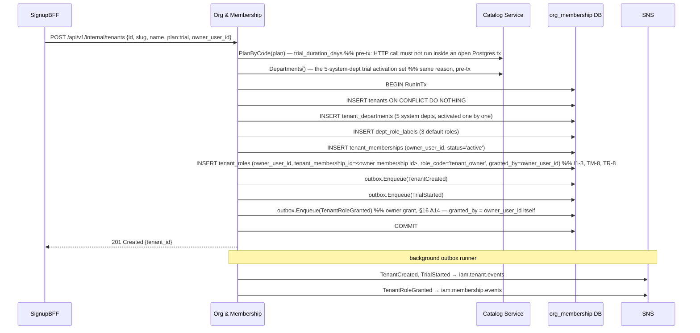
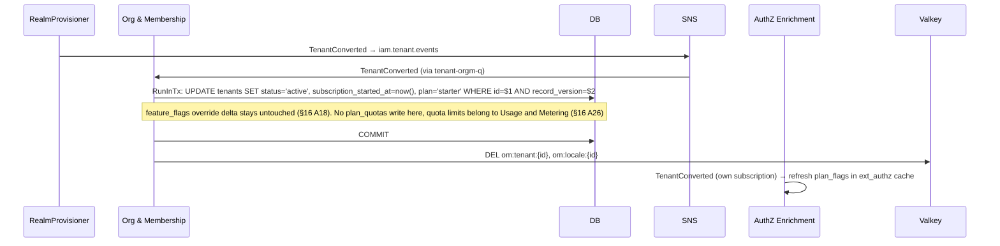
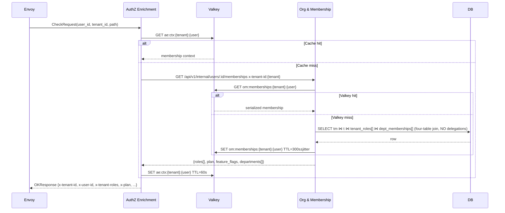
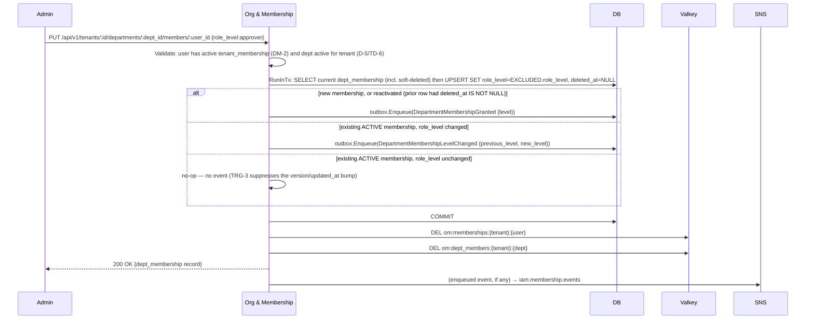
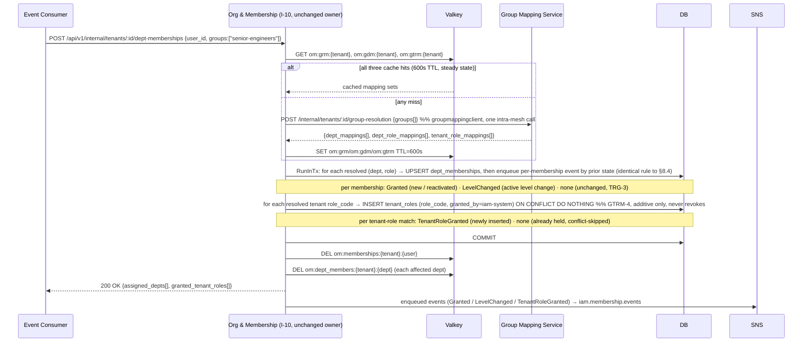
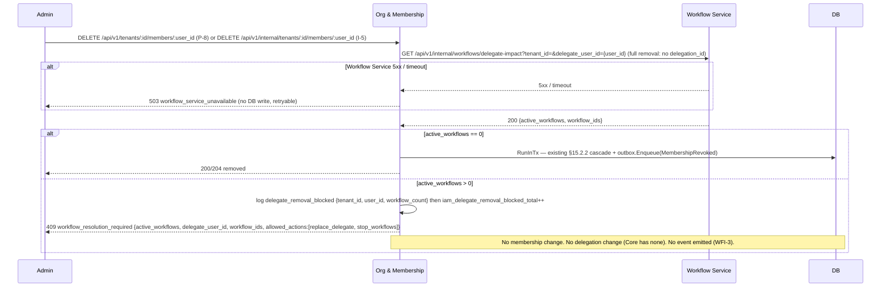

# Org & Membership (Core) Service — Low-Level Design

## Tender Management SaaS Platform — IAM Subsystem

| Field | Value |
|---|---|
| Document type | Low-Level Design (LLD) |
| Service | `iam-org-membership` (Org & Membership — "Core") |
| Go module | `github.com/BCBP-SOLUTIONS-FZC-LLC/iam-org-membership` |
| Status | Post-decomposition end-state (all four extractions complete) |
| Derived from | `org_membership_lld_5.md` (pre-split monolith, rev ~1.71) |
| Governing deltas | ADR-0007 (`01-hld-delta-decomposition.md`), ADR-0008 (`02-hld-delta-delegation.md`) |
| Base HLD | `IAM HLD v1.41` |
| Sibling LLDs | `iam-lld-catalog-admin-config-service.md`, `iam-lld-group-mapping-jit-config-service.md`, `iam-lld-tender-acl-service.md`, `iam-lld-delegation-service.md` |
| Deployment stage | In development — nothing deployed to any environment (see §19) |

### Revision history

| Rev | Date | Change |
|---|---|---|
| 2.0 | 2026-08-22 | **Post-decomposition Core LLD.** Rewritten from `org_membership_lld_5.md` (rev ~1.71) to describe only what Core still owns after all four extractions: **Catalog/Admin Config** (`departments`, `plans`), **Group Mapping/JIT Config** (`group_dept_role_mappings`, `group_tenant_role_mappings`, `group_dept_mappings`), **Tender ACL** (`tender_acl_entries`), and **Delegation** (`delegations` + the two `tenants` delegation-policy columns). I-8 shrinks to a **four-table** join (delegations removed, `active_delegations[]` dropped — ADR-0008 Option C, §6.1/§14); I-10 sources group resolution from the Group-Mapping Service (§8.5); `planDefaults` is a Catalog read-through (§6, §18.7); new inbound endpoint **I-15** (`members/:user_id/exists`) and new outbound clients (`catalogadmin`, `groupmappingclient`, `delegationcheck`) added; delegation events dropped, `MembershipRevoked` + `TenantMembershipsPurged` cascade signals added. Endpoint count **~54 → 38 (ADR-0007) → 33 (ADR-0008)** + I-15. Extracted tables/endpoints/events/invariants relocated with traceability (§4, §16). Dev-stage migration posture — outright removal, no expand/contract (§19). |
| ≤1.71 | — | See `org_membership_lld_5.md` for the full pre-decomposition history (A1–A72 register). |

> **Scope note.** This document is a *subtraction-and-rewire* of the monolith LLD, not a redesign. Everything Core retains keeps the monolith's prose, schema, contracts, and invariant IDs. Every extracted concern appears here **only** as a named cross-service dependency — never as owned data, an owned endpoint, an owned event, or an owned invariant. Retained invariant IDs are unchanged; relocated invariant families (`DEL-*`, `TAE-*`, `GDRM-*`/`GTRM-*`/`GDM-*`, `PLAN-*`) are listed with their new owning documents in §4 and §16.

### Table of Contents

1. [Document Overview](#1-document-overview)
2. [Service Responsibilities and Boundaries](#2-service-responsibilities-and-boundaries)
3. [Architecture and Package Layout](#3-architecture-and-package-layout)
4. [Data Model](#4-data-model)
5. [API Contract](#5-api-contract)
6. [Caching Design](#6-caching-design)
7. [Event Architecture](#7-event-architecture)
8. [Key Request Flows](#8-key-request-flows)
9. [Concurrency, Consistency, and Failure Handling](#9-concurrency-consistency-and-failure-handling)
10. [Security](#10-security)
11. [Observability](#11-observability)
12. [Configuration](#12-configuration)
13. [Deployment and Scaling](#13-deployment-and-scaling)
14. [Testing Strategy](#14-testing-strategy)
15. [GDPR, Data Lifecycle, and Compliance](#15-gdpr-data-lifecycle-and-compliance)
16. [Open Questions and Sign-off Register](#16-open-questions-and-sign-off-register)
17. [Appendix — Error Taxonomy](#17-appendix--error-taxonomy)
18. [Integration Details](#18-integration-details)
19. [Migration Strategy](#19-migration-strategy)
20. [Operational Considerations](#20-operational-considerations)
21. [Performance Considerations](#21-performance-considerations)

---

## 1. Document Overview

This document is the low-level design for the **Org & Membership (Core) Service** (`iam-org-membership`) **as it exists after the O&M decomposition programme** — the end-state in which four concerns that the pre-split monolith owned have been carved out into their own services (ADR-0007, ADR-0008). It is a **post-decomposition Core LLD**: it describes only what Core still owns and writes, and it re-expresses every reference to an extracted concern as a cross-service dependency rather than a local table, join, or handler.

Core still owns the **organizational layer of the IAM platform** — the source-of-truth model for how users are grouped into tenants, what tenant-level and department-level roles they hold, which departments a tenant has activated, the tenant's plan tier and feature-flag override, and the invitation lifecycle that admits users to a tenant. While Keycloak owns authentication and User Profile owns presentation identity, Core owns the business domain model of tenancy and membership. It remains the source of truth consumed by the AuthZ Enrichment service (via `GET /api/v1/internal/users/:id/memberships`, "I-8") for header injection on every authenticated request — a join that, post-decomposition, touches **four** Core-owned tables and nothing external (ADR-0008 §6.1, §14).

Refined into an implementable spec, this document gives the exact database schema, REST and internal API contracts, event payloads, caching behaviour, request flows, and operational characteristics needed to build and run the service. Where this document and the HLD disagree, the HLD is authoritative and the discrepancy is flagged in §16. Field names, event names, library names, and SLO numbers are taken directly from the HLD; see §4 (schema, HLD §7.3), §7 (events, HLD §9.4), and §11 (SLOs, HLD §3.4).

**The code is already at this end-state.** The consolidated `000000_initial_schema` migration (§19.1 — originally four separate drop migrations, `000013`–`000016`, since squashed) omits the four extracted table groups (`departments`/`plans`; `group_dept_role_mappings`/`group_tenant_role_mappings`/`group_dept_mappings`; `tender_acl_entries`; `delegations` and the two `tenants` delegation-policy columns). The outbound clients `catalogadmin`, `groupmappingclient`, and `delegationcheck` exist under `internal/adapter/outbound`; the `MembershipRevoked` and `TenantMembershipsPurged` event schemas both exist under their resolved names (§16 OQ-1, §7.3/§15.5); and no delegation, tender-ACL, or group-mapping handlers, domain types, or CronJobs remain. `core/service` still carries `catalog_service.go` and `group_mapping_service.go`, but these are now Core's **client-side** read-through / resolve services against the new owners, not owner-side services. This is a subtraction-and-rewire of the monolith, not a redesign: all retained content preserves the monolith's schema, contracts, invariants, and depth.

### 1.1 Relationship to the HLD

Core is one of the IAM subsystem's services (originally seven in HLD v1.41 §5.6; the decomposition programme carved four further services out of this one — see below). This LLD refines the HLD sections that pertain to what Core still owns:

| HLD section | What it specifies | Where this LLD refines it |
|---|---|---|
| §5.6 | Service responsibilities, tech, hot endpoint | §2, §3 |
| §7.3 | Org & Membership core schema | §4 |
| §7.1–7.2 | DB topology, RLS / GUC injection | §4.3, §10.1 |
| §8.2.1–8.2.3 | Tenant onboarding, SSO configuration, invitation flow | §8.1, §8.2 |
| §8.3 | AuthZ enrichment lookup (I-8) | §8.3 |
| §9.4 | Event catalog (`iam.membership.events`, `iam.tenant.events`) | §7 |
| §9.2 / §9.4 | Serialization (JSON), AsyncAPI contract, Glue Schema Registry | §7.2, §7.3, §7.3.1 |
| §6.1–6.6 | Role and permission model, plan gates | §5.2, §10 |
| §15.3 | Clean Architecture repo layout | §3 |

The **OOO delegation flow** row that the monolith carried here (HLD §8.6 → §8.6) is gone from Core's refinement scope: the delegation lifecycle now belongs to the Delegation Service (ADR-0008). Core's only surviving delegation-adjacent refinement is the synchronous delegate-impact gate on user removal (§8.8), a Workflow-Service interaction — not a delegation-ownership one (§2.3).

**Relationship to the pre-split monolith and the extraction LLDs.** This document derives directly from `org_membership_lld_5.md` (the pre-split Org & Membership monolith, rev ~1.71). Every section here is that monolith's corresponding section, pruned to Core's retained ownership and rewired at each former reference to an extracted concern. The two governing decisions and the four extraction LLDs are:

| Source | Role relative to this document |
|---|---|
| `org_membership_lld_5.md` (rev ~1.71) | The pre-split monolith this LLD is subtracted from. Retained content preserves its prose, schema, contracts, and invariant IDs verbatim. |
| ADR-0007 (`01-hld-delta-decomposition.md`) | Governs the first three extractions (Catalog/Admin Config, Group Mapping/JIT Config, Tender ACL). Its §2 fixes what stays in Core vs. moves out; §5 the new boundaries; §6 the new runtime interactions. |
| ADR-0008 (`02-hld-delta-delegation.md`) | Governs the fourth extraction (Delegation). Its §2/§5/§6 remove `delegations` from Core entirely (Option C), shrinking I-8's join from five tables to four (§6.1) and relocating the tenant delegation-policy columns (§2.1). |
| `iam-lld-catalog-admin-config-service.md` | Owner LLD for `departments` and `plans`. Core reads both through the Catalog client (§3). |
| `iam-lld-group-mapping-jit-config-service.md` | Owner LLD for `group_dept_role_mappings`, `group_tenant_role_mappings`, `group_dept_mappings`. Core resolves against it via `POST /internal/tenants/:id/group-resolution` (§3, §8 I-10). |
| `iam-lld-tender-acl-service.md` | Owner LLD for `tender_acl_entries`. Consumes Core's `GET /internal/tenants/:id/members/:user_id/exists`. |
| `iam-lld-delegation-service.md` | Owner LLD for `delegations` and delegation policy. Consumes Core's membership-existence endpoint (I-15) and the `MembershipRevoked`/`TenantMembershipsPurged` cascade signals. |

---

## 2. Service Responsibilities and Boundaries

### 2.1 In scope

The service owns and is the sole writer for:

- **Tenants** — the top-level organizational unit. Holds `plan`, subscription status, trial metadata, SSO configuration reference, locale, and the `local_accounts_enabled` flag. The definitive source consulted by AuthZ Enrichment for plan-gating decisions. (Post-decomposition, the `tenants` row no longer carries `delegation_max_duration_days` or `delegation_review_window_days` — both moved to the Delegation Service, ADR-0008 §2.1.)
- **Department activation** (`tenant_departments`) — the per-tenant activation junction recording which departments a tenant has switched on. Tenant admins manage this activation set; the **global department catalog itself is not owned here** (it moved to the Catalog / Admin Config Service, §2.2). `tenant_departments` keeps a reference to the now-external `departments` catalog, validated at write time against the `om:departments` read-through cache rather than a Postgres FK (ADR-0007 §4).
- **User-to-tenant memberships** — whether a user belongs to a tenant and their lifecycle state (`active`, `suspended`, `left`). Carries no role information (§16 A14).
- **Tenant-level role grants** (`tenant_roles`) — which **elevated** tenant role(s) a user holds (`tenant_owner`, `tenant_admin`, `tender_admin`). A separate table, one row per grant, because a user may hold **multiple simultaneously** (HLD §5.6/§6.1/§6.3, e.g. `tenant_admin` + `tender_admin` on one user) — a dimension distinct from tenant membership itself. **`member` is not stored** — it is implied by an active `tenant_memberships` row and derived at read time (§16 A29, TR-7); `member` remains a `tenant_role` ENUM value only as the derived label I-8 injects into the effective role set, never a persisted grant.
- **Department memberships** — the per-department assignment of a user at a specific role level (`preparator`, `reviewer`, `approver`). A user may belong to multiple departments at different role levels.
- **Department role labels** (`dept_role_labels`) — the three-rung department-level roles (Preparator, Reviewer, Approver — the `dept_role` ENUM) as a named catalog, defined per tenant with a tenant-customisable `display_name`. This allows tenants to rename roles without changing the platform's internal role codes. Despite the historical table name (`tenant_roles`, before the rev 0.97 rename freed that name for the tenant-level role table above), this has never held tenant-level roles; it only labels the department-level `dept_role` values. The Keycloak-group → role mapping that once lived alongside this concern now belongs to the Group Mapping / JIT Config Service (§2.2), not to `dept_role_labels` (§16 A9, DRL-3).
- **Tenant default locale** — the tenant-wide locale fallback (`en-US`, etc.) used by the LLM when a user has no personal locale preference. Distinct from per-user locale owned by User Profile.
- **Invitation lifecycle** (`pending_invitations`) — the two-step invite → accept staging that admits a user to a tenant (P-6/P-30/P-31, I-3), including the seat-cap contribution of `pending` rows (SEAT-1) and the Realm-Provisioner-coordinated Keycloak-user compensation saga (PI-9). Tenant-membership lifecycle, not a catalog/config concern (ADR-0007 §2.1).
- **Plan tier and feature-flag override** — `tenants.plan` (the tier a tenant is on) and `tenants.feature_flags` (the per-tenant Enterprise override delta, §16 A18) are the plan/entitlement state this service owns. The effective entitlement set is `effective = planDefaults(plan) ⊕ feature_flags` (override wins per key, PLAN-6), computed read-only at I-8 time. **Only the data source for `planDefaults` has moved:** the per-tier entitlement catalog (`plans`) is now owned by the Catalog / Admin Config Service, so `planDefaults(plan)` is a cached read-through against Catalog (`om:plans`, sourced via the Catalog client on a miss) instead of a local `SELECT`. The **merge point does not move** — the `feature_flags` operand is still a column on Core's own `tenants` row, written in-process by O-4 (`PATCH /api/v1/operator/tenants/:id/feature-flags`), and the merge still happens at Core's projection layer (ADR-0007 §4, §4.1, §6.4). Writing a column Core owns is exactly why O-4 stays here even though the `plans` catalog left. **Metered resource consumption (LLM tokens, API requests) and quota enforcement are explicitly out of scope** — HLD §10.6 states "IAM does not count tokens or requests itself"; that is owned end-to-end by the separate Usage & Metering Service (§16 A26, §2.2).

### 2.2 Out of scope (owned elsewhere)

| Concern | Owner | Why not here |
|---|---|---|
| Credentials, password policy, MFA, JWT issuance | Keycloak | Identity provider owns all authentication |
| Display identity (display_name, job_title, signature) | User Profile | Presentation concerns |
| Availability / OOO flag (display presentation) | User Profile (`user_availability`) | Presentation-only record; the authoritative delegation record is the Delegation Service's, not Core's (§2.3) |
| Global department catalog (`departments`) | **Catalog / Admin Config Service** (`iam-catalog-admin`) | Global, non-tenant-scoped reference data; Core only records per-tenant *activation* (`tenant_departments`) and reads the catalog through the `om:departments` cache (ADR-0007 §2.2, §5) |
| Plan entitlement catalog (`plans`) | **Catalog / Admin Config Service** (`iam-catalog-admin`) | The per-tier entitlement baseline is operator/billing-admin config; Core owns only the tenant's `plan` tier and `feature_flags` override, and reads `planDefaults` through the `om:plans` cache (ADR-0007 §2.2, §4.1) |
| Group→department / group→role JIT mappings (`group_dept_role_mappings`, `group_tenant_role_mappings`, `group_dept_mappings`) | **Group Mapping / JIT Config Service** (`iam-group-mapping`) | Pure JIT-provisioning inputs with no membership state of their own; Core resolves them at login via one call to the Group Mapping Service and still writes the resulting `dept_memberships`/`tenant_roles` itself (ADR-0007 §5, §6.2; §8 I-10) |
| Tender ACL overlay (`tender_acl_entries`) | **Tender ACL Service** (`iam-tender-acl`) | Additive access overlay consulted by the Tender domain; extracted as a near-literal lift (ADR-0007 Option D deferred). Core serves only its grant-time membership check (ADR-0007 §5, §6.5) |
| Delegation record, lifecycle, policy, and events (`delegations`, `delegation_tenant_settings`) | **Delegation Service** (`iam-delegation`) | The authoritative workflow-rerouting record and its OOO lifecycle; removed from Core entirely under Option C so I-8 joins four tables, not five (ADR-0008 §2.1, §5, §6.1) |
| Audit records | Audit Log | Append-only compliance store |
| Realm / Keycloak admin mutations | Realm Provisioner | Sole caller of Keycloak Admin API |
| Workflow template authoring | Workflow Service | Domain logic outside IAM |
| Assignee-override / workflow assignment state (`assignee_overrides`) | Workflow Service | **Workflow-execution state**, not IAM state (§16 A32(d)). Core **validates the identities and permissions** for an override and **emits `TenderAssigneeOverridden`** (§7.3) so downstream consumers are notified, but does **not persist** the workflow-instance/node-level assignment record. |
| Tender content and bids | Tender Service | Tender domain |
| Metered resource consumption (LLM tokens, API requests) and quota enforcement | Usage & Metering Service | HLD §10.6: "IAM does not count tokens or requests itself" — Core owns only the static `plan` tier and `feature_flags` override delta (§16 A26) |

The service **never calls the Keycloak Admin API** and **never writes to another service's database**. Cross-service data is obtained via API or via subscribed events. Post-decomposition, Core holds three synchronous **outbound** dependencies on the extracted services — a read-through to Catalog (`om:plans`/`om:departments`), a login-time resolve against Group Mapping (I-10), and a dept-scope lookup against Delegation on the user-removal path (§8.8) — plus one **inbound** endpoint it serves (rather than calls): the membership-existence check (I-15) that Tender ACL and Delegation consume. All four are off the I-8 hot path (ADR-0007 §6, ADR-0008 §6, §9).

### 2.3 Ownership split — delegation and availability

The monolith recorded a **two-records / two-owners** split for delegation: an *authoritative* `delegations` record (Core) that drove workflow rerouting, and a *presentation* `user_availability` record (User Profile) that held the OOO window and a `delegate_id` pointer rendered in the dashboard. **Post-decomposition, neither of these records lives in Core:**

- **`delegations`** — the authoritative record (scope `all`/`department`/`tender`, optional `scope_id`, hard time bounds, and the `DelegationStarted`/`DelegationEnded`/`DelegationReviewRequested` events) is now owned end-to-end by the **Delegation Service** (`iam-delegation`), on its own database and its own topic `iam.delegation.events`. Core **dropped the `delegations` table** and the availability-first coordination (former DEL-6) along with it (ADR-0008 §2.1, §5). Under Option C, I-8 no longer joins `delegations` and no longer returns `active_delegations[]` — the field was passthrough-only and no consumer read it for a decision (ADR-0008 §6.1).
- **`user_availability`** — the presentation record (`status`, OOO window, `delegate_id`) was always User Profile's, never Core's. It — not I-8 — is the dashboard's source for a user's current delegate pointer (ADR-0008 §6.1).

The historical split is preserved as design context, but both records now sit **outside Core**. Core's **only remaining delegation touchpoint** is the synchronous **delegate-impact gate** on user removal (§8.8): when an admin removes a user (P-8/I-5) or resolves the resulting `409 workflow_resolution_required` (P-26), Core calls the **Workflow Service** (`WorkflowClient.GetDelegateImpact` / `ReassignDelegate` / `CancelByDelegate`) — Workflow answers from its own assignment state and needs no `delegations` data (ADR-0008 §2.2, §6.4). The one place the monolith read `delegations` locally within that gate (the §8.8.4 department-scope pre-filter) is now a synchronous **Core → Delegation** call, `GET /internal/delegations/dept-delegate` (the `delegationcheck` client, §3); on Delegation being unreachable the gate degrades to tenant-wide impact — still correct, less precise (ADR-0008 §9). The **ending of the affected delegation rows is no longer Core's**: once Core commits the removal it emits `MembershipRevoked` (per user) / `TenantMembershipsPurged` (tenant-level; §15.5, §16 OQ-1 resolved), and the Delegation Service consumes these on `delegation-cascade-q` to end its own rows and clear the availability pointer asynchronously (ADR-0008 §6.4; §7). A lingering `active` delegation row on a departed party is inert — nothing routes on it and nothing authorizes on it (ADR-0008 §6.5).

---

## 3. Architecture and Package Layout

The service follows the platform Clean Architecture / Ports-and-Adapters layout (HLD §15.3): dependencies point inward, `core/domain` imports nothing external, and `cmd/server/main.go` / `cmd/reconciler/main.go` are the only composition roots. All four extractions (ADR-0007 catalog/plans, group-mapping, ADR-0008 tender-ACL, delegation) have landed: every owner-side package (domain, ports, repositories, handlers, services) for those four concerns is gone, along with the `userprofile/` adapter (dead code once delegation's OOO coordination moved out — LLD §16 OQ-5). In their place Core carries five outbound HTTP clients through which it reads the extracted data or calls sibling services — `workflow`, `realmprovisioner`, `catalogadmin`, `groupmappingclient`, `delegationcheck` — each behind a `core/port` interface. The client-side `catalog_service.go` / `group_mapping_service.go` in `core/service` are read-through/resolve services against those new owners, **not** owner-side services; `core/domain` still carries small read-model types (`plan.go`, `group_mapping.go`) for the data those caches return, not for locally-owned tables.

```
iam-org-membership/
├── cmd/
│   ├── server/
│   │   ├── main.go                          # composition root — pools, middleware, outbox runner, exporter goroutines
│   │   ├── exporters.go                     # 4 ticker-goroutine metric exporters (not CronJobs)
│   │   └── swagger_info.go
│   └── reconciler/
│       ├── main.go                          # single binary, dispatched via --job=<name>; drives the 7 CronJobs
│       └── jobs/
│           ├── context.go                   # jobs.Context{SysPool *pgcommon.Pool, Logger, RealmProvisioner, ...}
│           ├── invitation_expiry.go
│           ├── invitation_kc_cleanup.go
│           ├── realm_config_sync.go
│           ├── seat_overage.go
│           ├── trial_cleanup.go
│           ├── outbox_prune.go
│           ├── processed_events_prune.go
│           ├── pgcommon_wrap.go             # RunInTx wrapper over pgcommon.Pool
│           └── tx_helper.go
│                                             # (removed: delegation_expiry.go, delegation_review.go)
├── internal/
│   ├── core/
│   │   ├── domain/
│   │   │   ├── tenant.go                    # Tenant, TenantPlan, SubscriptionStatus
│   │   │   │                                #   (no delegation-policy fields — moved out, ADR-0008 §2.1)
│   │   │   ├── department.go                # Department (Catalog read-model), TenantDepartment (activation)
│   │   │   ├── plan.go                      # Plan read-model — planDefaults sourced via om:plans (Catalog Service)
│   │   │   ├── membership.go                # TenantMembership, DeptMembership, RoleLevel
│   │   │   ├── role.go                      # TenantRoleCode, DeptRole, DeptRoleLabel
│   │   │   ├── group_mapping.go             # GroupDeptRoleMapping read-model — resolved via Group Mapping Service (I-10)
│   │   │   ├── invitation.go                # PendingInvitation, InvitationStatus (P-6/P-30/P-31, I-3)
│   │   │   ├── event.go / event_payloads.go # DomainEvent + payload types (incl. MembershipRevoked, TenantMembershipsPurged)
│   │   │   └── errors.go                    # DomainError catalogue (ErrWorkflowResolutionRequired, ErrSeatLimitReached, ...)
│   │   │                                    # (removed: delegation.go, tender_acl.go)
│   │   ├── port/
│   │   │   ├── tenant_repository.go
│   │   │   ├── department_repository.go     # tenant_departments activation only
│   │   │   ├── membership_repository.go
│   │   │   ├── invitation_repository.go
│   │   │   ├── cache.go
│   │   │   ├── catalog_reader.go            # read-through to Catalog Service (om:plans, om:departments)
│   │   │   ├── group_mapping_client.go      # GroupMappingClient — group→dept/role JIT resolution (I-10)
│   │   │   ├── outbound_clients.go          # WorkflowClient, RealmProvisionerClient, DelegationCheckClient, CatalogAdminClient
│   │   │   ├── event_publisher.go / event_publisher_context.go
│   │   │   ├── tx_runner.go
│   │   │   ├── idempotency.go                # IdempotencyStore — processed_events dedup, MarkProcessedInTx joins the caller's tx (EVT-14)
│   │   │   └── logger.go                    # port.Logger + SlogStyleLogger bridge onto platform-gincommon's logger
│   │   │                                    # (removed: delegation_repository.go, acl_repository.go, user_profile_client.go)
│   │   └── service/
│   │       ├── tenant_service.go            # tenants, plan tier + feature_flags override
│   │       ├── department_service.go        # department activation (tenant_departments)
│   │       ├── role_label_service.go        # dept_role_labels (tenant-customizable display labels)
│   │       ├── dept_membership_service.go   # dept_memberships incl. §8.8.4 delegate-scope gating
│   │       ├── membership_service.go        # RemoveUser + delegate-impact pre-check/resolution (§8.8), TM-8/12/13, SEAT-1
│   │       ├── invitation_service.go        # invite/accept saga, seat-cap, KC-user compensation
│   │       ├── provisioning_service.go      # trial signup (§8.1), consumer-driven tenant provisioning
│   │       ├── operator_service.go          # O-4/O-7
│   │       ├── authz_service.go             # I-8 hot-path memberships projection
│   │       ├── catalog_service.go           # CLIENT-SIDE read-through against Catalog Service (NOT fail-open)
│   │       └── group_mapping_service.go     # CLIENT-SIDE resolve against Group Mapping Service (fails open)
│   │                                        # (removed: delegation_service.go, tender_acl_service.go)
│   └── adapter/
│       ├── inbound/
│       │   ├── http/
│       │   │   ├── router.go                # route registration, health/ready wiring
│       │   │   ├── tenant_handler.go
│       │   │   ├── department_handler.go
│       │   │   ├── dept_membership_handler.go
│       │   │   ├── role_label_handler.go
│       │   │   ├── membership_handler.go    # DELETE pre-check; POST .../removal-resolution (P-26)
│       │   │   ├── invitation_handler.go
│       │   │   ├── internal_handler.go      # I-8/I-13/I-14/I-15 (incl. members/:user_id/exists existence check)
│       │   │   ├── operator_handler.go
│       │   │   ├── middleware.go            # error handling, nil-safe port.Logger error sink
│       │   │   ├── dto.go / errors.go
│       │   │   └── docs.go / asyncapi.go / swagger_initializer.go / swagger_theme.go   # doc pages, serve apispec.AsyncAPISpec
│       │   │                                # (removed: group_mapping_handler.go, delegation_handler.go, acl_handler.go)
│       │   └── consumer/
│       │       └── membership_event_consumer.go   # SQS: tenant-orgm-q, billing-orgm-q; EVT-14/15/16
│       └── outbound/
│           ├── postgres/
│           │   ├── tenant_repository.go / tenant_department_repository.go / tenant_role_repository.go
│           │   ├── dept_membership_repository.go / dept_role_label_repository.go / invitation_repository.go
│           │   ├── db.go                    # DSNFromEnv delegates to pgcommon.ConfigFromEnv; ApplyStatementTimeout
│           │   ├── migrate.go               # RunMigrations wraps pgcommon migrate.Runner
│           │   ├── logger_adapter.go        # port.Logger → pgcommon domain.Logger bridge
│           │   ├── idempotency_repository.go # port.IdempotencyStore impl — processed_events, shared by both SQS consumers
│           │   ├── scan_tenant.go
│           │   └── migrations/              # single consolidated migration — 000000_initial_schema.{up,down}.sql
│           │                                #   (never deployed pre-decomposition — no staged expand/contract history to keep)
│           ├── valkey/
│           │   └── cache.go                 # go-redis/v9 — om:tenant, om:plans, om:departments, om:grm/gdm/gtrm
│           ├── eventbus/
│           │   ├── publisher.go             # RoutingPublisher (2 topics) + outbox wiring, port.SlogStyleLogger
│           │   ├── routing_publisher.go
│           │   ├── codec.go                 # local eventbus.Codec — outbox-enqueue-time JSON validation + NoopCodec
│           │   ├── validating_codec.go      # JSON Schema Draft-07 validation against schemas/*.json
│           │   ├── glue_codec.go            # AWS Glue Schema Registry wire-format codec (events.Codec) — one per topic
│           │   └── schemas/*.json           # 13 embedded JSON Schema Draft-07 files (11 membership + 2 tenant)
│           ├── workflow/                    # HTTP client — GetDelegateImpact/Reassign/Cancel (§8.8)
│           ├── realmprovisioner/            # HTTP client — CreateInvitedUser/DeleteUser/PatchRealmConfig/RevokeUserSessions
│           ├── catalogadmin/                # HTTP client — read-only departments/plans (Catalog Service, NOT fail-open)
│           ├── groupmappingclient/          # HTTP client — group→dept/role JIT resolution (Group Mapping Service, fails open)
│           ├── delegationcheck/             # HTTP client — dept-scoped delegate lookup (Delegation Service, fails open)
│           └── metrics/                     # custom Prometheus counters (iam_*)
│                                             # (removed: userprofile/ — dead code once OOO coordination moved out, §16 OQ-5)
├── pkg/requestctx/                          # Typed RequestContext{UserID, TenantID, Roles, ClientIP, UserAgent}
├── api/
│   ├── asyncapi.yaml                        # iam.membership.events / iam.tenant.events — AsyncAPI 3.0 source of truth
│   └── embed.go                             # //go:embed asyncapi.yaml — single source, served by http/docs.go + asyncapi.go
│                                             # (removed: openapi.yaml — REST contract is now docs/swagger/*, generated)
├── docs/
│   ├── swagger/                             # generated via `make swag` from handler annotations — the REST contract
│   ├── architecture/                        # narrative diagrams (mermaid)
│   ├── lld/                                 # this document
│   └── runbook-schema-registry.md
├── deploy/
│   ├── helm/                                # Deployment + HPA(2-8) + 7 CronJobs + NetworkPolicy + PrometheusRule
│   ├── iam/                                 # IRSA policies
│   └── monitoring/                          # Prometheus alert rules
├── scripts/                                 # init-db.sql, init-localstack.sh, patch-swagger-extensions.py, merge_coverage.py
├── test/{unit,postgres,integration,e2e}/
└── Dockerfile  docker-compose.yml  Makefile  go.mod  .golangci.yml
```

**The schema-governance workspace is `internal/adapter/outbound/eventbus/schemas/`**, colocated with the eventbus adapter rather than a standalone `internal/eventschema/` package — it is embedded directly into the `ValidatingCodec` via `//go:embed schemas/*.json`. Each `*.json` file is a JSON Schema Draft-07 document for one event type, and is what `schema-gov validate` checks for AsyncAPI coverage, `schema-gov register` uploads to the appropriate Glue registry, and `schema-gov diff` uses for breaking-change detection. The set is generated from `api/asyncapi.yaml` via `schema-gov extract`, then committed; `extract --check` runs in CI to catch drift. Post-decomposition the delegation event schemas are gone (produced instead by `iam-delegation` on its own `iam.delegation.events` topic, ADR-0008 §10); `MembershipRevoked.json` and `TenantMembershipsPurged.json` (the tenant-wide purge cascade signal — no naming collision with Realm Provisioner's own event of that name) are the two additions driving Delegation/Tender-ACL/Group-Mapping's own cascade cleanups.

**The reconciler drives exactly 7 CronJobs** — `invitation-expiry`, `invitation-kc-cleanup`, `realm-config-sync`, `seat-overage-reconcile`, `trial-cleanup`, `outbox-prune`, `processed-events-prune` (§13.1), one file each under `cmd/reconciler/jobs/`. The delegation and tender-ACL CronJobs (`delegation-expiry`, `delegation-review`, `delegation-cleanup`, `acl-cleanup`) left with their owning services (ADR-0007, ADR-0008 §2.1). The four metric exporters (`iam_tenant_ownerless`, `iam_realm_sync_pending`, `iam_seat_overage_active`, `iam_pending_invitations_stale`) are ticker goroutines inside `cmd/server/main.go`, not CronJobs — do not double-count them against the 7.

### 3.1 Shared library dependencies (HLD §15.4)

```
require (
    github.com/BCBP-SOLUTIONS-FZC-LLC/platform-gincommon    v1.2.0
    github.com/BCBP-SOLUTIONS-FZC-LLC/platform-events        v1.4.0
    github.com/BCBP-SOLUTIONS-FZC-LLC/platform-pgcommon      v1.2.1
)
```

`platform-pgcommon` tracks `v1.2.1`, not `v1.1.1` — the version where `Config.Logger` / `migrate.Runner.Logger` became a public `domain.Logger` type instead of an internal unexported one, which is what `internal/adapter/outbound/postgres/logger_adapter.go` implements to bridge `core/port.Logger` onto it.

**`platform-schemagov` is not a Go module and does not appear in `go.mod`.** It is a Python 3.12 CLI tool deployed as the Docker image `ghcr.io/bcbp-solutions-fzc-llc/platform-schemagov:0.4` (entrypoint: `schema-gov`), pinned in `.env`/`Makefile` to match sibling `iam-user-profile2`. Consuming service CI pipelines call it via `docker run -v $PWD:/workspace` — there is no Go import, no SDK, and no runtime dependency. It governs the schema pipeline (validate → diff → register) but has zero presence in application code. See §7.3.1 for the full CI integration.

The five outbound clients (`workflow`, `realmprovisioner`, `catalogadmin`, `groupmappingclient`, `delegationcheck`) add **no** new third-party dependency — each is a plain `net/http` client behind a `core/port` interface, wired at `main.go`, mesh-only over mTLS, built on the identical construction pattern (`gincommon.PropagateHeaders`, configurable `*_TIMEOUT_MS` env var). There is no `userprofile` client any more — deleted as dead code once delegation's OOO coordination moved out (LLD §16 OQ-5).

### 3.2 Dependency rules (enforced in CI)

Identical to `iam-user-profile`: `core/domain` → nothing external; `core/port` → `core/domain` only; `core/service` → `core/domain` + `core/port`; `adapter/*` implements `core/port`. The client-side `catalog_service.go` / `group_mapping_service.go` depend only on their `core/port` interfaces (`catalog_reader`, `group_mapping_client`), never on the `catalogadmin` / `groupmappingclient` HTTP adapters directly — the same inward-pointing discipline every sibling service applies to an outbound dependency. Enforced by `go-arch-lint`.

### 3.3 Shared library integration

#### 3.3.1 `platform-gincommon`

Usage is identical to `iam-user-profile` (middleware stack, `gincommon.Config`, `TimeoutMiddleware`, `DefaultMiddlewares`, `HealthHandler`, `RequestContext`, `ErrorResponse`, `InitTracingFromEnv`, `Shutdown`). `ServiceName = "iam-org-membership"`. The service has **no gRPC server** — only Gin HTTP, identical to User Profile.

#### 3.3.2 `platform-pgcommon`

Usage is identical: `NewPool` + `ConfigFromEnv`, `PGBouncerMode` env-driven, `GUCProvider = GUCSetFromContext` (binds `app.tenant_id` **transaction-locally** — `set_config(…, is_local => true)` — on **every** checkout, reads included, so it can never persist on a pooled backend, RLS-6), `RunInTx` for all writes **and reads run inside a GUC-bound checkout too** (no bare session-scoped query path exists), `RunInSavepoint` for sub-step rollbacks, `IsUniqueViolation`/`IsForeignKeyViolation`/`IsCheckViolation`/`IsDeadlock`/`IsSerializationFailure` for error mapping, `Pool.Health`, `migrate.Runner`, `pgmetrics.Init`, `NewOTelQueryTracer`, `SlowQueryTracer`. `Config.SlowQueryThreshold = 200ms`. `SetLogTenantID(false)` and `SetAllowFullStatements(false)` in production.

**Routing publisher.** Unlike `iam-user-profile` (single-topic producer), this service publishes events on two topics:
- `iam.membership.events` — organization and membership lifecycle events
- `iam.tenant.events` — tenant-level events (`TenantCreated`, `TrialStarted`)

The `events.NewRoutingPublisher` (HLD §9.2) is used here, with `TopicARNs: map[string]string{"iam.membership.events": ..., "iam.tenant.events": ...}` and a routing key function that inspects the `Envelope.Source` field to select the correct topic ARN. This is the one meaningful difference from the User Profile wiring. (Delegation events no longer route from here — they are produced by `iam-delegation` on `iam.delegation.events`, ADR-0008 §10.)

#### 3.3.3 `platform-events`

All outbox, consumer, DLQ, and pruning patterns are identical to `iam-user-profile`. This service is a **substantive consumer** of two topics at MVP:

- **`iam.tenant.events`** via queue `tenant-orgm-q` — subscribes to the tenant-lifecycle events produced by the Realm Provisioner (`TrialTenantProvisioned`, `TenantRealmReady`, `TenantConverted`, `DirectPaidSignup`, `TrialExpired`, `TrialReactivated`, `TenantSuspended`, `TenantOffboarded`) to drive `tenants` state changes (realm-id/realm-type update, subscription-status transitions, tenant data-wipe). O&M never consumes its own `TenantCreated`/`TrialStarted` — produce/consume sets are disjoint (HLD §9.1.1 "No self-consumption").
- **`billing.events`** via queue `billing-orgm-q` — subscribes to the billing events produced by the Billing Service (`TenantPlanChanged`, `TenantPaymentPastDue`, `TenantSubscriptionCancelled`, `TenantReactivated`) to update `subscription_status` and `plan`. `feature_flags` (the override delta, §16 A18) is untouched by any of these — the effective set is derived at read time, not stored (T-9), and `planDefaults` is now sourced through the Catalog read-through cache (§2.1).

Both queues follow the `<topic-short>-<consumer>-q` naming convention (HLD §9.1): topic-short drops the `iam.`/`.events` (`iam.tenant.events`→`tenant`, `billing.events`→`billing`) and the O&M consumer short-name is `orgm`. DLQs are `tenant-orgm-q-dlq` and `billing-orgm-q-dlq`, `maxReceiveCount=5`. Idempotency via `processed_events` as in User Profile.

**`platform-events` v1.3.0 → v1.4.0 (§16 A67).** This service tracks the `v1.4.0` line, not `v1.3.0`. The bump matters for a real reason, not just picking up new features: **v1.3.1** (included in the v1.3.0→v1.4.0 range) fixed a bug where `OutboxRecord.Payload` (`[]byte`) was bound through pgx's `bytea` codec instead of its `json`/`jsonb` codec when `PGBouncerMode: true` — producing `invalid input syntax for type json` on **every** outbox write under that mode. This service runs `PGBouncerMode` **on** in production (§4, "fronted by PgBouncer in transaction-pooling mode"), so it met every precondition for the bug on v1.3.0, whether or not it was ever actually observed here. `OutboxRecord.Payload` is now `json.RawMessage` internally in the library; **`outbox.Enqueue`'s public signature is unchanged**, so this service needed no code change beyond the `go.mod` version bump. v1.4.0 additionally introduces `events.Codec`/`events.WithCodec`, which **is now adopted**: `internal/adapter/outbound/eventbus/glue_codec.go` implements `events.Codec` against AWS Glue Schema Registry (18-byte header + registry version lookup, one `GlueCodec` per SNS topic since this service uses two registries — `iam-membership-events`, `iam-tenant-events` — unlike `iam-user-profile`'s single-registry setup), wired via `events.WithCodec(codec)` at publisher construction in `cmd/server/main.go`. An unset `GLUE_REGISTRY_*_NAME` falls back to `events.NoopCodec{}` (plain JSON) on that topic. This service also uses the `WithIPAddress`/`WithUserAgent` envelope-field setters on every publish (§7.3, §7.4, §16 A69).

---
## 4. Data Model

Database: `org_membership` on the shared RDS PostgreSQL Multi-AZ instance (HLD §7.1). Fronted by PgBouncer in transaction-pooling mode. The pool is created with `pgcommon.NewPool(... PGBouncerMode: <PG_BOUNCER_MODE>, GUCProvider: pgcommon.GUCSetFromContext, MinConns: 0, MaxConns: 10–20 ...)`.

The schema below is the canonical LLD specification. Additions beyond the HLD §7.3 baseline are marked **(LLD addition)** with rationale.

> **Post-decomposition scope (ADR-0007 `01-hld-delta-decomposition.md`).** This is the **Org & Membership (Core)** service after four extractions. The catalog tables `plans`/`departments` now live in the **Catalog Service** (Document 2, `iam-lld-catalog-service.md`); the three `group_*_mappings` tables in the **Group Mapping Service** (Document 3, `iam-lld-group-mapping-service.md`); `tender_acl_entries` in the **Tender ACL Service** (Document 4, `iam-lld-tender-acl-service.md`); and `delegations` in the **Delegation Service** (ADR-0008 `02-hld-delta-delegation.md`, `iam-lld-delegation-service.md`). This §4 reproduces the **eight retained domain tables plus the `rls_violation_log` audit table** (§4.2); the DB foreign keys that used to point at the now-external `plans`/`departments` catalogs are replaced by an application-level check against a Catalog-sourced cache (`om:plans` / `om:departments`, ADR-0007 §4/§9), and `tenants.plan` remains bounded by the `tenant_plan` ENUM. A "Tables and invariants relocated by the decomposition" note at the end of §4 traces every dropped table and invariant family to its new owning service.

**Entity-relationship overview.**

`tenants` is the root entity — every other table in this service references it via `tenant_id` (except `processed_events`, a global consumer-idempotency ledger). `tenants.plan` is a `tenant_plan` ENUM value that resolves to one entitlement tier (workflow/tender limits, SSO, branding, `feature_set`) whose defaults feed `planDefaults`; the tier catalog itself (`plans`) is now **operator-managed in the Catalog Service** and read here through the `om:plans` cache (a Catalog-sourced read-through, ADR-0007 §4/§7) — quotas are **not** here (Usage & Metering owns metering, §16 A26), and the former DB FK `tenants.plan → plans.code` is gone, replaced by the ENUM bound plus an application-level validity check. `departments` is likewise a **global catalog owned by the Catalog Service**, read here through the `om:departments` cache; `tenant_departments` (retained, tenant-scoped) is the join table that activates a catalog department for a specific tenant, and its former DB FK to `departments` is replaced by an application-level check against `om:departments`. `tenant_memberships` expresses **that** a user belongs to a tenant and their lifecycle `status` — it carries no role data (§16 A14). `tenant_roles` expresses **which elevated** tenant-level role(s) a user holds (`tenant_owner`/`tenant_admin`/`tender_admin`) — a separate table, one row per grant, because a user may hold multiple simultaneously (HLD §5.6/§6.1/§6.3); `member` is **not** stored here — it is implied by an active `tenant_memberships` row and derived at read time (§16 A29, TR-7). `dept_memberships` expresses the user↔department↔role triple, scoped to a `(tenant_id, user_id, department_id)`. `dept_role_labels` is a per-tenant catalog of tenant-customisable display labels for the three department-role rungs (`dept_role`); despite its historical name (`tenant_roles`, before the rev 0.97 rename freed that name for the table just described), it has never held tenant-level roles. `pending_invitations` (§16 A11) is the **staging table for the two-step invite→accept flow** (HLD §7.3/§8.2.2): a tenant admin's invitation is a `pending` row here, not yet a `tenant_memberships` row — the row is materialised into a real membership only when the invited user completes Keycloak onboarding (acceptance arrives via the Event Consumer's synchronous I-3 call, EVT-2). `tenants.licensed_seats` (§16 A10) is the hard per-tenant seat cap, enforced transactionally (SEAT-1) against **active members plus pending invitations** (HLD §8.2.2's exact formula, now fully modeled — §16 A11 closed the "pending" half A10 left as a no-op) — this service's sole capacity-tracking mechanism; metered resource consumption (LLM tokens, API requests) lives entirely outside this service, in the Usage & Metering Service's own database (§16 A26).

```mermaid
erDiagram
    TENANTS ||--o{ TENANT_DEPARTMENTS : "activates"
    TENANTS ||--o{ TENANT_MEMBERSHIPS : "has members"
    TENANTS ||--o{ TENANT_ROLES : "grants roles"
    TENANT_MEMBERSHIPS ||--o{ TENANT_ROLES : "user's tenant-level roles (FK-enforced, §16 A31)"
    TENANTS ||--o{ DEPT_ROLE_LABELS : "labels dept roles"
    TENANTS ||--o{ PENDING_INVITATIONS : "has pending invitations (§16 A11)"
    TENANT_DEPARTMENTS ||--o{ DEPT_MEMBERSHIPS : "has memberships"
    TENANT_MEMBERSHIPS ||--o{ DEPT_MEMBERSHIPS : "user also in dept"
    %% tenants.plan is bounded by the tenant_plan ENUM and validated against the om:plans cache (Catalog Service, ADR-0007 §4); the plans catalog table itself is no longer in this DB.
    %% tenant_departments.department_id / dept_memberships.department_id reference the external departments catalog (Catalog Service), validated against the om:departments cache — no DB FK.
    %% processed_events is a global consumer-idempotency ledger — not tenant-scoped, no FK relationships (shown standalone below).

    TENANTS {
        uuid id PK
        text slug "UNIQUE; URL-safe; tenant-<slug> realm name"
        text name
        tenant_plan plan "ENUM: starter|pro|enterprise; no DB FK — bound by the ENUM + app-level check vs om:plans (ADR-0007 §4)"
        jsonb feature_flags "per-tenant override delta (§16 A18); merged with plan defaults at read time (override-wins-per-key)"
        subscription_status status "ENUM: trial|active|past_due|cancelled|suspended|trial_expired|offboarded"
        timestamptz trial_ends_at
        int trial_reactivation_count "§16 A57; one-time reactivation cap, CHECK 0..1 (TRIAL-5, T-14)"
        timestamptz subscription_started_at
        timestamptz cancelled_at "§16 A24; drives grace→suspend→offboard clock (§15.5)"
        timestamptz last_event_at "§16 A33; recency high-water mark for the last-writer-wins projection guard (EVT-14)"
        text realm_id "Keycloak realm name; 'trial' for trial tenants; UNIQUE among dedicated realms only (uq_tenants_realm_id_dedicated, T-6)"
        realm_type realm_type "ENUM: shared|dedicated (§16 A22); explicit strategy flag, not derived from realm_id"
        text keycloak_shard "realm-placement key (§16 A23, HLD §14.5); Realm-Provisioner projection, default 'shard-0'"
        int mfa_freshness_seconds "§16 A20; configurable MFA re-auth window, 60-900s, default 300"
        boolean local_accounts_enabled
        boolean realm_sync_pending "§16 A58; durable realm-config reconciliation marker (T-15); true until the RP realm PATCH confirms; converged by the realm-config-sync reconciler (§13.1)"
        text default_locale "BCP-47; tenant-wide fallback"
        int licensed_seats "hard seat cap; Billing projection (§16 A10, SEAT-4)"
        timestamptz ownerless_since "§16 A39; set when I-5 removes the last active owner (TM-12); NULL normally; cleared by O-7"
        timestamptz overage_since "§16 A59; durable seat-overage marker (SEAT-5); set when active+pending first exceeds licensed_seats (via a Billing seat decrease); NULL when at/under cap; drives grace_ends_at + TenantSeatOverage* events"
        bigint record_version
        timestamptz created_at
        timestamptz updated_at
        timestamptz deleted_at
    }

    TENANT_DEPARTMENTS {
        uuid tenant_id PK "FK -> tenants"
        uuid department_id PK "external catalog id; validated vs om:departments (no DB FK, ADR-0007 §4)"
        boolean is_active
        bigint record_version
        timestamptz created_at
        timestamptz updated_at
    }

    TENANT_MEMBERSHIPS {
        uuid id PK
        uuid tenant_id "FK -> tenants; NOT NULL"
        uuid user_id "Keycloak sub; NOT NULL; UNIQUE(tenant_id,user_id) non-deleted only (uq_tm_active_user, TM-1/TM-11)"
        membership_status status "ENUM: active|suspended|left"
        bigint record_version
        timestamptz created_at
        timestamptz updated_at
        timestamptz deleted_at
    }

    TENANT_ROLES {
        uuid id PK
        uuid tenant_id "FK -> tenants; NOT NULL"
        uuid user_id "Keycloak sub; NOT NULL; multiple rows per user allowed"
        uuid tenant_membership_id "composite FK (id,tenant_id,user_id) -> tenant_memberships (§16 A31); grant cannot exist without membership"
        tenant_role role_code "elevated only: tenant_owner|tenant_admin|tender_admin (member barred by chk_tr_no_member, TR-7); UNIQUE(tenant_id,user_id,role_code) non-revoked only (uq_tenant_roles_active, TR-2; multi-role per user TR-1)"
        uuid granted_by "Keycloak sub of granting admin"
        bigint record_version
        timestamptz created_at
        timestamptz updated_at
        timestamptz deleted_at
    }

    DEPT_MEMBERSHIPS {
        uuid id PK
        uuid tenant_id "NOT NULL; FK anchor"
        uuid user_id "NOT NULL"
        uuid tenant_membership_id "composite FK (id,tenant_id,user_id) -> tenant_memberships (§16 A15/A28); pins user_id to the parent membership"
        uuid department_id "external catalog id; UNIQUE(tenant_id,user_id,department_id) non-deleted only (uq_dm_active_membership, DM-3); activation FK-enforced via tenant_departments, global validity vs om:departments"
        dept_role role_level "ENUM: preparator|reviewer|approver"
        uuid granted_by "assigning admin's sub (audit, §16 A32(e), DM-5); iam-system for JIT"
        bigint record_version
        timestamptz created_at
        timestamptz updated_at
        timestamptz deleted_at
    }

    DEPT_ROLE_LABELS {
        uuid id PK
        uuid tenant_id "FK -> tenants; NOT NULL"
        dept_role role_code "ENUM: preparator|reviewer|approver; UNIQUE(tenant_id,role_code) (uq_dept_role_labels, DRL-1)"
        text display_name "tenant-local label (presentation only)"
        bigint record_version
        timestamptz created_at
        timestamptz updated_at
    }

    PENDING_INVITATIONS {
        uuid id PK
        uuid tenant_id "FK -> tenants; NOT NULL"
        citext email "invited email; case-insensitive; UNIQUE(tenant_id,email) pending only (uq_pi_pending, PI-1)"
        text full_name
        tenant_role[] initial_tenant_roles "native ENUM array; elevated roles to grant on acceptance"
        jsonb initial_dept_mappings "[{department_id, level}]; applied on acceptance"
        uuid invited_by "Keycloak sub of inviting admin"
        uuid keycloak_user_id "set once Realm Provisioner creates the invited user; NULL until then"
        invitation_status status "ENUM: pending|accepted|expired|revoked (§16 A11)"
        timestamptz expires_at "single-use action-link expiry (7 days, HLD §8.2.2)"
        timestamptz accepted_at "set iff status=accepted"
        boolean kc_cleanup_pending "durable saga-compensation marker: KC user needs deleting (§16 A34, PI-9)"
        bigint record_version
        timestamptz created_at
        timestamptz updated_at
    }

    PROCESSED_EVENTS {
        text event_id PK "consumer-idempotency ledger; not tenant-scoped, no FK"
        text consumer PK
        timestamptz processed_at "8-day retention (PE-1: > 7-day SQS lifetime)"
    }
```



**Uniqueness constraints in the ERD.** Mermaid `erDiagram` has no native composite/partial-unique notation, so each entity's **domain uniqueness key** is annotated in the comment of its leading unique column above (e.g. `TENANT_MEMBERSHIPS.user_id` carries `UNIQUE(tenant_id,user_id) …`), naming the backing index and its invariant so the ERD and the §4.2 DDL stay traceable to one another. A crucial detail these annotations make explicit: on every soft-deletable table the constraint is a **partial** unique index (`WHERE deleted_at IS NULL`, or `WHERE status='pending'` for `pending_invitations`), **not** a plain table-level `UNIQUE`. This is deliberate and load-bearing — a full `UNIQUE(tenant_id, user_id)` would count a GDPR-soft-deleted (or terminal) row and so **block a user from ever rejoining** a tenant/department they previously left (the bug fixed in revs 0.17/0.18; TM-11 / DM-3 / PI-1). The config tables that carry no `deleted_at` (`dept_role_labels`, `tenant_departments`' composite PK) use ordinary full `UNIQUE` constraints, since they have no soft-delete/rejoin semantics to preserve.

### 4.1 Extensions and enums

```sql
CREATE EXTENSION IF NOT EXISTS citext;
CREATE EXTENSION IF NOT EXISTS pgcrypto;   -- gen_random_uuid()

CREATE TYPE tenant_plan           AS ENUM ('starter', 'pro', 'enterprise');  -- retained: still the type (and, post-decomposition, the sole DB-level bound) of tenants.plan. The plans catalog table moved to the Catalog Service (ADR-0007 §4), so tenants.plan's former FK to plans(code) is gone; the ENUM keeps the value in-domain and an app-level check against om:plans confirms a live entitlement row exists (§4.2 tenants).
CREATE TYPE subscription_status   AS ENUM ('trial', 'active', 'past_due', 'cancelled', 'suspended', 'trial_expired', 'offboarded');  -- full trial+paid lifecycle; aligns with HLD §7.3 CHECK. 'offboarded' is terminal (Invariant PAID-1).
CREATE TYPE tenant_role           AS ENUM ('tenant_owner', 'tenant_admin', 'tender_admin', 'member');  -- 'member' is a DERIVED-ONLY value (§16 A29): never stored as a tenant_roles row — implied by an active tenant_memberships row and injected by I-8 into the effective role set. Only the three elevated values are ever persisted. Kept in the ENUM so the derived value and the x-tenant-roles header share one domain.
CREATE TYPE membership_status     AS ENUM ('active', 'suspended', 'left');
CREATE TYPE dept_role             AS ENUM ('preparator', 'reviewer', 'approver');
CREATE TYPE realm_type            AS ENUM ('shared', 'dedicated');  -- §16 A22, new: explicit strategy flag, matches HLD's keycloak_realm_strategy. Never derive shared/dedicated by string-matching realm_id.
CREATE TYPE invitation_status     AS ENUM ('pending', 'accepted', 'expired', 'revoked');  -- §16 A11, new: pending_invitations lifecycle; matches HLD §7.3's CHECK domain exactly, promoted to a native ENUM for consistency with every other fixed-choice column (same reasoning as A17).
```

**Enums removed by the decomposition.** Four ENUMs that only ever typed columns on extracted tables are **dropped from this service's schema** (originally migrations 000013–000016, now folded into `000000_initial_schema`, §4.4/§19.1) and now live with their owning service:

- `delegation_scope` (`'all' | 'department' | 'tender'`) and `delegation_status` (`'active' | 'ended' | 'cancelled'`) — used only by `delegations.scope` / `delegations.status`; moved to the **Delegation Service** LLD (ADR-0008 §2.1).
- `tender_acl_level` (`'view' | 'edit' | 'approve'`, §16 A17/A32(c)) — used only by `tender_acl_entries.access_level`; moved to the **Tender ACL Service** LLD.
- `branding_level` (`'none' | 'logo'`, §16 A19) — used only by `plans.custom_branding`; moved to the **Catalog Service** LLD.

`tenant_plan` is **retained** even though the `plans` table left, because `tenants.plan` (retained) is still typed by it (ADR-0007 §4). `dept_role` and `tenant_role` are **retained** and **shared** — each also typed columns on extracted tables (`group_dept_role_mappings.role_code`, `group_tenant_role_mappings.role_code`), but they remain in use here (`dept_memberships.role_level`, `dept_role_labels.role_code`, `tenant_roles.role_code`, `pending_invitations.initial_tenant_roles[]`), so they stay.

**Invariant PAID-1 (`offboarded` is terminal).** `offboarded` is the terminal `subscription_status` (HLD §7.3, §8.10.7): once set, no transition out of it is permitted. The paid-subscription lifecycle is `active → past_due → cancelled → suspended → offboarded`, with reactivation (`TenantReactivated`) allowed only *before* offboarding (from `cancelled` or `suspended`); the trial lifecycle terminates at `trial_expired` → hard delete. Org & Membership is the single writer of `status` and **rejects (and audit-logs) any event or API call that would move a tenant off `offboarded`** — a returning customer must onboard as a new tenant, since the offboarded tenant's realm is deleted and its row PII-scrubbed. PAID-1 is additionally guarded at the schema level by `chk_offboarded_soft_deleted` (§4.2 `tenants`): `status = 'offboarded'` requires `deleted_at IS NOT NULL`, so an offboarded row can never appear un-deleted. The check is deliberately one-directional (`deleted_at` is also set on the `trial_expired` hard-delete path, so the converse is not asserted).

### 4.2 Tables

#### `tenants`

```sql
CREATE TABLE tenants (
  id                     uuid PRIMARY KEY DEFAULT gen_random_uuid(),
  slug                   text NOT NULL CHECK (slug <> ''),
  name                   text NOT NULL CHECK (name <> ''),
  plan                   tenant_plan NOT NULL DEFAULT 'starter',  -- bound by the tenant_plan ENUM; the former FK to plans(code) is removed (Catalog Service owns plans, ADR-0007 §4) — a live entitlement row is confirmed by an app-level check against om:plans, not a DB FK
  feature_flags          jsonb NOT NULL DEFAULT '{}',  -- (§16 A18, new) per-tenant override delta only — never plan defaults; see notes below
  status                 subscription_status NOT NULL DEFAULT 'trial',
  trial_ends_at          timestamptz,
  trial_reactivation_count int NOT NULL DEFAULT 0 CHECK (trial_reactivation_count BETWEEN 0 AND 1),  -- (§16 A57, new) one-time trial reactivation cap (HLD Invariant TRIAL-5); incremented on TrialReactivated (§15.4); schema-capped at 1 so a second reactivation can never persist even under a bug/race (T-14)
  subscription_started_at timestamptz,          -- NULL for trial tenants; set when paid access begins (= created_at for direct purchase, = now() for trial→active transition)
  cancelled_at           timestamptz,           -- (§16 A24, new) NULL until the paid-lapse `cancelled` transition; drives the whole grace→suspend→offboard clock (§15.5)
  last_event_at          timestamptz,           -- (§16 A33, new) CloudEvents `time` of the most recent tenant/billing lifecycle event applied to this projection; the recency high-water mark for the last-writer-wins guard (EVT-14). NULL until the first lifecycle event lands. NOT bumped by API writes (P-2 etc.) — only by consumed events.
  realm_id               text NOT NULL DEFAULT 'trial' CHECK (realm_id <> ''),  -- 'trial' for shared realm; dedicated realm name after provisioning
  realm_type             realm_type NOT NULL DEFAULT 'shared',  -- (§16 A22, new) explicit strategy flag, matches HLD's keycloak_realm_strategy; the authoritative field for shared-vs-dedicated branching — realm_id is a display/connection name only, never compared against a literal
  keycloak_shard         text NOT NULL DEFAULT 'shard-0' CHECK (keycloak_shard <> ''),  -- (§16 A23, new) realm-placement key for the HLD §14.5 Phase-3 sharding plan; a Realm-Provisioner-owned projection (T-12) — O&M stores it, never assigns it. Reserved from MVP (default 'shard-0') so adding shard-1 later is deployment+config, not a schema migration (HLD §7.3/§14.5)
  mfa_freshness_seconds  int NOT NULL DEFAULT 300 CHECK (mfa_freshness_seconds BETWEEN 60 AND 900),  -- (§16 A20, new) per-tenant Approver re-auth freshness window, HLD §5.1/§6.5
  local_accounts_enabled boolean NOT NULL DEFAULT true,
  realm_sync_pending     boolean NOT NULL DEFAULT false,  -- (§16 A58, new) durable reconciliation marker (T-15): true = a realm-affecting setting (`local_accounts_enabled`) is committed in this row but the synchronous Realm-Provisioner call (`PATCH /internal/tenants/:id/realm-config`) has NOT yet confirmed. Set when the inline P-2 call fails (endpoint then returns 202, not 200); the `realm-config-sync` reconciler (§13.1) converges it via the idempotent `PatchRealmConfig` and clears it once Keycloak matches. Directly mirrors `pending_invitations.kc_cleanup_pending` (§16 A34/PI-9).
  default_locale         text NOT NULL DEFAULT 'en-US',   -- BCP-47; service-layer validated
  licensed_seats         int NOT NULL DEFAULT 10 CHECK (licensed_seats > 0),  -- (§16 A10, new) paid-seat hard cap; a Billing projection (SEAT-4) — trial uses a configurable allowance; matches HLD §6.6 exactly
  ownerless_since        timestamptz,           -- (§16 A39, new) durable escalation marker (T-13): set when the identity-layer deletion path (I-5) removes a tenant's last active tenant_owner (TM-8 can't refuse — the Keycloak identity is already gone); NULL in the normal case; cleared when a platform_operator reassigns ownership (O-7). Drives the ownerless-tenant alert.
  overage_since          timestamptz,           -- (§16 A59, new) durable seat-overage marker (SEAT-5): set to now() when `active_memberships + pending_invitations` first exceeds `licensed_seats` — reachable only via a Billing-driven `licensed_seats` DECREASE (SEAT-2), since SEAT-1 blocks usage from ever growing past the cap; NULL when at/under cap; drives grace_ends_at + TenantSeatOverage* events
  record_version         bigint NOT NULL DEFAULT 1 CHECK (record_version > 0),
  created_at             timestamptz NOT NULL DEFAULT now(),
  updated_at             timestamptz NOT NULL DEFAULT now(),
  deleted_at             timestamptz,
  CONSTRAINT uq_tenants_slug            UNIQUE (slug),
  -- NOTE (ADR-0007 §4): the former `fk_tenants_plan FOREIGN KEY (plan) REFERENCES plans(code)` is REMOVED —
  -- the `plans` catalog now lives in the Catalog Service, so a cross-service DB FK is no longer possible. The
  -- value is still bounded by the `tenant_plan` ENUM, and an application-level check against the `om:plans`
  -- cache (Catalog-sourced read-through) confirms a matching live entitlement row exists at write time (PLAN-1
  -- now enforced by Catalog + this app check, not a DB FK).

  CONSTRAINT chk_trial_ends_at_required CHECK (status NOT IN ('trial','trial_expired') OR trial_ends_at IS NOT NULL),  -- both trial states carry the expiry timestamp; reactivation and grace/cleanup are driven off trial_ends_at
  CONSTRAINT chk_subscription_started_required CHECK (status IN ('trial','trial_expired') OR subscription_started_at IS NOT NULL),  -- paid states require a paid-start timestamp; BOTH trial states (incl. a never-converted expired trial) never had paid access, so subscription_started_at is legitimately NULL
  CONSTRAINT chk_offboarded_soft_deleted        CHECK (status <> 'offboarded' OR deleted_at IS NOT NULL),  -- Invariant PAID-1: an 'offboarded' tenant is always soft-deleted. One-directional by design: deleted_at is also set on the trial_expired hard-delete path, so the converse (deleted_at ⇒ offboarded) is intentionally NOT asserted.
  CONSTRAINT chk_cancelled_at_required  CHECK ((status IN ('cancelled','suspended','offboarded')) = (cancelled_at IS NOT NULL))  -- (§16 A24, new) two-directional by design, unlike the trial_ends_at/subscription_started_at checks above: §15.5's TenantSubscriptionCancelled/TenantReactivated handlers set and clear cancelled_at in lockstep with status, so the two are never expected to disagree even momentarily.
);

CREATE INDEX idx_tenants_status      ON tenants (status)        WHERE deleted_at IS NULL;
CREATE INDEX idx_tenants_trial_end   ON tenants (trial_ends_at)  WHERE status = 'trial';
-- Enforces T-6: dedicated realm names are globally unique; the shared realm is excluded.
-- This unique partial index also serves realm_id equality lookups, so no separate non-unique
-- index on realm_id is needed (a plain idx_tenants_realm_id would be redundant with this one).
-- Predicate is realm_type = 'dedicated' (§16 A22) — NOT realm_id <> 'trial': the constraint's
-- correctness must not depend on 'trial' being the literal shared-realm name.
CREATE UNIQUE INDEX uq_tenants_realm_id_dedicated ON tenants (realm_id) WHERE realm_type = 'dedicated';
-- (§16 A39) Small partial index over the escalation set only, so the ownerless-tenant alert scan (§11.2) and
-- the operator "which tenants need an owner" query are index-only over the handful of rows in the state.
CREATE INDEX idx_tenants_ownerless ON tenants (ownerless_since) WHERE ownerless_since IS NOT NULL;
-- (§16 A58) Small partial index over the un-synced set only, so the realm-config-sync reconciler's sweep (§13.1, T-15)
-- and the iam_realm_sync_pending gauge scan (§11.2) are index-only over the handful of rows awaiting realm convergence.
-- Mirrors the idx_pending_invitations_kc_cleanup pattern serving the invitation-kc-cleanup reconciler (A34/PI-9).
CREATE INDEX idx_tenants_realm_sync_pending ON tenants (updated_at) WHERE realm_sync_pending;
-- (§16 A59) Small partial index over the over-cap set only, so the iam_seat_overage_active gauge scan (§11.2) and the
-- daily seat-overage-reconcile backstop (§13.1, SEAT-5) are index-only over the handful of tenants currently over cap.
-- Mirrors idx_tenants_ownerless (both are sparse durable-marker indexes).
CREATE INDEX idx_tenants_seat_overage ON tenants (overage_since) WHERE overage_since IS NOT NULL;

CREATE TRIGGER trg_touch_tenants
BEFORE UPDATE ON tenants
FOR EACH ROW
WHEN (OLD.* IS DISTINCT FROM NEW.*)
EXECUTE FUNCTION touch_row();

CREATE FUNCTION prevent_slug_change()
RETURNS trigger AS $$
BEGIN
  IF OLD.slug <> NEW.slug THEN
    RAISE EXCEPTION 'tenant slug is immutable (old: %, attempted: %)', OLD.slug, NEW.slug;
  END IF;
  RETURN NEW;
END;
$$ LANGUAGE plpgsql;

CREATE TRIGGER trg_tenant_slug_immutable
BEFORE UPDATE OF slug ON tenants
FOR EACH ROW
EXECUTE FUNCTION prevent_slug_change();
```

**Notes:**

- `slug` is the URL-safe identifier used to name the Keycloak realm (`tenant-<slug>`). It is immutable after first use — changing it would break existing realm references and SSO configuration. Enforced at three layers: (1) DB-level `CHECK (slug <> '')` guards against empty string; (2) service-layer regex `^[a-z0-9][a-z0-9-]{2,62}[a-z0-9]$` (3–64 chars, lowercase alphanumeric + hyphens, no leading/trailing hyphens) validated in the handler before any DB write, returning `400 invalid_slug` on violation; (3) `trg_tenant_slug_immutable` trigger raises a hard exception on any `UPDATE` that changes `slug` — catches accidental admin updates, bad migrations, and direct SQL modifications that bypass the service layer. The error message includes both the old and attempted value for diagnostics.
- **`plan` — DB FK removed, ENUM + app-level check retained (ADR-0007 §4).** `plan` was previously constrained by both the `tenant_plan` ENUM *and* the DB FK `fk_tenants_plan FOREIGN KEY (plan) REFERENCES plans(code)` (§16 A19). Because the `plans` catalog is now owned by the **Catalog Service** (Document 2), a same-database FK is no longer possible. The value remains bounded by the `tenant_plan` ENUM (`starter|pro|enterprise`), and PLAN-1's "resolves to a real entitlement row" guarantee is now an **application-level check against the `om:plans` cache** — a Catalog-sourced read-through (600 s TTL, last-known-good fallback, ADR-0007 §7/§11) — performed on the write paths that set `plan` (tenant creation, `TenantConverted`/`TenantPlanChanged`). `planDefaults(plan)` reads the same `om:plans` snapshot (see `feature_flags` below). Operator management of the plan catalog itself (the former O-1/O-2/O-3 routes) moved to the Catalog Service.
- `realm_id` stores the actual Keycloak realm name for every tenant — no NULL special-casing. Trial tenants default to `'trial'` (the shared realm); dedicated realms use their provisioned name (e.g. `acme-realm`). `NOT NULL DEFAULT 'trial'` means every tenant always authenticates against a known realm. The application reads `tenant.RealmID` directly with no nil-guard. **`realm_id` is a display/connection-string value only** — see `realm_type` immediately below for the field that actually drives shared-vs-dedicated branching.
- **`realm_type` (§16 A22, new — closes a real gap).** Prior to this revision, this LLD had no explicit shared-vs-dedicated flag at all — every place that needed to know "is this tenant on the shared trial realm or a dedicated one" (the `uq_tenants_realm_id_dedicated` uniqueness constraint, T-2, T-6, application code) derived it by string-comparing `realm_id` against the literal `'trial'`. The HLD's own `tenants` DDL (§7.3) deliberately keeps these as **two separate columns** — `keycloak_realm` (the name) and `keycloak_realm_strategy` (`'shared'`/`'dedicated'`, an explicit enum) — precisely so behavior never depends on a magic string matching the shared realm's current name. Added `realm_type realm_type NOT NULL DEFAULT 'shared'` (named to match this LLD's existing `realm_id` naming style, dropping the `keycloak_` prefix the HLD uses; same semantics and same two values as `keycloak_realm_strategy`). **This is now the sole authoritative field for shared/dedicated branching** — `uq_tenants_realm_id_dedicated`'s predicate, T-2, and T-6 are all rewritten against `realm_type`, not `realm_id`'s value. The partial index `WHERE realm_type = 'dedicated'` covers the AuthZ Enrichment lookup for paid tenants; shared-realm lookups (`WHERE realm_type = 'shared'`) are a seq scan on a small filtered set and do not need a separate index (same reasoning `realm_id`'s old predicate already established, just on the correct column now). Deliberately **no** `CHECK` coupling `realm_type = 'shared'` to a specific `realm_id` value — that would just relocate the same fragility into a constraint instead of removing it; the two columns are independent by design, even though today's actual data happens to have exactly one shared-realm name.
- **`keycloak_shard` (§16 A23, new — closes the sibling gap A22 flagged).** The HLD's own `tenants` DDL (§7.3) carries `keycloak_shard text NOT NULL DEFAULT 'shard-0'` **from MVP**, and HLD §14.5 (Keycloak Scaling Strategy) explains why: a Phase-3 plan splits dedicated realms across multiple Keycloak clusters ("shards") once the paid-tenant count nears ~1,500–2,000, and recording each tenant's placement from day one means "adding shard-1 later is a deployment-plus-config change, **not** a schema migration." This LLD (A22) carried the `realm_type` half forward but never this one. Added `keycloak_shard text NOT NULL DEFAULT 'shard-0'` matching the HLD exactly (new **T-12**). It is a **Realm-Provisioner-owned projection**, exactly like `realm_id`/`realm_type`: O&M **stores** the placement but never **chooses** it — the Realm Provisioner sets it when it provisions a dedicated realm (via `I-2`/`TenantRealmReady`, alongside `realm_id` and `realm_type='dedicated'`). At MVP every tenant is on the single `'shard-0'` (the column reserves the slot; there is **no shard-selection or shard-routing logic in O&M** — that is Realm Provisioner's, and Phase-3). Trial/shared-realm tenants keep the `'shard-0'` default and it is inert for them (sharding applies to dedicated realms). Single-step additive migration (constant `DEFAULT`, §19.2 exception — same shape as `licensed_seats`/`feature_flags`/`mfa_freshness_seconds`; **no backfill**, since `'shard-0'` is correct for every existing row at MVP's single-shard scale, unlike `realm_type` whose backfill had to distinguish dedicated tenants).
- `default_locale` is the tenant-wide fallback locale used when a user-specific locale is unavailable. User Profile is the source of truth for `users.locale`; Org & Membership is the source of truth for `tenants.default_locale`. The LLD §5.4 endpoint `GET /api/v1/internal/tenants/:id/locale` exposes it for downstream consumers (e.g. the LLM service, HLD §10.2).
- **`default_currency` is deliberately NOT stored here — it is Billing-owned (§16 A32(b), rev 1.28).** The HLD's §7.3 `tenants` DDL sketch places `default_currency` beside `default_locale`, but this LLD **omits** it: currency is a **pricing/billing** attribute, and the HLD's own boundary assigns pricing to the Billing domain — "Plan PRICE and discount terms live in the Billing domain (§10.7), never [in IAM]" (HLD §7.3 `plans` note / §10.7). Storing a tenant currency in O&M would duplicate billing-owned state O&M neither sets nor consumes (nothing in O&M's flows reads currency — `default_locale` drives the LLM prompt, but no O&M path prices anything). This is the same federated-ownership posture as metered quotas (§16 A26/A30): config lives with the domain that owns it. `default_locale` stays because O&M genuinely owns and serves it (T-3); `default_currency` does not, so it is left to Billing — a deliberate divergence from the HLD's literal column placement, aligned with the HLD's own stated pricing-ownership boundary. If a currency value is ever needed for display in an O&M-served view, it is read from Billing, not stored here.
- **`mfa_freshness_seconds` (§16 A20, new — closes a real gap).** This LLD had **no MFA modeling at all** prior to this revision — the §2 glossary line "Credentials, password policy, MFA, JWT issuance → Keycloak" was read (incorrectly) as "MFA is entirely out of scope for Org & Membership," but the HLD's own `tenants` DDL (§7.3) and §5.1/§6.5 are explicit that the **re-auth freshness window is a per-tenant setting Org & Membership owns and stores** — Keycloak only *enforces* MFA; it doesn't decide how fresh a re-auth must be. Approver-gated actions (tender-section approval, HLD §8.5) require the caller to have completed MFA within this window; AuthZ Enrichment reads the tenant's configured value and passes it as Keycloak's `max_age` parameter on the `prompt=login` re-auth check (HLD §5.1/§11.3). `int NOT NULL DEFAULT 300 CHECK (BETWEEN 60 AND 900)` matches the HLD's DDL exactly. **Propagation is simpler than `local_accounts_enabled`'s**: this value is never pushed into Keycloak's realm configuration — it's read fresh on every approval-gated request (via I-8, §6.2 below), so a `PATCH` (P-2) takes effect on the **next** request with no realm mutation, no synchronous Realm-Provisioner call, and no reconciliation-queue risk. `tenant_owner`-only (matches `local_accounts_enabled`'s AUTH level); every change writes a `TenantSettingChanged` audit entry, no bus event.
- **Delegation settings moved to the Delegation Service (ADR-0008 §2.1).** The columns `delegation_max_duration_days` and `delegation_review_window_days` (both §16 A71) are **no longer on `tenants`** — the entire delegation subsystem was extracted, and its per-tenant caps/review-window defaults now live in the Delegation Service's own `delegation_tenant_settings` table. DEL-13/DEL-14 (and the P-19 window-length checks that read these values) are Delegation Service invariants; O&M no longer stores or serves them.
- `local_accounts_enabled` controls whether the `tenant-{slug}` Keycloak realm allows local email+password accounts. When set to `false`, only SSO-federated login is permitted. A change must reach the Realm Provisioner so it can mutate the realm; per the resolved HLD decision (HLD §5.2, §17; §16 A7) O&M persists the new value and then **synchronously** calls the Realm Provisioner's `PATCH /internal/tenants/:id/realm-config` endpoint. If the realm mutation succeeds, the endpoint returns **`200 OK`**. If the realm mutation fails after the O&M commit, the row is marked **`realm_sync_pending`** (§16 A58, T-15) and the endpoint returns **`202 Accepted`**; the `realm-config-sync` reconciler (§13.1) retries the idempotent `PATCH` until the realm converges, so the stored setting and the realm never silently diverge. **O&M remains the source of truth, while Keycloak is a converging projection.** No bus event is used (`TenantUpdated` was removed in rev 0.3); every change writes a `TenantSettingChanged` audit entry.

  **Write ordering — Option A (local-first, commit-then-call).** The setting is committed to the O&M database **first**, then the synchronous Realm-Provisioner call is made in the same request handler. On success the endpoint returns `200`. On failure the committed row is marked `realm_sync_pending` (a reconciliation-queue entry) and a background reconciler retries the idempotent `PATCH /internal/tenants/:id/realm-config` until Keycloak matches; the endpoint returns `202 Accepted` (pending) rather than a bare `200`, so the caller knows the realm mutation is not yet confirmed. Option A is chosen over Option B (call-RP-first, then commit) for operability: O&M's row is the single source of truth and the realm **converges** to it, versus Option B where a post-RP commit failure would leave Keycloak mutated but the DB stale. The one caveat of Option A is a brief exposure window on the *security-tightening* direction (`local_accounts_enabled` → `false`) if the RP call fails — the DB says "local disabled" while Keycloak still permits local login until reconciliation lands. Because enforcement ultimately lives in Keycloak, the reconciler **prioritises un-applied disabling changes** to keep that window minimal, and alerts if a `realm_sync_pending` row is not cleared within its SLO. (This is an implementation-level ordering choice; the HLD §5.2 contract is satisfied by either ordering.)
- `chk_trial_ends_at_required` — DB-level consistency guard: **both trial states (`trial` and `trial_expired`) must carry a non-null `trial_ends_at`**. `trial_expired` is *derived* from the expiry timestamp, and both the reactivation path and the grace-period/cleanup cron read `trial_ends_at`, so a `trial_expired` row with a NULL expiry would be logically impossible. The service layer enforces this too (returns `400 trial_ends_at_required` if omitted on tenant creation with `plan = 'trial'`), but the constraint closes the gap for direct writes and future migrations. Paid statuses may leave `trial_ends_at` NULL (direct purchase) or retain it (trial-converted, for audit).
- `chk_subscription_started_required` — any tenant in a **paid** status (`active`, `past_due`, `cancelled`, `suspended`, `offboarded`) must have a non-null `subscription_started_at`. **Both trial states — `trial` and `trial_expired` — are exempt**, because a never-converted trial (including one that has expired without ever converting) never had paid access and legitimately carries `subscription_started_at IS NULL`. This covers both paid-acquisition paths: direct-purchase tenants set `subscription_started_at = created_at` at INSERT time; trial-converted tenants set it to `now()` in the same `RunInTx` that flips `status`. Together the two constraints enforce the full lifecycle invariant:

  | `status` | `trial_ends_at` | `subscription_started_at` | Valid? |
  |----------|-----------------|--------------------------|--------|
  | `trial` | NOT NULL | NULL | ✓ |
  | `trial_expired` | NOT NULL | NULL | ✓ (never converted → never had paid access) |
  | `active` / `past_due` / `cancelled` / `suspended` / `offboarded` (direct purchase) | NULL | NOT NULL (`= created_at`) | ✓ |
  | `active` / `past_due` / `cancelled` / `suspended` / `offboarded` (trial converted) | NOT NULL | NOT NULL | ✓ |
  | `trial` / `trial_expired` | NULL | any | ✗ (`chk_trial_ends_at_required`) |
  | `active` | any | NULL | ✗ (`chk_subscription_started_required`) |

  `subscription_started_at` answers "when did paid access begin?" unambiguously for every tenant regardless of acquisition path. The constraint is the DB-level safety net; the service layer enforces it before the INSERT/UPDATE reaches the DB.
- **`cancelled_at` (§16 A24, new — closes a real internal-consistency bug, not just an HLD gap).** §15.5's paid-lapse narrative (`cancelled → suspended → offboarded`) already referenced `cancelled_at` extensively — "`cancelled_at` set (it drives the whole grace → suspend → offboard clock)", "retention window elapsed (default 90 days from `cancelled_at`)", "on `TenantSubscriptionCancelled` it sets `cancelled_at`... on `TenantReactivated`... it clears `cancelled_at`" — but the column was never actually added to this `CREATE TABLE`, the ERD, or any invariant. That prose described a design that could not run: nothing in the schema held the value everything downstream of it assumed existed. Added `cancelled_at timestamptz` (nullable — most tenants never cancel) plus `chk_cancelled_at_required`, a **two-directional** check (`(status IN ('cancelled','suspended','offboarded')) = (cancelled_at IS NOT NULL)`) — unlike `chk_trial_ends_at_required`/`chk_subscription_started_required` above, which are deliberately one-directional to allow audit-retention of a stale value after a status transition, `cancelled_at` is explicitly **set and cleared in lockstep with `status`** by the `TenantSubscriptionCancelled`/`TenantReactivated` handlers (§7.1, §15.5), so the two columns are never expected to disagree, even momentarily — a full equivalence check is the correct, tighter guard here. New invariant **T-11**.

  | `status` | `cancelled_at` | Valid? |
  |----------|----------------|--------|
  | `trial` / `trial_expired` / `active` / `past_due` | NULL | ✓ |
  | `cancelled` / `suspended` / `offboarded` | NOT NULL | ✓ |
  | `trial` / `trial_expired` / `active` / `past_due` | NOT NULL | ✗ (`chk_cancelled_at_required`) |
  | `cancelled` / `suspended` / `offboarded` | NULL | ✗ (`chk_cancelled_at_required`) |

  Once a tenant reaches `offboarded`, `cancelled_at` is **retained** (not scrubbed) for audit, matching `subscription_started_at`'s precedent in the same terminal state — it is not PII.
- `record_version` — optimistic-lock token; bumped by the `touch_row` trigger (§4.5).
- `deleted_at` soft-delete for GDPR tenant wipe. A deleted tenant's rows survive for audit FK integrity (§15); child rows are cascade-deleted by the GDPR cleanup job.
- **`licensed_seats` (§16 A10, new — closes the gap flagged in rev 0.74).** The hard per-tenant seat cap, exactly as specified in HLD §6.6/§8.2.2/§5.6: `int NOT NULL DEFAULT 10` (trial allowance; paid tenants get their purchased count). It is a **Billing projection**, not data O&M originates — Billing owns the number, O&M only stores and enforces against it (SEAT-4, §9.5). **Migration is a single additive step**, not the two-step `NOT NULL` dance in MIG-8/§19.2: because the column has a **constant** `DEFAULT 10`, Postgres 11+ stores the default as catalog metadata rather than rewriting every existing row, so `ALTER TABLE tenants ADD COLUMN licensed_seats int NOT NULL DEFAULT 10 CHECK (licensed_seats > 0)` is a zero-downtime, lock-light single migration (no separate "add nullable → backfill → constrain" sequence is needed here, unlike the general `NOT NULL`-without-a-constant-default case §19.2 describes). **Cap formula — now complete (§16 A11, rev 1.08):** the HLD's exact cap formula is "active users **plus pending invitations**" (HLD §8.2.2). When `licensed_seats` first landed (A10, rev 0.86), this LLD had no `pending_invitations` table, so SEAT-1 checked active count only and the "pending" term was a hardcoded `0` — flagged then as its own follow-up rather than silently narrowing A10's scope. A11 (rev 1.08) closes that follow-up: the `pending_invitations` staging table (§4.2) and the two-step invite→accept flow (§8.10) are now modeled, and SEAT-1 counts `active tenant_memberships + pending_invitations(status='pending' AND expires_at > now())` — the HLD formula in full (PI-3).
- **`feature_flags` (§16 A18, new — retained at O&M, ADR-0007 §4.1).** Closes a real gap: the HLD's own `tenants` DDL (§7.3) carries `feature_flags jsonb NOT NULL DEFAULT '{}'` — "per-tenant feature overrides" — specifically so an Enterprise customer can get a custom entitlement (e.g. SSO, extra token quota, custom branding) **without changing plan tier**, per HLD §6.6 ("Per-tenant overrides for custom (typically Enterprise) deals live in `tenants.feature_flags`"). **This column stays on `tenants` and is NOT relocated by the decomposition** — the decomposition moved the plan-tier *baseline* (`plans`) to the Catalog Service, but the per-tenant *override delta* is O&M's own state (ADR-0007 §4.1); "`tenant_feature_flags`" in the ADR's shorthand names the override-delta *concept*, not a new physical table to build. **This column stores only the override delta, never the merged/effective set** — e.g. `{"sso_enabled": true}` on an otherwise-Starter tenant. The **effective** flags returned to callers (I-8's `feature_flags` field, and the `x-feature-flags` header AuthZ Enrichment injects per HLD §5.4) are computed at read time as `effective = planDefaults(plan) ⊕ tenants.feature_flags` (**override-wins-per-key**) — where `planDefaults(plan)` now reads the tier's entitlements from the **`om:plans` cache**, a Catalog-sourced read-through (ADR-0007 §4/§7; the local `plans` `SELECT` it used to be became a cached read-through when the `plans` catalog moved to the Catalog Service — **only the data source changed; the merge rule is preserved exactly**, PLAN-6). The effective set is **never written back** into the `feature_flags` column itself, so an override survives a plan change untouched (T-9). Written only via the operator endpoint **O-4** `PATCH /api/v1/operator/tenants/:id/feature-flags` (§5.4) — `platform_operator` only, full-replacement of the override delta, matching this LLD's established full-replacement convention (P-15/P-17/P-28). The allow-list also covers `require_mfa_all_users` (§16 A20/A21) — the HLD's Enterprise-tier "can mandate all users" MFA capability (HLD §6.6) is modeled as a `feature_flags` key rather than a dedicated column, consistent with how the HLD itself has no dedicated schema column for it either; **storing** the flag is covered by O-4, but **enforcing** it (bulk `requires-mfa` realm-role fan-out for every existing member) is flagged as open (A21), not implemented.

- **`ownerless_since` (§16 A39, new — closes the G1 architecture-review gap).** TM-8 keeps every active tenant with ≥1 active `tenant_owner`, but that guard is enforced by **refusing** the mutation (`422 last_owner_removal`) — which only works when a human actor is on the request and can choose otherwise (admin removal P-8, suspend P-7, revoke P-28). The **identity-layer deletion path** (`I-5`, driven by a Keycloak `USER_DELETE` webhook, §15.2.2) is different: by the time O&M runs, the Keycloak identity is **already hard-deleted upstream**, so refusing is not an option — a `422` there would leave an `active` `tenant_owner` row for a `sub` that can no longer authenticate (a *ghost owner*, and O&M/Keycloak diverge with no reconciler). So on that path O&M **completes** the soft-delete and, if it just removed the tenant's last active owner, records `ownerless_since = now()` in the **same** `RunInTx` (TM-12) — a durable marker (never a silent orphan) that pages `platform_operator` (`iam_tenant_ownerless` gauge + alert, §11.2) and is cleared when the operator reassigns ownership via **O-7** (`POST /api/v1/operator/tenants/:id/reassign-owner`, §5.4). Nullable, O&M-originated (not a Billing/Realm projection), and expected to be NULL for essentially every tenant — it exists only for the rare last-owner-deleted-in-Keycloak case. Single-step additive migration (nullable, no default, no backfill; §19.3).

**Tenant invariants:**

| # | Invariant |
|---|-----------|
| T-1 | `slug` is unique and immutable after creation (`uq_tenants_slug` + `trg_tenant_slug_immutable`). |
| T-2 | Every tenant always authenticates against a known realm. `realm_id` is never NULL or empty (`NOT NULL`, `CHECK (realm_id <> '')`); trial tenants default to `'trial'` (the shared realm), paid tenants get a dedicated provisioned realm name. Which case applies is determined by `realm_type` (§16 A22, T-6) — never by comparing `realm_id`'s value. |
| T-3 | `users.locale` is owned by User Profile. `tenants.default_locale` is owned by Org & Membership. Neither service writes the other's column. **Tenant currency is *not* an O&M column** — unlike the HLD's §7.3 sketch (which put `default_currency` on `tenants`), this LLD leaves currency to the **Billing** domain (pricing ownership, HLD §10.7; §16 A32(b)); O&M stores and serves `default_locale` only. |
| T-4 | Both trial states (`trial`, `trial_expired`) must carry `trial_ends_at IS NOT NULL` (`chk_trial_ends_at_required`) — `trial_expired` is derived from the expiry timestamp and the reactivation/grace/cleanup logic depends on it. |
| T-5 | Paid-status tenants (`active`/`past_due`/`cancelled`/`suspended`/`offboarded`) must have `subscription_started_at IS NOT NULL` (`chk_subscription_started_required`); both trial states (`trial`, `trial_expired`) are exempt — a never-converted trial has no paid-start. Set to `created_at` for direct-purchase tenants; set to `now()` for trial→active transitions. |
| T-6 | Dedicated realm names are globally unique. Enforced by the partial unique index `uq_tenants_realm_id_dedicated` (`CREATE UNIQUE INDEX uq_tenants_realm_id_dedicated ON tenants (realm_id) WHERE realm_type = 'dedicated'`, §4.2 / §16 A22) — driven by the explicit `realm_type` flag, not a string comparison against `realm_id`'s value; the shared realm is excluded regardless of what its `realm_id` happens to be named. **The predicate is `realm_type = 'dedicated'` only — it deliberately does NOT add `AND deleted_at IS NULL`, unlike the soft-delete-scoped partial indexes elsewhere** (`uq_tm_active_user`/`uq_dm_active_membership`, which drop `deleted_at IS NULL` specifically to let a user **rejoin** after a wipe). Tenant identity has no such rejoin: `uq_tenants_slug` is likewise a **full** `UNIQUE` with no `deleted_at` predicate, and a dedicated `realm_id` is slug-derived, so the two are consistent. Keeping soft-deleted rows *inside* the uniqueness scope is intentional — a soft-deleted-but-not-yet-hard-deleted tenant's Keycloak realm may still exist until the §15.5 offboarding / GDPR cleanup tears it down (T-7), so its `realm_id` must remain **reserved** during that window; releasing it early (as `AND deleted_at IS NULL` would) could let a new dedicated tenant claim a realm name that still resolves to a live Keycloak realm. A returning customer is always a **new** tenant with a new slug, so no legitimate reuse case needs the filter. |
| T-7 | Soft-deleted tenants (`deleted_at IS NOT NULL`) remain queryable for audit FK integrity until the GDPR cleanup job permanently removes dependent data. No tenant row is hard-deleted by application code. |
| T-8 | `licensed_seats > 0` always (`CHECK`); it is never zero or negative even for a not-yet-billed tenant (defaults to the trial allowance, 10). |
| T-9 | `feature_flags` (§16 A18) holds **only the per-tenant override delta**, never the plan's default entitlements and never a merged/effective snapshot. The effective set exposed to callers (I-8, `x-feature-flags`) is `planDefaults(plan) ⊕ feature_flags` (override-wins-per-key), computed at read time — where `planDefaults(plan)` is sourced from the `om:plans` cache (Catalog Service, ADR-0007 §4). A plan change (`TenantConverted`/`TenantPlanChanged`) never touches this column, so an operator-granted override is never silently clobbered or reset by an unrelated billing event. Writable only via `platform_operator` (O-4); no tenant-facing endpoint can set it. |
| T-10 | `mfa_freshness_seconds` (§16 A20) is always in `[60, 900]` (`CHECK`) and defaults to `300`. It gates every Approver-gated action (HLD §8.5) as Keycloak's `max_age`, never pushed to Keycloak's realm config. **Freshness of the value itself (§16 A52):** for the approver step-up, AuthZ Enrichment sources it from the **tenant-scoped cache `om:tenant`** (600 s TTL) — which `PATCH /tenants/:id` (P-2) **evicts on write** — so a change takes effect on the **next** request, with no per-user reconciliation lag. It is *also* echoed in the I-8 per-user response for convenience, but that per-user copy (frozen in the 300 s `om:memberships` snapshot, which P-2 does not evict) is **informational only, not the authoritative source for the gate** — this avoids a security-sensitive tightening being masked for up to 300 s by a stale per-user projection. A stale value is in any case never a security *bypass* (Keycloak independently enforces that MFA occurred); this rule makes a *tightening* promptly effective, not merely eventually. `tenant_owner`-only; every change is audit-logged (`TenantSettingChanged`), no bus event. |
| T-11 | `cancelled_at` (§16 A24) is non-NULL if and only if `status IN ('cancelled', 'suspended', 'offboarded')` (`chk_cancelled_at_required`, two-directional). Set by `TenantSubscriptionCancelled`, cleared by `TenantReactivated` (both before offboarding only), retained through `offboarded` for audit. Drives the §15.5 grace-period (default 30 days) and retention-window (default 90 days) clocks for the paid-lapse `cancelled → suspended → offboarded` sequence. |
| T-12 | `keycloak_shard` (§16 A23) is the realm-placement key for the HLD §14.5 Phase-3 sharding plan — `text NOT NULL DEFAULT 'shard-0'`, matching HLD §7.3. It is a **Realm-Provisioner-owned projection** (like `realm_id`/`realm_type`, T-2/T-6): O&M **stores** it but never **assigns** it, and there is no shard-selection or shard-routing logic in this service. The Realm Provisioner sets it on dedicated-realm provisioning (`I-2`/`TenantRealmReady`, together with `realm_id`/`realm_type`); at MVP every tenant is `'shard-0'`. Carried from MVP purely so introducing `shard-1` later is a deployment+config change, not a schema migration. |
| T-13 | `ownerless_since` (§16 A39) is NULL for every tenant with an owner and is set to `now()` **only** by the TM-12 complete-and-escalate path (I-5 removing the last active `tenant_owner`). It is **cleared only by O-7** (operator owner-reassignment). A non-NULL value means the tenant currently has **zero** active owners and needs operator intervention — it is the durable backing for the `iam_tenant_ownerless` alert (§11.2), so a transient set/clear must never be used for anything else. O&M-originated (not a Billing/Realm projection); no bus event is emitted for the state (escalation is via the metric/alert + audit log, deliberately avoiding a new HLD event-catalog entry, §16 A39). |
| T-14 | `trial_reactivation_count` (§16 A57) enforces the **one-time trial reactivation cap** (HLD Invariant TRIAL-5). `int NOT NULL DEFAULT 0`, bounded `CHECK (trial_reactivation_count BETWEEN 0 AND 1)`. It starts at 0 on trial signup, and O&M increments it to 1 when it applies a `TrialReactivated` (§15.4, §7.1) — so a tenant can be reactivated **at most once**. The one-time guarantee is layered: the reactivation link's **single-use signed token** (redeemed upstream by the Realm Provisioner) is the primary gate; O&M's counter check + this `CHECK` is the backstop that makes a second reactivation impossible to persist even under a double-click, redelivered `TrialReactivated`, or bug (the second apply would violate the `CHECK`, and `processed_events` dedups exact event replays). O&M-owned; advanced only by consuming `TrialReactivated`, never by an API write. |
| T-15 | `realm_sync_pending` (§16 A58) is the **durable realm-config reconciliation marker** for the Option-A (local-first, commit-then-call) write ordering of realm-affecting settings (`local_accounts_enabled`, §4.2). `boolean NOT NULL DEFAULT false`. It is set to `true` **only** when a P-2 write commits the setting to the `tenants` row but the inline synchronous Realm-Provisioner call (`PatchRealmConfig`, `PATCH /internal/tenants/:id/realm-config`) fails — in which case P-2 returns **`202 Accepted`** (not `200`) so the caller knows the realm mutation is unconfirmed. It is **cleared only by the `realm-config-sync` reconciler** (§13.1) once the idempotent `PatchRealmConfig` succeeds and Keycloak matches. A non-`false` value means O&M's stored setting and the Keycloak realm are **diverged**; because the divergence is security-relevant on the *disabling* direction (`local_accounts_enabled` → `false` — the DB says local login is off while the realm still permits it), the reconciler prioritises un-applied disables and the `iam_realm_sync_pending`/`iam_realm_sync_failed_total` alerts (§11.2) page when a row does not clear within its SLO. Directly mirrors `pending_invitations.kc_cleanup_pending` (§16 A34/PI-9), the other durable RP-convergence marker. O&M-owned; no bus event (`TenantUpdated` removed rev 0.3), every underlying change writes a `TenantSettingChanged` audit entry. |

**Seat-cap invariants (§16 A10, new):**

| # | Invariant |
|---|-----------|
| SEAT-1 | **Hard cap, enforced transactionally, against active members plus pending invitations.** `POST /api/v1/tenants/:id/members` (P-6) locks the tenant row (`SELECT ... FOR UPDATE` within `RunInTx`, CONS-4) and rejects with `409 seat_limit_reached` when `active tenant_memberships + pending_invitations(status='pending' AND expires_at > now())` is **at or above** `licensed_seats` — the HLD §8.2.2 "active users **plus pending invitations**" formula, and its "at or above" (not "equals") comparison, both now modeled exactly (§16 A11 closed the "pending" half that A10/rev 0.86 had left as a hardcoded `0`; PI-3). The lock prevents two concurrent invites from both reading a stale under-cap count and both committing past the cap (mirrors the existing seat-count example already cited by CONS-4 before this column existed). |
| SEAT-2 | **`licensed_seats` is a Billing projection — O&M never rejects an update to it.** Consistent with the read-only-from-O&M's-perspective treatment of `plan`/`subscription_status` (EVT-6, PAID-1): a projection cannot overrule its system of record. O&M always accepts whatever value Billing pushes (`TenantSeatsChanged`, §7.1/§18.6, new), even a **decrease** that puts the tenant over-cap. |
| SEAT-3 | **A seat reduction may temporarily place a tenant over capacity; existing users retain access during an overage grace period, new additions are blocked immediately, and post-grace enforcement is Billing's — O&M never removes or suspends on its own.** If a `licensed_seats` decrease (or a race) leaves `active_users + pending_invitations > licensed_seats`, O&M does **not** deactivate, remove, or suspend any existing user, nor auto-revoke any pending invitation. Instead: **(a)** `overage_since` is stamped (SEAT-5) and **new invitations / member additions are blocked immediately** (SEAT-1 already refuses P-6 at/above cap, `409 seat_limit_reached`); **(b)** existing users keep full access **throughout the grace window** (`grace_ends_at = overage_since + SEAT_OVERAGE_GRACE_DAYS`, default 30 d, §12), during which the tenant admin sees the over-cap banner (`seat-usage.over_cap`, §5.4) and warning notifications and can resolve it by **buying more seats** or **removing users** (both explicit actions — matching DM-1's "never revoke on a passive trigger"); **(c)** if usage is still above `licensed_seats` **after** the grace window, **Billing enforcement policies apply** (forced seat reduction, tenant suspension via the existing §15.5 machinery, or an upgrade requirement) — the decision and its trigger are **Billing-owned** (SEAT-4), driven off the `TenantSeatOverageStarted` event O&M emits (§7.3); O&M itself performs no automatic suspension or user removal. An over-cap tenant also **self-heals** as unaccepted invites lapse (a pending invitation frees its seat on expiry, PI-5) or as an admin removes users — whereupon `overage_since` is cleared and `TenantSeatOverageResolved` is emitted. |
| SEAT-4 | **O&M never originates `licensed_seats` and never decides seat-overage enforcement — it only stores/enforces the cap and reports the overage state.** The seat count always arrives via the Billing-owned update path (`TenantSeatsChanged`, §18.6); there is no O&M endpoint that lets a tenant admin set their own seat count (seat purchases are a Billing/payment action, not an IAM action). Likewise the **consequence** of an unresolved overage (suspend / force-reduce / require upgrade) is a **commercial policy Billing owns** — O&M surfaces the fact (`overage_since`, `TenantSeatOverageStarted`/`Resolved`, `seat-usage.over_cap`) and blocks new invites, but takes no punitive action itself (SEAT-3/SEAT-5). |
| SEAT-5 | **`overage_since` is the durable seat-overage marker and grace clock (§16 A59).** `timestamptz`, NULL when `active_memberships + pending_invitations ≤ licensed_seats`. It is set to `now()` when that sum **first exceeds** `licensed_seats` — reachable **only** via a Billing-driven `licensed_seats` **decrease** (SEAT-2), because SEAT-1 prevents usage from ever growing past the cap — and **cleared** when usage returns to at/under cap. It is (re)evaluated inside the **tenant row lock** by every transaction that changes a SEAT-1 triple term (a `TenantSeatsChanged` consume, a member add/remove P-6/P-8/I-5, and an invite create/expire/revoke/accept P-6/expiry-cron/P-31/I-3), with a daily **`seat-overage-reconcile`** backstop (§13.1) that recomputes it for the `idx_tenants_seat_overage` set to self-heal any missed set/clear. On the NULL→set transition O&M emits **`TenantSeatOverageStarted`** and on set→NULL **`TenantSeatOverageResolved`** (§7.3); it drives the exposed `grace_ends_at` (§5.4) and the `iam_seat_overage_active` gauge (§11.2). Like `ownerless_since` (T-13) it carries **no CHECK** — it is derived from live counts, not a status enum, so it is logic-maintained rather than constraint-maintained. **O&M never removes or suspends a user off this marker** — it is an observability + hand-off signal, and enforcement past grace is Billing's (SEAT-3/SEAT-4). |

**Worked examples — `licensed_seats` (purchased cap) vs. usage (`active + pending`) are two independent numbers.** The seat model is **pre-paid, per-tenant, no plan-tier quota** (§16 A10/A59): `licensed_seats` is purely what the tenant bought (Billing-owned, SEAT-4), and usage is what they currently consume. The two only meet at SEAT-1's cap check.

- **A user leaves the tenant → the licensed count and the bill are unchanged; only usage drops.** The §15.2.2 removal cascade sets the membership `status='left'` + `deleted_at`, so it stops counting in SEAT-1's `active_memberships` term. `licensed_seats` is **not** decremented — leaving is not a purchase/refund, and O&M never originates the seat count (SEAT-4). Net effect: a seat is **freed within the existing cap** (headroom grows by one, `om:seat_usage` invalidated, the freed seat is immediately reusable by a new P-6 invite **with no purchase**). The tenant keeps paying for the same number of seats until it does an explicit Billing **downgrade** (`TenantSeatsChanged` with a lower number). If the tenant was in seat-overage grace, the departure may bring `active + pending` back to `≤ licensed_seats`, clearing `overage_since` and emitting `TenantSeatOverageResolved` (SEAT-5).
- **A seat downgrade below current usage (e.g. 20 → 10 while 15 in use) → temporary over-cap, handled by the grace model.** O&M accepts the decrease unconditionally (SEAT-2), stamps `overage_since`, blocks new invites immediately (SEAT-1), keeps all 15 existing users through the grace window, and hands enforcement off to Billing after grace — never removing anyone itself (SEAT-3/SEAT-4/SEAT-5).

**`GET /tenants/:id/seat-usage` (P-27) and its internal mirror are specified in §5.4 (new); enforcement detail for P-6 is in §5.4 alongside it.**

#### `tenant_departments`

```sql
CREATE TABLE tenant_departments (
  tenant_id      uuid NOT NULL,
  department_id  uuid NOT NULL,   -- external Catalog Service id; NOT a local FK target (see note below, ADR-0007 §4)
  is_active      boolean NOT NULL DEFAULT true,
  record_version bigint NOT NULL DEFAULT 1 CHECK (record_version > 0),
  created_at     timestamptz NOT NULL DEFAULT now(),
  updated_at     timestamptz NOT NULL DEFAULT now(),
  PRIMARY KEY (tenant_id, department_id),
  CONSTRAINT fk_td_tenant      FOREIGN KEY (tenant_id)     REFERENCES tenants(id)     ON DELETE CASCADE
  -- NOTE (ADR-0007 §4/§9): the former `fk_td_department FOREIGN KEY (department_id) REFERENCES departments(id)
  -- ON DELETE RESTRICT` is REMOVED — the `departments` catalog now lives in the Catalog Service, so a same-DB
  -- FK is no longer possible. Department existence + global-active validity is confirmed by an application-level
  -- check against the `om:departments` cache (Catalog-sourced read-through) on every activation/re-activation
  -- write (D-5); `department_id` still holds the Catalog department id (its PK value in the Catalog Service).
);

CREATE INDEX idx_tenant_departments_tenant     ON tenant_departments (tenant_id)     WHERE is_active = true;
-- Operator/analytics queries: "which tenants have FINANCE enabled?" — low write overhead, high operator value.
CREATE INDEX idx_tenant_departments_department ON tenant_departments (department_id) WHERE is_active = true;

CREATE TRIGGER trg_touch_tenant_departments
BEFORE UPDATE ON tenant_departments
FOR EACH ROW
WHEN (OLD.* IS DISTINCT FROM NEW.*)
EXECUTE FUNCTION touch_row();
```

**Notes:**

- Activates a catalog department for a specific tenant. A department is "visible" to a tenant only when the corresponding `tenant_departments` row exists with `is_active = true`.
- **`department_id` references the external Catalog Service catalog, not a local table (ADR-0007 §4/§9).** With `departments` extracted to the Catalog Service, the former DB FK `fk_td_department` is gone; instead the service layer validates the id against the **`om:departments` cache** (Catalog-sourced, 600 s-class TTL, last-known-good fallback) before any activation. This is the direct replacement for the lost Postgres-enforced FK, scoped to the write paths that set/re-activate a `tenant_departments` row.
- Seeded automatically when a new tenant is created: all five system departments are activated in the same transaction as the `tenants` INSERT (their ids read from `om:departments`).
- Deactivating a department (`is_active = false`) does not delete existing `dept_memberships` — users retain their memberships but the department is hidden from the tenant's department management UI.
- **D-5 enforcement (service layer):** before any `INSERT` into `tenant_departments` or any update that sets `tenant_departments.is_active = true`, the handler performs a pre-flight check **against the `om:departments` cache** (formerly a local `SELECT is_active FROM departments WHERE id = $department_id`; the cache is Catalog-sourced per ADR-0007 §4):

  ```
  lookup department_id in om:departments  ->  { exists, is_active }   (Catalog-sourced; miss → GET Catalog /internal/departments)
  ```

  The two checks apply at different layers:

  - `departments.is_active = false` (from `om:departments`) → `422 department_retired` — checked on **all** write paths: `tenant_departments` activation, `dept_memberships` creation, group/role mapping creation (the latter now in the Group Mapping Service). A globally retired department cannot be used for any purpose.
  - `tenant_departments.is_active = false` → `422 department_deactivated` — checked only when creating **downstream assignments** (`dept_memberships`) against an already-inactive tenant row. This check does **not** apply to `PATCH /api/v1/tenants/:id/departments/:dept_id` itself — that endpoint is precisely what sets `is_active`; blocking it on its own flag would prevent reactivation.

  ```json
  { "code": "department_retired",      "message": "Cannot assign to a globally retired department." }
  { "code": "department_deactivated",  "message": "Cannot assign to a department deactivated for this tenant." }
  ```

  Call sites: (1) any new `dept_memberships` INSERT; (2) the system seed at tenant creation (system departments are always globally active, so neither check fires in practice). `PATCH /api/v1/tenants/:id/departments/:dept_id` checks only the global `is_active` from `om:departments`, not `tenant_departments.is_active`.

- RLS enforced via `app.tenant_id` GUC (§4.3).

**Lifecycle independence (summary).** The membership lifecycle is **independent** of the department-activation lifecycle. Department deactivation affects **future assignments and visibility only** — it does **not** revoke existing memberships, which remain valid and auditable. (Detailed in TD-2, with the new-assignment block in TD-6.)

**`tenant_departments` invariants:**

| # | Invariant |
|---|-----------|
| TD-1 | A tenant may activate only departments that are globally active (`departments.is_active = true`, read from the `om:departments` cache, ADR-0007 §4). The service layer enforces this with a pre-flight check before any `INSERT` or re-activation, returning `422 department_retired` on violation (D-5). This is now an **application-level check against the Catalog-sourced cache**, replacing the former `fk_td_department` DB FK. |
| TD-2 | **Deactivation of a tenant department does not require (or cause) removal of existing memberships.** Setting `tenant_departments.is_active = false` retires the department for that tenant but leaves all existing `dept_memberships` intact: they **remain valid and auditable** and are **not** automatically revoked — the department is simply hidden from the tenant's department-management UI until reactivated. What deactivation *does* block is **new assignments**: no new `dept_memberships` may be created against a deactivated department (`422 department_deactivated`, see TD-6). This "membership survives, department hidden, no new assignments" behaviour is intentional and is enforced only at the service layer — there is deliberately **no hard FK-style prohibition** coupling department deactivation to membership removal, which keeps future cleanup and migration work unencumbered (the pre-flight "no active memberships" check at retirement is advisory, not transactional). |
| TD-3 | Every newly-created tenant is automatically seeded with all active system departments in the same `RunInTx` as the `tenants` INSERT. Seeding is idempotent (`ON CONFLICT DO NOTHING`). |
| TD-4 | A department is visible to a tenant only when `departments.is_active = true` (from `om:departments`) AND `tenant_departments.is_active = true`. Both conditions must hold — a globally retired department is not visible even if its `tenant_departments` row remains active. All tenant-facing department listing queries filter on both flags. |
| TD-5 | `tenant_departments` is tenant-scoped and protected by RLS (`app.tenant_id` GUC, §4.3). A tenant can only read and manage its own department activations. |
| TD-6 | A department is assignable (new `dept_memberships`) only when both conditions hold: `departments.is_active = true` (from `om:departments`) AND `tenant_departments.is_active = true`. The service layer checks both in order and returns distinct error codes depending on which layer blocks the assignment: `422 department_retired` if the global catalog entry is inactive; `422 department_deactivated` if the catalog is active but the tenant has deactivated it. |
| TD-7 | A tenant may have at most one activation record per department. Enforced by `PRIMARY KEY (tenant_id, department_id)`. Duplicate activation attempts return `409 department_already_activated`. Re-activating an existing inactive row uses `UPDATE … SET is_active = true` rather than a new `INSERT`. |
| TD-8 | A `tenant_departments` row cannot exist for a deleted tenant. Enforced by `CONSTRAINT fk_td_tenant FOREIGN KEY (tenant_id) REFERENCES tenants(id) ON DELETE CASCADE` — all `tenant_departments` rows are automatically removed when the parent `tenants` row is hard-deleted by the GDPR cleanup job. |
| TD-9 | `tenant_id` and `department_id` are immutable on a `tenant_departments` row — they define the row's identity (`PRIMARY KEY (tenant_id, department_id)`). Lifecycle transitions occur exclusively through updates to `is_active`. There is no reassignment operation; to change which department a tenant activates, the old row must be deactivated and a new row inserted. |
| TD-10 | Updates to `tenant_departments` use `record_version`-based optimistic locking. The handler issues `UPDATE … WHERE tenant_id = $1 AND department_id = $2 AND record_version = $expected`; if no row is matched, it returns `409 optimistic_lock_conflict`. `trg_touch_tenant_departments` increments `record_version` and sets `updated_at` on every successful update. Clients must re-fetch the row and retry with the current `record_version`. |

#### `tenant_memberships`

*(§16 A14: `top_role` was removed from this table in rev 0.98 — tenant-level role grants now live in the separate `tenant_roles` table below, since a user may hold multiple tenant-level roles simultaneously (HLD §5.6/§6.1/§6.3), which a single enum column cannot express. `tenant_memberships` now expresses membership **existence and lifecycle only** — whether a user belongs to the tenant and their `status` — independent of which role(s) they hold.)*

```sql
CREATE TABLE tenant_memberships (
  id             uuid PRIMARY KEY DEFAULT gen_random_uuid(),
  tenant_id      uuid NOT NULL,
  user_id        uuid NOT NULL,
  status         membership_status NOT NULL DEFAULT 'active',
  record_version bigint NOT NULL DEFAULT 1 CHECK (record_version > 0),
  created_at     timestamptz NOT NULL DEFAULT now(),
  updated_at     timestamptz NOT NULL DEFAULT now(),
  deleted_at     timestamptz,
  CONSTRAINT fk_tm_tenant FOREIGN KEY (tenant_id) REFERENCES tenants(id) ON DELETE CASCADE
);

-- Partial unique index: a user may belong to a tenant at most once among non-deleted rows.
-- Allows a new row for the same (tenant_id, user_id) after GDPR wipe (deleted_at IS NOT NULL).
CREATE UNIQUE INDEX uq_tm_active_user ON tenant_memberships (tenant_id, user_id) WHERE deleted_at IS NULL;

-- FK target for dept_memberships' composite FK (§16 A28): lets a child row's (tenant_id, user_id) be
-- pinned to the referenced membership's own (tenant_id, user_id), not just its id. Unique by virtue of
-- id being the PK (the extra columns are redundant for uniqueness but required so Postgres will accept
-- the trio as a foreign-key target). Non-partial ON PURPOSE — a dept_membership may reference a
-- membership regardless of the membership's deleted_at (the §15 cascade, not this FK, handles cleanup).
CREATE UNIQUE INDEX uq_tm_id_tenant_user ON tenant_memberships (id, tenant_id, user_id);

CREATE INDEX idx_tm_tenant_id     ON tenant_memberships (tenant_id) WHERE deleted_at IS NULL;
CREATE INDEX idx_tm_user_id       ON tenant_memberships (user_id)   WHERE deleted_at IS NULL;
CREATE INDEX idx_tm_status        ON tenant_memberships (tenant_id, status)   WHERE deleted_at IS NULL;
-- Keyset-pagination seek index for P-4 (GET /api/v1/tenants/:id/members): covers
-- WHERE tenant_id = $1 AND deleted_at IS NULL AND (created_at, id) > ($cursor) ORDER BY created_at, id
-- without a separate sort step (§16 A4, §5.4 P-4, §21.2).
CREATE INDEX idx_tm_tenant_created ON tenant_memberships (tenant_id, created_at, id) WHERE deleted_at IS NULL;

CREATE TRIGGER trg_touch_tenant_memberships
BEFORE UPDATE ON tenant_memberships
FOR EACH ROW
WHEN (OLD.* IS DISTINCT FROM NEW.*)
EXECUTE FUNCTION touch_row();
```

**Notes:**

- `user_id` is the Keycloak `sub` — exactly the same as `users.id` in the User Profile database. No FK across databases; referential integrity is maintained via the synchronous `DELETE /api/v1/internal/tenants/:t/users/:u` cascade path (§8.9, §15.2) invoked when a user is deleted in Keycloak.
- `uq_tm_active_user` is a partial unique index on `(tenant_id, user_id) WHERE deleted_at IS NULL`. This enforces at most one active membership per user per tenant while allowing a new row to be created if the same user rejoins after their prior membership was GDPR-wiped (`deleted_at IS NOT NULL`).
- This table carries **no role information**. Elevated tenant-level role grants (`tenant_owner`, `tenant_admin`, `tender_admin`; a user may hold several at once) live in `tenant_roles` (below). Department-level roles live in `dept_memberships`. `tenant_memberships` answers only "is this user a member of this tenant, and in what lifecycle state?" — and, per TR-7, an active row here *is itself* the `member` grant (there is no separate `member` role row).
- `status = 'left'` is the soft-state for a user who voluntarily left or was removed (still visible in audit); `deleted_at` is set for GDPR wipe.
- RLS enforced via `app.tenant_id` GUC.

**`tenant_memberships` invariants:**

| # | Invariant |
|---|-----------|
| TM-1 | A user may have at most one active membership per tenant. Enforced by partial unique index `uq_tm_active_user` on `(tenant_id, user_id) WHERE deleted_at IS NULL`. Status transitions are applied via `UPDATE` on the existing row. A new `INSERT` for the same `(tenant_id, user_id)` is permitted only after the prior row has been soft-deleted (GDPR wipe). |
| TM-2 | `user_id` is the Keycloak `sub` claim, identical to `users.id` in the User Profile database. There is no cross-database FK; referential integrity is maintained by the synchronous `DELETE /api/v1/internal/tenants/:t/users/:u` cascade path (§8.9, §15.2) on user deletion. |
| TM-3 | `tenant_memberships` carries **no role data** — it is existence-and-lifecycle only (`status`). Tenant-level role authorization lives exclusively in `tenant_roles` (TR-1, supports multiple simultaneous roles per user, §16 A14). Department-level authorization lives exclusively in `dept_memberships`. These are three independent dimensions: *is a member* (`tenant_memberships`), *holds which tenant-level role(s)* (`tenant_roles`), *holds which department-level role(s)* (`dept_memberships`). |
| TM-4 | `status = 'left'` preserves audit history when a user leaves or is removed. The membership row is retained; only `status` and `updated_at` change. Physical removal does not occur through normal member lifecycle operations. |
| TM-5 | `deleted_at` is reserved for GDPR user-wipe only and must not be used for normal member removal. Setting `deleted_at` via application code outside the GDPR cleanup job is a violation of this contract. Normal removal sets `status = 'left'`. |
| TM-6 | `tenant_memberships` is tenant-scoped and protected by RLS via `app.tenant_id` GUC (§4.3). A tenant can only read and manage its own membership rows. |
| TM-7 | Rows with `deleted_at IS NOT NULL` are logically deleted and excluded from all tenant-facing reads, authorization checks, and role resolution. All indexes on this table are partial (`WHERE deleted_at IS NULL`) to reflect this. Only the GDPR cleanup job and audit endpoints query across deleted rows. |
| TM-8 | An active tenant must always have at least one active `tenant_owner` grant: a `tenant_roles` row with `role_code = 'tenant_owner'`, `deleted_at IS NULL`, whose `(tenant_id, user_id)` has a `tenant_memberships` row with `status = 'active', deleted_at IS NULL`. The service layer enforces this by **refusing** — before processing an **actor-initiated** membership removal (P-8), suspension (P-7), or a `tenant_owner` revocation via `PUT .../roles` (P-28), if the operation would leave zero active owners it returns `422 last_owner_removal`. **The check-and-act is serialized on the tenant row (TM-13) — a `SELECT … FOR UPDATE` on `tenants`, the same lock SEAT-1 uses** — because the owner grants are separate `tenant_roles` rows that per-row optimistic locking cannot co-guard; without it, two concurrent owner-removals could each pass and both commit, zeroing owners (§16 A44). **This refusal covers only the paths where a human actor is on the request and can choose otherwise** — it does **not** cover the identity-layer deletion path `I-5` (Keycloak `USER_DELETE`), where refusing is impossible because the identity is already gone; that case is handled by TM-12 (complete-and-escalate) instead of a `422`. This is a service-layer invariant; no DB constraint enforces it (it spans two tables). |
| TM-9 | Only memberships with `status = 'active'` participate in authorization checks, role resolution, and access decisions. Memberships with `status = 'left'` or `status = 'suspended'` are present for audit purposes only and grant no permissions — **regardless of which `tenant_roles` rows exist for that user**: a suspended user's role grants are left untouched in `tenant_roles` (nothing is deleted or changed there), but AuthZ Enrichment never reaches them because it filters on `tenant_memberships.status = 'active' AND deleted_at IS NULL` first (§5.4 I-8). No DB constraint enforces this; it is a service-layer convention that all read paths must honour. |
| TM-10 | All `UPDATE` operations on `tenant_memberships` (status transitions, soft-delete) use `record_version`-based optimistic locking: `UPDATE … WHERE id = $1 AND record_version = $2`. If no row is matched, the handler returns `409 optimistic_lock_conflict`. `trg_touch_tenant_memberships` increments `record_version` and sets `updated_at` on every successful update. Role grants/revocations are separate `tenant_roles` writes (TR-6) and do not touch `tenant_memberships` at all. |
| TM-11 | Memberships with `deleted_at IS NOT NULL` are immutable and cannot be reactivated. No status transitions or reinstatements are permitted via any API path. If the same user later rejoins the tenant, a new `tenant_memberships` row is created — the old row is not reused. Uniqueness is enforced only across non-deleted memberships via `uq_tm_active_user` (`WHERE deleted_at IS NULL`), which allows this. |
| TM-12 | **Last-owner deletion at the identity layer is completed-and-escalated, never refused (§16 A39).** On the `I-5` path (`DELETE /api/v1/internal/tenants/:id/members/:user_id`, driven by a Keycloak `USER_DELETE`), the identity is **already hard-deleted upstream**, so TM-8's `422` refusal is not available — refusing would leave an `active` `tenant_owner` row for a `sub` that can never authenticate (a *ghost owner*) and diverge O&M from Keycloak. Instead, when the I-5 cascade removes a user who was the tenant's **last** active `tenant_owner`, O&M **completes** the soft-delete and, in the **same** `RunInTx`, sets `tenants.ownerless_since = now()` (T-13), increments `iam_tenant_ownerless_total`, and emits a `tenant_ownerless_escalation` structured log (§11.4) — a durable, alerting escalation rather than a silent orphan. The `iam_tenant_ownerless` gauge (§11.2) pages `platform_operator`, who restores an owner via **O-7** (`POST /api/v1/operator/tenants/:id/reassign-owner`), the only path that clears `ownerless_since`. Detection is post-cascade within the transaction: after the owner's `tenant_roles`/membership rows are soft-deleted, re-count active `tenant_owner` grants for the tenant; zero ⇒ set the marker. The actor-initiated paths (P-8/P-7/P-28) never reach this — they are refused up front by TM-8, serialized by TM-13. |
| TM-13 | **Owner-affecting mutations serialize on the tenant row (§16 A44).** Any operation that could reduce the active `tenant_owner` count — a P-8 removal, a P-7 suspend, or a P-28 reconcile that drops `tenant_owner` — takes **`SELECT … FOR UPDATE` on the `tenants` row** (the very lock SEAT-1 already uses for the seat cap) at the top of its `RunInTx`, then performs the TM-8 last-owner count-and-act **inside** that lock. This is required because the owner grants are **separate `tenant_roles` rows**: per-row `record_version` optimistic locking (CONC-1) cannot detect two concurrent removals of *different* owners, so without the tenant-row lock both could read "≥2 owners → safe" and both commit, leaving the tenant with **zero** active owners — a TOCTOU the optimistic-lock model silently misses. Under the lock, the second operation blocks until the first commits, then re-reads the reduced owner set and is correctly refused (`422 last_owner_removal`). **Defense-in-depth:** after the write applies, the same active-owner recount TM-12 uses runs on the actor paths too; a zero result — which the lock should make unreachable — sets `ownerless_since` and escalates (TM-12) rather than silently orphaning, so a future locking regression fails loud instead of dropping the invariant. The lock is per-tenant, on an already-transactional low-frequency admin path, so it adds negligible contention (it also serializes against a concurrent SEAT-1 invite on the same tenant, which is harmless). |

**Invariant M-1 (membership-status semantics — `active` / `suspended` / `left`).** The three `membership_status` values are distinct and non-interchangeable:

- **`active`** — the *only* status that contributes to authorization. Role resolution and AuthZ Enrichment consider active memberships exclusively (`status = 'active' AND deleted_at IS NULL`; §5.4 I-8, TM-9).
- **`suspended`** — a **temporary hold**. A suspended membership contributes **nothing** to authorization decisions (the same authz effect as no membership at all), yet it is **fully reactivable**: setting `status` back to `active` restores full authorization with no data loss, because the user's `tenant_roles` grants were never touched — they simply weren't being consulted while `status != 'active'` (TM-9). It exists for contractor access freezes, HR suspensions, and temporary organizational holds — the member has **not** departed. (Distinct from `deleted_at`, which is terminal per TM-11.)
- **`left`** — the user has voluntarily left or been removed; the row is retained for audit (TM-4). Not expected to be reactivated — a returning user is re-added as a fresh membership (and re-granted roles fresh in `tenant_roles`; TR-1 note).

In every non-`active` state the row remains **fully auditable**, and any `tenant_roles` rows for that user are **left exactly as they were** (not revoked, not modified) but are **informational only** — they must never be used for authorization while the membership is non-`active`. `suspended` and `left` are both excluded from all authorization paths; the difference between them is **intent and expected lifecycle**, not authz effect. This holds when a department is retired too (TD-2): existing memberships stay valid and auditable, and a member may be individually `suspended` without being marked `left`. Enforced as a service-layer convention (no DB constraint) that every read and write path must honour.

#### `tenant_roles`

*(New in rev 0.98, §16 A14. Reuses the `tenant_roles` name freed by the rev 0.97 `dept_role_labels` rename — this is now the table the HLD itself means by "`tenant_roles`," §7.3.)*

```sql
CREATE TABLE tenant_roles (
  id                   uuid PRIMARY KEY DEFAULT gen_random_uuid(),
  tenant_id            uuid NOT NULL,
  user_id              uuid NOT NULL,
  tenant_membership_id uuid NOT NULL,   -- (§16 A31, rev 1.16) composite-FK anchor to the parent membership; mirrors dept_memberships (§16 A15/A28)
  role_code            tenant_role NOT NULL,
  granted_by           uuid NOT NULL,
  record_version       bigint NOT NULL DEFAULT 1 CHECK (record_version > 0),
  created_at           timestamptz NOT NULL DEFAULT now(),
  updated_at           timestamptz NOT NULL DEFAULT now(),
  deleted_at           timestamptz,
  CONSTRAINT fk_tnr_tenant FOREIGN KEY (tenant_id) REFERENCES tenants(id) ON DELETE CASCADE,
  -- Composite FK (§16 A31): a role grant cannot exist without a matching tenant_memberships row, and its
  -- (tenant_id, user_id) must equal that membership's own — the same pattern A28 applied to dept_memberships,
  -- targeting uq_tm_id_tenant_user (§4.2 tenant_memberships). Makes TR-3 DB-enforced, not service-only.
  CONSTRAINT fk_tnr_tenant_membership FOREIGN KEY (tenant_membership_id, tenant_id, user_id)
                                        REFERENCES tenant_memberships(id, tenant_id, user_id),
  CONSTRAINT chk_tr_no_member CHECK (role_code <> 'member')  -- (§16 A29, rev 1.13) 'member' is derived-only (TR-7), never a stored grant — DB-enforced, not only service-validated (P-28). The tenant_role ENUM keeps 'member' for I-8's derived output and the header; this CHECK bars it from ever becoming a row here.
);

-- Partial unique index: a user holds a given tenant-level role at most once per tenant among
-- non-revoked grants — but MAY simultaneously hold other role_code rows (multi-role, TR-1).
-- Mirrors the dept_memberships soft-delete-then-reinsert rejoin pattern.
CREATE UNIQUE INDEX uq_tenant_roles_active ON tenant_roles (tenant_id, user_id, role_code) WHERE deleted_at IS NULL;

CREATE INDEX idx_tenant_roles_tenant_user ON tenant_roles (tenant_id, user_id)   WHERE deleted_at IS NULL;
-- Serves TM-8's "at least one active tenant_owner" check.
CREATE INDEX idx_tenant_roles_role        ON tenant_roles (tenant_id, role_code) WHERE deleted_at IS NULL;
CREATE INDEX idx_tenant_roles_membership  ON tenant_roles (tenant_membership_id);  -- (§16 A31) supports the fk_tnr_tenant_membership FK and membership-scoped role lookups

CREATE TRIGGER trg_touch_tenant_roles
BEFORE UPDATE ON tenant_roles
FOR EACH ROW
WHEN (OLD.* IS DISTINCT FROM NEW.*)
EXECUTE FUNCTION touch_row();
```

**Notes:**

- **Multiple rows per `(tenant_id, user_id)` are expected and normal** — a user may simultaneously hold `tenant_admin` and `tender_admin`, for example. This is the entire reason tenant-level roles are a separate table rather than a single enum column on `tenant_memberships` (HLD §5.6: "Tenant roles … multiple per user"; §6.1: "Stored in `tenant_roles` table; a user may hold multiple"; §6.3's worked example of a user holding `tenant_admin` plus per-department levels).
- `granted_by` is the Keycloak `sub` of the admin who granted the role — carried for audit, matching the HLD's own `tenant_roles` DDL (§7.3) exactly (`tenant_id, user_id, role, granted_by, granted_at`), extended here with this LLD's standard `record_version`/soft-delete/RLS scaffolding.
- Revoking a role **soft-deletes** the row (`deleted_at`); re-granting the same `role_code` later **inserts a new row** rather than reactivating the old one (consistent with `dept_memberships` — the partial unique index only constrains non-deleted rows, so this is never blocked).
- **`member` is never a row here (§16 A29, TR-7).** `tenant_roles` stores only the **elevated** grants — `tenant_owner`/`tenant_admin`/`tender_admin` — added via `PUT .../roles` (P-28) or seeded at provisioning (the trial owner's `tenant_owner`, §8.1). Being a plain member is expressed by an active `tenant_memberships` row, not by a role grant, so a newly-provisioned or newly-invited user with no elevated role simply has **zero** `tenant_roles` rows; I-8 injects `member` into the effective role set at read time whenever the membership is active. This is the single-source-of-truth model chosen in rev 1.10 (the earlier design wrote a redundant baseline `member` row alongside every membership — two facts encoding one truth, which could drift).
- RLS enforced via `app.tenant_id` GUC.

**`tenant_roles` invariants:**

| # | Invariant |
|---|-----------|
| TR-1 | A user may hold **multiple** tenant-level roles simultaneously within a tenant (e.g. `tenant_admin` **and** `tender_admin` on the same user) — per HLD §5.6/§6.1/§6.3. Nothing in the schema restricts a user to a single `role_code`; the only uniqueness constraint is per-`(tenant_id, user_id, role_code)` (TR-2), not per-`(tenant_id, user_id)`. |
| TR-2 | A user holds a given `role_code` **at most once** (per tenant) among non-revoked grants. Enforced by partial unique index `uq_tenant_roles_active ON (tenant_id, user_id, role_code) WHERE deleted_at IS NULL`. |
| TR-3 | A `tenant_roles` row is **meaningless without a `tenant_memberships` row** for the same `(tenant_id, user_id)` — role grants are not self-sufficient proof of membership. **Existence and the `(tenant_id, user_id)` match are now DB-enforced** by the composite FK `fk_tnr_tenant_membership FOREIGN KEY (tenant_membership_id, tenant_id, user_id) REFERENCES tenant_memberships(id, tenant_id, user_id)` (§16 A31, TR-8) — the same treatment `dept_memberships` got in A28 (this invariant previously claimed parity with `dept_memberships`' *old* service-layer-only enforcement, which A28 had already superseded). What remains service-layer is the **`status`** dimension: the FK proves a membership row exists and owns this user, not that it is `active` — AuthZ Enrichment still filters on `tenant_memberships.status = 'active' AND deleted_at IS NULL` first (TM-9) before consulting `tenant_roles`, since a role grant against a `suspended`/`left` membership is retained but inert (TM-9). |
| TR-4 | Granting or revoking a role emits `TenantRoleGranted` / `TenantRoleRevoked` (§7.3) with the specific `role_code` affected — never a bulk "roles changed" event with no detail, so downstream consumers (Audit Log Service) can reconstruct exactly which role changed and by whom. |
| TR-5 | Revoking a tenant's **last** `tenant_owner` grant is rejected — see TM-8 (the invariant is stated once, on `tenant_memberships`, since it is fundamentally a cross-table check: "does an active owner still exist for this tenant," not a property of a single `tenant_roles` row). |
| TR-6 | All mutations to `tenant_roles` (grant, revoke) use `record_version`-based optimistic locking on the affected row(s), same mechanics as every other `record_version` table in this LLD (CONC-1). `trg_touch_tenant_roles` increments `record_version` and sets `updated_at` on every successful update (a soft-delete is an `UPDATE`, so this covers revocation too). |
| TR-7 | **`member` is implicit, never persisted (§16 A29) — now DB-enforced (rev 1.13).** Only the three **elevated** roles — `tenant_owner`, `tenant_admin`, `tender_admin` — are ever stored as `tenant_roles` rows; `role_code = 'member'` is rejected by `chk_tr_no_member CHECK (role_code <> 'member')`, so it cannot be inserted even by a direct DB write or bad migration, not merely refused at the service layer. Membership itself (an active `tenant_memberships` row, TM-9) *is* the `member` grant; there is no `member` row. The effective role set a consumer sees is `{member if the membership is active} ∪ {stored elevated grants}`, assembled at read time by I-8 (§6.2). Consequences: (1) a plain member has **zero** `tenant_roles` rows — this is valid, not a missing-baseline bug; (2) P-28 rejects `member` as an assignable value (`400 invalid_role`), backstopped by `chk_tr_no_member`; (3) a **group mapping** to `member` is likewise barred at the Group Mapping Service — `group_tenant_role_mappings` carries the parallel `chk_gtrm_no_member` (GTRM-6, now a Group Mapping Service invariant), so `Employees → member` is rejected rather than silently resolving to a no-op grant; (4) `member` remains in the `tenant_role` ENUM only so the derived value and the `x-tenant-roles` header share one type domain. |
| TR-8 | **A role grant is DB-anchored to its membership (§16 A31, rev 1.16).** `tenant_membership_id uuid NOT NULL` plus the composite FK `fk_tnr_tenant_membership FOREIGN KEY (tenant_membership_id, tenant_id, user_id) REFERENCES tenant_memberships(id, tenant_id, user_id)` guarantee that (a) a `tenant_roles` row can never reference a non-existent membership, and (b) its `(tenant_id, user_id)` must equal the referenced membership's own — a grant can never drift onto a user/tenant that has no membership. This is the identical pattern and rationale as `dept_memberships.tenant_membership_id` (DM-4/A28), targeting the same non-partial `uq_tm_id_tenant_user` index, so it holds even against a soft-deleted parent membership (integrity, not lifecycle — TM-9 governs whether the grant is *consulted*). `tenant_id`/`user_id` are retained alongside (RLS reads `tenant_id` on-row; I-8 and `idx_tenant_roles_tenant_user` join on both) — the FK makes them consistent with the parent, it does not replace them. All three FK columns are `NOT NULL`, so `MATCH SIMPLE` enforces the full trio. |
| TR-9 | **User removal soft-deletes the user's `tenant_roles` grants in the same cascade (§16 A45).** When a membership ends via the §15.2.2 cascade (`status='left'`), the user's elevated `tenant_roles` grants are **soft-deleted** (`deleted_at=now()`) in the same `RunInTx` (step 1b) — symmetric with `dept_memberships` (and, in their own services, the relocated `tender_acl_entries`/`delegations`), which are also soft-deleted on their own cascade paths. They are **not** left `deleted_at IS NULL` and merely made inert by TM-9's active-membership filter: that older behavior left "active grants on a soft-deleted membership," made every read path depend on remembering the membership-status join, and contradicted TM-12's wording. Each revoked elevated grant emits `TenantRoleRevoked` (TR-4 per-role rule; audited explicitly, not silently). A plain member has no elevated grants, so nothing is revoked (TR-7, `member` is derived). Suspension is the deliberate exception (M-1): a `suspended` membership **retains** the grants (frozen, restored on reactivation), exactly as it retains `dept_memberships` (DM-1) — only a `left`/removed membership triggers this soft-delete. |

#### `dept_memberships`

```sql
CREATE TABLE dept_memberships (
  id                    uuid PRIMARY KEY DEFAULT gen_random_uuid(),
  tenant_id             uuid NOT NULL,
  user_id               uuid NOT NULL,
  tenant_membership_id  uuid NOT NULL,
  department_id         uuid NOT NULL,   -- external Catalog Service id; global validity checked vs om:departments (no direct FK to departments; see note)
  role_level            dept_role NOT NULL,
  granted_by            uuid NOT NULL,   -- (§16 A32(e), rev 1.30) Keycloak sub of the admin who assigned the membership (audit); HLD §7.3 department_memberships.granted_by, parity with tenant_roles.granted_by. For JIT-provisioned rows (§8.5) this is the reserved system principal iam-system.
  record_version        bigint NOT NULL DEFAULT 1 CHECK (record_version > 0),
  created_at            timestamptz NOT NULL DEFAULT now(),
  updated_at            timestamptz NOT NULL DEFAULT now(),
  deleted_at            timestamptz,
  CONSTRAINT fk_dm_tenant_dept       FOREIGN KEY (tenant_id, department_id)
                                        REFERENCES tenant_departments(tenant_id, department_id),
  CONSTRAINT fk_dm_tenant            FOREIGN KEY (tenant_id) REFERENCES tenants(id) ON DELETE CASCADE,
  -- NOTE (ADR-0007 §4/§9): the former `fk_dm_department FOREIGN KEY (department_id) REFERENCES departments(id)
  -- ON DELETE RESTRICT` is REMOVED — `departments` is now the Catalog Service's table, so a same-DB FK is
  -- impossible. Intra-service integrity (the department is activated for this tenant) is still DB-enforced by
  -- `fk_dm_tenant_dept` → tenant_departments; the department's GLOBAL existence/active validity is confirmed by
  -- the service-layer check against the `om:departments` cache (D-5/DM-2), the same replacement used for
  -- tenant_departments.fk_td_department.
  -- Composite FK (§16 A28): pins this row's (tenant_id, user_id) to the SAME (tenant_id, user_id) as the
  -- referenced tenant_memberships row — not just "some membership exists." All three columns are NOT NULL,
  -- so MATCH SIMPLE enforces the full trio. Targets uq_tm_id_tenant_user (§4.2 tenant_memberships).
  CONSTRAINT fk_dm_tenant_membership FOREIGN KEY (tenant_membership_id, tenant_id, user_id)
                                        REFERENCES tenant_memberships(id, tenant_id, user_id)
);

-- Uniqueness across ACTIVE (non-deleted) rows only — matches tenant_memberships (uq_tm_active_user).
-- A GDPR-soft-deleted row (deleted_at IS NOT NULL) does NOT block the same user from later rejoining
-- the department; a new row is inserted. A full table-level UNIQUE would wrongly block that rejoin.
CREATE UNIQUE INDEX uq_dm_active_membership ON dept_memberships (tenant_id, user_id, department_id) WHERE deleted_at IS NULL;

CREATE INDEX idx_dm_tenant_user       ON dept_memberships (tenant_id, user_id)        WHERE deleted_at IS NULL;
CREATE INDEX idx_dm_tenant_dept       ON dept_memberships (tenant_id, department_id)  WHERE deleted_at IS NULL;
CREATE INDEX idx_dm_user_role         ON dept_memberships (user_id, role_level)       WHERE deleted_at IS NULL;
CREATE INDEX idx_dm_dept_role         ON dept_memberships (tenant_id, department_id, role_level) WHERE deleted_at IS NULL;
CREATE INDEX idx_dm_tenant_membership ON dept_memberships (tenant_membership_id);
```

**Notes:**

- `uq_dm_active_membership` — a **partial** unique index (`WHERE deleted_at IS NULL`) — enforces that a user holds exactly one role level per department per tenant **among active memberships**. To change a user's role in a department the service performs an `UPDATE`, not a delete-then-insert. It is deliberately a partial index rather than a table-level `UNIQUE (tenant_id, user_id, department_id)`: a GDPR-soft-deleted row (`deleted_at IS NOT NULL`) is retained for audit but must **not** block the same user from later **rejoining** that department. A full constraint would satisfy the tuple with the dead row and fail the re-`INSERT`. This mirrors `tenant_memberships` (`uq_tm_active_user`, TM-11) so rejoin behaviour is consistent across the membership model.
- The FK `FOREIGN KEY (tenant_id, department_id) REFERENCES tenant_departments(tenant_id, department_id)` ensures a `dept_membership` can only be created for a department that has been **activated for that tenant**. This closes the gap where a user could be added to a globally-registered department the tenant hasn't activated. (The department's *global* existence/active state is a Catalog concern, checked against `om:departments`; `tenant_departments` itself no longer FKs to `departments` post-decomposition, ADR-0007 §4.)
- **`department_id` references the external Catalog Service catalog, not a local table.** With `departments` extracted, the direct `fk_dm_department` FK is removed (see the DDL note). Global validity (`departments.is_active = true`) is checked at the service layer against `om:departments` (D-5/DM-2), and intra-service activation remains DB-enforced via `fk_dm_tenant_dept` → `tenant_departments`.
- **`tenant_membership_id` (§16 A15; strengthened to a composite FK in §16 A28)** anchors this row to its parent `tenant_memberships` row. `tenant_id`/`user_id` are **deliberately retained** as their own columns — RLS reads `tenant_id` directly (this LLD never routes RLS through a join), and `idx_dm_tenant_user` / the AuthZ hot-path queries need both — so they are **not** dropped in favour of `tenant_membership_id` alone; they stay for isolation and read performance. What changed in A28 is that their consistency with the parent is now **DB-guaranteed, not just service-guaranteed**: the FK is `FOREIGN KEY (tenant_membership_id, tenant_id, user_id) REFERENCES tenant_memberships(id, tenant_id, user_id)` (targeting `uq_tm_id_tenant_user`), so this row's `(tenant_id, user_id)` **must equal** the referenced membership's own `(tenant_id, user_id)` — a child row can neither reference a non-existent membership **nor** carry a `user_id`/`tenant_id` that disagrees with the membership it points at. (The earlier rev-0.99 note that this equality "cannot be enforced without a trigger" was imprecise — a **composite** FK to a widened unique key enforces cross-column equality declaratively, no trigger needed; the surrogate-`id`-only FK was simply the first, narrower step.) The target index `uq_tm_id_tenant_user` is non-partial by design, so the FK holds even against a soft-deleted parent membership (the §15 cascade cleans children; the FK's job is integrity, not lifecycle). This does **not** contradict A15's point that a direct FK on `(tenant_id, user_id)` alone is impossible — that pair's only uniqueness is the *partial* `uq_tm_active_user`, which a FK cannot target; the trio `(id, tenant_id, user_id)` is unique via the non-partial PK `id`, which is exactly why the composite form works where the two-column one couldn't.
- `idx_dm_dept_role` supports the AuthZ Enrichment hot path: "give me all users in `(tenant_id, department_id)` at `role_level = approver`" (for workflow assignee resolution).
- **`is_lead` — deliberately NOT modeled (§16 B4, resolved rev 1.56).** The HLD §7.3 `department_memberships` DDL carries an `is_lead boolean`, but the **Workflow Service confirmed it has no department-lead routing concept** (workflow-service-integration-sync; assignment is always by explicit assignee or a `(department, level)`-filtered eligible-candidate list, never a "lead"). With no consumer, the column would be dead schema, so it is omitted — matching how `effective_from`/`effective_until` were also excluded (A32(e)). A rev-1.51 addition of `is_lead` (option A) was **reverted** once the Workflow Service confirmation arrived (it had been based on a workflow doc that persisted the flag speculatively). See §16 B4.
- RLS enforced via `app.tenant_id` GUC.

**`dept_memberships` invariants:**

| # | Invariant |
|---|-----------|
| DM-1 | A `dept_membership` exists only for a user who holds a **non-deleted** `tenant_membership` in the same tenant. When a user's tenant membership ends (`status = 'left'` or GDPR soft-delete), **all** of that user's `dept_memberships` in the tenant are soft-deleted in the **same** operation (§8.9 reconciliation / §15 cascade), so an orphaned department membership — "tenant member removed but department memberships remain" — can never persist. Suspension is the deliberate exception: a `suspended` tenant membership **retains** the user's `dept_memberships` (frozen, not removed, so reactivation restores them; the parent membership's suspension already withholds all access per M-1/TM-9). **Existence** is now DB-enforced via `fk_dm_tenant_membership` (DM-4, §16 A15); the **cascade-on-end** behavior described here remains service-layer enforced (a FK alone cannot trigger a cascading soft-delete of sibling rows on `UPDATE deleted_at`, only block orphaning at `INSERT` time). |
| DM-2 | A **new** `dept_membership` may be created only for a user whose `tenant_membership` in that tenant is `status = 'active'`. A `suspended`, `left`, or absent tenant membership cannot receive new department assignments — the service rejects the write (`422 member_not_active`). DM-2 gates creation; DM-1 governs continued existence and cleanup. `fk_dm_tenant_membership` (DM-4) blocks an absent membership at the DB level too, but **cannot** distinguish `active` from `suspended`/`left` (the FK only proves the row exists, not its `status`) — that distinction remains service-layer enforced, same as before. |
| DM-3 | A user holds at most **one active** role level per department per tenant, enforced by the partial unique index `uq_dm_active_membership` (`WHERE deleted_at IS NULL`). Role changes are `UPDATE`s, not delete-then-insert; a soft-deleted row does not block the user re-joining that department later (mirrors `tenant_memberships` TM-11). |
| DM-4 | A `dept_membership` **cannot be created** for a `user_id`/`tenant_id` that does not match an existing `tenant_memberships` row — enforced by the **composite** `fk_dm_tenant_membership FOREIGN KEY (tenant_membership_id, tenant_id, user_id) REFERENCES tenant_memberships(id, tenant_id, user_id)` (§16 A15 established the existence half; §16 A28 widened it to also pin `(tenant_id, user_id)`). Two things are now DB-guaranteed, not just service-guaranteed: (1) the row can never point at a `tenant_membership_id` that doesn't exist, and (2) its `(tenant_id, user_id)` **must equal** the referenced membership's own `(tenant_id, user_id)` — a child row can never carry a `user_id` that disagrees with the membership it anchors to (closing the cross-row-consistency gap rev 0.99 had left as service-layer-only). All three FK columns are `NOT NULL`, so `MATCH SIMPLE` enforces the full trio (no partial-null escape). What the FK still cannot express — the parent membership's **`status`** (`active` vs `suspended`/`left`) — remains service-layer enforced (DM-2): the FK proves the membership exists and owns this user, not that it is currently active. |
| DM-5 | **`granted_by` is required on every dept membership (§16 A32(e), HLD §7.3).** `granted_by uuid NOT NULL` records who assigned the membership, for audit — parity with `tenant_roles.granted_by` (TR notes). It is carried for audit only, **never** consulted in an authorization decision (mirrors DRL-2). Admin assignments (P-10) carry the calling admin's `sub`; **JIT-provisioned** rows (§8.5 SAML group resolution, I-10) and acceptance-applied `initial_dept_mappings` (§8.10 I-3) carry the reserved system principal `iam-system` (`…00a1`), distinguishing automated from admin-originated grants in the trail — the same convention the Group Mapping Service uses for JIT `tenant_roles` grants. |

#### `dept_role_labels`

*(Renamed from `tenant_roles` in rev 0.97 — see §16 A13; that name was then reused in rev 0.98 for the actual tenant-level-role grant table, §16 A14. Despite this table's old name, it has never held tenant-level roles; it only labels the three `dept_role` rungs. Tenant-level roles — `tenant_owner`/`tenant_admin`/`tender_admin`/`member` — live on the `tenant_roles` table (one row per grant, multiple roles per user supported), typed with the separate `tenant_role` ENUM.)*

```sql
CREATE TABLE dept_role_labels (
  id                  uuid PRIMARY KEY DEFAULT gen_random_uuid(),
  tenant_id           uuid NOT NULL,
  role_code           dept_role NOT NULL,
  display_name        text NOT NULL,
  record_version      bigint NOT NULL DEFAULT 1 CHECK (record_version > 0),
  created_at          timestamptz NOT NULL DEFAULT now(),
  updated_at          timestamptz NOT NULL DEFAULT now(),
  CONSTRAINT uq_dept_role_labels UNIQUE (tenant_id, role_code),
  CONSTRAINT fk_drl_tenant FOREIGN KEY (tenant_id) REFERENCES tenants(id) ON DELETE CASCADE
);

CREATE INDEX idx_dept_role_labels_tenant ON dept_role_labels (tenant_id);
```

**Notes:**

- One row per `(tenant, role_code)` triple — exactly three rows per tenant (`preparator`, `reviewer`, `approver`), seeded when the tenant is created.
- `display_name` is the tenant-visible label — e.g. "Senior Author" instead of "Preparator". The internal `role_code` is always the ENUM.
- **`dept_role_labels` holds presentation data only** — `role_code` (the authorization identity) and `display_name` (the tenant label). It carries **no** group→role mapping: the Keycloak-group → role relationship is owned **exclusively** by the **Group Mapping Service**'s `group_dept_role_mappings` table (renamed from `group_role_mappings`, §16 A25; §16 A9, resolved). The former `keycloak_group_name` column (and its `uq_tr_group_name` index) were **removed** as a duplicate source of truth — the JIT resolver reads the Group Mapping Service (§8 JIT flow via I-10), never this table. This also enables the many-groups-per-role case (`Finance-Reviewer`, `Finance-QA`, `Finance-Signoff` → `reviewer`) that a single per-role column could not express.
- RLS enforced via `app.tenant_id` GUC.

**`dept_role_labels` invariants:**

| # | Invariant |
|---|-----------|
| DRL-1 | A tenant has **exactly one** `dept_role_labels` row per `dept_role` value (`preparator`, `reviewer`, `approver`) — three rows per tenant. Enforced by `uq_dept_role_labels UNIQUE (tenant_id, role_code)` plus idempotent seeding (`ON CONFLICT DO NOTHING`) in the same `RunInTx` as the `tenants` INSERT. Rows are never added or removed through normal operation; only `display_name` is mutable. |
| DRL-2 | `display_name` is **presentation only** and must never be used for authorization, routing, or any decision logic. `role_code` (the `dept_role` ENUM) is the sole authorization identity; `display_name` is a tenant-customisable label (e.g. "Senior Author" for `preparator`) surfaced in the UI only. |
| DRL-3 | `dept_role_labels` carries **no** group→role mapping. The Keycloak-group → role relationship is owned **exclusively** by the Group Mapping Service's `group_dept_role_mappings` (renamed from `group_role_mappings`, §16 A25; single source of truth, §16 A9 resolved), which supports many groups per role. `dept_role_labels` holds only `role_code` (authorization identity) and `display_name` (presentation). |

#### `pending_invitations` (new, §16 A11)

*(New in rev 1.08, §16 A11. Models the HLD's own `pending_invitations` table (§7.3) and the two-step invite→accept flow (§8.2.2) this LLD previously skipped — P-6 used to add a user directly to `tenant_memberships`, so the "active users **plus** pending invitations" seat-cap formula (HLD §8.2.2) degenerated to "active only" and `seat-usage.pending_invitations` was hardcoded `0`. This table is the staging area between an admin's invite and the invited user's completion of Keycloak onboarding; the real `tenant_memberships` row is created only on acceptance, via the Event Consumer's synchronous I-3 call — see §8.10.)*

```sql
CREATE TABLE pending_invitations (
  id                     uuid PRIMARY KEY DEFAULT gen_random_uuid(),
  tenant_id              uuid NOT NULL,
  email                  citext NOT NULL,                       -- case-insensitive; the HLD uses citext here too (§7.3)
  full_name              text NOT NULL CHECK (full_name <> ''),
  initial_tenant_roles   tenant_role[] NOT NULL DEFAULT '{}',   -- roles granted on acceptance; tenant_role[] (native ENUM array), not the HLD's text[] — same A17 consistency call, and the ENUM domain is DB-enforced per element
  initial_dept_mappings  jsonb NOT NULL DEFAULT '[]',           -- [{department_id, level}]; applied as dept_memberships on acceptance
  invited_by             uuid NOT NULL,                         -- Keycloak sub of the inviting admin (audit)
  keycloak_user_id       uuid,                                  -- set once Realm Provisioner creates the invited user (§8.10 step 2); NULL until then
  status                 invitation_status NOT NULL DEFAULT 'pending',  -- pending | accepted | expired | revoked (§4.1)
  expires_at             timestamptz NOT NULL,                  -- single-use action-link expiry — 7 days from invite (HLD §8.2.2 step 4)
  accepted_at            timestamptz,
  kc_cleanup_pending     boolean NOT NULL DEFAULT false,        -- (§16 A34, new) durable saga-compensation marker: true = this row's not-yet-activated keycloak_user_id must be deleted at the Realm Provisioner but the delete hasn't confirmed. The invitation-kc-cleanup reconciler (§13.1) converges it (PI-9). Set on revoke (P-31), on expiry, and on the invite seat-lost-race. Cleared once RP DeleteUser succeeds.
  record_version         bigint NOT NULL DEFAULT 1 CHECK (record_version > 0),
  created_at             timestamptz NOT NULL DEFAULT now(),
  updated_at             timestamptz NOT NULL DEFAULT now(),
  CONSTRAINT fk_pi_tenant FOREIGN KEY (tenant_id) REFERENCES tenants(id) ON DELETE CASCADE,
  -- accepted_at ⟺ status='accepted', written as two explicit one-directional CHECKs (equivalent to the
  -- single biconditional (status='accepted') = (accepted_at IS NOT NULL); split for readability, rev 1.15):
  CONSTRAINT chk_pi_accepted_at_only_if_accepted CHECK (accepted_at IS NULL OR status = 'accepted'),  -- accepted_at set ⇒ status must be 'accepted' (bars revoked/expired/pending rows carrying an accepted_at)
  CONSTRAINT chk_pi_accepted_requires_at         CHECK (status <> 'accepted' OR accepted_at IS NOT NULL)  -- status='accepted' ⇒ accepted_at must be set (bars an accepted row with no timestamp)
);

-- At most ONE outstanding (pending) invitation per (tenant, email). A partial unique index — NOT the HLD's
-- plain UNIQUE (tenant_id, email) — so that once a prior invitation reaches a terminal state
-- (accepted/expired/revoked) the same email can be re-invited (a new row). The plain table-level UNIQUE the
-- HLD sketches would permanently block re-inviting any address whose first invite expired, which is wrong;
-- this mirrors the identical soft-terminal-then-reinsert pattern already used by uq_tm_active_user /
-- uq_tenant_roles_active.
CREATE UNIQUE INDEX uq_pi_pending ON pending_invitations (tenant_id, email) WHERE status = 'pending';

-- Serves the SEAT-1 pending-count (active + pending) and the P-30 list; only pending rows are ever counted/listed.
CREATE INDEX idx_pi_tenant_pending ON pending_invitations (tenant_id) WHERE status = 'pending';
-- Serves the invitation-expiry CronJob's sweep (§13.1): pending rows past expires_at.
CREATE INDEX idx_pi_expiry ON pending_invitations (expires_at) WHERE status = 'pending';
-- Serves acceptance lookup by Keycloak sub on the I-3 path (§8.10 step 5): match the arriving user to their pending row.
CREATE INDEX idx_pi_keycloak_user ON pending_invitations (keycloak_user_id) WHERE status = 'pending';
-- Serves the invitation-kc-cleanup reconciler's sweep (§13.1, §16 A34, PI-9): rows whose Keycloak user still needs deleting.
CREATE INDEX idx_pi_kc_cleanup ON pending_invitations (id) WHERE kc_cleanup_pending;

CREATE TRIGGER trg_touch_pending_invitations
BEFORE UPDATE ON pending_invitations
FOR EACH ROW
WHEN (OLD.* IS DISTINCT FROM NEW.*)
EXECUTE FUNCTION touch_row();
```

**Notes:**

- **This table stages an invitation; it is not a membership.** A `pending` row means "an invite has been sent and a seat is reserved for it," not "this user is a member." The `tenant_memberships` row (which itself is the `member` grant, TR-7 — no separate `member` row) and any elevated `initial_tenant_roles`/`initial_dept_mappings` are created only on **acceptance** — when the invited user finishes Keycloak's email-verify → password → MFA flow and the Event Consumer relays the resulting `REGISTER` webhook to O&M via I-3 (§8.10). This keeps the split-brain window closed: a seat is held from invite time (so the cap can't be over-subscribed) but a non-onboarded user never appears in any authorization path (I-8 reads `tenant_memberships`, which has no row yet).
- **`email` is `citext`** (matching the HLD) so `Alice@x.com` and `alice@x.com` collide under `uq_pi_pending` — you cannot send two pending invites to the same address under different casing.
- **`initial_tenant_roles`/`initial_dept_mappings` are the queued grants.** They are applied atomically inside the acceptance transaction (§8.10 step 5), not at invite time — until the user actually onboards, they hold no roles or department memberships. `initial_dept_mappings` uses `jsonb` (not a child table) deliberately: it is a transient, write-once staging payload consumed exactly once on acceptance, never queried relationally, so a normalized child table would be over-engineering for data that lives only until acceptance.
- **`keycloak_user_id` is set after invite, not at insert.** Per HLD §8.2.2 the Realm Provisioner creates the Keycloak user (`email_verified=false`, required actions) as part of the invite; O&M records the returned `sub` here so the later acceptance webhook can be matched back to this row (`idx_pi_keycloak_user`). If email match is used as a fallback, it is scoped to `(tenant_id, email, status='pending')`.
- **Expiry is passive for seat-counting, actively swept for tidiness** — see PI-5. SEAT-1 counts `status='pending' AND expires_at > now()`, so an expired-but-unswept row never holds a seat even before the CronJob runs; the `invitation-expiry` CronJob (§13.1) exists only to move such rows to the terminal `expired` state and emit the metric, not to make the cap correct.
- **`accepted_at` is bound to `status` both ways (PI-2), via two explicit CHECKs.** `chk_pi_accepted_at_only_if_accepted` (`accepted_at IS NULL OR status = 'accepted'`) bars a `revoked`/`expired`/`pending` row from carrying a non-null `accepted_at`; `chk_pi_accepted_requires_at` (`status <> 'accepted' OR accepted_at IS NOT NULL`) bars an `accepted` row from missing its timestamp. Together they are the biconditional "`accepted_at` is non-null **iff** the invitation was accepted" (rev 1.15 split the equivalent single `CHECK ((status='accepted') = (accepted_at IS NOT NULL))` into these two named implications for readability — same enforcement, no behavior change). The acceptance flip (§8.10, PI-4) sets both together in one `UPDATE`; revoke/expire touch neither. Same lockstep discipline as `chk_cancelled_at_required` (T-11).
- **No soft-delete column.** Unlike most tables here, `pending_invitations` has no `deleted_at`: terminal states are expressed by `status` (`accepted`/`expired`/`revoked`), and terminal rows are retained for audit (a revoked or expired invitation is useful history), pruned by the same retention policy as other operational tables (§15.7) rather than a GDPR soft-delete cascade — an invitation is not itself PII-bearing user data (it holds an email + name, scrubbed on tenant offboarding via the `fk_pi_tenant … ON DELETE CASCADE`).
- RLS enforced via `app.tenant_id` GUC.

**`pending_invitations` invariants (§16 A11, new):**

| # | Invariant |
|---|-----------|
| PI-1 | **At most one outstanding invitation per `(tenant_id, email)`.** Enforced by the partial unique index `uq_pi_pending … WHERE status = 'pending'`. Once an invitation reaches a terminal state (`accepted`/`expired`/`revoked`) the same email may be re-invited — a **new** row is inserted, the terminal one is retained for audit (mirrors TM-11 / TR-2's soft-terminal-then-reinsert pattern). A second invite while one is still `pending` returns `409 invitation_already_exists`. |
| PI-2 | **`status` lifecycle is `pending → {accepted, expired, revoked}`; all three targets are terminal.** No transition out of a terminal state, and no direct `expired ↔ revoked` moves. Re-inviting is a new row, never a resurrection of a terminal one (mirrors PAID-1's terminal-state discipline). `accepted_at` is set iff `status = 'accepted'` (enforced by the two CHECKs `chk_pi_accepted_at_only_if_accepted` + `chk_pi_accepted_requires_at`, which together form the biconditional). |
| PI-3 | **A `pending`, unexpired invitation occupies a seat exactly like an active member.** SEAT-1's cap count is `active tenant_memberships + pending_invitations WHERE status='pending' AND expires_at > now()` — the HLD §8.2.2 "active users **plus** pending invitations" formula, now fully modeled (this is the "pending" term A10/rev 0.86 left as a hardcoded `0`). Acceptance does **not** double-count: the same transaction that inserts the `tenant_memberships` row flips the invitation to `accepted` (off `pending`), so the seat is continuously held but counted once — first as pending, then as active. |
| PI-4 | **Acceptance is synchronous-API-driven, not event-driven inbound** (consistent with EVT-2). When the invited user completes Keycloak onboarding, the Event Consumer relays the `REGISTER` webhook to O&M's I-3 (`POST /api/v1/internal/tenants/:id/members`). I-3, inside one `RunInTx`: matches the `pending` invitation (by `keycloak_user_id`, falling back to `(tenant_id, email)`), flips it to `accepted` (`accepted_at = now()`), inserts the `tenant_memberships` row (which *is* the `member` grant — no separate `member` row, TR-7/§16 A29), and applies the **elevated** `initial_tenant_roles` / `initial_dept_mappings` — emitting one `TenantRoleGranted` per elevated role and one `DepartmentMembershipGranted` per department via the outbox (EVT-10). If **no** matching pending row exists (e.g. federated-JIT provisioning, or the trial-owner's own provisioning), I-3 behaves exactly as before this change — a plain membership add — so the acceptance branch is purely additive. |
| PI-5 | **Expiry is passive for correctness, swept for tidiness — and durably schedules Keycloak-side cleanup.** SEAT-1 counts only `expires_at > now()` pending rows, so an expired invitation stops holding a seat the instant it passes `expires_at`, whether or not the sweep has run. The `invitation-expiry` CronJob (`cmd/reconciler/jobs/invitation_expiry.go`, §13.1) moves past-`expires_at` `pending` rows to `status='expired'` **and sets `kc_cleanup_pending=true`** in the same `UPDATE`, so the never-activated Keycloak user is durably scheduled for deletion by the `invitation-kc-cleanup` reconciler (PI-9) — an expired invite's shell account is not left orphaned. Increments nothing tracked in `business.go` today (`iam_invitations_expired_total` does not exist, §11.2). *(A prior revision of this invariant found and flagged the flag-not-set gap; it has since been fixed in code — the fix is covered by `TestReconciler_InvitationExpiry_FlipsPastExpiresAt`'s `kc_cleanup_pending` assertions.)* |
| PI-6 | **Revocation (P-31) frees the seat and durably schedules Keycloak-user cleanup.** Revoking a `pending` invitation flips it to `status='revoked'` **and sets `kc_cleanup_pending=true`** in the same tx; a best-effort compensating Realm-Provisioner `DeleteUser` is attempted inline, and — crucially — if it fails (or the pod dies) the durable `kc_cleanup_pending` marker means the `invitation-kc-cleanup` reconciler (PI-9) still converges the delete, so a half-provisioned account is never left behind (a strict improvement over a best-effort-only delete). Revoking an already-terminal (`accepted`/`expired`/`revoked`) invitation is rejected — an `accepted` invitation is now a real membership and must be removed via P-8, not un-invited. |
| PI-7 | **No SNS event for the invitation lifecycle.** Invite / revoke / expire write an **audit-log entry** (`InvitationCreated` / `InvitationRevoked` / `InvitationExpired` audit types — the same audit-only mechanism as `TenantSettingChanged`, §4.2), never a bus event: the HLD §9.4 event catalog defines no invitation event type, and EVT-11 forbids emitting undeclared types. The onboarding-completion notification the HLD calls for (§8.2.2 step 8) rides the **existing** `TenantRoleGranted` / `DepartmentMembershipGranted` events emitted at acceptance (PI-4), which the Notification Service already consumes (HLD §9.4) — so no new event is needed to satisfy that step. |
| PI-8 | **Optimistic locking via `record_version`** (CONC-1), same mechanics as every other `record_version` table: revoke and the expiry sweep both `UPDATE … WHERE id = $1 AND record_version = $2`; `trg_touch_pending_invitations` bumps the version and `updated_at`. The acceptance flip (PI-4) runs inside I-3's `RunInTx` and re-reads the row `FOR UPDATE`, so a concurrent revoke-vs-accept race resolves deterministically to one winner. |
| PI-9 | **Keycloak-user cleanup is durably reconciled, not best-effort (§16 A34).** The invite saga (§8.10) creates a Keycloak user at the Realm Provisioner *before* the O&M transaction (call-then-transact, CONS-2); every path that must undo that — **revoke** (PI-6), **expiry** (PI-5), and the **seat lost-race** at invite — records `kc_cleanup_pending=true` on a **committed** `pending_invitations` row: `InvitationService.Revoke` → `SetKCCleanupPending`; `invitation_expiry.go`'s bulk `UPDATE` sets both `status='expired'` and the flag together; and `InvitationService.Invite`'s lost-race branch commits a terminal `revoked` row carrying the already-created `keycloak_user_id` (rather than rolling back and losing the reference) and then calls `SetKCCleanupPending` on it in the same transaction — see §8.10's extended note for why this needs a real concurrency test (two racing `Invite` calls) to exercise, since the cheap outside-the-tx preflight check alone never reaches this branch. The `invitation-kc-cleanup` reconciler (§13.1) sweeps `WHERE kc_cleanup_pending` (idx_pi_kc_cleanup), calls the idempotent RP `DeleteUser`, and clears the flag on success; a persistently-failing row would surface via `iam_invite_kc_cleanup_failed_total`/`iam_invite_kc_cleanup_pending`, though neither metric currently exists in `business.go` (§11.2 Phase-6 gap). This is the same **durable-reconciliation** posture as `local_accounts_enabled`'s `realm_sync_pending` (§4.2) — an inline best-effort delete alone would orphan a Keycloak user if the pod died or RP was down at that instant (the gap this closes); the durable marker guarantees eventual convergence. `kc_cleanup_pending` is set only by O&M's own compensation paths, never by an external event. *(A prior revision of this invariant found that expiry and the lost-race path didn't actually set the flag — both have since been fixed in code; see `TestInvite_SeatCapLostRace_CommitsDurableCleanupRow` and `TestReconciler_InvitationExpiry_FlipsPastExpiresAt`.)* |
| PI-11 | **Per-email re-invite cooldown (§16 A41).** A new invite to `(tenant_id, email)` is refused with `429 reinvite_too_soon` if the most recent `pending_invitations` row for that pair was created within `INVITE_REINVITE_COOLDOWN_MINUTES` (default 60, §12). Because a revoke (PI-6) or expiry (PI-5) frees the seat immediately, `uq_pi_pending`/SEAT-1 alone do **not** stop an admin from repeatedly re-inviting the same address (email-bombing) or churning invite→revoke→re-invite (Realm-Provisioner create/delete thrash); the cooldown bounds both. Checked in P-6 **pre-flight, before the Realm Provisioner call** (§5.4 step 1a), so a refused invite creates **no** Keycloak user and sends **no** email. Advisory/best-effort (a pre-flight race may admit a couple extra) — it is an abuse-mitigation guard, not a correctness gate; the hard seat cap (SEAT-1) remains transactional. Every refusal increments `iam_invite_throttled_total{reason="cooldown"}`. |
| PI-12 | **Per-tenant invite rate limit (§16 A41).** A tenant may create at most `INVITE_MAX_PER_TENANT_PER_HOUR` invitations (default 200, §12) in any rolling hour, counted over `pending_invitations.created_at`; beyond that, P-6 refuses with `429 invite_rate_limited`. This is a **churn/RP-thrash ceiling** set generously above legitimate bulk onboarding — it is **not** the seat bound (SEAT-1 caps concurrent active+pending at `licensed_seats`); it specifically caps the *rate of creation* so a compromised/misbehaving admin token can't drive unbounded Realm-Provisioner account churn or email volume. Checked in P-6 pre-flight before the RP call (§5.4 step 1a); advisory/best-effort, same rationale as PI-11. Refusals increment `iam_invite_throttled_total{reason="rate_limit"}`; a sustained rate alerts (§11.2). |
| PI-10 | **Acceptance (I-3) is idempotent under webhook redelivery (§16 A37).** Acceptance is applied by the Event Consumer's **synchronous** call to I-3 on the Keycloak `REGISTER` webhook (PI-4) — a synchronous API call, **not** one of O&M's SQS consumers, so `processed_events` (EVT-4) does **not** cover it, and Keycloak/webhook redelivery can call I-3 more than once for the same user. This is safe by construction, not by luck: the acceptance branch matches the `pending` invitation `FOR UPDATE` and flips it to `accepted` in the same tx (PI-4), so a redelivery finds **no `pending` row** and takes the plain-add branch, where the `tenant_memberships` insert hits `uq_tm_active_user` and returns `409 member_already_exists` — no duplicate membership, and the queued `initial_tenant_roles`/`initial_dept_mappings` are applied **exactly once** (bound to the single pending→accepted flip, never re-applied). Recommended belt-and-braces: the Event Consumer passes the webhook's Keycloak `event_id` so I-3 can additionally dedup on `processed_events` like the SQS paths, making the no-op explicit rather than relying on the uniqueness-constraint bounce. |

#### `processed_events`

Identical schema and pruning strategy as `iam-user-profile` (composite PK `(event_id, consumer)`, `processed_at`, batched-delete pruning at 8-day retention).

```sql
CREATE TABLE processed_events (
  event_id     text NOT NULL,
  consumer     text NOT NULL,
  processed_at timestamptz NOT NULL DEFAULT now(),
  PRIMARY KEY (event_id, consumer)
);

CREATE INDEX idx_processed_events_prune ON processed_events (processed_at);
```

**Retention safety invariant (PE-1).** The dedup retention **must strictly exceed the maximum *main-queue* message lifetime of any broker whose events are deduplicated via `processed_events`** — otherwise an *in-window* duplicate (normal SQS redelivery, a retry storm, a visibility-timeout re-drive on the main queue) could be redelivered *after* its dedup record has been pruned and be processed twice. IAM's SQS queues retain messages for **7 days** (the SQS main-queue message-lifetime cap, HLD §9.3); the `processed_events` retention is therefore **8 days** — so `8 d > 7 d` (strictly greater) and the invariant holds for the main-queue path. **Scope note (§16 A63):** this bound governs the *main-queue* lifetime only, **not** the DLQ. A message can dwell in a `<queue>-dlq` up to 14 days and be **redriven** near that edge, i.e. *after* the 8-day dedup row is pruned — that beyond-window case is **not** covered by `processed_events` retention and is not meant to be. It is instead made safe by **value-level idempotency** (double-*delivery* is possible, double-*effect* is not): **IDEMP-4 / §16 A43**, backed by **EVT-14** (stale lifecycle-event skip), **PI-10** (acceptance idempotency), and **IDEMP-3** (membership UPSERT convergence). So `processed_events` is Layer 1 (cheap in-window dedup, bounded `8 d > 7 d`); the value-level guards are Layer 2 (correctness for out-of-window / DLQ-redrive duplicates). Raising the dedup window to cover the 14-day DLQ tail would be ≥15 days; the design deliberately chooses `8 d` + Layer 2 instead. Pruning is a batched `DELETE FROM processed_events WHERE processed_at < now() - INTERVAL '8 days'` (CronJob, §13), driven by `idx_processed_events_prune`. **Reconciliation with HLD §9.3:** the HLD states dedup is "pruned after 7 days (SQS message lifetime cap)" — i.e. it sets the dedup retention *equal* to the 7-day SQS lifetime. That equal-7/7 case is the exact boundary this invariant closes (a message redelivered right at the lifetime cap could coincide with pruning), so this LLD deliberately refines the dedup retention to **8 days**; the HLD §9.3 figure should be updated to match (SQS lifetime = 7 d, dedup retention = 8 d). **If the SQS retention is ever raised** (SQS permits up to 14 days), the `processed_events` retention must be raised in lockstep to stay strictly greater — the two settings are coupled and must be changed together.

#### `rls_violation_log`

A **ninth table**, not part of the eight domain tables above — a sampled security-audit trail, not application state. Written only by `log_rls_violation()` (below), called from inside `rls_check_tenant()` on every RLS policy check.

```sql
CREATE TABLE rls_violation_log (
  id               bigserial   PRIMARY KEY,
  table_name       text        NOT NULL,
  row_tenant_id    uuid,
  app_tenant_id    uuid,
  violation_type   text        NOT NULL,   -- 'missing_or_invalid_guc' | 'cross_tenant_access'
  user_id          uuid,
  session_role     text        DEFAULT SESSION_USER,
  client_addr      inet        DEFAULT inet_client_addr(),
  application_name text        DEFAULT current_setting('application_name', true),
  query_text       text,
  occurred_at      timestamptz NOT NULL DEFAULT now()
);
```

`log_rls_violation()` is a **1%-sampled**, self-error-swallowing `INSERT` — a logging failure can never abort the caller's transaction. RLS itself is **disabled** on this table (`DISABLE ROW LEVEL SECURITY` / `NO FORCE ROW LEVEL SECURITY`) so the logger cannot recurse into its own policy check. This is the concrete mechanism behind **Layer 3** (§10, §20.7's "audit-tagged cross-tenant detection") and behind the `rls_violation_log` references elsewhere in this document (§10, §13, §15.7). **No automated pruning exists for this table today** — see §15.7 for the correction to that retention claim.

### 4.3 Row-Level Security

Per HLD §7.2 (Layer 2), every tenant-scoped table carries an RLS policy keyed on the `app.tenant_id` GUC. The same `rls_check_tenant` SECURITY DEFINER function and `rls_violation_log` table (§4.2) approach is used, with the identical fail-closed semantics (missing GUC → 0 rows; malformed GUC → 0 rows; cross-tenant write → `WITH CHECK` violation). `rls_check_tenant` reads the GUC via a small helper, `app_tenant_id()` — also `SECURITY DEFINER` — which wraps `current_setting('app.tenant_id', true)::uuid` in a `BEGIN ... EXCEPTION WHEN OTHERS THEN RETURN NULL` block, so a malformed (non-UUID) GUC value fails closed to `NULL` (0 rows) rather than raising an error that could otherwise be caught and worked around by a caller.

Tables with RLS enabled and `FORCE ROW LEVEL SECURITY` (scoped to the retained tenant-scoped tables after the decomposition — the group-mapping, delegation, and tender-ACL tables that used to appear here left with their services, ADR-0007):

```sql
ALTER TABLE tenants              ENABLE ROW LEVEL SECURITY;
ALTER TABLE tenant_departments   ENABLE ROW LEVEL SECURITY;
ALTER TABLE tenant_memberships   ENABLE ROW LEVEL SECURITY;
ALTER TABLE tenant_roles         ENABLE ROW LEVEL SECURITY;
ALTER TABLE dept_memberships     ENABLE ROW LEVEL SECURITY;
ALTER TABLE dept_role_labels     ENABLE ROW LEVEL SECURITY;
ALTER TABLE pending_invitations  ENABLE ROW LEVEL SECURITY;

-- FORCE on all
ALTER TABLE tenants              FORCE ROW LEVEL SECURITY;
-- ... (identical FORCE statements for all above)

-- DEFAULT DENY
REVOKE ALL ON tenants             FROM PUBLIC;
REVOKE ALL ON tenant_departments  FROM PUBLIC;
-- ... (all tenant-scoped tables)

-- Policy on each tenant-scoped table — BOTH clauses route through
-- rls_check_tenant (not a raw current_setting() comparison), so every
-- read AND write hits the same sampled-violation-logging path (§4.3):
CREATE POLICY tenant_isolation ON tenant_memberships
  USING      (rls_check_tenant(tenant_id, 'tenant_memberships'))
  WITH CHECK (rls_check_tenant(tenant_id, 'tenant_memberships'));
-- ... identical policies for all tenant-scoped tables
```

**Special case — `tenants` table RLS.** The `tenants` table itself has `tenant_id = id` (the row's PK is its own tenant ID). The RLS policy on `tenants` uses `id` as the GUC-match column, still through `rls_check_tenant` on both clauses:

```sql
CREATE POLICY tenant_isolation ON tenants
  USING      (rls_check_tenant(id, 'tenants'))
  WITH CHECK (rls_check_tenant(id, 'tenants'));
```

This means a caller can only read or write the `tenants` row for their own tenant — enforced at the DB level. The Realm Provisioner and operator tooling use the `org_membership_migrator` role (which has `BYPASSRLS`) for cross-tenant administrative reads.

**Tables without RLS:**

- `processed_events` — operational table, no `tenant_id`; accessed only under the service role.

*(Post-decomposition note: the previous entries for `departments` and `plans` are gone — those global catalogs are no longer in this database; they moved to the Catalog Service, which owns their access control. See the end-of-§4 relocation note.)*

**`platform_operator` role.** Operator-level writes (cross-tenant admin queries, owner reassignment O-7, feature-flag overrides O-4) use the `platform_operator` top-level role, validated in the service layer from `rc.Roles`. The DB role (`org_membership_app`) is unchanged — the service-layer check is the enforcement point for operator actions. (System-department and plan-catalog operator writes moved to the Catalog Service, ADR-0007 §4.)

**Provisioning writes and the RLS actor.** Internal provisioning endpoints (§5.3 #I-1 through #I-5) are called by the Event Consumer and Realm Provisioner with the **target tenant's** `x-tenant-id` and the reserved system principal `x-user-id` (`…00a1`, "iam-system"). This sets `GUCSet{UserID: system, TenantID: target}` so the INSERT's `WITH CHECK` passes for the new row. The system principal is accepted only on `/api/v1/internal/*` routes.

**Row-Level Security invariants:**

| # | Invariant |
|---|-----------|
| RLS-1 | Every tenant-scoped table (all those in the `ENABLE` list above, including `pending_invitations`, §16 A11) runs under `ENABLE` **+ `FORCE ROW LEVEL SECURITY`**, `REVOKE ALL … FROM PUBLIC` (default-deny), and a `tenant_isolation` policy — a **fail-closed** tenant-isolation posture (HLD §7.2 Layer 2). CI verifies `rowsecurity = true AND forcerls = true` for all of them (§4.4). Only `processed_events` is exempt — it carries no `tenant_id` and is controlled at the service/role layer. *(Pre-decomposition this clause also named `departments`; that global catalog moved to the Catalog Service and is no longer in this DB, so `processed_events` is now the sole exempt table here.)* |
| RLS-2 | A **missing or malformed `app.tenant_id`** GUC yields **zero rows** on read and permits **no writes**. Both the policy `USING` (`rls_check_tenant`) and `WITH CHECK` evaluate against `current_setting('app.tenant_id', true)`, which is `NULL` when unset/invalid → no row matches. Fail-closed by construction, not by application convention. |
| RLS-3 | Cross-tenant `INSERT`/`UPDATE` are rejected by the policy `WITH CHECK (tenant_id = current_setting('app.tenant_id')::uuid)` — a row whose `tenant_id` differs from the caller's bound tenant cannot be written (on `tenants`, the check is on `id`). |
| RLS-4 | Administrative **cross-tenant** access is available **only** through a role holding `BYPASSRLS` — `org_membership_migrator` (Realm Provisioner / operator tooling / migrations). The application role `org_membership_app` does **not** hold `BYPASSRLS` (CI-verified, §4.4). Operator *domain* actions (e.g. system-department writes) go through the service-layer `platform_operator` role check, not a DB bypass. |
| RLS-5 | Internal provisioning requests (§5.3 #I-1..#I-5) execute under the reserved **system principal** (`x-user-id = …00a1`, "iam-system") **and the target tenant's** `x-tenant-id`, so `GUCSet{UserID: system, TenantID: target}` makes the new row's `WITH CHECK` pass. The system principal is accepted **only** on `/api/v1/internal/*` routes — it never widens access on tenant-facing routes. |
| RLS-6 | **The `app.tenant_id` GUC is bound *transaction-locally* on every checkout — it can never leak across a PgBouncer-pooled backend (§16 A47).** The service runs under **PgBouncer transaction pooling** (§3), so a backend connection is returned to the pool at each transaction boundary and reused by a **different** request — possibly a different tenant. The GUC is therefore set with **`set_config('app.tenant_id', …, is_local => true)` (i.e. `SET LOCAL` semantics)**, which PostgreSQL **auto-resets at `COMMIT`/`ROLLBACK`** — it is **never** set at session scope (plain `SET`), which would persist on the backend and bleed one tenant's context into the next tenant's statement on that connection (a cross-tenant breach — the worst failure this system can have). This is enforced uniformly by `pgcommon.GUCSetFromContext` (§3), which binds the context tenant on **every** checkout: **writes** via `RunInTx`, and **reads too** — every read path (the I-8 hot path §6.2, P-4 list reads, all `pg.Query` calls) executes its statement inside a GUC-bound transaction/checkout, so a bare non-transactional query that could inherit a stale session GUC **does not exist** in this service. This closes the gap RLS-2 does not: RLS-2 fails **closed** on an *unset/malformed* GUC (0 rows), but the dangerous case under pooling is a *stale-but-valid* GUC from a prior tenant, which transaction-local scoping makes structurally impossible. **Verified**, not assumed: the §14.5 cross-tenant-no-leak test (Case 5) exercises exactly the pooled-reuse path (tenant A tx → return connection → tenant B tx on the same backend → B sees zero of A's rows and cannot write as A). CI additionally greps for a session-scoped `SET app.tenant_id` (non-`LOCAL`) as a forbidden pattern. |

### 4.4 Migrations

Identical strategy to `iam-user-profile`: forward-only, additive; column drops split across two releases; `migrate.Runner{DSN}.Up(ctx)` at startup; `outbox.ApplySchema` after business migrations. `org_membership_migrator` has `BYPASSRLS`. Same CI verification queries apply (no `BYPASSRLS` on `org_membership_app`, all tenant-scoped tables have `rowsecurity = true AND forcerls = true`).

**Decomposition drops (originally migrations 000013–000016, dev-stage; now folded into the single consolidated `000000_initial_schema` migration, §19.1).** The decomposition applied four table-group drops, in dev-stage where **nothing is deployed** — so they were **outright `DROP TABLE` / `DROP TYPE` statements, not the MIG-1 expand/contract split** (that discipline exists to protect a running deployment during rollout; with no live data or replicas there was no rollout to protect). Described below by their original incremental numbering for historical clarity — those numbers no longer exist as separate files on disk (see §19.1):

- **000013 — Catalog extraction.** Drops `plans` and `departments` (and the `branding_level` ENUM); converts `tenants.plan`'s FK to the ENUM + `om:plans` app-level check and `tenant_departments`/`dept_memberships`' department FKs to `om:departments` app-level checks (ADR-0007 §4). Catalog Service now owns these tables (`iam-lld-catalog-service.md`).
- **000014 — Group Mapping extraction.** Drops `group_dept_role_mappings`, `group_tenant_role_mappings`, `group_dept_mappings` (Group Mapping Service, `iam-lld-group-mapping-service.md`).
- **000015 — Tender ACL extraction.** Drops `tender_acl_entries` (and the `tender_acl_level` ENUM); Tender ACL Service (`iam-lld-tender-acl-service.md`).
- **000016 — Delegation extraction.** Drops `delegations` (and the `delegation_scope` / `delegation_status` ENUMs) plus the `tenants.delegation_max_duration_days` / `delegation_review_window_days` columns; Delegation Service (ADR-0008, `iam-lld-delegation-service.md`).

In a post-deployment world these would follow ADR-0007 §12's `NOT VALID`→`VALIDATE`→cut-reads→soak→drop sequence; the dev-stage build collapses that to a single drop per group because there is no traffic to keep serving. The MIG invariants below still govern all **future** (post-launch) migrations, and the historical examples they cite (e.g. `idx_delegations_ends_at` in MIG-9a, `uq_tae_active_entry` in MIG-8) describe migrations that predate these drops.

**Migration invariants:**

| # | Invariant |
|---|-----------|
| MIG-1 | Schema migrations are **forward-only** and additive. A **destructive** change (column/table drop, type narrowing) is performed in a **separate, later release** — only after application code no longer reads or writes the object. This is the split-migration pattern applied to, e.g., the `tenant_roles.keycloak_group_name` removal (rev 0.22). *(The decomposition's four table-group drops are the dev-stage exception noted above — single-step drops, now folded into `000000_initial_schema`, §19.1.)* |
| MIG-2 | **Business** schema migrations run **before** the **outbox** schema migration: `migrate.Runner{…}.Up(ctx)` executes at startup, then `outbox.ApplySchema` is applied. Ordering is fixed so business tables exist before outbox wiring references them. |
| MIG-3 | **Only** `org_membership_migrator` holds `BYPASSRLS`. No other role — in particular the runtime application role `org_membership_app` — is granted it (CI-enforced counterpart of RLS-4). |
| MIG-4 | CI verifies that **every tenant-scoped table** retains `rowsecurity = true AND forcerls = true` (the durable check behind RLS-1). A migration that leaves a tenant-scoped table without FORCE RLS fails the pipeline. |
| MIG-5 | CI verifies that `org_membership_app` does **not** possess `BYPASSRLS`. A migration or grant that would confer it fails the pipeline (the enforcement gate behind MIG-3 / RLS-4). |
| MIG-6 | **Backward-compatible during rollout.** Every migration must be compatible with the **currently-deployed** application version for the duration of the rollout — the new schema works with old replicas, and the new code works with the pre-migration schema. This "expand" discipline is what makes MIG-1's split (add now, drop later) safe. |
| MIG-7 | **No blocking rewrites or long locks in production.** A migration must not require a full table rewrite or hold a long-lived exclusive lock (e.g. no `ADD COLUMN … DEFAULT <volatile>` rewrite on large tables, no bare `CREATE INDEX` on a hot table); such changes are decomposed into online-safe steps. |
| MIG-8 | **UNIQUE via concurrent index, then constraint.** A new `UNIQUE` constraint is introduced by `CREATE UNIQUE INDEX CONCURRENTLY` (non-transactional, no write lock) in one release, then promoted with `ALTER TABLE … ADD CONSTRAINT … USING INDEX` in a subsequent release — never a bare in-transaction `ADD CONSTRAINT UNIQUE` that locks the table. (Applies to the partial unique indexes such as `uq_dm_active_membership`; the `uq_tae_active_entry` example predates the Tender ACL extraction.) |
| MIG-9a | **Changing a partial index's `WHERE` predicate is a drop-and-recreate, never an `ALTER INDEX`** (Postgres has no in-place predicate change). This applied historically to `idx_delegations_ends_at` gaining `deleted_at IS NULL` (a migration that predates the Delegation extraction, 000016): `CREATE INDEX CONCURRENTLY idx_delegations_ends_at_new ON delegations (ends_at) WHERE deleted_at IS NULL AND status='active' AND ends_at IS NOT NULL;` then `DROP INDEX CONCURRENTLY idx_delegations_ends_at;` then rename the new one — both steps `CONCURRENTLY` so the expiry job's query plan never loses index coverage mid-migration (the old index keeps serving reads until the new one is confirmed built and valid). The predicate-change discipline itself still governs the retained tables' partial indexes. |
| MIG-9b | **Adding a `FOREIGN KEY` or a `CHECK` constraint to an already-populated table is `NOT VALID` first, `VALIDATE CONSTRAINT` second** — never a bare in-transaction `ADD CONSTRAINT` on a non-empty table, which takes a full table-scanning lock. Postgres supports `NOT VALID` identically for both constraint kinds: `ADD CONSTRAINT ... NOT VALID` adds the constraint instantly (new rows are checked immediately; existing rows are not yet verified) and `ALTER TABLE ... VALIDATE CONSTRAINT ...` in a following step scans existing rows under a lighter lock that doesn't block concurrent writes. Applies to `dept_memberships.fk_dm_tenant_membership` (§16 A15, a `FOREIGN KEY`) and `tenants.chk_cancelled_at_required` (§16 A24, a `CHECK`). |
| MIG-9 | **Mixed-replica serviceability.** A rolling deployment must remain fully serviceable while **old and new replicas run concurrently** against the migrated schema — a direct corollary of MIG-6; no migration step may break in-flight requests on not-yet-upgraded pods. |

### 4.5 Triggers — `updated_at` and optimistic-lock version

The same `touch_row()` function and `BEFORE UPDATE … WHEN (OLD.* IS DISTINCT FROM NEW.*)` trigger pattern is applied to all domain tables with `record_version` (scoped here to the retained tables — the triggers on the extracted group-mapping/delegation/tender-ACL tables left with their services):

```sql
CREATE OR REPLACE FUNCTION touch_row() RETURNS trigger AS $$
BEGIN
  NEW.updated_at     := now();
  NEW.record_version := OLD.record_version + 1;
  RETURN NEW;
END;
$$ LANGUAGE plpgsql;

CREATE TRIGGER trg_touch_tenants          BEFORE UPDATE ON tenants             FOR EACH ROW WHEN (OLD.* IS DISTINCT FROM NEW.*) EXECUTE FUNCTION touch_row();
CREATE TRIGGER trg_touch_tenant_dept      BEFORE UPDATE ON tenant_departments  FOR EACH ROW WHEN (OLD.* IS DISTINCT FROM NEW.*) EXECUTE FUNCTION touch_row();
CREATE TRIGGER trg_touch_tenant_mem       BEFORE UPDATE ON tenant_memberships  FOR EACH ROW WHEN (OLD.* IS DISTINCT FROM NEW.*) EXECUTE FUNCTION touch_row();
CREATE TRIGGER trg_touch_dept_mem         BEFORE UPDATE ON dept_memberships    FOR EACH ROW WHEN (OLD.* IS DISTINCT FROM NEW.*) EXECUTE FUNCTION touch_row();
CREATE TRIGGER trg_touch_dept_role_labels BEFORE UPDATE ON dept_role_labels    FOR EACH ROW WHEN (OLD.* IS DISTINCT FROM NEW.*) EXECUTE FUNCTION touch_row();
CREATE TRIGGER trg_touch_pending_invitations BEFORE UPDATE ON pending_invitations FOR EACH ROW WHEN (OLD.* IS DISTINCT FROM NEW.*) EXECUTE FUNCTION touch_row();  -- §16 A11
```

*(`tenant_roles`' trigger `trg_touch_tenant_roles` is defined inline in its own §4.2 block, as before. The triggers `trg_touch_gdrm` / `trg_touch_gtrm` / `trg_touch_gdm` / `trg_touch_delegations` / `trg_touch_tender_acl` are removed from this service — those tables were extracted, migrations 000014–000016.)*

`processed_events` does not carry `record_version` and is excluded.

**Trigger invariants:**

| # | Invariant |
|---|-----------|
| TRG-1 | Every table that carries `record_version` (all such tables in §4.2/§4.5, including `tenant_roles` whose trigger is defined inline in its own block and `pending_invitations`, §16 A11) **must** have a `touch_row()` `BEFORE UPDATE` trigger, and application code **must never** set or increment `record_version` itself — the trigger owns it (`NEW.record_version := OLD.record_version + 1`). The optimistic-lock `UPDATE … WHERE id = $1 AND record_version = $2` **reads** the version in the `WHERE` clause but never writes it in `SET`. |
| TRG-2 | On trigger-managed tables, `updated_at` and `record_version` are **database-managed** and **not client-controlled**: any client-supplied value for these two columns is overwritten by `touch_row()`. |
| TRG-3 | A **no-op `UPDATE`** (where `OLD.* IS NOT DISTINCT FROM NEW.*`) does **not** change `updated_at` or `record_version`, because the trigger's `WHEN (OLD.* IS DISTINCT FROM NEW.*)` clause suppresses it. Version/timestamp churn — and spurious optimistic-lock conflicts for concurrent readers — occur only on a genuine change. |

### Tables and invariants relocated by the decomposition

The four extractions (ADR-0007 `01-hld-delta-decomposition.md`; ADR-0008 `02-hld-delta-delegation.md`) removed seven tables from this service. They are **not silently deleted** — each, with its DDL, notes, and invariant family, now lives in its new owning service's LLD. This table is the trace so a reader of a pre-decomposition rev can find where each went:

| Dropped table | Migration | New owning service (LLD) | Invariant families relocated |
|---|---|---|---|
| `plans` | 000013 | **Catalog Service** (`iam-lld-catalog-service.md`, Document 2) | `PLAN-*` (plan catalog, PLAN-1/PLAN-4/PLAN-6, …) — note PLAN-6's `effective = planDefaults(plan) ⊕ tenants.feature_flags` merge rule is preserved; only `planDefaults`'s source became a cached read-through (`om:plans`), and `tenants.feature_flags` itself **stays on `tenants`** (ADR-0007 §4.1) |
| `departments` | 000013 | **Catalog Service** (`iam-lld-catalog-service.md`, Document 2) | global-department-catalog invariants (`is_system`/`is_active`, `chk_system_department_active`); the tenant-scoped join `tenant_departments` and its `TD-*` invariants **remain here** |
| `group_dept_role_mappings` | 000014 | **Group Mapping Service** (`iam-lld-group-mapping-service.md`, Document 3) | `GDRM-*` |
| `group_tenant_role_mappings` | 000014 | **Group Mapping Service** (`iam-lld-group-mapping-service.md`, Document 3) | `GTRM-*` (incl. `GTRM-6`/`chk_gtrm_no_member`, the parallel to TR-7's `chk_tr_no_member`) |
| `group_dept_mappings` | 000014 | **Group Mapping Service** (`iam-lld-group-mapping-service.md`, Document 3) | `GDM-*` |
| `tender_acl_entries` | 000015 | **Tender ACL Service** (`iam-lld-tender-acl-service.md`, Document 4) | `TAE-*` (incl. the grant-time membership check that replaced `fk_tae_tenant_membership`, ADR-0007 §9) |
| `delegations` | 000016 | **Delegation Service** (`iam-lld-delegation-service.md`, ADR-0008) | `DEL-1..DEL-14`; the per-tenant delegation settings (`delegation_max_duration_days`/`delegation_review_window_days`, formerly `tenants` columns) move to the Delegation Service's `delegation_tenant_settings` (ADR-0008 §2.1) |

**Dropped ENUMs** (§4.1): `branding_level` → Catalog Service; `tender_acl_level` → Tender ACL Service; `delegation_scope`, `delegation_status` → Delegation Service. **Retained shared ENUMs** `tenant_role` / `dept_role` still type both this service's columns and (independently, in their own schemas) columns on the relocated group-mapping tables; `tenant_plan` is retained as the bound on `tenants.plan`.

---
## 5. API Contract

**Endpoint-count reconciliation (post-extraction audit).** This LLD documents the Org & Membership (Core) service **after four service extractions**. The catalogue below is the *retained* surface; the arithmetic from the rev ~1.71 monolith is stated here so the count is auditable against ADR-0007 (`01-hld-delta-decomposition.md`) and ADR-0008 (`02-hld-delta-delegation.md`).

| Stage | Public | Internal (active) | Operator | Undocumented | Total |
|---|---|---|---|---|---|
| **Monolith (rev ~1.71)** | 33 (P-1…P-33) | 12 (I-1…I-14, less retired I-6/I-7) | 7 (O-1…O-7) | 2 (`GET /api/v1/departments[/:id]`) | **~54** |
| **After ADR-0007** (Catalog + Group Mapping + Tender ACL waves) | 25 | 11 | 2 | 0 | **38** |
| **After ADR-0008** (Delegation wave) | 20 | 11 | 2 | 0 | **33** |
| **+ I-15** (new grant-time membership-existence check) | 20 | 12 | 2 | 0 | **34** |

- **ADR-0007 removes 16:** Operator **O-1/O-2/O-3/O-5/O-6** (→ Catalog `iam-catalog-admin`) and the **2 undocumented `GET /api/v1/departments[/:id]` global reads** (→ Catalog); Public **P-14/P-15/P-16/P-17/P-29** (→ Group Mapping `iam-group-mapping`); Public **P-21/P-22/P-23** and Internal **I-12** (→ Tender ACL `iam-tender-acl`). `54 − 16 = 38`.
- **ADR-0008 removes 5 endpoint IDs** — Public **P-18/P-19/P-20/P-32/P-33** (→ Delegation `iam-delegation`) — **plus 2 internal delegation cron entry points** (delegation-expiry / review-sweep sweepers, not catalogue endpoints and so not in the ID count) **plus the two delegation-policy fields** `delegation_max_duration_days`/`delegation_review_window_days` dropped from **P-1/P-2** and from I-8 (the backing `tenants` columns move to the Delegation Service's `delegation_tenant_settings`, ADR-0008 §2.2/DLG-6/7). `38 − 5 = 33`. (This matches ADR-0008 §2.4's own "Core drops to **33** endpoint IDs.")
- **This LLD adds 1:** Internal **I-15** `GET /api/v1/internal/tenants/:id/members/:user_id/exists` — the grant-time membership-existence check the extracted Tender ACL and Delegation services consume in place of the composite membership FKs they lost across the DB split (ADR-0007 §6.5, ADR-0008 §6.3). `33 + 1 = 34`.

**Net retained Core public/internal/operator endpoint-ID count = 33 + I-15 = 34.** Retired IDs **I-6/I-7** (§16 A26) remain in the catalogue as struck-through historical rows and are not counted among active endpoints; extracted IDs are deleted, not renumbered — surviving IDs keep their monolith numbers.

> **Discrepancy noted (source-instruction conflict):** the extraction brief simultaneously lists **O-2** among the endpoints Catalog took *and*, in a §5.4 aside, asked its spec be retained. O-2 (`PATCH /api/v1/operator/departments/:id`) edits the **global `departments` catalog**, which is wholly owned by the Catalog Service after ADR-0007; the reconciliation above (and ADR-0008 §2.4's `38` baseline, which already excludes it) both treat O-2 as **removed**. Keeping an O-2 spec while removing O-2 from the catalogue would leave an orphaned spec for an endpoint Core no longer serves. **O-2 is therefore removed from both §5.3 and §5.4.** If Catalog genuinely left department-catalog writes in Core (it did not, per ADR-0007 §5), this is a one-line re-add.

### 5.1 Conventions

- All routes under `/api/v1`. Internal routes under `/api/v1/internal`. Breaking changes ship under `/api/v2`. The endpoint catalogue (§5.3) and specs write paths **in full** (`/api/v1/...`) so every row is unambiguous and copy-paste-exact.
- All routes behind `gincommon.DefaultMiddlewares` (identical stack to User Profile: `PanicRecovery → RequestID → Tracing → CorrelationHeaders → Metrics → Logging → RequireAuth → ContextMiddleware`) plus the GUC-bridge middleware.
- Service **trusts gateway-injected headers** `x-user-id`, `x-tenant-id`, `x-tenant-roles` under mesh mTLS. No JWT parsing.

**Three route prefixes with distinct auth models:**

| Prefix | Callers | Auth mechanism | Gateway routing |
|--------|---------|---------------|-----------------|
| `/api/v1/*` | Authenticated tenant users | Gateway injects `x-user-id`, `x-tenant-id`, `x-tenant-roles` from validated JWT | Public Envoy |
| `/api/v1/internal/*` | In-mesh services only (Realm Provisioner, Event Consumer, LLM Service, Signup BFF; **plus the extracted Tender ACL and Delegation services, which call I-15**) | Mesh mTLS + NetworkPolicy; no JWT required; `x-tenant-id` set to target tenant | Internal Envoy only; NetworkPolicy blocks external access |
| `/api/v1/operator/*` | Human operators / operator tooling | Gateway validates JWT, asserts `platform_operator` Keycloak role, injects `x-tenant-roles: platform_operator` | Separate gateway route; requires `platform_operator` role claim in token |
- Content type `application/json`. Timestamps RFC 3339 UTC. Errors via `gincommon.ErrorResponse`.
- **Input validation**: `slug` against regex; `default_locale` and `locale` against BCP-47; `role_level` and `role_code` against ENUM values; all UUIDs must be valid v4/v7. *(Removed post-extraction: the `scope` ENUM check — delegation, → `iam-delegation`; the `access_level`/`tender_acl_level` ENUM check and P-22's `expires_at`/`reason` rules — tender ACL, → `iam-tender-acl`.)*
- Mutation responses include `record_version` and `updated_at` for optimistic-lock round-tripping.

**API invariants:**

| # | Invariant |
|---|-----------|
| API-1 | The service **never trusts `tenant_id`, `user_id`, or role information supplied in the request body**. Identity and authority come **exclusively** from the gateway-injected headers `x-tenant-id`, `x-user-id`, `x-tenant-roles` (under mesh mTLS) and the derived request context — the service does no JWT parsing. Any such field appearing in a body is ignored for authorization, RLS scoping (`app.tenant_id` GUC), and row ownership. |
| API-2 | A tenant identifier in the **URL path or body** (e.g. `/api/v1/tenants/:id`) is **never** the authority — the effective tenant is always the header-derived `x-tenant-id` bound to `app.tenant_id`. A path/body value that disagrees cannot widen access: RLS returns zero rows on read and `WITH CHECK` rejects on write (RLS-2/RLS-3). On `/api/v1/internal/*`, `x-tenant-id` is the target tenant set by the trusted in-mesh caller (RLS-5). |
| API-3 | Mutations are optimistic-lock guarded: the client round-trips `record_version` (from the prior read/response), the handler applies `… WHERE id = $1 AND record_version = $2`, and a mismatch returns `409 optimistic_lock_conflict`. `record_version` / `updated_at` are DB-managed (TRG-1/TRG-2); a client cannot set them directly. |

### 5.2 Authorization rules per route

**Tenant-level reads** (membership list, department list) are available to any authenticated member of that tenant. **Tenant admin actions** (add/remove users, change roles, department activation) require `tenant_admin` or `tenant_owner`. *(Group-mapping configuration, tender-ACL management, and delegation create/cancel authorization rules moved out with their endpoints — to `iam-group-mapping`, `iam-tender-acl`, and `iam-delegation` respectively.)*

**Internal routes** (`/api/v1/internal/*`) are reachable only from in-mesh service callers (NetworkPolicy blocks all external access). The system principal (`…00a1`) is accepted only on internal routes. The Realm Provisioner calls internal tenant-update endpoints with a `platform_operator` service identity. **I-15** is additionally reached by the extracted Tender ACL and Delegation services on their grant-time write paths.

**Operator routes** (`/api/v1/operator/*`) are for human operators using the admin portal or CLI tooling. The gateway validates their JWT and asserts the `platform_operator` Keycloak role before forwarding. The service reads `rc.Roles` and enforces `platform_operator` at the handler level — no request reaches the DB layer without this check passing. The DB role remains `org_membership_app`; authorization is service-layer only.

**Authorization invariants:**

| # | Invariant |
|---|-----------|
| AUTH-1 | Tenant-level **read** operations (membership/department listings, tenant details) require an **active** `tenant_membership` in the **target** tenant. A `suspended`/`left` membership grants no read access (M-1/TM-9), and cross-tenant reads are impossible under RLS (RLS-2/RLS-3). |
| AUTH-2 | Tenant-**administrative** mutations (add/remove users, change roles, department activation) require `tenant_admin` **or** `tenant_owner`. |
| AUTH-5 | The reserved **system principal** (`iam-system`, `…00a1`) is accepted **only** on `/api/v1/internal/*` routes; it is rejected on tenant-facing and operator routes and never widens access (RLS-5). |
| AUTH-6 | All `/api/v1/operator/*` routes require the `platform_operator` role, enforced at the **handler layer** (`rc.Roles`) **before any database interaction** — no operator request reaches the DB without the check passing. The DB role stays `org_membership_app`; there is no DB-level privilege escalation for operators. |
| AUTH-8 | **Privilege reduction triggers an active-session revocation, backstopped by a documented TTL bound (§16 A46).** A P-7 suspend, a P-8 tenant removal, or a P-28 reconcile that revokes an elevated role **commits its O&M state change first** (that change is authoritative and immediate for O&M's own authz: I-8 filters on active membership / current grants, and the `om:memberships` key is evicted post-commit), then makes a **best-effort, fail-open** call to the Realm Provisioner to revoke the user's Keycloak sessions + tokens for the tenant realm (`RevokeUserSessions`, §18.3), so a still-live token can't outlast the change. It is deliberately **not** a hard synchronous dependency (a security freeze must never be blockable behind an RP outage — same posture as the suspend delegate-impact check, WFI-13): on RP `5xx`/timeout the change still stands, `iam_session_revoke_failed_total` is incremented (§11.2), and the **guaranteed** cutoff falls back to the TTL bound — **≤ the Keycloak access-token lifetime + the 300 s `om:memberships` cache TTL** — after which no downstream can still see the stale privilege. The active revocation is a **latency optimization** over that floor, not a new correctness dependency; the floor is the same eventual-consistency bound the platform already lives with, now stated explicitly. Keycloak **hard-deletion** (the I-5 user-delete path) already kills sessions at the identity layer (§15.2.2 "all active sessions expire"), so that path needs no extra call. (Durably-reconciled revocation — a `realm_sync_pending`-style marker — is a possible future tightening if the threat model needs sub-TTL *guaranteed* cutoff; deferred, since the TTL floor already bounds exposure.) |
| AUTH-7 | **`platform_operator` authority is not gated on the gateway alone (§16 C1) — but of the layers below, only (2) is verified as actually enforced by this repo today.** **(1) network** — the intent is that operator routes be served only on a separate operator ingress, unreachable from the public tenant Envoy; **this is not currently modeled in `deploy/helm/`** (§10.2) — the chart's one `NetworkPolicy` ingress rule covers the whole service port with no operator/public split, so this layer is an operational expectation to confirm with the platform team, not a guarantee this repo enforces. **(2) handler** — `platform_operator` is re-checked from `rc.Roles` before any DB access (`RequireOperatorRole`, AUTH-6) — this is real, verified, and holds regardless of network path. **(3) header hygiene at the gateway** — the boundary O&M *depends on but does not itself enforce*: the gateway **strips any client-supplied `x-tenant-roles`/`x-user-id`/`x-tenant-id` headers** and sets them **only** from validated JWT claims, sourcing `platform_operator` **only** from the operator IdP/realm — a gateway/platform-security configuration confirmed by that team against this written contract, not something O&M's own code or Helm chart can verify. **Practically, (2) is the layer actually standing guard today**; (1) and (3) are contract expectations on other teams/infrastructure that this repo has not itself codified. |

*(Retired at this revision: **AUTH-3** — tender-ACL management authorization moved to `iam-tender-acl`; **AUTH-4** — delegation self-service/cancel authorization moved to `iam-delegation`. IDs are not reused.)*

### 5.3 Endpoint catalogue

#### Public routes

| # | Method & path | Purpose | AuthZ | Cached |
|---|---|---|---|---|
| P-1 | `GET /api/v1/tenants/:id` | Tenant details (name, plan, locale, `mfa_freshness_seconds`) | same-tenant member | yes |
| P-2 | `PATCH /api/v1/tenants/:id` | Update tenant name, locale, local_accounts_enabled, `mfa_freshness_seconds` (§16 A20) | tenant_owner | invalidates |
| P-3 | `GET /api/v1/tenants/:id/departments` | List active departments for tenant | same-tenant member | yes |
| P-4 | `GET /api/v1/tenants/:id/members` | List tenant members (name, role, status) — **cursor-paginated** (§5.4 P-4, §16 A4) | same-tenant member | yes (page 1 only) |
| P-5 | `GET /api/v1/tenants/:id/members/:user_id` | Single member record | same-tenant member | yes |
| P-6 | `POST /api/v1/tenants/:id/members` | **Invite** a user (two-step invite→accept, §16 A11): stages a `pending_invitations` row + Realm-Provisioner user creation, returns `202`; membership is created on acceptance (I-3, §8.10). **Gated by the seat hard cap** over active **+ pending** (§4.2 SEAT-1, §16 A10/A11); `409 seat_limit_reached` at/above `licensed_seats` | tenant_admin/owner | invalidates seat-usage |
| P-7 | `PATCH /api/v1/tenants/:id/members/:user_id` | Suspend/reactivate a membership (`status` only — role grants moved to P-28, §16 A14) | tenant_admin/owner | invalidates |
| P-8 | `DELETE /api/v1/tenants/:id/members/:user_id` | Remove user from tenant (soft) — **gated by the delegate-impact pre-check** (§8.8, §16 C2); `409 workflow_resolution_required` if the user is delegate on active workflows | tenant_admin/owner | invalidates |
| P-9 | `GET /api/v1/tenants/:id/departments/:dept_id/members` | List dept members at each role level | same-tenant member | yes |
| P-10 | `PUT /api/v1/tenants/:id/departments/:dept_id/members/:user_id` | Assign user to department at role level. **A `role_level` decrease is gated by the department-scoped delegate-impact check** (§8.8.4, WFI-9/WFI-12); promotions are never gated | tenant_admin/owner | invalidates |
| P-11 | `DELETE /api/v1/tenants/:id/departments/:dept_id/members/:user_id` | Remove user from department — **gated by the department-scoped delegate-impact check** (§8.8.4); `409 workflow_resolution_required` if the user is delegate on a `scope='department'` delegation for this department with active workflows | tenant_admin/owner | invalidates |
| P-12 | `GET /api/v1/tenants/:id/roles` | List tenant role catalog | same-tenant member | yes |
| P-13 | `PATCH /api/v1/tenants/:id/roles/:role_code` | Update the role's `display_name` (presentation label — the only mutable field, DRL-1; operates on `dept_role_labels`) | tenant_admin/owner | invalidates |
| P-24 | `POST /api/v1/tenants/:id/departments` | Activate a global-catalog department for this tenant (creates the `tenant_departments` row, `is_active=true`) | tenant_admin/owner | invalidates |
| P-25 | `PATCH /api/v1/tenants/:id/departments/:dept_id` | Deactivate (`is_active=false`) or reactivate (`is_active=true`) the tenant's department activation | tenant_admin/owner | invalidates |
| P-26 | `POST /api/v1/tenants/:id/users/:user_id/removal-resolution` | Resolve a blocked removal, demotion, or department removal — `replace_delegate` or `stop_workflows` (§8.8.3/§8.8.4) | tenant_admin/owner | invalidates |
| P-27 | `GET /api/v1/tenants/:id/seat-usage` | Active-user count, `licensed_seats`, `over_cap` (§5.4, §16 A10) | tenant_admin/owner | yes (short TTL) |
| P-28 | `PUT /api/v1/tenants/:id/members/:user_id/roles` | Full-replacement reconcile of a user's tenant-level roles — supports multiple simultaneous roles (§5.4, §16 A14); `422 last_owner_removal` if it would leave zero active `tenant_owner`s | tenant_admin/owner | invalidates |
| P-30 | `GET /api/v1/tenants/:id/invitations` | List outstanding (pending) invitations for the tenant — complements `seat-usage`'s `pending_invitations` count (§5.4, §16 A11); `?include_terminal=true` for an audit view | tenant_admin/owner | no (small, fast-changing set) |
| P-31 | `DELETE /api/v1/tenants/:id/invitations/:invitation_id` | Revoke a still-pending invitation — frees the seat and deletes the not-yet-activated Keycloak user (§5.4, PI-6, §16 A11); `404 invitation_not_found` if already terminal | tenant_admin/owner | invalidates seat-usage |

*Removed from Public (extracted): **P-14/P-15/P-16/P-17/P-29** group-mappings → `iam-group-mapping`; **P-18/P-19/P-20/P-32/P-33** delegations → `iam-delegation`; **P-21/P-22/P-23** tender ACL → `iam-tender-acl`.*

#### Internal routes

| # | Method & path | Caller | Purpose | Cached |
|---|---|---|---|---|
| I-1 | `POST /api/v1/internal/tenants` | Realm Provisioner / Signup BFF | Provision a new tenant row | invalidates |
| I-2 | `PATCH /api/v1/internal/tenants/:id` | Realm Provisioner | Set `realm_id`, `realm_type='dedicated'` (§16 A22), and `keycloak_shard` (§16 A23, T-12) after dedicated realm provisioning — all together | invalidates |
| I-3 | `POST /api/v1/internal/tenants/:id/members` | Event Consumer | Add user membership from Keycloak `REGISTER` event — now also the **invitation-acceptance** path (§16 A11, §8.10): if a matching `pending_invitations` row exists, flips it to `accepted` and applies the queued `initial_tenant_roles`/`initial_dept_mappings` in the same tx (PI-4); plain add otherwise | invalidates |
| I-4 | `PATCH /api/v1/internal/tenants/:id/members/:user_id` | Event Consumer | Update membership `status` from a Keycloak lifecycle event; tenant-role changes from Keycloak realm-role events reconcile via the same internal path as P-28 (§16 A14) | invalidates |
| I-5 | `DELETE /api/v1/internal/tenants/:id/members/:user_id` | Event Consumer | Soft-delete membership (user deleted in Keycloak) — **gated by the delegate-impact pre-check** (§8.8, shares `MembershipService.RemoveUser` with P-8, WFI-1) | invalidates |
| ~~I-6~~ | ~~`POST /api/v1/internal/tenants/:id/quotas/:type/increment`~~ | — | **Retired (§16 A26).** Metered quota tracking is out of scope for Org & Membership (HLD §10.6: "IAM does not count tokens or requests itself"); this endpoint moves to the Usage & Metering Service's own API. ID left retired, not reused or renumbered. | — |
| ~~I-7~~ | ~~`GET /api/v1/internal/tenants/:id/quotas`~~ | — | **Retired (§16 A26).** Same rationale as I-6 — quota-state reads belong to Usage & Metering, not O&M. | — |
| I-8 | `GET /api/v1/internal/users/:id/memberships` | **AuthZ Enrichment (hot path)** | Full membership context for header injection — **four-table join** since the `delegations` extraction (§5.4, ADR-0008 §14) | yes (Valkey) |
| I-9 | `GET /api/v1/internal/tenants/:id/locale` | LLM Service | Tenant default locale for system prompt assembly | yes |
| I-10 | `POST /api/v1/internal/tenants/:id/dept-memberships` | Event Consumer | Apply SAML group assertion → dept memberships **and additively grant matched tenant-level roles** (§8.5, GTRM-4). **Group→role/dept resolution now sourced from the Group Mapping Service** (`POST /internal/tenants/:id/group-resolution`, results cached under `om:grm`/`om:gdm`/`om:gtrm`, 600 s TTL) rather than local mapping-table `SELECT`s (ADR-0007 §6.2); Core still **writes** `dept_memberships`/`tenant_roles` and emits the same `DepartmentMembershipGranted`/`TenantRoleGranted` events | invalidates |
| I-11 | `GET /api/v1/internal/tenants/:id/seat-usage` | Billing Service | Same data/handler as P-27 — Billing's pre-check before committing a seat-count reduction (HLD §8.10.5/§16 A10) | yes (short TTL) |
| I-13 | `POST /api/v1/internal/tenants/:id/tenders/:tender_id/assignee-override` | **Workflow Service** | **Assignee-override validate-and-emit** (§16 A55/A32(d)): the Workflow Service's call to have O&M **authorize + validate** a node reassignment and, on success, **emit `TenderAssigneeOverridden`** (§7.3). Body `{ new_user_id, department_id, required_level, actor_id }` — the node's required `(department, level)` is supplied by Workflow (O&M does not know node requirements). O&M checks the **actor holds `tender_admin`** (`403 insufficient_role` otherwise) and the **new assignee is an active member holding `required_level` in `department_id`** (`422 assignee_ineligible` otherwise, §16 A62); on pass it emits the event (outbox) and returns `200 {eligible:true}`. **O&M persists nothing** — the `assignee_overrides` record is Workflow-execution state the Workflow Service owns (§2.2, A32(d), OVR-1). *Not extracted: this is an event-emit, not the tender-ACL table.* | emits event; no persistence |
| I-14 | `GET /api/v1/internal/tenants/:id/mfa-freshness` | **AuthZ Enrichment** | **(§16 A72) — closes AuthZ Enrichment's `§16 AE-16`.** Modeled directly on **I-9**'s shape: a lightweight, tenant-scoped internal GET reading the `om:tenant` cache (cache-miss falls through to Postgres, CACHE-9) and returning `{ mfa_freshness_seconds }`. This is the **authoritative** read path for the Approver step-up gate — distinct from `I-8`'s informational passthrough copy of the same field, which rides a 300 s per-user snapshot `P-2` does not evict (§16 A52/T-10) and so is unsuitable for a security-relevant freshness check. No new cache key, no new invalidation — `P-2`'s existing `om:tenant` eviction on write already keeps this current. | yes (via `om:tenant`) |
| **I-15** | `GET /api/v1/internal/tenants/:id/members/:user_id/exists` | **Tender ACL Service · Delegation Service (×2)** | **Grant-time membership-existence check (new, §5.4).** Returns `{ active, tenant_membership_id }` for the `(tenant, user)` pair — `active:true` with the membership id when an active `tenant_memberships` row exists, `active:false` (id `null`) otherwise. Replaces the composite membership FKs the extracted services lost across the physical DB split: the **Tender ACL Service** calls it once at grant time (P-22-equivalent) to populate `tender_acl_entries.tenant_membership_id` (ADR-0007 §6.5, sibling `iam-lld-tender-acl-service.md` §7.6.2); the **Delegation Service** calls it **twice** — once per delegation party — to populate `delegations.{delegator,delegate}_membership_id` (ADR-0008 §6.3). Write-path only; never on I-8, I-12, or any authorization hot path. | yes (short TTL) |

**Internal API invariants:**

| # | Invariant |
|---|-----------|
| IAPI-1 | All `/api/v1/internal/*` routes are callable **only** by mTLS-authenticated in-mesh services (Realm Provisioner, Event Consumer, LLM Service, Signup BFF; **and, for I-15, the Tender ACL and Delegation services**) and are **inaccessible from external networks** — the internal Envoy + NetworkPolicy block all external ingress; no JWT is required or parsed. |
| IAPI-2 | The reserved **system principal** (`iam-system`, `…00a1`) may appear **only** on internal routes; it is rejected on tenant-facing and operator routes (= AUTH-5 / RLS-5). |
| IAPI-3 | Internal **provisioning** routes execute under the **target tenant's** context (`x-tenant-id` = target) and remain subject to RLS `WITH CHECK` — a provisioning write cannot create or mutate a row outside the target tenant (RLS-5). Internal routes are trusted for *authentication* (mTLS), never exempt from *tenant isolation*. |
| IAPI-5 | **I-8 (`GET /api/v1/internal/users/:id/memberships`) is the authoritative source of membership context** consumed by AuthZ Enrichment to build the downstream `x-*` identity headers (HLD §8.3). Its response shape is a contract with the gateway; changes are versioned, not breaking. |

*Removed from Internal (extracted): **I-12** service-to-service tender-ACL check → `iam-tender-acl`.*

#### Operator routes

| # | Method & path | Caller | Purpose | Cached |
|---|---|---|---|---|
| O-4 | `PATCH /api/v1/operator/tenants/:id/feature-flags` | Platform Operator | Full-replacement of a tenant's `feature_flags` override delta — custom Enterprise-deal entitlements (§16 A18). **Writes `tenants.feature_flags`**, the one per-tenant entitlement override Core still owns | invalidates |
| O-7 | `POST /api/v1/operator/tenants/:id/reassign-owner` | Platform Operator | **Recover an ownerless tenant** — grant `tenant_owner` to an existing active member and clear `ownerless_since`; the only path that resolves the TM-12 escalation (§16 A39) | invalidates |

*Removed from Operator (extracted → Catalog `iam-catalog-admin`): **O-1** add global department, **O-2** update global department, **O-3** delete-blocked stub, **O-5** read plan catalog, **O-6** edit plan tier. Global-department and plan-catalog administration are wholly Catalog's after ADR-0007 §5.*

**Operator invariants:**

| # | Invariant |
|---|-----------|
| OP-6 | Only the `platform_operator` role may write `tenants.feature_flags` (O-4, §16 A18); no tenant-facing endpoint can set or clear an override, even for `tenant_owner` (T-9). Every successful O-4 call writes a `TenantSettingChanged` audit entry (same mechanism as `local_accounts_enabled`, §4.2). |

*(Retired at this revision: **OP-1/OP-2/OP-3/OP-4/OP-5** — global-catalog-department invariants moved with O-1/O-2/O-3 to `iam-catalog-admin`; **OP-7** — plan-catalog-edit invariant moved with O-5/O-6. Core retains only OP-6, which governs the `tenants.feature_flags` write it still owns.)*

### 5.4 Key endpoint specifications

#### (O-4) `PATCH /api/v1/operator/tenants/:id/feature-flags` — per-tenant entitlement override (§16 A18)

**Auth:** `platform_operator` Keycloak role required (asserted by gateway; re-checked via `rc.Roles` in handler, OP-6). No tenant-facing role can call this endpoint.

Closes a real gap: this LLD had no mechanism to grant a tenant a custom entitlement (SSO, extra token quota, custom branding) outside its plan tier, even though the HLD requires exactly this for Enterprise deals (§6.6, §7.3 `tenants.feature_flags`). Follows the same **full-replacement** convention as P-28 — the request body is the tenant's complete override delta going forward, not a per-key patch, so the stored state is always fully described by the last successful call (no partial-merge ambiguity to reason about later).

**Request body:**

```jsonc
// PATCH /api/v1/operator/tenants/{id}/feature-flags
{
  "record_version": 4,                    // required — current tenants.record_version from GET /api/v1/tenants/:id
  "feature_flags": {                      // required — the complete override delta; replaces the stored value entirely
    "sso_enabled": true,
    "custom_branding": "logo"
  }
}
```

**Field rules:**
- `record_version` — required, same optimistic-lock contract as every other `PATCH` in this LLD (§4.5): `UPDATE … WHERE id = $1 AND record_version = $2`; no row matched → `409 optimistic_lock_conflict`.
- `feature_flags` — required, a JSON object (may be `{}` to clear all overrides — this is the supported way to remove every override, not a `DELETE`). Keys are validated against a fixed allow-list of known flag names (`400 unknown_feature_flag`) — this prevents silent typos (`"sso_enable"` vs `"sso_enabled"`) from being stored as a no-op override that looks configured but is never read by anything. The allow-list is the same set the service-layer plan-defaults map can produce, kept in sync at code-review time (no DB-level enum, since this is a JSON blob by design — HLD §7.3 uses the same `jsonb` shape for the same reason: the flag set evolves without a migration). The allow-list includes `require_mfa_all_users` — the HLD's plan feature matrix (§6.6) lists MFA as "configurable; can mandate all users" for Enterprise (versus the default per-role requirement, §6.5/HLD §6.5: Approvers and admins only) — but **setting this flag here only changes what `require_mfa_all_users` *reads as*; it does not itself enforce anything.** See §16 **A21** (open): actually mandating MFA for every existing member requires assigning Keycloak's `requires-mfa` realm role to users who don't already hold it via an Approver/admin grant, which is a **bulk, tenant-wide Realm Provisioner fan-out** this LLD has no mechanism for today (the existing per-user `requires-mfa` assignment, HLD §8.2.6, is triggered one user at a time by a role/level grant, never in bulk). Storing the flag is in scope here; wiring its enforcement is not.
- This endpoint **replaces the whole delta** — a caller who wants to add one flag to an existing override set must `GET /api/v1/tenants/:id` first (which returns the resolved tenant including `feature_flags`, P-1) and submit the full merged object back. There is no separate "add one flag" call, matching P-28's established full-replacement shape.

**Response:**

```jsonc
// 200 OK
{ "tenant_id": "acme-uuid", "feature_flags": { "sso_enabled": true, "custom_branding": "logo" }, "record_version": 5 }
```

Each value must be a **scalar** (`boolean`/`string`/`number`) — a nested object or array is rejected with `400 invalid_feature_value` (§16 A19/PLAN-6(d)), because the effective-set merge is a flat per-key replacement, not a recursive deep-merge; permitting nested values would reintroduce cross-service merge ambiguity. (The same scalar-value rule is applied by the Catalog Service's plan-`feature_set` edit, the extracted O-6.)

**Response codes:** `200 OK` · `400 unknown_feature_flag` (a key not in the allow-list) · `400 invalid_feature_value` (a non-scalar value, PLAN-6(d)) · `404 tenant_not_found` · `409 optimistic_lock_conflict`.

**Effect:** writes `tenants.feature_flags` and commits a `TenantSettingChanged` audit-log entry (same mechanism as `local_accounts_enabled`, §4.2) — no bus event, no `plan` change, `status` untouched. The next I-8 read (or cache expiry within the existing 300 s TTL, T-9) reflects the new effective set; there is no active cache eviction of `om:memberships:{tenant}:{user}` per affected user, deliberately consistent with how `TenantPlanChanged`/`TenantConverted` already don't evict that key either (§7.1) — a tenant-wide fan-out `DEL` across every cached user would require a Valkey `SCAN`, which this LLD avoids elsewhere (CACHE-10's rationale) for an operation expected to be rare (Enterprise deal provisioning, not a hot path). The **effective** entitlement set is `planDefaults(tenants.plan) ⊕ tenants.feature_flags`, where `planDefaults` is sourced from the Catalog Service's `om:plans` catalog cache (ADR-0007 §6.3) and a per-tenant override always wins for the same key.

---

#### (O-7) `POST /api/v1/operator/tenants/:id/reassign-owner` — recover an ownerless tenant (§16 A39)

**Auth:** `platform_operator` Keycloak role required (asserted by gateway; re-checked via `rc.Roles` in handler, AUTH-6). No tenant-facing role can call this endpoint — by construction: a tenant that has hit this state has **zero** active owners, so there is no `tenant_owner`/`tenant_admin` who could self-serve a recovery, which is exactly why it is operator-only.

This is the **sole** resolution path for the TM-12 last-owner-deletion escalation: when the I-5 identity-layer cascade removes a tenant's last active `tenant_owner`, it sets `tenants.ownerless_since` (T-13) and pages `platform_operator` (§11.2). The operator restores governance by granting `tenant_owner` to an existing active member.

**Request body:**

```jsonc
// POST /api/v1/operator/tenants/{id}/reassign-owner
{ "user_id": "<uuid>" }   // required — the active member to promote to tenant_owner
```

**Handler sequence** (`RunInTx`):

```text
1. Load the tenant FOR UPDATE; 404 tenant_not_found if absent, 409 if soft-deleted (offboarded — no recovery).
2. Validate user_id is an ACTIVE member of THIS tenant (tenant_memberships.status='active', deleted_at IS NULL);
   otherwise 422 invalid_owner_candidate. (A non-member cannot be made owner here — add them first via the
   normal invite flow; O-7 only promotes an existing member, mirroring P-28's "active membership" precondition.)
3. Grant tenant_owner: INSERT tenant_roles (tenant_id, user_id, tenant_membership_id, role_code='tenant_owner',
   granted_by=<operator principal>) ON CONFLICT (uq_tenant_roles_active) DO NOTHING;  -- idempotent (re-run safe)
4. Clear the marker: UPDATE tenants SET ownerless_since = NULL WHERE id = $tenant;     -- exits the escalation
5. outbox.Enqueue(TenantRoleGranted{role_code:'tenant_owner', actor_id:<operator>})    -- existing event (TR-4)
6. COMMIT; then DEL om:memberships:{tenant}:{user_id}.
```

**Response codes:** `200 OK` (returns `{tenant_id, user_id, roles:["tenant_owner", …], ownerless_since:null}`) · `404 tenant_not_found` · `409 tenant_offboarded` (terminal, PAID-1 — no recovery) · `422 invalid_owner_candidate` (the `user_id` is not an active member of this tenant).

**Effect / invariants:** reuses the existing `TenantRoleGranted` event (no new bus event, TR-4), so Audit Log, AuthZ Enrichment, and Notification all react exactly as they do to any owner grant. Because step 3 is `ON CONFLICT DO NOTHING` and step 4 is an unconditional clear, O-7 is **idempotent** — a double-submit or retry converges on the same state (member is owner, `ownerless_since` NULL). O-7 is the **only** writer that clears `ownerless_since` (T-13). It does **not** un-delete the departed owner's rows (TM-11 immutability holds); it installs a **new** owner. If the tenant has **no** active members at all (the last owner was also the last member), step 2 fails `422 invalid_owner_candidate` for every candidate — the operator must first re-establish a member through the normal provisioning/invite path, then call O-7; this is called out so the operator isn't left guessing.

---

#### (P-6) `POST /api/v1/tenants/:id/members` — invite (two-step invite→accept, §16 A11; seat-cap §16 A10)

**Auth:** `tenant_admin` or `tenant_owner` (AUTH-2).

**What this endpoint does now (§16 A11).** P-6 no longer adds a user **directly** to `tenant_memberships`. Per HLD §8.2.2, it **stages an invitation**: it creates a `pending_invitations` row, asks the Realm Provisioner to create the invited Keycloak user (which sends the invitation email), and returns — the real membership is materialised later, on acceptance, via the Event Consumer's I-3 call (§8.10, PI-4). The URL and auth are unchanged; the response changes from `201 Created {membership}` to `202 Accepted {invitation}`, since no membership exists yet. (This is coordinated with the admin-UI caller — see the §19 rollout note.)

**Request body:** `{ email, full_name, initial_tenant_roles?, initial_dept_mappings? }` (HLD §8.2.2 step 1).

**Handler sequence** (external call first, then transact — the same call-then-transact discipline as `port.WorkflowClient`/`port.RealmProvisionerClient`, CONS-2/WFI-7):

```text
1. Pre-flight (no lock): reject 409 member_already_exists if an active tenant_memberships row already
   exists for this email's user; reject 409 invitation_already_exists if a pending invitation already
   exists for (tenant_id, email) (PI-1, uq_pi_pending).

1a. THROTTLE — abuse guards, checked HERE (before the RP call) so a refused invite creates NO Keycloak
    user and sends NO email (§16 A41, PI-11/PI-12). Both are cheap reads over pending_invitations
    (terminal rows retained 90 days, §15.7), advisory/best-effort (a pre-flight race may let a couple
    extra through — the hard seat cap in step 3 is the only correctness gate):
      • Per-email re-invite cooldown (PI-11): reject 429 reinvite_too_soon if the most recent invitation
        for (tenant_id, email) was created within INVITE_REINVITE_COOLDOWN_MINUTES (default 60, §12) —
        i.e. SELECT max(created_at) ... WHERE tenant_id=$1 AND email=$2  > now() - cooldown. Bounds the
        invite→revoke→re-invite loop and email-bombing a single address (revoke frees the seat instantly,
        so SEAT-1 alone doesn't stop repeat sends).
      • Per-tenant invite rate limit (PI-12): reject 429 invite_rate_limited if
        (SELECT count(*) FROM pending_invitations WHERE tenant_id=$1 AND created_at > now() - interval '1 hour')
        >= INVITE_MAX_PER_TENANT_PER_HOUR (default 200, §12) — a churn/RP-thrash ceiling, generously above
        legitimate bulk onboarding; the seat cap (SEAT-1) remains the hard bound on concurrent seats.
      Every refusal here increments iam_invite_throttled_total{reason} (§11.2). No RP call, no email.

2. Call Realm Provisioner: POST /internal/tenants/:id/users {email, full_name, required_actions}
   → creates the Keycloak user (email_verified=false, [VERIFY_EMAIL, UPDATE_PASSWORD], +CONFIGURE_TOTP
   if initial mappings include an Approver level or a tenant_admin/owner role — HLD §8.2.2 step 3) and
   sends the invitation email (single-use link, 7-day expiry). Returns keycloak_user_id. (§18.3)

3. RunInTx:
     SELECT licensed_seats FROM tenants WHERE id = $1 FOR UPDATE;          -- serialize concurrent invites
     -- SEAT-1: active members + pending, unexpired invitations (HLD §8.2.2 "active + pending"):
     SELECT
       (SELECT count(*) FROM tenant_memberships
          WHERE tenant_id = $1 AND deleted_at IS NULL AND status = 'active')      -- idx_tm_status (§21.5)
       + (SELECT count(*) FROM pending_invitations
          WHERE tenant_id = $1 AND status = 'pending' AND expires_at > now());    -- idx_pi_tenant_pending
     -- HLD §8.2.2 comparison is "at or above", not "equals":
     --   if (active + pending) >= licensed_seats → the seat is lost. DO NOT rollback-and-lose the Keycloak
     --      user created in step 2 (that would orphan it with no durable record). Instead INSERT a terminal
     --      row: pending_invitations (status='revoked', keycloak_user_id from step 2, kc_cleanup_pending=true),
     --      COMMIT, return 409 seat_limit_reached. The revoked row holds NO seat (SEAT-1 counts only 'pending'),
     --      and its kc_cleanup_pending marker durably schedules the RP DeleteUser via the reconciler (PI-9/§13.1);
     --      a best-effort inline DeleteUser may also run, but the marker is what guarantees convergence (F2).
     --   else → INSERT pending_invitations (status='pending', kc_cleanup_pending=false, expires_at = now() + 7 days,
     --          keycloak_user_id from step 2, initial_tenant_roles/initial_dept_mappings from the body),
     --          write the InvitationCreated audit entry (PI-7, no bus event), COMMIT.
```

The lost-race path keeps the Keycloak user and the O&M invitation consistent by **durably recording** the orphan (a committed `revoked` row with `kc_cleanup_pending=true`) rather than rolling back and losing the reference — the `invitation-kc-cleanup` reconciler (PI-9/§13.1) then guarantees the RP `DeleteUser` eventually lands even if the inline attempt or the pod fails, the same durable-reconciliation posture as the `local_accounts_enabled`/`realm_sync_pending` mechanism (§4.2, §16 A34/F2). A half-provisioned Keycloak account is thus never left behind, even under partial failure. The `FOR UPDATE` lock serialises concurrent invites so two can't both read an under-cap count and both commit past the cap (SEAT-1). *(This durable-commit behavior requires genuine concurrency to exercise — the cheap outside-the-tx preflight check alone rejects an already-exhausted cap before any Keycloak user is even created, so it never reaches this branch; see `TestInvite_SeatCapLostRace_CommitsDurableCleanupRow`, which drives two real concurrent `Invite` calls to prove the loser's row survives.)*

**Response codes:** `202 Accepted {invitation_id, email, status: "pending", expires_at}` (invitation staged) · `409 member_already_exists` (already an active member) · `409 invitation_already_exists` (a pending invite for this email already exists, PI-1) · `429 reinvite_too_soon` (per-email cooldown, PI-11 — body includes `retry_after_seconds`) · `429 invite_rate_limited` (per-tenant hourly cap, PI-12 — body includes `retry_after_seconds`) · `409 seat_limit_reached` (SEAT-1) — the `seat_limit_reached` body includes `licensed_seats`, `active_users`, and `pending_invitations` (same field names as the P-27/I-11 seat-usage response below, deliberately — a UI rendering "10 of 10 seats used, purchase more" can reuse the exact fields it already knows from `GET .../seat-usage`, no translation) so the admin UI can render that message without a second round-trip. `503 realm_provisioner_unavailable` if the step-2 Keycloak-user creation 5xx'd/timed out (no invitation row written, retryable). Both `429`s are raised in pre-flight (step 1a) **before** any Realm Provisioner call, so a throttled invite creates no Keycloak user and sends no email (§16 A41).

#### (P-27 / I-11) `GET /api/v1/tenants/:id/seat-usage` and its internal mirror (§16 A10)

**Auth:** P-27 requires `tenant_admin`/`tenant_owner` (tenant-facing admin UI, AUTH-2); I-11 is the identical read reachable only from in-mesh callers (Billing Service) per the `/api/v1/internal/*` NetworkPolicy boundary (AUTH-5) — Billing needs this as a **synchronous pre-check** before committing a seat-count reduction (HLD §8.10.5/1105), which is a service-to-service call, not a human JWT, hence the internal mirror rather than requiring Billing to hold a tenant-admin-scoped token.

**Response:**
```jsonc
// 200 OK
{
  "active_users":        8,
  "pending_invitations":  2,   // real count now (§16 A11): pending_invitations WHERE status='pending' AND expires_at > now()
  "licensed_seats":      10,
  "over_cap":           false, // (active_users + pending_invitations) > licensed_seats
  "overage_since":      null,  // (§16 A59, SEAT-5) timestamptz the tenant first went over cap; null when at/under cap
  "grace_ends_at":      null   // (§16 A59) overage_since + SEAT_OVERAGE_GRACE_DAYS (§12); null when not over cap — the countdown the admin banner shows
}
```

Both routes share one handler/query — `SELECT licensed_seats, overage_since FROM tenants WHERE id = $1`, the same active-member count used by SEAT-1, **and** the same pending-invitation count (§16 A11) — so the numbers P-27 shows an admin and the numbers I-11 gives Billing can never disagree, and `over_cap` uses the full `active_users + pending_invitations` sum against `licensed_seats` (matching SEAT-1's cap formula exactly, so "over cap" here means precisely "the next invite would be rejected"). **`overage_since`/`grace_ends_at` (§16 A59, SEAT-5)** expose the seat-overage grace state: `overage_since` is the durable marker (null unless over cap), and `grace_ends_at` is the derived countdown (`overage_since + SEAT_OVERAGE_GRACE_DAYS`, §12) the tenant admin's over-cap banner renders — note the **post-grace enforcement decision itself is Billing's** (SEAT-4), so this deadline is the display/UX countdown, not an O&M-side auto-action trigger. Read-only; **never rejects anything** (a `GET` has no capacity decision to make — SEAT-1 is enforced only at P-6's write). Cached under `om:seat_usage:{tenant}` with a short TTL (30 s — CACHE-5) since it's a fast-changing, advisory-for-display number; SEAT-1's own enforcement always re-reads Postgres under `FOR UPDATE`, never the cache, so cache staleness here can only affect **display**, never the hard cap itself (mirrors CACHE-2's cache-is-advisory posture).

#### (I-13) `POST /api/v1/internal/tenants/:id/tenders/:tender_id/assignee-override` — override validate-and-emit (§16 A55/A32(d))

**Auth:** in-mesh service caller only (Workflow Service), per the `/api/v1/internal/*` NetworkPolicy boundary (IAPI-1); runs under the target tenant's `x-tenant-id` GUC (RLS-scoped). Not a human-JWT route.

**Why it exists.** The HLD's §7.3 sketch put an `assignee_overrides` table in O&M, but that record is **Workflow-execution state the Workflow Service owns and persists** — O&M deliberately does not model it (§2.2, §16 A32(d)). O&M's role in an override is exactly two things: **authorize + validate the new assignee**, and **emit `TenderAssigneeOverridden`** (§7.3). Yet the API surface for that had never been defined — the event had an emitter with no trigger (§16 A55, surfaced by `tender-assignee-override-workflow.md`). I-13 is that trigger: the Workflow Service calls it as the identity/eligibility authority; **O&M validates and emits, and persists nothing.** **This endpoint is *not* part of the Tender ACL extraction** — it neither reads nor writes `tender_acl_entries`; it is an eligibility check against Core's own `dept_memberships` plus an outbox emit, so it stays in Core.

**Request:**
```jsonc
{
  "new_user_id": "9ac3…",       // the proposed new assignee
  "department_id": "engr-uuid", // the node's required department — supplied by Workflow (O&M does not know node requirements)
  "required_level": "reviewer", // the node's required dept_role — preparator | reviewer | approver
  "actor_id": "2b1f…"           // the tender admin performing the override (audit + authz)
}
```

**Behaviour:**
1. **Authorize** — the `actor_id` must hold `tender_admin` (AUTH-3 in the source authz model; enforced here at the handler); else `403 insufficient_role`. (The override is a `tender_admin` action, §8.6.)
2. **Validate eligibility** — the `new_user_id` must be an **active** `dept_memberships` row for `(tenant_id, department_id)` with `role_level >= required_level` (the same `(department, level)` rule §8.5 enforces at authoring/instantiation, so an override can never seat an ineligible user); else `422 assignee_ineligible` (§16 A62 — a well-formed request whose named assignee fails the node's business-rule precondition, so `422`, not `409`). A deleted/suspended/absent candidate fails this (live-membership check, DM-2/TM-9).
3. **Emit + return** — on both checks passing, enqueue `TenderAssigneeOverridden` (`{tender_id, tenant_id, user_id: new_user_id, actor_id}`, §7.3) via the outbox and return `200 {eligible:true}`. The payload is deliberately **lightweight** — it carries no `node_id`, `previous_user_id`, or `reason`; those are Workflow-execution state the Workflow Service records in its own `assignee_overrides` row and forwards to Audit.

**Ordering (call-then-persist, mirrors the delegation flow's UP-first pattern).** The Workflow Service first confirms the node is still open/assignable (its live state), then calls I-13; only on `200` does it **persist its `assignee_overrides` row and signal Temporal**. If O&M returns `403`/`409`, Workflow applies nothing. O&M's `TenderAssigneeOverridden` is thus an **authorization/notification** signal (Audit, dashboard-cache invalidation), not the authoritative node state — the Workflow Service's Temporal execution remains that. New invariant **OVR-1**. No persistence, so no cache entry; idempotent by nature (a repeat call re-validates and re-emits — consumers dedup on the envelope `id`, EVT-4).

#### (P-30 / P-31) `GET` / `DELETE /api/v1/tenants/:id/invitations[/:invitation_id]` — list & revoke pending invitations (§16 A11)

**Auth:** `tenant_admin` / `tenant_owner` for both (AUTH-2) — the same level that can invite (P-6).

**P-30 `GET /api/v1/tenants/:id/invitations`** lists the tenant's outstanding invitations (`status='pending'`, ordered by `created_at`) — `{invitations: [{invitation_id, email, full_name, initial_tenant_roles, invited_by, status, expires_at, created_at}]}`. Read direct from Postgres via `idx_pi_tenant_pending` (the pending set is small and fast-changing, so it is **not** cached, the same call the admin UI's "pending invites" panel uses to complement `seat-usage`). Terminal invitations (accepted/expired/revoked) are excluded by default; an `?include_terminal=true` query param returns them too for an audit view.

**P-31 `DELETE /api/v1/tenants/:id/invitations/:invitation_id`** revokes a still-`pending` invitation (PI-6):

```text
RunInTx:
  UPDATE pending_invitations SET status='revoked'
    WHERE id = $1 AND tenant_id = $2 AND status='pending' AND record_version = $3;   -- optimistic lock, PI-8
  -- 0 rows matched → 404 invitation_not_found (already terminal, or wrong id) — an accepted invitation
  --   is now a real membership and must be removed via P-8, not un-invited (PI-6).
  write InvitationRevoked audit entry (PI-7, no bus event);
  COMMIT;
then: compensating Realm Provisioner DELETE /internal/tenants/:id/users/:keycloak_user_id  -- delete the
      not-yet-activated Keycloak user (§18.3); best-effort with idempotent retry, since the user never
      completed onboarding. Frees the seat immediately (the row is no longer 'pending', SEAT-1/PI-3).
```

**Response codes:** P-30 `200 OK`; P-31 `204 No Content` (revoked) · `404 invitation_not_found` (no matching **pending** invitation) · `409 optimistic_lock_conflict`. Both invalidate `om:seat_usage:{tenant}` (§6.1).

#### (I-3) `POST /api/v1/internal/tenants/:id/members` — membership add / **invitation acceptance** (§16 A11, extended)

**Caller:** Event Consumer, on a Keycloak `REGISTER` (+ `VERIFY_EMAIL`/`UPDATE_PASSWORD`) webhook (HLD §8.2.2 steps 6–7). **Auth:** internal, system principal + target tenant (IAPI-1/RLS-5).

I-3 gains an **acceptance branch** (PI-4), all within one `RunInTx`:

```text
RunInTx:
  -- match the arriving user to a staged invitation (idx_pi_keycloak_user, falling back to (tenant_id,email)):
  SELECT * FROM pending_invitations
    WHERE tenant_id = $1 AND status='pending'
      AND (keycloak_user_id = $user_id OR email = $email)
    FOR UPDATE;                                            -- PI-8: serialize accept-vs-revoke

  if a pending invitation is found (ACCEPTANCE):
     UPDATE pending_invitations SET status='accepted', accepted_at=now() WHERE id = $inv;   -- PI-2; sets both together to satisfy chk_pi_accepted_at_only_if_accepted + chk_pi_accepted_requires_at
     INSERT tenant_memberships (status='active');                                           -- the seat now shifts from pending→active, still counted once (PI-3); this row IS the 'member' grant (TR-7) — no member row written
     for each role in invitation.initial_tenant_roles:  INSERT tenant_roles (tenant_membership_id=<the row just inserted>, ...) + outbox.Enqueue(TenantRoleGranted)  -- elevated grants only (TR-7); 'member' never in initial_tenant_roles; each grant anchored to the new membership (TR-8); TR-4
     for each m   in invitation.initial_dept_mappings:  INSERT dept_memberships + outbox.Enqueue(DepartmentMembershipGranted)
     COMMIT;   -- the emitted TenantRoleGranted/DepartmentMembershipGranted drive Notification's "onboarding complete" (HLD §8.2.2 step 8, PI-7)
  else (NO pending invitation — federated JIT, or trial-owner self-provisioning):
     behave exactly as before this change: a plain INSERT tenant_memberships (which is itself the 'member' grant, TR-7 — no member row) — the acceptance branch is purely additive.
```

Post-commit, invalidate `om:memberships:{tenant}:{user}`, `om:members:{tenant}:50`, and `om:seat_usage:{tenant}` (§6.1/CACHE-7). If a `pending` invitation exists but has already passed `expires_at`, acceptance is still honoured on a best-effort basis if the user completed the Keycloak link before the sweep ran — but the seat is re-checked under the tenant `FOR UPDATE` lock (SEAT-1) since an expired invite no longer reserved a seat; on an over-cap result the acceptance is rejected and surfaced to the Event Consumer as a `409`, matching the invite-time guarantee that the cap is never breached.

#### (P-28) `PUT /api/v1/tenants/:id/members/:user_id/roles` — multi-role reconcile (§16 A14)

**Auth:** `tenant_admin` or `tenant_owner` (AUTH-2).

Resolves the gap left by removing role changes from P-7: `top_role` was a single column, so "change the role" was a single-value `PATCH`. Now that a user may hold **multiple** simultaneous tenant-level roles (`tenant_roles`, TR-1), a single-role `PATCH` can't express "add `tender_admin` while keeping `tenant_admin`." P-28 follows a **full-replacement reconcile** shape rather than inventing a new grant/revoke pair of endpoints: simpler for clients (one call states the desired end state) and consistent with the full-replacement convention this LLD uses elsewhere (e.g. O-4's feature-flags override). *(The group→role mapping reconciles that formerly shared this shape — P-15/P-17/P-29 — have moved to `iam-group-mapping`; P-28 is now the sole full-replacement reconcile in Core's public surface.)*

**Request:**
```jsonc
// PUT /api/v1/tenants/:id/members/:user_id/roles
{ "roles": ["tenant_admin", "tender_admin"] }
```

**Response:**
```jsonc
// 200 OK
{ "user_id": "...", "roles": ["tenant_admin", "tender_admin"] }
```

**Behavior (`RunInTx`):**

```sql
-- 0. If the reconcile would REVOKE tenant_owner (tenant_owner is currently held but absent from the
--    request body), FIRST take SELECT ... FOR UPDATE on the tenants row (TM-13) — the same lock SEAT-1
--    uses — so the last-owner check below is serialized against any concurrent owner-affecting op
--    (another P-28, a P-8 removal, a P-7 suspend). Reconciles that don't touch tenant_owner skip the lock.
-- 1. Roles present in the request but not currently granted → INSERT (new tenant_roles row),
--    setting tenant_membership_id to the user's active membership id (looked up once up front;
--    the 404 below already guarantees it exists) so the composite FK fk_tnr_tenant_membership holds (TR-8).
-- 2. Currently-granted roles absent from the request → soft-delete (revoke).
-- 3. Roles present in both → no-op (no event, no record_version bump — TRG-3 parallel).
-- 4. Last-owner guard (TM-8), evaluated on the POST-reconcile state under the lock from step 0:
--    if the tenant would have zero active tenant_owner grants → abort whole tx, 422 last_owner_removal.
```

**Note (§16 A29):** `roles` is the set of **elevated** roles only (`tenant_owner`/`tenant_admin`/`tender_admin`). `member` is derived from the active membership (TR-7), so it is **never** included in the request or the response and is rejected on input (`400 invalid_role`). An **empty** `roles: []` is now valid — it means "revoke all elevated roles, leaving the user a plain member" (the membership itself is the `member` grant; there is no roleless dead end). This reverses the pre-1.10 rule that rejected `roles: []`.

**Response codes:** `200 OK` · `400 invalid_role` (unknown `role_code`, **or `member`** — derived, not assignable, TR-7) · `404` (no active membership for `user_id`) · `422 last_owner_removal` (TM-8 — the request would revoke the tenant's last active `tenant_owner`; rejected with no partial effect, the whole reconcile is one transaction) · `409 optimistic_lock_conflict` is **not** applicable here in the usual single-row sense — each affected `tenant_roles` row is a separate grant/revoke, so concurrent P-28 calls for the same user race at the partial-unique-index level (`uq_tenant_roles_active`) rather than via `record_version`; a losing concurrent `INSERT` for the same `role_code` returns `409 role_already_granted` and the client should re-fetch and retry. **The distinct cross-row race — two concurrent reconciles/removals each dropping a *different* owner and both passing the last-owner check — is prevented by the TM-13 tenant-row `FOR UPDATE` (step 0 above), not by `record_version`; the second operation blocks, re-reads the reduced owner set, and is refused `422 last_owner_removal` (§16 A44).**

**P-28 invariants:**

| # | Invariant |
|---|-----------|
| P28-1 | `PUT .../roles` is a **full-replacement reconcile** of the **elevated** role set — after a successful call, the user's non-revoked `tenant_roles` rows for this tenant **exactly match** the request body's `roles` array. `member` is never among them (TR-7); it is derived, so it is neither stored by this call nor accepted in the request (`400 invalid_role`). |
| P28-2 | **An empty `roles: []` is valid (§16 A29)** — it revokes all elevated grants and leaves the user a **plain member**, which is a fully-defined state (the active `tenant_memberships` row *is* the `member` grant, TR-7), not the roleless dead end the pre-1.10 design feared. De-privileging to plain member (`roles: []`) is distinct from removing access entirely — to do the latter, suspend (P-7) or remove (P-8). The old `422 empty_role_set` code is retired (no longer emitted by any path). |
| P28-3 | Revoking the tenant's **last** `tenant_owner` grant is rejected whole-transaction (`422 last_owner_removal`, TM-8) — including when the request is a full role-set replacement that happens to drop `tenant_owner` incidentally (e.g. replacing `["tenant_owner"]` with `["tenant_admin"]` on the sole owner). The check runs against the **post-reconcile** state, not just literal revocations, and — when the reconcile drops `tenant_owner` — **under the TM-13 tenant-row `FOR UPDATE` lock**, so it stays correct even against a concurrent owner-removal on a *different* owner row (§16 A44). |
| P28-4 | Every individual grant/revoke resulting from a P-28 call emits its own `TenantRoleGranted`/`TenantRoleRevoked` event (TR-4) — a request that adds one role and removes another emits **two** events, not one "roles changed" event, so the audit trail is precise about which role changed and in which direction. |

#### (P-24 / P-25) Tenant department activation — activate / deactivate / reactivate

**Auth:** `tenant_admin` or `tenant_owner` (AUTH-2); tenant-scoped under RLS. These manage the **per-tenant `tenant_departments` overlay** — *which* global-catalog departments are active for this tenant. They do **not** touch the global `departments` catalog, which is now owned by the Catalog Service (`iam-catalog-admin`, ADR-0007 §5 — formerly the operator-only O-1/O-2 endpoints, D-3).

**P-24 `POST /api/v1/tenants/:id/departments`** — first-time activation.
- Body: `{ "department_id": "<uuid>" }`.
- Pre-check (TD-1 / D-5): the catalog department must exist and be **globally active** (`departments.is_active = true`), else `422 department_retired`. *(This global-active check is now satisfied against the Catalog Service's department read — `GET /internal/departments`, cached — rather than a local `departments` `SELECT`, ADR-0007 §6.3.)*
- Inserts a `tenant_departments` row with `is_active = true`. If an activation row already exists for `(tenant_id, department_id)` — active **or** inactive — returns `409 department_already_activated` (TD-7); to bring an inactive one back, use P-25 (reactivate), which is an `UPDATE`, not a new `INSERT`.
- System departments are auto-seeded at tenant creation (TD-3), so P-24 is used mainly for operator-added custom departments a tenant has requested.

**P-25 `PATCH /api/v1/tenants/:id/departments/:dept_id`** — toggle an existing activation. *(This is the endpoint referenced by TD-1/TD-6 and the §4.2 D-5 enforcement note.)*
- Body: `{ "is_active": true|false, "record_version": <n> }`.
- `is_active = false` **deactivates** (retires the department for the tenant): existing `dept_memberships` are **retained** and remain valid and auditable (TD-2), but **no new assignments** may be created (TD-6, `422 department_deactivated` on P-10); the department is hidden from the tenant's department-management UI.
- `is_active = true` **reactivates**: the department becomes assignable again — still gated on the catalog being globally active (`422 department_retired` if the global entry is retired, TD-1/D-5).
- Optimistic-locked on `record_version` (API-3; `409 optimistic_lock_conflict`); a no-op toggle does not bump `record_version` (TRG-3).
- The D-5 flag-check deliberately does **not** block P-25 itself (blocking on the row's own `is_active` would make reactivation impossible — see the §4.2 D-5 note).

**Response codes:** `201` created (P-24) · `200` updated (P-25) · `404` catalog department / activation row not found · `409 department_already_activated` (P-24 duplicate) · `409 optimistic_lock_conflict` (P-25) · `422 department_retired` (global catalog entry inactive).

---

#### (P-4) `GET /api/v1/tenants/:id/members` — cursor-paginated member list

**Auth:** any same-tenant member (§5.2 tenant-level reads); tenant-scoped under RLS.

Resolved at MVP (§16 A4) as **keyset pagination** — no offset/page-number param exists.

**Request:**

```
GET /api/v1/tenants/:id/members?limit=50&cursor=<opaque>
```

- `limit` — optional, integer, default `50`, max `100`. Outside range → `400 invalid_limit`.
- `cursor` — optional, opaque string. Omit for the first page. Server-generated only — clients must treat it as a black box and never construct or parse one (PAGE-1).

**Response:**

```jsonc
// 200 OK
{
  "members": [
    { "user_id": "...", "display_name": "...", "roles": ["member"], "status": "active", "created_at": "2026-06-01T12:00:00Z" }
    // "roles" is an array — a user may hold more than one tenant-level role (§16 A14, TR-1)
    // ... up to `limit` rows
  ],
  "next_cursor": "eyJjcmVhdGVkX2F0IjoiMjAyNi0wNi0wMVQxMjowMDowMFoiLCJpZCI6Ii4uLiJ9" // or null if this is the last page
}
```

**Query pattern:**

```sql
SELECT tm.id, tm.user_id, tm.status, tm.created_at,
       COALESCE(array_agg(tr.role_code) FILTER (WHERE tr.role_code IS NOT NULL), '{}') AS roles
FROM tenant_memberships tm
LEFT JOIN tenant_roles tr
  ON tr.tenant_id = tm.tenant_id AND tr.user_id = tm.user_id AND tr.deleted_at IS NULL
WHERE tm.tenant_id = $1
  AND tm.deleted_at IS NULL
  AND ($cursor IS NULL OR (tm.created_at, tm.id) > ($cursor_created_at, $cursor_id))
GROUP BY tm.id, tm.user_id, tm.status, tm.created_at
ORDER BY tm.created_at, tm.id
LIMIT $limit + 1;   -- fetch-ahead: row #(limit+1), if present, becomes next_cursor's source and is trimmed from the response (§21.2)
```

The `LEFT JOIN … GROUP BY` (added rev 0.98 for multi-role support, §16 A14) does not change the pagination contract: grouping is keyed by `tm.id` (already unique per row), so cardinality and ordering are unaffected — a membership with three roles still contributes exactly one row to `members[]`, just with a three-element `roles` array.

Ordering is `(created_at, id)`, **not** `created_at` alone — `created_at` is not unique (bulk invite / SCIM-style joins can share a timestamp), so `id` (uuid PK) is the tiebreaker that gives a total, stable order. Without it, rows sharing a `created_at` value could be skipped or repeated across page boundaries.

The cursor is an opaque, base64-encoded `{created_at, id}` pair of the last row returned. It is **not** a JWT and carries no authority of its own — it is scoped by the `tenant_id` path/RLS context on every request, so a cursor cannot be replayed against a different tenant to read its members.

**Cursor pagination invariants:**

| # | Invariant |
|---|-----------|
| PAGE-1 | The `cursor` is **opaque and server-generated**. Clients must not construct, decode, or rely on its internal structure; the encoding may change between releases without being a breaking change to consumers that treat it as opaque. |
| PAGE-2 | Ordering key is the composite `(created_at, id)`, never `created_at` alone, so that rows sharing a timestamp still have a total, stable order across pages (no skip/dupe at a tied boundary). |
| PAGE-3 | A malformed, tampered, or stale-format cursor returns `400 invalid_cursor`, not a 500 or a silent restart from page 1. |
| PAGE-4 | `limit` is bounded `[1, 100]`, default `50`; a request that fetches `limit + 1` rows to derive `next_cursor` never returns more than `limit` rows in `members[]`. |
| PAGE-5 | **No total-count or page-number semantics are exposed** — this is the accepted trade-off of keyset over offset pagination. A membership added or removed between two page fetches can, at most, shift the single boundary row (standard keyset behavior); it cannot corrupt earlier pages or cause the client to loop. Acceptable because this is a live admin/dashboard list, not a billing or compliance report requiring exact reproducible counts. |

**Response codes:** `200` OK · `400 invalid_limit` · `400 invalid_cursor`.

---

#### (I-8) `GET /api/v1/internal/users/:id/memberships` — AuthZ Enrichment hot path

**The most-called endpoint in the service.** Called by AuthZ Enrichment on every cache miss (HLD §8.3), which means every first request per user per cache TTL.

```jsonc
// GET /api/v1/internal/users/{user_id}/memberships
// x-tenant-id: <tenant_id>
// 200 OK
{
  "user_id": "2b1f...",
  "tenant_id": "acme-uuid",
  "roles": ["tenant_admin", "tender_admin"], // array — a user may hold multiple tenant-level roles (§16 A14, TR-1)
  "status": "active",                    // MEMBERSHIP status (tenant_memberships.status: active|suspended|left) — not the tenant's subscription status
  "subscription_status": "active",       // §16 A53 — the TENANT's subscription_status (active|past_due|cancelled|suspended|offboarded); lets AuthZ Enrichment reconstruct the access posture on a COLD rebuild, not only from a consumed event
  "read_only": false,                    // §16 A53 — derived: true iff subscription_status='cancelled' (read-only grace, §15.5/HLD §8.10.7). AuthZ folds this into x-feature-flags so writes are denied on a cancelled tenant even on a freshly-rebuilt cache entry
  "plan": "pro",
  "feature_flags": ["sso_enabled", "llm_enabled"],
  "mfa_freshness_seconds": 300, // §16 A20 — tenant's configured Approver re-auth window; AuthZ Enrichment passes this as Keycloak's max_age
  "departments": [
    { "department_id": "engr-uuid", "code": "ENGINEERING", "role_level": "approver" },
    { "department_id": "dsgn-uuid", "code": "DESIGN",       "role_level": "reviewer" }
  ]
}
// 404 if user has no active membership in this tenant
```

**This endpoint now joins four tables, not five (ADR-0008 §14).** Since the `delegations` extraction, the response object **no longer carries `active_delegations[]`** and the SQL **drops the `LEFT JOIN delegations`**: it is composed from a single optimized query joining `tenant_memberships ⋈ tenants ⋈ tenant_roles ⋈ dept_memberships` (active rows only) over the same indexes — one fewer join, no delegation sub-object to aggregate, a strictly smaller query plan. The load-bearing finding (ADR-0008 §6.1/§13.1) is that **no consumer read `active_delegations[]` from I-8 for any decision** — the Workflow Service reroutes/restores from `DelegationStarted`/`DelegationEnded` events, dashboards read User Profile's `user_availability.delegate_id` and the Workflow Service, and AuthZ Enrichment merely *passed the field through* — so removing it costs nothing and makes I-8 **smaller and faster** (ADR-0008 §14: "I-8 is not merely unaffected — it improves"). A consumer that genuinely needs live delegation state reads the Delegation Service's own internal endpoint (the escape hatch, ADR-0008 §6.1). *(Note: the monolith prose listed only four tables here while a fifth, `tenant_roles`, was implicit in the roles aggregation; the accurate before/after is five tables → four.)*

**`subscription_status` / `read_only` (§16 A53).** I-8 projects the **tenant's** `subscription_status` (from the joined `tenants` row) and a derived **`read_only`** flag (`true` iff `subscription_status = 'cancelled'` — the read-only grace, §15.5 / HLD §8.10.7; `false` for `active`/`past_due`, and `suspended`/`offboarded` don't reach here because the realm is disabled / the tenant is terminal). This closes a gap the authenticated-request workflow (`authenticated-request-authorization-workflow.md`, Stage 6) surfaced: AuthZ Enrichment folds the `cancelled → read-only` posture into `x-feature-flags`, but I-8 previously returned only the *membership* `status` and `plan`/`feature_flags` — not the tenant subscription status — so a **cold cache-miss rebuild** for a cancelled tenant could not reconstruct `read_only` and would (incorrectly) allow writes until a `TenantSubscriptionCancelled` event re-arrived. Projecting it here makes the rebuild **self-sufficient and event-independent**: AuthZ derives the write-deny posture from the rebuild alone. (The cached I-8 entry can still lag a *fresh* cancel by up to its 300 s TTL, the same accepted bound as plan changes — AuthZ's own `iam.tenant.events` subscription handles prompt invalidation on the event; the I-8 field is the cold-rebuild floor, not the only signal.) Note the distinction from `status`: `status` is the user's **membership** lifecycle (`active`/`suspended`/`left`), `subscription_status` is the **tenant's** commercial state — two different axes that happen to share the word "suspended."

`feature_flags` in the response is the **effective** set: `planDefaults(tenants.plan)` — read from the **Catalog Service's `plans` catalog** for that tier (§16 A19; sourced via the `om:plans` cache populated from Catalog's `GET /internal/plans`, ADR-0007 §6.3, formerly a local `plans` table / hardcoded service-layer constant map) — merged with `tenants.feature_flags` (the stored per-tenant override delta Core still owns, §16 A18, O-4/T-9), where a per-tenant override always wins over the plan default for the same key. The `plans` catalog is cached (`om:plans`, §6.1) so this merge doesn't add a per-lookup DB/cross-service read on the hot path; on the cold-cache/Catalog-down intersection `planDefaults` falls back to last-known-good (ADR-0007 §10). `mfa_freshness_seconds` (§16 A20, T-10) is a direct passthrough of `tenants.mfa_freshness_seconds` — no merge logic, since it isn't plan-gated. It appears in this I-8 response for convenience, but **its authoritative source for the approver step-up is the tenant-scoped cache `om:tenant`, which P-2 evicts on write (§16 A52, T-10)** — so a `mfa_freshness_seconds` change is effective on the **next** approval request, not bounded by this per-user 300 s snapshot (which P-2 does not evict). This matters because a *tightening* of the window is security-relevant and must not be masked for up to 300 s by a stale per-user projection; the per-user copy here is informational. **The authoritative read path has its own endpoint: `GET /api/v1/internal/tenants/:id/mfa-freshness` (I-14, §16 A72)** — added specifically so a consumer needing the live, `P-2`-evicted value (as AuthZ Enrichment's Approver gate does) has a service-to-service path that isn't this per-user snapshot. (An operator-granted `feature_flags` override (O-4) remains on the accepted ≤300 s per-user bound — it is not security-timing-sensitive the way the MFA window is.) A stale freshness value is never a security *bypass* regardless — Keycloak independently enforces that MFA occurred at all.

*(Dropped from this response at the `delegations` extraction: the `delegation_max_duration_days` / `delegation_review_window_days` passthrough fields — their backing `tenants` columns moved to the Delegation Service's `delegation_tenant_settings` table, ADR-0008 §2.2/DLG-6/7, and P-1/P-2 dropped them symmetrically. Delegation creation/extend now read those bounds locally in the Delegation Service, never via this snapshot.)*

#### (I-1) `POST /api/v1/internal/tenants` — tenant provisioning

Idempotent create. Called by the Signup BFF / Realm Provisioner on a new tenant signup:

```jsonc
{
  "id":                      "acme-uuid",       // required; client-generated UUIDv4/v7
  "slug":                    "acme-corp",        // required; immutable after creation
  "name":                    "ACME Corporation", // required
  "plan":                    "trial",            // required; paid values are "starter" | "pro" | "enterprise" (HLD §6.6) — note "growth" is not a plan; "trial" here is the LLD onboarding shorthand for a not-yet-converted tenant
  "owner_user_id":           "keycloak-sub-uuid", // required; Keycloak sub of the signup initiator
                                                 //   → seeded as first tenant_memberships row (status='active')
                                                 //   + a tenant_roles row granting role_code='tenant_owner'
  "default_locale":          "en-US",            // optional; defaults to 'en-US'
  "trial_ends_at":           "2026-07-15T00:00:00Z", // required when plan='trial'
  "subscription_started_at": null                // required when plan!='trial'; null for trial
}
```

`owner_user_id` is the Keycloak `sub` of the user who initiated signup, supplied by the Signup BFF from the JWT of the authenticated signup session. It is used to seed the first `tenant_memberships` row (`status = 'active'`) **and** a `tenant_roles` row granting `role_code = 'tenant_owner'` (`granted_by = owner_user_id` itself, since no other admin exists yet). It is not stored on the `tenants` row itself — ownership is expressed through the role grant, not a dedicated column.

**Idempotency & conflict handling.** The create uses a **single** `INSERT … ON CONFLICT (id) DO NOTHING RETURNING …` (PostgreSQL does not allow two `ON CONFLICT` clauses on one statement, so the earlier "`ON CONFLICT (id)` + `ON CONFLICT (slug)`" phrasing was not literal SQL). Behaviour:

- **Row returned** → newly created; proceed to seed (below) and return `201`.
- **No row returned** (the `id` already exists) → **idempotent replay**: the tenant was already provisioned; return the existing tenant (`200`), no re-seed.
- **Slug owned by a *different* tenant** → a `slug` collision is on the *separate* `uq_tenants_slug` constraint, which `ON CONFLICT (id)` does **not** absorb, so the `INSERT` raises a `unique_violation`; the handler maps it to **`409 slug_already_taken`**.

On first create, seeds: `tenant_departments` for all five system departments, `dept_role_labels` (three rows with default display names), and the owner `tenant_memberships` row (whose creation grants the `tenant_owner` role) — all within the same `RunInTx` as the `tenants` INSERT. No quota row is seeded here (§16 A26) — Usage & Metering initializes its own per-tenant usage state independently. Emits `TenantCreated`, and additionally `TrialStarted` on the trial signup path.

**(I-1) provisioning invariants:**

| # | Invariant |
|---|-----------|
| I1-1 | Tenant creation is **idempotent on tenant `id`**: replaying the same create for an existing `id` creates no duplicate and returns the existing tenant (`200`), via the single `ON CONFLICT (id) DO NOTHING`. |
| I1-2 | **`slug` uniqueness is global** (`uq_tenants_slug`). A slug owned by a *different* tenant returns `409 slug_already_taken` — raised as a `unique_violation`, a **separate conflict domain** from the `id` PK (they cannot be collapsed into two `ON CONFLICT` clauses). `slug` is immutable after creation (T-1). |
| I1-3 | The **first `tenant_owner` membership** is created during provisioning from `owner_user_id` and is the **sole source of tenant ownership** — ownership is a `tenant_memberships` row, never a `tenants` column; an active tenant must always retain ≥ 1 active owner (TM-8). |
| I1-4 | Provisioning **seeds atomically**: `tenant_departments` (active system departments, TD-3), `dept_role_labels` (the three role rows), the owner `tenant_memberships` row, and the owner's `tenant_roles` grant (`role_code='tenant_owner'`) are all written in the **same transaction** (`RunInTx`) as the `tenants` INSERT — all-or-nothing. Provisioning no longer seeds any quota row (§16 A26) — Usage & Metering initializes its own per-tenant usage state independently, out of band from this transaction. |
| I1-5 | **`TenantCreated` is emitted for every successful create**; **`TrialStarted` is additionally emitted when the tenant starts on the trial path**. Both are written to the outbox inside the same transaction, so event emission is atomic with the create — no create without its events, no events without the row. |

#### (I-15) `GET /api/v1/internal/tenants/:id/members/:user_id/exists` — grant-time membership-existence check (new)

**Auth:** in-mesh service caller only, per the `/api/v1/internal/*` NetworkPolicy + mesh-mTLS boundary (IAPI-1); runs under the target tenant's `x-tenant-id` GUC (RLS-scoped). Not a human-JWT route. The consumers are the two extracted services that lost a composite membership FK across the physical DB split: the **Tender ACL Service** and the **Delegation Service**.

**Why it exists.** Before the extractions, an ACL grant (`tender_acl_entries.tenant_membership_id`, `NOT NULL`) and a delegation (`delegations.delegator_membership_id`/`delegate_membership_id`, both `NOT NULL`) each carried a Postgres composite FK into Core's `tenant_memberships`, guaranteeing at write time that the referenced membership existed and was in the same tenant. Those FKs **cannot cross databases** once the tables live in separate services (ADR-0007 §9, ADR-0008 §6.3). I-15 is the direct, minimal-surface replacement: a synchronous grant-time GET that returns both whether the `(tenant, user)` membership is active **and** its `tenant_membership_id`, so the caller can populate its own `NOT NULL` `*_membership_id` column. Scoped strictly to the write paths that needed the FK — it never sits on an authorization hot path (I-8, or Tender ACL's own I-12-equivalent read never call it).

**Request:**

```
GET /api/v1/internal/tenants/{tenant_id}/members/{user_id}/exists
// x-tenant-id: <tenant_id>  (in-mesh caller sets target tenant; RLS-scoped)
```

**Response:**

```jsonc
// 200 OK — active membership present
{ "active": true,  "tenant_membership_id": "tm-uuid" }
// 200 OK — no active membership (never a 404: absence is a valid answer, not an error)
{ "active": false, "tenant_membership_id": null }
```

"Active" means an un-deleted `tenant_memberships` row with `status = 'active'` for `(tenant_id, user_id)` (TM-9 semantics — a `suspended`/`left`/soft-deleted membership reads `active:false`). The response **must** carry `tenant_membership_id` alongside `active` whenever `active` is `true`: a bare boolean is insufficient by construction, because the caller needs a concrete id to write into its own `NOT NULL` FK-replacement column — this is the corrected contract the sibling `iam-lld-tender-acl-service.md` records at its §7.6.2 (rev 2.3, decision TAC-D11). It is `null` when `active` is `false` (no membership row to reference).

**Consumers and call pattern:**
- **Tender ACL Service — once per grant.** On `POST /api/v1/tenants/:id/tenders/:tender_id/acl` (the extracted P-22), before inserting `tender_acl_entries`, Tender ACL calls I-15; on `active:false` it rejects the grant `422 grantee_not_active_member`, on `active:true` it uses the returned `tenant_membership_id` to populate the row (ADR-0007 §6.5, sibling LLD §7.6.2). Never on the read path (P-21) or the authorization hot path (I-12).
- **Delegation Service — twice per create, one per party.** On delegation create/reassign, Delegation calls I-15 for **both** the delegator and the delegate (concurrently), rejecting the create if either returns `active:false` and using the two returned `tenant_membership_id`s to populate `delegations.{delegator,delegate}_membership_id` (ADR-0008 §6.3, DEL-1/DEL-9). This is the availability-first flow's membership-check stage: `pre-flight → two I-15 checks → PUT /internal/users/:id/availability → RunInTx{ INSERT delegations }`.

**Authz:** internal / mTLS-only (IAPI-1); no JWT, no tenant-user role — the mesh boundary is the entire access control. The system principal is accepted here (AUTH-5).

**Cache posture:** short-TTL, cached under `om:member_exists:{tenant}:{user}` (30 s — the same advisory-for-write-path posture as `om:seat_usage`, CACHE-5), sufficient because this gates admin-cadence grant actions, not a per-request path, and the caller re-checks on each grant. A stale `active:true` at most lets a grant reference a membership that has just gone inactive — inert by the same reasoning as the extracted services' own stale-row inertness (sibling LLD §7.6.3, ADR-0008 §6.5: a grant/delegation referencing a departed party neither routes nor mis-authorizes, since nothing reads it for an authz decision — I-8 already returns `404` for a user with no active membership). Membership writes that flip active↔inactive (I-3 accept, P-7 suspend, P-8/I-5 remove) evict this key alongside `om:memberships`.

**Failure mode:** Core down ⇒ I-15 unreachable ⇒ **new grants/delegations fail closed** (the caller surfaces `503` and the write is not attempted) — it **never** affects existing authorization (Tender ACL's I-12 and Core's I-8 do not call I-15). Latency budget **≤ 50 ms p99** per call, well inside Core's write SLO (ADR-0007 §6.5, ADR-0008 §6.3). Cache-miss falls through to a single indexed Postgres read on `tenant_memberships` (`idx_tm_status`); Postgres/Valkey connectivity failures classify to `503 db_unavailable`/`cache_unavailable` per §5.5.

**Response codes:** `200 OK` (both `active:true` and `active:false` — absence is a valid answer, not `404`) · `503 db_unavailable` / `cache_unavailable` (dependency down). No `404` on a missing membership by design; a malformed `tenant_id`/`user_id` UUID is `400`.

### 5.5 Status codes

Standard semantics across all endpoints (shared with `iam-user-profile` via `gincommon.ErrorResponse`); the service-specific triggers are noted. The full error-code vocabulary is in §17. *(Triggers meaningful only to extracted routes — delegation window/self-delegation codes, tender-ACL grantee/`access_level` codes, and the O-2 `system_department_cannot_be_retired` code — have been dropped; they now live in `iam-delegation`, `iam-tender-acl`, and `iam-catalog-admin` respectively.)*

| Code | Meaning | Representative triggers in this service |
|---|---|---|
| `200 OK` | Read/update succeeded | GETs; PATCH/PUT/DELETE on an existing row; I-15 (both `active:true`/`active:false`) |
| `201 Created` | Resource created | I-1 tenant create; I-3 membership materialised on acceptance; P-24 activate department |
| `202 Accepted` | Request accepted, resource not yet materialised | P-6 invite — a `pending_invitations` row is staged; the membership is created later on acceptance (§16 A11, §8.10) |
| `204 No Content` | Success, no body | idempotent no-op where applicable; P-31 invitation revoke |
| `400 Bad Request` | Malformed request | validation failures; missing required fields; malformed UUID / JSON body; `invalid_role` (P-28, `member` not assignable); `invalid_limit`/`invalid_cursor` (P-4) |
| `401 Unauthorized` | Missing / invalid authentication | absent gateway identity headers on a route that requires them (API-1) |
| `403 Forbidden` | Authenticated but lacks the required role | non-admin attempting a `tenant_admin` mutation; missing `platform_operator` on `/api/v1/operator/*` (AUTH-2 / AUTH-6); `insufficient_role` on I-13 (actor lacks `tender_admin`) |
| `404 Not Found` | Resource absent | unknown tenant / member / department / invitation id (I-15 does **not** 404 on a missing membership — it returns `{active:false}`) |
| `409 Conflict` | Uniqueness or optimistic-lock conflict | `slug_already_taken` (`uq_tenants_slug`, I1-2); `department_already_activated` (TD-7 / P-24); `optimistic_lock_conflict` (`record_version` mismatch, API-3); `workflow_resolution_required` (user is delegate on active workflows — full removal §8.8, or a department demotion/removal §8.8.4, WFI-3/WFI-9); `seat_limit_reached` (active members + pending invitations at/above `licensed_seats`, §16 A10/A11, SEAT-1); `invitation_already_exists` (a pending invite for this email already exists, §16 A11, PI-1); `role_already_granted` (concurrent P-28 insert of the same `role_code`) |
| `422 Unprocessable Entity` | Domain-rule violation | `department_retired` / `department_deactivated`; `member_not_active`; `last_owner_removal` (P-28/O-7 last-owner guard, TM-8); `assignee_ineligible` (I-13 — named assignee fails the node's `(department, level)` rule, §16 A62); `invalid_owner_candidate` (O-7); `invalid_replacement` (replacement user not active or not same-tenant, §8.8 WFI-5) |
| `429 Too Many Requests` | **Invite abuse-throttling only (§16 A41)** | O&M emits `429` **only** for P-6 invite throttling — `reinvite_too_soon` (per-email cooldown, PI-11) and `invite_rate_limited` (per-tenant hourly ceiling, PI-12). It still does **not** meter or rate-limit anything else: quota / API-rate `429`s remain the **gateway**'s and the Usage & Metering Service's (HLD §10.6, §16 A26). |
| `503 Service Unavailable` | Dependency down | `db_unavailable` (Postgres); `cache_unavailable` (Valkey, degraded); `realm_provisioner_unavailable` (Realm Provisioner 5xx/timeout during P-6 invite, §18.3); `workflow_service_unavailable` (Workflow Service 5xx/timeout during delegate-impact check or resolution, §8.8, WFI-8) |

All error bodies use `gincommon.ErrorResponse` (`{ code, message, … }`); mutation responses additionally echo `record_version` / `updated_at` for optimistic-lock round-tripping (API-3).
## 6. Caching Design

Cache: AWS ElastiCache Valkey via `go-redis/v9` (HLD §3.3). The service has two distinct hot-path read patterns: (1) the AuthZ Enrichment membership lookup (`I-8`), which fires on every cache miss across all authenticated requests, and (2) the tenant member/department list reads used by dashboard and admin UIs. After the four extractions (ADR-0007 Catalog / Group Mapping / Tender ACL; ADR-0008 Delegation) Valkey additionally serves as Core's **read-through cache for data now owned by other services** — plan and department catalogs (from the Catalog Service) and the three group-mapping resolution sets (from the Group Mapping Service). These read-through entries are advisory projections of another service's authoritative state; they never make Core a system of record for data it no longer owns.

### 6.1 Keys, values, TTLs

**This table is corrected to distinguish keys that are actually read-and-populated (a working cache) from keys that are only ever `DELETE`d on write (invalidation with no populate path — functionally dead today) and one key with no code reference at all.** An earlier revision presented all of these as equally live; verified against `internal/core/service/cache_keys.go`'s actual call sites, only four keys have both a `Get` and a `Set`.

**Working caches (Get + Set):**

| Key | Value | TTL | Invalidated by |
|---|---|---|---|
| `om:memberships:{tenant}:{user}` | JSON of full membership context (I-8 response) | 300 s ± 30 s jitter | any membership/role/dept write for this user; synchronous user-deletion cascade (§8.9) |
| `om:tenant:{tenant}` | JSON of tenant record (plan, locale, flags, `mfa_freshness_seconds`) | 600 s | `PATCH /tenants/:id`; Realm Provisioner `PATCH /internal/tenants/:id` — also the source for **I-9** (`GET /internal/tenants/:id/locale`) and **I-14** (`GET /internal/tenants/:id/mfa-freshness`, §16 A72), AuthZ Enrichment's authoritative source for the Approver step-up gate |
| `om:plans` (+ `om:plans:stale`) | JSON of the whole plan entitlement catalog (all three tiers, §16 A19) — the `planDefaults` source for I-8's effective-flags merge. **Read-through from the Catalog Service** (`catalogadmin` client, `GET /internal/plans`; ADR-0007 §6.3) | 600 s primary; **`om:plans:stale` is a second, separate key with a 24h TTL**, refreshed alongside the primary on every successful fetch and read only when the primary has expired **and** the live Catalog call also fails | **TTL self-heal only** (Catalog owns the write; no synchronous local invalidation) |
| `om:departments` (+ `om:departments:stale`) | JSON of the tenant-agnostic department catalog — gates admin/JIT department-validity checks, the application-level replacement for the dropped `fk_td_department` DB FK (ADR-0007 §4). **Read-through from the Catalog Service** | 600 s primary; **`om:departments:stale`, 24h**, same stale-if-error pattern as `om:plans:stale` | **TTL self-heal only** |
| `om:grm:{tenant}` (+ `om:grm:stale:{tenant}`) | JSON group→department-role mappings. **Read-through from the Group Mapping Service** (`groupmappingclient`, part of `POST /internal/tenants/:id/group-resolution`; ADR-0007 §6.2) | 600 s primary; **`om:grm:stale:{tenant}`, 24h**, same stale-if-error pattern | Group-Mapping mapping edit (logical trigger) **or TTL self-heal**; see §6.3 |
| `om:gdm:{tenant}` (+ `om:gdm:stale:{tenant}`) | JSON group→department mappings. Read-through from the Group Mapping Service (same `group-resolution` call) | 600 s primary; 24h stale tier | same as `om:grm` |
| `om:gtrm:{tenant}` (+ `om:gtrm:stale:{tenant}`) | JSON group→tenant-role mappings. Read-through from the Group Mapping Service (same `group-resolution` call) | 600 s primary; 24h stale tier | same as `om:grm` |

**Declared but not populated (invalidated on write, never `Get`/`Set` anywhere — verified via `internal/core/service/cache_keys.go`'s own `var _ = ...` block, which exists specifically to suppress the unused-symbol lint until a consuming read path lands):**

| Key builder | Would-be key | TTL claimed | Actual behavior today |
|---|---|---|---|
| `cacheKeyMembers` | `om:members:{tenant}:{limit}` | (none set) | `DELETE`d on membership add/remove/update (`dept_membership_service.go`, `membership_service.go`, `provisioning_service.go`, `group_mapping_service.go`) — but P-4's member-list handler queries Postgres directly on every call; no read path ever checks this key |
| `cacheKeyRoles` | `om:roles:{tenant}` | (none set) | `DELETE`d by `role_label_service.go` on a role-label `PATCH` — no read path populates or checks it |
| `cacheKeyLocale` | `om:locale:{tenant}` | (none set) | `DELETE`d alongside `om:tenant` on tenant update (`provisioning_service.go`, `tenant_service.go`) — but I-9's `GetLocale` handler reads through `TenantService.Get` (the `om:tenant` cache), not this key. Vestigial. |
| `cacheKeySeatUsage` | `om:seat_usage:{tenant}` | (none set) | `DELETE`d on membership/invitation writes (`invitation_service.go`, `membership_service.go`, `dept_membership_service.go`, `group_mapping_service.go`) — but `MembershipService.SeatUsage` (P-27/I-11) computes usage straight from Postgres on every call and never checks this key |
| `cacheKeyDeptMembers` | `om:dept_members:{tenant}:{dept}` | (none set) | **Zero call sites anywhere outside `cache_keys.go` and its own unit test** — not read, written, or even deleted on a `dept_memberships` change |

Whether to implement the missing populate path for these five keys, or remove the dead declarations and correct any invariant below that assumes they're live, is an open implementation decision — not resolved by this correction pass.

All tenant-scoped keys are tenant-prefixed. TTLs are deliberately short so a missed invalidation self-heals. **No delegation cache key exists** — `active_delegations[]` left I-8's projection entirely (ADR-0008 §6.1/§14), so there is nothing delegation-shaped to cache or evict here.

### 6.2 Membership lookup algorithm (I-8)

Under ADR-0008 (Option C) I-8's SQL join drops the `LEFT JOIN delegations` leg and its response drops `active_delegations[]`. The projection is a **four-table join** — `tenant_memberships ⋈ tenants ⋈ tenant_roles ⋈ dept_memberships`:

```
key := "om:memberships:{tenant}:{user}"
hit := valkey.GET(key)
if hit:
    return deserialize(hit)

row := pg.Query(
  "SELECT tm.status, t.plan, t.default_locale,
          COALESCE(array_agg(DISTINCT tr.role_code) FILTER (WHERE tr.role_code IS NOT NULL), '{}') AS roles,
          COALESCE(array_agg(dm.*) FILTER (WHERE dm.id IS NOT NULL), '{}') AS departments
   FROM tenant_memberships tm
   JOIN tenants t ON t.id = tm.tenant_id
   LEFT JOIN tenant_roles tr
     ON tr.tenant_id = tm.tenant_id AND tr.user_id = tm.user_id AND tr.deleted_at IS NULL
   LEFT JOIN dept_memberships dm
     ON dm.tenant_id = tm.tenant_id AND dm.user_id = tm.user_id AND dm.deleted_at IS NULL
   WHERE tm.tenant_id = $1 AND tm.user_id = $2 AND tm.deleted_at IS NULL
   GROUP BY tm.status, t.plan, t.default_locale",
  tenantID, userID
)
if row == nil:
    return 404

resp := buildMembershipResponse(row)
// Inject the DERIVED 'member' role (§16 A29, TR-7): tenant_roles stores only elevated grants, so the
// effective role set is {member} ∪ elevated. I-8 only reaches here for an ACTIVE membership (I8-3), so
// 'member' always applies. Use a set-union so a stray leftover 'member' row (possible mid-migration,
// rev 1.10) can't produce a duplicate.
resp.Roles = union(["member"], resp.Roles)
valkey.SET(key, serialize(resp), TTL=300s±jitter)
return resp
```

The snippet is **illustrative** (a production build may use `jsonb_agg` or correlated sub-selects), but three SQL details are load-bearing and must survive into the real query:

- **The `tenant_roles` join uses `DISTINCT` in its `array_agg`, the other doesn't.** `tenant_roles` is joined on `(tenant_id, user_id)` only — a 1:N relationship (N = however many roles the user holds, §16 A14) — so no duplication is possible there and `DISTINCT` is technically redundant *given this query shape*, but is included defensively so that if the query is ever restructured (e.g. an additional join added before it) a cross-join fan-out can't silently duplicate role codes. `dm.*` doesn't need it because each row is already a distinct row identity (`dm.id`).
- **`GROUP BY` is required.** Because the scalar columns (`tm.status`, `t.plan`, `t.default_locale`) sit alongside the two `array_agg(...)` columns, PostgreSQL requires them in a `GROUP BY` — otherwise the statement is invalid. (`tm`'s row is unique per `(tenant_id, user_id)`, so grouping by these three collapses the joined rows into the single membership record without changing cardinality.)
- **`NULL` → empty array normalization.** A `LEFT JOIN` with no matching child rows makes `array_agg(dm.*)` (or `array_agg(tr.role_code)`) yield `{NULL}` (an array holding one `NULL`), and a bare aggregate over zero rows yields `NULL`. The `array_agg(...) FILTER (WHERE … IS NOT NULL)` drops the phantom `NULL`, and `COALESCE(…, '{}')` turns the empty result into an **empty array**. So the aggregate always yields `"departments": []`, **never `null`** — which spares AuthZ Enrichment, SDKs, and UI consumers from null-checking the hottest response in the service. For `roles`, the SQL aggregate covers only the **stored elevated** grants (`tenant_owner`/`tenant_admin`/`tender_admin`) and may legitimately be empty for a plain member; the derived **`member`** value is then unioned in at the projection layer (`resp.Roles = union(["member"], …)` above, §16 A29/TR-7), so the response's `roles` is in fact **never empty** for a well-formed (active) membership — but that guarantee now comes from the always-present derived `member`, not from a persisted baseline row. (The `array_agg(...) FILTER (WHERE tr.role_code IS NOT NULL)` + `COALESCE(…, '{}')` still matter: they turn the "no elevated grants" case into a clean empty array for the union rather than a `{NULL}`.)

**Smaller and faster than before (ADR-0008 §14).** ADR-0007 §14 stated flatly that I-8 was untouched by the first three extractions because none of its tables moved; ADR-0008 gives the stronger statement — I-8 is not merely unaffected, it **improves**. The `LEFT JOIN delegations` and the `active_delegations[]` sub-object are removed: I-8 joins four tables over the same indexes, with a strictly smaller query plan and one less aggregation, so its 15 ms p99 cache-hit / 30 ms p99 cache-miss budget can only get looser. The removal was safe because **no consumer read `active_delegations[]` for a decision** (ADR-0008 §6.1): Workflow reroutes/restores from `DelegationStarted`/`DelegationEnded` events on the Delegation Service's own topic, the dashboard reads User Profile's `user_availability.delegate_id`, and AuthZ Enrichment merely passed the field through into `x-*` headers with no policy consuming it. A further consequence follows for this cache: **the `om:memberships` entry no longer needs delegation-write invalidation** — a delegation create/cancel/expiry used to require evicting the delegator's `om:memberships` so the next I-8 read reflected the new `active_delegations[]`; with that sub-object gone, delegation lifecycle no longer touches I-8's projection at all, and the eviction class disappears (§6.3).

**(I-8) invariants:**

| # | Invariant |
|---|-----------|
| I8-1 | I-8 is the **authoritative membership projection** consumed by AuthZ Enrichment to construct the downstream `x-*` identity headers (IAPI-5, HLD §8.3). |
| I8-2 | A cache **miss** (or timeout / Valkey outage) is **always resolved from PostgreSQL** — cache availability never affects correctness, only latency (CACHE-2, §6.4). |
| I8-3 | Only an **active** membership returns a result (`tm.status = 'active' AND tm.deleted_at IS NULL`; TM-9). A user with no active membership in the tenant returns **`404`** — which AuthZ Enrichment treats as "no context → deny" (HLD §5.4 unresolvable-subject → `403` downstream). |
| I8-4 | `departments` is **normalized to `[]`** when no rows exist — never `null` (query-level `FILTER` + `COALESCE`, above). **There is no `active_delegations[]` field** (removed under ADR-0008 Option C, §6.1/§14); the I-8 response object is `{status, plan, default_locale, roles[], departments[]}` — four joined tables, no delegation leg. |
| I8-5 | A successful lookup is cached in `om:memberships:{tenant}:{user}` for **300 s ± 30 s** (jittered, CACHE-4) and invalidated on any membership/role/dept write for that user and on the §8.9 user-deletion cascade (§6.3). **It is no longer invalidated by any delegation write** — delegation state left I-8's projection (ADR-0008 §14), so a delegation create/cancel/expiry evicts nothing here. |

### 6.3 Invalidation

**Local writes** — every successful mutation deletes the affected keys after DB commit (same post-commit `DEL` pattern as User Profile). For membership changes the `om:memberships:{tenant}:{user}` key (a working cache) and the `om:members:{tenant}:50` list key (currently invalidation-only, no populate path — §6.1/CACHE-10) are both deleted. For tenant updates, `om:tenant:{tenant}` (working) and `om:locale:{tenant}` (vestigial, no read path — §6.1) are deleted.

**User-deletion invalidation** — when the synchronous `DELETE /api/v1/internal/tenants/:t/users/:u` cascade (§8.9) soft-deletes a user's memberships, it deletes `om:memberships:{tenant}:{user}` for every tenant the user belonged to (determined from the soft-deleted `tenant_memberships` rows before they are wiped).

**No delegation-write invalidation class (removed, ADR-0008 §14).** Previous revisions carried a fourth invalidation class: a delegation create (§8.6), expiry (§8.7), review-window auto-end (§8.7.1), or delegate-removed end (§8.8) evicted the delegator's `om:memberships` so the next I-8 read carried the updated `active_delegations[]`. With Option C removing that sub-object and the `delegations` table from Core, **this entire class is gone** — Core neither owns delegation rows nor projects delegation state into I-8, so no delegation lifecycle event evicts any Core cache key. Delegation caching, if any, is now the Delegation Service's own concern.

**Read-through caches from other services (populate-on-miss, TTL self-heal, plus a dedicated 24h stale-if-error tier — §6.1).** Five keys now project data Core no longer owns; their invalidation posture reflects that Core cannot see the authoritative write:

- `om:plans` and `om:departments` (from the Catalog Service via the `catalogadmin` client, ADR-0007 §6.3): **TTL self-heal only (600 s primary).** The authoritative edit happens in the Catalog Service; Core has no local write to hang a post-commit `DEL` on, so it relies on the short TTL to converge. Neither key sits on I-8's SQL join — `om:plans` feeds the `planDefaults ⊕ feature_flags` merge at the projection layer, and `om:departments` gates only admin/JIT **write** paths (tenant-department activation, dept-membership creation, group-mapping writes) — so their staleness never affects the I-8 hot read (ADR-0007 §6.3/§14). A Catalog outage coinciding with a cold primary-key miss falls back to the separate `om:plans:stale`/`om:departments:stale` key (24h TTL, refreshed on every successful fetch), never a hard write-path failure.
- `om:grm` / `om:gdm` / `om:gtrm` (from the Group Mapping Service via the `groupmappingclient`'s `group-resolution` call, ADR-0007 §6.2): **invalidated on a Group-Mapping mapping edit, or TTL self-heal (600 s primary).** The mapping tables now live in the Group Mapping Service, and an admin mapping edit there is the logical invalidation trigger; because that write is remote, Core's practical guarantee is the 600 s TTL, backstopped by the same 24h `:stale` fallback tier as `om:plans`/`om:departments` on a Group Mapping Service outage coinciding with a cold miss. These three keys are read only by I-10 (login-time JIT, §8.5), never by I-8.

### 6.4 Cache failure mode

Identical to User Profile: Valkey unavailable → fall through to Postgres (degraded latency, not an outage); `/readyz` reports cache degraded; pod stays in service as long as Postgres is healthy. 50 ms read/write timeout (100 ms dial), **hardcoded in `valkey.New`'s client options — not an env-configurable value, there is no `VALKEY_TIMEOUT_MS` var**; a timeout is a miss, falls through to Postgres. For the **read-through** keys (`om:plans`/`om:departments`/`om:grm`/`om:gdm`/`om:gtrm`) a miss falls through to the owning service's internal API (Catalog / Group Mapping) rather than to Postgres — a miss coinciding with that service's outage degrades to the last-known-good snapshot (stale-if-error, ADR-0007 §12) on the write/login paths that use them, never a hot-read failure (none of these keys is on I-8).

### 6.5 Cache invariants

| # | Invariant |
|---|-----------|
| CACHE-1 | **All tenant-scoped cache keys are tenant-scoped** — every such key includes tenant context (`om:…:{tenant}[:…]`). No tenant-scoped cache datum is shared across tenants, mirroring the RLS boundary (RLS-1). (`om:plans` and `om:departments` are deliberately tenant-agnostic catalogs sourced from the Catalog Service, ADR-0007 §6.3 — global reference data, not per-tenant authorization state.) |
| CACHE-2 | **The cache is advisory; the source of truth is authoritative Postgres (Core's, or the owning service's).** Cached authorization/membership state (notably `om:memberships:{tenant}:{user}`) is a performance projection — on any miss, timeout, or Valkey outage the service falls through to Postgres (§6.4) and returns correct results at degraded latency, never a wrong or stale-authoritative answer. The read-through keys extend this: they are advisory projections of another service's authoritative state, resolved from that service on miss. |
| CACHE-3 | **Mutations invalidate synchronously; TTL provides self-healing.** Every successful **local** mutation `DEL`s the affected keys **after DB commit** (§6.3); if an invalidation is ever missed, the short per-key TTL bounds staleness and the entry self-heals on expiry. For read-through keys whose authoritative write is in another service, TTL self-heal is the primary mechanism (§6.3). Invalidation is best-effort on top of a correct-by-expiry design, not a correctness dependency. |
| CACHE-4 | **Membership cache entries use TTL jitter** (`om:memberships:{tenant}:{user}`, 300 s ± 30 s on back-fill) to spread expiry and prevent a cache-stampede on the I-8 hot path when many users' entries would otherwise expire simultaneously. |
| CACHE-5 | **Seat-usage caching is currently invalidation-only, not a working cache (§6.1).** `om:seat_usage:{tenant}` is `DELETE`d on every membership/invitation write, but `MembershipService.SeatUsage` (P-27/I-11) computes usage straight from Postgres on every call — no code path ever `Get`s/`Set`s this key. The design intent (a short-TTL cache shielding P-27/I-11 from per-request DB load, since SEAT-1's own enforcement always re-reads Postgres under `FOR UPDATE` regardless) is unimplemented; treat this invariant as target-state until the populate path lands. |
| CACHE-6 | **Local invalidation is post-commit.** Local cache keys are `DEL`ed **only after** the associated database transaction **commits successfully** — never before. This prevents a concurrent read from re-populating the cache with the pre-change value between the evict and the commit, and means a rolled-back transaction leaves the (still-correct) cached value untouched. |
| CACHE-7 | **Membership mutations invalidate the working `om:memberships` projection; `om:members` eviction is currently a no-op against dead state.** Any membership add/remove/role/level change evicts **both** the per-user membership projection `om:memberships:{tenant}:{user}` (the I-8 hot path, a real working cache) **and** the tenant member-list key `om:members:{tenant}:{limit}` — but per CACHE-10/§6.1, nothing ever populates the latter, so that half of this invariant currently evicts a key that was never set. (A delegation write evicts **neither** — delegation state is no longer in I-8's projection, §6.2/ADR-0008 §14.) |
| CACHE-10 | **As designed, only the cursorless first page of P-4 would be cached — and only at the default `limit` — but the read side was never built (§6.1).** The design intent: any request with a non-empty `cursor` bypasses `om:members:{tenant}:{limit}` entirely and reads Postgres directly via `idx_tm_tenant_created`; only `limit=50` (the default) would be cached, so invalidation (CACHE-7) stays a plain single-key `DEL` (`om:members:{tenant}:50`) rather than needing to enumerate every distinct `limit` a caller used. **In the actual code, P-4's handler always reads Postgres directly regardless of cursor or limit** — the key is built and deleted on writes, but no read path calls `Get`/`Set` on it. Treat this invariant as target-state, not current behavior, until the populate path lands. |
| CACHE-8 | **User-deletion cascade evicts per-tenant.** The synchronous `DELETE` cascade (§8.9) evicts `om:memberships:{tenant}:{user}` for **every tenant** in which the user held an active membership — the tenant set is read from the user's `tenant_memberships` rows *before* they are soft-deleted (§6.3), so no projection is orphaned in the cache. (It evicts no delegation cache — there is none — even though the same removal now triggers the async delegation-end cascade in the Delegation Service, ADR-0008 §6.4.) |
| CACHE-9 | **Valkey is a performance dependency, not a correctness dependency.** A cache miss, a 50 ms operation timeout, or a full Valkey outage causes a fall-through to PostgreSQL (or, for read-through keys, to the owning service) — **degraded latency only, never an outage or a wrong answer** (the source of truth is authoritative, CACHE-2). The pod stays **ready** while PostgreSQL is healthy; `/readyz` reports the cache as *degraded* rather than failing the readiness probe (§6.4). |

---

## 7. Event Architecture

### 7.1 Inbound — SQS consumers

This service has two active SQS subscriptions at MVP (HLD §9.1):

**Queue: `tenant-orgm-q`** (subscribes to `iam.tenant.events` SNS topic) — consumes the tenant-lifecycle events **produced by the Realm Provisioner**:

| Event | State change driven in `tenants` |
|---|---|
| `TrialTenantProvisioned` | Confirm/settle trial tenant record (idempotent reconcile). |
| `TenantRealmReady` | Update `tenants.keycloak_realm` (`realm_id`) with the provisioned realm name, set `realm_type='dedicated'` (§16 A22), **and record `keycloak_shard`** (§16 A23, T-12) — all in the same `UPDATE`, so realm name, strategy, and placement never observably disagree. The shard value is chosen by the Realm Provisioner (O&M stores it, never selects it); at MVP it is `'shard-0'`. |
| `TenantConverted` | Set `status='active'`, `subscription_started_at=now()`, `plan`. `feature_flags` (the override delta, §16 A18) is untouched — the effective set changes automatically at next read because `planDefaults(plan)` changes; there is nothing to recompute or write. (Uses `subscription_started_at`, this LLD's paid-start column — **not** a `converted_at` column; the HLD's `tenants.converted_at` was consolidated into `subscription_started_at` here per §4.2, and stray `converted_at` references were corrected in the rev 1.26 HLD-conformance audit.) |
| `DirectPaidSignup` | Settle direct-purchase tenant to `status='active'` with the paid plan. |
| `TrialExpired` | Set `status='trial_expired'` (audit-logged); sessions are disabled by the Realm Provisioner. **No PII scrub at this point** — the tenant is still reactivatable throughout the 15-day grace (§15.4), so scrubbing now would destroy a recoverable tenant's data. The soft-delete + PII scrub happen **only after** the grace elapses, in O&M's Phase-2 `trial-cleanup` cron (§13.1/§15.3). |
| `TrialReactivated` | Restore `status='trial'` and the trial window (§15.4). |
| `TenantSuspended` | Set `status='suspended'` (§15.5). |
| `TenantOffboarded` | Set `status='offboarded'` (terminal — Invariant PAID-1); trigger the tenant data-wipe (§15.5). **O&M consumes this event; it does not produce it** (produced by the Realm Provisioner, EVT-7/§16 A54). The Core-side cascade signal that drives the Delegation Service's async row-end is a **distinctly-named** Core event, `TenantMembershipsPurged`, **not** a re-emitted `TenantOffboarded` — see the collision note in §7.3. |

O&M never consumes its own `TenantCreated`/`TrialStarted` — produce and consume sets are disjoint (HLD §9.1.1 "No self-consumption").

**Queue: `billing-orgm-q`** (subscribes to `billing.events` SNS topic) — consumes the events **produced by the Billing Service**:

| Event | `status` effect (tenants lifecycle column) |
|---|---|
| `TenantPlanChanged` | Update `plan` (no status change). `feature_flags` (the override delta, §16 A18) is untouched — same reasoning as `TenantConverted` above; a stored override survives a plan change because it's never merged back into the column (T-9). |
| `TenantPaymentPastDue` | Set `status='past_due'` (dunning); **access unchanged** per HLD §8.10.7 (locking out a paying customer over an expired card is the wrong outcome). |
| `TenantSubscriptionCancelled` | Set `status='cancelled'` **and `cancelled_at=now()`**, together, in the same `UPDATE` (§16 A24, T-11, `chk_cancelled_at_required`) — starts the §15.5 grace/retention clock. |
| `TenantReactivated` | Set `status='active'` **and `cancelled_at=NULL`**, together, in the same `UPDATE` (§16 A24, T-11) — only valid before offboarding (§15.5); stops the grace/retention clock. |
| `TenantSeatsChanged` (new, §16 A10) | `UPDATE tenants SET licensed_seats = $new_value`. **No status change and no validation gate** — SEAT-2/SEAT-4: this is an unconditional projection write, applied even if it decreases below the current active-member count (SEAT-3 handles the resulting over-cap state gracefully, never by removing users). Seats are billed independently of plan tier (HLD §6.6/1101), so this is a **distinct** event from `TenantPlanChanged`, not a field added to it. |

O&M does **not** subscribe to `iam.user.events`; the user-deletion membership cascade is handled synchronously via `DELETE /tenants/:t/users/:u` with active-workflow reconciliation (§8.8/§8.9), and JIT membership creation comes from synchronous Event Consumer API calls (HLD §5.3). There is no `realm.events` topic in the HLD — realm-lifecycle events ride `iam.tenant.events` above.

Each queue has a `<queue>-dlq` (`tenant-orgm-q-dlq`, `billing-orgm-q-dlq`), `maxReceiveCount=5`. All consumers use `processed_events` for idempotency (`INSERT … ON CONFLICT DO NOTHING; rowsAffected == 0 → skip`).

**Recency guard — last-writer-wins on the `tenants` projection (§16 A33, EVT-14).** `processed_events` dedups **exact** replays, and EVT-6 blocks **illegal** state transitions — but neither prevents a **reordered or stale** lifecycle event from applying a *legal-but-outdated* change, which at-least-once + **unordered** SNS→SQS delivery will eventually produce. Two concrete hazards this closes: a redelivered-after-reorder `TenantSubscriptionCancelled` landing **after** a `TenantReactivated` (regressing an active tenant back to `cancelled` — both are legal transitions, distinct event IDs), and a stale `TenantSeatsChanged`/`TenantPlanChanged` reverting `licensed_seats`/`plan` to an older value (SEAT-2/SEAT-4 accept every projection unconditionally, so there is no other guard). **Every handler for both queues therefore runs, inside the same `RunInTx`:** compare the event's CloudEvents `time` (envelope field, §7.4) against `tenants.last_event_at` under the tenant row lock — **if `event.time <= last_event_at`, skip the state change** (the event is stale/reordered), still record `processed_events` so it is not redelivered, and increment `iam_stale_lifecycle_event_skipped_total` (§11.2); **otherwise apply the change and set `last_event_at = event.time`** in the same `UPDATE`. This makes the tenant projection **commutative under reordering** (the newest event by producer timestamp always wins) rather than order-dependent. Notes: (a) `last_event_at` is advanced **only** by consumed events, never by tenant-facing API writes (P-2 etc.), which are the tenant's own authoritative state, not a projection; (b) clock skew between producers is bounded by NTP and is immaterial at the human timescale of tenant-lifecycle transitions (minutes/days), but a tie (`==`) is treated as stale (skip) so a genuine duplicate that slipped past `processed_events` is still a no-op; (c) this is a **consume-side** guard — it needs no producer change beyond the `time` field the CloudEvents envelope already carries.

**Tenant-state relay to the Workflow Service (§16 A61, EVT-16).** The Workflow engine must pause/resume/terminate/re-route on tenant state (`TenantSuspended`→pause, `TenantOffboarded`→terminate, paid `TenantReactivated`→resume, `TenantPlanChanged`→queue-routing), but the HLD SNS/SQS topology grants it **no** consumer on `iam.tenant.events` or `billing.events` (a prior Workflow mapping on both was removed as out of scope), and those four events are produced by the Realm Provisioner / Billing, not O&M. Rather than grant Workflow two new topic subscriptions and force it to re-implement O&M's EVT-14 last-writer-wins reconciliation, **O&M relays its own settled projection**: whenever a consumed `tenant-orgm-q`/`billing-orgm-q` handler **actually changes `tenants.status` or `tenants.plan`** (i.e. after the EVT-14 recency check applies the change — never on a stale-skip or a no-op), it enqueues a **`TenantStateChanged`** event **in the same `RunInTx`** as the projection `UPDATE` (outbox pattern, so the relay commits atomically with the state and can't diverge). The event carries the resolved `status`/`plan` (+ their previous values and the `cause` source-event type), and is published on `iam.membership.events` — the topic Workflow **already** consumes (`membership-workflow-q`, §7.3.2) — so no topology change is needed on Workflow's side beyond adding `TenantStateChanged` to its filter policy. This keeps O&M the single authority for *effective* tenant state while leaving the raw lifecycle events with their producers. **Cross-service coordination flagged:** the new `TenantStateChanged` type needs an HLD §9.4 catalog addition (recommend-and-confirm, per A32(i)/A46); until Workflow's filter is updated, nothing else changes (existing consumers ignore an event type they don't subscribe to).

**Future-time clamp — poison-pill guard on the recency high-water mark (§16 A40, EVT-15).** Because the guard trusts the producer's wall-clock `time` and advances `last_event_at` to it, a **single mis-stamped producer** (a clock skewed far forward by NTP failure, a container clock drift, or a bad replay tool) could stamp one event with a far-future `time` — which, once applied, would push `last_event_at` into the future and cause **every subsequent correctly-stamped event to be silently skipped** as "stale" until wall-clock catches up, silently **freezing the tenant's projection**. That is the well-known failure mode of last-writer-wins on a wall clock, and note (b)'s "NTP-bounded" reasoning is the happy path, not the failure path. To bound the blast radius, the guard adds a **sanity clamp applied before the recency comparison**: if `event.time > now() + MAX_LIFECYCLE_EVENT_SKEW_SECONDS` (config, default 300 s — comfortably above real NTP skew, §12), the event is treated as **corrupt, not stale** — it is **not applied, `last_event_at` is not advanced, and it is NOT recorded in `processed_events`**; instead the handler **rejects it (nack → redelivery → DLQ after `maxReceiveCount`, EVT-5)** and increments `iam_future_lifecycle_event_rejected_total` (§11.2), which pages (a future timestamp is never legitimate — the producer stamps `time` at emit, so it can never validly exceed now by more than transmission latency ≪ 300 s). Failing **loud to the DLQ** rather than applying is the deliberate choice: it surfaces the mis-stamped producer for a human to fix while **never letting one bad clock poison the high-water mark** and wedge the projection. Deferred, not chosen: switching the ordering key from wall-clock `time` to a **producer-supplied monotonic version** per aggregate would remove the skew dependence entirely, but requires a producer-contract change across Billing and the Realm Provisioner; the clamp is the low-cost consume-side guard that closes the poison-pill without that coordination (§16 A40).

### 7.2 Serialization format

**JSON** — identical rationale to `iam-user-profile` (§7.2 of that LLD). The service publishes on two topics; both use JSON. Future gRPC migration would prompt migration to Protobuf (same decision point).

### 7.3 Outbound — SNS topics and event types

The service publishes to two SNS topics via `events.NewRoutingPublisher`:

**`iam.membership.events`** — membership and role lifecycle (HLD §9.4), plus two tenant-scoped relays O&M places here so consumers that already subscribe to this topic need no extra subscription: the `TenantSeatOverage*` pair (§16 A59) and the `TenantStateChanged` tenant-state relay for the Workflow Service (§16 A61); and, new under ADR-0008, the two **membership-removal cascade signals** consumed by the Delegation Service (`MembershipRevoked`, `TenantMembershipsPurged`). **Delegation lifecycle events are no longer produced here** — `DelegationStarted`/`DelegationEnded`/`DelegationReviewRequested` moved to the Delegation Service's own topic `iam.delegation.events` (ADR-0008 §13.3), along with the `delegations` table and its crons:

| Event type | Trigger | Key payload fields |
|---|---|---|
| `DepartmentMembershipGranted` | User added to department | `user_id`, `tenant_id`, `department_id`, `level`, `actor_id` |
| `DepartmentMembershipRevoked` | User removed from department | `user_id`, `tenant_id`, `department_id`, `actor_id` |
| `DepartmentMembershipLevelChanged` | Role level changed in dept | `user_id`, `tenant_id`, `department_id`, `previous_level`, `new_level`, `actor_id` |
| `TenantRoleGranted` | A tenant-level role is granted to a user (initial provisioning, `PUT .../roles` P-28, or additive JIT resolution of a `group_tenant_role_mappings` match, §16 A25/GTRM-4) — one event per `role_code` granted, not a bulk "roles changed" (§16 A14, TR-4) | `user_id`, `tenant_id`, `role_code`, `actor_id` |
| `TenantRoleRevoked` | A tenant-level role is revoked from a user (§16 A14, TR-4) — one event per `role_code` revoked | `user_id`, `tenant_id`, `role_code`, `actor_id` |
| `MembershipRevoked` (**new, ADR-0008 §6.4 / DLG-Q4**) | A user's tenant membership is removed — emitted by the P-8 / I-5 removal cascade (§8.8) once Core commits the membership removal. The **per-user cascade signal** the Delegation Service consumes (on `delegation-cascade-q`) to asynchronously end that user's delegate-side/delegator-side `delegations` rows and clear the User-Profile availability pointer (the row-end that Core used to do in-transaction now lives in the Delegation Service, ADR-0008 §6.4). Request-triggered (has an HTTP origin) | `tenant_id`, `user_id`, `actor_id` |
| `TenantMembershipsPurged` (**new, ADR-0008 §6.4 — see collision note**) | The **tenant-level** cascade signal: emitted when O&M, having consumed the Realm Provisioner's `TenantOffboarded` (§7.1), completes the tenant membership data-wipe (§15.5). The Delegation Service consumes it (on `delegation-cascade-q`) to end **all** of the tenant's delegations at once — the async replacement for the dropped `fk_del_tenant` cascade (ADR-0008 §6.4, ownership matrix). Consumer-triggered (no HTTP origin → CronJob/consumer sentinel on `ip_address`/`user_agent`, §7.4) | `tenant_id`, `actor_id` |
| `TenderAssigneeOverridden` | Tender assignee overridden — emitted by O&M's **I-13** validate-and-emit endpoint (§5.4, the Workflow Service's call) after O&M validated the new assignee's identity/permissions; it does **not** persist the override record (that is Workflow-execution state the Workflow Service owns, §16 A32(d)/A54/§2.2, OVR-1) | `tender_id`, `tenant_id`, `user_id`, `actor_id` |
| `TenantSeatOverageStarted` | Seat usage crossed above the cap — emitted when `overage_since` transitions NULL→set (SEAT-5, §16 A59), i.e. a Billing seat decrease left `active + pending > licensed_seats`. The **Billing-driven-enforcement hand-off signal**: Billing consumes it to start its grace/dunning policy, Notification to warn the admin. O&M itself takes no punitive action (SEAT-3/SEAT-4) | `tenant_id`, `licensed_seats`, `active_users`, `pending_invitations`, `overage_since` |
| `TenantSeatOverageResolved` | Seat usage returned to at/under cap — emitted when `overage_since` transitions set→NULL (SEAT-5), via seats bought back, users removed, or invites lapsing (PI-5). Lets Billing stop the grace/dunning clock and Notification clear the banner | `tenant_id`, `resolved_at` |
| `TenantStateChanged` | **Tenant-state relay for the Workflow Service (§16 A61, EVT-16).** Emitted iff O&M applies a consumed lifecycle event (§7.1) that actually **changes `tenants.status` or `tenants.plan`** — i.e. the *settled* projection value after the EVT-14 recency guard, not the raw producer event. Carries O&M's authoritative resolved state so the Workflow engine can pause/resume/terminate/re-route on it (`TenantSuspended`→pause, `TenantOffboarded`→terminate, paid `TenantReactivated`→resume, `TenantPlanChanged`→queue-routing) **without** subscribing to `iam.tenant.events`/`billing.events` (which the HLD topology doesn't grant it) and without re-deriving last-writer-wins itself. Deliberately published on `iam.membership.events` (the topic Workflow already consumes) rather than a tenant topic — it is O&M's own projection fact, not a restatement of RP/Billing's raw events. Enqueued in the **same `RunInTx`** as the projection `UPDATE` (outbox), so it never fires on an EVT-14-skipped stale event or a no-op. Consumer-triggered (no HTTP origin, §7.4) | `tenant_id`, `status`, `previous_status`, `plan`, `previous_plan`, `changed_at`, `cause` (the source event type, e.g. `TenantSuspended`) |

> **Producer-collision note — `TenantOffboarded` (resolved; see §16 OQ-1, ADR-0008 §6.4 vs EVT-7/A54).** ADR-0008 §6.4/§9 phrases the offboarding cascade as "Core emits `TenantOffboarded`; the Delegation Service consumes it." But in this LLD's established topology **`TenantOffboarded` is produced by the Realm Provisioner and only *consumed* by O&M** (`tenant-orgm-q`, §7.1; EVT-7/§16 A54 — "O&M does not re-emit `TenantOffboarded`"). Letting Core *emit* an event named `TenantOffboarded` would give one event name **two producers** (RP and Core) on overlapping topics — a genuine schema-governance and provenance hazard (which producer's schema is canonical? which `source`?). **Resolution:** Core does **not** re-emit `TenantOffboarded`. It keeps *consuming* RP's `TenantOffboarded` for the tenant data-wipe (unchanged, EVT-7), and emits a **distinctly-named Core signal, `TenantMembershipsPurged`**, as the tenant-level cascade trigger the Delegation Service consumes; per-user removals use `MembershipRevoked`. This preserves single-producer-per-event-name and keeps O&M's produce/consume sets disjoint (EVT-3). The code now matches this resolution: the outbound schema set at `internal/adapter/outbound/eventbus/schemas/` ships `TenantMembershipsPurged.json`, not `TenantOffboarded.json` — Core consumes `TenantOffboarded` but does not publish it, so no stray outbound schema of that name remains.

**`iam.tenant.events`** — the only two tenant events O&M publishes (HLD §9.4):

| Event type | Trigger | Key payload fields |
|---|---|---|
| `TenantCreated` | New tenant row created | `tenant_id`, `slug`, `plan`, `status` |
| `TrialStarted` | Trial tenant created (trial signup path) | `tenant_id`, `plan`, `trial_ends_at` |

O&M publishes **nothing else** on these topics. The tenant-lifecycle events consumed by O&M (`TenantConverted`, `TenantRealmReady`, `TenantSuspended`, `TenantOffboarded`, …) are **produced by the Realm Provisioner**, not by O&M (§7.1).

**`ip_address`/`user_agent` are populated on every row of both tables above (§16 A69).** Every event O&M publishes now carries the origin `ip_address` and `user_agent` on its envelope (via `events.WithIPAddress`/`events.WithUserAgent`, `platform-events` v1.3.0+, §3.3.3/§16 A67). **Request-triggered events** — `DepartmentMembership*`, `TenantRole*`, `MembershipRevoked`, `TenderAssigneeOverridden`, `TenantCreated`, `TrialStarted` — source both from the inbound HTTP request that caused the write (`r.RemoteAddr`/`X-Forwarded-For`, the existing middleware convention, and the `User-Agent` header). **Consumer-triggered events have no HTTP request to source from** — `TenantStateChanged` and `TenantMembershipsPurged` are emitted while *consuming* a lifecycle event (§7.1), and the `TenantSeatOverage*` pair likewise originates from a consumed `TenantSeatsChanged`. For these, O&M populates the documented consumer sentinel instead of leaving the fields `null`: **`ip_address: "system"`**, **`user_agent: "iam-org-membership/lifecycle-consumer"`**. Both sentinels are self-describing and greppable specifically so a future reader — or an audit consumer — never mistakes a system-originated event for a data-quality bug. (**The two delegation-CronJob sentinels are gone** — `iam-org-membership/delegation-expiry-cron` and `iam-org-membership/delegation-review-cron` referenced events O&M no longer produces; the crons and their events moved to the Delegation Service under ADR-0008.) See the `EventEnvelope` schema (§7.4) for the field definitions.

#### 7.3.2 SNS → SQS fan-out — consumer queues (§16 A60)

Each published topic fans out **per-consumer** (HLD §9.1.1): one dedicated SQS queue per subscribing service, an SNS subscription optionally narrowed by a **filter policy** on the `EventType` MessageAttribute so a consumer receives only the event types it acts on (not the whole topic firehose). Queue naming follows the same **`<topic-short>-<consumer-short>-q`** convention as this service's own inbound queues (`tenant-orgm-q`, `billing-orgm-q`, §7.1) and the User Profile LLD's inbound queue (`tenant-user-profile-q`, UP §3.3.3); every queue has a matching `-dlq` with `maxReceiveCount=5`, and every consumer dedups on the envelope `id` via its own `processed_events` ledger (HLD §9.3). Each subscription below is an AsyncAPI `receive` operation in the consumer's own `api/asyncapi.yaml`, mirrored against O&M's `send` operation (§7.3.1). **The authoritative subsystem-wide topic→queue→consumer registry is HLD §9.1**; the tables below are O&M's producer-side view of it.

**`iam.membership.events`** (topic short-name `membership`) — SNS name `iam-membership-events`:

| Consumer service | SQS queue (`+ -dlq`) | Events received (SNS filter policy on `EventType`) | Why |
|---|---|---|---|
| Audit Log | `membership-audit-q` | **all** membership/role/removal/override/overage events (no filter — audit is the catch-all sink) | 7-year audit trail of every membership-domain change |
| AuthZ Enrichment | `membership-authz-q` | `DepartmentMembershipGranted`/`Revoked`/`LevelChanged`, `TenantRoleGranted`/`TenantRoleRevoked`, `MembershipRevoked` | evict/refresh the user's `om:memberships` entitlement cache |
| Realm Provisioner | `membership-realm-q` | `DepartmentMembershipGranted`/`LevelChanged` (Approver make/unmake), `TenantRoleGranted`/`TenantRoleRevoked` (admin/owner) | add/drop the `requires-mfa` realm role (§6.5) |
| Notification | `membership-notification-q` | `DepartmentMembership*`, `TenantRole*`, `TenantSeatOverageStarted`/`Resolved` | user/admin emails + the seat-overage banner/warning (§16 A59) — routed onto this **existing** queue's filter policy, no new topic/queue |
| Workflow Service | `membership-workflow-q` | `TenderAssigneeOverridden`, `DepartmentMembership*`, `MembershipRevoked`, **`TenantStateChanged`** (§16 A61) | assignee reconciliation (§8.8/§8.9) + membership-removal reroute + **tenant-state pause/resume/terminate/queue-routing** — the relay (§7.1/EVT-16) that spares Workflow a direct `iam.tenant.events`/`billing.events` subscription. (Delegation routing now rides the Delegation Service's own `iam.delegation.events` topic, ADR-0008 §13.3 — no longer this queue's concern) |
| **Delegation Service** (**new, ADR-0008 §6.4/§7**) | `delegation-cascade-q` | **`MembershipRevoked`, `TenantMembershipsPurged` only** (filter policy) | drives the **asynchronous delegation-row-end cascade**: on `MembershipRevoked` end that user's delegate-/delegator-side rows (DEL-6 availability pointer-clear + `DelegationEnded{delegate_removed}` on its own topic, DEL-7); on `TenantMembershipsPurged` end all of the tenant's delegations (the async replacement for the dropped `fk_del_tenant` cascade). The synchronous stranding gate stays in Core (§8.8), so this async leg is safe — the lingering row is inert until ended (ADR-0008 §6.5) |
| Billing Service | `membership-billing-q` | **`TenantSeatOverageStarted`, `TenantSeatOverageResolved` only** (filter policy) | drives the Billing-owned seat-overage grace/enforcement decision (§16 A59, SEAT-3/SEAT-5) — deliberately narrowed so Billing never receives the membership/role firehose |

**Cross-service coordination flagged (§16 A59):** the two `TenantSeatOverage*` event types and the **`membership-billing-q`** consumer are a new addition that requires an **HLD §9.4 event-catalog + §9.1 topic-consumer amendment** — the same recommend-and-confirm posture used for `TenantRoleRevoked` (§16 A32(i), HLD amended rev 1.40) and the RP session endpoint (AUTH-8/A46); until Billing's subscription lands, O&M's emit + `overage_since` + `seat-usage` exposure are already correct on their own, and Billing can alternatively pull the state synchronously via I-11 (its existing pre-reduction check), so this degrades safely. **The `MembershipRevoked`/`TenantMembershipsPurged` types and the `delegation-cascade-q` consumer are likewise a new HLD §9.4/§9.1 addition (ADR-0008 §10); the `TenantMembershipsPurged`-vs-`TenantOffboarded` naming is resolved (§7.3 collision note, §16 OQ-1) and only the HLD event-catalog amendment itself remains outstanding.**

**`iam.tenant.events`** (topic short-name `tenant`) — SNS name `iam-tenant-events`; O&M publishes only `TenantCreated`/`TrialStarted` here (the lifecycle events O&M *consumes* on this topic are produced by the Realm Provisioner, §7.1):

| Consumer service | SQS queue (`+ -dlq`) | Events received | Why |
|---|---|---|---|
| Audit Log | `tenant-audit-q` | `TenantCreated`, `TrialStarted` (+ all other producers' tenant-lifecycle events) | audit trail of tenant lifecycle |
| Notification | `tenant-notification-q` | `TenantCreated`, `TrialStarted` | welcome / trial-start emails |

(O&M itself consumes this topic via `tenant-orgm-q`, §7.1 — a separate per-consumer queue on the same topic; produce and consume sets are disjoint, so O&M never receives its own `TenantCreated`/`TrialStarted`.)

**Schema governance:** `api/asyncapi.yaml` is the design-time source of truth. JSON Schema Draft-07 files in `internal/adapter/outbound/eventbus/schemas/` are derived from it via `schema-gov extract` and committed to the repo. Registration to AWS Glue Schema Registry is performed by `schema-gov register` (the only safe path — never hand-rolled `aws glue` calls). The full CI pipeline is specified in §7.3.1.

### 7.3.1 AWS Glue Schema Registry and `platform-schemagov`

**`api/asyncapi.yaml` is the design-time contract; AWS Glue Schema Registry (ap-south-1) is the runtime enforcement point. `platform-schemagov` is the CI tool that bridges them.**

`platform-schemagov` is a **Python 3.12 CLI tool** (`schema-gov`) shipped as the Docker image `ghcr.io/bcbp-solutions-fzc-llc/platform-schemagov:v0.3.0`. It is **not a Go module and does not appear in `go.mod`** — it has zero presence in application code. CI pipelines call it via `docker run -v $PWD:/workspace` with the service repo mounted at `/workspace`. The entrypoint is `schema-gov`.

**Workspace layout required by `platform-schemagov`:**

```
<service-root>/                         ← mounted at /workspace
├── api/
│   └── asyncapi.yaml                   AsyncAPI 3.0 spec — required by validate, enforce-lifecycle
└── internal/
    └── eventschema/
        ├── DepartmentMembershipGranted.json  JSON Schema Draft-07, one file per event type
        ├── MembershipRevoked.json
        ├── TenantCreated.json
        └── ...                         (one file per published event type — see §3 repo layout)
```

An empty `internal/adapter/outbound/eventbus/schemas/` directory is treated as an error by `schema-gov validate` (Pass 1 fails with `no schema files found`). **The JSON files are derived from `api/asyncapi.yaml` via `schema-gov extract` and then committed to the repository** — they are not generated at runtime. **No `Delegation*.json` schema files remain in this service's set** — the three delegation event schemas moved to the Delegation Service repo's own schema workspace for the `iam.delegation.events` topic (ADR-0008 §13.3). (See the §7.3 collision note — resolved: the outbound set ships `TenantMembershipsPurged.json`, not `TenantOffboarded.json`.)

**`schema-gov` command reference** (all commands via `docker run`; AWS credentials passed as `-e` flags):

| Command | Purpose | Key flags | Exit code |
|---|---|---|---|
| `validate` | Eight-pass validation (structure → Draft-07 → enum drift → lifecycle → open-schema → consumer-strict → coverage → AsyncAPI structure) | `--asyncapi`, `--schema-dir`, `--no-go-scan`, `--output PATH` | 0 pass · 1 fail · 2 bad args |
| `diff` | Diff two JSON Schema files, detect breaking changes | `--current FILE` (req) `--proposed FILE` (req) | 0 no-break · 1 breaking · 2 bad args |
| `extract` | Derive `*.json` schema files from `api/asyncapi.yaml` (write or drift-check) | `--asyncapi PATH` `--schema-dir PATH` `[--check]` | 0 synced/written · 1 drift/error · 2 bad args |
| `enforce-lifecycle` | Fail if NEVER_SEEN events have wrong lifecycle status; bridge usage observations to lifecycle rules | `--usage-file PATH` (req) `--asyncapi PATH` | 0 clean · 1 violations · 2 bad args |
| `register` | Register/update schemas in Glue (idempotent; never deletes) | `--registry NAME` (req) `--region REGION` `[--dry-run]` `[--force]` `--output PATH` | 0 registered · 1 error · 2 bad args |
| `usage-check` | Query CloudWatch for event publish activity per event type | `--namespace NAMESPACE` (req) `--region REGION` `--lookback DAYS` `--output PATH` | 0 always (informational) |
| `metrics` | Emit operational metrics to CloudWatch and/or Prometheus Pushgateway | `--registry NAME` `--region REGION` `[--pushgateway-url URL]` `[--alarm-sns-arn ARN]` | 0 always |
| `changelog` | Append a changelog entry from a `register` run → `docs/schema-changelog.md` | `--versions-file PATH` `--registry NAME` | 0 written/skipped |
| `prune` | Identify/remove orphaned schemas from Glue (exist in Glue, not in repo) | `--registry NAME` (req) `--region REGION` `[--execute]` `--mode archive\|delete` `--max N` | 0 dry-run ok / pruned · 1 execute errors |

**Validation passes** (run by `schema-gov validate`; all passes attempted even if an earlier one fails):

| Pass | What it checks |
|---|---|
| **1 — Structure** | Schema files have `type: object` and `properties`; empty schema dir fails |
| **2 — Draft-07** | Each `*.json` validates against JSON Schema Draft-07 meta-schema |
| **3 — Enum drift** | Enum values compared against `HEAD~1`; removals/renames are breaking changes. **Requires `fetch-depth: 0` in CI** (reads `git show HEAD~1:api/asyncapi.yaml`). Escape hatch: include `[skip-semantic-check]` in the HEAD commit message — use sparingly |
| **4 — Lifecycle** | Every `components.messages` entry has `x-lifecycle.status`; `deprecated` entries have `deprecated-by` and `retire-after`; overdue `retire-after` dates are errors |
| **5 — Schema shape** | Related to schema forward-compatibility, exact per-service behavior not independently verified here. **This service's own schemas are CLOSED** (`additionalProperties: false` on all 13, plus `api/asyncapi.yaml` itself — §16 OQ-6), a deliberate choice documented at length in `asyncapi.yaml`'s `info.description`/`x-forward-compatibility` blocks, the opposite of `iam-user-profile`'s open-schema (`additionalProperties: true`) policy. An earlier revision of this row described a generic open-schema check ("must not set `additionalProperties: false`") copied from that sibling service's LLD without adjusting for this service's opposite, intentional stance — corrected here. |
| **6 — Consumer strict** | Go sources scanned for strict deserializers that would reject new event fields |
| **7 — Coverage** | Every AsyncAPI message has a matching `*.json` in `internal/adapter/outbound/eventbus/schemas/`; unreferenced files warned |
| **8 — AsyncAPI structure** | Required minimal AsyncAPI 3.0 fields (`asyncapi`, `info.title`, `info.version`) present |

**GitHub Actions workflow** (`.github/workflows/schema-registry.yml` in this service repo):

```yaml
name: Schema Governance
"on":
  push:
    branches: [main]
  pull_request:
    branches: [main]

env:
  SCHEMA_GOV: ghcr.io/bcbp-solutions-fzc-llc/platform-schemagov:v0.3.0

jobs:
  schema-gov:
    runs-on: ubuntu-latest
    steps:
      - uses: actions/checkout@v4
        with:
          fetch-depth: 0        # REQUIRED for Pass 3 enum drift (reads HEAD~1)

      - name: Extract schemas (drift-check)
        run: |
          docker run --rm -v ${{ github.workspace }}:/workspace -e GITHUB_ACTIONS \
            $SCHEMA_GOV extract --check
          # Fails if internal/adapter/outbound/eventbus/schemas/*.json has drifted from api/asyncapi.yaml

      - name: Validate schemas
        run: |
          docker run --rm -v ${{ github.workspace }}:/workspace -e GITHUB_ACTIONS \
            $SCHEMA_GOV validate
          # Eight passes; exit 1 blocks merge

      - name: Enforce lifecycle
        run: |
          docker run --rm -v ${{ github.workspace }}:/workspace -e GITHUB_ACTIONS \
            $SCHEMA_GOV enforce-lifecycle

      # diff on PRs — detect breaking changes vs the BASE branch before merge.
      # `--current` must be the base-branch version and `--proposed` the PR version;
      # diffing a file against itself can never detect a break (see note below).
      - name: Diff schemas against base branch
        if: github.event_name == 'pull_request'
        run: |
          base="${{ github.event.pull_request.base.ref }}"
          git fetch --no-tags --depth=1 origin "$base"       # needs fetch-depth: 0 (already set for Pass 3)
          mkdir -p base-eventschema
          for f in internal/adapter/outbound/eventbus/schemas/*.json; do
            name="$(basename "$f")"
            # Materialize the base-branch version into the workspace (visible to the container).
            # A newly-added schema has no base version → skipped (nothing can break).
            if git show "origin/$base:$f" > "base-eventschema/$name" 2>/dev/null; then
              docker run --rm -v ${{ github.workspace }}:/workspace -e GITHUB_ACTIONS \
                $SCHEMA_GOV diff --current "base-eventschema/$name" --proposed "$f"   # exit 1 = breaking → fails the job
            fi
          done

      # register only on push to main — never on PRs
      - name: Register schemas
        if: github.event_name == 'push'
        run: |
          docker run --rm -v ${{ github.workspace }}:/workspace \
            -e AWS_ACCESS_KEY_ID=${{ secrets.AWS_ACCESS_KEY_ID }} \
            -e AWS_SECRET_ACCESS_KEY=${{ secrets.AWS_SECRET_ACCESS_KEY }} \
            -e AWS_REGION=ap-south-1 \
            -e SCHEMA_FREEZE=${{ vars.SCHEMA_FREEZE }} \
            $SCHEMA_GOV register --registry iam-membership-events --output /workspace/schema-versions.json
          docker run --rm -v ${{ github.workspace }}:/workspace \
            -e AWS_ACCESS_KEY_ID=${{ secrets.AWS_ACCESS_KEY_ID }} \
            -e AWS_SECRET_ACCESS_KEY=${{ secrets.AWS_SECRET_ACCESS_KEY }} \
            -e AWS_REGION=ap-south-1 \
            -e SCHEMA_FREEZE=${{ vars.SCHEMA_FREEZE }} \
            $SCHEMA_GOV register --registry iam-tenant-events

      - name: Append changelog
        if: github.event_name == 'push'
        run: |
          docker run --rm -v ${{ github.workspace }}:/workspace \
            $SCHEMA_GOV changelog --versions-file /workspace/schema-versions.json \
                                  --registry iam-membership-events
```

**`SCHEMA_FREEZE`**: set as a GitHub Actions variable (not a secret — it is not sensitive) to block `register` during freeze windows. `register` exits 1 with a clear message when frozen; `--force` overrides for exceptional manual deploys.

**Glue registries.** This service uses two registries (one per SNS topic), each holding its event types as separate Glue schema names. `register` creates the registry if it doesn't exist, then idempotently creates or updates each schema — it compares schema content before writing and emits `UNCHANGED` if content is identical (no Glue write):

| Glue registry | Glue schema name | Data format | Initial version |
|---|---|---|---|
| `iam-membership-events` | `DepartmentMembershipGranted` | JSON | 1 |
| `iam-membership-events` | `DepartmentMembershipRevoked` | JSON | 1 |
| `iam-membership-events` | `DepartmentMembershipLevelChanged` | JSON | 1 |
| `iam-membership-events` | `TenantRoleGranted` | JSON | 1 |
| `iam-membership-events` | `TenantRoleRevoked` | JSON | 1 |
| `iam-membership-events` | `MembershipRevoked` | JSON | 1 |
| `iam-membership-events` | `TenantMembershipsPurged` | JSON | 1 |
| `iam-membership-events` | `TenderAssigneeOverridden` | JSON | 1 |
| `iam-tenant-events` | `TenantCreated` | JSON | 1 |
| `iam-tenant-events` | `TrialStarted` | JSON | 1 |

The three delegation schemas (`DelegationStarted`, `DelegationEnded`, `DelegationReviewRequested`) are **no longer registered by this service** — they belong to the Delegation Service's own `iam-delegation-events` Glue registry (SCHEMA-7's one-registry-per-topic rule, applied to the new topic). This service's `prune` will detect them as orphaned in `iam-membership-events` (present in Glue, absent from this repo) once the Delegation Service's topic is stood up and this service's `main` no longer references them — see the migration note (ADR-0008 §11).

**Schema evolution rules** (enforced by `schema-gov diff`):

| Change type | Action |
|---|---|
| Additive (new optional field) | Register a new schema version in Glue; update `api/asyncapi.yaml`; re-run `schema-gov extract` to sync `internal/adapter/outbound/eventbus/schemas/*.json` |
| Breaking (remove/rename field, type narrowed, enum value removed) | Create a versioned schema (`MembershipRevoked.v2.json`), mark the old schema `deprecated` in `asyncapi.yaml` with `x-lifecycle.status: deprecated`, `deprecated-by`, and `retire-after` date; register both; migrate producers then consumers |
| Retired (all consumers migrated, `retire-after` passed) | `schema-gov enforce-lifecycle` will fail CI — remove the `*.json` file and the deprecated entry from `asyncapi.yaml`; `schema-gov prune` detects any orphaned Glue versions |

**`prune` — orphaned-schema cleanup**: `schema-gov prune --registry <name> --region ap-south-1` runs in dry-run mode by default (output: `schema-prune-metrics.json`). `--execute` archives each version definition to `docs/schema-archive/{name}/v{n}.json` then deletes from Glue, rate-limited by `--max N` (default 10 per run) with `--mode archive` (the default — `delete` skips archiving). A quarterly `schema-health-quarterly.yml` workflow re-runs `schema-gov validate` against the pinned image to enforce lifecycle lint on any schemas that have aged into overdue `retire-after` windows. **The three orphaned `Delegation*` Glue schemas** left behind by the extraction are cleaned up through this path (archived, then deleted) once the Delegation Service owns them on `iam-delegation-events`.

**Operational metrics**: `schema-gov metrics --registry iam-membership-events --pushgateway-url http://pushgateway:9091` emits schema version counts, publish-activity staleness, and lifecycle health to both CloudWatch (`BCBP/SchemaRegistry` namespace) and the Prometheus Pushgateway. Wired as a step in the post-register job on `main` pushes.

**Schema-governance invariants:**

| # | Invariant |
|---|-----------|
| SCHEMA-1 | **`api/asyncapi.yaml` is the canonical event-contract source of truth.** Every event type O&M publishes is defined there first; all other artifacts derive from it. |
| SCHEMA-2 | **JSON Schemas under `internal/adapter/outbound/eventbus/schemas/` are derived artifacts**, generated from AsyncAPI via `schema-gov extract`. CI runs `extract --check` and fails on drift — the `*.json` files are never hand-edited independently of `asyncapi.yaml`. |
| SCHEMA-3 | **Glue registration happens only through `schema-gov register`** (idempotent; never deletes) — never via hand-rolled `aws glue` calls. Registration runs on `main` pushes only, gated by `SCHEMA_FREEZE`. |
| SCHEMA-4 | **A breaking enum modification fails CI.** `schema-gov validate` Pass 3 (enum drift vs `HEAD~1`) treats an enum value removal/rename as breaking and blocks the merge, **unless explicitly exempted** via `[skip-semantic-check]` in the HEAD commit message (used sparingly). Requires `fetch-depth: 0`. |
| SCHEMA-5 | **Event schemas are CLOSED, not open (§16 OQ-6) — the opposite of a prior revision of this invariant.** Every one of the 13 on-disk JSON Schemas, and every corresponding schema in `api/asyncapi.yaml`, sets `additionalProperties: false`: a deliberate contract choice (documented at length in `asyncapi.yaml`'s `info.description`/`x-forward-compatibility` blocks) trading away free forward-compatibility for the guarantee that every payload change — even adding an optional field — is observable at the JSON-Schema-validation layer and requires a coordinated Glue-version-bump rollout (producer + all validating consumers), never a silent addition. Consumers are still recommended (not required) to enable lenient SDK-level deserialization as defense-in-depth against mid-rollout Glue version drift, per `asyncapi.yaml`'s `defense-in-depth-settings`; Go strict-deserializer scanning (Pass 6) guards that. Do not flip any payload to `additionalProperties: true` without an org-wide decision (`asyncapi.yaml`'s own instruction). |
| SCHEMA-6 | **Every AsyncAPI message has a corresponding JSON Schema** in `internal/adapter/outbound/eventbus/schemas/` (Pass 7, coverage); an AsyncAPI message with no `*.json` fails CI, and an unreferenced `*.json` is warned. |
| SCHEMA-7 | **Registry topology mirrors SNS-topic topology**: one Glue registry per SNS topic (`iam-membership-events`, `iam-tenant-events`), and one Glue schema per event type within it. A new topic ⇒ a new registry; a new event type ⇒ a new schema in the owning topic's registry. (The delegation events, now on `iam.delegation.events`, live in the Delegation Service's own `iam-delegation-events` registry, not this service's — SCHEMA-7 applied to the extraction.) |
| SCHEMA-8 | **Registration is idempotent.** `schema-gov register` compares schema content before writing and emits `UNCHANGED` when identical — no new Glue version and no registry write. Only a genuine content change produces a new version. |
| SCHEMA-9 | **`SCHEMA_FREEZE` can block registration.** When the `SCHEMA_FREEZE` CI variable is set, `register` exits `1` with a clear message and makes no change; overriding a freeze requires the explicit `--force` flag (for exceptional manual deploys). |
| SCHEMA-10 | **Additive changes version in-place.** Adding a new *optional* field registers a **new Glue schema version** under the same schema name (backward-compatible); `asyncapi.yaml` is updated and `schema-gov extract` re-syncs the `*.json`. No new schema name is created. |
| SCHEMA-11 | **Breaking changes require a versioned contract + coexistence.** A field removal/rename, type-narrowing, or enum-value removal is published as a **new versioned schema** (e.g. `MembershipRevoked.v2.json`); the old schema is marked `deprecated` and both are registered so producers migrate first, then consumers, during a coexistence window. |
| SCHEMA-12 | **Deprecated schemas must declare `deprecated-by` and `retire-after`.** A `deprecated` `x-lifecycle` entry without both fields fails `schema-gov validate` Pass 4 (lifecycle). |
| SCHEMA-13 | **Overdue retirements fail CI.** Once a schema's `retire-after` date has passed, `schema-gov enforce-lifecycle` / Pass 4 **fails** until the `*.json` and the deprecated `asyncapi.yaml` entry are removed — retired contracts cannot silently linger. A quarterly `schema-health-quarterly.yml` re-runs this lint. |
| SCHEMA-14 | **Glue deletion only via `schema-gov prune`, archived first.** No schema version is deleted from Glue except through `schema-gov prune` (orphaned = in Glue, not in repo); it runs dry-run by default and, on `--execute`, **archives** each version to `docs/schema-archive/{name}/v{n}.json` before deletion (`--mode archive` is the default; `delete` skips archiving). The three `Delegation*` schemas orphaned by the extraction are removed through exactly this path. |
| SCHEMA-15 | **Schema-governance health is continuously measured.** After a successful `register`, `schema-gov metrics` publishes schema-version counts, publish-activity staleness, and lifecycle-health metrics to CloudWatch (`BCBP/SchemaRegistry` namespace) and the Prometheus Pushgateway — giving operational visibility into schema evolution and retirement (e.g. a schema registered but never published, or a deprecation nearing its `retire-after`). Wired as a step in the post-`register` job on `main` pushes. |

**Deferred — `platform-events` v1.4.0's `events.Codec` (§16 A68, OPEN).** Everything above is deliberately **CI-time-catalog-only**: `schema-gov register` uploads a JSON Schema to Glue purely for governance and drift-detection, and every SNS message this service publishes goes out as **plain JSON** regardless of what's registered — the registry is never consulted at runtime. `platform-events` v1.4.0 adds an optional hook that would change that: `events.Codec` plus `events.WithCodec` (on the publisher) and `events.WithConsumerCodec` (on the consumer) let a service actually encode/decode message bodies against a schema registry at the point of publish/consume, rather than only validating the contract in CI. The library ships **no concrete `Codec` implementation** — adopting it means writing or sourcing one. **This service is not adopting it now.** Staying catalog-only is a valid, working design and there is no concrete pain point today that would justify the move to active runtime enforcement. It is recorded here specifically so it isn't silently forgotten: **adopting the Codec later is not something O&M can roll out alone** — every consumer of `iam.membership.events`/`iam.tenant.events` (Workflow Service, Audit Log, AuthZ Enrichment, Notification, Billing, and now the Delegation Service on the cascade queue) would need `WithConsumerCodec` wired in the **same** rollout as O&M's `WithCodec`, because a consumer that still expects plain JSON would receive raw encoded bytes instead and fail to parse — there is no safe partial-adoption state. Tracked as an open, recommend-and-confirm item (§16 A68), same posture as `TenantRoleRevoked`'s cross-service flag (§16 A32(i)).

### 7.4 AsyncAPI contract

The event contract for `iam.membership.events` / `iam.tenant.events` is specified in **`api/asyncapi.yaml`** (AsyncAPI 3.0) — the single source of truth for channel names, message envelope structure, per-event JSON payload schemas, SQS consumer bindings, and schema version metadata. It is hand-authored rather than generated, since there is no annotation-driven equivalent of `swag` for AsyncAPI documents.

**The canonical spec is referenced here, not reproduced.** Embedding or paraphrasing its contents in this document would duplicate it and invite drift. Consult the file directly for the complete channel/operation/message/schema catalogue (all 13 event types across both topics), the consumer channels and `consumeTenantOrgm`/`consumeBillingOrgm` operations, the `info.x-*` governance blocks, and the published/consumed tag grouping; §7.3.1 above covers Glue registry specifics.

> **📄 [`api/asyncapi.yaml`](../../api/asyncapi.yaml)** — AsyncAPI 3.0, hand-authored, CI-validated.
>
> Relative to this file (`docs/lld/iam-lld-org-membership-service.md`) the path is **`../../api/asyncapi.yaml`**; from the repository root it is **`api/asyncapi.yaml`**.

**Envelope shape.** Envelope fields (`id`, `source`, `tenant_id`, `trace_id`, `specversion`, `time`, `subject`, `actor`, `dataschema`, and — §16 A69 — `ip_address`, `user_agent`) sit at the top level and the **event-specific body lives under `data`** — the CloudEvents-style layout used by the User Profile LLD, so both IAM services share one envelope contract. `ip_address`/`user_agent` are populated on **every** published event (§7.3): the origin HTTP request's address/`User-Agent` for request-triggered events, or the documented **consumer sentinel** (`"system"` / `"iam-org-membership/lifecycle-consumer"`) for the consumer-originated events that have no HTTP request (`TenantStateChanged`, `TenantMembershipsPurged`, and the `TenantSeatOverage*` pair, all emitted while consuming a lifecycle event, §7.1). **The two delegation-CronJob sentinels are gone** — the delegation crons and their events left Core under ADR-0008; no Core-published event is CronJob-originated any more. Each per-event `…Payload` schema `allOf`-composes `EventEnvelope` and narrows `data` to that event's fields (the `allOf` intersects on the shared `data` key, constraining it to the specific shape). Every channel message resolves through a `components.messages` entry whose `payload` `$ref`s its `…Payload` schema; `schema-gov` Pass 7 enforces that each message has a matching schema (SCHEMA-6).

### 7.5 Event invariants

*(Consolidated from the suggested EVT-1…EVT-9; exact duplicates were merged — see the change log.)*

| # | Invariant |
|---|-----------|
| EVT-1 | **Inbound scope.** O&M consumes only **externally-produced** lifecycle events: `iam.tenant.events` (produced by the Realm Provisioner) via `tenant-orgm-q`, and `billing.events` (produced by Billing) via `billing-orgm-q`. It subscribes to no other topics — in particular **not** the Delegation Service's `iam.delegation.events` (Core reads no delegation state, ADR-0008 §6.1). |
| EVT-2 | **User lifecycle is not event-driven for O&M.** Membership effects of user creation/deletion are applied through **synchronous internal APIs** — the §8.8/§8.9 `DELETE` cascade and the Event Consumer's `POST /internal/…/members` / `dept-memberships` (I-3/I-10) — **not** by consuming `iam.user.events` (O&M is not a subscriber; HLD §9.1). The removal cascade additionally *emits* `MembershipRevoked` so the Delegation Service can end delegation rows asynchronously (ADR-0008 §6.4), but that is an O&M **output**, not a user-event subscription. |
| EVT-3 | **No self-consumption.** O&M never consumes an event it publishes: its two `iam.tenant.events` outputs (`TenantCreated`, `TrialStarted`) are not routed to `tenant-orgm-q`, and it does not consume its own `MembershipRevoked`/`TenantMembershipsPurged`/`TenantStateChanged` on `iam.membership.events`; produce and consume sets are disjoint (HLD §9.1.1). |
| EVT-4 | **Idempotent consumers.** Every inbound consumer dedups on `processed_events` (composite PK `(event_id, consumer)`), so duplicate / re-delivered messages are safely no-ops (§9.3). |
| EVT-5 | **DLQ after 5 attempts.** A message that fails `maxReceiveCount = 5` delivery attempts is moved to the queue's `<queue>-dlq` (`tenant-orgm-q-dlq`, `billing-orgm-q-dlq`) for out-of-band handling — it is not retried indefinitely or silently dropped. |
| EVT-6 | **Projection integrity.** Consuming a tenant/billing lifecycle event updates the `tenants` projection through the normal write path and **never bypasses tenant-state invariants** — the `subscription_status` enum + `chk_*` guards, PAID-1 (`offboarded` terminal), and T-4/T-5 all still hold (an event cannot drive an illegal transition). |
| EVT-7 | **Terminal offboarding — consumed, not re-emitted.** `TenantOffboarded` (**consumed** from `iam.tenant.events`, produced by the Realm Provisioner — §16 A54) is terminal: it sets the tenant's `status` column (type `subscription_status`) to `'offboarded'` (PAID-1) and initiates the tenant data-wipe (§15.5). No lifecycle event transitions a tenant *out* of `offboarded`. **O&M does not re-emit `TenantOffboarded`**; the Core signal that drives the Delegation Service's async delegation-wipe is the distinctly-named **`TenantMembershipsPurged`** (§7.3 collision note), preserving single-producer-per-event-name and EVT-3. |
| EVT-10 | **Outbox-atomic publishing.** Every event O&M publishes originates from the transactional **outbox**: the business write and the `outbox_events` row are committed in the **same** `RunInTx`, and a background publisher relays committed rows to SNS. No event is emitted without its DB change, and no committed DB change lacks its event (§9.2). This holds for `MembershipRevoked` (enqueued in the removal cascade's `RunInTx`, §8.8.3) and `TenantMembershipsPurged` (enqueued in the offboarding data-wipe `RunInTx`, §15.5). |
| EVT-11 | **Only declared event types are published.** O&M emits only the event types defined in `api/asyncapi.yaml`: the **eight** `iam.membership.events` — `DepartmentMembershipGranted`/`Revoked`/`LevelChanged`, `TenantRoleGranted`/`TenantRoleRevoked`, `MembershipRevoked` (new, ADR-0008), `TenantMembershipsPurged` (new, ADR-0008), `TenderAssigneeOverridden` — plus the two relays `TenantStateChanged` and the `TenantSeatOverage*` pair, plus `TenantCreated` / `TrialStarted` on `iam.tenant.events`; ad-hoc or undeclared event schemas are not permitted — CI (`schema-gov`) fails on drift (SCHEMA-1…SCHEMA-6, §7.3.1). (**Count history:** seven → eight (rev 0.98, `TenantRoleRevoked`, §16 A14) → nine (rev 1.69, `DelegationReviewRequested`, §16 A70) → **eight again under ADR-0008**: the three `Delegation*` types are removed to the Delegation Service's `iam.delegation.events`, and `MembershipRevoked` + `TenantMembershipsPurged` are added — net −3 +2 on the count-tracked catalog.) |
| EVT-14 | **Projection recency — last-writer-wins guards against reordered/stale lifecycle events (§16 A33).** Every `tenant-orgm-q` / `billing-orgm-q` handler compares the event's CloudEvents `time` against `tenants.last_event_at` (under the tenant row lock, in the apply `RunInTx`): an event with `time <= last_event_at` is **skipped** (state unchanged; still recorded in `processed_events`; `iam_stale_lifecycle_event_skipped_total`++), and a newer event **applies its change and advances `last_event_at = event.time`**. This makes the `tenants` projection **order-independent** — the newest producer-stamped event wins regardless of SNS/SQS delivery order — closing the gap that `processed_events` (exact-duplicate only, EVT-4) and EVT-6 (legal-transition only) leave open. Complements, does not replace, EVT-6: EVT-6 rejects an *illegal* transition; EVT-14 rejects a *stale* one. `last_event_at` is advanced only by consumed events, never by tenant-facing API writes. The recency comparison runs **after** EVT-15's future-time clamp, so a corrupt far-future timestamp can never advance the high-water mark. |
| EVT-16 | **Tenant-state relay is emitted iff the projection actually changed, atomically with it (§16 A61).** When a consumed lifecycle event (`tenant-orgm-q`/`billing-orgm-q`) applies a change to `tenants.status` or `tenants.plan`, the same `RunInTx` enqueues a `TenantStateChanged` event (outbox) carrying the **settled** post-apply `status`/`plan` (+ previous values + `cause`). It is **not** emitted when (a) EVT-14 skips the event as stale (no projection change → no relay), or (b) the event changes neither `status` nor `plan` (e.g. `TenantSeatsChanged`, `TenantRealmReady`) — so a consumer of `TenantStateChanged` sees exactly one event per real state transition, in producer-timestamp order (inherited from EVT-14). Published on `iam.membership.events` for the Workflow Service (§7.3.2), which already consumes that topic; O&M does not consume its own `TenantStateChanged` (produce/consume disjoint). The relay is O&M's authoritative *effective* tenant state, distinct from the raw RP/Billing lifecycle events it is derived from. |
| EVT-15 | **Future-time clamp — the recency guard fails loud, never poisons (§16 A40).** Because EVT-14 advances `last_event_at` to the producer's wall-clock `time`, one mis-stamped far-future event would otherwise freeze the whole projection (every later, correctly-stamped event would read as stale). So **before** the EVT-14 comparison, any event with `time > now() + MAX_LIFECYCLE_EVENT_SKEW_SECONDS` (config, default 300 s) is treated as **corrupt, not stale**: it is **not applied, does not advance `last_event_at`, and is not recorded in `processed_events`** — it is **rejected to the DLQ** (nack → `maxReceiveCount` → `<queue>-dlq`, EVT-5) and increments `iam_future_lifecycle_event_rejected_total` (pages). A future `time` is never legitimate (producers stamp at emit), so this only ever catches a broken clock or replay tool. Rejecting loud to the DLQ — rather than applying, or silently skipping — bounds the blast radius of a bad producer clock to one paged, replayable message instead of a wedged tenant. Switching to a producer-supplied monotonic version would remove the wall-clock dependence entirely but needs a cross-service contract change; deferred (§16 A40). |

*(EVT-12 — "AsyncAPI is canonical; JSON Schemas and Glue are derived" — is captured by **SCHEMA-1 / SCHEMA-2** in §7.3.1. EVT-13 — "no self-consumption" — is **EVT-3** above.)*

---

## 8. Key Request Flows

### 8.1 Tenant provisioning — trial signup



### 8.2 Trial → paid conversion



### 8.3 AuthZ Enrichment membership lookup (hot path)

Under ADR-0008 (Option C) I-8 resolves a **four-table** join with **no delegation leg** and returns **no `active_delegations[]`** (§6.2). The hot path is otherwise unchanged — and one table lighter:



**No new hop, one fewer table (ADR-0008 §14).** The miss path adds no synchronous dependency — I-8 still reads only Core's own Postgres, now over four tables instead of five. `active_delegations[]` is gone from both the DB read and the response object, so AuthZ Enrichment stops caching it in `ae:ctx` and stops injecting it into `x-*` headers — no authorization policy ever evaluated on it (ADR-0008 §6.1), so this is a net simplification of the hottest path in the platform, not a regression.

### 8.4 User added to department



**Event selection (upsert → correct event).** `PUT …/members/:user_id` is an upsert, so the emitted event depends on the prior state of the `(tenant_id, user_id, department_id)` row:

- **New membership** (no row) **or reactivation** (a soft-deleted row, `deleted_at IS NOT NULL`, is revived) → **`DepartmentMembershipGranted`** (`level` = the granted level). Reactivation is treated as a grant because, per DM-3, a soft-deleted membership confers nothing until re-granted.
- **Existing active membership whose `role_level` changes** → **`DepartmentMembershipLevelChanged`** (`previous_level`, `new_level`) — *not* `Granted`, matching the HLD §9.4 event catalog which models level changes distinctly.
- **Existing active membership, same `role_level`** → **no event** (idempotent no-op; the `touch_row` `WHEN (OLD.* IS DISTINCT FROM NEW.*)` guard means no `record_version`/`updated_at` bump — TRG-3).

### 8.5 SAML group assertion → JIT department + tenant-role assignment

Under ADR-0007 (§6.2) the three group-mapping tables moved to the **Group Mapping Service**. I-10 **stays in Core** — it still writes `dept_memberships`/`tenant_roles` (Core's own tables) and emits the same events — but its three local `SELECT`s are replaced by **one** call to the Group Mapping Service (`groupmappingclient`, `POST /internal/tenants/:id/group-resolution`), cached read-through as `om:grm`/`om:gdm`/`om:gtrm` at 600 s so the overwhelming majority of logins resolve from cache; a genuine miss adds one intra-mesh round trip (≤50 ms p99, ADR-0007 §6.2):



**What changed and what didn't (ADR-0007 §6.2).** Only the *data source* for the resolution moved: the three `SELECT group_*_mappings` reads became one `group-resolution` call, cached as `om:grm`/`om:gdm`/`om:gtrm` (the third key, `om:gtrm`, is the symmetry key added so all three mapping classes are cached, §6.1/ADR-0007 §6.3). Everything downstream is **unchanged and stays in Core**: the `dept_memberships` upsert, the `tenant_roles` insert, the transaction boundary, the per-membership event selection, and the cache invalidation. I-10 fires only on a SAML/OIDC login carrying a group assertion — a login-time, latency-tolerant path (600–800 ms login SLO, two orders of magnitude looser than I-8), so the cache-miss round trip is negligible and a Group Mapping outage delays a single login's JIT provisioning, never steady-state authorization (ADR-0007 §6.2).

JIT applies the **identical event-selection rule as §8.4** for department roles, per resolved `(dept, role)`: `DepartmentMembershipGranted` for a new or reactivated membership, `DepartmentMembershipLevelChanged` (`previous_level`/`new_level`) when an already-active membership's `role_level` changes, and **no event** when it is unchanged (TRG-3). So a re-login whose group mappings are unchanged emits nothing, and a mapping that promotes a user emits a level-change, not a spurious re-grant. Cache invalidation mirrors §8.4: the user's membership projection **and** each affected department's member-list projection (`om:dept_members:{tenant}:{dept}`) are evicted post-commit (CACHE-3/CACHE-7).

**Tenant-role resolution (§16 A25)** runs in the same request and transaction, against the resolved `group_tenant_role_mappings` set (now the `tenant_role_mappings[]` slice of the `group-resolution` response), but follows a **different, additive-only rule** (GTRM-4) rather than §8.4's upsert-with-level-change model: each matched `role_code` not already actively held is `INSERT`ed into `tenant_roles` (`ON CONFLICT DO NOTHING` against `uq_tenant_roles_active`, `granted_by` = the reserved system principal `iam-system`), emitting `TenantRoleGranted` per new grant (TR-4); an already-held role is silently skipped, no event. **This path never revokes a `tenant_roles` row** — even if a user's current groups no longer include one that previously granted a role, that role is untouched by JIT (GTRM-4 mirrors GDRM-4/GDM-3's "future JIT only" rule, and the broader DM-1/SEAT-3 passive-trigger philosophy running through this LLD). Revoking a tenant-level role a user no longer needs remains **exclusively** an explicit admin action via **P-28**.

### 8.8 User removal — delegate-impact resolution (resolves §16 C2; updated for ADR-0008)

**Problem.** A user can be removed from a tenant while they are the active `delegate_id` on one or more delegations, even if the Workflow Service has live tickets routed to them under those delegations. Active work can be stranded.

**Solution — and what ADR-0008 changed.** Before the user-removal cascade runs, Org & Membership synchronously asks the Workflow Service whether the user being removed is currently the delegate on any active workflow; if so, removal is refused (`409`) and an administrator must resolve the impact — reassign the delegate or stop the affected workflows — through a dedicated endpoint (P-26) before removal can proceed. **This synchronous delegate-impact gate stays in Core** (ADR-0008 §6.4): Workflow answers from its own assignment state and needs no `delegations` data, so the gate is unaffected by Core dropping the table. Two things change under Option C:

- **(a) Core no longer ends delegation rows in its own transaction.** Core has no `delegations` table any more. Once the removal commits, Core emits **`MembershipRevoked`** (per-user) and, on tenant offboarding, **`TenantMembershipsPurged`** (§7.3); the **Delegation Service** consumes these on `delegation-cascade-q` and ends the affected rows **asynchronously**, doing the DEL-6 availability pointer-clear per affected delegator and emitting `DelegationEnded{delegate_removed}` for delegate-side rows on its own topic (DEL-7; delegator-side silent). Safe to be async for the same reason as before: the stranding hazard is resolved **synchronously in Core** before removal, and the lingering `active` row is inert once the user has no membership (ADR-0008 §6.5).
- **(b) The §8.8.4 department-scope pre-filter is now a synchronous Core→Delegation call.** It used to read `delegations` locally to obtain the triggering `delegation_id`; that local read is gone, so it becomes `GET /internal/delegations/dept-delegate?tenant_id=&user_id=&dept_id=` via the `delegationcheck` client (ADR-0008 §6.4). On a Delegation Service outage the gate **degrades to tenant-wide impact** — still correct, just less precise (no `delegation_id` to scope by).

#### 8.8.1 `port.WorkflowClient` — port (unchanged by ADR-0008)

The first O&M→Workflow-Service port, introduced for §8.8 and **kept as-is** under ADR-0008 (Workflow needs no delegation data). It follows the identical shape as the other still-retained outbound clients (`port.RealmProvisionerClient`, `port.CatalogAdminClient`):

```go
// internal/core/port/workflow_client.go
package port

import (
    "context"

    "github.com/google/uuid"
)

// WorkflowClient is the outbound port for delegate-impact queries and
// resolution actions against the Workflow Service's internal API.
// Implemented by adapter/outbound/workflow/http_client.go.
type WorkflowClient interface {
    // GetDelegateImpact reports how many active workflows currently route to
    // delegateUserID as a delegate within tenantID, and their IDs. If
    // delegationID is non-nil, the count is scoped to assignments created by
    // that specific delegation only (§8.8.4 department-level trigger, §16 A12);
    // nil reports tenant-wide impact across all of the delegate's active
    // delegations (§8.8 full-removal). Under ADR-0008 the delegationID for the
    // scoped case comes from the Delegation Service's dept-delegate lookup
    // (§8.8.4), not from a local SELECT.
    GetDelegateImpact(ctx context.Context, tenantID, delegateUserID uuid.UUID, delegationID *uuid.UUID) (DelegateImpact, error)

    // ReassignDelegate moves active-workflow assignments currently routed to
    // oldDelegateID (within tenantID) onto newDelegateID. Scoped to delegationID
    // when non-nil; tenant-wide when nil.
    ReassignDelegate(ctx context.Context, tenantID, oldDelegateID, newDelegateID uuid.UUID, delegationID *uuid.UUID) (ReassignResult, error)

    // CancelByDelegate cancels active workflows currently routed to
    // delegateUserID (within tenantID). Scoped to delegationID when non-nil;
    // tenant-wide when nil.
    CancelByDelegate(ctx context.Context, tenantID, delegateUserID uuid.UUID, delegationID *uuid.UUID) (CancelResult, error)
}

type DelegateImpact struct {
    ActiveWorkflows int      `json:"active_workflows"`
    WorkflowIDs     []string `json:"workflow_ids"`
}

type ReassignResult struct {
    Reassigned int `json:"reassigned"`
}

type CancelResult struct {
    Cancelled int `json:"cancelled"`
}
```

**HTTP adapter** (`adapter/outbound/workflow/http_client.go`), same construction pattern as the other four outbound clients (`realmprovisioner`, `catalogadmin`, `groupmappingclient`, `delegationcheck`) — `gincommon.PropagateHeaders` trace propagation, configurable timeout (`WORKFLOW_TIMEOUT_MS`, §12):

```go
package workflow

type httpClient struct {
    baseURL string
    http    *http.Client
}

func (c *httpClient) GetDelegateImpact(ctx context.Context, tenantID, delegateUserID uuid.UUID, delegationID *uuid.UUID) (port.DelegateImpact, error) {
    // GET {baseURL}/api/v1/internal/workflows/delegate-impact?tenant_id={}&delegate_user_id={}[&delegation_id={}]
    ...
}
func (c *httpClient) ReassignDelegate(ctx context.Context, tenantID, oldDelegateID, newDelegateID uuid.UUID, delegationID *uuid.UUID) (port.ReassignResult, error) {
    // POST {baseURL}/api/v1/internal/workflows/reassign-delegate
    // body: {"tenant_id": tenantID, "old_delegate_id": oldDelegateID, "new_delegate_id": newDelegateID, "delegation_id": delegationID?}
    ...
}
func (c *httpClient) CancelByDelegate(ctx context.Context, tenantID, delegateUserID uuid.UUID, delegationID *uuid.UUID) (port.CancelResult, error) {
    // POST {baseURL}/api/v1/internal/workflows/cancel-by-delegate
    // body: {"tenant_id": tenantID, "delegate_user_id": delegateUserID, "delegation_id": delegationID?}
    ...
}
```

**New sibling port — `port.DelegationCheckClient` (`delegationcheck`, ADR-0008 §6.4).** Because §8.8.4 can no longer read `delegations` locally, Core gains a small read-only outbound port to the Delegation Service for the department-scope lookup, same construction pattern (`adapter/outbound/delegationcheck/http_client.go`, `DELEGATION_SERVICE_TIMEOUT_MS`):

```go
// internal/core/port/delegation_client.go
package port

// DelegationCheckClient is the outbound port to the Delegation Service, used ONLY on the
// admin removal path (§8.8.4) to resolve the department-scoped delegation id that the
// WorkflowClient calls need for WFI-11 precision. It never sits on a hot path.
type DelegationCheckClient interface {
    // DeptDelegate returns the id of an active scope='department' delegation naming
    // userID as delegate for (tenantID, deptID), or nil if none. Replaces the local
    // pre-filter SELECT Core lost when it dropped the delegations table (ADR-0008 §6.4).
    // GET /internal/delegations/dept-delegate?tenant_id=&user_id=&dept_id=
    DeptDelegate(ctx context.Context, tenantID, userID, deptID uuid.UUID) (*uuid.UUID, error)
}
```

**Contract confirmed with the Workflow Service (`workflow-service-integration-sync.md`, §16 A12 + §8.8.1 flag).** Two decisions: **(1) request shape** — `delegate-impact` uses **query params**, not a JSON body on `GET`; response shape unchanged (`{active_workflows, workflow_ids}`). **(2) department scoping (A12/WFI-11)** — all three methods take an optional **`delegation_id`**: when supplied, the Workflow Service scopes to assignments tagged `reason = "delegation:<id>"`; when omitted, behavior is tenant-wide. Chosen over `department_id` because `delegation_id` disambiguates exactly for every scope type. Under ADR-0008 that id is now sourced from `DelegationCheckClient.DeptDelegate` (§8.8.4), not a local SELECT — the value passed to Workflow is identical.

#### 8.8.2 `DELETE` pre-check — blocked path



Both the tenant-facing removal (P-8, `tenant_admin`/`owner`-initiated) and the internal Keycloak-driven removal (I-5, Event Consumer-initiated) route through the **same** `MembershipService.RemoveUser` method, so the pre-check applies uniformly regardless of which path triggered the deletion (WFI-1). On the `active_workflows == 0` path the cascade now additionally enqueues **`MembershipRevoked`** in its `RunInTx` (ADR-0008 §6.4) — the signal the Delegation Service consumes to end the user's delegation rows asynchronously. There is no in-transaction `delegations` write in Core any more.

**What moved to async (ADR-0008 §6.4).** In the pre-extraction design this same `RunInTx` also ended the delegate-side `delegations` rows and enqueued `DelegationEnded{delegate_removed}` per row (DEL-7). Core no longer owns `delegations`, so the transaction now enqueues a single **`MembershipRevoked`** instead; the Delegation Service consumes it and performs the row-end + `DelegationEnded{delegate_removed}` emission on its own topic. The *synchronous stranding guarantee is unchanged* — the impact gate still runs before this transaction — only the mechanical row-ending is deferred, and it is safe to defer because the lingering row is inert once the membership is gone (ADR-0008 §6.5).

#### 8.8.3 Resolution endpoint — `POST /api/v1/tenants/:id/users/:user_id/removal-resolution` (P-26)

**Auth:** `tenant_admin` or `tenant_owner` (AUTH-2 already covers "tenant admin actions"; no new AUTH invariant needed).

**Request:**
```jsonc
// action = replace_delegate
{ "action": "replace_delegate", "replacement_user_id": "<uuid>" }
// action = stop_workflows
{ "action": "stop_workflows" }
```

**`RemovalResolution` (P-26) is unblock-only — it never removes the user itself.** Per `MembershipService.RemovalResolution`'s own doc comment (`internal/core/service/membership_service.go:572-578`): *"This method does NOT itself remove the user (that's P-8); it clears the workflow-side dependency and returns success so the caller can re-issue DELETE."* It calls **exactly one** Workflow Service endpoint — `ReassignDelegate` for `replace_delegate`, or `CancelByDelegate` for `stop_workflows` — and returns `204` on success. There is no re-check of `GetDelegateImpact` inside this call, no membership cascade, no `MembershipRevoked` emission, and no cache invalidation here. The admin must **separately resubmit the original `DELETE /tenants/:id/users/:user_id` (P-8)** request, which now passes the delegate-impact pre-check (§8.8.1) because Workflow reports zero active workflows, and *that* call is what actually runs the cascade described in §8.8/§8.8.2.

```mermaid
sequenceDiagram
    participant Admin
    participant OrgMembership as Org & Membership
    participant Workflow as Workflow Service

    Admin->>OrgMembership: POST /api/v1/tenants/:id/users/:user_id/removal-resolution {action, replacement_user_id?}
    alt action == replace_delegate
        OrgMembership->>OrgMembership: validate replacement_user_id is an ACTIVE member of the SAME tenant (WFI-5)
        alt replacement invalid or not same-tenant
            OrgMembership-->>Admin: 422 invalid_replacement
        end
        OrgMembership->>Workflow: ReassignDelegate(tenant_id, old_delegate_id: user_id, new_delegate_id: replacement_user_id)
        alt Workflow Service 5xx / timeout
            OrgMembership-->>Admin: 503 workflow_service_unavailable (no DB write, retryable)
        end
        Workflow-->>OrgMembership: ok
    else action == stop_workflows
        OrgMembership->>Workflow: CancelByDelegate(tenant_id, delegate_user_id: user_id)
        alt Workflow Service 5xx / timeout
            OrgMembership-->>Admin: 503 workflow_service_unavailable (no DB write, retryable)
        end
        Workflow-->>OrgMembership: ok
    end
    OrgMembership-->>Admin: 204 No Content — unblocked; admin must resubmit DELETE (P-8) to actually remove the user
```

**Validation (`replace_delegate`):** the replacement user must (a) hold an **active** `tenant_membership` and (b) belong to the **same tenant** as the user being removed — both checked against `tenant_memberships` before calling Workflow Service. A replacement that fails either check returns `422 invalid_replacement` **without** calling Workflow Service.

**Idempotency / retry:** if an admin double-submits `removal-resolution`, `ReassignDelegate`/`CancelByDelegate` re-delivery is Workflow Service's responsibility to absorb — there is no O&M-side state to make idempotent here, since this call writes nothing to Core's own database. The subsequent P-8 retry is naturally idempotent at the membership layer: a second `DELETE` against an already-`left` membership is a `404` (nothing to remove), matching IDEMP-1.

**§8.8 invariants:**

| # | Invariant |
|---|-----------|
| WFI-1 | The delegate-impact pre-check applies to **both** removal entry points — P-8 (tenant-admin-initiated) and I-5 (Event-Consumer/Keycloak-initiated) — because both call the same `MembershipService.RemoveUser`. Neither path can bypass the check. |
| WFI-2 | `active_workflows == 0` is a **minimal change** to existing behavior: the pre-check adds one synchronous read (to Workflow Service) ahead of the §15.2.2 cascade; the only cascade change is enqueuing `MembershipRevoked` in-transaction (ADR-0008 §6.4) so the Delegation Service can end rows asynchronously — Core no longer ends `delegations` rows itself. |
| WFI-3 | On `active_workflows > 0`, the `DELETE` call is a **pure read plus refusal**: no membership row changes, no `MembershipRevoked` (or any) event is emitted, and no `RunInTx` is opened. (Core has no `delegations` rows to change either.) |
| WFI-4 | The resolution endpoint (P-26) requires `tenant_admin` or `tenant_owner` (AUTH-2) — the same authority level required to remove the user in the first place; it cannot be invoked by the affected delegate or delegator themselves as a self-service action. |
| WFI-5 | A `replace_delegate` resolution is validated **before** calling Workflow Service: the replacement must hold an active `tenant_membership` in the same tenant (mirrors DEL-1). An invalid replacement never reaches Workflow Service. |
| WFI-6 | **Not implemented — documented here as a known gap, not current behavior.** The original design called for O&M to re-check `GetDelegateImpact` synchronously immediately before applying the final removal, so a workflow that attached to this delegate concurrently with the resolution step would re-block with `409` rather than let a now-stale impact assessment through. **`MembershipService.RemovalResolution` performs no such re-check** (`internal/core/service/membership_service.go:572-607`) — it calls `ReassignDelegate`/`CancelByDelegate` and returns `204` unconditionally on success, §8.8.3. The actual re-validation the admin gets is coarser: the subsequent, separately-submitted P-8 `DELETE` re-runs the **original** `GetDelegateImpact` pre-check (§8.8.2) from scratch, so a race is still caught — just one HTTP round-trip later than this invariant originally intended, and only if the admin does resubmit. |
| WFI-7 | **WorkflowClient and DelegationCheckClient calls never happen inside an open `RunInTx`.** `GetDelegateImpact`, `ReassignDelegate`, `CancelByDelegate`, and the §8.8.4 `DeptDelegate` lookup are all synchronous HTTP calls made **before** any transaction is opened — identical ordering discipline to the User Profile calls in the delegation write path (CONS-2, FAIL-1). A Workflow **or Delegation** Service outage therefore aborts cleanly with zero committed rows, never a half-applied removal. |
| WFI-8 | A Workflow Service call failure (`5xx`/timeout) at **any** step — pre-check, reassign, cancel, or re-validation — returns `503 workflow_service_unavailable` with no DB write, retryable. It is never mapped to a `409` or `422`. (Same 503-vs-422/409 discipline as `user_profile_unavailable`, §5.5.) A **Delegation Service** outage on the §8.8.4 dept-scope lookup does **not** `503` — it degrades to tenant-wide impact (WFI-11), because that call is a precision optimization, not a correctness gate. |

#### 8.8.4 Extending the check to department-level demotion and removal

**Same problem, narrower trigger.** A `scope='department'` delegation routes tickets for one department to the delegate; if that delegate is **demoted below the eligibility level the routed tickets need**, or **removed from that department entirely**, the same stranding problem can occur at department scope — without the user ever leaving the tenant. This mirrors the HLD §8.9 task-assignment demotion-vs-deletion pattern, applied to delegations.

**Trigger scope, deliberately narrow:**

| Endpoint | Triggers the check? | Why |
|---|---|---|
| `PUT /api/v1/tenants/:id/departments/:dept_id/members/:user_id` (P-10), **level decreasing** | **Yes** | A demotion can drop the delegate below the eligibility level routed department-scoped tickets require. |
| P-10, **level increasing or unchanged** | **No** | A promotion only expands what the user can do — never blocks (matches the tenant-removal flow's promotion exemption, §15.2.2). |
| `DELETE /api/v1/tenants/:id/departments/:dept_id/members/:user_id` (P-11) | **Yes** | Full removal from the department — a superset of what any demotion could revoke. |
| `PATCH /api/v1/tenants/:id/members/:user_id` (P-7, suspend/reactivate) | **Advisory only** | §8.8.5 — advisory, non-blocking (§16 C3). |
| `PUT /api/v1/tenants/:id/members/:user_id/roles` (P-28, tenant-role grant/revoke, §16 A14) | **No** | A tenant-level role grant/revoke alone never gates delegate eligibility — DEL-1 keys on active *membership*, not on which tenant-level role(s) a user holds. |

**Department-scope pre-filter — now a synchronous Core→Delegation call (ADR-0008 §6.4).** Before considering a Workflow Service call at all, Core checks whether this department change can possibly matter. In the pre-extraction design this was a **local `SELECT`** against `delegations`:

```sql
-- PRE-EXTRACTION (Core owned delegations) — no longer valid; Core has no such table:
SELECT id FROM delegations
WHERE tenant_id = $1 AND delegate_id = $2 AND status = 'active' AND deleted_at IS NULL
  AND scope = 'department' AND scope_id = $dept_id;
```

Under Option C Core no longer owns `delegations`, so this becomes a synchronous call via the `delegationcheck` client:

```
delegationID, err := delegationClient.DeptDelegate(ctx, tenantID, userID, deptID)
// GET /internal/delegations/dept-delegate?tenant_id=&user_id=&dept_id=  → *uuid.UUID | nil
```

If it returns **nil**, the user holds no department-scoped delegation for *this* department — P-10/P-11 proceed exactly as today, with **zero** added Workflow Service calls (WFI-9). A `scope='all'` delegation is deliberately excluded (the Delegation Service's `dept-delegate` lookup only matches `scope='department'` rows for the given `dept_id`): losing standing in one department doesn't affect a delegate's tenant-wide eligibility for `scope='all'` work elsewhere (WFI-10). **When it returns a `delegation_id`,** Core passes it as the optional `delegation_id` to `WorkflowClient.GetDelegateImpact(tenant_id, delegate_user_id, &delegationID)` — so the impact check, and any resulting `replace_delegate`/`stop_workflows` (P-26), are **scoped to exactly the workflows routed via that department-scoped delegation**. It blocks with the same `409 workflow_resolution_required` / routes to the same P-26 if `active_workflows > 0`.

**Delegation Service outage → degrade to tenant-wide (WFI-11).** If `DeptDelegate` `5xx`es or times out, Core **does not** fail the P-10/P-11 write with a `503`. Instead it degrades to the conservative path: proceed **without** a `delegation_id`, i.e. treat the impact check as **tenant-wide** (ADR-0008 §6.4/§9). This can only **over-block or over-act** (evaluate more workflows than strictly necessary) — never under-block — so it is safe, just less precise. This is the deliberate asymmetry with the Workflow gate (WFI-8, hard `503`): the dept-scope lookup is a precision optimization, not the stranding-correctness gate.

**§8.8.4 invariants:**

| # | Invariant |
|---|-----------|
| WFI-9 | The department-scope pre-filter runs **before** any Workflow Service call for P-10/P-11 — now as a synchronous `DelegationCheckClient.DeptDelegate` call (ADR-0008 §6.4) rather than a local SELECT. No active `scope='department'` delegation naming the user as delegate for this dept (nil result) → zero added Workflow Service calls, zero behavior change from today. |
| WFI-10 | A `scope='all'` delegation is **never** the trigger for an §8.8.4 department-level check — only `scope='department'` delegations scoped to the **exact** department being changed (the `dept-delegate` lookup matches only those). `scope='all'` impact is evaluated solely by §8.8 at full tenant removal. |
| WFI-11 | **The department-level check is scoped precisely to the triggering delegation (§16 A12).** §8.8.4 passes the `delegation_id` returned by `DeptDelegate` as the optional `delegation_id` on `GetDelegateImpact`/`ReassignDelegate`/`CancelByDelegate` (§8.8.1), confining impact/resolution to that delegation's own workflow assignments. **On a Delegation Service outage the lookup degrades to tenant-wide** (no `delegation_id` passed) — over-block/over-act, never under-block, and never a `503` (ADR-0008 §6.4). The §8.8 full-removal path passes no `delegation_id` and remains correctly tenant-wide. |
| WFI-12 | **Promotion never triggers §8.8.4** — a P-10 call that raises or holds the level unchanged is never gated, matching the tenant-removal flow's identical promotion exemption (§15.2.2). Only a level **decrease** or a P-11 removal can trigger. |
| WFI-13 | **Suspension (P-7) is advisory, never blocked (§16 C3, §8.8.5).** A P-7 suspend runs `GetDelegateImpact` **best-effort** and **always succeeds** — never refused with `409` and requiring no resolution. If the user is a delegate on active workflows, the `200` carries a **non-fatal** `delegate_impact` advisory. Unlike removal's hard Workflow dependency (WFI-8), this call is **fail-open**: a Workflow `5xx`/timeout omits the warning and the suspend still commits. The delegation itself is retained/frozen and resumes on reactivation — which is why no upfront resolution is appropriate. Reactivation runs no check. |

#### 8.8.5 Suspension delegate-impact — advisory, non-blocking (§16 C3)

**Decision (C3).** `PATCH /api/v1/tenants/:id/members/:user_id` (P-7) **suspension** does **not** gate on the delegate-impact check the way full removal (§8.8) does. Two properties drive this: it is **reversible** — the user's roles and delegations are *retained* (frozen, restored on reactivation), unlike removal's cascade which *ends* delegate-side delegations — and it is frequently an **urgent security action** (compromised account, contractor freeze) that must never be blockable behind "resolve workflows first." Blocking it would be both semantically wrong (a paused delegation should resume, not be force-reassigned) and operationally hazardous.

**Ownership note under ADR-0008.** The retain/freeze semantics of the delegation row itself now live in the **Delegation Service** (Core has no `delegations` table). A suspension emits **no `MembershipRevoked`** — the membership isn't removed, only frozen — so the Delegation Service ends nothing; the delegation stays `active` on its side, inert for routing exactly as any non-active membership's is (TM-9). Core's role at suspend time is only the advisory Workflow check plus the session-revocation call below.

**Behaviour.** The suspend proceeds unconditionally. Around it, O&M calls `WorkflowClient.GetDelegateImpact` (§8.8.1) **best-effort**; if the user is a delegate on active workflows, the `200` response carries a non-fatal advisory:

```jsonc
// 200 OK — suspension applied; advisory only, no action required
{
  "user_id": "...", "status": "suspended",
  "delegate_impact": { "active_workflows": 3, "workflow_ids": ["..."], "advisory": true }
}
```

Key differences from §8.8 removal (all deliberate, WFI-13): (1) **never a `409`** — no resolution required or offered; (2) **fail-open** — a Workflow `5xx`/timeout omits the warning (`delegate_impact` absent or `{"checked": false}`) and the suspend **still commits**; (3) the advisory call uses the same short `WORKFLOW_TIMEOUT_MS` but is off the critical path — its failure is logged, not surfaced. Workflow's existing passive re-check reroutes/holds affected tasks for the suspension's duration; the advisory just makes that impact **visible** to the admin at suspend time so they can proactively cancel (P-20-equivalent on the Delegation Service) or reassign if they don't expect a quick reactivation.

**Observability.** A suspension that triggers the advisory increments `iam_delegate_suspend_impact_total` (§11.2) and emits a `delegate_suspend_impact` structured log (§11.4) — distinct from `iam_delegate_removal_blocked_total`, since nothing was blocked.

**Active-session revocation (AUTH-8, §16 A46).** Because suspension is "withhold all access now" and is frequently a security freeze, O&M does not rely solely on the authz cutoff taking effect at cache/token expiry: **after the `status='suspended'` write commits** and `om:memberships:{tenant}:{user}` is evicted, O&M makes a **best-effort** `RealmProvisionerClient.RevokeUserSessions(tenant_id, user_id)` call (§18.3) to log the user out of the tenant realm and invalidate existing access/refresh tokens. This call is **fail-open and off the critical path**: an RP `5xx`/timeout does **not** reverse or delay the suspend — it increments `iam_session_revoke_failed_total{trigger="suspend"}` and the guaranteed cutoff falls back to the TTL backstop (≤ access-token lifetime + 300 s cache TTL, AUTH-8). The same best-effort revocation fires on **P-8 removal** (`trigger="removal"`) and on a **P-28 de-privilege** (`trigger="deprivilege"`) — the I-5 Keycloak hard-delete path already kills sessions at the identity layer, so it needs no separate call. **Reactivation** (P-7 back to `active`) makes no revocation call — the user re-authenticates and gets a fresh token reflecting their restored access.

### 8.10 User invitation (local account) — two-step invite→accept (§16 A11)

**Problem.** The HLD's local-account invitation flow (§8.2.2) is two-step: an admin invites (a **pending** invitation, holding a seat), and the user becomes a member only after completing Keycloak onboarding. This LLD previously collapsed that into a single direct `tenant_memberships` insert at P-6, so the "active **+ pending**" seat-cap formula (HLD §8.2.2) had no "pending" term to count (A10/rev 0.86 hardcoded it `0`), and a seat wasn't reserved until the user existed.

**Solution.** P-6 stages a `pending_invitations` row and has the Realm Provisioner create + email the invited Keycloak user; the seat is reserved from that moment (SEAT-1 counts pending, PI-3). When the user finishes Keycloak's verify→password→MFA flow, the resulting `REGISTER` webhook reaches O&M through the Event Consumer's existing I-3 call, which flips the invitation to `accepted` and materialises the real membership + queued roles/departments (PI-4). No new bus event is introduced — invitation lifecycle is audit-logged, and acceptance rides the existing `TenantRoleGranted`/`DepartmentMembershipGranted` events (PI-7, EVT-11).

```mermaid
sequenceDiagram
    participant Admin
    participant OrgMembership as Org & Membership
    participant DB as org_membership DB
    participant RealmProv as Realm Provisioner
    participant Keycloak
    participant EventConsumer as Event Consumer
    participant SNS

    Admin->>OrgMembership: POST /api/v1/tenants/:id/members {email, full_name, initial_tenant_roles, initial_dept_mappings} (P-6)
    OrgMembership->>DB: pre-flight — reject if active member (409 member_already_exists) or pending invite exists (409 invitation_already_exists)
    OrgMembership->>RealmProv: POST /internal/tenants/:id/users {email, required_actions}
    RealmProv->>Keycloak: create user (email_verified=false, [VERIFY_EMAIL, UPDATE_PASSWORD, +CONFIGURE_TOTP])
    Keycloak-->>RealmProv: keycloak_user_id
    RealmProv-->>OrgMembership: keycloak_user_id
    OrgMembership->>DB: RunInTx — SELECT licensed_seats FOR UPDATE, count active + pending
    Note over OrgMembership,DB: if active + pending >= licensed_seats, COMMIT a revoked row (keycloak_user_id, kc_cleanup_pending=true) rather than rollback, 409 seat_limit_reached (SEAT-1). Reconciler durably deletes the KC user (PI-9)
    OrgMembership->>RealmProv: best-effort DeleteUser(keycloak_user_id) — immediate latency optimization only; the committed kc_cleanup_pending marker (not this call) is what guarantees eventual convergence if it fails
    OrgMembership->>DB: INSERT pending_invitations (status=pending, expires_at=now()+7d, keycloak_user_id) and write InvitationCreated audit entry
    OrgMembership->>DB: COMMIT
    OrgMembership-->>Admin: 202 Accepted {invitation_id, status: pending, expires_at}
    Keycloak->>Keycloak: user clicks link — verify email, set password, enroll MFA
    Keycloak->>EventConsumer: REGISTER + VERIFY_EMAIL + UPDATE_PASSWORD webhook
    EventConsumer->>OrgMembership: POST /api/v1/internal/tenants/:id/members {user_id, email} (I-3)
    OrgMembership->>DB: RunInTx — match pending invitation FOR UPDATE (idx_pi_keycloak_user)
    OrgMembership->>DB: UPDATE pending_invitations SET status=accepted, accepted_at=now()
    OrgMembership->>DB: INSERT tenant_memberships (active) which is itself the member grant (TR-7), plus elevated initial_tenant_roles and initial_dept_mappings
    OrgMembership->>DB: outbox.Enqueue(TenantRoleGranted per role)
    OrgMembership->>DB: outbox.Enqueue(DepartmentMembershipGranted per dept)
    OrgMembership->>DB: COMMIT
    OrgMembership->>Valkey: DEL om:memberships, om:members, om:seat_usage
    Note over OrgMembership,SNS: background outbox runner
    OrgMembership->>SNS: TenantRoleGranted, DepartmentMembershipGranted → iam.membership.events
    Note over SNS: Notification consumes these — confirms onboarding to invited user and inviting admin (HLD §8.2.2 step 8, PI-7)
```

**Revoke and expiry.** A `pending` invitation can be revoked by an admin (P-31 → `revoked`, PI-6) or lapse on its own (past `expires_at` → the `invitation-expiry` CronJob sweeps it to `expired`, §13.1, PI-5) — the seat is freed the instant `expires_at` passes regardless of the sweep (SEAT-1 counts only unexpired pending rows). Both paths set `kc_cleanup_pending=true`, so the never-activated Keycloak user is **durably** scheduled for deletion by the `invitation-kc-cleanup` reconciler (PI-9) rather than relying on a best-effort inline delete — no orphaned shell account survives a revoke/expire even under partial failure. A revoked/expired email can be re-invited as a fresh row (PI-1).
## 9. Concurrency, Consistency, and Failure Handling

### 9.1 Optimistic concurrency

All mutation endpoints for resources with `record_version` use optimistic locking. The client round-trips the `record_version` it last read; the `UPDATE` includes `WHERE id=$1 AND record_version=$expected`. If `rows_affected == 0`, the service returns **`409 optimistic_lock_conflict`** with the current `record_version` so the client can re-read and retry. (`optimistic_lock_conflict` / `record_version` is the canonical vocabulary used throughout — API-3, TM-10, §5.5, §17; earlier "concurrent_modification" / "expected_version" wording is reconciled to this.)

```go
// Real pattern (internal/adapter/outbound/postgres/membership_repository.go's
// SetStatus/SoftDelete) — keyed on the natural (tenant_id, user_id) identity,
// not the surrogate id, and a zero-rows outcome is diagnosed rather than
// assumed to be a version conflict:
cmd, err := tx.Exec(ctx,
    `UPDATE tenant_memberships SET deleted_at = now(), status = 'left'
     WHERE tenant_id = $1 AND user_id = $2 AND deleted_at IS NULL AND record_version = $3`,
    tenantID, userID, expectedVersion,
)
if cmd.RowsAffected() == 0 {
    // probeMembership distinguishes WHY zero rows matched:
    return r.probeMembership(ctx, tx, tenantID, userID)
}

// probeMembership re-reads by natural key alone (no version filter):
//   no row at all           → 404 ErrMemberNotFound   (already gone)
//   row exists, version off → 409 ErrOptimisticLockConflict{record_version: current}
```

This distinction is load-bearing for §17/CONC-3/CONC-4: a bare "zero rows" is genuinely ambiguous between "someone deleted it first" and "someone else updated it since you read it," and only the second case is a retry-with-fresh-version situation — the first is a `404`, not a `409`.

**Concurrency invariants:**

| # | Invariant |
|---|-----------|
| CONC-1 | All mutable resources carrying `record_version` use optimistic locking on writes — post-decomposition this is the **seven** retained `record_version` tables: `tenants`, `tenant_departments`, `tenant_memberships`, `tenant_roles`, `dept_memberships`, `dept_role_labels`, `pending_invitations` (TRG-1). The monolith's list also carried `departments`, `plans`, the three `group_*_mappings`, `delegations`, and `tender_acl_entries`; all seven of those tables and their optimistic-locking obligations moved out with their owning services (Catalog / Group-Mapping / Tender-ACL / Delegation — §4 relocation note), so their `record_version` discipline now lives in those LLDs. |
| CONC-2 | A versioned mutation succeeds **only** when the stored `record_version` equals the client's expected value (`WHERE … AND record_version = $expected`); on success the `touch_row` trigger increments `record_version` (TRG-1) — the client never sets it directly. |
| CONC-3 | `RowsAffected() == 0` on a versioned `UPDATE` returns **`409 optimistic_lock_conflict`** — the row was modified or deleted by a concurrent request since the client read it. |
| CONC-4 | The `409` response includes the **current `record_version`** (and `updated_at`), so the client can re-read, reconcile, and retry with the fresh version (API-3). |

### 9.2 Idempotency strategy

**Outbound event idempotency.** UUID v7 `id` in every envelope; downstream consumers deduplicate via `processed_events`. Outbox `ClaimLease` prevents double-publish across replicas.

**Internal endpoint idempotency.** Provisioning uses `ON CONFLICT DO NOTHING` (tenant) or `ON CONFLICT DO UPDATE` (memberships, dept_memberships). **There is no `idempotency_key` anywhere in the codebase** — synchronous internal calls (I-3 acceptance, I-5 removal) are idempotent by *state*, not by a dedup ledger: I-3's acceptance flips a `pending` invitation to `accepted` in the same tx that inserts the membership, so a redelivery finds no `pending` row and falls through to the plain-add branch, which the `uq_tm_active_user` unique constraint bounces to `409 member_already_exists` (PI-10, §8.10); I-5's removal is idempotent because a second call against an already-`deleted_at`-set membership returns `404` (§9.3). `processed_events` remains the dedup mechanism, but only for the **async SQS consumer** paths (§9.2 below), not these synchronous HTTP ones.

**JIT membership idempotency.** I-10 applies the resolved `(dept, role)` set with `INSERT … ON CONFLICT (tenant_id, user_id, department_id) DO UPDATE SET role_level=…, deleted_at=NULL` — replayed with the same groups produces identical `dept_memberships`/`tenant_roles`. Post-decomposition the *resolution* (which groups map to which dept/role) is sourced from the Group-Mapping Service (§8.5), but the write and its idempotency are unchanged and remain Core's.

**Idempotency invariants:**

| # | Invariant |
|---|-----------|
| IDEMP-1 | Every externally replayable operation is **convergent**: processing it more than once yields the same final state — no duplicate rows, no double-counting. |
| IDEMP-2 | `processed_events` (composite PK `(event_id, consumer)`) is the **canonical deduplication mechanism** for bus-event consumption (EVT-4, §9.3), accessed through `port.IdempotencyStore` (`internal/adapter/outbound/postgres/idempotency_repository.go`) — the same port name and `IsProcessed`/`MarkProcessed*`-style API `iam-user-profile` uses, with one deliberate difference: `MarkProcessedInTx` takes the caller's already-open `pgx.Tx` rather than opening its own, so the dedup write commits atomically with the EVT-14 row lock and projection update in the *same* transaction. `iam-user-profile`'s equivalent store is decoupled (check, then mark only after its handler's side effect — `ScrubTenant` — fully succeeds), which is sufficient there because that handler is independently idempotent and has no analogous row-locked recency comparison to stay atomic with. |
| IDEMP-3 | UPSERT-based membership writes **never create duplicate rows** under repeated delivery: `INSERT … ON CONFLICT DO UPDATE` keyed on the natural identity, plus the partial unique index `uq_dm_active_membership` (DM-3), collapses replays onto the same row. |
| IDEMP-4 | **`processed_events` dedup has a bounded window (8-day retention, §15.7) — and that is deliberately sufficient (§16 A43).** A redelivery arriving **within** 8 days is deduped here; a beyond-window duplicate (SQS max 14 days, plus DLQ dwell) is backstopped by the value-level guards — EVT-14's recency guard for lifecycle projections (a late duplicate has `time <= last_event_at` and is skipped as stale), PI-10 for acceptance, and IDEMP-3 for membership UPSERTs — so the 8-day window is a performance/space choice, not a correctness bound. |

### 9.3 Failure scenarios

| Scenario | Detection | Recovery |
|---|---|---|
| DB commit succeeds, Valkey `DEL` fails | Post-commit `DEL` error logged | Short TTL (max 300 s) self-heals; no data loss |
| Outbox runner crashes after SNS publish, before marking published | Lease expires; runner re-claims and re-publishes | Consumer `processed_events` deduplicates |
| `DELETE /tenants/:t/users/:u` cascade invoked twice | **State-based, not a ledger** — `MembershipService.DeleteMember` calls `FindByUserID`, which returns `ErrMemberNotFound` once `deleted_at IS NOT NULL` (`provisioning_service.go`). There is no `idempotency_key`/`processed_events` involvement on this synchronous HTTP path — that mechanism is for the async SQS consumers only. | Second invocation hits the not-found branch and is treated as a no-op |
| RLS GUC not set | `rls_check_tenant` slow path → violation log | 0 rows returned; CloudWatch alarm fires |
| SNS throttle during outbox publish | `platform-events` v1.4.0 retryable error — no attempt counter advance | Automatic retry; DLQ only on permanent failure |
| §8.8 removal: Workflow Service call fails | `WorkflowClient` returns non-2xx / times out | `503 workflow_service_unavailable`; no membership/delegation change (WFI-8), admin retries |
| I-10 JIT: Group-Mapping Service call fails on `om:grm`/`om:gdm`/`om:gtrm` miss | `groupmappingclient` returns non-2xx / times out | Login-time JIT provisioning delayed for that login only; the user still authenticates and keeps memberships they already hold (§8.5, ADR-0007 §6.2) |
| I-8 effective-flags: Catalog `GET /internal/plans` fails on `om:plans` miss | `catalogadmin` client error, no cached value | `planDefaults` serves the last-known-good `om:plans` snapshot (stale-if-error); I-8 never hard-fails on a Catalog blip (ADR-0007 §12 mitigation) |
| Department-activation write: Catalog `GET /internal/departments` fails on `om:departments` miss | `catalogadmin` client error | Admin/JIT write path degrades; **not** on I-8's read path (ADR-0007 §6.3) |
| §8.8.4 dept-scope pre-filter: Delegation `GET /internal/delegations/dept-delegate` fails | `delegationcheck` client error / timeout | Gate degrades to **tenant-wide** delegate-impact (still correct, less precise — ADR-0008 §6.4); admin removal path only |

**Failure invariants:**

| # | Invariant |
|---|-----------|
| FAIL-1 | **Dependency failures never leave partial business state.** Cross-service writes are ordered so a failure aborts cleanly with no committed row (the §8.8 removal aborts *before* any state change on a Workflow error), and same-service multi-row writes are a single `RunInTx` (all-or-nothing — I1-4). |
| FAIL-2 | **Cache failures degrade latency only.** A miss, timeout, or Valkey outage falls through to PostgreSQL; correctness is unaffected because the DB is the source of truth (CACHE-2 / CACHE-9). The read-through caches (`om:plans`/`om:departments`/`om:grm`/`om:gdm`/`om:gtrm`) additionally fall through to their owning service on a miss, and to a last-known-good snapshot if that service is also unreachable (§9.3, ADR-0007 §12). |
| FAIL-3 | **Outbox publication may repeat; effects are exactly-once at the consumer.** The publisher is at-least-once (it re-publishes after a crash before marking `published`); consumers dedup on `processed_events` (EVT-4 / EVT-10 / IDEMP-2). |
| FAIL-4 | **Scheduled jobs are safe to restart and re-run.** The 7 real K8s CronJobs (`trial-cleanup`, `invitation-expiry`, `invitation-kc-cleanup`, `seat-overage-reconcile`, `realm-config-sync`, `outbox-prune`, `processed-events-prune`, §13.1) are idempotent — a re-run re-selects only still-eligible rows and repeats no completed work. `schema-gov prune` is a **separate execution substrate** — a GitHub Actions CI workflow (`.github/workflows/schema-prune.yml`), not a `cmd/reconciler` job — but is likewise safe to re-run (dry-run by default, archive-then-delete on `--execute`, §7.3.1). (The delegation-expiry / review CronJobs this list previously named moved to the Delegation Service.) |
| FAIL-5 | **Missing tenant context fails closed.** An unset or malformed `app.tenant_id` yields zero rows and permits no writes via RLS (RLS-2). |
| FAIL-6 | **A cross-service dependency being down never corrupts Core state, and never affects the I-8 read hot path.** All the new synchronous edges (Catalog cache-population, Group-Mapping resolution, Delegation dept-scope check) are on admin/login/removal write paths; each fails cleanly (fall-through-to-cache, defer-the-login, or degrade-to-tenant-wide) and none appears in I-8's four-table read (ADR-0007 §14 / ADR-0008 §14). |

### 9.4 Consistency guarantees

- **Membership → event**: `INSERT tenant_memberships` (which is itself the `member` grant, TR-7 — no `member` row is written, §16 A29) plus any elevated `INSERT tenant_roles` + their `outbox.Enqueue(TenantRoleGranted)` are in the same `RunInTx`. A plain member with no elevated role commits a `tenant_memberships` row and **no** `tenant_roles` rows/events. A role grant/revoke via `PUT .../roles` (P-28) is a `tenant_roles`-only write; it enqueues its `TenantRoleGranted`/`TenantRoleRevoked` in the same `RunInTx` as the write (TR-4).
- **JIT membership → dept membership**: all `(dept, role)` assignments for a user+tenant resolved in one I-10 call are applied in a single `RunInTx`; partial failure rolls back all (§8.5).
- **Capacity gate**: this service holds no quota state (§16 A26). The one hard resource limit it enforces — seat counts, `tenants.licensed_seats` (§16 A10) — uses `SELECT … FOR UPDATE` on the tenant row within `RunInTx` (P-6, SEAT-1), transactionally, not advisorily.

**Consistency invariants:**

| # | Invariant |
|---|-----------|
| CONS-1 | **Write + event are atomic.** A business write and its integration event(s) are committed together through the transactional outbox — the domain row and its `outbox_events` row share one `RunInTx` (EVT-10). No event without its state change; no committed state change without its event. |
| CONS-2 | **JIT membership is per-request atomic.** All `(dept, role)` memberships resolved for a user in one I-10 call are applied in a single `RunInTx` (§8.5); a partial assignment is impossible (FAIL-1). *(The monolith's availability-first delegation invariant that formerly held this ID moved to the Delegation Service LLD with the delegation lifecycle — see §4 relocation note.)* |
| CONS-3 | **Advisory display vs. transactional hard limits.** Metered quotas are owned by the **Usage & Metering Service** (§16 A26) — O&M holds no quota state. The one **capacity** limit O&M gates — **seat counts, `tenants.licensed_seats`** — is enforced **transactionally** at P-6 (SEAT-1): `SELECT ... FOR UPDATE` on the tenant row within `RunInTx`, never from the advisory `om:seat_usage:{tenant}` display cache (CACHE-5), so concurrent invites cannot race past the cap. |

### 9.5 Operational invariants

*(Consolidated as §7.5's EVT-1..9 were: exact duplicates of already-stated invariants are cross-referenced rather than re-numbered.)*

| Suggested | Disposition |
|---|---|
| **OPS-1** — "Outbox dead letters require human intervention and trigger immediate paging." | **Duplicate — already EVT-5 + the §11.2 alert rule + §20.1.** No new ID. |
| **OPS-2** — "Scheduled reconcilers must be safe to retry and may execute multiple times without changing the final state." | **Duplicate — already FAIL-4.** The delegation-expiry example the monolith cited here moved to the Delegation Service; the generalization (all Core reconcilers idempotent) is unchanged. No new ID. |
| **OPS-3 / OPS-4** — quota accounting correctness / gateway batching. | **No longer applicable to this service (§16 A26).** Quota accounting lives in the Usage & Metering Service. Retained as a historical cross-reference; no ID. |

---

## 10. Security

### 10.1 Tenant isolation — three layers

**Layer 1** — Keycloak realm boundary. **Layer 2** — PostgreSQL RLS with `app.tenant_id` GUC, `FORCE ROW LEVEL SECURITY`, `WITH CHECK`. **Layer 3** — audit-tagged cross-tenant detection via `rls_violation_log` and CloudWatch alarms. Identical mechanism to `iam-user-profile` and — post-decomposition — to the RLS bridge the Group-Mapping, Tender-ACL, and Delegation services now replicate over their own tenant-scoped schemas (ADR-0007 §8, ADR-0008 §8).

**Special: `tenants` table policy.** The RLS policy on `tenants` matches `id = current_setting('app.tenant_id', true)::uuid` — a tenant can only read/write its own row, enforced at the DB level.

### 10.2 Network isolation

Internal routes (`/api/v1/internal/*`) protected by Kubernetes NetworkPolicy. Only IAM-namespace service accounts may reach them. Public Envoy does not route `/internal/*`. The new internal endpoint **I-15** (`members/:user_id/exists`) inherits this boundary exactly — it is reachable only mesh-internally (mTLS), by the Tender-ACL and Delegation services, and carries no external ingress (IAPI-1).

**Operator-route isolation is real at the handler layer; the network layer is not modeled in this chart today.** `deploy/helm/templates/networkpolicy.yaml` defines **one** generic ingress rule covering the whole service port for traffic from "the ingress controller / gateway namespace" — there is no separate operator-vs-public-ingress object anywhere in this repo's Helm chart (`httproute.yaml`/`ingress.yaml`/`values.yaml` likewise template one path list, not two). So `/api/v1/operator/*` is **not** currently isolated from `/api/v1/*` at the K8s NetworkPolicy layer the way this section previously claimed. What *is* real and verified is **AUTH-6**: `RequireOperatorRole` (`internal/adapter/inbound/http/middleware.go`) re-checks `platform_operator` from `rc.Roles` before any DB access, on every operator-route request, regardless of network path. If a genuinely separate operator ingress/NetworkPolicy exists, it would have to be defined outside this repo (a platform-level Gateway resource this chart doesn't own) — treat AUTH-7's "network layer" as an operational expectation to confirm with the platform team, not a guarantee this chart enforces. Post-decomposition only two operator routes remain in Core (O-4 feature-flags, O-7 reassign-owner); the departments/plans operator routes moved to the Catalog Service.

### 10.3 Input validation

`slug` — `^[a-z0-9][a-z0-9-]{2,62}[a-z0-9]$`, immutable after set. `default_locale` — BCP-47. `role_level`/`role_code` — ENUM. All UUID fields validated at the handler layer. (`scope` and `keycloak_group_name` validation moved out with the Delegation and Group-Mapping services respectively.)

### 10.4 Authorization rules

| Action | Required roles |
|---|---|
| Read tenant details | Any authenticated tenant member |
| Update tenant name/locale | `tenant_owner` |
| Toggle `local_accounts_enabled` | `tenant_owner` only |
| Update `mfa_freshness_seconds` (P-2, §16 A20) | `tenant_owner` only |
| Invite user to tenant (P-6, two-step invite→accept, §16 A11) | `tenant_admin`, `tenant_owner` |
| List / revoke pending invitations (P-30 / P-31, §16 A11) | `tenant_admin`, `tenant_owner` |
| Remove user; suspend/reactivate (P-8, P-7) | `tenant_admin`, `tenant_owner` |
| Grant/revoke tenant-level role(s) (P-28, §16 A14) | `tenant_admin`, `tenant_owner`; last-owner protected (TM-8) |
| Assign user to department (P-10/P-11) | `tenant_admin`, `tenant_owner` |
| Activate/deactivate a tenant department (P-24/P-25) | `tenant_admin`, `tenant_owner` |
| Update a dept-role display label (P-13) | `tenant_admin`, `tenant_owner` |
| Resolve a blocked removal/demotion (`replace_delegate`/`stop_workflows`, P-26) | `tenant_admin`, `tenant_owner` (§8.8.3/§8.8.4, WFI-4) |
| View seat usage (P-27) | `tenant_admin`, `tenant_owner`; Billing internally (I-11) |
| Change `licensed_seats` | Billing only, via `TenantSeatsChanged` (§16 A10, SEAT-4) |
| Set/clear per-tenant `feature_flags` overrides (O-4, §16 A18) | `platform_operator` only (T-9, OP-6) |
| Reassign owner of an ownerless tenant (O-7, §16 A39) | `platform_operator` only (TM-12, T-13) |
| Provision tenant (I-1/I-2) | Internal service only (NetworkPolicy) |
| Membership-existence check (I-15) | Internal service only (NetworkPolicy) — Tender-ACL and Delegation services |

Authorization rows for the extracted concerns — create/cancel/extend/reassign delegation, grant tender ACL, configure group mappings, create/update system departments, edit the plan catalog — have moved to their services' LLDs (§4 relocation note); they are no longer Core authorization decisions.

---

## 11. Observability

### 11.1 SLOs (HLD §3.4)

| Endpoint class | SLO (p99) |
|---|---|
| `GET /api/v1/internal/users/:id/memberships` (I-8, cache hit) | 15 ms |
| `GET /api/v1/internal/users/:id/memberships` (I-8, cache miss) | 30 ms — a **four-table** join post-decomposition (delegations removed, ADR-0008 §14); comfortably inside budget, strictly faster than the monolith's five-table join |
| `GET /api/v1/internal/tenants/:id/members/:user_id/exists` (I-15) | 15 ms (single indexed lookup, short-TTL cached) |
| `GET /api/v1/tenants/:id/members` (P-4) | 30 ms |
| `POST /api/v1/tenants/:id/members` (P-6, includes the SEAT-1 `FOR UPDATE` + count) | 100 ms |
| `DELETE /api/v1/tenants/:id/members/:user_id` (P-8/I-5, includes the §8.8 `WorkflowClient.GetDelegateImpact` call, and — on a dept-scoped path — the `delegationcheck` dept-delegate call) | 200 ms |
| `POST /api/v1/tenants/:id/users/:user_id/removal-resolution` (P-26, one Workflow round-trip — `ReassignDelegate` or `CancelByDelegate`, never both, §8.8.3) | 350 ms |
| `PATCH /api/v1/tenants/:id/members/:user_id` (P-7 suspend — best-effort, fail-open advisory `GetDelegateImpact`, WFI-13) | 150 ms |
| **Inbound lifecycle projection freshness** (producer publish → `tenants` projection reflects it) — `tenant-orgm-q` / `billing-orgm-q` (§16 A42, SLO-3) | 30 s p99 |

*(The monolith's `DelegationStarted` publish-half and end-to-end SLOs, SLO-2, moved to the Delegation Service LLD with the delegation event.)*

**SLO measurement invariants:**

| # | Invariant |
|---|-----------|
| SLO-1 | Latency SLOs are measured at the public/internal API boundary and include all synchronous work — cache/DB access **and** any synchronous downstream call the operation blocks on (e.g. P-8 includes the Workflow round-trip). Event SLOs are measured end-to-end from outbox commit to the downstream business effect. |
| SLO-3 | **Inbound lifecycle projection freshness is an explicit, alerted SLO (§16 A42).** A tenant/billing lifecycle event should reflect in the `tenants` projection within **30 s p99** of publish — measured as consumer lag on `tenant-orgm-q`/`billing-orgm-q` (`iam_lifecycle_consumer_lag_seconds`). Because EVT-14 now *silently* skips stale events (§16 A33), a **consumer-lag alert is the primary drift signal**, not the DLQ. Timeliness, not correctness — the projection is eventually consistent regardless. |

### 11.2 Prometheus metrics

**This table reflects what `internal/adapter/outbound/metrics/business.go` actually registers today.** An earlier revision of this table presented a larger, aspirational Phase-6 metric surface as if already implemented — corrected below, with the aspirational set called out separately at the end of this subsection.

| Metric | Type | Labels | Description |
|---|---|---|---|
| `iam_rls_violations_total` | Counter | `violation_type` | RLS violations scraped from `rls_violation_log` (Layer 3, §4.2/§10) |
| `iam_unknown_event_acknowledged_total` | Counter | `topic`, `event_type` | Consumed events with no wired handler — sustained nonzero means a producer added a new type |
| `iam_stale_lifecycle_event_skipped_total` | Counter | `event_type` | Lifecycle events skipped by the recency guard (EVT-14) |
| `iam_future_lifecycle_event_rejected_total` | Counter | `event_type` | Lifecycle events rejected to DLQ by the future-time clamp (EVT-15) |
| `iam_session_revoke_failed_total` | Counter | `reason` | Best-effort Realm-Provisioner session-revocation failures on suspend/removal/de-privilege (AUTH-8) — `reason` is `"transport"` or an HTTP status code, **no `tenant_id` label** |
| `iam_delegate_suspend_impact_total` | Counter | `checked` | P-7 suspensions where the advisory `delegate_impact` warning fired (§8.8.5, WFI-13) — advisory, not a block |
| `iam_tenant_ownerless_escalated_total` | Counter | `reason` | Count of tenants that just entered the ownerless state on this write (TM-12) — every increment should page |
| `iam_seat_overage_started_total` | Counter | `cause` | Transitions from under-cap to over-cap on tenant seat consumption (SEAT-5) |
| `iam_seat_limit_reached_total` | Counter | `plan` | P-6 invite attempts blocked by the SEAT-1 cap |
| `iam_invite_throttled_total` | Counter | `reason` (`cooldown`\|`rate_limit`) | P-6 invites refused by the abuse guards (§16 A41, PI-11/PI-12) |
| `iam_realm_sync_failed_total` | Counter | `stage` | `realm-config-sync` reconciler failures (T-15) |
| `iam_delegate_removal_blocked_total` | Counter | `scope` | Removals blocked by the WFI-3 delegate-impact pre-check (`409 workflow_resolution_required`, §8.8/§8.8.4) |
| `iam_delegate_reassignment_total` | Counter | `action` (`replace_delegate`\|`stop_workflows`) | P-26 removal-resolution completions — both actions share this one counter, disambiguated by `action`, not two separate metrics |
| `iam_processed_events_duplicates_total` | Counter | `consumer` | SQS redeliveries filtered by the `processed_events` composite PK (IDEMP-4) |
| `iam_lifecycle_consumer_lag_seconds` | **Histogram** | `event_type` | Seconds between `event.time` and consumer apply time — the SLO-3 drift signal (§16 A42). **A histogram, not a gauge**, and labeled by `event_type`, not `queue` |
| `iam_xsvc_call_latency_seconds` | Histogram | `service` (`catalog`\|`group_mapping`\|`delegation`), `endpoint` | Latency of the synchronous cross-service client calls (`catalogadmin`/`groupmappingclient`/`delegationcheck`) — the direct source for the §18.7–§18.9 latency budgets |
| `iam_xsvc_call_errors_total` | Counter | `service`, `endpoint`, `outcome` (`5xx`\|`timeout`\|`fallback_served`) | Cross-service call failures; `fallback_served` counts a Catalog miss served from last-known-good `om:plans`/`om:departments` (§9.3) |
| `iam_membership_exists_check_total` | Counter | `caller` (`tender_acl`\|`delegation`\|`unknown`), `result` (`active`\|`inactive`) | I-15 grant-time membership-existence checks served |
| `iam_tenant_ownerless` | Gauge | — | Tenants with `ownerless_since IS NOT NULL` (T-13). Sustained > 0 pages |
| `iam_realm_sync_pending` | Gauge | — | Tenants with `realm_sync_pending=true` (T-15) — **no paired `_failed_total` gauge/counter of this name**; the real failure counter is `iam_realm_sync_failed_total` (labeled `stage`, above), not `iam_realm_sync_pending_failed_total` |
| `iam_seat_overage_active` | Gauge | — | Tenants with `overage_since IS NOT NULL` (SEAT-5) — **not** `iam_seat_overage_tenants` |
| `iam_pending_invitations_stale` | Gauge | — | Pending invitations past `expires_at` that `invitation-expiry` hasn't flipped yet — **not** `iam_pending_invitations`, and carries no `tenant_id` label |
| `outbox_dead_letters_total` | Counter | `event_type` | Dead-letter events (from `platform-events`, not `iam_`-prefixed) |

**Not yet implemented (Phase-6 target, per `business.go`'s own header comment — do not treat as current fact):** `iam_membership_joins_total`/`_leaves_total`, `iam_group_mapping_resolution_errors_total`, `iam_memberships_cache_hit_ratio`, `iam_membership_lookup_latency_seconds`, `iam_delegate_workflow_cancel_total` (merged into `iam_delegate_reassignment_total{action}` instead), `iam_invitations_created_total`/`_accepted_total`/`_expired_total`/`_revoked_total`, `iam_invite_kc_cleanup_pending`/`_failed_total`. None of these currently exist in `internal/adapter/outbound/metrics/business.go`.

*(The monolith's `iam_delegation_*` metrics — created/expired/review-pending/review-expired/expiry-deferred/exceeding-tenant-cap — moved to the Delegation Service LLD with the delegation lifecycle.)*

**Alerts:** `outbox_dead_letters_total rate > 0` → page; `iam_tenant_ownerless > 0` → page `platform_operator` (§16 A39/TM-12); `iam_future_lifecycle_event_rejected_total rate > 0` → page (producer clock skew, EVT-15); `iam_lifecycle_consumer_lag_seconds > 30` sustained → page (SLO-3 drift, §16 A42); `iam_realm_sync_pending > 0` sustained (or any un-applied `local_accounts_enabled` **disable**) → page (§16 A58/T-15); a sustained `iam_session_revoke_failed_total` rate → page (fast privilege-cutoff degraded, AUTH-8); **a sustained `iam_xsvc_call_errors_total` rate for `service="catalog"` with `outcome="fallback_served"` → warn** (Catalog degraded; `planDefaults`/department checks are serving stale last-known-good — correctness holds, freshness doesn't); **`iam_xsvc_call_errors_total` for `service="group_mapping"` sustained → warn** (JIT logins delayed while Group-Mapping is down, §8.5); **`iam_xsvc_call_errors_total` for `service="delegation"` sustained → warn** (dept-scope removal precision degraded to tenant-wide, §8.8.4 — still correct); `iam_xsvc_call_errors_total` for `service="group_mapping"`, `outcome="5xx"` rate > 5/min → warn (JIT resolution failures — there is no separate `iam_group_mapping_resolution_errors_total` metric; this signal is folded into the general cross-service error counter, §11.2); a sustained rise in `iam_delegate_removal_blocked_total` without matching resolutions → warn (UX/Workflow friction); a spike in `iam_seat_limit_reached_total` for one tenant → informational note to the account's CSM/Billing contact.

**Metric naming / cardinality posture (§16 A50/A48).** This service emits `iam_*`-prefixed metrics disambiguated by the Prometheus `job` label (`job=iam-org-membership`); names are unique across the IAM subsystem (shared registry / CI check). `tenant_id` labels are a bounded, deliberate choice (capped by tenant count, HLD §14.5); no metric carries an unbounded or user-supplied label. The revisit threshold (drop `tenant_id` from the highest-churn counters past ~10k tenants) is unchanged.

### 11.3 OpenTelemetry tracing

`platform-gincommon.InitTracingFromEnv()` + `platform-pgcommon.NewOTelQueryTracer`. The retained cross-service calls create parent/child spans: I-10 creates a "jit.resolve" span with a child for the Group-Mapping `group-resolution` HTTP call and the DB write; §8.8 removal creates a "membership.remove" span with children for the Workflow `delegate-impact` call and (on the dept-scoped path) the Delegation `dept-delegate` call. W3C `traceparent` is propagated to every downstream via `gincommon.PropagateHeaders`. *(The monolith's "delegation.create" span moved to the Delegation Service.)*

### 11.4 Structured logs

Zap-backed. Slow queries (> 200 ms) logged at WARN with `tenant_id` redacted. RLS violations at ERROR (1% sampled). §8.8 delegate-removal-resolution events at INFO:

| Log event | Emitted when |
|---|---|
| `delegate_removal_blocked` | Refused `409 workflow_resolution_required` (WFI-3) — from P-8/I-5 (full removal) or P-10/P-11 (dept demotion/removal, §8.8.4); carries `trigger` |
| `delegate_suspend_impact` | P-7 suspension of a user who is a delegate on active workflows (§8.8.5, WFI-13) — advisory; carries `active_workflows` and `checked` |
| `delegate_reassigned` / `delegate_workflows_cancelled` | `replace_delegate` / `stop_workflows` resolution's Workflow call succeeded |
| `tenant_ownerless_escalation` | ERROR when the I-5 cascade sets `ownerless_since` (§16 A39, TM-12) |
| `tenant_owner_reassigned` | INFO when O-7 succeeds |

*(Delegation create/cancel INFO logs moved to the Delegation Service.)*

---

## 12. Configuration

**This table reflects the real variable names, defaults, and read locations in `.env-example` and code** — an earlier revision used a mix of guessed and stale names (word-order swaps, a leftover incremental-service-era name, non-existent per-key cache TTL vars) that this pass corrects.

| Variable | Default | Description |
|---|---|---|
| `DATABASE_URL` | (empty; app builds DSN from `PG_*` below if unset) | PostgreSQL DSN for `org_membership`, via `pgcommon.ConfigFromEnv()` |
| `PG_HOST` / `PG_PORT` / `PG_USER` / `PG_PASSWORD` / `PG_DBNAME` / `PG_SSLMODE` | `localhost` / `5533` / (required) / (required) / (required) / `disable` | DSN components read by `pgcommon.ConfigFromEnv()` when `DATABASE_URL` is unset — **no fallback database name**: leaving `PG_USER`/`PG_DBNAME` both unset yields an empty DSN by design (fail-fast) |
| `PG_MAX_CONNS` / `PG_MIN_CONNS` | `20` / `0` | Pool sizing |
| `PG_SLOW_QUERY_THRESHOLD` | `200ms` | pgcommon slow-query log threshold |
| `PG_BOUNCER_MODE` | `true` | `true` in production/staging and local dev (`.env-example` ships it on) |
| `MIGRATION_DATABASE_URL` | (required) | Direct Postgres DSN for migrations, bypassing PgBouncer |
| `SYSTEM_DATABASE_URL` | (empty; falls back to `DATABASE_URL` in dev) | BYPASSRLS pool for reconciler jobs + cross-tenant metric exporters (RLS-4) |
| `VALKEY_URL` | (required) | ElastiCache Valkey endpoint — **there is no `VALKEY_TIMEOUT_MS`**; no per-call Valkey timeout is configurable in code today |
| `SNS_TOPIC_MEMBERSHIP_ARN` | (required) | SNS ARN for `iam.membership.events` |
| `SNS_TOPIC_TENANT_ARN` | (required) | SNS ARN for `iam.tenant.events` |
| `SQS_TENANT_ORGM_QUEUE_URL` | (required) | `tenant-orgm-q` URL |
| `SQS_BILLING_ORGM_QUEUE_URL` | (required) | `billing-orgm-q` URL |
| `AWS_REGION` | `ap-south-1` | Shared across SNS/SQS/Glue clients |
| `AWS_ACCESS_KEY_ID` / `AWS_SECRET_ACCESS_KEY` / `AWS_ENDPOINT_URL` | (dev: LocalStack creds/endpoint) | AWS SDK credentials/endpoint override for local dev |
| `GLUE_REGISTRY_MEMBERSHIP_NAME` / `GLUE_REGISTRY_MEMBERSHIP_ARN` | (empty → `NoopCodec`, plain JSON on that topic) | `iam-membership-events` registry name/ARN |
| `GLUE_REGISTRY_TENANT_NAME` / `GLUE_REGISTRY_TENANT_ARN` | (empty → `NoopCodec`) | `iam-tenant-events` registry name/ARN |
| `SCHEMA_GOV_IMAGE` | `ghcr.io/bcbp-solutions-fzc-llc/platform-schemagov:0.4` | CI-only, not read by the running service |
| `OTEL_SERVICE_NAME` | `iam-org-membership` | — |
| `OTEL_EXPORTER_OTLP_ENDPOINT` | (empty in dev) | OTLP collector endpoint; empty suppresses network export (spans still exist in-process) |
| `OTEL_EXPORTER_OTLP_INSECURE` | `true` | — |
| `OTEL_TRACES_EXPORTER` / `OTEL_METRICS_EXPORTER` / `OTEL_LOGS_EXPORTER` | `none` in dev | Set to `otlp` once a collector is running |
| `OUTBOX_POLL_INTERVAL` | `500ms` | Go duration string, **not** a bare millisecond integer |
| `OUTBOX_BATCH_SIZE` | `50` | — |
| `OUTBOX_MAX_ATTEMPTS` | `5` | DLQ threshold (EVT-5) |
| `OUTBOX_DRAIN_TIMEOUT` | `30s` | Duration string |
| `OUTBOX_PUBLISH_CONCURRENCY` | `4` | — |
| `OUTBOX_PUBLISH_TIMEOUT` | `10s` | Duration string |
| `OUTBOX_STARTUP_JITTER` | `2s` | Duration string |
| `OUTBOX_CLAIM_LEASE_DURATION` | `10m` | Duration string |
| `PROCESSED_EVENTS_TTL_DAYS` | `8` | PE-1 retention (§4.2) |
| `CACHE_TTL_SECONDS` | `300` | **Declared in `.env-example` but not read anywhere in code today** — all `om:*` TTLs are hardcoded constants in the owning service file (e.g. `catalog_service.go`'s `catalogCacheTTL = 600s`), not driven by this var. Flagged as a real gap: either wire it up or remove the unused declaration. |
| `WORKFLOW_SERVICE_BASE_URL` | (required) | Internal URL of Workflow Service (§8.8 `port.WorkflowClient`) |
| `WORKFLOW_TIMEOUT_MS` | `3000` | HTTP timeout — **not** `WORKFLOW_SERVICE_TIMEOUT_MS` |
| `REALM_PROVISIONER_BASE_URL` | (required) | Internal URL of the Realm Provisioner (§18.3) |
| `REALM_PROVISIONER_TIMEOUT_MS` | `3000` | HTTP timeout for Realm Provisioner calls |
| `CATALOG_ADMIN_BASE_URL` | (required) | Internal URL of the Catalog / Admin Config Service — source for `planDefaults` and the department catalog |
| `CATALOG_ADMIN_TIMEOUT_MS` | `3000` | HTTP timeout for `GET /internal/plans` / `GET /internal/departments` — **not `1000`; there are no separate `CATALOG_PLANS_CACHE_TTL_S`/`CATALOG_DEPARTMENTS_CACHE_TTL_S`/`CATALOG_STALE_IF_ERROR_TTL_S` env vars** — the primary 600s and stale-fallback 24h TTLs are both hardcoded constants in `catalog_service.go`, not configurable |
| `GROUP_MAPPING_BASE_URL` | (required) | Internal URL of the Group-Mapping Service — I-10 JIT resolution (§8.5) |
| `GROUP_MAPPING_TIMEOUT_MS` | `300` | HTTP timeout — **not `1000`**; deliberately short since GM-I1's own p99 target is ≤50ms. **No `GROUP_MAPPING_CACHE_TTL_S` env var** — TTLs are hardcoded in `group_mapping_service.go` |
| `DELEGATION_BASE_URL` | (required) | Internal URL of the Delegation Service — the §8.8.4 dept-scope check |
| `DELEGATION_TIMEOUT_MS` | `300` | HTTP timeout — **not `1000`**; short because it sits on an admin-initiated removal path, not a hot read; degrades to tenant-wide on failure |
| `INVITATION_EXPIRY_DAYS` | `7` | `pending_invitations.expires_at` window (§16 A11, PI-5) — must equal Keycloak's invite action-token lifespan |
| `INVITE_REINVITE_COOLDOWN_MINUTES` | `15` | Per-email re-invite cooldown (§16 A41, PI-11); `0` disables — **not `60`** |
| `INVITE_MAX_PER_TENANT_PER_HOUR` | `60` | Per-tenant invite ceiling (§16 A41, PI-12); `0` disables — **not `200`** |
| `SEAT_OVERAGE_GRACE_DAYS` | `30` | Informational seat-overage grace window (§16 A59, SEAT-5) — O&M computes the banner countdown; enforcement is Billing's |
| `MAX_LIFECYCLE_EVENT_SKEW_SECONDS` | `300` | Future-time clamp for the EVT-14 recency guard (§16 A40, EVT-15) |
| `DOCS_ENABLED` / `DOCS_AUTH_TOKEN` | `false` / (empty) | Gates the AsyncAPI/Swagger doc pages |
| `BUILD_VERSION` | (injected by CI) | — |

**Removed:** `DELEGATION_REVIEW_WINDOW_DAYS` — the delegation review window moved to the Delegation Service's `delegation_tenant_settings` (ADR-0008 §6.6); Core no longer reads it. `USER_PROFILE_SERVICE_BASE_URL`/`USER_PROFILE_TIMEOUT_MS` — removed with the deleted `userprofile` adapter (§16 OQ-5, resolved).

**Configuration invariants:**

| # | Invariant |
|---|-----------|
| CONFIG-1 | All infrastructure endpoints — including the five outbound client base URLs — are environment-supplied; no environment-specific value is compiled into the binary (only `BUILD_VERSION`). The same image runs everywhere. |
| CONFIG-2 | Migrations use `MIGRATION_DATABASE_URL` and bypass PgBouncer (DDL is incompatible with transaction pooling). |
| CONFIG-3 | A Valkey operation error or timeout is treated as a **cache miss** and falls through to Postgres (CACHE-9) — never an error surfaced to the caller. There is no dedicated `VALKEY_TIMEOUT_MS` env var; timeout behavior is governed by the go-redis/v9 client's own defaults and the request's context deadline. |
| CONFIG-4 | Outbox publisher behaviour is fully runtime-configurable via `OUTBOX_*` (Go duration strings, not bare integers); `OUTBOX_MAX_ATTEMPTS` is the DLQ threshold (EVT-5). |
| CONFIG-5 | Glue registry names map 1:1 to the SNS-topic ownership model — one registry per topic (§7.3, SCHEMA-7); an unset name falls back to `NoopCodec` on that topic. |
| CONFIG-6 | **Each cross-service client has an independent timeout, and every one is sized so its worst case is off the I-8 read path.** Cache TTLs for `om:*` keys are hardcoded per owning service, not independently configurable per client. A misconfigured or slow dependency degrades an admin/login/removal write path (fall-through or defer), never the 15/30 ms hot read. |

---

## 13. Deployment and Scaling

### 13.1 Kubernetes resources

Identical Helm chart structure to `iam-user-profile`. `terminationGracePeriodSeconds = 75`. HPA: 2–8 replicas on CPU (`targetCPUUtilizationPercentage: 70`) + memory (`targetMemoryUtilizationPercentage: 75`), plus an optional RPS-per-replica metric (`http_requests_per_second`) gated behind a prometheus-adapter rule — no cache-hit-ratio metric feeds the HPA (no such metric is emitted, §11.2). PDB: `minAvailable: 1`.

**Exactly 7 CronJobs** (post-decomposition — the delegation CronJobs moved to the Delegation Service, the ACL cleanup to the Tender-ACL Service). Schedules below are taken from `deploy/helm/values.yaml`'s `cronJobs:` map, matched 1:1 to `cmd/reconciler/jobs/*.go`:

| CronJob | Schedule | Purpose |
|---|---|---|
| `invitation-expiry` | `*/5 * * * *` | Move `pending_invitations` past `expires_at` to `expired` + set `kc_cleanup_pending=true` (PI-5/PI-9); evicts `om:seat_usage` |
| `invitation-kc-cleanup` | `*/10 * * * *` | Saga-compensation reconciler: delete never-activated Keycloak users off `kc_cleanup_pending` (PI-9) |
| `realm-config-sync` | `*/10 * * * *` | Realm-config reconciler (§16 A58, T-15): converge `local_accounts_enabled` etc. off `realm_sync_pending`; prioritises disables |
| `seat-overage-reconcile` | `0 */6 * * *` | Seat-overage marker backstop (§16 A59, SEAT-5); emits `TenantSeatOverageStarted`/`Resolved` on transitions |
| `trial-cleanup` | `0 2 * * *` | Phase-2 DB executor (§15.3): soft-delete + PII-scrub `trial_expired` tenants past the 15-day grace |
| `outbox-prune` | `0 3 * * *` | `outbox.Runner.PrunePublished(ctx, 24h, 10000)` |
| `processed-events-prune` | `0 4 * * *` | Prune `processed_events` > 8 days |

`quota-reset` / `quota-utilization-metrics` remain removed (§16 A26). `delegation-expiry`, `delegation-review`, `delegation-cleanup` (Delegation Service) and `acl-cleanup` (Tender-ACL Service) are **not** in Core. **No `rls-violation-prune` or `invitation-cleanup` CronJob exists** — `rls_violation_log` and hard-deletion of terminal `pending_invitations` currently have no automated pruning mechanism in code; see §15.7 for the retention-claim correction.

| Resource | Request | Limit |
|---|---|---|
| CPU | 100m | 500m |
| Memory | 128Mi | 384Mi |

### 13.3 Migration safety

Rolling deploy, 3 replicas. `migrate.Runner` with `lock_timeout=30s`. Additive changes are zero-downtime. `UNIQUE` additions use `CREATE UNIQUE INDEX CONCURRENTLY` + `ALTER TABLE … ADD CONSTRAINT … USING INDEX` in separate releases. The decomposition's own table-drop migrations (originally `000013`–`000016`, now folded into the single `000000_initial_schema` migration) are covered in §19.

---

## 14. Testing Strategy

### 14.1 Unit tests

Domain logic (`domain/`, `service/`): seat-cap arithmetic (SEAT-1), idempotency key generation, group-resolution application (mapping the Group-Mapping response onto `dept_memberships`/`tenant_roles`). `testify/mock` for port interfaces, including the new `CatalogAdminClient` (and the narrower domain-typed `DepartmentCatalogReader`/`PlanCatalogReader` interfaces that consuming services actually depend on), `GroupMappingClient`, and `DelegationCheckClient` ports.

**§8.8 delegate-impact gate (retained; delegation rows now live in the Delegation Service):**

- `MembershipService.RemoveUser` with `WorkflowClient.GetDelegateImpact` mocked `active_workflows: 0` → proceeds to the cascade; **emits `MembershipRevoked`** (asserted in the outbox), no `ErrWorkflowResolutionRequired`, and — crucially — **no delegation-row write is attempted** (Core has no `delegations` table; the Delegation Service ends rows asynchronously off `MembershipRevoked`).
- `RemoveUser` with `GetDelegateImpact` mocked `active_workflows: 12` → returns `ErrWorkflowResolutionRequired{...}`; no repository/outbox mock is called (WFI-3, `AssertNotCalled`).
- `ResolveRemoval` with `action=replace_delegate`: replacement not active/not same-tenant → `ErrInvalidReplacement` **before** `WorkflowClient.ReassignDelegate` (WFI-5).
- `RemovalResolution` with `action=stop_workflows`: `CancelByDelegate` success → returns `nil` (`204`) — **no re-check, no cascade, no `MembershipRevoked` in this call** (§8.8.3, WFI-6 is a documented non-implementation). `CancelByDelegate` failure → `ErrWorkflowServiceUnavailable`. The cascade only happens later, on a separately-submitted `RemoveUser` (P-8) call that now passes the pre-check.
- **§8.8.4 dept-scope** — `MembershipService` dept-demotion/removal (P-10 decrease / P-11) calls `DelegationCheckClient.DeptDelegate` for the `(tenant, user, dept)`; mock it returning a match + `GetDelegateImpact` `>0` → `ErrWorkflowResolutionRequired`; mock `DelegationCheckClient` to **error** → asserts the gate degrades to a tenant-wide `GetDelegateImpact` (not a hard failure), per ADR-0008 §6.4. A level **increase** consults neither client (`AssertNotCalled`, WFI-12).

**§8.8.5 suspension advisory:** unchanged from the monolith — P-7 suspend of a delegate commits, `200` carries `delegate_impact`, no `409`; a `GetDelegateImpact` 5xx still commits (fail-open, WFI-13); reactivate never calls Workflow.

**§16 A10 seat-cap enforcement / §16 A11 invitation flow:** unchanged from the monolith (SEAT-1 boundary, pending-counts-toward-cap, invite→accept materialisation with no `member` row written, revoke/expiry KC-cleanup, throttle guards). These tables (`tenant_memberships`, `pending_invitations`) all stay in Core.

**Cross-service client application:**

- I-10 group-resolution: mock `GroupMappingClient.Resolve` returning a `(dept, role, tenant-role)` set → assert Core applies it in one `RunInTx` (`dept_memberships` upserts + `tenant_roles` inserts) and emits the same `DepartmentMembershipGranted`/`TenantRoleGranted` events as the monolith; a resolution cache hit (`om:grm`/`om:gdm`/`om:gtrm`) skips the client call.
- Effective feature flags: mock `PlanCatalogReader.Plans` (`om:plans`) → assert `effective = planDefaults(plan) ⊕ tenants.feature_flags` with override-winning-per-key; a Catalog error with a warm `om:plans` serves from cache; with a cold cache serves last-known-good (§9.3).

### 14.2 Integration tests (testcontainers-go)

Real PostgreSQL + Valkey. The single consolidated `000000_initial_schema` migration (§19.1). Cover:

- RLS fail-closed (missing GUC → 0 rows; cross-tenant write → policy violation; malformed GUC → 0 rows).
- Operator-route defense-in-depth (§16 C1, AUTH-7): an `/api/v1/operator/*` request without `platform_operator` in `rc.Roles` → `403 insufficient_role` before DB access (AUTH-6), including when `platform_operator` is present only in a client-supplied `x-tenant-roles` header. Applies to the two retained operator routes (O-4, O-7).
- `tenants` table RLS: single-row visibility. `touch_row` trigger fires only on real changes. `ON CONFLICT DO UPDATE` for JIT membership. `processed_events` dedup. Optimistic lock stale `record_version` → `ErrConflict`.
- Projection recency guard (§16 A33/EVT-14) and future-time clamp / poison-pill guard (§16 A40/EVT-15): unchanged.
- Tenant-state relay (§16 A61/EVT-16): unchanged.
- I-13 ineligible assignee is `422 assignee_ineligible`, not `409`; non-`tender_admin` → `403`; eligible → `200 {eligible:true}` + one `TenderAssigneeOverridden`, nothing persisted (OVR-1). (I-13 stays in Core — it is not one of the extractions.)
- **Composite membership FK (§16 A28):** `dept_memberships` whose `tenant_membership_id` exists but whose `(tenant_id, user_id)` differs from that membership's own → rejected by `fk_dm_tenant_membership` even with RLS satisfied. *(The monolith's second FK on this table, `fk_dm_department → departments`, is gone with the Catalog split — dept validity is now the `om:departments` app-level check, ADR-0007 §4; add a test that an unknown `department_id` is rejected by that check rather than a DB FK — noted discrepancy: ADR-0007 §9's FK-loss list omits `fk_dm_department`.)*
- **`tenant_roles` composite FK (§16 A31):** unchanged — `fk_tnr_tenant_membership` (TR-8) rejects a grant whose `(tenant_id, user_id)` disagrees with the referenced membership.
- **`dept_memberships.granted_by` (§16 A32(e)/DM-5):** P-10 persists the admin's `sub`; JIT (§8.5) / acceptance (§8.10) persist the `iam-system` principal; never consulted in authz (audit-only).
- **I-8 four-table contract (new):** seed a membership with elevated roles and dept memberships; assert `GET /internal/users/:id/memberships` returns the four-table projection and contains **no `active_delegations[]` key** at all (regression guard for ADR-0008 Option C); assert the underlying query plans four joins, not five.
- **I-15 membership-existence (new):** an active member → `{active:true, tenant_membership_id:<uuid>}`; a soft-deleted/left member → `{active:false, tenant_membership_id:null}`; a non-member → `{active:false, ...}`; RLS-scoped so a caller for tenant A cannot probe tenant B.
- **Last-owner escalation (§16 A39/TM-12), active-session revocation (§16 A46/AUTH-8), realm-config reconcile (§16 A58/T-15), removal soft-deletes `tenant_roles` (§16 A45/TR-9), last-owner concurrency serialization (§16 A44/TM-13), O-7 recovery:** all unchanged from the monolith — these exercise only retained tables. In the removal test (TR-9), additionally assert exactly one `MembershipRevoked` is emitted (the signal the Delegation/Tender-ACL services now consume to run their own async cascades) and that **no** delegation/ACL row is touched in Core's transaction.
- *(Removed: the monolith's `plans`-catalog FK test, the `tender_acl_entries` composite-FK test, and the `delegations` two-sided composite-FK test — those tables no longer exist in Core's DB; the equivalent tests live in the Catalog / Tender-ACL / Delegation service suites.)*

### 14.3 Contract tests

- `port.WorkflowClient` (§8.8.1): verify `GetDelegateImpact` / `ReassignDelegate` / `CancelByDelegate` shapes and the `5xx`/timeout → `workflow_service_unavailable` mapping (WFI-8).
- `port.RealmProvisionerClient` (§16 A11/§18.3): verify `CreateInvitedUser` / `DeleteUser` / `PatchRealmConfig` / `RevokeUserSessions` shapes and the invite-time `realm_provisioner_unavailable` mapping.
- **`port.CatalogAdminClient` (new):** verify `GET /internal/plans` / `GET /internal/departments` request/response shapes against the Catalog Service's internal API, and the `5xx`/timeout → last-known-good / `catalog_unavailable` behaviour.
- **`port.GroupMappingClient` (new):** verify `POST /internal/tenants/:id/group-resolution` shape and the `5xx`/timeout → login-JIT-deferred behaviour.
- **`port.DelegationCheckClient` (new):** verify `GET /internal/delegations/dept-delegate` shape and the `5xx`/timeout → degrade-to-tenant-wide behaviour.

### 14.4 E2E / smoke tests

Full-stack staging: tenant provisioning → member add → dept assign (JIT via a real Group-Mapping Service) → validate `iam.membership.events` within 5 s p99. Extended path: provision at `licensed_seats=1`, second invite → `409 seat_limit_reached` against a real Billing-event-driven `licensed_seats`; then a tenant removal against a real Workflow Service reporting an active workflow → `409 workflow_resolution_required` → `POST .../removal-resolution {stop_workflows}` unblocks (`204`, no removal yet, §8.8.3) → **the same `DELETE` (P-8) is resubmitted**, now passing the pre-check → removal completes and a `MembershipRevoked` appears on `iam.membership.events`, and (cross-service) the Delegation Service ends the affected rows and emits `DelegationEnded{delegate_removed}` on `iam.delegation.events` within the same 5 s bar.

### 14.5 RLS test cases (canonical)

```sql
-- Case 1: Missing GUC → 0 rows
RESET app.tenant_id;
SELECT count(*) FROM tenant_memberships;  -- expect: 0

-- Case 2: Cross-tenant write rejected
SET LOCAL app.tenant_id = 'aaaaaaaa-...';
INSERT INTO tenant_memberships (tenant_id, user_id)
VALUES ('bbbbbbbb-...', gen_random_uuid());  -- expect: ERROR

-- Case 3: tenants table — single-row visibility
SET LOCAL app.tenant_id = 'aaaaaaaa-...';
SELECT count(*) FROM tenants;  -- expect: 1

-- Case 4: dept_memberships write with wrong tenant rejected
SET LOCAL app.tenant_id = 'aaaaaaaa-...';
INSERT INTO dept_memberships (tenant_id, user_id, department_id, role_level)
VALUES ('bbbbbbbb-...', gen_random_uuid(), gen_random_uuid(), 'preparator');  -- expect: ERROR
```

Case 4 replaces the monolith's `delegations` cross-tenant-write case (that table moved to the Delegation Service, whose own RLS suite carries the equivalent); it exercises the same fail-closed property over a retained tenant-scoped table.

**Case 5 — no cross-tenant GUC leak across a pooled connection (§16 A47, RLS-6).** Unchanged. Run against a pool pinned to a single backend (MaxConns=1, or a testcontainer PgBouncer in transaction mode):

```
1. As tenant A: RunInTx { set app.tenant_id=A (is_local); INSERT a tenant_memberships row for A } → COMMIT
2. As tenant B: RunInTx { set app.tenant_id=B (is_local); SELECT count(*) FROM tenant_memberships } → assert ONLY B's rows
3. As tenant B, WITHOUT any GUC set: SELECT count(*) FROM tenant_memberships → assert 0 (RLS-2 fail-closed)
4. As B, UPDATE A's row by id → assert 0 rows affected (WITH CHECK / USING excludes it)
```

Step 3 is decisive: a mis-written non-transactional read must fail closed (0 rows), never inherit A's stale session GUC. CI also greps for a non-`LOCAL` `SET app.tenant_id` as a forbidden pattern (RLS-6).

---

## 15. GDPR, Data Lifecycle, and Compliance

§15 covers the data-lifecycle and compliance behaviour for the resources Org & Membership **still** owns post-decomposition (tenants, memberships, department activation, tenant/dept roles, invitations). Delegation rows, tender-ACL overlays, and the group-mapping / plan / department catalogs — and their GDPR treatment — now live in their own services' LLDs. It is organized by scenario; each scenario's authoritative cross-service flow lives in a companion workflow doc.

### 15.1 Scenario → workflow reference

| Scenario | O&M subsection | Workflow doc |
|---|---|---|
| User deletion & role demotion | §15.2 | `IAM HLD/user-deletion-role-demotion-workflow.md` |
| Trial expiry & cleanup | §15.3 | `IAM HLD/trial-expiry-cleanup-workflow.md` |
| Trial reactivation | §15.4 | `IAM HLD/trial-reactivation-workflow.md` |
| Tenant offboarding (paid) | §15.5 | `IAM HLD/tenant-offboarding-workflow.md` |

### 15.2 User deletion & role demotion

The cross-service flow — active-workflow detection, Impact Review, synchronous re-validation, coordinated cascade — is specified in `IAM HLD/user-deletion-role-demotion-workflow.md`. This subsection states O&M's own behaviour.

#### 15.2.1 User deletion architecture decision

Unchanged: soft-delete across domain services. Keycloak hard-deletes the identity (security boundary); User Profile scrubs its PII; Org & Membership sets `status='left'`, `deleted_at=now()` (retains the `user_id` UUID — not PII in isolation — for audit); Audit Log retains immutable history. Rationale unchanged from the monolith.

#### 15.2.2 User deletion

**Trigger:** Two independent paths converge on the same Org & Membership action, idempotent via `processed_events`.

```
Keycloak hard-delete → USER_DELETE webhook
  ▼
Event Consumer (verifies HMAC, dedups by Keycloak event ID)
  → DELETE /api/v1/internal/tenants/:id/members/:user_id   (one call per tenant)
  ▼
Org & Membership (this service) — RunInTx
  1. UPDATE tenant_memberships SET status='left', deleted_at=now() WHERE user_id=$1
  1b. UPDATE tenant_roles SET deleted_at=now() WHERE user_id=$1 AND deleted_at IS NULL   -- §16 A45, TR-9
      → outbox.Enqueue(TenantRoleRevoked) per revoked ELEVATED grant
  2. UPDATE dept_memberships SET deleted_at=now() WHERE user_id=$1
     → outbox.Enqueue(DepartmentMembershipRevoked) per affected department
  3. outbox.Enqueue(MembershipRevoked{tenant_id, user_id, actor_id})   -- NEW (ADR-0008 §6.4)
  4. LAST-OWNER ESCALATION (TM-12, §16 A39) — I-5 path only:
       recount active tenant_owner grants; if now 0 →
       UPDATE tenants SET ownerless_since=now() WHERE id=$tenant AND ownerless_since IS NULL;
       iam_tenant_ownerless_total++; log tenant_ownerless_escalation (ERROR)
  ▼
Valkey: invalidate om:memberships:*:{user_id}
  ▼
AuthZ Enrichment (via DepartmentMembershipRevoked) purges the user from its cache
Delegation Service (via MembershipRevoked, async) ends the user's delegation rows and
  emits DelegationEnded{delegate_removed}; Tender-ACL Service (via MembershipRevoked) soft-deletes
  the user's ACL overlays — each on its own processed_events ledger (§18.9, ADR-0008 §6.4)
```

**What changed from the monolith.** The monolith did steps 3–4 of its cascade — `UPDATE delegations SET status='ended'` and `UPDATE tender_acl_entries SET deleted_at=now()` — **inside this transaction**, because it owned those tables. Post-decomposition Core owns neither table, so it no longer ends delegation rows or ACL rows itself. Instead it emits **`MembershipRevoked`** and the Delegation and Tender-ACL services run their **own asynchronous cascades** off that signal (ADR-0008 §6.4). This is safe for the same reason ADR-0008 §6.5 gives: a lingering delegation/ACL row for a departed user is inert — it neither routes nor mis-authorises (nothing reads it for an authz decision, least of all I-8, which no longer touches delegations) — and the stranding hazard (a delegate on active workflows) is resolved **synchronously in Core, before removal**, by the §8.8 delegate-impact gate. Steps 1, 1b, 2, and 4 (last-owner escalation, `tenant_roles` soft-delete + `TenantRoleRevoked`) are unchanged and still Core's.

**Mandatory active-workflow reconciliation and synchronous re-validation** (§8.8): unchanged — a delete/demotion touching a user who holds active workflow tasks cannot complete until the admin resolves every affected workflow, re-checked synchronously via `WorkflowClient` immediately before applying (`409` on a concurrent race). The gate is entirely Core's; only the ending of the delegation *rows* it protects is now asynchronous and elsewhere.

#### 15.2.3 Same user registers again later

Unchanged: a re-registered user gets a new `sub` UUID; `uq_tm_active_user` (partial on `deleted_at IS NULL`) admits the new active row; old rows remain immutable (TM-11); identities are never linked at the DB layer.

### 15.3 Trial expiry & cleanup

Unchanged from the monolith. Realm Provisioner owns the realm-side sweep (detects expiry, disables/deletes shared-trial-realm users, emits `TrialExpired`/`TrialReactivated`); O&M consumes `TrialExpired` for the Phase-1 `status='trial_expired'` flip and runs its own `trial-cleanup` cron for the Phase-2 soft-delete/PII-scrub after the 15-day grace. Per-user `USER_DELETE` events drive I-5 (membership soft-delete) and User Profile's own PII scrub. The `trial_signup_ledger` hash is retained (one-lifetime-trial rule, HLD TRIAL-2/6).

### 15.4 Trial reactivation

Unchanged from the monolith. Within the 15-day grace, a `trial_expired` tenant may reactivate **once** via a single-use RP-validated signed link; O&M consumes `TrialReactivated` and applies `status='trial'`, `trial_ends_at = now() + plan.trial_duration_days`, `trial_reactivation_count++` (capped by `CHECK (… <= 1)`, T-14) in one transaction. One-time guarantee is layered (single-use token + counter check + `processed_events` dedup).

### 15.5 Tenant offboarding (paid)

Unchanged in its Billing-owned status machine (`cancelled → suspended → offboarded`); O&M reacts. On `TenantSubscriptionCancelled` it sets `cancelled_at` and coordinates the AuthZ read-only flag; on `TenantSuspended` it reflects suspended; on `TenantReactivated` (pre-offboarding only) it restores `active`; on **`TenantOffboarded`** — the HLD's terminal tenant event, **produced by the Realm Provisioner** (EVT-7) — it performs the GDPR tenant wipe of O&M-owned data:

1. `UPDATE tenants SET status='offboarded', deleted_at=now(), <PII columns scrubbed> WHERE id=$1` (`offboarded` terminal, PAID-1; `id` retained for audit).
2. `ON DELETE CASCADE` on all tenant-scoped FKs propagates deletes to Core's retained tenant-scoped rows (`tenant_memberships`, `tenant_roles`, `dept_memberships`, `dept_role_labels`, `tenant_departments`, `pending_invitations`).
3. Invalidate all `om:*:{tenant_id}:*` Valkey keys (deletion-cascade eviction, CACHE-8).

**New under decomposition — the tenant-purge fan-out.** The extracted services' tenant-scoped rows (`delegations`, `tender_acl_entries`, the group-mapping tables) live in **their own databases**, out of reach of Core's `ON DELETE CASCADE`. So, in the same handler, Core emits a distinct Core-owned tenant-level signal — **`TenantMembershipsPurged{tenant_id, actor_id}`** — which the Delegation, Tender-ACL, and Group-Mapping services consume to run their own asynchronous tenant-scoped cascade-deletes (ADR-0008 §6.4 pattern, ADR-0007 §12 last row). **Core does not re-emit `TenantOffboarded`** — it only *consumes* the Realm-Provisioner-produced one (EVT-7). This preserves the monolith's "one producer per event name" rule while still giving the extracted services a Core signal to cascade on.

> **Resolved (see §16 OQ-1):** the outbound schema ships as `TenantMembershipsPurged.json`, matching the resolution above — Core produces `TenantMembershipsPurged`, not `TenantOffboarded`.

Offboarding remains a verified, resumable saga: RP publishes `TenantOffboarded` only after the export+delete is verified; every consumer (O&M, User Profile, Audit, and now the three extracted services) applies its own scrub idempotently (`processed_events`/EVT-4). Tenant state-by-phase table unchanged from the monolith.

### 15.6 Audit requirements

Unchanged. All state changes captured as outbox events, persisted by Audit Log; retention schedule 7 y (approval/signature) / 3 y (security) / 90 d (access logs); S3 with cross-region compliance-account replication; security/financial records override GDPR erasure per jurisdiction.

### 15.7 Data retention (operational)

| Table | Retention | Mechanism |
|---|---|---|
| `processed_events` | 8 days | `processed-events-prune` CronJob, daily `0 4 * * *` (IDEMP-4 dedup window) |
| `rls_violation_log` | — | **No pruning mechanism exists.** No CronJob touches this table (`cmd/reconciler/jobs/` has no `rls-violation-prune` job); the earlier claim of an hourly/30-day prune was aspirational, not implemented. Needs either a job built or this row removed until it is. |
| `outbox_events` (published) | Daily pruning | `outbox-prune` CronJob, daily `0 3 * * *`, `outbox.Runner.PrunePublished(ctx, 24h, 10000)` |
| `pending_invitations` (terminal) | Never hard-deleted today | `invitation-expiry` CronJob (`*/5 * * * *`) only flips status to `expired`; **no separate hard-delete job exists** — the earlier claim of a monthly `invitation-cleanup` job is aspirational, not implemented. |

*(Removed: the monolith's `delegations` and `tender_acl_entries` retention rows — those tables' retention is now their services' concern.)*

### 15.8 PII & data-ownership boundary

Org & Membership stores **no PII beyond opaque UUIDs for members** — `user_id` (the Keycloak `sub`) and `tenant_id`. Personal data for members is owned by User Profile and Keycloak and scrubbed there on deletion. Retained membership rows are lifecycle facts plus immutable UUIDs (TM-11).

**The one exception — `pending_invitations` (§16 A11/A38).** Because an invitee is not yet a Keycloak/User-Profile identity, `pending_invitations` holds their `email` and `full_name` (PII) until acceptance. Erasure handling unchanged: tenant-offboarding cascade; 90-day terminal hard-delete; and a person-level GDPR erasure for someone invited-but-never-accepted must scrub `pending_invitations` rows **by `email`** (`citext`) — the only table keyed on email, not `user_id`, in the erasure runbook. Any not-yet-activated Keycloak shell is torn down via `kc_cleanup_pending` (PI-9) — set durably on revoke, expiry, and the invite seat-lost-race alike.

*(The monolith listed `delegations`/`tender_acl_entries` here as additional PII-referencing tables via `delegator_id`/`delegate_id`/`reason` and `granted_by`/`reason`. Those now live in the Delegation and Tender-ACL services, whose §18-equivalent GDPR sections carry their offboarding + erasure treatment — see the §4 relocation note.)*

---

## 16. Open Questions and Sign-off Register

The monolith's §16 A-register (A1–A72) recorded the decisions that built the pre-split service; those remain the authoritative rationale for every retained table, endpoint, and invariant and are **referenced, not restated**, throughout this document. This section records only the questions the **decomposition itself** opens and the sign-offs it needs.

| # | Open question / decision | Owner | Status |
|---|---|---|---|
| OQ-1 | **`TenantOffboarded` vs `TenantMembershipsPurged` event name.** ADR-0008 §6.4 needs a Core-emitted tenant-level cascade signal; the monolith reserves `TenantOffboarded` for the Realm Provisioner (EVT-7, "O&M does not re-emit"). This LLD resolves it by having Core emit **`TenantMembershipsPurged`** and only consume RP's `TenantOffboarded` (§7.3, §15.5). **Resolved** — the outbound schema now ships as `internal/adapter/outbound/eventbus/schemas/TenantMembershipsPurged.json`; no `TenantOffboarded.json` remains in Core's schema set. | IAM platform + RP | Resolved |
| OQ-2 | **Confirm no consumer read I-8's removed `active_delegations[]` for a decision.** ADR-0008 §6.1 asserts (and a grep/trace confirmed) that AuthZ Enrichment only passed the field through and no policy evaluated on it. Re-confirm at integration time that the AuthZ Enrichment change to stop projecting/injecting it lands together with (or before) Core dropping it (ADR-0008 §11 ordering constraint). | IAM platform + AuthZ | Open (low risk) |
| OQ-3 | **I-15 response shape.** This LLD specs `{active, tenant_membership_id}` (the Tender-ACL LLD §7.6.2 shape) rather than ADR-0007 §6.5's original bare `{active}`, because the Delegation Service needs the `tenant_membership_id` to populate its two `*_membership_id` columns (ADR-0008 §6.3). Confirm both consumers accept the enriched shape. | IAM platform + Tender-ACL + Delegation | Open |
| OQ-4 | **`fk_dm_department` FK-loss.** ADR-0007 §9's FK-loss enumeration omits `dept_memberships.fk_dm_department → departments`; the Catalog split drops it too. This LLD replaces it with the `om:departments` app-level check (§4, §14.2). Confirm the ADR's list is corrected and the check is sufficient (no orphan dept references escape validation). | IAM platform | Open (bookkeeping) |
| OQ-5 | **Vestigial User-Profile client.** The delegation availability coordination (the monolith's only `port.UserProfileClient` caller) moved to the Delegation Service. **Resolved** — `internal/adapter/outbound/userprofile/`, `port.UserProfileClient`, and `USER_PROFILE_BASE_URL` have all been deleted from the codebase; no retained Core path calls User Profile. | IAM platform | Resolved |
| OQ-6 | **Event schemas are CLOSED (`additionalProperties: false`), not open — contradicting §7.3.1's SCHEMA-5 invariant text.** All 13 on-disk JSON Schema files under `internal/adapter/outbound/eventbus/schemas/` and every corresponding schema in `api/asyncapi.yaml` itself declare `additionalProperties: false`. `api/asyncapi.yaml`'s own `info.description`/`x-forward-compatibility` blocks document this at length as a **deliberate** contract choice (no free forward-compatibility; every field addition is a coordinated producer+consumer rollout, a Glue version bump, and — for a genuinely breaking change — a `.v2` type) and explicitly state *"the closed-schema decision is documented in the LLD §16 open-question register"* — which, until this entry, it was not. **Resolved by this entry**: SCHEMA-5 and the `validate` Pass-5 description (§7.3.1) have been corrected to describe the actual closed-schema policy instead of the stale open-schema text. No code change — the schemas were already correct and intentional; only the LLD's own description of them was wrong. | IAM platform | Resolved |

Every A-register item that concerned an extracted table/endpoint/event (delegation A65/A66/A70/A71, tender-ACL A16/A17/A27/A32(c)/A51, group-mapping A25/A64, plan/catalog A18(partial)/A19) is now the owning service's to maintain; this LLD keeps only the A-items that govern retained surface (A4, A10, A11, A14, A20, A22–A24, A28–A31, A33–A34, A38–A48, A50, A52, A54, A57–A62, A72), cited inline where relevant.

---

## 17. Appendix — Error Taxonomy

All errors returned via `gincommon.ErrorResponse`:

```jsonc
{ "error": { "code": "member_already_exists", "message": "...", "request_id": "01HZ...", "trace_id": "4bf9...", "details": {} } }
```

| HTTP | Code | Description |
|---|---|---|
| 400 | `invalid_uuid` | Malformed UUID in path or body |
| 400 | `invalid_locale` | Not a valid BCP-47 tag |
| 400 | `invalid_slug` | `slug` fails regex validation |
| 400 | `invalid_role_level` | Not in `{preparator, reviewer, approver}` |
| 400 | `invalid_role` | Tenant-level `role_code` unknown, **or `member`** (derived, not assignable — §16 A29, TR-7). Returned by P-28; DB-backstopped by `chk_tr_no_member`. |
| 400 | `batch_limit_exceeded` | Request exceeds maximum batch size |
| 400 | `invalid_limit` | P-4 `limit` outside `[1, 100]` (§16 A4, PAGE-4) |
| 400 | `invalid_cursor` | P-4 `cursor` malformed/tampered/unrecognized (§16 A4, PAGE-3) |
| 400 | `unknown_feature_flag` | O-4 body's `feature_flags` contains a key outside the fixed allow-list (§16 A18, OP-6) |
| 400 | `invalid_feature_value` | O-4 feature-flag value not a scalar (`boolean`/`string`/`number`) — keeps the effective-set merge a flat per-key replacement (§16 A18) |
| 400 | `invalid_mfa_freshness_seconds` | P-2 `mfa_freshness_seconds` outside `[60, 900]` (§16 A20, T-10) |
| 400 | `no_mutable_field` | A `PATCH` body contains no field this endpoint is allowed to change — nothing to apply |
| 400 | `validation_error` | Generic — the widely-used catch-all for field-level input validation across services (unknown `role_code`/`role_level`, non-scalar feature-flag value, missing required field on a resolution action, etc.); the message text, not the code, distinguishes cases |
| 401 | `missing_identity_headers` | `x-user-id` or `x-tenant-id` absent or malformed |
| 403 | `insufficient_role` | Caller role insufficient for the action |
| 403 | `cannot_remove_owner` | Attempt to remove the only `tenant_owner` |
| 403 | `tenant_trial_expired` | `RequireActiveTenant` middleware defense-in-depth (TRIAL-4, §16 A53): refuses API access on an expired-trial tenant even if an upstream Keycloak session-disable or JWT expiry hasn't yet taken effect |
| 403 | `tenant_suspended` | Same middleware, for a suspended tenant |
| 403 | `tenant_read_only` | Same middleware, for a tenant in the read-only lifecycle state (§16 A53) |
| 404 | `tenant_not_found` | No tenant matching given ID |
| 404 | `member_not_found` | User not an active member of this tenant |
| 404 | `department_not_found` | Department not found or not active for tenant |
| 404 | `invitation_not_found` | P-31 revoke: no pending invitation matches (§16 A11, PI-6) |
| 404 | `plan_not_found` | Catalog Service has no plan matching the given `code` (`catalog_service.go`'s `PlanByCode`) |
| 409 | `slug_already_taken` | `slug` conflicts with existing tenant |
| 409 | `member_already_exists` | User already has active membership |
| 409 | `dept_membership_already_exists` | User already assigned to department |
| 409 | `optimistic_lock_conflict` | `record_version` mismatch; includes the current `record_version` for retry (CONC-3/CONC-4) |
| 409 | `workflow_resolution_required` | Refused — full removal (P-8/I-5, §8.8), dept-level demotion (P-10 decrease, §8.8.4), or dept removal (P-11): the user is a delegate on active workflows. Body: `active_workflows`, `delegate_user_id`, `workflow_ids`, `allowed_actions:[replace_delegate, stop_workflows]`. No state change, no event (WFI-3). |
| 409 | `seat_limit_reached` | P-6 refused: active members **plus pending invitations** at/above `licensed_seats` (SEAT-1). Body: `licensed_seats`, `active_users`, `pending_invitations`. Transactional (`FOR UPDATE`), never from cache. |
| 409 | `invitation_already_exists` | P-6 refused: a pending invitation already exists for `(tenant_id, email)` (PI-1, `uq_pi_pending`) |
| 409 | `tenant_offboarded` | O-7 refused: tenant soft-deleted / `offboarded` (terminal, PAID-1) |
| 409 | `conflict` | Generic — a transaction context is unexpectedly unavailable at a write site that requires one (`"tx unavailable"`, several services); not tied to a specific resource like the more specific 409 codes above |
| 409 | `department_already_activated` | Attempt to activate a `tenant_departments` row that is already active for this tenant — use the P-25 `SetActive` path to toggle instead |
| 409 | `role_already_granted` | Declared in the taxonomy and mapped to 409, but **not currently raised by any service code** — reserved for a future duplicate tenant-role-grant check |
| 422 | `assignee_ineligible` | I-13 refused: the proposed tender-node override assignee is not an active member holding the required `role_level` in `department_id` (§16 A55/A62). `422`, not `409` — a well-formed request failing a `(department, level)` business rule. Body echoes `new_user_id`/`department_id`/`required_level`. |
| 422 | `cannot_delete_system_department` | Attempt to delete `is_system=true` department |
| 422 | `department_not_active_for_tenant` | Department not activated for tenant |
| 422 | `department_retired` | Target department has been retired in the Catalog Service's global catalog — no longer assignable |
| 422 | `department_deactivated` | Target department is deactivated tenant-side (`tenant_departments.is_active=false`) — assignable again only via reactivation |
| 422 | `invalid_action` | P-26 removal-resolution: `action` is neither `replace_delegate` nor `stop_workflows` |
| 422 | `invalid_replacement` | P-26 `replace_delegate`: `replacement_user_id` not an active same-tenant member (§8.8, WFI-5) |
| 422 | `invalid_owner_candidate` | O-7: the `user_id` to promote is not an active member (§16 A39) |
| 422 | `invalid_plan` | I-1/I-2 tenant provisioning/patch: `plan` is not a valid `tenant_plan` ENUM value |
| 422 | `invalid_realm_type` | I-2: `realm_type` is not a valid `realm_type` ENUM value (`shared`\|`dedicated`, §16 A22) |
| 422 | `field_immutable` / `system_name_immutable` | Declared in the taxonomy and mapped to 422 (verified by `middleware_extra_test.go`'s status-mapping tests), but **neither is currently raised by any service code** — reserved for a future immutable-field guard |
| 422 | `system_department_cannot_be_retired` | Attempt to retire an `is_system=true` department — system departments are permanent |
| 422 | `member_not_active` | Dept-membership grant/change target user has no *active* tenant membership — grantee must be an active member first |
| 422 | `last_owner_removal` | P-8/P-28 would leave zero active `tenant_owner` (TM-8) |
| 429 | `reinvite_too_soon` | P-6 refused in pre-flight: prior invitation within `INVITE_REINVITE_COOLDOWN_MINUTES` (PI-11). Body: `retry_after_seconds`. |
| 429 | `invite_rate_limited` | P-6 refused: tenant exceeded `INVITE_MAX_PER_TENANT_PER_HOUR` (PI-12). Body: `retry_after_seconds`. |
| 429 | `quota_exceeded` | Issued by the gateway / Usage & Metering, **not** by any O&M endpoint (§16 A26); cross-reference only |
| 503 | `workflow_service_unavailable` | Workflow call (`delegate-impact`/`reassign-delegate`/`cancel-by-delegate`) 5xx/timeout (§8.8, WFI-8); operation aborted, no DB write, retryable; includes `upstream_status` |
| 503 | `realm_provisioner_unavailable` | P-6 invite: Realm Provisioner invited-user creation 5xx/timeout (§16 A11, §8.10); no `pending_invitations` row, retryable |
| 503 | `catalog_unavailable` | Catalog `GET /internal/plans` or `/internal/departments` 5xx/timeout with a **cold** cache and no last-known-good snapshot (§9.3). A warm cache or a stale-if-error snapshot never surfaces this — it is the rare cold-cache+outage intersection on an admin/JIT write path; the I-8 read never returns it. |
| 503 | `group_mapping_unavailable` | Declared in the taxonomy for I-10 JIT-resolution failures, but **`GroupMappingService.resolveMappings` deliberately fails OPEN** on a cold cache + live-call failure (ADR-0007 Action Item 4 — a SAML login must never fail on this call) and never actually returns this code today |
| 503 | `dependency_unavailable` | Generic — `TxRunner.RunInTx` maps a low-level pgx connection error (not a SQL-level constraint/syntax error) to this code so handlers get a consistent 5xx shape; distinct from the more specific `db_unavailable`, which is the `/readyz` health-check failure path |
| 503 | `db_unavailable` | Postgres health check failed |
| 503 | `cache_unavailable` | Valkey health check failed (degraded) |

**Removed** (moved to the extracted services' error taxonomies): `invalid_delegation_scope`, `delegation_not_found`, `self_delegation`, `invalid_delegate`, `delegate_unavailable`, `delegation_window_inverted`, `delegation_start_in_past`, `delegation_start_too_far_future`, `delegation_window_too_long`, `not_review_tracked`, `extend_days_out_of_range`, `scope_id_required`, `invalid_delegation_max_duration_days`, `invalid_delegation_review_window_days`, `user_profile_unavailable` (delegation-create only — moved with the Delegation Service; confirmed no retained Core path calls User Profile, OQ-5 resolved) → **Delegation Service**; `invalid_access_level`, `invalid_expires_at` → **Tender-ACL Service**. The §8.8.4 dept-scope Delegation-check failure degrades to tenant-wide rather than surfacing an error code (ADR-0008 §6.4), so it adds no new 503.

---
## 18. Integration Details

Post-decomposition, Org & Membership's integration surface has two halves: the **retained** integrations it always had (User Profile, AuthZ Enrichment, Realm Provisioner, Event Consumer, Workflow Service, Billing), and the **new cross-service dependencies** the decomposition introduced (Catalog, Group-Mapping, Delegation), plus the one new **inbound** internal endpoint Core exposes (I-15). §18.10 collates all of it in one dependency table.

### 18.1 Integration with `iam-user-profile`

| Direction | Mechanism | Description |
|---|---|---|
| Event Consumer → This | HTTP `DELETE /api/v1/internal/tenants/:t/users/:u` | User-deletion membership soft-delete cascade (synchronous; O&M does not subscribe to `iam.user.events`) |

The monolith's outbound `PUT /api/v1/internal/users/:id/availability` call was made **only** by the delegation-create/cancel/expire coordination (DEL-6). That coordination moved to the Delegation Service (ADR-0008 §6.2), which is now the holder of `port.UserProfileClient` for availability. **Core has no remaining outbound User-Profile call on any retained path — resolved (§16 OQ-5).** The `userprofile` outbound adapter, `port.UserProfileClient`, and `USER_PROFILE_BASE_URL` have all been deleted from the codebase as dead code; there is no `internal/adapter/outbound/userprofile/` package any more.

### 18.2 Integration with `authz-enrichment`

| Direction | Mechanism | Description |
|---|---|---|
| AuthZ → This | HTTP `GET /api/v1/internal/users/:id/memberships` (I-8) | Hot-path membership context lookup — now a **four-table** projection with **no `active_delegations[]`** (ADR-0008 §6.1/§14). AuthZ Enrichment correspondingly stops projecting/injecting that field and drops the `UserAvailabilityChanged`-drives-delegation-refresh handling that existed only to keep it fresh. |
| This → (events) → AuthZ | `iam.membership.events` | Cache invalidation on role/membership changes (unchanged) |
| Billing / Realm Provisioner → (events) → AuthZ | `billing.events` `TenantPlanChanged`; `iam.tenant.events` `TenantConverted` | Plan-gate flag updates — AuthZ consumes these directly; O&M is not the producer |

### 18.3 Integration with `realm-provisioner`

Unchanged. `POST /api/v1/internal/tenants` (I-1) and `PATCH /api/v1/internal/tenants/:id` (I-2) inbound for tenant provisioning / realm-id set; outbound `port.RealmProvisionerClient` — `CreateInvitedUser` / `DeleteUser` (invited-user lifecycle, §16 A11/A34), `PatchRealmConfig` (`local_accounts_enabled` propagation with `realm_sync_pending` reconcile, §16 A7/A58), `RevokeUserSessions` (privilege-reduction session-kill, best-effort/fail-open, §16 A46/AUTH-8). RP produces the `iam.tenant.events` lifecycle events (`TenantRealmReady`, `TenantConverted`, `TenantSuspended`, `TenantOffboarded`, `TrialExpired`, `TrialReactivated`) that O&M consumes via `tenant-orgm-q`.

```go
// internal/core/port/outbound_clients.go — actual signatures
type RealmProvisionerClient interface {
    CreateInvitedUser(ctx context.Context, req CreateInvitedUserRequest) (*CreateInvitedUserResponse, error)  // tenantID is a field on the request struct
    DeleteUser(ctx context.Context, tenantID, keycloakUserID uuid.UUID) error
    PatchRealmConfig(ctx context.Context, tenantID uuid.UUID, patch RealmConfigPatch) error
    RevokeUserSessions(ctx context.Context, tenantID, keycloakUserID uuid.UUID) error
}
```

### 18.4 Integration with `event-consumer`

Unchanged. Inbound: `POST /api/v1/internal/tenants/:id/members` (I-3, add / invitation-acceptance), `PATCH …/members/:user_id` (I-4), `DELETE …/members/:user_id` (I-5, gated by the §8.8 delegate-impact pre-check), `POST …/dept-memberships` (I-10, SAML group assertions — now resolved via the Group-Mapping Service, §8.5).

### 18.5 Integration with `workflow-service` (§8.8)

Unchanged and **retained in Core** — the delegate-impact gate did not move. Outbound `port.WorkflowClient`: `GetDelegateImpact` (pre-removal / re-validation), `ReassignDelegate` (`replace_delegate`), `CancelByDelegate` (`stop_workflows`); all synchronous request/response, no new inbound subscription (WFI-7). Also inbound: I-13 (`POST …/assignee-override`), the Workflow Service's call to have O&M authorize+validate a node reassignment and emit `TenderAssigneeOverridden` (O&M persists nothing, OVR-1).

```go
// internal/core/port/outbound_clients.go — actual signatures. All three take an
// optional delegationID, added to support §8.8.4's WFI-11 department-scoped
// precision lookup (nil for the full-removal path, which stays tenant-wide).
type WorkflowClient interface {
    GetDelegateImpact(ctx context.Context, tenantID, userID uuid.UUID, delegationID *uuid.UUID) (*DelegateImpact, error)
    ReassignDelegate(ctx context.Context, tenantID, oldUserID, newUserID uuid.UUID, delegationID *uuid.UUID) error
    CancelByDelegate(ctx context.Context, tenantID, userID uuid.UUID, delegationID *uuid.UUID) error
}
```

### 18.6 Integration with `billing-service`

Unchanged. Inbound events on `billing-orgm-q`: `TenantSeatsChanged` (unconditional `licensed_seats` projection, SEAT-2/SEAT-4), `TenantPlanChanged`, `TenantPaymentPastDue`, `TenantSubscriptionCancelled`, `TenantReactivated`. Inbound HTTP: `GET /api/v1/internal/tenants/:id/seat-usage` (I-11, Billing's pre-check before a seat reduction). Write direction is event-driven, only the seat-usage read is synchronous.

### 18.7 Integration with `iam-catalog-admin` (new, ADR-0007)

Core is a **read-through client** of the Catalog Service for the two global reference tables it no longer owns.

| Direction | Mechanism | Description |
|---|---|---|
| This → Catalog | HTTP `GET /internal/plans` | `planDefaults(plan)` source for the I-8 effective-feature merge; populated into `om:plans` on miss (600 s TTL) |
| This → Catalog | HTTP `GET /internal/departments` | Department-catalog validity for the `tenant_departments`/`dept_memberships` write paths (replaces the dropped `fk_td_department`/`fk_dm_department`); populated into `om:departments` on miss |

`port.CatalogAdminClient`, implemented by `adapter/outbound/catalogadmin/http_client.go`, is the raw HTTP client (`Departments`/`Plans`). Callers do not depend on it directly — the domain-typed `DepartmentCatalogReader`/`PlanCatalogReader` interfaces they actually consume (`department_service.go`, `dept_membership_service.go`, `tenant_service.go`) are implemented one hop further in, by `service.CatalogService`, which wraps `CatalogAdminClient` with the primary/stale-if-error cache below. **Neither call sits on the I-8 read path** (ADR-0007 §6.3/§14): `om:plans` is consulted at the projection layer, not inside the SQL join, and `om:departments` gates admin/JIT writes only. On a cache miss coincident with a Catalog outage, `planDefaults`/department-validity serve the last-known-good snapshot from the dedicated `om:plans:stale`/`om:departments:stale` cache tier (a hardcoded 24h TTL in `catalog_service.go`, not an env var) rather than hard-failing (§9.3, ADR-0007 §12).

### 18.8 Integration with `iam-group-mapping` (new, ADR-0007)

| Direction | Mechanism | Description |
|---|---|---|
| This (I-10) → Group Mapping | HTTP `POST /internal/tenants/:id/group-resolution {groups[]}` | SAML/OIDC JIT resolution: returns `{dept_mappings[], dept_role_mappings[], tenant_role_mappings[]}`; cached in `om:grm`/`om:gdm`/`om:gtrm` (600 s). Core still writes `dept_memberships`/`tenant_roles` and emits the events (§8.5). |

`port.GroupMappingClient`, implemented by `adapter/outbound/groupmappingclient/http_client.go`. I-10 fires on a group-assertion login, **not** on every authenticated request; a cache miss adds one intra-mesh round trip on a path with two orders of magnitude more latency budget than I-8 (login SLO 600–800 ms vs I-8's 15/30 ms, ADR-0007 §6.2). On a Group-Mapping outage with a cold cache, that single login's JIT provisioning is deferred (`503 group_mapping_unavailable`); the user still authenticates with the memberships they already hold.

### 18.9 Integration with `iam-delegation` (new, ADR-0008)

Two directions — Core calls Delegation on the removal path, and Core **exposes** the membership-existence endpoint Delegation (and Tender-ACL) depend on.

| Direction | Mechanism | Description |
|---|---|---|
| This (§8.8.4) → Delegation | HTTP `GET /internal/delegations/dept-delegate?tenant_id=&user_id=&dept_id=` | Dept-scoped delegate pre-filter on a dept demotion/removal — replaces the local `delegations` read Core lost when the table moved out. On a Delegation outage the gate degrades to tenant-wide impact (still correct, less precise). Admin removal path only. |
| Delegation → This | HTTP `GET /api/v1/internal/tenants/:id/members/:user_id/exists` (**I-15**) | Grant-time membership-existence check for **both** delegation parties (ADR-0008 §6.3) — replaces the two lost composite membership FKs |
| Tender-ACL → This | HTTP I-15 (same endpoint) | Grant-time membership-existence check for the grantee (ADR-0007 §6.5) — replaces the lost `fk_tae_tenant_membership` |
| This → (events) → Delegation, Tender-ACL, Group-Mapping | `MembershipRevoked` (per-user) / `TenantMembershipsPurged` (tenant-level) | Drives the extracted services' asynchronous cascade-deletes on user removal / tenant offboarding (§15.2.2, §15.5) |

`port.DelegationCheckClient`, implemented by `adapter/outbound/delegationcheck/http_client.go`. I-15 is served by Core's internal handler over the mesh (mTLS, NetworkPolicy — IAPI-1), returning `{active, tenant_membership_id}`.

### 18.10 Core cross-service dependency table

Every synchronous edge Core participates in post-decomposition, with its budget and failure posture (mirrors ADR-0007 §9 / ADR-0008 §9):

| Contract | Caller → Callee | Path | Latency budget (p99) | Posture on failure | Ref |
|---|---|---|---|---|---|
| `GET /internal/plans` | This → Catalog | §18.7 | ≤30 ms | Cache-miss only; warm cache → zero impact; cold + Catalog down → last-known-good `planDefaults` | §6.3, ADR-0007 §9 |
| `GET /internal/departments` | This → Catalog | §18.7 | ≤30 ms | Cache-miss only; gates admin/JIT writes, never I-8 reads | ADR-0007 §9 |
| `POST /internal/tenants/:id/group-resolution` | This (I-10) → Group Mapping | §18.8 | ≤50 ms | Cache-miss only; a single login's JIT deferred, never steady-state authz | ADR-0007 §9 |
| `GET /internal/delegations/dept-delegate` | This (§8.8.4) → Delegation | §18.9 | ≤50 ms | Admin removal path; degrades to tenant-wide impact (still correct) | ADR-0008 §9 |
| `GET /internal/tenants/:id/members/:user_id/exists` (I-15) | Tender-ACL / Delegation → This | §18.9 | ≤50 ms (as served) | Core down blocks **new grants** only; existing authorization (I-8, I-12) unaffected | ADR-0007 §6.5, ADR-0008 §6.3 |
| `GetDelegateImpact` / `ReassignDelegate` / `CancelByDelegate` | This → Workflow | §18.5 | 200–350 ms (in the enclosing op's SLO) | Fail-closed on removal/resolution; fail-open on P-7 suspend advisory | §8.8 |
| `CreateInvitedUser` / `DeleteUser` / `PatchRealmConfig` / `RevokeUserSessions` | This → Realm Provisioner | §18.3 | 100 ms (invite) / async | Fail-closed on invite; fail-open + durable reconcile on config/session | §8.10, §16 A34/A46/A58 |

**No new synchronous dependency touches I-8** — the platform's tightest read (ADR-0007 §14, ADR-0008 §14). Every edge above is on an admin, login, removal, or grant-time path.

---

## 19. Migration Strategy

**Dev-stage note — not a production expand/contract plan.** The IAM subsystem is in development; **nothing is deployed to any environment and there is no live data or traffic to preserve** (ADR-0008 §11). The decomposition therefore reached Core's end-state by **outright removal on a coordinated development branch**, not the expand/contract waves a live system would need. There is no `410 Gone` deprecation window, no dual-write soak, and no backup/replay rollback posture — **rollback is reverting the branch.**

### 19.1 What the decomposition did to Core (already in the code)

The four concerns' tables, columns, handlers, crons, and events were removed outright. **The physical migration history no longer contains separate table-drop files.** At the time the decomposition landed, the drops were four incremental migrations (`000013_drop_catalog_tables`, `000014_drop_group_mapping_tables`, `000015_drop_tender_acl_table`, `000016_drop_delegation_tables`); because this service has never been deployed to any environment and there is no live data to preserve (§19 dev-stage note), the entire incremental history — `000000_bootstrap` through `000016_drop_delegation_tables` (17 files: base schema, indexes, triggers, RLS, roles/grants, five hotfixes, and the four table-group extractions) — has since been **squashed into one consolidated migration**, `internal/adapter/outbound/postgres/migrations/000000_initial_schema.{up,down}.sql`. The pre-squash incremental path (including the four drop migrations above) is preserved only in git history, not as files in the repo. Going forward, schema changes append new numbered migrations after `000000_initial_schema`, following MIG-1's additive-then-destructive discipline.

What the (now-squashed) drops removed: `departments`/`plans` (→ Catalog Service), `group_dept_role_mappings`/`group_tenant_role_mappings`/`group_dept_mappings` (→ Group-Mapping Service), `tender_acl_entries` (→ Tender-ACL Service), `delegations` and the two `tenants.delegation_*_days` policy columns (→ Delegation Service). Alongside the drops: the delegation/tender-acl/group-mapping/catalog handlers, domain types, and the `delegation-expiry`/`delegation-review`/`delegation-cleanup`/`acl-cleanup` CronJobs were removed; the three `Delegation*` event schemas were removed from the outbound set; and the new outbound clients (`catalogadmin`, `groupmappingclient`, `delegationcheck`) and the new I-15 inbound endpoint were added. I-8 dropped its `LEFT JOIN delegations`/`active_delegations[]`.

### 19.2 FK replacements

The DB foreign keys the physical split severed are replaced by application-level or synchronous checks, not by cross-database FKs (impossible across service databases):

| Lost FK | Replacement |
|---|---|
| `tenants.fk_tenants_plan → plans.code` | `tenant_plan` ENUM bound + app-level check against `om:plans` (§4, §18.7) |
| `tenant_departments.fk_td_department → departments` | app-level check against `om:departments` (§4, §18.7) |
| `dept_memberships.fk_dm_department → departments` | same `om:departments` check (§4; §16 OQ-4 — ADR-0007 §9 under-listed this one) |
| `tender_acl_entries.fk_tae_tenant_membership` | synchronous I-15 membership-existence check, Tender-ACL → Core (§18.9) |
| `delegations` two composite membership FKs | synchronous I-15 check ×2 (both parties), Delegation → Core (§18.9) |

### 19.3 Initial deployment & rolling upgrades (retained)

`org_membership_migrator` Job runs before first pod start; `001_seed_departments.sql` (now a Catalog-seed concern — Core seeds only its own reference data); `outbox.ApplySchema` after business migrations. Rolling upgrades keep the zero-downtime contract (§13.3): additive changes only; constant-`DEFAULT` columns are single-step catalog-metadata adds; `NOT NULL` without a constant default is add-nullable → backfill → constrain; `UNIQUE`/FK additions use `NOT VALID` → `VALIDATE` (MIG-9b). These mechanics apply to **future** Core changes; the decomposition itself, being dev-stage, used none of them.

### 19.4 Schema governance

Glue Schema Registry / `platform-schemagov`: the three `Delegation*` subjects were **removed** from Core's `iam-membership-events` registry (they now live on the Delegation Service's `iam-delegation-events`); **`MembershipRevoked`** and **`TenantMembershipsPurged`** subjects were **added** (§7.3, OQ-1 naming resolved). No other subject changed — every retained event keeps its schema.

### 19.5 Rollback

Revert the branch. Because nothing is deployed, there is no snapshot/replay concern; a dev environment holding throwaway data would re-seed from a one-time export if needed. This is the entire simplification the dev-stage free hand buys (ADR-0008 §11).

---

## 20. Operational Considerations

### 20.1 Outbox health

Unchanged. `outbox.Runner.PrunePublished(ctx, 24h, 10000)` daily; dead-letters page immediately; selective replay via `ReprocessDeadLettersWith`. The DLQ↔recency-guard interaction (§16 A40/EVT-14) is unchanged: a redriven **lifecycle** event carries its original `time` and is correctly skipped as stale if a newer event advanced `last_event_at` — a post-redrive spike in `iam_stale_lifecycle_event_skipped_total` is expected, not an incident. Membership/outbox DLQ redrives are unaffected; only the two lifecycle-projection queues are subject to EVT-14.

### 20.2 RLS violation monitoring

CloudWatch alarm on `violation_type='cross_tenant_access'` with `rate > 0 in 5 min` pages on-call. Normal operations produce zero violations. *(The monolith's §20.2 "Delegation expiry reliability" moved to the Delegation Service with the expiry CronJob.)*

### 20.3 Workflow Service dependency health (§8.8/§8.8.4)

Every user-removal, dept-demotion/removal, and resolution call blocks synchronously on `WorkflowClient` (WFI-7). A Workflow outage doesn't corrupt state (`503 workflow_service_unavailable`, no DB write, WFI-8) but stops admin-initiated removals/demotions from completing until it recovers — no cached fallback, no defer-and-retry; the caller retries. Watch `iam_delegate_removal_blocked_total` (normal blocks) versus a spike in `503 workflow_service_unavailable` (a Workflow dependency issue, not an O&M fault).

### 20.4 Seat-limit signal, not an incident (§16 A10)

`409 seat_limit_reached` and a sustained `iam_seat_limit_reached_total` rate are expected product behaviour, routed to the account's CSM/Billing contact, not on-call. The one page-worthy pattern: `seat_limit_reached` for a tenant whose `licensed_seats` should have just increased via a recent `TenantSeatsChanged` — check `billing-orgm-q` consumer lag and `processed_events` for the expected event ID.

### 20.5 Cross-service dependency & degradation matrix (§16 A35, extended by the decomposition)

Reads (I-8 hot path, list endpoints, I-15) have **no** synchronous cross-service dependency — Postgres + Valkey only — so authorization enrichment stays available even when every downstream dependency is down. The write/admin/login paths and their postures:

| Operation | Sync dependency | Posture | On dependency failure | Ref |
|---|---|---|---|---|
| Invite (P-6) | Realm Provisioner (`CreateInvitedUser`) | fail-closed | `503 realm_provisioner_unavailable`, no invite written | §8.10 |
| User removal / dept demotion·removal (P-8/I-5/P-10/P-11) | Workflow (`GetDelegateImpact`) | fail-closed | `503 workflow_service_unavailable`, no change (WFI-8) | §8.8, §20.3 |
| — dept-scope precision leg (P-10/P-11) | Delegation (`dept-delegate`) | **degrade** | falls back to tenant-wide impact (correct, less precise) | §8.8.4, ADR-0008 §6.4 |
| Removal resolution (P-26) | Workflow (`ReassignDelegate`/`CancelByDelegate` + re-check) | fail-closed | `503`, aborted, no DB write | §8.8.3 |
| Suspension (P-7) | Workflow (`GetDelegateImpact`, advisory) | fail-open | suspend commits; advisory omitted (WFI-13) | §8.8.5 |
| `local_accounts_enabled` change (P-2) | Realm Provisioner (`PatchRealmConfig`) | fail-open + durable reconcile | commits; `realm_sync_pending`, `202`, reconciler converges | §16 A7/A58 |
| Invite compensation / revoke / expiry KC-cleanup | Realm Provisioner (`DeleteUser`) | async + durable reconcile | `kc_cleanup_pending`; `invitation-kc-cleanup` converges (PI-9) | §13.1, A34 |
| Effective-flags `planDefaults` (I-8 read-side) | Catalog (`GET /internal/plans`) | **cache + last-known-good** | warm cache → zero impact; cold + down → stale-if-error snapshot; **never blocks I-8** | §6.3, §18.7 |
| Department validity (admin/JIT writes) | Catalog (`GET /internal/departments`) | cache + last-known-good | admin/JIT write degrades; off I-8 | §18.7 |
| JIT resolution (I-10, login) | Group Mapping (`group-resolution`) | cache + defer-login | cold + down → single login's JIT deferred (`503`) | §8.5, §18.8 |
| Grant-time membership check (inbound I-15) | *(Core is the callee)* | — | Core down blocks new Tender-ACL/Delegation grants only; existing authz unaffected | §18.9 |

The decomposition's additions (the bottom four rows) are all **cache-fronted or degrade-gracefully** and **none is on I-8's read path** — the deliberate property of both ADRs (§14 in each). The fail-closed set is unchanged from the monolith (invite, removal/resolution).

### 20.6 Tenant-purge fan-out health (new)

`MembershipRevoked` (per-user removal) and `TenantMembershipsPurged` (tenant offboarding) drive asynchronous cascades in the Delegation, Tender-ACL, and Group-Mapping services (§15.2.2/§15.5). Core's obligation ends at emitting them to the outbox (at-least-once, EVT-10); each consumer runs its own `processed_events`-deduped cascade with its own DLQ. A consumer falling behind strands only **inert** rows for an already-removed user / offboarded tenant (ADR-0008 §6.5) — not a Core incident, but worth a cross-service dashboard so a wedged cascade consumer is visible.

---

## 21. Performance Considerations

### 21.1 Hot path (AuthZ Enrichment)

Cache hit < 1 ms (Valkey GET + deserialize). Cache miss < 30 ms: a single **four-table** join (`tenant_memberships ⋈ tenants ⋈ tenant_roles ⋈ dept_memberships`) covered by partial indexes on `tenant_memberships`, `dept_memberships`, `tenant_roles`, and `tenants`. Dropping the `delegations` join (ADR-0008 §14) removed a table, a `LEFT JOIN`, and an `array_agg` from the query — the plan is strictly smaller than the monolith's, so p99 can only improve, and the `om:memberships` cache no longer needs invalidation on delegation writes (a whole eviction class disappears). PgBouncer transaction pooling: 4 replicas × 15 conns = 60 concurrent DB slots → ~4000 RPS at 15 ms avg, well above the 500 RPS SLO.

### 21.2 List endpoints

Unchanged. `GET /api/v1/tenants/:id/members` (P-4, keyset-paginated, §16 A4) served from cache (TTL 120 s, CACHE-10) for the cursorless first page at `limit=50`; `ORDER BY created_at, id LIMIT $limit+1` index-covered by `idx_tm_tenant_created (tenant_id, created_at, id) WHERE deleted_at IS NULL`, so any page costs the same as page 1.

### 21.3 Group-mapping JIT resolution

The resolution itself now happens in the Group-Mapping Service; Core's cost is one intra-mesh `POST /internal/tenants/:id/group-resolution` on a cache miss, then the local UPSERT of the resolved set. The result is cached in `om:grm`/`om:gdm`/`om:gtrm` (TTL 600 s), so repeat logins for the same tenant pay only Valkey cost — the mappings change at admin cadence (rare), so the 600 s TTL absorbs the overwhelming majority of logins (ADR-0007 §6.2). A genuine miss adds one round trip budgeted ≤50 ms p99 on the 600–800 ms login flow — two orders of magnitude of headroom versus I-8.

### 21.4 Delegation index design — relocated

The delegation request-path and expiry indexes (`idx_delegations_delegator`, `idx_delegations_ends_at`, `idx_delegations_review_due`) moved to the **Delegation Service LLD** with the `delegations` table (§4 relocation note). Core no longer indexes or joins delegation data on any path — the single most consequential performance effect of the decomposition on Core, since it shrank the I-8 hot-path join (§21.1).

### 21.5 Seat-cap count query (§16 A10)

Unchanged. SEAT-1's active-member count (`SELECT count(*) FROM tenant_memberships WHERE tenant_id=$1 AND deleted_at IS NULL AND status='active'`) is covered by the pre-existing `idx_tm_status (tenant_id, status) WHERE deleted_at IS NULL` — no new index needed.

---
